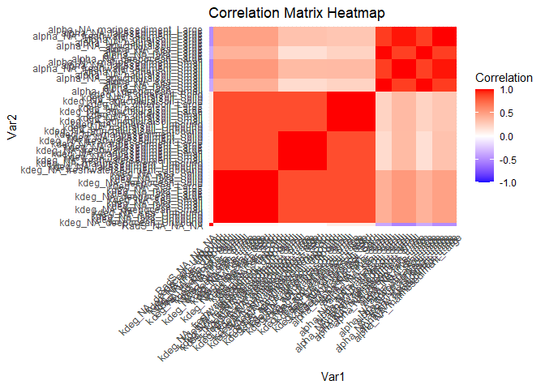

Solver input options
================
2025-08-19

The SteadyState and Dynamic Solver both are capable of using LHS,
correlation for different distributions. Here the currently implemented
distributions are briefly described.

OVERALL WORK IN PROGRESS \[documentation needs to be further updated!\].

## Correlation

### Load data

``` r
# Load the Excel file containing example distributions for variables
Example_vars <- readxl::read_xlsx("data/Examples/Example_uncertain_variables_correlation.xlsx", sheet = "Variable_data")
Correlations <- readxl::read_xlsx("data/Examples/Example_uncertain_variables_correlation.xlsx", sheet = "Correlation")

# Define functions for each row based on the distribution type
varFuns <- World$makeInvFuns(Example_vars)

load("data/Examples/example_uncertain_data.RData")

example_data <- example_data |>
  select(To_Compartment, `2023`, RUN) |>
  rename("Emis" = `2023`) |>
  mutate(Abbr = case_when(
    To_Compartment == "Agricultural soil (micro)" ~ "s2RS",
    To_Compartment == "Residential soil (micro)" ~ "s3RS",
    To_Compartment == "Surface water (micro)" ~ "w1RS"
  )) |>
  mutate(Emis = (Emis*1000000)/(365.25*24*3600)) |> # Convert kt/year to kg/s
  select(-To_Compartment) 
```

### Explanation correlations

Important for using the LHS correlations is providing a correlation
table. This table specifies which variables are correlated, and how
strong the correlation is. The table should have this structure:

``` r
knitr::kable(Correlations)
```

| varName_1 | varName_2 | SubCompart_1 | SubCompart_2 | Species_1 | Species_2 | Scale_1 | Scale_2 | correlation |
|:---|:---|:---|:---|:---|:---|:---|:---|---:|
| kdeg | kdeg | Water | Sediment | NA | NA | NA | NA | 0.85 |
| kdeg | kdeg | Sediment | Soil | NA | NA | NA | NA | 0.85 |
| kdeg | kdeg | Soil | Water | NA | NA | NA | NA | 0.85 |
| alpha | alpha | Water | SoilSediment | Small | Small | NA | NA | 0.90 |
| alpha | alpha | SoilSediment | Water | Small | Small | NA | NA | 0.90 |
| alpha | alpha | Water | SoilSediment | Large | Large | NA | NA | 0.90 |
| alpha | alpha | SoilSediment | Water | Large | Large | NA | NA | 0.90 |
| alpha | alpha | Water | Water | Small | Large | NA | NA | 1.00 |
| alpha | alpha | SoilSediment | SoilSediment | Small | Large | NA | NA | 1.00 |
| alpha | alpha | Water | Water | Large | Small | NA | NA | 1.00 |
| alpha | alpha | SoilSediment | SoilSediment | Large | Small | NA | NA | 1.00 |

When entries in a column are NA, the same correlation is used for all
possible values of that column. In this example, Species and Scale is
NA. This means that the correlation is used for all species (Unbound,
Solid, Aggregated, Attached) and all scales (Regional, Continental,
Arctic, Moderate, Tropic).

Another possibility is to give a correlation for a compartment instead
of a subcompartment. The compartments are:

- Soil

- Water

- Sediment

- Soil_Sediment.

If any of these compartments is chosen, the correlation is used for all
corresponding subcompartments. For example, if Water is entered, the
correlation is used for river, lake, sea and deepocean.

| Compartment | SubCompartments |
|----|----|
| Soil | agriculturalsoil, naturalsoil, othersoil |
| Water | river, lake, sea, deepocean |
| Sediment | freshwatersediment, lakesediment, marinesediment |
| Soil_Sediment | agriculturalsoil, naturalsoil, othersoil, freshwatersediment, lakesediment, marinesediment |

Compartments and corresponding subcompartments

### Solve using correlations

``` r
# Call the steady state solver
World$NewSolver("SteadyStateSolver")

# Solve 
World$Solve(emissions = example_data, var_box_df = Example_vars, var_invFun = varFuns, nRUNs = length(unique(example_data$RUN)), correlations = Correlations)
```

### Plot the correlations

The heatmap below shows that the correlation worked! The variables we
specified in the correlation table are indeed strongly correlated to
each other.

``` r
# Plot correlation matrix to check
library(corrplot)

variable_values <- World$VariableValues() |>
  mutate(varname = paste0(varName, "_", Scale, "_", SubCompart, "_", Species)) |>
  select(varname, Waarde,RUNs) |>
  pivot_wider(names_from = varname, values_from = Waarde)

transformed_lhs <- as.matrix(variable_values)

result_corr_matrix <- cor(transformed_lhs[,-1], 
                          method = "pearson") # correlation matrix

# Visualize Results

# Full correlation matrix heatmap
library(reshape2)
library(ggplot2)

melted_corr_matrix <- melt(result_corr_matrix)

# Calculate and print the mean correlations 
mean_correlations <- melted_corr_matrix |>
  separate(
    Var1, 
    into = c("VarName1", "Scale1", "SubCompart1", "Species1"), 
    sep = "_") |>
    separate(
    Var2, 
    into = c("VarName2", "Scale2", "SubCompart2", "Species2"), 
    sep = "_") |>
  mutate(Compartment1 = case_when(
    str_detect(SubCompart1, "soil") ~ "Soil",
    str_detect(SubCompart1, "sediment") ~ "Sediment",
    SubCompart1 %in% c("air", "cloudwater") ~ "Air", 
    str_detect(SubCompart1, "NA") ~ "NA",
    TRUE ~ "Water"
  )) |>
    mutate(Compartment2 = case_when(
    str_detect(SubCompart2, "soil") ~ "Soil",
    str_detect(SubCompart2, "sediment") ~ "Sediment",
    SubCompart2 %in% c("air", "cloudwater") ~ "Air", 
    str_detect(SubCompart2, "NA") ~ "NA",
    TRUE ~ "Water"
  )) |>
  group_by(VarName1, VarName2, Compartment1, Compartment2, Species1, Species2) |>
  summarise(Mean_correlation = mean(value))

knitr::kable(mean_correlations)
```

| VarName1 | VarName2 | Compartment1 | Compartment2 | Species1 | Species2 | Mean_correlation |
|:---------|:---------|:-------------|:-------------|:---------|:---------|-----------------:|
| RadS     | RadS     | NA           | NA           | NA       | NA       |        1.0000000 |
| RadS     | alpha    | NA           | Sediment     | NA       | Large    |       -0.4899971 |
| RadS     | alpha    | NA           | Sediment     | NA       | Small    |       -0.5302084 |
| RadS     | alpha    | NA           | Soil         | NA       | Large    |       -0.4899971 |
| RadS     | alpha    | NA           | Soil         | NA       | Small    |       -0.5302084 |
| RadS     | alpha    | NA           | Water        | NA       | Large    |       -0.3657059 |
| RadS     | alpha    | NA           | Water        | NA       | Small    |       -0.3762574 |
| RadS     | kdeg     | NA           | Sediment     | NA       | Large    |       -0.0097736 |
| RadS     | kdeg     | NA           | Sediment     | NA       | Small    |       -0.0097736 |
| RadS     | kdeg     | NA           | Sediment     | NA       | Solid    |       -0.0097736 |
| RadS     | kdeg     | NA           | Sediment     | NA       | Unbound  |       -0.0097736 |
| RadS     | kdeg     | NA           | Soil         | NA       | Large    |        0.0923299 |
| RadS     | kdeg     | NA           | Soil         | NA       | Small    |        0.0923299 |
| RadS     | kdeg     | NA           | Soil         | NA       | Solid    |        0.0923299 |
| RadS     | kdeg     | NA           | Soil         | NA       | Unbound  |        0.0923299 |
| RadS     | kdeg     | NA           | Water        | NA       | Large    |        0.0377809 |
| RadS     | kdeg     | NA           | Water        | NA       | Small    |        0.0377809 |
| RadS     | kdeg     | NA           | Water        | NA       | Solid    |        0.0377809 |
| RadS     | kdeg     | NA           | Water        | NA       | Unbound  |        0.0377809 |
| alpha    | RadS     | Sediment     | NA           | Large    | NA       |       -0.4899971 |
| alpha    | RadS     | Sediment     | NA           | Small    | NA       |       -0.5302084 |
| alpha    | RadS     | Soil         | NA           | Large    | NA       |       -0.4899971 |
| alpha    | RadS     | Soil         | NA           | Small    | NA       |       -0.5302084 |
| alpha    | RadS     | Water        | NA           | Large    | NA       |       -0.3657059 |
| alpha    | RadS     | Water        | NA           | Small    | NA       |       -0.3762574 |
| alpha    | alpha    | Sediment     | Sediment     | Large    | Large    |        1.0000000 |
| alpha    | alpha    | Sediment     | Sediment     | Large    | Small    |        0.9827792 |
| alpha    | alpha    | Sediment     | Sediment     | Small    | Large    |        0.9827792 |
| alpha    | alpha    | Sediment     | Sediment     | Small    | Small    |        1.0000000 |
| alpha    | alpha    | Sediment     | Soil         | Large    | Large    |        1.0000000 |
| alpha    | alpha    | Sediment     | Soil         | Large    | Small    |        0.9827792 |
| alpha    | alpha    | Sediment     | Soil         | Small    | Large    |        0.9827792 |
| alpha    | alpha    | Sediment     | Soil         | Small    | Small    |        1.0000000 |
| alpha    | alpha    | Sediment     | Water        | Large    | Large    |        0.8993900 |
| alpha    | alpha    | Sediment     | Water        | Large    | Small    |        0.9058328 |
| alpha    | alpha    | Sediment     | Water        | Small    | Large    |        0.8934375 |
| alpha    | alpha    | Sediment     | Water        | Small    | Small    |        0.9002470 |
| alpha    | alpha    | Soil         | Sediment     | Large    | Large    |        1.0000000 |
| alpha    | alpha    | Soil         | Sediment     | Large    | Small    |        0.9827792 |
| alpha    | alpha    | Soil         | Sediment     | Small    | Large    |        0.9827792 |
| alpha    | alpha    | Soil         | Sediment     | Small    | Small    |        1.0000000 |
| alpha    | alpha    | Soil         | Soil         | Large    | Large    |        1.0000000 |
| alpha    | alpha    | Soil         | Soil         | Large    | Small    |        0.9827792 |
| alpha    | alpha    | Soil         | Soil         | Small    | Large    |        0.9827792 |
| alpha    | alpha    | Soil         | Soil         | Small    | Small    |        1.0000000 |
| alpha    | alpha    | Soil         | Water        | Large    | Large    |        0.8993900 |
| alpha    | alpha    | Soil         | Water        | Large    | Small    |        0.9058328 |
| alpha    | alpha    | Soil         | Water        | Small    | Large    |        0.8934375 |
| alpha    | alpha    | Soil         | Water        | Small    | Small    |        0.9002470 |
| alpha    | alpha    | Water        | Sediment     | Large    | Large    |        0.8993900 |
| alpha    | alpha    | Water        | Sediment     | Large    | Small    |        0.8934375 |
| alpha    | alpha    | Water        | Sediment     | Small    | Large    |        0.9058328 |
| alpha    | alpha    | Water        | Sediment     | Small    | Small    |        0.9002470 |
| alpha    | alpha    | Water        | Soil         | Large    | Large    |        0.8993900 |
| alpha    | alpha    | Water        | Soil         | Large    | Small    |        0.8934375 |
| alpha    | alpha    | Water        | Soil         | Small    | Large    |        0.9058328 |
| alpha    | alpha    | Water        | Soil         | Small    | Small    |        0.9002470 |
| alpha    | alpha    | Water        | Water        | Large    | Large    |        1.0000000 |
| alpha    | alpha    | Water        | Water        | Large    | Small    |        0.9972963 |
| alpha    | alpha    | Water        | Water        | Small    | Large    |        0.9972963 |
| alpha    | alpha    | Water        | Water        | Small    | Small    |        1.0000000 |
| alpha    | kdeg     | Sediment     | Sediment     | Large    | Large    |        0.3154892 |
| alpha    | kdeg     | Sediment     | Sediment     | Large    | Small    |        0.3154892 |
| alpha    | kdeg     | Sediment     | Sediment     | Large    | Solid    |        0.3154892 |
| alpha    | kdeg     | Sediment     | Sediment     | Large    | Unbound  |        0.3154892 |
| alpha    | kdeg     | Sediment     | Sediment     | Small    | Large    |        0.3564023 |
| alpha    | kdeg     | Sediment     | Sediment     | Small    | Small    |        0.3564023 |
| alpha    | kdeg     | Sediment     | Sediment     | Small    | Solid    |        0.3564023 |
| alpha    | kdeg     | Sediment     | Sediment     | Small    | Unbound  |        0.3564023 |
| alpha    | kdeg     | Sediment     | Soil         | Large    | Large    |        0.2975683 |
| alpha    | kdeg     | Sediment     | Soil         | Large    | Small    |        0.2975683 |
| alpha    | kdeg     | Sediment     | Soil         | Large    | Solid    |        0.2975683 |
| alpha    | kdeg     | Sediment     | Soil         | Large    | Unbound  |        0.2975683 |
| alpha    | kdeg     | Sediment     | Soil         | Small    | Large    |        0.3568999 |
| alpha    | kdeg     | Sediment     | Soil         | Small    | Small    |        0.3568999 |
| alpha    | kdeg     | Sediment     | Soil         | Small    | Solid    |        0.3568999 |
| alpha    | kdeg     | Sediment     | Soil         | Small    | Unbound  |        0.3568999 |
| alpha    | kdeg     | Sediment     | Water        | Large    | Large    |        0.4838274 |
| alpha    | kdeg     | Sediment     | Water        | Large    | Small    |        0.4838274 |
| alpha    | kdeg     | Sediment     | Water        | Large    | Solid    |        0.4838274 |
| alpha    | kdeg     | Sediment     | Water        | Large    | Unbound  |        0.4838274 |
| alpha    | kdeg     | Sediment     | Water        | Small    | Large    |        0.5225500 |
| alpha    | kdeg     | Sediment     | Water        | Small    | Small    |        0.5225500 |
| alpha    | kdeg     | Sediment     | Water        | Small    | Solid    |        0.5225500 |
| alpha    | kdeg     | Sediment     | Water        | Small    | Unbound  |        0.5225500 |
| alpha    | kdeg     | Soil         | Sediment     | Large    | Large    |        0.3154892 |
| alpha    | kdeg     | Soil         | Sediment     | Large    | Small    |        0.3154892 |
| alpha    | kdeg     | Soil         | Sediment     | Large    | Solid    |        0.3154892 |
| alpha    | kdeg     | Soil         | Sediment     | Large    | Unbound  |        0.3154892 |
| alpha    | kdeg     | Soil         | Sediment     | Small    | Large    |        0.3564023 |
| alpha    | kdeg     | Soil         | Sediment     | Small    | Small    |        0.3564023 |
| alpha    | kdeg     | Soil         | Sediment     | Small    | Solid    |        0.3564023 |
| alpha    | kdeg     | Soil         | Sediment     | Small    | Unbound  |        0.3564023 |
| alpha    | kdeg     | Soil         | Soil         | Large    | Large    |        0.2975683 |
| alpha    | kdeg     | Soil         | Soil         | Large    | Small    |        0.2975683 |
| alpha    | kdeg     | Soil         | Soil         | Large    | Solid    |        0.2975683 |
| alpha    | kdeg     | Soil         | Soil         | Large    | Unbound  |        0.2975683 |
| alpha    | kdeg     | Soil         | Soil         | Small    | Large    |        0.3568999 |
| alpha    | kdeg     | Soil         | Soil         | Small    | Small    |        0.3568999 |
| alpha    | kdeg     | Soil         | Soil         | Small    | Solid    |        0.3568999 |
| alpha    | kdeg     | Soil         | Soil         | Small    | Unbound  |        0.3568999 |
| alpha    | kdeg     | Soil         | Water        | Large    | Large    |        0.4838274 |
| alpha    | kdeg     | Soil         | Water        | Large    | Small    |        0.4838274 |
| alpha    | kdeg     | Soil         | Water        | Large    | Solid    |        0.4838274 |
| alpha    | kdeg     | Soil         | Water        | Large    | Unbound  |        0.4838274 |
| alpha    | kdeg     | Soil         | Water        | Small    | Large    |        0.5225500 |
| alpha    | kdeg     | Soil         | Water        | Small    | Small    |        0.5225500 |
| alpha    | kdeg     | Soil         | Water        | Small    | Solid    |        0.5225500 |
| alpha    | kdeg     | Soil         | Water        | Small    | Unbound  |        0.5225500 |
| alpha    | kdeg     | Water        | Sediment     | Large    | Large    |        0.1671145 |
| alpha    | kdeg     | Water        | Sediment     | Large    | Small    |        0.1671145 |
| alpha    | kdeg     | Water        | Sediment     | Large    | Solid    |        0.1671145 |
| alpha    | kdeg     | Water        | Sediment     | Large    | Unbound  |        0.1671145 |
| alpha    | kdeg     | Water        | Sediment     | Small    | Large    |        0.1875692 |
| alpha    | kdeg     | Water        | Sediment     | Small    | Small    |        0.1875692 |
| alpha    | kdeg     | Water        | Sediment     | Small    | Solid    |        0.1875692 |
| alpha    | kdeg     | Water        | Sediment     | Small    | Unbound  |        0.1875692 |
| alpha    | kdeg     | Water        | Soil         | Large    | Large    |        0.2317500 |
| alpha    | kdeg     | Water        | Soil         | Large    | Small    |        0.2317500 |
| alpha    | kdeg     | Water        | Soil         | Large    | Solid    |        0.2317500 |
| alpha    | kdeg     | Water        | Soil         | Large    | Unbound  |        0.2317500 |
| alpha    | kdeg     | Water        | Soil         | Small    | Large    |        0.2325286 |
| alpha    | kdeg     | Water        | Soil         | Small    | Small    |        0.2325286 |
| alpha    | kdeg     | Water        | Soil         | Small    | Solid    |        0.2325286 |
| alpha    | kdeg     | Water        | Soil         | Small    | Unbound  |        0.2325286 |
| alpha    | kdeg     | Water        | Water        | Large    | Large    |        0.3983202 |
| alpha    | kdeg     | Water        | Water        | Large    | Small    |        0.3983202 |
| alpha    | kdeg     | Water        | Water        | Large    | Solid    |        0.3983202 |
| alpha    | kdeg     | Water        | Water        | Large    | Unbound  |        0.3983202 |
| alpha    | kdeg     | Water        | Water        | Small    | Large    |        0.4133009 |
| alpha    | kdeg     | Water        | Water        | Small    | Small    |        0.4133009 |
| alpha    | kdeg     | Water        | Water        | Small    | Solid    |        0.4133009 |
| alpha    | kdeg     | Water        | Water        | Small    | Unbound  |        0.4133009 |
| kdeg     | RadS     | Sediment     | NA           | Large    | NA       |       -0.0097736 |
| kdeg     | RadS     | Sediment     | NA           | Small    | NA       |       -0.0097736 |
| kdeg     | RadS     | Sediment     | NA           | Solid    | NA       |       -0.0097736 |
| kdeg     | RadS     | Sediment     | NA           | Unbound  | NA       |       -0.0097736 |
| kdeg     | RadS     | Soil         | NA           | Large    | NA       |        0.0923299 |
| kdeg     | RadS     | Soil         | NA           | Small    | NA       |        0.0923299 |
| kdeg     | RadS     | Soil         | NA           | Solid    | NA       |        0.0923299 |
| kdeg     | RadS     | Soil         | NA           | Unbound  | NA       |        0.0923299 |
| kdeg     | RadS     | Water        | NA           | Large    | NA       |        0.0377809 |
| kdeg     | RadS     | Water        | NA           | Small    | NA       |        0.0377809 |
| kdeg     | RadS     | Water        | NA           | Solid    | NA       |        0.0377809 |
| kdeg     | RadS     | Water        | NA           | Unbound  | NA       |        0.0377809 |
| kdeg     | alpha    | Sediment     | Sediment     | Large    | Large    |        0.3154892 |
| kdeg     | alpha    | Sediment     | Sediment     | Large    | Small    |        0.3564023 |
| kdeg     | alpha    | Sediment     | Sediment     | Small    | Large    |        0.3154892 |
| kdeg     | alpha    | Sediment     | Sediment     | Small    | Small    |        0.3564023 |
| kdeg     | alpha    | Sediment     | Sediment     | Solid    | Large    |        0.3154892 |
| kdeg     | alpha    | Sediment     | Sediment     | Solid    | Small    |        0.3564023 |
| kdeg     | alpha    | Sediment     | Sediment     | Unbound  | Large    |        0.3154892 |
| kdeg     | alpha    | Sediment     | Sediment     | Unbound  | Small    |        0.3564023 |
| kdeg     | alpha    | Sediment     | Soil         | Large    | Large    |        0.3154892 |
| kdeg     | alpha    | Sediment     | Soil         | Large    | Small    |        0.3564023 |
| kdeg     | alpha    | Sediment     | Soil         | Small    | Large    |        0.3154892 |
| kdeg     | alpha    | Sediment     | Soil         | Small    | Small    |        0.3564023 |
| kdeg     | alpha    | Sediment     | Soil         | Solid    | Large    |        0.3154892 |
| kdeg     | alpha    | Sediment     | Soil         | Solid    | Small    |        0.3564023 |
| kdeg     | alpha    | Sediment     | Soil         | Unbound  | Large    |        0.3154892 |
| kdeg     | alpha    | Sediment     | Soil         | Unbound  | Small    |        0.3564023 |
| kdeg     | alpha    | Sediment     | Water        | Large    | Large    |        0.1671145 |
| kdeg     | alpha    | Sediment     | Water        | Large    | Small    |        0.1875692 |
| kdeg     | alpha    | Sediment     | Water        | Small    | Large    |        0.1671145 |
| kdeg     | alpha    | Sediment     | Water        | Small    | Small    |        0.1875692 |
| kdeg     | alpha    | Sediment     | Water        | Solid    | Large    |        0.1671145 |
| kdeg     | alpha    | Sediment     | Water        | Solid    | Small    |        0.1875692 |
| kdeg     | alpha    | Sediment     | Water        | Unbound  | Large    |        0.1671145 |
| kdeg     | alpha    | Sediment     | Water        | Unbound  | Small    |        0.1875692 |
| kdeg     | alpha    | Soil         | Sediment     | Large    | Large    |        0.2975683 |
| kdeg     | alpha    | Soil         | Sediment     | Large    | Small    |        0.3568999 |
| kdeg     | alpha    | Soil         | Sediment     | Small    | Large    |        0.2975683 |
| kdeg     | alpha    | Soil         | Sediment     | Small    | Small    |        0.3568999 |
| kdeg     | alpha    | Soil         | Sediment     | Solid    | Large    |        0.2975683 |
| kdeg     | alpha    | Soil         | Sediment     | Solid    | Small    |        0.3568999 |
| kdeg     | alpha    | Soil         | Sediment     | Unbound  | Large    |        0.2975683 |
| kdeg     | alpha    | Soil         | Sediment     | Unbound  | Small    |        0.3568999 |
| kdeg     | alpha    | Soil         | Soil         | Large    | Large    |        0.2975683 |
| kdeg     | alpha    | Soil         | Soil         | Large    | Small    |        0.3568999 |
| kdeg     | alpha    | Soil         | Soil         | Small    | Large    |        0.2975683 |
| kdeg     | alpha    | Soil         | Soil         | Small    | Small    |        0.3568999 |
| kdeg     | alpha    | Soil         | Soil         | Solid    | Large    |        0.2975683 |
| kdeg     | alpha    | Soil         | Soil         | Solid    | Small    |        0.3568999 |
| kdeg     | alpha    | Soil         | Soil         | Unbound  | Large    |        0.2975683 |
| kdeg     | alpha    | Soil         | Soil         | Unbound  | Small    |        0.3568999 |
| kdeg     | alpha    | Soil         | Water        | Large    | Large    |        0.2317500 |
| kdeg     | alpha    | Soil         | Water        | Large    | Small    |        0.2325286 |
| kdeg     | alpha    | Soil         | Water        | Small    | Large    |        0.2317500 |
| kdeg     | alpha    | Soil         | Water        | Small    | Small    |        0.2325286 |
| kdeg     | alpha    | Soil         | Water        | Solid    | Large    |        0.2317500 |
| kdeg     | alpha    | Soil         | Water        | Solid    | Small    |        0.2325286 |
| kdeg     | alpha    | Soil         | Water        | Unbound  | Large    |        0.2317500 |
| kdeg     | alpha    | Soil         | Water        | Unbound  | Small    |        0.2325286 |
| kdeg     | alpha    | Water        | Sediment     | Large    | Large    |        0.4838274 |
| kdeg     | alpha    | Water        | Sediment     | Large    | Small    |        0.5225500 |
| kdeg     | alpha    | Water        | Sediment     | Small    | Large    |        0.4838274 |
| kdeg     | alpha    | Water        | Sediment     | Small    | Small    |        0.5225500 |
| kdeg     | alpha    | Water        | Sediment     | Solid    | Large    |        0.4838274 |
| kdeg     | alpha    | Water        | Sediment     | Solid    | Small    |        0.5225500 |
| kdeg     | alpha    | Water        | Sediment     | Unbound  | Large    |        0.4838274 |
| kdeg     | alpha    | Water        | Sediment     | Unbound  | Small    |        0.5225500 |
| kdeg     | alpha    | Water        | Soil         | Large    | Large    |        0.4838274 |
| kdeg     | alpha    | Water        | Soil         | Large    | Small    |        0.5225500 |
| kdeg     | alpha    | Water        | Soil         | Small    | Large    |        0.4838274 |
| kdeg     | alpha    | Water        | Soil         | Small    | Small    |        0.5225500 |
| kdeg     | alpha    | Water        | Soil         | Solid    | Large    |        0.4838274 |
| kdeg     | alpha    | Water        | Soil         | Solid    | Small    |        0.5225500 |
| kdeg     | alpha    | Water        | Soil         | Unbound  | Large    |        0.4838274 |
| kdeg     | alpha    | Water        | Soil         | Unbound  | Small    |        0.5225500 |
| kdeg     | alpha    | Water        | Water        | Large    | Large    |        0.3983202 |
| kdeg     | alpha    | Water        | Water        | Large    | Small    |        0.4133009 |
| kdeg     | alpha    | Water        | Water        | Small    | Large    |        0.3983202 |
| kdeg     | alpha    | Water        | Water        | Small    | Small    |        0.4133009 |
| kdeg     | alpha    | Water        | Water        | Solid    | Large    |        0.3983202 |
| kdeg     | alpha    | Water        | Water        | Solid    | Small    |        0.4133009 |
| kdeg     | alpha    | Water        | Water        | Unbound  | Large    |        0.3983202 |
| kdeg     | alpha    | Water        | Water        | Unbound  | Small    |        0.4133009 |
| kdeg     | kdeg     | Sediment     | Sediment     | Large    | Large    |        1.0000000 |
| kdeg     | kdeg     | Sediment     | Sediment     | Large    | Small    |        1.0000000 |
| kdeg     | kdeg     | Sediment     | Sediment     | Large    | Solid    |        1.0000000 |
| kdeg     | kdeg     | Sediment     | Sediment     | Large    | Unbound  |        1.0000000 |
| kdeg     | kdeg     | Sediment     | Sediment     | Small    | Large    |        1.0000000 |
| kdeg     | kdeg     | Sediment     | Sediment     | Small    | Small    |        1.0000000 |
| kdeg     | kdeg     | Sediment     | Sediment     | Small    | Solid    |        1.0000000 |
| kdeg     | kdeg     | Sediment     | Sediment     | Small    | Unbound  |        1.0000000 |
| kdeg     | kdeg     | Sediment     | Sediment     | Solid    | Large    |        1.0000000 |
| kdeg     | kdeg     | Sediment     | Sediment     | Solid    | Small    |        1.0000000 |
| kdeg     | kdeg     | Sediment     | Sediment     | Solid    | Solid    |        1.0000000 |
| kdeg     | kdeg     | Sediment     | Sediment     | Solid    | Unbound  |        1.0000000 |
| kdeg     | kdeg     | Sediment     | Sediment     | Unbound  | Large    |        1.0000000 |
| kdeg     | kdeg     | Sediment     | Sediment     | Unbound  | Small    |        1.0000000 |
| kdeg     | kdeg     | Sediment     | Sediment     | Unbound  | Solid    |        1.0000000 |
| kdeg     | kdeg     | Sediment     | Sediment     | Unbound  | Unbound  |        1.0000000 |
| kdeg     | kdeg     | Sediment     | Soil         | Large    | Large    |        0.8506598 |
| kdeg     | kdeg     | Sediment     | Soil         | Large    | Small    |        0.8506598 |
| kdeg     | kdeg     | Sediment     | Soil         | Large    | Solid    |        0.8506598 |
| kdeg     | kdeg     | Sediment     | Soil         | Large    | Unbound  |        0.8506598 |
| kdeg     | kdeg     | Sediment     | Soil         | Small    | Large    |        0.8506598 |
| kdeg     | kdeg     | Sediment     | Soil         | Small    | Small    |        0.8506598 |
| kdeg     | kdeg     | Sediment     | Soil         | Small    | Solid    |        0.8506598 |
| kdeg     | kdeg     | Sediment     | Soil         | Small    | Unbound  |        0.8506598 |
| kdeg     | kdeg     | Sediment     | Soil         | Solid    | Large    |        0.8506598 |
| kdeg     | kdeg     | Sediment     | Soil         | Solid    | Small    |        0.8506598 |
| kdeg     | kdeg     | Sediment     | Soil         | Solid    | Solid    |        0.8506598 |
| kdeg     | kdeg     | Sediment     | Soil         | Solid    | Unbound  |        0.8506598 |
| kdeg     | kdeg     | Sediment     | Soil         | Unbound  | Large    |        0.8506598 |
| kdeg     | kdeg     | Sediment     | Soil         | Unbound  | Small    |        0.8506598 |
| kdeg     | kdeg     | Sediment     | Soil         | Unbound  | Solid    |        0.8506598 |
| kdeg     | kdeg     | Sediment     | Soil         | Unbound  | Unbound  |        0.8506598 |
| kdeg     | kdeg     | Sediment     | Water        | Large    | Large    |        0.8501388 |
| kdeg     | kdeg     | Sediment     | Water        | Large    | Small    |        0.8501388 |
| kdeg     | kdeg     | Sediment     | Water        | Large    | Solid    |        0.8501388 |
| kdeg     | kdeg     | Sediment     | Water        | Large    | Unbound  |        0.8501388 |
| kdeg     | kdeg     | Sediment     | Water        | Small    | Large    |        0.8501388 |
| kdeg     | kdeg     | Sediment     | Water        | Small    | Small    |        0.8501388 |
| kdeg     | kdeg     | Sediment     | Water        | Small    | Solid    |        0.8501388 |
| kdeg     | kdeg     | Sediment     | Water        | Small    | Unbound  |        0.8501388 |
| kdeg     | kdeg     | Sediment     | Water        | Solid    | Large    |        0.8501388 |
| kdeg     | kdeg     | Sediment     | Water        | Solid    | Small    |        0.8501388 |
| kdeg     | kdeg     | Sediment     | Water        | Solid    | Solid    |        0.8501388 |
| kdeg     | kdeg     | Sediment     | Water        | Solid    | Unbound  |        0.8501388 |
| kdeg     | kdeg     | Sediment     | Water        | Unbound  | Large    |        0.8501388 |
| kdeg     | kdeg     | Sediment     | Water        | Unbound  | Small    |        0.8501388 |
| kdeg     | kdeg     | Sediment     | Water        | Unbound  | Solid    |        0.8501388 |
| kdeg     | kdeg     | Sediment     | Water        | Unbound  | Unbound  |        0.8501388 |
| kdeg     | kdeg     | Soil         | Sediment     | Large    | Large    |        0.8506598 |
| kdeg     | kdeg     | Soil         | Sediment     | Large    | Small    |        0.8506598 |
| kdeg     | kdeg     | Soil         | Sediment     | Large    | Solid    |        0.8506598 |
| kdeg     | kdeg     | Soil         | Sediment     | Large    | Unbound  |        0.8506598 |
| kdeg     | kdeg     | Soil         | Sediment     | Small    | Large    |        0.8506598 |
| kdeg     | kdeg     | Soil         | Sediment     | Small    | Small    |        0.8506598 |
| kdeg     | kdeg     | Soil         | Sediment     | Small    | Solid    |        0.8506598 |
| kdeg     | kdeg     | Soil         | Sediment     | Small    | Unbound  |        0.8506598 |
| kdeg     | kdeg     | Soil         | Sediment     | Solid    | Large    |        0.8506598 |
| kdeg     | kdeg     | Soil         | Sediment     | Solid    | Small    |        0.8506598 |
| kdeg     | kdeg     | Soil         | Sediment     | Solid    | Solid    |        0.8506598 |
| kdeg     | kdeg     | Soil         | Sediment     | Solid    | Unbound  |        0.8506598 |
| kdeg     | kdeg     | Soil         | Sediment     | Unbound  | Large    |        0.8506598 |
| kdeg     | kdeg     | Soil         | Sediment     | Unbound  | Small    |        0.8506598 |
| kdeg     | kdeg     | Soil         | Sediment     | Unbound  | Solid    |        0.8506598 |
| kdeg     | kdeg     | Soil         | Sediment     | Unbound  | Unbound  |        0.8506598 |
| kdeg     | kdeg     | Soil         | Soil         | Large    | Large    |        1.0000000 |
| kdeg     | kdeg     | Soil         | Soil         | Large    | Small    |        1.0000000 |
| kdeg     | kdeg     | Soil         | Soil         | Large    | Solid    |        1.0000000 |
| kdeg     | kdeg     | Soil         | Soil         | Large    | Unbound  |        1.0000000 |
| kdeg     | kdeg     | Soil         | Soil         | Small    | Large    |        1.0000000 |
| kdeg     | kdeg     | Soil         | Soil         | Small    | Small    |        1.0000000 |
| kdeg     | kdeg     | Soil         | Soil         | Small    | Solid    |        1.0000000 |
| kdeg     | kdeg     | Soil         | Soil         | Small    | Unbound  |        1.0000000 |
| kdeg     | kdeg     | Soil         | Soil         | Solid    | Large    |        1.0000000 |
| kdeg     | kdeg     | Soil         | Soil         | Solid    | Small    |        1.0000000 |
| kdeg     | kdeg     | Soil         | Soil         | Solid    | Solid    |        1.0000000 |
| kdeg     | kdeg     | Soil         | Soil         | Solid    | Unbound  |        1.0000000 |
| kdeg     | kdeg     | Soil         | Soil         | Unbound  | Large    |        1.0000000 |
| kdeg     | kdeg     | Soil         | Soil         | Unbound  | Small    |        1.0000000 |
| kdeg     | kdeg     | Soil         | Soil         | Unbound  | Solid    |        1.0000000 |
| kdeg     | kdeg     | Soil         | Soil         | Unbound  | Unbound  |        1.0000000 |
| kdeg     | kdeg     | Soil         | Water        | Large    | Large    |        0.8500681 |
| kdeg     | kdeg     | Soil         | Water        | Large    | Small    |        0.8500681 |
| kdeg     | kdeg     | Soil         | Water        | Large    | Solid    |        0.8500681 |
| kdeg     | kdeg     | Soil         | Water        | Large    | Unbound  |        0.8500681 |
| kdeg     | kdeg     | Soil         | Water        | Small    | Large    |        0.8500681 |
| kdeg     | kdeg     | Soil         | Water        | Small    | Small    |        0.8500681 |
| kdeg     | kdeg     | Soil         | Water        | Small    | Solid    |        0.8500681 |
| kdeg     | kdeg     | Soil         | Water        | Small    | Unbound  |        0.8500681 |
| kdeg     | kdeg     | Soil         | Water        | Solid    | Large    |        0.8500681 |
| kdeg     | kdeg     | Soil         | Water        | Solid    | Small    |        0.8500681 |
| kdeg     | kdeg     | Soil         | Water        | Solid    | Solid    |        0.8500681 |
| kdeg     | kdeg     | Soil         | Water        | Solid    | Unbound  |        0.8500681 |
| kdeg     | kdeg     | Soil         | Water        | Unbound  | Large    |        0.8500681 |
| kdeg     | kdeg     | Soil         | Water        | Unbound  | Small    |        0.8500681 |
| kdeg     | kdeg     | Soil         | Water        | Unbound  | Solid    |        0.8500681 |
| kdeg     | kdeg     | Soil         | Water        | Unbound  | Unbound  |        0.8500681 |
| kdeg     | kdeg     | Water        | Sediment     | Large    | Large    |        0.8501388 |
| kdeg     | kdeg     | Water        | Sediment     | Large    | Small    |        0.8501388 |
| kdeg     | kdeg     | Water        | Sediment     | Large    | Solid    |        0.8501388 |
| kdeg     | kdeg     | Water        | Sediment     | Large    | Unbound  |        0.8501388 |
| kdeg     | kdeg     | Water        | Sediment     | Small    | Large    |        0.8501388 |
| kdeg     | kdeg     | Water        | Sediment     | Small    | Small    |        0.8501388 |
| kdeg     | kdeg     | Water        | Sediment     | Small    | Solid    |        0.8501388 |
| kdeg     | kdeg     | Water        | Sediment     | Small    | Unbound  |        0.8501388 |
| kdeg     | kdeg     | Water        | Sediment     | Solid    | Large    |        0.8501388 |
| kdeg     | kdeg     | Water        | Sediment     | Solid    | Small    |        0.8501388 |
| kdeg     | kdeg     | Water        | Sediment     | Solid    | Solid    |        0.8501388 |
| kdeg     | kdeg     | Water        | Sediment     | Solid    | Unbound  |        0.8501388 |
| kdeg     | kdeg     | Water        | Sediment     | Unbound  | Large    |        0.8501388 |
| kdeg     | kdeg     | Water        | Sediment     | Unbound  | Small    |        0.8501388 |
| kdeg     | kdeg     | Water        | Sediment     | Unbound  | Solid    |        0.8501388 |
| kdeg     | kdeg     | Water        | Sediment     | Unbound  | Unbound  |        0.8501388 |
| kdeg     | kdeg     | Water        | Soil         | Large    | Large    |        0.8500681 |
| kdeg     | kdeg     | Water        | Soil         | Large    | Small    |        0.8500681 |
| kdeg     | kdeg     | Water        | Soil         | Large    | Solid    |        0.8500681 |
| kdeg     | kdeg     | Water        | Soil         | Large    | Unbound  |        0.8500681 |
| kdeg     | kdeg     | Water        | Soil         | Small    | Large    |        0.8500681 |
| kdeg     | kdeg     | Water        | Soil         | Small    | Small    |        0.8500681 |
| kdeg     | kdeg     | Water        | Soil         | Small    | Solid    |        0.8500681 |
| kdeg     | kdeg     | Water        | Soil         | Small    | Unbound  |        0.8500681 |
| kdeg     | kdeg     | Water        | Soil         | Solid    | Large    |        0.8500681 |
| kdeg     | kdeg     | Water        | Soil         | Solid    | Small    |        0.8500681 |
| kdeg     | kdeg     | Water        | Soil         | Solid    | Solid    |        0.8500681 |
| kdeg     | kdeg     | Water        | Soil         | Solid    | Unbound  |        0.8500681 |
| kdeg     | kdeg     | Water        | Soil         | Unbound  | Large    |        0.8500681 |
| kdeg     | kdeg     | Water        | Soil         | Unbound  | Small    |        0.8500681 |
| kdeg     | kdeg     | Water        | Soil         | Unbound  | Solid    |        0.8500681 |
| kdeg     | kdeg     | Water        | Soil         | Unbound  | Unbound  |        0.8500681 |
| kdeg     | kdeg     | Water        | Water        | Large    | Large    |        1.0000000 |
| kdeg     | kdeg     | Water        | Water        | Large    | Small    |        1.0000000 |
| kdeg     | kdeg     | Water        | Water        | Large    | Solid    |        1.0000000 |
| kdeg     | kdeg     | Water        | Water        | Large    | Unbound  |        1.0000000 |
| kdeg     | kdeg     | Water        | Water        | Small    | Large    |        1.0000000 |
| kdeg     | kdeg     | Water        | Water        | Small    | Small    |        1.0000000 |
| kdeg     | kdeg     | Water        | Water        | Small    | Solid    |        1.0000000 |
| kdeg     | kdeg     | Water        | Water        | Small    | Unbound  |        1.0000000 |
| kdeg     | kdeg     | Water        | Water        | Solid    | Large    |        1.0000000 |
| kdeg     | kdeg     | Water        | Water        | Solid    | Small    |        1.0000000 |
| kdeg     | kdeg     | Water        | Water        | Solid    | Solid    |        1.0000000 |
| kdeg     | kdeg     | Water        | Water        | Solid    | Unbound  |        1.0000000 |
| kdeg     | kdeg     | Water        | Water        | Unbound  | Large    |        1.0000000 |
| kdeg     | kdeg     | Water        | Water        | Unbound  | Small    |        1.0000000 |
| kdeg     | kdeg     | Water        | Water        | Unbound  | Solid    |        1.0000000 |
| kdeg     | kdeg     | Water        | Water        | Unbound  | Unbound  |        1.0000000 |

``` r
ggplot(melted_corr_matrix, aes(x = Var1, y = Var2, fill = value)) +
  geom_tile() +
  scale_fill_gradient2(low = "blue", high = "red", mid = "white", midpoint = 0,
                       limit = c(-1, 1), name = "Correlation") +
  theme_minimal() +
  theme(axis.text.x = element_text(angle = 45, vjust = 1, hjust = 1)) +
  ggtitle("Correlation Matrix Heatmap")
```

<!-- -->
