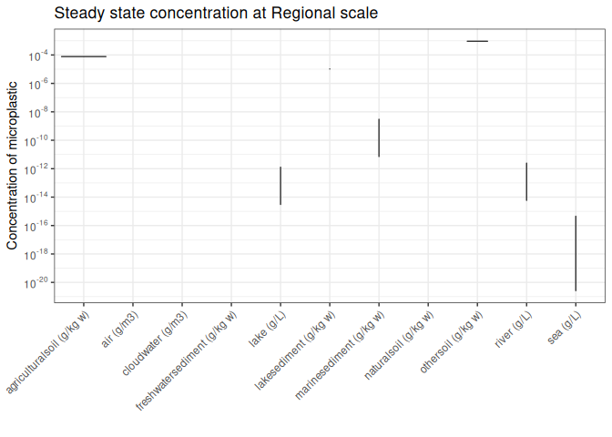
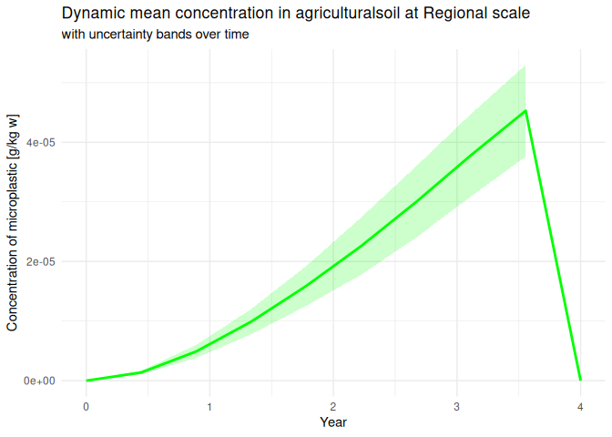

SBoo Solver use
================
Anne Hids, Jaap Slootweg, Joris Quik
2026-08-04

SimpleBox (SBoo) has specific solvers available that allow running the
model deterministic or probabilistic. We assume you already understand
the basics of using SimpleBox and have an idea of what input variables
or emissions you want to input with a certain degree of uncertainty or
variability. There are basically two types of solvers to use here:

1.  SteadyState solver for calculating the steady state mass at infinite
    time horizon (deterministic or probabilistic).
2.  DynamicSolver for calculating the time explicit mass based on a time
    varying emission scenario (deterministic or probabilistic).

Below are examples of using the SteadyState or Dynamic solvers both
deterministically or probabilistically.

## Requirements

First, we will load the necessary packages and initialize the world for
the default substance, which is a molecule. If you want to initialize
the World for a different type of substance, specify the name of the
substance (i.e. “microplastic”) before sourcing the initWorld.R script.

``` r
source("baseScripts/installRequirements.R")

substance <- "default substance"

source("baseScripts/initWorld.R")
```

    ## Using default data to setup World.

# Steady state solver

A steady state solver calculates the masses in each environmental
compartment (i.e. air, riverwater, naturalsoil) at each scale (i.e.
Regional, Continental) and for each species (U, S, A, P) when the system
has reached an equilibrium of in- and outflows from a compartment
reaching steady state.

There are two ways to use the steady state solver: deterministic (solve
once with one set of emissions and one set of substance/landscape
variables), or probabilistic (solve multiple times, once for each run
with uncertain substance variables and optionally uncertain emissions).

## Use the steady state solver deterministically

We already initialized the World in the previous chunk. This is not done
for a specific substances, the World was initialized for a ‘default
substance’, which behaves as a molecule.

As we will not vary any substance variables when using the deterministic
steady state solver, we only need to make a dataframe containing the
emissions for 1 or more emission compartments. This dataframe should
contain two columns:

- ‘Abbr’, which contains the abbreviations for the compartments

- ‘Emis’, which contains the emissions to the compartments, in kg/s.

To see the abbreviations and their meaning, you can run
\`World\$states\$asDataFrame\`.

``` r
# Create the steady state emission dataframe
emissions <- data.frame(Abbr = c("aRU", "s2RU", "w1RU"), Emis = c(10000, 10000, 10000)) 

# convert 1 t/y to si units: kg/s
emissions <- emissions |>
  mutate(Emis = Emis*1000/(365*24*60*60)) 
```

Now we will initialize the solver, with is “SteadyStateSolver” for all
steady state calculations. Consequently, we will use the `World$Solve()`
function to calculate the masses in each compartment. The input to
`World$Solve()` depends on the selected solver, but always requires the
`emissions` to be defined, other parameters are needed when solving
probabilisticaly, see below.

``` r
# Define the solver function to use. For steady state calculations, this is always "SteadyStateSolver"
World$NewSolver("SteadyStateSolver")

# Solve with the emissions we defined in the previous chunk
World$Solve(emissions = emissions)
```

Finally we can retrieve the masses and concentrations in each
compartment from the World object by using `World$Masses()` and
`World$Concentration()`. You can also retrieve the used emissions:
`World$Emissions()`.

``` r
# Get the solution(=mass per compartment), emissions and concentrations from 'World'
solution <- World$Masses()
emission <- World$Emissions()
concentration <- World$Concentration()
K_matrix <- World$K_matrix()
k <- World$K_process_df()
```

Finally, we can plot the outcome using the predefined plot functions. If
there is no scale specified, the Regional scale will be selected.
Selecting one or more subcomparts is optional. If no subcomparts are
given, the outcome is plotted for all subcomparts.

``` r
# Plot concentrations at regional scale
World$PlotConcentration(scale = "Regional")
```

<!-- -->

``` r
World$PlotConcentration(scale = "Continental", subcompart = c("agriculturalsoil", "naturalsoil", "othersoil"))
```

<!-- -->

``` r
# Plot mass at continental scale 
World$PlotMasses(scale = "Regional")
```

<!-- -->

``` r
# Plot the mass distribution
World$PlotMassDistribution(scale = "Regional")
```

<!-- -->

    ## TableGrob (2 x 1) "arrange": 2 grobs
    ##   z     cells    name           grob
    ## 1 1 (1-1,1-1) arrange gtable[layout]
    ## 2 2 (2-2,1-1) arrange gtable[layout]

## Use the steady state solver probabilistically

Here the steady state probabilistic solver is demonstrated for a generic
microplastic particle.

When the World is initialized for particulates or plastics, the
emissions go to the “S”, “A” and/or “P” species (this is unlike
emissions for molecules, where the emissions go to the “U” species).

| Abbreviation | Full species name |
|-------------:|-------------------|
|            U | Unbound           |
|            S | Solid             |
|            A | Aggregated        |
|            P | Attached          |

Table showing species abbreviations and the corresponding species names.

``` r
substance <- "microplastic"
source('baseScripts/initWorld.R')
```

    ## Using default data to setup World.

For the probabilistic steady state solver, the emissions need to be
given as a dataframe with three columns:

- ‘Abbr’, which contains the abbreviations for the compartments

- ‘Emis’, which contains the emissions to the compartments, in kg/s

- ‘RUN’, which contains the run number of the emission.

This example uses 20 output runs of a DPFMA (Dynamic Probabilistic
Material Flow Analysis) model. This data is loaded first, and then
transformed to the required format.

(Alternatively, if you want one set of emissions but vary the values for
variables, you can use one emission dataframe as in the example for the
deterministic steady state solver. Then the solver will use the same set
of emissions for each run, but vary variable values.)

``` r
load("data/Examples/example_uncertain_data.RData")

# Example of an emission dataframe formatted for for use in SimpleBox
example_data <- example_data |>
  # Select the emission compartment, year of analysis and RUN for one microplastic and scale.
  dplyr::select(To_Compartment, `2023`, RUN) |>
  # Change the name of column with emission values to "Emis"
  rename("Emis" = `2023`) |>
  # Add the abreviations with the key for compartment, scale and species
  mutate(Abbr = case_when(
    To_Compartment == "Agricultural soil (micro)" ~ "s2RS",
    To_Compartment == "Residential soil (micro)" ~ "s3RS",
    To_Compartment == "Surface water (micro)" ~ "w1RS"
  )) |>
  # Convert kt/year to kg/s
  mutate(Emis = (Emis*1000000)/(365.25*24*3600)) |> 
  dplyr::select(-To_Compartment) # leave out original compartment name
```

Variable values can be varied over runs by specifying the variable name,
the type of distribution and distribution parameters (optionally also
the Species, Scale and SubCompart). To see the variable names and which
other variables are needed for the value, see i.e.
`World$fetchData("kdeg")`.

In the chunk below, an Excel file is read in containing the needed
values for 2 variables. Consequently, a distribution is created for each
row in the dataframe.

``` r
# Load the Excel file containing example distributions for variables
Example_vars <- readxl::read_xlsx("data/Examples/Example_uncertain_variables.xlsx", sheet = "Variable_data")

varFuns <- World$makeInvFuns(Example_vars)
```

Using the same SteadyStateSolver as above, World\$Solve needs some more
parameters to run probabilistically:

- emissions: Dataframe with Emis (kg/s), RUN (1:n) and Abbr (SB
  compartment abreviations)

- var_box_df: Dataframe with SB variable (varName), scope (Scale,
  SubCompart, Species) and Distribution with relevant parameters (a, b,
  c or d) defined.

- var_invFun: The relevant probability distribution functions using the
  distribution specific parameters from var_box_df in a list
  <!--# Why this extra step? Either exchange the abc with the distribution function in a new var_infFun column in var_box_df. Now the link between the var_box_df and var_invFun is lost! -->

- nRUNs: the number of runs (should match the number of RUNs in the
  emissions dataframe provided).

Now we can solve and get the solution, variable values, concentration
and emissions.

``` r
# Call the steady state solver
World$NewSolver("SteadyStateSolver")

# Solve 
World$Solve(emissions = example_data, var_box_df = Example_vars, var_invFun = varFuns, nRUNs = length(unique(example_data$RUN)))

# Get the outcomes from World
solution = World$Masses() # steady state mass in each compartment
concentration = World$Concentration() # concentration in each compartment
variable_values = World$VariableValues() # the variables for which probabilistic distribution was set
emission = World$Emissions() # Emissions as used
Kmatrices = World$K_matrix() # the full K matrix, e.g. relevant for Fate Factors
proces_k = World$K_process_df() # The full set of rate constantants used to creat K_matrix
```

Finally, we can plot the outcome using the predefined plot functions.

``` r
# Plot concentrations at regional scale
World$PlotConcentration(scale = "Regional")
```

<!-- -->

``` r
# Plot solution at continental scale 
World$PlotMasses(scale = "Regional")
```

<!-- -->

``` r
# Plot the mass distribution
World$PlotMassDistribution(scale = "Regional")
```

<!-- -->

    ## TableGrob (2 x 1) "arrange": 2 grobs
    ##   z     cells    name           grob
    ## 1 1 (1-1,1-1) arrange gtable[layout]
    ## 2 2 (2-2,1-1) arrange gtable[layout]

``` r
World$PlotMassDistribution(scale = "Moderate")
```

<!-- -->

    ## TableGrob (2 x 1) "arrange": 2 grobs
    ##   z     cells    name           grob
    ## 1 1 (1-1,1-1) arrange gtable[layout]
    ## 2 2 (2-2,1-1) arrange gtable[layout]

### Steady state probabilistically with emissions as a set of probability distributions

In addition to the above example where the emissions are set as constant
one can set the emission per RUN, for instance using probability
distributions. World\$Solve needs the following variables to solve
steady state probabilistically with a set of emission distributions (e.g
normal, triangular).
<!--# The potential distributions need to be described somewhere and the variables a, b, c, d clearly documented, defined in fGeneral.R in SBoo. -->

- emissions: a set of emission distributions

- var_box_df: a dataframe with the example variables

- var_invFun: the functions created from the var_box_df in a list

- nRUNs: the number of runs (should match the number of RUNs in the
  emissions dataframe provided).

Now we can solve and get the solution, variable values, concentration
and emissions.

#### Prepare variable samples

For each variable that is uncertain you can define the distribution type
(triangular, uniform or normal) and the corresponding parameters. For
this example, an example excel file will be read in containing the
necessary parameters for the variables we want to vary.

``` r
substance <- "microplastic"
source("baseScripts/initWorld.R")  
```

    ## Using default data to setup World.

``` r
# Load the Excel file containing example distributions for variablese 
Example_vars <- readxl::read_xlsx("data/Examples/Example_uncertain_variables.xlsx", sheet = "Variable_data")  

# Define functions for each row based on the distribution type 
varFuns <- World$makeInvFuns(Example_vars)
```

#### Prepare emission data

In this example, we will take a steady state emission data frame as the
starting point for creating the triangular distributions.

``` r
# Create the steady state emission dataframe 
emissions <- data.frame(Abbr = c("aRS", "s2RS", "w1RS"), Emis = c(10000, 10000, 10000))  

# convert 1 t/y to si units: kg/s 
emissions <- emissions |>   mutate(Emis = Emis*1000/(365*24*60*60))
```

We can take the emission dataframe in the chunk above and define a
(min), b (max) and c (peak) and the distribution type for each
compartment. Consequently, the `World$makeInvFuns()` function is used to
create the emission functions.

``` r
emissions$a <- emissions$Emis * 0.7 
emissions$b <- emissions$Emis * 1.3 
emissions$c <- emissions$Emis 
emissions$Distribution <- "triangular"  
emisFuns <- World$makeInvFuns(emissions) 
names(emisFuns) <- emissions$Abbr
```

Now we can solve and get the solution, variable values, concentration
and emissions. We can also plot the outcome using the built-in plot
functions.

``` r
# The number of samples you want to pull from the distributions for each variable 
n_samples <- 20  
World$NewSolver("SteadyStateSolver")  
World$Solve(emissions = emisFuns, 
            var_box_df = Example_vars, 
            var_invFun = varFuns, 
            nRUNs = n_samples)  

sol <- World$Masses() 
conc <- World$Concentration() 
k <- World$K_process_df()

World$PlotConcentration()
```

    ## [1] "No scale was given to function, Regional scale is selected"

<!-- -->

### Solve probabilistically with one set of emissions

Below we solve with one set of emissions but the same uncertain
variables as above.

``` r
substance <- "microplastic"
source("baseScripts/initWorld.R")  
```

    ## Running SimpleBox for microplastic

    ## Using default data to setup World.

    ## initWorld: Degradation calculation for particles uses Default approach.

    ## initWorld: Drag method for calculation of particle settling velocities uses Original approach.

    ## Warning: R6SBcore: For Kaers no rows calculated. Check, but probably not
    ## needed.

    ## Warning: R6SBcore: For Kacompw no rows calculated. Check, but probably not
    ## needed.

    ## Warning: R6SBcore: For KocDorC no rows calculated. Check, but probably not
    ## needed.

    ## Warning: KswDorC: pKa is needed but missing, setting pKa=7

    ## Warning: R6SBcore: For KocAltDorC no rows calculated. Check, but probably not
    ## needed.

    ## Warning: R6SBcore: For Kaerw no rows calculated. Check, but probably not
    ## needed.

    ## Warning: R6SBcore: For KswDorC no rows calculated. Check, but probably not
    ## needed.

    ## Warning: R6SBcore: For Ksw.alt no rows calculated. Check, but probably not
    ## needed.

    ## Warning: v_D: Kow is NA, to continue Kow set to 18 by default.
    ## Warning: v_D: Kow is NA, to continue Kow set to 18 by default.
    ## Warning: v_D: Kow is NA, to continue Kow set to 18 by default.
    ## Warning: v_D: Kow is NA, to continue Kow set to 18 by default.
    ## Warning: v_D: Kow is NA, to continue Kow set to 18 by default.
    ## Warning: v_D: Kow is NA, to continue Kow set to 18 by default.
    ## Warning: v_D: Kow is NA, to continue Kow set to 18 by default.
    ## Warning: v_D: Kow is NA, to continue Kow set to 18 by default.
    ## Warning: v_D: Kow is NA, to continue Kow set to 18 by default.
    ## Warning: v_D: Kow is NA, to continue Kow set to 18 by default.
    ## Warning: v_D: Kow is NA, to continue Kow set to 18 by default.
    ## Warning: v_D: Kow is NA, to continue Kow set to 18 by default.

    ## Warning: R6SBcore: For FRingas no rows calculated. Check, but probably not
    ## needed.

    ## Warning: R6SBcore: For Kp no rows calculated. Check, but probably not needed.

    ## Warning: R6SBcore: For FRinw no rows calculated. Check, but probably not
    ## needed.

    ## Warning: R6SBcore: For Kscompw no rows calculated. Check, but probably not
    ## needed.

``` r
# Filter the emission dataset used earlier for the first run only. It is important to keep the RUN column! 
emission_test <- example_data |>
  filter(RUN == 1)

# The number of samples you want to pull from the distributions for each variable 
n_samples <- 20  
World$NewSolver("SteadyStateSolver")  
World$Solve(emissions = emission_test, 
            var_box_df = Example_vars, 
            var_invFun = varFuns, 
            nRUNs = n_samples)  
```

    ## 143 rate constants (k values) equal to 0; removed for solver

    ## 173 rate constants (k values) equal to 0; removed for solver
    ## 173 rate constants (k values) equal to 0; removed for solver
    ## 173 rate constants (k values) equal to 0; removed for solver
    ## 173 rate constants (k values) equal to 0; removed for solver
    ## 173 rate constants (k values) equal to 0; removed for solver
    ## 173 rate constants (k values) equal to 0; removed for solver
    ## 173 rate constants (k values) equal to 0; removed for solver
    ## 173 rate constants (k values) equal to 0; removed for solver
    ## 173 rate constants (k values) equal to 0; removed for solver
    ## 173 rate constants (k values) equal to 0; removed for solver
    ## 173 rate constants (k values) equal to 0; removed for solver
    ## 173 rate constants (k values) equal to 0; removed for solver
    ## 173 rate constants (k values) equal to 0; removed for solver
    ## 173 rate constants (k values) equal to 0; removed for solver
    ## 173 rate constants (k values) equal to 0; removed for solver
    ## 173 rate constants (k values) equal to 0; removed for solver
    ## 173 rate constants (k values) equal to 0; removed for solver
    ## 173 rate constants (k values) equal to 0; removed for solver
    ## 173 rate constants (k values) equal to 0; removed for solver
    ## 173 rate constants (k values) equal to 0; removed for solver

``` r
sol <- World$Masses() 
conc <- World$Concentration() 
```

    ## Joining with `by = join_by(Scale, SubCompart)`

``` r
emis <- World$Emissions()

World$PlotConcentration()
```

    ## Joining with `by = join_by(Scale, SubCompart)`

    ## [1] "No scale was given to function, Regional scale is selected"

    ## Joining with `by = join_by(Scale, SubCompart)`

    ## Warning in scale_y_log10(breaks = scales::trans_breaks("log10", function(x)
    ## 10^x, : log-10 transformation introduced infinite values.

    ## Warning: Removed 59 rows containing non-finite outside the scale range
    ## (`stat_ydensity()`).

    ## Warning: Groups with fewer than two datapoints have been dropped.
    ## ℹ Set `drop = FALSE` to consider such groups for position adjustment purposes.

<!-- -->

## Dynamic solver

SimpleBox can also solve the K matrix with semi-dynamically using time
variable emissions. To do this, one needs to use the DynamicSolver. This
is demonstrated below or microplastics:

``` r
substance <- "microplastic"
source('baseScripts/initWorld.R')
```

    ## Using default data to setup World.

As in steady state, one can do dynamic analysis deterministically or
probabilistically.

### Use the dynamic solver deterministically

For the dynamic deterministic solver, the emissions need to be given as
a dataframe with three columns:

- ‘Abbr’, which contains the abbreviations for the compartments

- ‘Emis’, which contains the emissions to the compartments, in kg/s

- ‘Time’, which contains the time of the emission in seconds.

``` r
# Initialize emissions in t/y
emissions <- 
  # create emission scenario in time:
  data.frame(Emis = c(10,20, 1,0,0), # emission in tones per year (converted to kg/s later)
             Time = c(1,5,10,15,20))  # years from start
# apply emission scenario to intended species and compartments using hte Abbr:
emissions <- merge(emissions, data.frame(Abbr = c("aRS", "s2RS", "w1RS")))

# convert 1 t/y to si units: kg/s
emissions <- emissions |>
  mutate(Emis = Emis*1000/(365.25*24*60*60),
    Time = Time*(365.25*24*60*60)) |> ungroup()
```

World\$Solve needs the following variables to solve dynamically
deterministically:

- emissions: the emissions dataframe

- tmax: the end time for running the solver, in seconds

- nTIMES: the number of calculation time steps.

Now we can solve and get the solution, concentration and emissions.

``` r
tmax <- max(emissions$Time) # set max solve time to last step in emission scenario
tmin <- min(emissions$Time)
nTIMES <- 1+max(emissions$Time)/(365.25*24*60*60) # Sets the time step for output, e.g. for 19 year scenario from year 1 to 20, add t1 is 20 nTimes

# Initialize the dynamic solver
World$NewSolver("DynamicSolver")
World$Solve(emissions = emissions, tmax = tmax, tmin=tmin, nTIMES = nTIMES)
solution <- World$Masses()
emission <- World$Emissions()
concentration <- World$Concentration()
Kmatrices = World$K_matrix()
k = World$K_process_df()
```

Finally, we can plot the outcome using the predefined plot functions. If
there is no scale specified, the Regional scale will be selected.
Selecting one or more subcomparts is optional. If no subcomparts are
given, the outcome is plotted for all subcomparts.

``` r
# You can specify a scale and a subcompartment
World$PlotMasses(scale = "Regional", subcompart = "agriculturalsoil")
```

<!-- -->

``` r
# Or just a scale and all subcompartments are plotted:
World$PlotMasses(scale = "Regional")
```

<!-- -->

``` r
# Plot all concentrations at regional scale
World$PlotConcentration(scale = "Regional")
```

<!-- -->

``` r
# plot(emissions$Time,emissions$Emis)
```

### Use the dynamic solver probabilistically

For the dynamic deterministic solver, the emissions need to be given as
a dataframe with three columns:

- ‘Abbr’, which contains the abbreviations for the compartments

- ‘Emis’, which contains the emissions to the compartments, in kg/s

- ‘Time’, which contains the time of the emission in seconds,

- ‘RUN’, which contains the run number of the emission.

``` r
substance <- "microplastic"
source('baseScripts/initWorld.R')
```

    ## Using default data to setup World.

``` r
load("data/Examples/example_uncertain_data.RData")

example_data <- 
  example_data |>
  select(To_Compartment, `2020`, `2021`,`2022`, `2023`, RUN) |>
  pivot_longer(!c(To_Compartment, RUN), names_to = "year", values_to = "Emis") |>
  mutate(Abbr = case_when(
    To_Compartment == "Agricultural soil (micro)" ~ "s2RS",
    To_Compartment == "Residential soil (micro)" ~ "s3RS",
    To_Compartment == "Surface water (micro)" ~ "w1RS"
  )) |>
  select(-To_Compartment) |>
  mutate(Time = ((as.numeric(year))*365.25*24*3600)) |>
  mutate(Emis = (Emis*1000000)/(365.25*24*3600)) |> # Convert kt/year to kg/s
  select(-year)

# The raw emission data from 2020 to 2023 will not solve due to instability in the intital state starting at 0. This can be solved by starting at t=0 and mass=0 see below:

example_data <-
  example_data |> 
  mutate(Time = Time - 2019*365.25*24*3600) |> # converting to 0 being one year before 2020
  full_join(expand.grid(Abbr = unique(example_data$Abbr), 
                        RUN = c(1:20)) |> 
              mutate(Time = 0,
                     Emis = 0))
```

Prepare the variables the same way as used for the variables in the
steady state probabilistic solver.

This is done usin the ‘World\$makeInvFuns’ function which uses a table
with a column named “Distribution” and the parameters for the different
distributions given as, a, b, c and/or d.

``` r
# Load the Excel file containing example distributions for variablese
Example_vars <- readxl::read_xlsx("data/Examples/Example_uncertain_variables.xlsx", sheet = "Variable_data")

varFuns <- World$makeInvFuns(Example_vars)
```

`World$Solve` needs the following variables to solve dynamically
probabilistically:

- emissions: the emissions dataframe

- var_box_df: a dataframe with the example variables

- var_invFun: the functions created from the var_box_df in a list

- nRUNs: the number of runs (should match the number of RUNs in the
  emissions dataframe provided)

- tmax: the end time for running the solver, in seconds

- nTIMES: the number of times output is wanted for. It is used to create
  the times argument in the ode solver based seq(tmin,tmax,length.out =
  nTIMES)

Now we can solve and get the solution, variable values, concentration
and emissions. NOTE: These calculations take a bit longer than the
previous calculations.

``` r
World$NewSolver("DynamicSolver")


tmax <- max(unique(example_data$Time))
tmin <- min(unique(example_data$Time))
nTIMES <- length(seq(0, tmax, length.out = 10))

World$Solve(emissions = example_data, 
            var_box_df = Example_vars, 
            var_invFun = varFuns, 
            nRUNs = length(unique(example_data$RUN)), 
            tmin = tmin,
            tmax = tmax, 
            nTIMES = nTIMES)
```

    ## DLSODA-  At T (=R1) and step size H (=R2), the    
    ##       corrector convergence failed repeatedly     
    ##       or with ABS(H) = HMIN   
    ## In above message, R1 = 11.0882, R2 = 8.26136e-08
    ## 

``` r
solution = World$Masses()
emission = World$Emissions()
variable_values = World$VariableValues()
concentrations = World$Concentration()
k = World$K_process_df()
```

Finally, we can plot the outcome using the predefined plot functions. If
there is no scale specified, the Regional scale will be selected. If
there is no subcompart specified, “agriculturalsoil” will be selected.

``` r
World$PlotConcentration(scale = "Regional", subcompart = "agriculturalsoil")
```

<!-- -->

``` r
World$PlotMasses(scale = "Regional", subcompart = "agriculturalsoil")
```

<!-- -->

### Solve probabilistically with one set of emissions

Below we solve with one set of emissions but the same uncertain
variables as above.

``` r
substance <- "microplastic"
source("baseScripts/initWorld.R")  
```

    ## Running SimpleBox for microplastic

    ## Using default data to setup World.

    ## initWorld: Degradation calculation for particles uses Default approach.

    ## initWorld: Drag method for calculation of particle settling velocities uses Original approach.

    ## Warning: R6SBcore: For Kaers no rows calculated. Check, but probably not
    ## needed.

    ## Warning: R6SBcore: For Kacompw no rows calculated. Check, but probably not
    ## needed.

    ## Warning: R6SBcore: For KocDorC no rows calculated. Check, but probably not
    ## needed.

    ## Warning: KswDorC: pKa is needed but missing, setting pKa=7

    ## Warning: R6SBcore: For KocAltDorC no rows calculated. Check, but probably not
    ## needed.

    ## Warning: R6SBcore: For Kaerw no rows calculated. Check, but probably not
    ## needed.

    ## Warning: R6SBcore: For KswDorC no rows calculated. Check, but probably not
    ## needed.

    ## Warning: R6SBcore: For Ksw.alt no rows calculated. Check, but probably not
    ## needed.

    ## Warning: v_D: Kow is NA, to continue Kow set to 18 by default.
    ## Warning: v_D: Kow is NA, to continue Kow set to 18 by default.
    ## Warning: v_D: Kow is NA, to continue Kow set to 18 by default.
    ## Warning: v_D: Kow is NA, to continue Kow set to 18 by default.
    ## Warning: v_D: Kow is NA, to continue Kow set to 18 by default.
    ## Warning: v_D: Kow is NA, to continue Kow set to 18 by default.
    ## Warning: v_D: Kow is NA, to continue Kow set to 18 by default.
    ## Warning: v_D: Kow is NA, to continue Kow set to 18 by default.
    ## Warning: v_D: Kow is NA, to continue Kow set to 18 by default.
    ## Warning: v_D: Kow is NA, to continue Kow set to 18 by default.
    ## Warning: v_D: Kow is NA, to continue Kow set to 18 by default.
    ## Warning: v_D: Kow is NA, to continue Kow set to 18 by default.

    ## Warning: R6SBcore: For FRingas no rows calculated. Check, but probably not
    ## needed.

    ## Warning: R6SBcore: For Kp no rows calculated. Check, but probably not needed.

    ## Warning: R6SBcore: For FRinw no rows calculated. Check, but probably not
    ## needed.

    ## Warning: R6SBcore: For Kscompw no rows calculated. Check, but probably not
    ## needed.

``` r
# Filter the emission dataset used earlier for the first run only. It is important to keep the RUN column! 
emission_test <- example_data |>
  filter(RUN == 1)

# The number of samples you want to pull from the distributions for each variable 
n_samples <- 20  
World$NewSolver("DynamicSolver")  
World$Solve(emissions = example_data, 
            var_box_df = Example_vars, 
            var_invFun = varFuns, 
            nRUNs = length(unique(example_data$RUN)), 
            tmin = tmin,
            tmax = tmax, 
            nTIMES = nTIMES)
```

    ## 143 rate constants (k values) equal to 0; removed for solver

    ## 173 rate constants (k values) equal to 0; removed for solver
    ## 173 rate constants (k values) equal to 0; removed for solver
    ## 173 rate constants (k values) equal to 0; removed for solver
    ## 173 rate constants (k values) equal to 0; removed for solver
    ## 173 rate constants (k values) equal to 0; removed for solver
    ## 173 rate constants (k values) equal to 0; removed for solver
    ## 173 rate constants (k values) equal to 0; removed for solver
    ## 173 rate constants (k values) equal to 0; removed for solver

    ## DLSODA-  At T (=R1) and step size H (=R2), the    
    ##       corrector convergence failed repeatedly     
    ##       or with ABS(H) = HMIN   
    ## In above message, R1 = 11.0882, R2 = 8.26136e-08
    ## 

    ## Warning in lsoda(y, times, func, parms, ...): repeated convergence test
    ## failures on a step, but integration was successful - inaccurate Jacobian
    ## matrix?

    ## Warning in lsoda(y, times, func, parms, ...): Returning early. Results are
    ## accurate, as far as they go

    ## 143 rate constants (k values) equal to 0; removed for solver
    ## 173 rate constants (k values) equal to 0; removed for solver
    ## 173 rate constants (k values) equal to 0; removed for solver
    ## 173 rate constants (k values) equal to 0; removed for solver
    ## 173 rate constants (k values) equal to 0; removed for solver
    ## 173 rate constants (k values) equal to 0; removed for solver
    ## 173 rate constants (k values) equal to 0; removed for solver
    ## 173 rate constants (k values) equal to 0; removed for solver
    ## 173 rate constants (k values) equal to 0; removed for solver
    ## 173 rate constants (k values) equal to 0; removed for solver
    ## 173 rate constants (k values) equal to 0; removed for solver
    ## 173 rate constants (k values) equal to 0; removed for solver

``` r
sol <- World$Masses() 
conc <- World$Concentration() 
```

    ## Joining with `by = join_by(Scale, SubCompart)`

``` r
emis <- World$Emissions()
k = World$K_process_df()

World$PlotConcentration()
```

    ## Joining with `by = join_by(Scale, SubCompart)`

    ## [1] "No scale was given to function, Regional scale is selected"
    ## [1] "No subcompart was given to function, agriculturalsoil is selected"

    ## Joining with `by = join_by(Scale, SubCompart)`

    ## Warning: Removed 1 row containing missing values or values outside the scale range
    ## (`geom_ribbon()`).

<!-- -->
