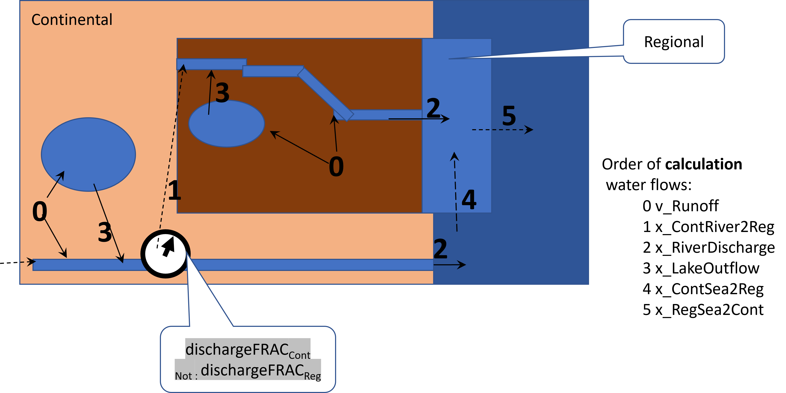
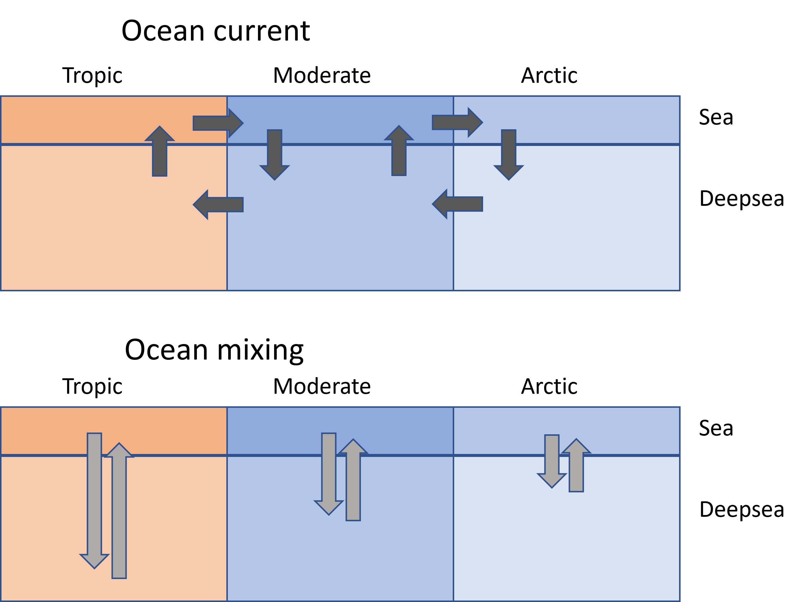

5.4 Advection
================
Jaap Slootweg, Joris Quik, Valerie de Rijk
2025-03-13

## 5.4 Advection

Here the implementation of the advective flows of air and water in SBoo
are illustrated. An advective flow in the context of SB is the massflow
of a matrix (air, water ) from one box to another, where either the
subcompartment or scale is different.

For calculating the rate constants for advection there is data needed on
several parameters such as wind speeds, discharges, residence times etc.
All the different fluxes or flows of air or water are calculated after
which these flows can be converted to rate constants. All default data
are stored in csv files and the values can be read using
‘World\$fetchData(“…”)’. They can be adjusted using
‘World\$mutateVars(…)’ and then the World can be updated for downstream
variable updates using: ‘WorldUpdateDirty(unique(…))’. Examples can be
found in the case studies.

Here we illustrate all the flow processes defined.

### Air flow

The air flow rate is calculated in two steps.

First the AirFlow is calculated based on the residence time of air:

``` r
World$fetchData("Volume")
```

    ##          Scale         SubCompart       Volume
    ## 1       Arctic                air 4.249999e+16
    ## 2       Arctic         cloudwater 1.275000e+10
    ## 3       Arctic          deepocean 7.650000e+16
    ## 7       Arctic     marinesediment 7.650000e+11
    ## 8       Arctic        naturalsoil 8.500000e+11
    ## 10      Arctic                sea 2.550000e+15
    ## 11 Continental   agriculturalsoil 4.183008e+11
    ## 12 Continental                air 7.199248e+15
    ## 13 Continental         cloudwater 2.159775e+09
    ## 15 Continental freshwatersediment 2.875818e+09
    ## 16 Continental               lake 8.714600e+11
    ## 17 Continental       lakesediment 2.614380e+08
    ## 18 Continental     marinesediment 1.114023e+11
    ## 19 Continental        naturalsoil 4.705884e+10
    ## 20 Continental          othersoil 1.742920e+10
    ## 21 Continental              river 2.875818e+11
    ## 22 Continental                sea 7.426820e+14
    ## 23    Moderate                air 7.757116e+16
    ## 24    Moderate         cloudwater 2.327135e+10
    ## 25    Moderate          deepocean 1.163568e+17
    ## 29    Moderate     marinesediment 1.163568e+12
    ## 30    Moderate        naturalsoil 1.939280e+12
    ## 32    Moderate                sea 3.878559e+15
    ## 33    Regional   agriculturalsoil 2.742840e+10
    ## 34    Regional                air 2.295699e+14
    ## 35    Regional         cloudwater 6.887100e+07
    ## 37    Regional freshwatersediment 1.885702e+08
    ## 38    Regional               lake 5.714250e+10
    ## 39    Regional       lakesediment 1.714275e+07
    ## 40    Regional     marinesediment 3.000000e+07
    ## 41    Regional        naturalsoil 3.085695e+09
    ## 42    Regional          othersoil 1.142850e+09
    ## 43    Regional              river 1.885702e+10
    ## 44    Regional                sea 1.000000e+10
    ## 45      Tropic                air 1.275000e+17
    ## 46      Tropic         cloudwater 3.825000e+10
    ## 47      Tropic          deepocean 2.677500e+17
    ## 51      Tropic     marinesediment 2.677500e+12
    ## 52      Tropic        naturalsoil 1.912500e+12
    ## 54      Tropic                sea 8.925000e+15

``` r
World$fetchData("Area")
```

    ##          Scale         SubCompart         Area
    ## 1       Arctic                air 4.250000e+13
    ## 2       Arctic         cloudwater 4.250000e+13
    ## 3       Arctic          deepocean 2.550000e+13
    ## 7       Arctic     marinesediment 2.550000e+13
    ## 8       Arctic        naturalsoil 1.700000e+13
    ## 10      Arctic                sea 2.550000e+13
    ## 11 Continental   agriculturalsoil 2.091504e+12
    ## 12 Continental                air 7.199250e+12
    ## 13 Continental         cloudwater 7.199250e+12
    ## 15 Continental freshwatersediment 9.586060e+10
    ## 16 Continental               lake 8.714600e+09
    ## 17 Continental       lakesediment 8.714600e+09
    ## 18 Continental     marinesediment 3.713410e+12
    ## 19 Continental        naturalsoil 9.411768e+11
    ## 20 Continental          othersoil 3.485840e+11
    ## 21 Continental              river 9.586060e+10
    ## 22 Continental                sea 3.713410e+12
    ## 23    Moderate                air 7.757118e+13
    ## 24    Moderate         cloudwater 7.757118e+13
    ## 25    Moderate          deepocean 3.878559e+13
    ## 29    Moderate     marinesediment 3.878559e+13
    ## 30    Moderate        naturalsoil 3.878559e+13
    ## 32    Moderate                sea 3.878559e+13
    ## 33    Regional   agriculturalsoil 1.371420e+11
    ## 34    Regional                air 2.295700e+11
    ## 35    Regional         cloudwater 2.295700e+11
    ## 37    Regional freshwatersediment 6.285675e+09
    ## 38    Regional               lake 5.714250e+08
    ## 39    Regional       lakesediment 5.714250e+08
    ## 40    Regional     marinesediment 1.000000e+09
    ## 41    Regional        naturalsoil 6.171390e+10
    ## 42    Regional          othersoil 2.285700e+10
    ## 43    Regional              river 6.285675e+09
    ## 44    Regional                sea 1.000000e+09
    ## 45      Tropic                air 1.275000e+14
    ## 46      Tropic         cloudwater 1.275000e+14
    ## 47      Tropic          deepocean 8.925000e+13
    ## 51      Tropic     marinesediment 8.925000e+13
    ## 52      Tropic        naturalsoil 3.825000e+13
    ## 54      Tropic                sea 8.925000e+13

``` r
World$fetchData("WINDspeed")
```

    ##         Scale WINDspeed
    ## 1      Arctic         3
    ## 2 Continental         3
    ## 3    Moderate         3
    ## 4    Regional         3
    ## 5      Tropic         3

``` r
World$fetchData("SubCompartName")
```

    ##            SubCompart     SubCompartName
    ## 1    agriculturalsoil   agriculturalsoil
    ## 2                 air                air
    ## 3          cloudwater         cloudwater
    ## 4           deepocean          deepocean
    ## 5  freshwatersediment freshwatersediment
    ## 6                lake               lake
    ## 7        lakesediment       lakesediment
    ## 8      marinesediment     marinesediment
    ## 9         naturalsoil        naturalsoil
    ## 10          othersoil          othersoil
    ## 11              river              river
    ## 12                sea                sea

``` r
f_TAU
```

    ## function (Area, WINDspeed) 
    ## {
    ##     1.5 * (0.5 * sqrt(Area * pi/4)/WINDspeed)
    ## }
    ## <bytecode: 0x000002ae3b27d748>

``` r
AirFlow
```

    ## function (Volume, Area, WINDspeed, SubCompartName) 
    ## {
    ##     if (SubCompartName %in% c("air")) {
    ##         TAU <- f_TAU(Area, WINDspeed)
    ##         Volume/TAU
    ##     }
    ##     else {
    ##         return(NA)
    ##     }
    ## }
    ## <bytecode: 0x000002ae3b7554a8>

``` r
World$fetchData("AirFlow")
```

    ##          Scale SubCompart     AirFlow
    ## 1       Arctic        air 29424519893
    ## 12 Continental        air 12110401673
    ## 23    Moderate        air 39752561608
    ## 34    Regional        air  2162581520
    ## 45      Tropic        air 50964763443

The mean residence time in the region is calculated according the f_TAU
function.

The AirFlow function calculates the amount that would enter/leave the
region; namely the volume divided by the residence time. Notice that
f_TAU is a normal function, but AirFlow will be used as a variable
defining function. This provides the overall airflow within a
compartment which affects the flow from this compartment or scale to the
next. Currently air only flows between scales.

Second, from the AirFlow the flows are actually connected to each other.

``` r
x_Advection_Air
```

    ## function (all.AirFlow, from.ScaleName, to.ScaleName) 
    ## {
    ##     from.AirFlow <- all.AirFlow$AirFlow[all.AirFlow$Scale == 
    ##         from.ScaleName]
    ##     to.Airflow <- all.AirFlow$AirFlow[all.AirFlow$Scale == to.ScaleName]
    ##     Cont2Regional.Airflow <- function() {
    ##         all.AirFlow$AirFlow[all.AirFlow$Scale == "Regional"]
    ##     }
    ##     if (from.ScaleName %in% c("Arctic", "Regional", "Tropic")) {
    ##         return(all.AirFlow$AirFlow[all.AirFlow$Scale == from.ScaleName])
    ##     }
    ##     if (from.ScaleName == "Continental" & to.ScaleName == "Moderate") {
    ##         return(all.AirFlow$AirFlow[all.AirFlow$Scale == from.ScaleName] - 
    ##             Cont2Regional.Airflow())
    ##     }
    ##     if (from.ScaleName == "Moderate" & to.ScaleName == "Continental") {
    ##         return(all.AirFlow$AirFlow[all.AirFlow$Scale == to.ScaleName] - 
    ##             Cont2Regional.Airflow())
    ##     }
    ##     return(all.AirFlow$AirFlow[all.AirFlow$Scale == to.ScaleName])
    ## }
    ## <bytecode: 0x000002ae3e03f890>

``` r
# AdvAir <- World$NewFlow("x_Advection_Air")
# AdvAir$execute(debugAt = list(toScale = "Continental"))
World$CalcVar("x_Advection_Air")
```

    ## Warning in dplyr::inner_join(AllIn, private$MyCore$states$asDataFrame, join_by(fromScale == : Detected an unexpected many-to-many relationship between `x` and `y`.
    ## ℹ Row 1 of `x` matches multiple rows in `y`.
    ## ℹ Row 48 of `y` matches multiple rows in `x`.
    ## ℹ If a many-to-many relationship is expected, set `relationship =
    ##   "many-to-many"` to silence this warning.

    ## Warning in dplyr::inner_join(AllIn, private$MyCore$states$asDataFrame, join_by(toScale == : Detected an unexpected many-to-many relationship between `x` and `y`.
    ## ℹ Row 1 of `x` matches multiple rows in `y`.
    ## ℹ Row 142 of `y` matches multiple rows in `x`.
    ## ℹ If a many-to-many relationship is expected, set `relationship =
    ##   "many-to-many"` to silence this warning.

    ##          FlowName   fromScale     toScale fromSubCompart toSubCompart
    ## 1 x_Advection_Air      Arctic    Moderate            air          air
    ## 2 x_Advection_Air Continental    Moderate            air          air
    ## 3 x_Advection_Air Continental    Regional            air          air
    ## 4 x_Advection_Air    Moderate      Arctic            air          air
    ## 5 x_Advection_Air    Moderate Continental            air          air
    ## 6 x_Advection_Air    Moderate      Tropic            air          air
    ## 7 x_Advection_Air    Regional Continental            air          air
    ## 8 x_Advection_Air      Tropic    Moderate            air          air
    ##          flow
    ## 1 29424519893
    ## 2  9947820153
    ## 3  2162581520
    ## 4 29424519893
    ## 5  9947820153
    ## 6 50964763443
    ## 7  2162581520
    ## 8 50964763443

To ensure mass balance in the model the amount from one scale to the
next would need to be equal to the amount flowing the opposite way! To
honor the mass balance we give priority to the amount calculated for the
smallest volume to calculate the actual flows. This means that for
nested scales we need to know their ‘place’ in the world. This brings a
new challenge; we need to know properties of the scale the flow is going
to, or possibly the scale where it is coming from. Because of the
nesting, we need to know even properties of scale not directly related
to the to- or from- the scale! To accommodate this use of the “to.”, the
“from.” and the “all.” preposition is made available. The to- and from
scaleName are atomic (a single string) but the “all.” prepositions
provides a full table of the variable and its dimensions (in this case
only across Scales). If you want to see what is really going on in the
function calls you can use the debug parameter.

This provides the air flows. To test if they add up and give the same
amount flowing to and from each scale we do the following calculation:

``` r
AirFlows <- World$fetchData("x_Advection_Air")
ToFlow <- aggregate(flow~toScale, data = AirFlows, FUN = sum)
FromFlow <- aggregate(flow~fromScale, data = AirFlows, FUN = sum)
merge(FromFlow, ToFlow, by.x = "fromScale", by.y = "toScale", suffixes = c("_from", "_to")) 
```

    ##     fromScale   flow_from     flow_to
    ## 1      Arctic 29424519893 29424519893
    ## 2 Continental 12110401673 12110401673
    ## 3    Moderate 90337103489 90337103489
    ## 4    Regional  2162581520  2162581520
    ## 5      Tropic 50964763443 50964763443

``` r
merge(FromFlow, ToFlow, by.x = "fromScale", by.y = "toScale", suffixes = c("_from", "_to")) |> mutate(from_to_Diff = flow_from-flow_to)
```

    ##     fromScale   flow_from     flow_to from_to_Diff
    ## 1      Arctic 29424519893 29424519893            0
    ## 2 Continental 12110401673 12110401673            0
    ## 3    Moderate 90337103489 90337103489            0
    ## 4    Regional  2162581520  2162581520            0
    ## 5      Tropic 50964763443 50964763443            0

### Water flow

All flows dealing with advective processes are denoted by x_files in
SBOO. Different dimensions are relevant for computing the water flows:
subcompartments and scale. This relates to water flowing from lake,
through the river compartment to the sea, after which the sea flows
between scales. This is defined in the following x_flow. The order of
calculation matters (for regional and continental scale function x 1-5).

<figure>

<figcaption aria-hidden="true">Overview of water flows between Regional
and Continental scale. <!--# origin: SBcoreModules.pptx --></figcaption>
</figure>

<figure>

<figcaption aria-hidden="true">Overview of water flows at Global scale.
<!--# origin: SBcoreModules.pptx --></figcaption>
</figure>

#### *1.* x_ContRiver2Reg: *Continental to Regional Fresh water (w1)*

x_ContRiver2Reg calculates based on the fraction of discharge of fresh
water to the regional scale the amount of fresh water flowing from
continental to regional scale. This function also depends on the
different contributors to continental discharge. These are: Runoff and
RainOnFreshwater for both freshwater compartments (w0 and w1). In the
default scenario where the regional scale coincides with a watershed
this is 0, but when e.g. country boundaries are taken this becomes
relevant as there could be inflow of freshwater across the border. The
main driving variable is ‘dischargeFRAC’ which indicates the fraction of
freshwater outflow at continental scale flowing to regional scale (set
for Cont. Scale).

``` r
x_ContRiver2Reg
```

    ## function (ScaleName, SubCompartName, all.Runoff, all.RainOnFreshwater, 
    ##     dischargeFRAC) 
    ## {
    ##     switch(ScaleName, Continental = {
    ##         switch(SubCompartName, river = {
    ##             SumRainRunoff <- sum(all.Runoff$Runoff[all.Runoff$Scale == 
    ##                 ScaleName]) + sum(all.RainOnFreshwater$RainOnFreshwater[all.RainOnFreshwater$Scale == 
    ##                 ScaleName])
    ##             return((SumRainRunoff) * dischargeFRAC)
    ##         }, return(NA))
    ##     }, return(NA))
    ## }
    ## <bytecode: 0x000002ae3e7568c8>

``` r
World$fetchData("dischargeFRAC")
```

    ##         Scale dischargeFRAC
    ## 2 Continental             0
    ## 4    Regional             0

``` r
World$fetchData("Runoff")
```

    ##          Scale       SubCompart      Runoff
    ## 8       Arctic      naturalsoil  33691.6540
    ## 11 Continental agriculturalsoil  11606.2024
    ## 19 Continental      naturalsoil   5222.7911
    ## 20 Continental        othersoil   1934.3671
    ## 30    Moderate      naturalsoil 215229.5234
    ## 33    Regional agriculturalsoil    761.0303
    ## 41    Regional      naturalsoil    342.4636
    ## 42    Regional        othersoil    126.8384
    ## 52      Tropic      naturalsoil 394192.3516

``` r
World$fetchData("RainOnFreshwater")
```

    ##          Scale SubCompart RainOnFreshwater
    ## 16 Continental       lake        16.119726
    ## 21 Continental      river      1950.486798
    ## 38    Regional       lake         1.056986
    ## 43    Regional      river       127.895362

``` r
World$fetchData("ScaleName")
```

    ##         Scale   ScaleName
    ## 1      Arctic      Arctic
    ## 2 Continental Continental
    ## 3    Moderate    Moderate
    ## 4    Regional    Regional
    ## 5      Tropic      Tropic

``` r
World$fetchData("SubCompartName")
```

    ##            SubCompart     SubCompartName
    ## 1    agriculturalsoil   agriculturalsoil
    ## 2                 air                air
    ## 3          cloudwater         cloudwater
    ## 4           deepocean          deepocean
    ## 5  freshwatersediment freshwatersediment
    ## 6                lake               lake
    ## 7        lakesediment       lakesediment
    ## 8      marinesediment     marinesediment
    ## 9         naturalsoil        naturalsoil
    ## 10          othersoil          othersoil
    ## 11              river              river
    ## 12                sea                sea

``` r
World$fetchData("LakeFracRiver") # needs to be cleanup after basing on area fraction.
```

    ## [1] 0.1

``` r
World$fetchData("x_ContRiver2Reg")
```

    ##          FlowName   fromScale  toScale fromSubCompart toSubCompart flow
    ## 5 x_ContRiver2Reg Continental Regional          river        river    0

#### *2. x_RiverDischarge: Freshwater (w1) to sea water (w2).*

``` r
x_RiverDischarge
```

    ## function (all.Runoff, all.RainOnFreshwater, dischargeFRAC, all.x_ContRiver2Reg, 
    ##     ScaleName, SubCompartName) 
    ## {
    ##     x_ContRiver2Reg <- sum(all.x_ContRiver2Reg$flow)
    ##     SumRainRunoff <- sum(all.Runoff$Runoff[all.Runoff$Scale == 
    ##         ScaleName]) + sum(all.RainOnFreshwater$RainOnFreshwater[all.RainOnFreshwater$Scale == 
    ##         ScaleName])
    ##     switch(SubCompartName, river = {
    ##         if (ScaleName == "Continental") {
    ##             return((SumRainRunoff) * (1 - dischargeFRAC))
    ##         }
    ##         if (ScaleName == "Regional") {
    ##             return((SumRainRunoff + x_ContRiver2Reg) * (1 - dischargeFRAC))
    ##         } else NA
    ##     }, NA)
    ## }
    ## <bytecode: 0x000002ae3bc449a8>

``` r
World$fetchData("Runoff")
```

    ##          Scale       SubCompart      Runoff
    ## 8       Arctic      naturalsoil  33691.6540
    ## 11 Continental agriculturalsoil  11606.2024
    ## 19 Continental      naturalsoil   5222.7911
    ## 20 Continental        othersoil   1934.3671
    ## 30    Moderate      naturalsoil 215229.5234
    ## 33    Regional agriculturalsoil    761.0303
    ## 41    Regional      naturalsoil    342.4636
    ## 42    Regional        othersoil    126.8384
    ## 52      Tropic      naturalsoil 394192.3516

``` r
World$fetchData("RainOnFreshwater")
```

    ##          Scale SubCompart RainOnFreshwater
    ## 16 Continental       lake        16.119726
    ## 21 Continental      river      1950.486798
    ## 38    Regional       lake         1.056986
    ## 43    Regional      river       127.895362

``` r
World$fetchData("dischargeFRAC")
```

    ##         Scale dischargeFRAC
    ## 2 Continental             0
    ## 4    Regional             0

``` r
World$fetchData("x_ContRiver2Reg")
```

    ##          FlowName   fromScale  toScale fromSubCompart toSubCompart flow
    ## 5 x_ContRiver2Reg Continental Regional          river        river    0

``` r
World$fetchData("ScaleName")
```

    ##         Scale   ScaleName
    ## 1      Arctic      Arctic
    ## 2 Continental Continental
    ## 3    Moderate    Moderate
    ## 4    Regional    Regional
    ## 5      Tropic      Tropic

``` r
World$fetchData("x_RiverDischarge")
```

    ##            FlowName   fromScale     toScale fromSubCompart toSubCompart
    ## 22 x_RiverDischarge    Regional    Regional          river          sea
    ## 23 x_RiverDischarge Continental Continental          river          sea
    ##         flow
    ## 22  1359.285
    ## 23 20729.967

``` r
# World$CalcVar("x_RiverDischarge")
```

#### *3. x_LakeOutflow: isolated freshwater/lake (w0) to fresh water (w1)*

The Lake compartment (w0) is an upstream compartment within a Scale that
has outflow to fresh water (w1). The outflow is dependent on the
fraction runoff going to lake and the direct Rain on lake fresh water.

``` r
x_LakeOut
```

    ## function (RainOnFreshwater, all.Runoff, FracROWatComp, SubCompartName, 
    ##     ScaleName) 
    ## {
    ##     switch(SubCompartName, lake = {
    ##         SumRunoff <- sum(all.Runoff$Runoff[all.Runoff$Scale == 
    ##             ScaleName])
    ##         return(RainOnFreshwater + FracROWatComp * SumRunoff)
    ##     }, NA)
    ## }
    ## <bytecode: 0x000002ae3c789078>

``` r
World$fetchData("RainOnFreshwater")
```

    ##          Scale SubCompart RainOnFreshwater
    ## 16 Continental       lake        16.119726
    ## 21 Continental      river      1950.486798
    ## 38    Regional       lake         1.056986
    ## 43    Regional      river       127.895362

``` r
World$fetchData("Runoff")
```

    ##          Scale       SubCompart      Runoff
    ## 8       Arctic      naturalsoil  33691.6540
    ## 11 Continental agriculturalsoil  11606.2024
    ## 19 Continental      naturalsoil   5222.7911
    ## 20 Continental        othersoil   1934.3671
    ## 30    Moderate      naturalsoil 215229.5234
    ## 33    Regional agriculturalsoil    761.0303
    ## 41    Regional      naturalsoil    342.4636
    ## 42    Regional        othersoil    126.8384
    ## 52      Tropic      naturalsoil 394192.3516

``` r
World$fetchData("FracROWatComp")
```

    ##          Scale SubCompart FracROWatComp
    ## 16 Continental       lake    0.08333333
    ## 21 Continental      river    0.91666667
    ## 38    Regional       lake    0.08333333
    ## 43    Regional      river    0.91666667

``` r
World$fetchData("ScaleName")
```

    ##         Scale   ScaleName
    ## 1      Arctic      Arctic
    ## 2 Continental Continental
    ## 3    Moderate    Moderate
    ## 4    Regional    Regional
    ## 5      Tropic      Tropic

``` r
World$fetchData("x_LakeOut")
```

    ##    FlowName   fromScale     toScale fromSubCompart toSubCompart      flow
    ## 6 x_LakeOut    Regional    Regional           lake        river  103.5847
    ## 7 x_LakeOut Continental Continental           lake        river 1579.7331

``` r
# flow = World$NewCalcVariable("x_LakeOut")
# flow$execute()
# flow$execute(debugAt = list(assembly=NA))
```

#### *4. x_ContSea2Reg: Continental sea water (w2) to Regional sea water (w2)*

x_ContSea2Reg calculates the flow from the sea at continental scale to
the sea at regional scale. It is now the default approach which is a
flow 9 times higher than the river discharge at regional scale. This
coincides with the regional sea mixing being 10 times the river
discharge into the sea.
<!--# A change could be implemented here based on a residence time of sea at regional scale as the river flow is not always relevant for the contribution to this flow, e.g. depending on the type of sea and location one is trying to model. -->

``` r
x_ContSea2Reg
```

    ## function (all.x_RiverDischarge) 
    ## {
    ##     x_RiverDischarge <- all.x_RiverDischarge$flow[all.x_RiverDischarge$fromScale == 
    ##         "Regional"]
    ##     return((10 - 1) * x_RiverDischarge)
    ## }

``` r
World$fetchData("LakeFracRiver")
```

    ## [1] 0.1

``` r
World$fetchData("x_RiverDischarge")
```

    ##            FlowName   fromScale     toScale fromSubCompart toSubCompart
    ## 22 x_RiverDischarge    Regional    Regional          river          sea
    ## 23 x_RiverDischarge Continental Continental          river          sea
    ##         flow
    ## 22  1359.285
    ## 23 20729.967

``` r
World$fetchData("x_ContSea2Reg")
```

    ##         FlowName   fromScale  toScale fromSubCompart toSubCompart     flow
    ## 24 x_ContSea2Reg Continental Regional            sea          sea 12233.56

``` r
# 
# flow4 <- World$NewFlow("x_ContSea2Reg")
# 
# flow4$FromAndTo
# flow4$execute()
# World$CalcVar("x_ContSea2Reg")
# World$fetchData("x_ContSea2Reg")
# World$fetchDataUnits("x_ContSea2Reg")
```

#### *5. x_RegSea2Cont: Regional sea water (w2) to Continental sea water (w2)*

x_RegSea2Cont is the sea water flow from regional to continental scale.
It is assumed to be 10 times the discharge flow from the river.

``` r
World$fetchData("LakeFracRiver")
```

    ## [1] 0.1

``` r
World$fetchData("x_RiverDischarge")
```

    ##            FlowName   fromScale     toScale fromSubCompart toSubCompart
    ## 22 x_RiverDischarge    Regional    Regional          river          sea
    ## 23 x_RiverDischarge Continental Continental          river          sea
    ##         flow
    ## 22  1359.285
    ## 23 20729.967

``` r
World$fetchData("x_RegSea2Cont")
```

    ##         FlowName fromScale     toScale fromSubCompart toSubCompart     flow
    ## 25 x_RegSea2Cont  Regional Continental            sea          sea 13592.85

``` r
# flow5 <- World$NewFlow("x_RegSea2Cont")
# 
# flow5$FromAndTo
# flow5$execute()
# World$CalcVar("x_RegSea2Cont")
```

#### *6. x_ToModerateWater: Ocean currents flowing to Moderate scale (w2 and w3)*

Advection of continental sea, Tropic and Arctic sea compartments to sea
and deepocean at Moderate scale.

``` r
World$fetchData("Volume")
```

    ##          Scale         SubCompart       Volume
    ## 1       Arctic                air 4.249999e+16
    ## 2       Arctic         cloudwater 1.275000e+10
    ## 3       Arctic          deepocean 7.650000e+16
    ## 7       Arctic     marinesediment 7.650000e+11
    ## 8       Arctic        naturalsoil 8.500000e+11
    ## 10      Arctic                sea 2.550000e+15
    ## 11 Continental   agriculturalsoil 4.183008e+11
    ## 12 Continental                air 7.199248e+15
    ## 13 Continental         cloudwater 2.159775e+09
    ## 15 Continental freshwatersediment 2.875818e+09
    ## 16 Continental               lake 8.714600e+11
    ## 17 Continental       lakesediment 2.614380e+08
    ## 18 Continental     marinesediment 1.114023e+11
    ## 19 Continental        naturalsoil 4.705884e+10
    ## 20 Continental          othersoil 1.742920e+10
    ## 21 Continental              river 2.875818e+11
    ## 22 Continental                sea 7.426820e+14
    ## 23    Moderate                air 7.757116e+16
    ## 24    Moderate         cloudwater 2.327135e+10
    ## 25    Moderate          deepocean 1.163568e+17
    ## 29    Moderate     marinesediment 1.163568e+12
    ## 30    Moderate        naturalsoil 1.939280e+12
    ## 32    Moderate                sea 3.878559e+15
    ## 33    Regional   agriculturalsoil 2.742840e+10
    ## 34    Regional                air 2.295699e+14
    ## 35    Regional         cloudwater 6.887100e+07
    ## 37    Regional freshwatersediment 1.885702e+08
    ## 38    Regional               lake 5.714250e+10
    ## 39    Regional       lakesediment 1.714275e+07
    ## 40    Regional     marinesediment 3.000000e+07
    ## 41    Regional        naturalsoil 3.085695e+09
    ## 42    Regional          othersoil 1.142850e+09
    ## 43    Regional              river 1.885702e+10
    ## 44    Regional                sea 1.000000e+10
    ## 45      Tropic                air 1.275000e+17
    ## 46      Tropic         cloudwater 3.825000e+10
    ## 47      Tropic          deepocean 2.677500e+17
    ## 51      Tropic     marinesediment 2.677500e+12
    ## 52      Tropic        naturalsoil 1.912500e+12
    ## 54      Tropic                sea 8.925000e+15

``` r
World$fetchData("TAUsea")
```

    ##         Scale   TAUsea
    ## 1      Arctic  4752000
    ## 2 Continental 31536000
    ## 3    Moderate  4752000
    ## 5      Tropic  4752000

``` r
World$fetchData("x_RegSea2Cont")
```

    ##         FlowName fromScale     toScale fromSubCompart toSubCompart     flow
    ## 25 x_RegSea2Cont  Regional Continental            sea          sea 13592.85

``` r
World$fetchData("x_ToModerateWater")
```

    ##             FlowName   fromScale  toScale fromSubCompart toSubCompart      flow
    ## 27 x_ToModerateWater      Arctic Moderate            sea          sea         0
    ## 28 x_ToModerateWater      Arctic Moderate      deepocean    deepocean 150000000
    ## 29 x_ToModerateWater Continental Moderate            sea          sea  23536699
    ## 30 x_ToModerateWater      Tropic Moderate            sea          sea 150000000
    ## 31 x_ToModerateWater      Tropic Moderate      deepocean    deepocean         0

``` r
# flow6 <- World$NewFlow("x_ToModerateWater")
# 
# flow6$FromAndTo
# flow6$execute()
# World$CalcVar("x_ToModerateWater")
```

#### *7. x_FromModerate2TropWater: flow from Moderate to Tropic deep ocean (w3)*

Moderate scale waters flow into Tropical scale through deep ocean
currents based on a set ocean current of 1736.1111111 m3/day.

``` r
x_FromModerate2TropWater
```

    ## function (OceanCurrent, SubCompartName, ScaleName) 
    ## {
    ##     switch(SubCompartName, sea = {
    ##         return(0)
    ##     }, deepocean = {
    ##         OceanCurrent
    ##     }, NA)
    ## }
    ## <bytecode: 0x000002ae2ed174f8>

``` r
World$fetchData("OceanCurrent")
```

    ## [1] 1.5e+08

``` r
World$fetchData("x_FromModerate2TropWater")
```

    ##                   FlowName fromScale toScale fromSubCompart toSubCompart
    ## 3 x_FromModerate2TropWater  Moderate  Tropic            sea          sea
    ## 4 x_FromModerate2TropWater  Moderate  Tropic      deepocean    deepocean
    ##      flow
    ## 3 0.0e+00
    ## 4 1.5e+08

``` r
# flow <- World$NewFlow("x_FromModerate2TropWater")
# flow$execute(debugAt = list())
# flow$FromAndTo
# flow$execute()
# World$CalcVar("x_FromModerate2TropWater")
```

#### *8. x_FromModerate2ArctWater: flow from Moderate to Arctic sea water (w2)*

Moderate scale waters flow into Arctic scale through surface ocean
currents based on a set ocean current of 1736.1111111 m3/day.

``` r
x_FromModerate2ArctWater
```

    ## function (OceanCurrent, SubCompartName, ScaleName) 
    ## {
    ##     switch(SubCompartName, sea = {
    ##         OceanCurrent
    ##     }, deepocean = {
    ##         return(0)
    ##     }, NA)
    ## }
    ## <bytecode: 0x000002ae2f850ca0>

``` r
World$fetchData("OceanCurrent")
```

    ## [1] 1.5e+08

``` r
World$fetchData("ScaleName")
```

    ##         Scale   ScaleName
    ## 1      Arctic      Arctic
    ## 2 Continental Continental
    ## 3    Moderate    Moderate
    ## 4    Regional    Regional
    ## 5      Tropic      Tropic

``` r
World$fetchData("x_FromModerate2ArctWater")
```

    ##                   FlowName fromScale toScale fromSubCompart toSubCompart
    ## 1 x_FromModerate2ArctWater  Moderate  Arctic            sea          sea
    ## 2 x_FromModerate2ArctWater  Moderate  Arctic      deepocean    deepocean
    ##      flow
    ## 1 1.5e+08
    ## 2 0.0e+00

``` r
# flow <- World$NewFlow("x_FromModerate2ArctWater")
# # flow$execute(debugAt = list())
# flow$FromAndTo
# flow$execute()
# World$CalcVar("x_FromModerate2ArctWater")
```

#### *9. x_FromModerate2ContWater: from from Continental to Moderate sea water (w2)*

Moderate scale waters flow into Contentental scale through surface ocean
currents based on the residence time of sea water at the continental
scale minus the inflow of regional sea water to continental scale.

``` r
x_FromModerate2ContWater
```

    ## function (all.Volume, all.TAUsea, all.x_RegSea2Cont, SubCompartName, 
    ##     ScaleName) 
    ## {
    ##     switch(SubCompartName, sea = {
    ##         RegSea2Cont <- all.x_RegSea2Cont$flow[all.x_RegSea2Cont$fromSubCompart == 
    ##             "sea" & all.x_RegSea2Cont$fromScale == "Regional"]
    ##         toVolume <- all.Volume$Volume[all.Volume$SubCompart == 
    ##             SubCompartName & all.Volume$Scale == "Continental"]
    ##         toTAUsea <- all.TAUsea$TAUsea[all.TAUsea$Scale == "Continental"]
    ##         return((toVolume/toTAUsea) - RegSea2Cont)
    ##     }, NA)
    ## }
    ## <bytecode: 0x000002ae329a1688>

``` r
# required data:
World$fetchData("Volume")
```

    ##          Scale         SubCompart       Volume
    ## 1       Arctic                air 4.249999e+16
    ## 2       Arctic         cloudwater 1.275000e+10
    ## 3       Arctic          deepocean 7.650000e+16
    ## 7       Arctic     marinesediment 7.650000e+11
    ## 8       Arctic        naturalsoil 8.500000e+11
    ## 10      Arctic                sea 2.550000e+15
    ## 11 Continental   agriculturalsoil 4.183008e+11
    ## 12 Continental                air 7.199248e+15
    ## 13 Continental         cloudwater 2.159775e+09
    ## 15 Continental freshwatersediment 2.875818e+09
    ## 16 Continental               lake 8.714600e+11
    ## 17 Continental       lakesediment 2.614380e+08
    ## 18 Continental     marinesediment 1.114023e+11
    ## 19 Continental        naturalsoil 4.705884e+10
    ## 20 Continental          othersoil 1.742920e+10
    ## 21 Continental              river 2.875818e+11
    ## 22 Continental                sea 7.426820e+14
    ## 23    Moderate                air 7.757116e+16
    ## 24    Moderate         cloudwater 2.327135e+10
    ## 25    Moderate          deepocean 1.163568e+17
    ## 29    Moderate     marinesediment 1.163568e+12
    ## 30    Moderate        naturalsoil 1.939280e+12
    ## 32    Moderate                sea 3.878559e+15
    ## 33    Regional   agriculturalsoil 2.742840e+10
    ## 34    Regional                air 2.295699e+14
    ## 35    Regional         cloudwater 6.887100e+07
    ## 37    Regional freshwatersediment 1.885702e+08
    ## 38    Regional               lake 5.714250e+10
    ## 39    Regional       lakesediment 1.714275e+07
    ## 40    Regional     marinesediment 3.000000e+07
    ## 41    Regional        naturalsoil 3.085695e+09
    ## 42    Regional          othersoil 1.142850e+09
    ## 43    Regional              river 1.885702e+10
    ## 44    Regional                sea 1.000000e+10
    ## 45      Tropic                air 1.275000e+17
    ## 46      Tropic         cloudwater 3.825000e+10
    ## 47      Tropic          deepocean 2.677500e+17
    ## 51      Tropic     marinesediment 2.677500e+12
    ## 52      Tropic        naturalsoil 1.912500e+12
    ## 54      Tropic                sea 8.925000e+15

``` r
World$fetchData("TAUsea")
```

    ##         Scale   TAUsea
    ## 1      Arctic  4752000
    ## 2 Continental 31536000
    ## 3    Moderate  4752000
    ## 5      Tropic  4752000

``` r
World$fetchData("OceanCurrent")
```

    ## [1] 1.5e+08

``` r
World$fetchData("x_RegSea2Cont")
```

    ##         FlowName fromScale     toScale fromSubCompart toSubCompart     flow
    ## 25 x_RegSea2Cont  Regional Continental            sea          sea 13592.85

``` r
World$fetchData("ScaleName")
```

    ##         Scale   ScaleName
    ## 1      Arctic      Arctic
    ## 2 Continental Continental
    ## 3    Moderate    Moderate
    ## 4    Regional    Regional
    ## 5      Tropic      Tropic

``` r
World$fetchData("x_FromModerate2ContWater")
```

    ##                    FlowName fromScale     toScale fromSubCompart toSubCompart
    ## 26 x_FromModerate2ContWater  Moderate Continental            sea          sea
    ##        flow
    ## 26 23536699

``` r
# flow <- World$NewFlow("x_FromModerate2ContWater")
# # flow$execute(debugAt = list())
# flow$FromAndTo
# flow$execute()
# World$CalcVar("x_FromModerate2ContWater")
```

#### *10. x_OceanMixing2Deep: mixing of surface sea to deep ocean (w2 to w3)*

As illustrated in the figures above there are not only currents
affecting the advection of sea water between scales, but also mixing of
the surface water and deep ocean layers at global scales. This is
calculated for both directions.

``` r
x_OceanMixing2Deep
```

    ## function (Volume, TAUsea, OceanCurrent, ScaleName, SubCompartName) 
    ## {
    ##     switch(SubCompartName, sea = {
    ##         OceanMixingFlow <- Volume/TAUsea
    ##         if (ScaleName %in% c("Moderate", "Arctic", "Tropic")) {
    ##             return((OceanMixingFlow + OceanCurrent))
    ##         } else {
    ##             return(NA)
    ##         }
    ##     }, return(NA))
    ## }
    ## <bytecode: 0x000002ae3ea543c0>

``` r
World$fetchData("Volume")
```

    ##          Scale         SubCompart       Volume
    ## 1       Arctic                air 4.249999e+16
    ## 2       Arctic         cloudwater 1.275000e+10
    ## 3       Arctic          deepocean 7.650000e+16
    ## 7       Arctic     marinesediment 7.650000e+11
    ## 8       Arctic        naturalsoil 8.500000e+11
    ## 10      Arctic                sea 2.550000e+15
    ## 11 Continental   agriculturalsoil 4.183008e+11
    ## 12 Continental                air 7.199248e+15
    ## 13 Continental         cloudwater 2.159775e+09
    ## 15 Continental freshwatersediment 2.875818e+09
    ## 16 Continental               lake 8.714600e+11
    ## 17 Continental       lakesediment 2.614380e+08
    ## 18 Continental     marinesediment 1.114023e+11
    ## 19 Continental        naturalsoil 4.705884e+10
    ## 20 Continental          othersoil 1.742920e+10
    ## 21 Continental              river 2.875818e+11
    ## 22 Continental                sea 7.426820e+14
    ## 23    Moderate                air 7.757116e+16
    ## 24    Moderate         cloudwater 2.327135e+10
    ## 25    Moderate          deepocean 1.163568e+17
    ## 29    Moderate     marinesediment 1.163568e+12
    ## 30    Moderate        naturalsoil 1.939280e+12
    ## 32    Moderate                sea 3.878559e+15
    ## 33    Regional   agriculturalsoil 2.742840e+10
    ## 34    Regional                air 2.295699e+14
    ## 35    Regional         cloudwater 6.887100e+07
    ## 37    Regional freshwatersediment 1.885702e+08
    ## 38    Regional               lake 5.714250e+10
    ## 39    Regional       lakesediment 1.714275e+07
    ## 40    Regional     marinesediment 3.000000e+07
    ## 41    Regional        naturalsoil 3.085695e+09
    ## 42    Regional          othersoil 1.142850e+09
    ## 43    Regional              river 1.885702e+10
    ## 44    Regional                sea 1.000000e+10
    ## 45      Tropic                air 1.275000e+17
    ## 46      Tropic         cloudwater 3.825000e+10
    ## 47      Tropic          deepocean 2.677500e+17
    ## 51      Tropic     marinesediment 2.677500e+12
    ## 52      Tropic        naturalsoil 1.912500e+12
    ## 54      Tropic                sea 8.925000e+15

``` r
World$fetchData("TAUsea")
```

    ##         Scale   TAUsea
    ## 1      Arctic  4752000
    ## 2 Continental 31536000
    ## 3    Moderate  4752000
    ## 5      Tropic  4752000

``` r
World$fetchData("OceanCurrent")
```

    ## [1] 1.5e+08

``` r
World$fetchData("SubCompartName")
```

    ##            SubCompart     SubCompartName
    ## 1    agriculturalsoil   agriculturalsoil
    ## 2                 air                air
    ## 3          cloudwater         cloudwater
    ## 4           deepocean          deepocean
    ## 5  freshwatersediment freshwatersediment
    ## 6                lake               lake
    ## 7        lakesediment       lakesediment
    ## 8      marinesediment     marinesediment
    ## 9         naturalsoil        naturalsoil
    ## 10          othersoil          othersoil
    ## 11              river              river
    ## 12                sea                sea

``` r
World$fetchData("x_OceanMixing2Deep")
```

    ##              FlowName fromScale  toScale fromSubCompart toSubCompart       flow
    ## 8  x_OceanMixing2Deep  Moderate Moderate            sea    deepocean  966195076
    ## 9  x_OceanMixing2Deep    Tropic   Tropic            sea    deepocean 2028156566
    ## 10 x_OceanMixing2Deep    Arctic   Arctic            sea    deepocean  686616162

``` r
# flow <- World$NewFlow("x_OceanMixing2Deep")
# 
# flow$FromAndTo
# flow$execute()
# World$CalcVar("x_OceanMixing2Deep")
```

#### *11. x_OceanMixing2Sea: mixing of deep ocean surface sea (w3 to w2)*

``` r
x_OceanMixing2Sea
```

    ## function (all.Volume, TAUsea, OceanCurrent, SubCompartName, ScaleName) 
    ## {
    ##     switch(SubCompartName, deepocean = {
    ##         toVolume <- all.Volume$Volume[all.Volume$SubCompart == 
    ##             "sea" & all.Volume$Scale == ScaleName]
    ##         OceanMixingFlow <- toVolume/TAUsea
    ##         if (ScaleName %in% c("Moderate", "Tropic", "Arctic")) {
    ##             return((OceanMixingFlow + OceanCurrent))
    ##         } else return(NA)
    ##     }, return(NA))
    ## }
    ## <bytecode: 0x000002ae2fd855a0>

``` r
World$fetchData("Volume")
```

    ##          Scale         SubCompart       Volume
    ## 1       Arctic                air 4.249999e+16
    ## 2       Arctic         cloudwater 1.275000e+10
    ## 3       Arctic          deepocean 7.650000e+16
    ## 7       Arctic     marinesediment 7.650000e+11
    ## 8       Arctic        naturalsoil 8.500000e+11
    ## 10      Arctic                sea 2.550000e+15
    ## 11 Continental   agriculturalsoil 4.183008e+11
    ## 12 Continental                air 7.199248e+15
    ## 13 Continental         cloudwater 2.159775e+09
    ## 15 Continental freshwatersediment 2.875818e+09
    ## 16 Continental               lake 8.714600e+11
    ## 17 Continental       lakesediment 2.614380e+08
    ## 18 Continental     marinesediment 1.114023e+11
    ## 19 Continental        naturalsoil 4.705884e+10
    ## 20 Continental          othersoil 1.742920e+10
    ## 21 Continental              river 2.875818e+11
    ## 22 Continental                sea 7.426820e+14
    ## 23    Moderate                air 7.757116e+16
    ## 24    Moderate         cloudwater 2.327135e+10
    ## 25    Moderate          deepocean 1.163568e+17
    ## 29    Moderate     marinesediment 1.163568e+12
    ## 30    Moderate        naturalsoil 1.939280e+12
    ## 32    Moderate                sea 3.878559e+15
    ## 33    Regional   agriculturalsoil 2.742840e+10
    ## 34    Regional                air 2.295699e+14
    ## 35    Regional         cloudwater 6.887100e+07
    ## 37    Regional freshwatersediment 1.885702e+08
    ## 38    Regional               lake 5.714250e+10
    ## 39    Regional       lakesediment 1.714275e+07
    ## 40    Regional     marinesediment 3.000000e+07
    ## 41    Regional        naturalsoil 3.085695e+09
    ## 42    Regional          othersoil 1.142850e+09
    ## 43    Regional              river 1.885702e+10
    ## 44    Regional                sea 1.000000e+10
    ## 45      Tropic                air 1.275000e+17
    ## 46      Tropic         cloudwater 3.825000e+10
    ## 47      Tropic          deepocean 2.677500e+17
    ## 51      Tropic     marinesediment 2.677500e+12
    ## 52      Tropic        naturalsoil 1.912500e+12
    ## 54      Tropic                sea 8.925000e+15

``` r
World$fetchData("TAUsea")
```

    ##         Scale   TAUsea
    ## 1      Arctic  4752000
    ## 2 Continental 31536000
    ## 3    Moderate  4752000
    ## 5      Tropic  4752000

``` r
World$fetchData("OceanCurrent")
```

    ## [1] 1.5e+08

``` r
World$fetchData("SubCompartName")
```

    ##            SubCompart     SubCompartName
    ## 1    agriculturalsoil   agriculturalsoil
    ## 2                 air                air
    ## 3          cloudwater         cloudwater
    ## 4           deepocean          deepocean
    ## 5  freshwatersediment freshwatersediment
    ## 6                lake               lake
    ## 7        lakesediment       lakesediment
    ## 8      marinesediment     marinesediment
    ## 9         naturalsoil        naturalsoil
    ## 10          othersoil          othersoil
    ## 11              river              river
    ## 12                sea                sea

``` r
World$fetchData("x_OceanMixing2Sea")
```

    ##             FlowName fromScale  toScale fromSubCompart toSubCompart       flow
    ## 11 x_OceanMixing2Sea  Moderate Moderate      deepocean          sea  966195076
    ## 12 x_OceanMixing2Sea    Tropic   Tropic      deepocean          sea 2028156566
    ## 13 x_OceanMixing2Sea    Arctic   Arctic      deepocean          sea  686616162

``` r
# flow <- World$NewFlow("x_OceanMixing2Sea")
# 
# flow$FromAndTo
# flow$execute()
# World$CalcVar("x_OceanMixing2Sea")
```

#### Overview of water flows

Overview of flows included above (excludes surface - deep ocean mixing
and ocean currents at global scales). All to and from water flows should
be equal, e.g. the differences is 0.

``` r
flows = World$moduleList[["k_Advection"]]$WithFlow

flux2Test <- World$fetchData("Flows")
flux2Test <- flux2Test[flux2Test$FlowName %in% flows & flux2Test$fromSubCompart %in% c("river","sea","lake","deepocean"),]
flux2Test$fromScale <- factor(flux2Test$fromScale, levels = c("Regional", "Continental", "Moderate","Arctic","Tropic")) #force order
flux2Test$toScale <- factor(flux2Test$toScale, levels = c("Regional", "Continental", "Moderate","Arctic","Tropic")) #force order
flux2Test$fromSubCompart <- factor(flux2Test$fromSubCompart, levels = c("lake", "river", "sea","deepocean")) #force order
flux2Test$toSubCompart <- factor(flux2Test$toSubCompart, levels = c("lake", "river", "sea","deepocean")) #force order
f2Torder <- order(flux2Test$fromScale, flux2Test$fromSubCompart, flux2Test$toScale, flux2Test$toSubCompart)

flux2Test$fcolumns <- do.call(paste, c(flux2Test[c("fromScale", "fromSubCompart")], sep="."))
flux2Test$frows <- do.call(paste, c(flux2Test[c("toScale", "toSubCompart")], sep = "."))
#flux2Test$flux = 10e9 * flux2Test$flux # tune unit 

table1 <- pivot_wider(flux2Test[f2Torder,c("frows","fcolumns","flow")],
            id_cols = frows, names_from = fcolumns, values_from = flow)


toFlows <- data.frame(Compartment = table1$frows,
                      tFlow = rowSums(as.data.frame(table1[,-1],),na.rm = TRUE))
froFlows <- data.frame(Compartment = colnames(table1[,-1]),
                       fFlow = colSums(as.data.frame(table1[,-1],),na.rm = TRUE))

tfFlows <- merge(toFlows,froFlows, all=TRUE) 

if(c(sum(tfFlows$tFlow,na.rm = TRUE)-sum(tfFlows$fFlow)) != 0){
  warning("Water flows are not in balance!")
  }

print(table1, n=40)
```

    ## # A tibble: 10 × 13
    ##    frows              Regional.lake Regional.river Regional.sea Continental.lake
    ##    <chr>                      <dbl>          <dbl>        <dbl>            <dbl>
    ##  1 Regional.river              104.            NA           NA               NA 
    ##  2 Regional.sea                 NA           1359.          NA               NA 
    ##  3 Continental.sea              NA             NA        13593.              NA 
    ##  4 Continental.river            NA             NA           NA             1580.
    ##  5 Moderate.sea                 NA             NA           NA               NA 
    ##  6 Moderate.deepocean           NA             NA           NA               NA 
    ##  7 Arctic.sea                   NA             NA           NA               NA 
    ##  8 Tropic.sea                   NA             NA           NA               NA 
    ##  9 Arctic.deepocean             NA             NA           NA               NA 
    ## 10 Tropic.deepocean             NA             NA           NA               NA 
    ## # ℹ 8 more variables: Continental.river <dbl>, Continental.sea <dbl>,
    ## #   Moderate.sea <dbl>, Moderate.deepocean <dbl>, Arctic.sea <dbl>,
    ## #   Arctic.deepocean <dbl>, Tropic.sea <dbl>, Tropic.deepocean <dbl>

### Advection rate constant

This process is only one step beyond the calculation of the relevant
flows, see the function f_Advection. All flows are by default associated
with this process. “flow” is used as special keyword, there is no SB
variable with the name flow. You can find the values by fetching
“Flows”. This also means the script to get the k_Advection is a little
different from other k’s. See below:

``` r
World$fetchData("Flows")
```

    ##                    FlowName   fromScale     toScale fromSubCompart toSubCompart
    ## 1  x_FromModerate2ArctWater    Moderate      Arctic            sea          sea
    ## 2  x_FromModerate2ArctWater    Moderate      Arctic      deepocean    deepocean
    ## 3  x_FromModerate2TropWater    Moderate      Tropic            sea          sea
    ## 4  x_FromModerate2TropWater    Moderate      Tropic      deepocean    deepocean
    ## 5           x_ContRiver2Reg Continental    Regional          river        river
    ## 6                 x_LakeOut    Regional    Regional           lake        river
    ## 7                 x_LakeOut Continental Continental           lake        river
    ## 8        x_OceanMixing2Deep    Moderate    Moderate            sea    deepocean
    ## 9        x_OceanMixing2Deep      Tropic      Tropic            sea    deepocean
    ## 10       x_OceanMixing2Deep      Arctic      Arctic            sea    deepocean
    ## 11        x_OceanMixing2Sea    Moderate    Moderate      deepocean          sea
    ## 12        x_OceanMixing2Sea      Tropic      Tropic      deepocean          sea
    ## 13        x_OceanMixing2Sea      Arctic      Arctic      deepocean          sea
    ## 22         x_RiverDischarge    Regional    Regional          river          sea
    ## 23         x_RiverDischarge Continental Continental          river          sea
    ## 24            x_ContSea2Reg Continental    Regional            sea          sea
    ## 25            x_RegSea2Cont    Regional Continental            sea          sea
    ## 26 x_FromModerate2ContWater    Moderate Continental            sea          sea
    ## 27        x_ToModerateWater      Arctic    Moderate            sea          sea
    ## 28        x_ToModerateWater      Arctic    Moderate      deepocean    deepocean
    ## 29        x_ToModerateWater Continental    Moderate            sea          sea
    ## 30        x_ToModerateWater      Tropic    Moderate            sea          sea
    ## 31        x_ToModerateWater      Tropic    Moderate      deepocean    deepocean
    ## 14          x_Advection_Air      Arctic    Moderate            air          air
    ## 21          x_Advection_Air Continental    Moderate            air          air
    ## 32          x_Advection_Air Continental    Regional            air          air
    ## 41          x_Advection_Air    Moderate      Arctic            air          air
    ## 51          x_Advection_Air    Moderate Continental            air          air
    ## 61          x_Advection_Air    Moderate      Tropic            air          air
    ## 71          x_Advection_Air    Regional Continental            air          air
    ## 81          x_Advection_Air      Tropic    Moderate            air          air
    ##            flow
    ## 1  1.500000e+08
    ## 2  0.000000e+00
    ## 3  0.000000e+00
    ## 4  1.500000e+08
    ## 5  0.000000e+00
    ## 6  1.035847e+02
    ## 7  1.579733e+03
    ## 8  9.661951e+08
    ## 9  2.028157e+09
    ## 10 6.866162e+08
    ## 11 9.661951e+08
    ## 12 2.028157e+09
    ## 13 6.866162e+08
    ## 22 1.359285e+03
    ## 23 2.072997e+04
    ## 24 1.223356e+04
    ## 25 1.359285e+04
    ## 26 2.353670e+07
    ## 27 0.000000e+00
    ## 28 1.500000e+08
    ## 29 2.353670e+07
    ## 30 1.500000e+08
    ## 31 0.000000e+00
    ## 14 2.942452e+10
    ## 21 9.947820e+09
    ## 32 2.162582e+09
    ## 41 2.942452e+10
    ## 51 9.947820e+09
    ## 61 5.096476e+10
    ## 71 2.162582e+09
    ## 81 5.096476e+10

``` r
 k_Advection
```

    ## function (flow, Volume) 
    ## {
    ##     flow/Volume
    ## }
    ## <bytecode: 0x000002ae2f730260>

``` r
# Don't create a new process like: World$FromDataAndTo("k_Advection")
# find the existing one like this:
# testProc <- World$moduleList[["k_Advection"]]
# FromDataAndTo is from and to from the data, ultimately the property is used
# which can derived from the flows for Advection
# FAT <- testProc$FromAndTo
# the data frmae to be calculated:
# left_join(rename(FAT, "Scale" = "fromScale", "SubCompart" = "fromSubCompart"), World$fetchData("Volume"))
#for testing use:
World$kaas |> filter(process == "k_Advection")
```

    ##                     process   fromScale fromSubCompart fromSpecies     toScale
    ## k_Advection.3   k_Advection      Arctic      deepocean     Unbound      Arctic
    ## k_Advection.5   k_Advection      Arctic            sea     Unbound      Arctic
    ## k_Advection.12  k_Advection      Arctic            air     Unbound    Moderate
    ## k_Advection.13  k_Advection      Arctic      deepocean     Unbound    Moderate
    ## k_Advection.20  k_Advection      Arctic            sea     Unbound    Moderate
    ## k_Advection.22  k_Advection Continental           lake     Unbound Continental
    ## k_Advection.26  k_Advection Continental          river     Unbound Continental
    ## k_Advection.31  k_Advection Continental            air     Unbound    Moderate
    ## k_Advection.33  k_Advection Continental            sea     Unbound    Moderate
    ## k_Advection.39  k_Advection Continental            air     Unbound    Regional
    ## k_Advection.43  k_Advection Continental          river     Unbound    Regional
    ## k_Advection.45  k_Advection Continental            sea     Unbound    Regional
    ## k_Advection.51  k_Advection    Moderate            air     Unbound      Arctic
    ## k_Advection.53  k_Advection    Moderate      deepocean     Unbound      Arctic
    ## k_Advection.58  k_Advection    Moderate            sea     Unbound      Arctic
    ## k_Advection.62  k_Advection    Moderate            air     Unbound Continental
    ## k_Advection.67  k_Advection    Moderate            sea     Unbound Continental
    ## k_Advection.69  k_Advection    Moderate      deepocean     Unbound    Moderate
    ## k_Advection.75  k_Advection    Moderate            sea     Unbound    Moderate
    ## k_Advection.80  k_Advection    Moderate            air     Unbound      Tropic
    ## k_Advection.82  k_Advection    Moderate      deepocean     Unbound      Tropic
    ## k_Advection.88  k_Advection    Moderate            sea     Unbound      Tropic
    ## k_Advection.91  k_Advection    Regional            air     Unbound Continental
    ## k_Advection.93  k_Advection    Regional            sea     Unbound Continental
    ## k_Advection.98  k_Advection    Regional           lake     Unbound    Regional
    ## k_Advection.101 k_Advection    Regional          river     Unbound    Regional
    ## k_Advection.107 k_Advection      Tropic            air     Unbound    Moderate
    ## k_Advection.112 k_Advection      Tropic      deepocean     Unbound    Moderate
    ## k_Advection.113 k_Advection      Tropic            sea     Unbound    Moderate
    ## k_Advection.118 k_Advection      Tropic      deepocean     Unbound      Tropic
    ## k_Advection.121 k_Advection      Tropic            sea     Unbound      Tropic
    ##                 toSubCompart toSpecies            k
    ## k_Advection.3            sea   Unbound 8.975375e-09
    ## k_Advection.5      deepocean   Unbound 2.692612e-07
    ## k_Advection.12           air   Unbound 6.923419e-07
    ## k_Advection.13     deepocean   Unbound 1.960784e-09
    ## k_Advection.20           sea   Unbound 0.000000e+00
    ## k_Advection.22         river   Unbound 1.812743e-09
    ## k_Advection.26           sea   Unbound 7.208372e-08
    ## k_Advection.31           air   Unbound 1.381786e-06
    ## k_Advection.33           sea   Unbound 3.169149e-08
    ## k_Advection.39           air   Unbound 3.003899e-07
    ## k_Advection.43         river   Unbound 0.000000e+00
    ## k_Advection.45           sea   Unbound 1.647214e-11
    ## k_Advection.51           air   Unbound 3.793229e-07
    ## k_Advection.53     deepocean   Unbound 0.000000e+00
    ## k_Advection.58           sea   Unbound 3.867416e-08
    ## k_Advection.62           air   Unbound 1.282412e-07
    ## k_Advection.67           sea   Unbound 6.068413e-09
    ## k_Advection.69           sea   Unbound 8.303729e-09
    ## k_Advection.75     deepocean   Unbound 2.491119e-07
    ## k_Advection.80           air   Unbound 6.570066e-07
    ## k_Advection.82     deepocean   Unbound 1.289139e-09
    ## k_Advection.88           sea   Unbound 0.000000e+00
    ## k_Advection.91           air   Unbound 9.420143e-06
    ## k_Advection.93           sea   Unbound 1.359285e-06
    ## k_Advection.98         river   Unbound 1.812743e-09
    ## k_Advection.101          sea   Unbound 7.208372e-08
    ## k_Advection.107          air   Unbound 3.997238e-07
    ## k_Advection.112    deepocean   Unbound 0.000000e+00
    ## k_Advection.113          sea   Unbound 1.680672e-08
    ## k_Advection.118          sea   Unbound 7.574814e-09
    ## k_Advection.121    deepocean   Unbound 2.272444e-07
