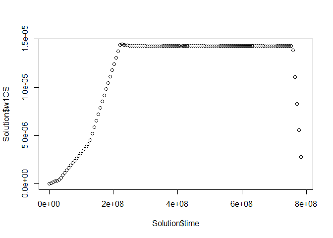

Solver script
================
Valerie de Rijk, Joris Quik, Jaap Slootweg
2024-06-18

## Initiation

We assume you have the input data for a substance or material of
interest and all the data describing the SimpleBox world to be created
ready and thus can run the initWorld script.

``` r
library(dplyr)
```

    ## Warning: package 'dplyr' was built under R version 4.3.2

    ## 
    ## Attaching package: 'dplyr'

    ## The following objects are masked from 'package:stats':
    ## 
    ##     filter, lag

    ## The following objects are masked from 'package:base':
    ## 
    ##     intersect, setdiff, setequal, union

``` r
substance <-  "GO-Chitosan"
source("baseScripts/initWorld_onlyParticulate.R")
```

    ## Warning: package 'ggplot2' was built under R version 4.3.2

    ## Warning: package 'tidyr' was built under R version 4.3.2

    ## Warning: package 'readr' was built under R version 4.3.2

    ## Warning: package 'stringr' was built under R version 4.3.2

    ## ── Attaching core tidyverse packages ──────────────────────── tidyverse 2.0.0 ──
    ## ✔ forcats   1.0.0     ✔ readr     2.1.5
    ## ✔ ggplot2   3.4.4     ✔ stringr   1.5.1
    ## ✔ lubridate 1.9.3     ✔ tibble    3.2.1
    ## ✔ purrr     1.0.2     ✔ tidyr     1.3.1

    ## ── Conflicts ────────────────────────────────────────── tidyverse_conflicts() ──
    ## ✖ dplyr::filter() masks stats::filter()
    ## ✖ dplyr::lag()    masks stats::lag()
    ## ℹ Use the conflicted package (<http://conflicted.r-lib.org/>) to force all conflicts to become errors

    ## Warning: package 'ggdag' was built under R version 4.3.2

    ## 
    ## Attaching package: 'ggdag'
    ## 
    ## The following object is masked from 'package:stats':
    ## 
    ##     filter

    ## Warning: package 'rlang' was built under R version 4.3.2

    ## 
    ## Attaching package: 'rlang'
    ## 
    ## The following objects are masked from 'package:purrr':
    ## 
    ##     %@%, flatten, flatten_chr, flatten_dbl, flatten_int, flatten_lgl,
    ##     flatten_raw, invoke, splice
    ## 
    ## Joining with `by = join_by(Matrix)`Joining with `by = join_by(Compartment)`

    ## Warning in eval(ei, envir): pKa is needed but missing, setting pKa=7

    ## Warning in eval(ei, envir): Pvap is missing but not used, setting constant

    ## Warning in private$Execute(debugAt): input data ignored; not all VertDistance
    ## in FromAndTo property

    ## Warning in private$Execute(debugAt): input data ignored; not all SubCompartName
    ## in FromAndTo property

    ## Warning in private$Execute(debugAt): input data ignored; not all
    ## to.SubCompartName in FromAndTo property

    ## Warning in private$Execute(debugAt): input data ignored; not all
    ## from.SubCompartName in FromAndTo property

    ## Warning in dplyr::inner_join(AllIn, private$MyCore$states$asDataFrame, join_by(toScale == : Detected an unexpected many-to-many relationship between `x` and `y`.
    ## ℹ Row 1 of `x` matches multiple rows in `y`.
    ## ℹ Row 95 of `y` matches multiple rows in `x`.
    ## ℹ If a many-to-many relationship is expected, set `relationship =
    ##   "many-to-many"` to silence this warning.

    ## Warning in dplyr::inner_join(AllIn, private$MyCore$states$asDataFrame, join_by(toScale == : Detected an unexpected many-to-many relationship between `x` and `y`.
    ## ℹ Row 1 of `x` matches multiple rows in `y`.
    ## ℹ Row 189 of `y` matches multiple rows in `x`.
    ## ℹ If a many-to-many relationship is expected, set `relationship =
    ##   "many-to-many"` to silence this warning.

    ## Warning: `as.tibble()` was deprecated in tibble 2.0.0.
    ## ℹ Please use `as_tibble()` instead.
    ## ℹ The signature and semantics have changed, see `?as_tibble`.
    ## This warning is displayed once every 8 hours.
    ## Call `lifecycle::last_lifecycle_warnings()` to see where this warning was
    ## generated.

    ## Warning in (function (Kaw25, Kow, Corg, RhoCOL, Matrix, Pvap25, MaxPvap, : Kow
    ## is NA, default of 18 used!

    ## Warning in (function (Kaw25, Kow, Corg, RhoCOL, Matrix, Pvap25, MaxPvap, : Kow
    ## is NA, default of 18 used!

    ## Warning in (function (Kaw25, Kow, Corg, RhoCOL, Matrix, Pvap25, MaxPvap, : Kow
    ## is NA, default of 18 used!

    ## Warning in (function (Kaw25, Kow, Corg, RhoCOL, Matrix, Pvap25, MaxPvap, : Kow
    ## is NA, default of 18 used!

    ## Warning in (function (Kaw25, Kow, Corg, RhoCOL, Matrix, Pvap25, MaxPvap, : Kow
    ## is NA, default of 18 used!

    ## Warning in (function (Kaw25, Kow, Corg, RhoCOL, Matrix, Pvap25, MaxPvap, : Kow
    ## is NA, default of 18 used!

    ## Warning in (function (Kaw25, Kow, Corg, RhoCOL, Matrix, Pvap25, MaxPvap, : Kow
    ## is NA, default of 18 used!

    ## Warning in (function (Kaw25, Kow, Corg, RhoCOL, Matrix, Pvap25, MaxPvap, : Kow
    ## is NA, default of 18 used!

    ## Warning in (function (Kaw25, Kow, Corg, RhoCOL, Matrix, Pvap25, MaxPvap, : Kow
    ## is NA, default of 18 used!

    ## Warning in (function (Kaw25, Kow, Corg, RhoCOL, Matrix, Pvap25, MaxPvap, : Kow
    ## is NA, default of 18 used!

    ## Warning in (function (Kaw25, Kow, Corg, RhoCOL, Matrix, Pvap25, MaxPvap, : Kow
    ## is NA, default of 18 used!

    ## Warning in (function (Kaw25, Kow, Corg, RhoCOL, Matrix, Pvap25, MaxPvap, : Kow
    ## is NA, default of 18 used!

    ## Warning in private$Execute(debugAt): input data ignored; not all VertDistance
    ## in FromAndTo property

    ## Warning in private$Execute(debugAt): input data ignored; not all
    ## to.FracROWatComp in FromAndTo property

    ## Warning in private$Execute(debugAt): input data ignored; not all
    ## to.SubCompartName in FromAndTo property

    ## Warning in private$Execute(debugAt): input data ignored; not all Matrix in
    ## FromAndTo property

    ## Warning in private$Execute(debugAt): input data ignored; not all rad_species in
    ## FromAndTo property

    ## Warning in private$Execute(debugAt): input data ignored; not all RadCOL in
    ## FromAndTo property

    ## Warning in private$Execute(debugAt): input data ignored; not all RadCP in
    ## FromAndTo property

    ## Warning in private$Execute(debugAt): input data ignored; not all rho_species in
    ## FromAndTo property

    ## Warning in private$Execute(debugAt): input data ignored; not all RhoCOL in
    ## FromAndTo property

    ## Warning in private$Execute(debugAt): input data ignored; not all RhoCP in
    ## FromAndTo property

    ## Warning in private$Execute(debugAt): input data ignored; not all Matrix in
    ## FromAndTo property

    ## Warning in private$Execute(debugAt): input data ignored; not all to.SpeciesName
    ## in FromAndTo property

    ## Warning in private$Execute(debugAt): input data ignored; not all RadCOL in
    ## FromAndTo property

    ## Warning in private$Execute(debugAt): input data ignored; not all RadCP in
    ## FromAndTo property

    ## Warning in private$Execute(debugAt): input data ignored; not all RhoCOL in
    ## FromAndTo property

    ## Warning in private$Execute(debugAt): input data ignored; not all RhoCP in
    ## FromAndTo property

    ## Warning in private$Execute(debugAt): input data ignored; not all rhoMatrix in
    ## FromAndTo property

    ## Warning in private$Execute(debugAt): input data ignored; not all to.FRACs in
    ## FromAndTo property

    ## Warning in private$Execute(debugAt): input data ignored; not all Matrix in
    ## FromAndTo property

    ## Warning in private$Execute(debugAt): input data ignored; not all to.SpeciesName
    ## in FromAndTo property

    ## Warning in private$Execute(debugAt): input data ignored; not all SubCompartName
    ## in FromAndTo property

    ## Warning in private$Execute(debugAt): input data ignored; not all VertDistance
    ## in FromAndTo property

    ## Warning in private$Execute(debugAt): input data ignored; not all to.rhoMatrix
    ## in FromAndTo property

    ## Warning in private$Execute(debugAt): input data ignored; not all to.RadCP in
    ## FromAndTo property

    ## Warning in private$Execute(debugAt): input data ignored; not all to.RhoCP in
    ## FromAndTo property

    ## Warning in private$Execute(debugAt): input data ignored; not all from.RhoCP in
    ## FromAndTo property

    ## Warning in private$Execute(debugAt): input data ignored; not all FRACs in
    ## FromAndTo property

    ## Warning in private$UpdateDL(CanDo[i]): Ksw.alt ; no rows calculated

    ## Warning in FUN(X[[i]], ...): Kow is NA, default of 18 used!

    ## Warning in FUN(X[[i]], ...): Kow is NA, default of 18 used!

    ## Warning in FUN(X[[i]], ...): Kow is NA, default of 18 used!

    ## Warning in FUN(X[[i]], ...): Kow is NA, default of 18 used!

    ## Warning in FUN(X[[i]], ...): Kow is NA, default of 18 used!

    ## Warning in FUN(X[[i]], ...): Kow is NA, default of 18 used!

    ## Warning in FUN(X[[i]], ...): Kow is NA, default of 18 used!

    ## Warning in FUN(X[[i]], ...): Kow is NA, default of 18 used!

    ## Warning in FUN(X[[i]], ...): Kow is NA, default of 18 used!

    ## Warning in FUN(X[[i]], ...): Kow is NA, default of 18 used!

    ## Warning in FUN(X[[i]], ...): Kow is NA, default of 18 used!

    ## Warning in FUN(X[[i]], ...): Kow is NA, default of 18 used!

    ## Warning in private$Execute(debugAt): input data ignored; not all rad_species in
    ## FromAndTo property

    ## Warning in private$Execute(debugAt): input data ignored; not all rho_species in
    ## FromAndTo property

    ## Warning in private$Execute(debugAt): input data ignored; not all to.rhoMatrix
    ## in FromAndTo property

    ## Warning in private$Execute(debugAt): input data ignored; not all from.rhoMatrix
    ## in FromAndTo property

    ## Warning in private$Execute(debugAt): input data ignored; not all
    ## SettlingVelocity in FromAndTo property

    ## Warning in private$Execute(debugAt): input data ignored; not all Matrix in
    ## FromAndTo property

    ## Warning in private$Execute(debugAt): input data ignored; not all SpeciesName in
    ## FromAndTo property

    ## Warning in private$Execute(debugAt): input data ignored; not all VertDistance
    ## in FromAndTo property

    ## Warning in private$Execute(debugAt): input data ignored; not all SubCompartName
    ## in FromAndTo property

    ## Warning in private$Execute(debugAt): input data ignored; not all to.Area in
    ## FromAndTo property

    ## Warning in private$Execute(debugAt): input data ignored; not all from.Volume in
    ## FromAndTo property

    ## Warning in private$Execute(debugAt): input data ignored; not all rhoMatrix in
    ## FromAndTo property

    ## Warning in private$Execute(debugAt): input data ignored; not all rad_species in
    ## FromAndTo property

    ## Warning in private$Execute(debugAt): input data ignored; not all rho_species in
    ## FromAndTo property

    ## Warning in private$Execute(debugAt): input data ignored; not all
    ## SettlingVelocity in FromAndTo property

    ## Warning in private$Execute(debugAt): input data ignored; not all SubCompartName
    ## in FromAndTo property

    ## Warning in private$Execute(debugAt): input data ignored; not all to.Area in
    ## FromAndTo property

    ## Warning in private$Execute(debugAt): input data ignored; not all from.Volume in
    ## FromAndTo property

    ## Warning in dplyr::inner_join(AllIn, private$MyCore$states$asDataFrame, join_by(toScale == : Detected an unexpected many-to-many relationship between `x` and `y`.
    ## ℹ Row 1 of `x` matches multiple rows in `y`.
    ## ℹ Row 1 of `y` matches multiple rows in `x`.
    ## ℹ If a many-to-many relationship is expected, set `relationship =
    ##   "many-to-many"` to silence this warning.

    ## Warning in dplyr::inner_join(AllIn, private$MyCore$states$asDataFrame, join_by(toSubCompart == : Detected an unexpected many-to-many relationship between `x` and `y`.
    ## ℹ Row 1 of `x` matches multiple rows in `y`.
    ## ℹ Row 20 of `y` matches multiple rows in `x`.
    ## ℹ If a many-to-many relationship is expected, set `relationship =
    ##   "many-to-many"` to silence this warning.

    ## Warning in dplyr::inner_join(AllIn, private$MyCore$states$asDataFrame, join_by(toSubCompart == : Detected an unexpected many-to-many relationship between `x` and `y`.
    ## ℹ Row 1 of `x` matches multiple rows in `y`.
    ## ℹ Row 16 of `y` matches multiple rows in `x`.
    ## ℹ If a many-to-many relationship is expected, set `relationship =
    ##   "many-to-many"` to silence this warning.

    ## Warning in private$Execute(debugAt): input data ignored; not all KdegDorC in
    ## FromAndTo property

    ## Warning in private$Execute(debugAt): input data ignored; not all Tempfactor in
    ## FromAndTo property

    ## Warning in private$Execute(debugAt): input data ignored; not all Matrix in
    ## FromAndTo property

    ## Warning in private$Execute(debugAt): input data ignored; not all SubCompartName
    ## in FromAndTo property

    ## Warning in private$Execute(debugAt): input data ignored; not all VertDistance
    ## in FromAndTo property

    ## Warning in private$Execute(debugAt): input data ignored; not all SpeciesName in
    ## FromAndTo property

    ## Warning in private$Execute(debugAt): input data ignored; not all Kscompw in
    ## FromAndTo property

    ## Warning in private$Execute(debugAt): input data ignored; not all VertDistance
    ## in FromAndTo property

    ## Warning in private$Execute(debugAt): input data ignored; not all
    ## to.FracROWatComp in FromAndTo property

    ## Warning in private$Execute(debugAt): input data ignored; not all Volume in
    ## FromAndTo property

    ## Warning in private$Execute(debugAt): input data ignored; not all
    ## to.SubCompartName in FromAndTo property

    ## Warning in private$Execute(debugAt): input data ignored; not all SpeciesName in
    ## FromAndTo property

    ## Warning in private$Execute(debugAt): input data ignored; not all Matrix in
    ## FromAndTo property

    ## Warning in private$Execute(debugAt): input data ignored; not all FRinw in
    ## FromAndTo property

    ## Warning in private$Execute(debugAt): input data ignored; not all
    ## SettlingVelocity in FromAndTo property

    ## Warning in private$Execute(debugAt): input data ignored; not all VertDistance
    ## in FromAndTo property

    ## Warning in private$Execute(debugAt): input data ignored; not all from.RhoCP in
    ## FromAndTo property

    ## Warning in private$Execute(debugAt): input data ignored; not all from.RadCP in
    ## FromAndTo property

    ## Warning in private$Execute(debugAt): input data ignored; not all SubCompartName
    ## in FromAndTo property

    ## Warning in private$Execute(debugAt): input data ignored; not all
    ## to.SubCompartName in FromAndTo property

    ## Warning in dplyr::inner_join(AllIn, private$MyCore$states$asDataFrame, join_by(fromScale == : Detected an unexpected many-to-many relationship between `x` and `y`.
    ## ℹ Row 1 of `x` matches multiple rows in `y`.
    ## ℹ Row 48 of `y` matches multiple rows in `x`.
    ## ℹ If a many-to-many relationship is expected, set `relationship =
    ##   "many-to-many"` to silence this warning.

    ## Warning in dplyr::inner_join(AllIn, private$MyCore$states$asDataFrame, join_by(toScale == : Detected an unexpected many-to-many relationship between `x` and `y`.
    ## ℹ Row 1 of `x` matches multiple rows in `y`.
    ## ℹ Row 142 of `y` matches multiple rows in `x`.
    ## ℹ If a many-to-many relationship is expected, set `relationship =
    ##   "many-to-many"` to silence this warning.

    ## Warning in dplyr::inner_join(AllIn, private$MyCore$states$asDataFrame, join_by(toSubCompart == : Detected an unexpected many-to-many relationship between `x` and `y`.
    ## ℹ Row 1 of `x` matches multiple rows in `y`.
    ## ℹ Row 16 of `y` matches multiple rows in `x`.
    ## ℹ If a many-to-many relationship is expected, set `relationship =
    ##   "many-to-many"` to silence this warning.

    ## Warning in dplyr::inner_join(AllIn, private$MyCore$states$asDataFrame, join_by(toScale == : Detected an unexpected many-to-many relationship between `x` and `y`.
    ## ℹ Row 1 of `x` matches multiple rows in `y`.
    ## ℹ Row 1 of `y` matches multiple rows in `x`.
    ## ℹ If a many-to-many relationship is expected, set `relationship =
    ##   "many-to-many"` to silence this warning.

    ## Warning in dplyr::inner_join(AllIn, private$MyCore$states$asDataFrame, join_by(toSubCompart == : Detected an unexpected many-to-many relationship between `x` and `y`.
    ## ℹ Row 1 of `x` matches multiple rows in `y`.
    ## ℹ Row 8 of `y` matches multiple rows in `x`.
    ## ℹ If a many-to-many relationship is expected, set `relationship =
    ##   "many-to-many"` to silence this warning.

    ## Warning in dplyr::inner_join(AllIn, private$MyCore$states$asDataFrame, join_by(toScale == : Detected an unexpected many-to-many relationship between `x` and `y`.
    ## Detected an unexpected many-to-many relationship between `x` and `y`.
    ## ℹ Row 1 of `x` matches multiple rows in `y`.
    ## ℹ Row 48 of `y` matches multiple rows in `x`.
    ## ℹ If a many-to-many relationship is expected, set `relationship =
    ##   "many-to-many"` to silence this warning.

    ## Warning in dplyr::inner_join(AllIn, private$MyCore$states$asDataFrame, join_by(toScale == : Detected an unexpected many-to-many relationship between `x` and `y`.
    ## ℹ Row 1 of `x` matches multiple rows in `y`.
    ## ℹ Row 142 of `y` matches multiple rows in `x`.
    ## ℹ If a many-to-many relationship is expected, set `relationship =
    ##   "many-to-many"` to silence this warning.

    ## Warning in private$Execute(debugAt): input data ignored; not all Volume in
    ## FromAndTo property

``` r
World$fetchData("RhoS")
```

    ## [1] 408

``` r
World$fetchData("RadS")
```

    ## [1] 4e-05

``` r
World$fetchData("landFRAC")
```

    ##          Scale       SubCompart landFRAC
    ## 13 Continental agriculturalsoil   0.6000
    ## 18 Continental             lake   0.0025
    ## 21 Continental      naturalsoil   0.2700
    ## 22 Continental        othersoil   0.1000
    ## 23 Continental            river   0.0275
    ## 37    Regional agriculturalsoil   0.6000
    ## 42    Regional             lake   0.0025
    ## 45    Regional      naturalsoil   0.2700
    ## 46    Regional        othersoil   0.1000
    ## 47    Regional            river   0.0275

``` r
World$fetchData("Area")
```

    ##          Scale         SubCompart         Area
    ## 2       Arctic                air 4.250000e+13
    ## 3       Arctic         cloudwater 4.250000e+13
    ## 4       Arctic          deepocean 2.550000e+13
    ## 8       Arctic     marinesediment 2.550000e+13
    ## 9       Arctic        naturalsoil 1.700000e+13
    ## 12      Arctic                sea 2.550000e+13
    ## 13 Continental   agriculturalsoil 2.091601e+12
    ## 14 Continental                air 7.200000e+12
    ## 15 Continental         cloudwater 7.200000e+12
    ## 17 Continental freshwatersediment 9.586505e+10
    ## 18 Continental               lake 8.715005e+09
    ## 19 Continental       lakesediment 8.715005e+09
    ## 20 Continental     marinesediment 3.713998e+12
    ## 21 Continental        naturalsoil 9.412205e+11
    ## 22 Continental          othersoil 3.486002e+11
    ## 23 Continental              river 9.586505e+10
    ## 24 Continental                sea 3.713998e+12
    ## 26    Moderate                air 7.757000e+13
    ## 27    Moderate         cloudwater 7.757000e+13
    ## 28    Moderate          deepocean 3.878500e+13
    ## 32    Moderate     marinesediment 3.878500e+13
    ## 33    Moderate        naturalsoil 3.878500e+13
    ## 36    Moderate                sea 3.878500e+13
    ## 37    Regional   agriculturalsoil 1.373989e+11
    ## 38    Regional                air 2.300000e+11
    ## 39    Regional         cloudwater 2.300000e+11
    ## 41    Regional freshwatersediment 6.297448e+09
    ## 42    Regional               lake 5.724953e+08
    ## 43    Regional       lakesediment 5.724953e+08
    ## 44    Regional     marinesediment 1.001873e+09
    ## 45    Regional        naturalsoil 6.182949e+10
    ## 46    Regional          othersoil 2.289981e+10
    ## 47    Regional              river 6.297448e+09
    ## 48    Regional                sea 1.001873e+09
    ## 50      Tropic                air 1.275000e+14
    ## 51      Tropic         cloudwater 1.275000e+14
    ## 52      Tropic          deepocean 8.925000e+13
    ## 56      Tropic     marinesediment 8.925000e+13
    ## 57      Tropic        naturalsoil 3.825000e+13
    ## 60      Tropic                sea 8.925000e+13

## Computing Spherical equivalent diameter

We calculate the spherical equivalent diameter (deq) and subsequently
use it to overwrite radS. In this manner we include the shape of the
considered particles. We update the matrix in the chunk after. \[TODO:
In future this could be included in the initialization for relevant
particles that consist of multiple components\]

We need the following properties for the GO-Chitosan related particles:

- Shape

- Size

- Density

- Other ‘unknown’ variables, such as attachment efficiency, etc.

| Property             | GO-Chitosan     | GO              | Chitoson         |
|----------------------|-----------------|-----------------|------------------|
| Shape                | Sheet-like      | Flake           | Fragment         |
| Size - square (LxB)  | 70 - 90 (80) um | 70 - 90 (80) um | 100-200 (150) nm |
| Size - thickness (H) | 10-20 (15) nm   | 1-10 (5) nm     | 100-200 (150) nm |
| Density              | Calculated      | 0.35 g/ml       | 0.874 g/ml       |

The density of GO-chitosan is approximated by 7/8 \* dens_Graphene + 1/8
\* dens_Chitosan

``` r
# Longest <- World$fetchData("Longest_side")
# Intermediate <- World$fetchData("Intermediate_side")
# Shortest <- World$fetchData("Shortest_side")
Longest <- 80*1e-06
Intermediate <- 80*1e-06
Shortest <- 15*1e-9

Volume <- Longest*Intermediate*Shortest
d_eq <- ( 6/ pi * Volume)^(1/3)
rad_eq <- d_eq/2
print(rad_eq)
```

    ## [1] 2.840496e-06

``` r
World$SetConst(RadS = rad_eq)
```

    ##       x         RadS
    ## 1 4e-05 2.840496e-06

``` r
World$fetchData("RhoS")
```

    ## [1] 408

## Adjusting Parameters with Uncertainty

Since attachment efficiencies (alpha) are very uncertain, below is a
chunk where we can create distributions for these parameters. We start
however with a deterministic calculation using averages.

``` r
fwa_min <- 1e-4
fwa_max<- 0.1
n <- 100000
log_uniform_samples <- 10^runif(n, min = log10(fwa_min), max = log10(fwa_max))
fw_alpha_mean_log_samples <- mean(log_uniform_samples)
print(fw_alpha_mean_log_samples)
```

    ## [1] 0.01441676

``` r
#Check with histogram 
hist(log_uniform_samples, breaks = 30, freq = FALSE,
     main = "Histogram of Log Uniform Distribution [10^-3, 10^-1]",
     xlab = "Value", ylab = "Density")
# Plot the probability density function (pdf) curve
curve(dunif(log10(x), min = log10(fwa_min), max = log10(fwa_max)) / x,
      from = fwa_min, to = fwa_max, add = TRUE, col = "blue", lwd = 2 )
```

<!-- -->

``` r
#marine 
ma_min <- 1e-3 
ma_max <- 1
log_uniform_samples <- 10^runif(n, min = log10(ma_min), max = log10(ma_max))
marine_alpha_mean_log_samples <- mean(log_uniform_samples)
print(marine_alpha_mean_log_samples)
```

    ## [1] 0.1443287

``` r
#Assign data
World$fetchData("alpha")
```

    ##            SubCompart Species alpha
    ## 1    agriculturalsoil   Large  0.30
    ## 2    agriculturalsoil   Small  0.05
    ## 12          deepocean   Large  1.00
    ## 13          deepocean   Small  1.00
    ## 16 freshwatersediment   Large  0.30
    ## 17 freshwatersediment   Small  0.10
    ## 20               lake   Large  0.30
    ## 21               lake   Small  0.10
    ## 24       lakesediment   Large  0.40
    ## 25       lakesediment   Small  0.10
    ## 28     marinesediment   Large  1.00
    ## 29     marinesediment   Small  1.00
    ## 32        naturalsoil   Large  0.40
    ## 33        naturalsoil   Small  0.20
    ## 36          othersoil   Large  0.20
    ## 37          othersoil   Small  0.10
    ## 40              river   Large  0.30
    ## 41              river   Small  1.00
    ## 44                sea   Large  1.00
    ## 45                sea   Small  1.00

``` r
subcomparts <- c("river", "lake", "water", "agriculturalsoil", "naturalsoil", "othersoil", "freshwatersediment", "lakesediment")
alpha_adjust_fw <- data.frame(
  SubCompart = subcomparts, 
  alpha = fw_alpha_mean_log_samples
  
)

World$mutateVar(alpha_adjust_fw)
```

    ##            SubCompart Species old_alpha      alpha
    ## 1    agriculturalsoil   Large      0.30 0.01441676
    ## 2    agriculturalsoil   Small      0.05 0.01441676
    ## 3           deepocean   Large      1.00 1.00000000
    ## 4           deepocean   Small      1.00 1.00000000
    ## 5  freshwatersediment   Large      0.30 0.01441676
    ## 6  freshwatersediment   Small      0.10 0.01441676
    ## 7                lake   Large      0.30 0.01441676
    ## 8                lake   Small      0.10 0.01441676
    ## 9        lakesediment   Large      0.40 0.01441676
    ## 10       lakesediment   Small      0.10 0.01441676
    ## 11     marinesediment   Large      1.00 1.00000000
    ## 12     marinesediment   Small      1.00 1.00000000
    ## 13        naturalsoil   Large      0.40 0.01441676
    ## 14        naturalsoil   Small      0.20 0.01441676
    ## 15          othersoil   Large      0.20 0.01441676
    ## 16          othersoil   Small      0.10 0.01441676
    ## 17              river   Large      0.30 0.01441676
    ## 18              river   Small      1.00 0.01441676
    ## 19                sea   Large      1.00 1.00000000
    ## 20                sea   Small      1.00 1.00000000

``` r
subcompartsmarine <- c("sea", "marinesediment", "freshwatersediment", "deepocean")
alpha_adjust_marine <- data.frame(
  SubCompart = subcompartsmarine, 
  alpha = marine_alpha_mean_log_samples
  
)
World$mutateVar(alpha_adjust_marine)
```

    ##            SubCompart Species  old_alpha      alpha
    ## 1    agriculturalsoil   Large 0.01441676 0.01441676
    ## 2    agriculturalsoil   Small 0.01441676 0.01441676
    ## 3           deepocean   Large 1.00000000 0.14432868
    ## 4           deepocean   Small 1.00000000 0.14432868
    ## 5  freshwatersediment   Large 0.01441676 0.14432868
    ## 6  freshwatersediment   Small 0.01441676 0.14432868
    ## 7                lake   Large 0.01441676 0.01441676
    ## 8                lake   Small 0.01441676 0.01441676
    ## 9        lakesediment   Large 0.01441676 0.01441676
    ## 10       lakesediment   Small 0.01441676 0.01441676
    ## 11     marinesediment   Large 1.00000000 0.14432868
    ## 12     marinesediment   Small 1.00000000 0.14432868
    ## 13        naturalsoil   Large 0.01441676 0.01441676
    ## 14        naturalsoil   Small 0.01441676 0.01441676
    ## 15          othersoil   Large 0.01441676 0.01441676
    ## 16          othersoil   Small 0.01441676 0.01441676
    ## 17              river   Large 0.01441676 0.01441676
    ## 18              river   Small 0.01441676 0.01441676
    ## 19                sea   Large 1.00000000 0.14432868
    ## 20                sea   Small 1.00000000 0.14432868

``` r
World$UpdateKaas(mergeExisting = F)
```

    ## Warning in private$Execute(debugAt): input data ignored; not all VertDistance
    ## in FromAndTo property

    ## Warning in private$Execute(debugAt): input data ignored; not all SubCompartName
    ## in FromAndTo property

    ## Warning in private$Execute(debugAt): input data ignored; not all rad_species in
    ## FromAndTo property

    ## Warning in private$Execute(debugAt): input data ignored; not all rho_species in
    ## FromAndTo property

    ## Warning in private$Execute(debugAt): input data ignored; not all to.rhoMatrix
    ## in FromAndTo property

    ## Warning in private$Execute(debugAt): input data ignored; not all from.rhoMatrix
    ## in FromAndTo property

    ## Warning in private$Execute(debugAt): input data ignored; not all
    ## SettlingVelocity in FromAndTo property

    ## Warning in private$Execute(debugAt): input data ignored; not all Matrix in
    ## FromAndTo property

    ## Warning in private$Execute(debugAt): input data ignored; not all SpeciesName in
    ## FromAndTo property

    ## Warning in private$Execute(debugAt): input data ignored; not all VertDistance
    ## in FromAndTo property

    ## Warning in private$Execute(debugAt): input data ignored; not all SubCompartName
    ## in FromAndTo property

    ## Warning in private$Execute(debugAt): input data ignored; not all KdegDorC in
    ## FromAndTo property

    ## Warning in private$Execute(debugAt): input data ignored; not all Tempfactor in
    ## FromAndTo property

    ## Warning in private$Execute(debugAt): input data ignored; not all Matrix in
    ## FromAndTo property

    ## Warning in private$Execute(debugAt): input data ignored; not all SubCompartName
    ## in FromAndTo property

    ## Warning in private$Execute(debugAt): input data ignored; not all to.Area in
    ## FromAndTo property

    ## Warning in private$Execute(debugAt): input data ignored; not all from.Volume in
    ## FromAndTo property

    ## Warning in private$Execute(debugAt): input data ignored; not all rhoMatrix in
    ## FromAndTo property

    ## Warning in private$Execute(debugAt): input data ignored; not all rad_species in
    ## FromAndTo property

    ## Warning in private$Execute(debugAt): input data ignored; not all rho_species in
    ## FromAndTo property

    ## Warning in private$Execute(debugAt): input data ignored; not all
    ## SettlingVelocity in FromAndTo property

    ## Warning in private$Execute(debugAt): input data ignored; not all SubCompartName
    ## in FromAndTo property

    ## Warning in private$Execute(debugAt): input data ignored; not all VertDistance
    ## in FromAndTo property

    ## Warning in private$Execute(debugAt): input data ignored; not all
    ## to.FracROWatComp in FromAndTo property

    ## Warning in private$Execute(debugAt): input data ignored; not all
    ## to.SubCompartName in FromAndTo property

    ## Warning in private$Execute(debugAt): input data ignored; not all Matrix in
    ## FromAndTo property

    ## Warning in private$Execute(debugAt): input data ignored; not all
    ## to.SubCompartName in FromAndTo property

    ## Warning in private$Execute(debugAt): input data ignored; not all
    ## from.SubCompartName in FromAndTo property

    ## Warning in private$Execute(debugAt): input data ignored; not all rad_species in
    ## FromAndTo property

    ## Warning in private$Execute(debugAt): input data ignored; not all RadCOL in
    ## FromAndTo property

    ## Warning in private$Execute(debugAt): input data ignored; not all RadCP in
    ## FromAndTo property

    ## Warning in private$Execute(debugAt): input data ignored; not all rho_species in
    ## FromAndTo property

    ## Warning in private$Execute(debugAt): input data ignored; not all RhoCOL in
    ## FromAndTo property

    ## Warning in private$Execute(debugAt): input data ignored; not all RhoCP in
    ## FromAndTo property

    ## Warning in private$Execute(debugAt): input data ignored; not all Matrix in
    ## FromAndTo property

    ## Warning in private$Execute(debugAt): input data ignored; not all to.SpeciesName
    ## in FromAndTo property

    ## Warning in private$Execute(debugAt): input data ignored; not all RadCOL in
    ## FromAndTo property

    ## Warning in private$Execute(debugAt): input data ignored; not all RadCP in
    ## FromAndTo property

    ## Warning in private$Execute(debugAt): input data ignored; not all RhoCOL in
    ## FromAndTo property

    ## Warning in private$Execute(debugAt): input data ignored; not all RhoCP in
    ## FromAndTo property

    ## Warning in private$Execute(debugAt): input data ignored; not all rhoMatrix in
    ## FromAndTo property

    ## Warning in private$Execute(debugAt): input data ignored; not all to.FRACs in
    ## FromAndTo property

    ## Warning in private$Execute(debugAt): input data ignored; not all Matrix in
    ## FromAndTo property

    ## Warning in private$Execute(debugAt): input data ignored; not all to.SpeciesName
    ## in FromAndTo property

    ## Warning in private$Execute(debugAt): input data ignored; not all SubCompartName
    ## in FromAndTo property

    ## Warning in private$Execute(debugAt): input data ignored; not all VertDistance
    ## in FromAndTo property

    ## Warning in private$Execute(debugAt): input data ignored; not all SpeciesName in
    ## FromAndTo property

    ## Warning in private$Execute(debugAt): input data ignored; not all Kscompw in
    ## FromAndTo property

    ## Warning in private$Execute(debugAt): input data ignored; not all VertDistance
    ## in FromAndTo property

    ## Warning in private$Execute(debugAt): input data ignored; not all to.rhoMatrix
    ## in FromAndTo property

    ## Warning in private$Execute(debugAt): input data ignored; not all to.RadCP in
    ## FromAndTo property

    ## Warning in private$Execute(debugAt): input data ignored; not all to.RhoCP in
    ## FromAndTo property

    ## Warning in private$Execute(debugAt): input data ignored; not all from.RhoCP in
    ## FromAndTo property

    ## Warning in private$Execute(debugAt): input data ignored; not all FRACs in
    ## FromAndTo property

    ## Warning in private$Execute(debugAt): input data ignored; not all VertDistance
    ## in FromAndTo property

    ## Warning in private$Execute(debugAt): input data ignored; not all
    ## to.FracROWatComp in FromAndTo property

    ## Warning in private$Execute(debugAt): input data ignored; not all Volume in
    ## FromAndTo property

    ## Warning in private$Execute(debugAt): input data ignored; not all
    ## to.SubCompartName in FromAndTo property

    ## Warning in private$Execute(debugAt): input data ignored; not all SpeciesName in
    ## FromAndTo property

    ## Warning in private$Execute(debugAt): input data ignored; not all Matrix in
    ## FromAndTo property

    ## Warning in private$Execute(debugAt): input data ignored; not all FRinw in
    ## FromAndTo property

    ## Warning in private$Execute(debugAt): input data ignored; not all
    ## SettlingVelocity in FromAndTo property

    ## Warning in private$Execute(debugAt): input data ignored; not all VertDistance
    ## in FromAndTo property

    ## Warning in private$Execute(debugAt): input data ignored; not all from.RhoCP in
    ## FromAndTo property

    ## Warning in private$Execute(debugAt): input data ignored; not all from.RadCP in
    ## FromAndTo property

    ## Warning in private$Execute(debugAt): input data ignored; not all SubCompartName
    ## in FromAndTo property

    ## Warning in private$Execute(debugAt): input data ignored; not all
    ## to.SubCompartName in FromAndTo property

    ## Warning in private$Execute(debugAt): input data ignored; not all to.Area in
    ## FromAndTo property

    ## Warning in private$Execute(debugAt): input data ignored; not all from.Volume in
    ## FromAndTo property

    ## Warning in dplyr::inner_join(AllIn, private$MyCore$states$asDataFrame, join_by(fromScale == : Detected an unexpected many-to-many relationship between `x` and `y`.
    ## ℹ Row 1 of `x` matches multiple rows in `y`.
    ## ℹ Row 48 of `y` matches multiple rows in `x`.
    ## ℹ If a many-to-many relationship is expected, set `relationship =
    ##   "many-to-many"` to silence this warning.

    ## Warning in dplyr::inner_join(AllIn, private$MyCore$states$asDataFrame, join_by(toScale == : Detected an unexpected many-to-many relationship between `x` and `y`.
    ## ℹ Row 1 of `x` matches multiple rows in `y`.
    ## ℹ Row 142 of `y` matches multiple rows in `x`.
    ## ℹ If a many-to-many relationship is expected, set `relationship =
    ##   "many-to-many"` to silence this warning.

    ## Warning in dplyr::inner_join(AllIn, private$MyCore$states$asDataFrame, join_by(toScale == : Detected an unexpected many-to-many relationship between `x` and `y`.
    ## ℹ Row 1 of `x` matches multiple rows in `y`.
    ## ℹ Row 1 of `y` matches multiple rows in `x`.
    ## ℹ If a many-to-many relationship is expected, set `relationship =
    ##   "many-to-many"` to silence this warning.

    ## Warning in dplyr::inner_join(AllIn, private$MyCore$states$asDataFrame, join_by(toScale == : Detected an unexpected many-to-many relationship between `x` and `y`.
    ## ℹ Row 1 of `x` matches multiple rows in `y`.
    ## ℹ Row 95 of `y` matches multiple rows in `x`.
    ## ℹ If a many-to-many relationship is expected, set `relationship =
    ##   "many-to-many"` to silence this warning.

    ## Warning in dplyr::inner_join(AllIn, private$MyCore$states$asDataFrame, join_by(toScale == : Detected an unexpected many-to-many relationship between `x` and `y`.
    ## ℹ Row 1 of `x` matches multiple rows in `y`.
    ## ℹ Row 189 of `y` matches multiple rows in `x`.
    ## ℹ If a many-to-many relationship is expected, set `relationship =
    ##   "many-to-many"` to silence this warning.

    ## Warning in dplyr::inner_join(AllIn, private$MyCore$states$asDataFrame, join_by(toSubCompart == : Detected an unexpected many-to-many relationship between `x` and `y`.
    ## ℹ Row 1 of `x` matches multiple rows in `y`.
    ## ℹ Row 20 of `y` matches multiple rows in `x`.
    ## ℹ If a many-to-many relationship is expected, set `relationship =
    ##   "many-to-many"` to silence this warning.

    ## Warning in dplyr::inner_join(AllIn, private$MyCore$states$asDataFrame, join_by(toSubCompart == : Detected an unexpected many-to-many relationship between `x` and `y`.
    ## ℹ Row 1 of `x` matches multiple rows in `y`.
    ## ℹ Row 16 of `y` matches multiple rows in `x`.
    ## ℹ If a many-to-many relationship is expected, set `relationship =
    ##   "many-to-many"` to silence this warning.

    ## Warning in (function (Kaw25, Kow, Corg, RhoCOL, Matrix, Pvap25, MaxPvap, : Kow
    ## is NA, default of 18 used!

    ## Warning in (function (Kaw25, Kow, Corg, RhoCOL, Matrix, Pvap25, MaxPvap, : Kow
    ## is NA, default of 18 used!

    ## Warning in (function (Kaw25, Kow, Corg, RhoCOL, Matrix, Pvap25, MaxPvap, : Kow
    ## is NA, default of 18 used!

    ## Warning in (function (Kaw25, Kow, Corg, RhoCOL, Matrix, Pvap25, MaxPvap, : Kow
    ## is NA, default of 18 used!

    ## Warning in (function (Kaw25, Kow, Corg, RhoCOL, Matrix, Pvap25, MaxPvap, : Kow
    ## is NA, default of 18 used!

    ## Warning in (function (Kaw25, Kow, Corg, RhoCOL, Matrix, Pvap25, MaxPvap, : Kow
    ## is NA, default of 18 used!

    ## Warning in (function (Kaw25, Kow, Corg, RhoCOL, Matrix, Pvap25, MaxPvap, : Kow
    ## is NA, default of 18 used!

    ## Warning in (function (Kaw25, Kow, Corg, RhoCOL, Matrix, Pvap25, MaxPvap, : Kow
    ## is NA, default of 18 used!

    ## Warning in (function (Kaw25, Kow, Corg, RhoCOL, Matrix, Pvap25, MaxPvap, : Kow
    ## is NA, default of 18 used!

    ## Warning in (function (Kaw25, Kow, Corg, RhoCOL, Matrix, Pvap25, MaxPvap, : Kow
    ## is NA, default of 18 used!

    ## Warning in (function (Kaw25, Kow, Corg, RhoCOL, Matrix, Pvap25, MaxPvap, : Kow
    ## is NA, default of 18 used!

    ## Warning in (function (Kaw25, Kow, Corg, RhoCOL, Matrix, Pvap25, MaxPvap, : Kow
    ## is NA, default of 18 used!

    ## Warning in private$UpdateDL(CanDo[i]): Ksw.alt ; no rows calculated

    ## Warning in FUN(X[[i]], ...): Kow is NA, default of 18 used!

    ## Warning in FUN(X[[i]], ...): Kow is NA, default of 18 used!

    ## Warning in FUN(X[[i]], ...): Kow is NA, default of 18 used!

    ## Warning in FUN(X[[i]], ...): Kow is NA, default of 18 used!

    ## Warning in FUN(X[[i]], ...): Kow is NA, default of 18 used!

    ## Warning in FUN(X[[i]], ...): Kow is NA, default of 18 used!

    ## Warning in FUN(X[[i]], ...): Kow is NA, default of 18 used!

    ## Warning in FUN(X[[i]], ...): Kow is NA, default of 18 used!

    ## Warning in FUN(X[[i]], ...): Kow is NA, default of 18 used!

    ## Warning in FUN(X[[i]], ...): Kow is NA, default of 18 used!

    ## Warning in FUN(X[[i]], ...): Kow is NA, default of 18 used!

    ## Warning in FUN(X[[i]], ...): Kow is NA, default of 18 used!

    ## Warning in dplyr::inner_join(AllIn, private$MyCore$states$asDataFrame, join_by(toSubCompart == : Detected an unexpected many-to-many relationship between `x` and `y`.
    ## ℹ Row 1 of `x` matches multiple rows in `y`.
    ## ℹ Row 16 of `y` matches multiple rows in `x`.
    ## ℹ If a many-to-many relationship is expected, set `relationship =
    ##   "many-to-many"` to silence this warning.

    ## Warning in dplyr::inner_join(AllIn, private$MyCore$states$asDataFrame, join_by(toScale == : Detected an unexpected many-to-many relationship between `x` and `y`.
    ## ℹ Row 1 of `x` matches multiple rows in `y`.
    ## ℹ Row 1 of `y` matches multiple rows in `x`.
    ## ℹ If a many-to-many relationship is expected, set `relationship =
    ##   "many-to-many"` to silence this warning.

    ## Warning in dplyr::inner_join(AllIn, private$MyCore$states$asDataFrame, join_by(toSubCompart == : Detected an unexpected many-to-many relationship between `x` and `y`.
    ## ℹ Row 1 of `x` matches multiple rows in `y`.
    ## ℹ Row 8 of `y` matches multiple rows in `x`.
    ## ℹ If a many-to-many relationship is expected, set `relationship =
    ##   "many-to-many"` to silence this warning.

    ## Warning in dplyr::inner_join(AllIn, private$MyCore$states$asDataFrame, join_by(toScale == : Detected an unexpected many-to-many relationship between `x` and `y`.
    ## Detected an unexpected many-to-many relationship between `x` and `y`.
    ## ℹ Row 1 of `x` matches multiple rows in `y`.
    ## ℹ Row 48 of `y` matches multiple rows in `x`.
    ## ℹ If a many-to-many relationship is expected, set `relationship =
    ##   "many-to-many"` to silence this warning.

    ## Warning in dplyr::inner_join(AllIn, private$MyCore$states$asDataFrame, join_by(toScale == : Detected an unexpected many-to-many relationship between `x` and `y`.
    ## ℹ Row 1 of `x` matches multiple rows in `y`.
    ## ℹ Row 142 of `y` matches multiple rows in `x`.
    ## ℹ If a many-to-many relationship is expected, set `relationship =
    ##   "many-to-many"` to silence this warning.

    ## Warning in private$Execute(debugAt): input data ignored; not all Volume in
    ## FromAndTo property

``` r
World$fetchData("KdegDorC")
```

    ##            SubCompart Species KdegDorC
    ## 1    agriculturalsoil   Large    1e-15
    ## 2    agriculturalsoil   Small    1e-15
    ## 3    agriculturalsoil   Solid    1e-15
    ## 4    agriculturalsoil Unbound    1e-15
    ## 5                 air   Large    1e-20
    ## 6                 air   Small    1e-20
    ## 7                 air   Solid    1e-20
    ## 8                 air Unbound    1e-20
    ## 9          cloudwater   Large    1e-20
    ## 10         cloudwater   Small    1e-20
    ## 11         cloudwater   Solid    1e-20
    ## 12          deepocean   Large    1e-13
    ## 13          deepocean   Small    1e-13
    ## 14          deepocean   Solid    1e-13
    ## 15          deepocean Unbound    1e-13
    ## 16 freshwatersediment   Large    1e-16
    ## 17 freshwatersediment   Small    1e-16
    ## 18 freshwatersediment   Solid    1e-16
    ## 19 freshwatersediment Unbound    1e-16
    ## 20               lake   Large    1e-13
    ## 21               lake   Small    1e-13
    ## 22               lake   Solid    1e-13
    ## 23               lake Unbound    1e-13
    ## 24       lakesediment   Large    1e-16
    ## 25       lakesediment   Small    1e-16
    ## 26       lakesediment   Solid    1e-16
    ## 27       lakesediment Unbound    1e-16
    ## 28     marinesediment   Large    1e-16
    ## 29     marinesediment   Small    1e-16
    ## 30     marinesediment   Solid    1e-16
    ## 31     marinesediment Unbound    1e-16
    ## 32        naturalsoil   Large    1e-15
    ## 33        naturalsoil   Small    1e-15
    ## 34        naturalsoil   Solid    1e-15
    ## 35        naturalsoil Unbound    1e-15
    ## 36          othersoil   Large    1e-15
    ## 37          othersoil   Small    1e-15
    ## 38          othersoil   Solid    1e-15
    ## 39          othersoil Unbound    1e-15
    ## 40              river   Large    1e-13
    ## 41              river   Small    1e-13
    ## 42              river   Solid    1e-13
    ## 43              river Unbound    1e-13
    ## 44                sea   Large    1e-13
    ## 45                sea   Small    1e-13
    ## 46                sea   Solid    1e-13
    ## 47                sea Unbound    1e-13

## Adjusting Parameters to Match considered Scale

In this case study we are considering emission data only for Europe. By
default the ‘World’ is represented by a nested regional scale, which is
not relevant for the current assessment using emissions data only for
Europe. Here we use the option to allocate part of the emissions to the
regional scale based on the fraction of surface area in order to mimic
not having a nested scale. In future one would be interested for
instance in including a local or national scale as well. One could
adjust the regional scale for this purpose.

The code is commented out, but this is an example of adjusting the
regional scale to represent Switzerland. You can only adjust parameters
that are initial input data, not variables that are calculated later in
SBOO. The adjusted dataframes are printed below. Note, at this point the
input is already converted to SI units, so new data also needs to be put
in this format.

``` r
# 
# LandFRAC <- data.frame(
#   Scale = "Regional",
#   SubCompart = c("agriculturalsoil", "lake", "naturalsoil", "othersoil" , "river"), 
#   landFRAC = c(0.37, 0.02, 0.51, 0.08, 0.02)
# )
# # TotalArea <- data.frame(
# #   Scale = c("Arctic", "Continental", "Moderate", "Regional"),
# #   TotalArea = c(4.25E+13, 7.43E+12, 8.50E+13, 4.13e+11)
# # )
# 
# Temperature <- data.frame(
#   Scale = "Regional", 
#   Temp = 279
# )
# 
# RAINrate <- data.frame(
#   Scale = "Arctic",
#   RAINrate = 4.37e-5
# )
# 
# ParamToAdjust <- list(LandFRAC, Temperature, RAINrate)
# for (i in seq_along(ParamToAdjust)) {
#   ParamToAdjust[[i]] <- World$mutateVar(ParamToAdjust[[i]])
# }
# print(ParamToAdjust)

## scaling of world 

Area <- World$fetchData("TotalArea")
AreaRegional <- Area$TotalArea[Area$Scale =="Regional"]
AreaContinental <- Area$TotalArea[Area$Scale =="Continental"]
fracReg <- AreaRegional/AreaContinental
fracCont <- 1-fracReg

FracRC <- tibble(
  Scale_SBname = c("Regional","Continental"),
  Abr_scale = c("R","C"),
  AreaFraction = c(fracReg,fracCont)
)


print(FracRC)
```

    ## # A tibble: 2 × 3
    ##   Scale_SBname Abr_scale AreaFraction
    ##   <chr>        <chr>            <dbl>
    ## 1 Regional     R               0.0310
    ## 2 Continental  C               0.969

## NewSolver

Different solvers are available, basically:

1.  Solving the steadystate of the SimpleBox world

2.  Solving in time the states of SimpleBox world

Both will be illustrated bellow, but it starts with defining the solver
you want to use by `world$NewSolver("[name of s_function]")`

### SBsteady

``` r
World$NewSolver("SBsteady")
```

What solving means is that using matrix algebra a set of differential
equations is solved:

`K %*% m + e`

Where:

K is the matrix of rate constants for each process describing the mass
transfers to and from and out of a state (e.g. substance in freshwater
(w1U) or small heteroagglomerate in natural soil (s1A)).

m is the mass in each compartment, e.g. 0 at t=0.

e is the emission to each compartment per unit of time, e.g. 1 t/y.

To solve this set of differential equations we thus need an emission,
e.g. 1 ton/year to air. The height of this emission is not

``` r
emissions <- data.frame(Abbr = "aCS", Emis = 1000/(365.25*24*60*60)) # convert 1 t/y to si units: kg/s

# TODO: explain what is the reason for this Abbr? Why is it not a relational table defining scale, compartment and species as for all other data?
```

Now we are ready to run the solver, which results in the mass in each
compartment.

``` r
World$Solve(emissions)
```

    ## Warning in private$solver$PrepKaasM(): 105 k values equal to 0; removed for
    ## solver

    ##      Abbr       Scale         SubCompart Species       EqMass
    ## 196   aRU    Regional                air Unbound 0.000000e+00
    ## 154   aRS    Regional                air   Solid 1.824332e-08
    ## 85    aRA    Regional                air   Small 5.566356e-05
    ## 37    aRP    Regional                air   Large 1.412302e-10
    ## 135  cwRS    Regional         cloudwater   Solid 1.002439e-07
    ## 88   cwRA    Regional         cloudwater   Small 3.058618e-04
    ## 3    cwRP    Regional         cloudwater   Large 1.412302e-10
    ## 234  w1RU    Regional              river Unbound 0.000000e+00
    ## 149  w1RS    Regional              river   Solid 2.808104e-15
    ## 93   w1RA    Regional              river   Small 3.106590e-01
    ## 55   w1RP    Regional              river   Large 1.072070e-07
    ## 226  w0RU    Regional               lake Unbound 0.000000e+00
    ## 126  w0RS    Regional               lake   Solid 2.626780e-16
    ## 116  w0RA    Regional               lake   Small 7.844639e-01
    ## 16   w0RP    Regional               lake   Large 6.961374e-08
    ## 210  w2RU    Regional                sea Unbound 0.000000e+00
    ## 163  w2RS    Regional                sea   Solid 4.550847e-17
    ## 106  w2RA    Regional                sea   Small 3.522383e-02
    ## 46   w2RP    Regional                sea   Large 1.848955e-06
    ## 213 sd1RU    Regional freshwatersediment Unbound 0.000000e+00
    ## 122 sd1RS    Regional freshwatersediment   Solid 0.000000e+00
    ## 70  sd1RA    Regional freshwatersediment   Small 0.000000e+00
    ## 49  sd1RP    Regional freshwatersediment   Large 0.000000e+00
    ## 223 sd0RU    Regional       lakesediment Unbound 0.000000e+00
    ## 128 sd0RS    Regional       lakesediment   Solid 0.000000e+00
    ## 92  sd0RA    Regional       lakesediment   Small 0.000000e+00
    ## 31  sd0RP    Regional       lakesediment   Large 0.000000e+00
    ## 183 sd2RU    Regional     marinesediment Unbound 0.000000e+00
    ## 173 sd2RS    Regional     marinesediment   Solid 0.000000e+00
    ## 90  sd2RA    Regional     marinesediment   Small 0.000000e+00
    ## 25  sd2RP    Regional     marinesediment   Large 0.000000e+00
    ## 217  s1RU    Regional        naturalsoil Unbound 0.000000e+00
    ## 175  s1RS    Regional        naturalsoil   Solid 2.839121e-16
    ## 103  s1RA    Regional        naturalsoil   Small 4.301540e-02
    ## 38   s1RP    Regional        naturalsoil   Large 2.569487e-05
    ## 182  s2RU    Regional   agriculturalsoil Unbound 0.000000e+00
    ## 121  s2RS    Regional   agriculturalsoil   Solid 6.309124e-16
    ## 63   s2RA    Regional   agriculturalsoil   Small 2.114764e-01
    ## 4    s2RP    Regional   agriculturalsoil   Large 6.093741e-05
    ## 207  s3RU    Regional          othersoil Unbound 0.000000e+00
    ## 141  s3RS    Regional          othersoil   Solid 1.051319e-16
    ## 111  s3RA    Regional          othersoil   Small 1.592849e-02
    ## 20   s3RP    Regional          othersoil   Large 9.516618e-06
    ## 204   aCU Continental                air Unbound 0.000000e+00
    ## 140   aCS Continental                air   Solid 1.386915e-03
    ## 115   aCA Continental                air   Small 7.593746e-02
    ## 41    aCP Continental                air   Large 3.951628e-08
    ## 129  cwCS Continental         cloudwater   Solid 7.620859e-03
    ## 110  cwCA Continental         cloudwater   Small 4.172634e-01
    ## 23   cwCP Continental         cloudwater   Large 3.951628e-08
    ## 208  w1CU Continental              river Unbound 0.000000e+00
    ## 162  w1CS Continental              river   Solid 1.038126e-10
    ## 99   w1CA Continental              river   Small 2.097838e+02
    ## 12   w1CP Continental              river   Large 3.034971e-03
    ## 221  w0CU Continental               lake Unbound 0.000000e+00
    ## 148  w0CS Continental               lake   Solid 9.710922e-12
    ## 61   w0CA Continental               lake   Small 5.297450e+02
    ## 47   w0CP Continental               lake   Large 2.939622e-04
    ## 220  w2CU Continental                sea Unbound 0.000000e+00
    ## 167  w2CS Continental                sea   Solid 4.096965e-10
    ## 117  w2CA Continental                sea   Small 1.538636e+03
    ## 48   w2CP Continental                sea   Large 1.518280e-01
    ## 195 sd1CU Continental freshwatersediment Unbound 0.000000e+00
    ## 158 sd1CS Continental freshwatersediment   Solid 0.000000e+00
    ## 96  sd1CA Continental freshwatersediment   Small 0.000000e+00
    ## 44  sd1CP Continental freshwatersediment   Large 0.000000e+00
    ## 192 sd0CU Continental       lakesediment Unbound 0.000000e+00
    ## 125 sd0CS Continental       lakesediment   Solid 0.000000e+00
    ## 83  sd0CA Continental       lakesediment   Small 0.000000e+00
    ## 27  sd0CP Continental       lakesediment   Large 0.000000e+00
    ## 197 sd2CU Continental     marinesediment Unbound 0.000000e+00
    ## 168 sd2CS Continental     marinesediment   Solid 0.000000e+00
    ## 82  sd2CA Continental     marinesediment   Small 0.000000e+00
    ## 45  sd2CP Continental     marinesediment   Large 0.000000e+00
    ## 235  s1CU Continental        naturalsoil Unbound 0.000000e+00
    ## 161  s1CS Continental        naturalsoil   Solid 1.049593e-11
    ## 76   s1CA Continental        naturalsoil   Small 2.904812e+01
    ## 21   s1CP Continental        naturalsoil   Large 3.496120e-03
    ## 187  s2CU Continental   agriculturalsoil Unbound 0.000000e+00
    ## 134  s2CS Continental   agriculturalsoil   Solid 2.332415e-11
    ## 78   s2CA Continental   agriculturalsoil   Small 1.428091e+02
    ## 2    s2CP Continental   agriculturalsoil   Large 8.291325e-03
    ## 233  s3CU Continental          othersoil Unbound 0.000000e+00
    ## 170  s3CS Continental          othersoil   Solid 3.886614e-12
    ## 108  s3CA Continental          othersoil   Small 1.075644e+01
    ## 40   s3CP Continental          othersoil   Large 1.294859e-03
    ## 211   aAU      Arctic                air Unbound 0.000000e+00
    ## 131   aAS      Arctic                air   Solid 1.520360e-12
    ## 68    aAA      Arctic                air   Small 4.586511e-07
    ## 14    aAP      Arctic                air   Large 9.704590e-12
    ## 164  cwAS      Arctic         cloudwater   Solid 1.228787e-11
    ## 97   cwAA      Arctic         cloudwater   Small 3.706913e-06
    ## 52   cwAP      Arctic         cloudwater   Large 9.704590e-12
    ## 215  w2AU      Arctic                sea Unbound 0.000000e+00
    ## 145  w2AS      Arctic                sea   Solid 2.984450e-19
    ## 105  w2AA      Arctic                sea   Small 2.192375e+03
    ## 53   w2AP      Arctic                sea   Large 2.162301e-01
    ## 203  w3AU      Arctic          deepocean Unbound 0.000000e+00
    ## 138  w3AS      Arctic          deepocean   Solid 1.221742e-28
    ## 119  w3AA      Arctic          deepocean   Small 5.353348e+04
    ## 5    w3AP      Arctic          deepocean   Large 5.280021e+00
    ## 219 sd2AU      Arctic     marinesediment Unbound 0.000000e+00
    ## 136 sd2AS      Arctic     marinesediment   Solid 0.000000e+00
    ## 75  sd2AA      Arctic     marinesediment   Small 0.000000e+00
    ## 6   sd2AP      Arctic     marinesediment   Large 0.000000e+00
    ## 214  s1AU      Arctic        naturalsoil Unbound 0.000000e+00
    ## 130  s1AS      Arctic        naturalsoil   Solid 2.010899e-20
    ## 94   s1AA      Arctic        naturalsoil   Small 7.778470e-04
    ## 7    s1AP      Arctic        naturalsoil   Large 9.607916e-07
    ## 224   aMU    Moderate                air Unbound 0.000000e+00
    ## 143   aMS    Moderate                air   Solid 8.385866e-08
    ## 120   aMA    Moderate                air   Small 2.608994e-04
    ## 58    aMP    Moderate                air   Large 7.193394e-10
    ## 157  cwMS    Moderate         cloudwater   Solid 4.607890e-07
    ## 66   cwMA    Moderate         cloudwater   Small 1.433598e-03
    ## 28   cwMP    Moderate         cloudwater   Large 7.193394e-10
    ## 225  w2MU    Moderate                sea Unbound 0.000000e+00
    ## 174  w2MS    Moderate                sea   Solid 2.401163e-14
    ## 101  w2MA    Moderate                sea   Small 2.845176e+03
    ## 54   w2MP    Moderate                sea   Large 2.805884e-01
    ## 231  w3MU    Moderate          deepocean Unbound 0.000000e+00
    ## 146  w3MS    Moderate          deepocean   Solid 8.392072e-24
    ## 113  w3MA    Moderate          deepocean   Small 8.405454e+04
    ## 24   w3MP    Moderate          deepocean   Large 8.289678e+00
    ## 206 sd2MU    Moderate     marinesediment Unbound 0.000000e+00
    ## 123 sd2MS    Moderate     marinesediment   Solid 0.000000e+00
    ## 69  sd2MA    Moderate     marinesediment   Small 0.000000e+00
    ## 60  sd2MP    Moderate     marinesediment   Large 0.000000e+00
    ## 188  s1MU    Moderate        naturalsoil Unbound 0.000000e+00
    ## 176  s1MS    Moderate        naturalsoil   Solid 2.427337e-15
    ## 77   s1MA    Moderate        naturalsoil   Small 3.749949e-01
    ## 51   s1MP    Moderate        naturalsoil   Large 2.434191e-04
    ## 227   aTU      Tropic                air Unbound 0.000000e+00
    ## 152   aTS      Tropic                air   Solid 2.289609e-12
    ## 86    aTA      Tropic                air   Small 2.845153e-07
    ## 57    aTP      Tropic                air   Large 3.404841e-12
    ## 160  cwTS      Tropic         cloudwater   Solid 1.000893e-11
    ## 80   cwTA      Tropic         cloudwater   Small 1.243746e-06
    ## 11   cwTP      Tropic         cloudwater   Large 3.404841e-12
    ## 193  w2TU      Tropic                sea Unbound 0.000000e+00
    ## 180  w2TS      Tropic                sea   Solid 1.295243e-18
    ## 102  w2TA      Tropic                sea   Small 5.324389e+03
    ## 43   w2TP      Tropic                sea   Large 5.253739e-01
    ## 201  w3TU      Tropic          deepocean Unbound 0.000000e+00
    ## 142  w3TS      Tropic          deepocean   Solid 3.949347e-28
    ## 62   w3TA      Tropic          deepocean   Small 1.716202e+05
    ## 29   w3TP      Tropic          deepocean   Large 1.693428e+01
    ## 228 sd2TU      Tropic     marinesediment Unbound 0.000000e+00
    ## 127 sd2TS      Tropic     marinesediment   Solid 0.000000e+00
    ## 79  sd2TA      Tropic     marinesediment   Small 0.000000e+00
    ## 8   sd2TP      Tropic     marinesediment   Large 0.000000e+00
    ## 202  s1TU      Tropic        naturalsoil Unbound 0.000000e+00
    ## 178  s1TS      Tropic        naturalsoil   Solid 5.611968e-20
    ## 104  s1TA      Tropic        naturalsoil   Small 1.949188e-04
    ## 32   s1TP      Tropic        naturalsoil   Large 1.275948e-06

## SBdynamic

We can also solve the differential equations dynamically in time, but
the optimal implementation is still work in progress, see
[issue](https://github.com/rivm-syso/SBoo/issues/111).

``` r
file_paths <- 
  list.files("data/emissions",recursive = TRUE)
Emissions <-
  read_csv(paste0("data/emissions/",file_paths), id="file_name", col_names = c("RUN",0:24),skip = 1) # unit: Metric tonnes
```

    ## Rows: 120000 Columns: 27
    ## ── Column specification ────────────────────────────────────────────────────────
    ## Delimiter: ","
    ## dbl (26): RUN, 0, 1, 2, 3, 4, 5, 6, 7, 8, 9, 10, 11, 12, 13, 14, 15, 16, 17,...
    ## 
    ## ℹ Use `spec()` to retrieve the full column specification for this data.
    ## ℹ Specify the column types or set `show_col_types = FALSE` to quiet this message.

### Prepare DPMFA data

Data from an DPMFA model should be prepared to fit the SBoo world. For
instance the time unit should be correct, the mass unit is not as
important as this will be the same in the output then, but for good
measure we use kg. This is the quick and dirty way, a more elegant way
is till in progress as mentioned above.

We define the compartments of the emission based on the DMPFA model.

``` r
# TODO: solve for every RUN
Emissions <- 
  Emissions |>
  pivot_longer(
    cols = !c(file_name,RUN),
    names_to = "year",
    values_to = "emission_t" ) |> mutate_at('year',as.numeric) |> 
  ungroup() |> 
  group_by(file_name,year) |> 
  summarise(Emission_p50_kg = quantile(emission_t,probs = 0.5)*1000/(365.25*24*3600),
            Emission_mean_kg = mean(emission_t)*1000/(365.25*24*3600)) |> ungroup()
```

    ## `summarise()` has grouped output by 'file_name'. You can override using the
    ## `.groups` argument.

``` r
Emissions <- 
  Emissions |> 
  mutate(compartment = 
           case_when(str_detect(file_name, "(?i)Air") ~ "Air",
                     str_detect(file_name, "(?i)Soil") ~ "SludgeTreatedSoil",
                     str_detect(file_name, "(?i)Water") ~ "SurfaceWater",
                     str_detect(file_name, "(?i)Subsurface") ~ "Subsurface",
                     TRUE ~ "Other"),
         scale = 
           case_when(str_detect(file_name, "(?i)EU") ~ "EU_average",
                     str_detect(file_name, "(?i)Ireland") ~ "EU_STsoil",
                     str_detect(file_name, "(?i)Switzerland") ~ "EU_noSTsoil",
                     TRUE ~ "Other"),
         Substance = "GO-Chitosan",
  )
```

### Scaling Emission data based on material density

When running for only GO or only Chitosan, you want to correct for the
fact that it’s partly Chitosan and partly GO through using the
densities.

``` r
Weightfactor <- switch(substance,
                       "GO-Chitosan" = 1,
                       "Chitosan" = 7/8,
                       "GO" = 1/8)

Emissions <-
  Emissions |> mutate(Emission_mean_kg = Emission_mean_kg* Weightfactor,
                      Emission_p50_kg = Emission_p50_kg*Weightfactor)

head(Emissions)
```

    ## # A tibble: 6 × 7
    ##   file_name    year Emission_p50_kg Emission_mean_kg compartment scale Substance
    ##   <chr>       <dbl>           <dbl>            <dbl> <chr>       <chr> <chr>    
    ## 1 data/emiss…     0               0         3.53e-11 Air         EU_a… GO-Chito…
    ## 2 data/emiss…     1               0         1.35e-10 Air         EU_a… GO-Chito…
    ## 3 data/emiss…     2               0         2.26e-10 Air         EU_a… GO-Chito…
    ## 4 data/emiss…     3               0         3.08e-10 Air         EU_a… GO-Chito…
    ## 5 data/emiss…     4               0         5.37e-10 Air         EU_a… GO-Chito…
    ## 6 data/emiss…     5               0         7.41e-10 Air         EU_a… GO-Chito…

### Scaling Input Data based on World (Regional nested in Continental)

In this chunk, we adjust for the fact that the input data for the DMPFA
model is all Europe based. Hence we scale by the factor fracReg and
fracCont to still include the current regional scale (could alse be done
differently). The regional data is thus a portion of the EU emission,
scaled based on the land surface area.

``` r
SBEmissions2 <- 
  Emissions |> mutate(
    Abr_comp =  case_match(compartment,
                           "Air" ~ "a",
                           "SludgeTreatedSoil" ~ "s2",
                           "SurfaceWater" ~ "w1",
                           .default = NA
    ),
    Abr_scale =  case_match(scale,
                            "EU_average" ~ "C",
                            .default = NA
    ),
    Abr_species = "S"
    
  ) |> drop_na() 

SBEmissions2 <-  
  SBEmissions2 |> rbind(
    SBEmissions2 |> 
      mutate(
        Abr_scale =  case_match(Abr_scale,
                                "C" ~ "R",
                                .default = NA
        ),
        scale = "EU_average"
      )
  ) |> full_join(FracRC) |> 
  
  mutate(Abr = paste0(Abr_comp,Abr_scale,Abr_species)) |> 
  mutate(Emission_mean_kg = Emission_mean_kg*AreaFraction,
         Emission_p50_kg = Emission_p50_kg*AreaFraction)
```

    ## Joining with `by = join_by(Abr_scale)`

``` r
head(SBEmissions2)
```

    ## # A tibble: 6 × 13
    ##   file_name    year Emission_p50_kg Emission_mean_kg compartment scale Substance
    ##   <chr>       <dbl>           <dbl>            <dbl> <chr>       <chr> <chr>    
    ## 1 data/emiss…     0               0         3.42e-11 Air         EU_a… GO-Chito…
    ## 2 data/emiss…     1               0         1.31e-10 Air         EU_a… GO-Chito…
    ## 3 data/emiss…     2               0         2.19e-10 Air         EU_a… GO-Chito…
    ## 4 data/emiss…     3               0         2.99e-10 Air         EU_a… GO-Chito…
    ## 5 data/emiss…     4               0         5.20e-10 Air         EU_a… GO-Chito…
    ## 6 data/emiss…     5               0         7.18e-10 Air         EU_a… GO-Chito…
    ## # ℹ 6 more variables: Abr_comp <chr>, Abr_scale <chr>, Abr_species <chr>,
    ## #   Scale_SBname <chr>, AreaFraction <dbl>, Abr <chr>

### make time dependant emission functions

``` r
SBEmissions3 <- 
  SBEmissions2 |> 
  mutate(time_s = year*(365.25*24*60*60)+(365.25*24*60*60)) |> ungroup() |> 
  group_by(compartment,Abr_scale,Abr,Substance) |> 
  summarise(n=n(),
            EmisFun = list(
              approxfun(
                data.frame(time_s = c(0,time_s), 
                           emis_kg=c(0,Emission_mean_kg)),
                rule = 1:1)
            )
  )
```

    ## `summarise()` has grouped output by 'compartment', 'Abr_scale', 'Abr'. You can
    ## override using the `.groups` argument.

``` r
funlist <- SBEmissions3$EmisFun
names(funlist) <- SBEmissions3$Abr

times <- seq(0, 25*365.25*24*3600, by = 10000)

CompartInterest <- "s2CS"

time_s = c(0,(SBEmissions2 |> filter(Abr == CompartInterest) |> pull(year))*(365.25*24*60*60)+(365.25*24*60*60))
emis_kg = c(0,(SBEmissions2 |> filter(Abr == CompartInterest) |> pull(Emission_mean_kg)))

PlotEmisFun = funlist[[CompartInterest]]

plot(time_s,
     emis_kg)
curve(PlotEmisFun,
      add = TRUE)
```

<!-- -->

## Dynamic solving for deterministic input data

The chunk below gives the opportunity to Solve for constant input data.
The chunk after that gives the opportunity to also vary SB Input data

``` r
##ODE

SimpleBoxODE = function(t, m, parms) {
  
  with(as.list(c(parms, m)), {
    e <- c(rep(0, length(SBNames)))
    
    for (name in names(funlist)) {
      e[grep(name, SBNames)] <- funlist[[name]](t)
    }
    
    dm <- K%*% m + e
    res <- c(dm)
    list(res, signal = e)
  })
}

# print(SBNames)

#Function to Solve
SBsolve4 <- function( tmax = 1e10, nTIMES = 100, Engine, funlist) {
  
  SB.K = Engine
  SBNames = colnames(Engine)
  SB.m0 <- rep(0, length(SBNames))
  SBtime <- seq(0,tmax,length.out = nTIMES)
  
  
  out <- deSolve::ode(
    y = as.numeric(SB.m0),
    times = SBtime ,
    func = SimpleBoxODE,
    parms = list(K = SB.K, SBNames=SBNames, funlist=funlist),
    rtol = 1e-10, atol = 1e-2)
  #if(as.character(class(deS)[1])!="data.frame") return (list(errorstate="error", deS))
  colnames(out)[1:length(SBNames)+1] <- SBNames
  colnames(out)[grep("signal",colnames(out))] <- paste("emis",SBNames,sep = "2")
  as.data.frame(out)
  
}

# Can also test with xlsx engine
# read in K matrix from xlsx:
# K.Matrix <- readxl::read_xlsx("vignettes/Development/Quality control/SBExcel/SimpleBox4plastics 4.03_GO-Chitosan.xlsx", 
#                               sheet = "engine",
#                               range = "D8:FB163") |> as.data.frame()
# 
# colnames(K.Matrix) <- readxl::read_xlsx("vignettes/Development/Quality control/SBExcel/SimpleBox4plastics 4.03_GO-Chitosan.xlsx", 
#                               sheet = "engine",
#                               range = "D3:FB3",
#                               col_names = FALSE) |> slice(1) |> as.character()
# 

# Solving
Solution <- SBsolve4(tmax = 25*(365.25*24*3600),
nTIMES = 130,
Engine = World$exportEngineR(),
funlist = funlist)
```

    ## Warning in private$solver$PrepKaasM(): 105 k values equal to 0; removed for
    ## solver

``` r
# Solution <- SBsolve4(tmax = 25*(365.25*24*3600), 
#                      nTIMES = 130,
#                      Engine = as.matrix(K.Matrix),
#                      funlist = funlist)

Solution <- as.data.frame(Solution)

# Same plot of emission as above
plot(Solution$time,Solution$emis2s2CS)
```

<!-- -->

``` r
plot(Solution$time,Solution$w1CS)
```

<!-- -->

``` r
plot(Solution$time,Solution$s2CS)
```

<!-- -->

``` r
plot(Solution$time,Solution$s2CA)
```

<!-- -->

``` r
plot(Solution$time,Solution$s2CP)
```

<!-- -->

``` r
plot(Solution$time,Solution$aCS)
```

<!-- -->

## Output Processing

To move from the solution of the ODE solver to usable output data we
need to split the output into corresponding mass data per compartment
over time and emission signals over time. The first chunk is for one
output, the latter chunk for varying input or emission data.

``` r
library(dplyr)
#for one Solution
Solution <- as.data.frame(Solution)
Engine <- World$exportEngineR()
```

    ## Warning in private$solver$PrepKaasM(): 105 k values equal to 0; removed for
    ## solver

``` r
NamesK <- colnames(Engine)

print(NamesK)
```

    ##   [1] "aRU"   "aRS"   "aRA"   "aRP"   "cwRS"  "cwRA"  "cwRP"  "w1RU"  "w1RS" 
    ##  [10] "w1RA"  "w1RP"  "w0RU"  "w0RS"  "w0RA"  "w0RP"  "w2RU"  "w2RS"  "w2RA" 
    ##  [19] "w2RP"  "sd1RU" "sd1RS" "sd1RA" "sd1RP" "sd0RU" "sd0RS" "sd0RA" "sd0RP"
    ##  [28] "sd2RU" "sd2RS" "sd2RA" "sd2RP" "s1RU"  "s1RS"  "s1RA"  "s1RP"  "s2RU" 
    ##  [37] "s2RS"  "s2RA"  "s2RP"  "s3RU"  "s3RS"  "s3RA"  "s3RP"  "aCU"   "aCS"  
    ##  [46] "aCA"   "aCP"   "cwCS"  "cwCA"  "cwCP"  "w1CU"  "w1CS"  "w1CA"  "w1CP" 
    ##  [55] "w0CU"  "w0CS"  "w0CA"  "w0CP"  "w2CU"  "w2CS"  "w2CA"  "w2CP"  "sd1CU"
    ##  [64] "sd1CS" "sd1CA" "sd1CP" "sd0CU" "sd0CS" "sd0CA" "sd0CP" "sd2CU" "sd2CS"
    ##  [73] "sd2CA" "sd2CP" "s1CU"  "s1CS"  "s1CA"  "s1CP"  "s2CU"  "s2CS"  "s2CA" 
    ##  [82] "s2CP"  "s3CU"  "s3CS"  "s3CA"  "s3CP"  "aAU"   "aAS"   "aAA"   "aAP"  
    ##  [91] "cwAS"  "cwAA"  "cwAP"  "w2AU"  "w2AS"  "w2AA"  "w2AP"  "w3AU"  "w3AS" 
    ## [100] "w3AA"  "w3AP"  "sd2AU" "sd2AS" "sd2AA" "sd2AP" "s1AU"  "s1AS"  "s1AA" 
    ## [109] "s1AP"  "aMU"   "aMS"   "aMA"   "aMP"   "cwMS"  "cwMA"  "cwMP"  "w2MU" 
    ## [118] "w2MS"  "w2MA"  "w2MP"  "w3MU"  "w3MS"  "w3MA"  "w3MP"  "sd2MU" "sd2MS"
    ## [127] "sd2MA" "sd2MP" "s1MU"  "s1MS"  "s1MA"  "s1MP"  "aTU"   "aTS"   "aTA"  
    ## [136] "aTP"   "cwTS"  "cwTA"  "cwTP"  "w2TU"  "w2TS"  "w2TA"  "w2TP"  "w3TU" 
    ## [145] "w3TS"  "w3TA"  "w3TP"  "sd2TU" "sd2TS" "sd2TA" "sd2TP" "s1TU"  "s1TS" 
    ## [154] "s1TA"  "s1TP"

``` r
print(length(NamesK))
```

    ## [1] 155

``` r
colnames(Solution)[2:156] <- NamesK

#seperate signals and matrix
#compartments
compartments <- Solution[, 1:156]
compartments <- compartments |> select(-matches("U$"))
signals <- Solution[, 157:311]
colnames(signals) <- NamesK
signals_total <- data.frame(rowSums(signals))
signals_total$time <- Solution[, 1]

#Checks
#Emission over time
plot1 <-ggplot(signals_total, aes(x = time, y =rowSums.signals.)) +
  geom_line() +
  labs(title = "Emissions Over Time (kg)", x = "Time", y = "Emissions")

show(plot1)
```

<!-- -->

``` r
#further data manipulation for the compartments
split_df <- function(df, solution_matrix) {
  # Extract the capital letters (A, R, C, T, M) in column names
  patterns <- unique(gsub("[^ARCTM]", "", colnames(df)))
  
  # Function to adjust the dataframe
  adjust_df <- function(df) {
    df$time <- compartments$time
    return(df)
  }
  
  # Split the dataframe based on the presence of specified capital letters using lapply
  split_dfs <- lapply(patterns, function(pattern) {
    cols <- grepl(pattern, colnames(df))
    adjusted_df <- df[, cols, drop = FALSE]
    adjust_df(adjusted_df)
  })
  
  # Assign names to the split dataframes
  names(split_dfs) <- patterns
  
  # Output the split dataframes
  invisible(lapply(names(split_dfs), function(pattern) {
    cat("Pattern:", pattern, "\n")
    print(split_dfs[[pattern]])
    cat("\n")
  }))
  
  return(split_dfs)
}

# Apply the function to split the dataframe
split_dfs <- split_df(compartments, solution_matrix)
```

    ## Pattern:  
    ## NULL
    ## 
    ## Pattern: R 
    ##              aRS          aRA          aRP         cwRS         cwRA
    ## 1   0.000000e+00 0.000000e+00 0.000000e+00 0.000000e+00 0.000000e+00
    ## 2   9.271457e-12 5.095391e-10 2.688322e-16 5.083208e-11 2.793612e-09
    ## 3   1.854298e-11 1.019286e-09 5.382557e-16 1.017779e-10 5.594611e-09
    ## 4   2.781450e-11 1.529033e-09 8.076773e-16 1.527233e-10 8.395584e-09
    ## 5   3.708603e-11 2.038780e-09 1.077099e-15 2.036687e-10 1.119655e-08
    ## 6   4.635755e-11 2.548527e-09 1.346520e-15 2.546143e-10 1.399753e-08
    ## 7   6.980988e-11 3.837560e-09 2.026957e-15 3.832758e-10 2.106928e-08
    ## 8   9.596347e-11 5.275480e-09 2.786955e-15 5.269853e-10 2.897040e-08
    ## 9   1.221170e-10 6.713400e-09 3.546953e-15 6.706948e-10 3.687153e-08
    ## 10  1.482706e-10 8.151320e-09 4.306950e-15 8.144042e-10 4.477265e-08
    ## 11  1.744242e-10 9.589240e-09 5.066948e-15 9.581137e-10 5.267378e-08
    ## 12  1.989876e-10 1.093979e-08 5.780895e-15 1.093116e-09 6.009647e-08
    ## 13  2.228034e-10 1.224917e-08 6.472947e-15 1.223977e-09 6.729120e-08
    ## 14  2.466188e-10 1.355854e-08 7.165002e-15 1.354839e-09 7.448597e-08
    ## 15  2.704343e-10 1.486791e-08 7.857056e-15 1.485701e-09 8.168073e-08
    ## 16  2.942498e-10 1.617728e-08 8.549110e-15 1.616563e-09 8.887550e-08
    ## 17  3.169716e-10 1.742657e-08 9.209517e-15 1.741441e-09 9.574153e-08
    ## 18  3.386838e-10 1.862030e-08 9.840454e-15 1.860746e-09 1.023009e-07
    ## 19  3.603960e-10 1.981404e-08 1.047139e-14 1.980051e-09 1.088603e-07
    ## 20  3.821083e-10 2.100778e-08 1.110233e-14 2.099356e-09 1.154197e-07
    ## 21  4.038205e-10 2.220151e-08 1.173326e-14 2.218661e-09 1.219790e-07
    ## 22  4.392987e-10 2.415125e-08 1.276181e-14 2.413143e-09 1.326670e-07
    ## 23  4.992503e-10 2.744738e-08 1.450395e-14 2.742567e-09 1.507787e-07
    ## 24  5.592019e-10 3.074351e-08 1.624608e-14 3.071991e-09 1.688903e-07
    ## 25  6.191535e-10 3.403964e-08 1.798822e-14 3.401415e-09 1.870020e-07
    ## 26  6.791051e-10 3.733577e-08 1.973035e-14 3.730839e-09 2.051137e-07
    ## 27  7.378107e-10 4.056365e-08 2.143702e-14 4.053558e-09 2.228581e-07
    ## 28  7.915978e-10 4.352074e-08 2.299967e-14 4.349042e-09 2.391031e-07
    ## 29  8.453739e-10 4.647734e-08 2.456236e-14 4.644533e-09 2.553492e-07
    ## 30  8.991501e-10 4.943395e-08 2.612504e-14 4.940023e-09 2.715952e-07
    ## 31  9.529262e-10 5.239055e-08 2.768772e-14 5.235514e-09 2.878413e-07
    ## 32  1.006343e-09 5.532771e-08 2.924078e-14 5.529187e-09 3.039889e-07
    ## 33  1.051657e-09 5.781896e-08 3.055729e-14 5.778128e-09 3.176751e-07
    ## 34  1.096952e-09 6.030923e-08 3.187350e-14 6.027012e-09 3.313587e-07
    ## 35  1.142246e-09 6.279950e-08 3.318970e-14 6.275896e-09 3.450423e-07
    ## 36  1.187540e-09 6.528977e-08 3.450591e-14 6.524780e-09 3.587259e-07
    ## 37  1.232834e-09 6.778004e-08 3.582212e-14 6.773664e-09 3.724095e-07
    ## 38  1.227415e-09 6.748335e-08 3.566827e-14 6.744586e-09 3.708178e-07
    ## 39  1.215080e-09 6.680516e-08 3.530982e-14 6.676805e-09 3.670912e-07
    ## 40  1.202744e-09 6.612697e-08 3.495137e-14 6.609025e-09 3.633647e-07
    ## 41  1.190409e-09 6.544878e-08 3.459292e-14 6.541245e-09 3.596381e-07
    ## 42  1.178074e-09 6.477058e-08 3.423447e-14 6.473464e-09 3.559116e-07
    ## 43  1.176755e-09 6.469772e-08 3.419516e-14 6.466029e-09 3.555009e-07
    ## 44  1.179719e-09 6.486073e-08 3.428132e-14 6.482321e-09 3.563967e-07
    ## 45  1.182684e-09 6.502374e-08 3.436748e-14 6.498613e-09 3.572924e-07
    ## 46  1.185649e-09 6.518675e-08 3.445364e-14 6.514905e-09 3.581881e-07
    ## 47  1.188614e-09 6.534976e-08 3.453980e-14 6.531197e-09 3.590838e-07
    ## 48  1.195265e-09 6.571526e-08 3.473264e-14 6.567660e-09 3.610878e-07
    ## 49  1.204811e-09 6.624012e-08 3.501004e-14 6.620116e-09 3.639718e-07
    ## 50  1.214357e-09 6.676497e-08 3.528745e-14 6.672571e-09 3.668558e-07
    ## 51  1.223904e-09 6.728983e-08 3.556486e-14 6.725027e-09 3.697398e-07
    ## 52  1.233450e-09 6.781469e-08 3.584227e-14 6.777482e-09 3.726238e-07
    ## 53  1.246343e-09 6.852333e-08 3.621638e-14 6.848223e-09 3.765121e-07
    ## 54  1.264254e-09 6.950812e-08 3.673688e-14 6.946645e-09 3.819233e-07
    ## 55  1.282166e-09 7.049290e-08 3.725738e-14 7.045067e-09 3.873345e-07
    ## 56  1.300078e-09 7.147769e-08 3.777788e-14 7.143489e-09 3.927458e-07
    ## 57  1.317990e-09 7.246248e-08 3.829838e-14 7.241911e-09 3.981570e-07
    ## 58  1.338978e-09 7.361628e-08 3.890794e-14 7.357174e-09 4.044935e-07
    ## 59  1.369696e-09 7.530500e-08 3.980011e-14 7.525874e-09 4.137676e-07
    ## 60  1.400417e-09 7.699402e-08 4.069282e-14 7.694678e-09 4.230485e-07
    ## 61  1.431137e-09 7.868303e-08 4.158553e-14 7.863482e-09 4.323293e-07
    ## 62  1.461858e-09 8.037204e-08 4.247824e-14 8.032287e-09 4.416102e-07
    ## 63  1.493558e-09 8.211447e-08 4.339819e-14 8.206239e-09 4.511717e-07
    ## 64  1.536250e-09 8.446185e-08 4.463925e-14 8.440914e-09 4.640750e-07
    ## 65  1.578962e-09 8.681016e-08 4.588043e-14 8.675610e-09 4.769785e-07
    ## 66  1.621675e-09 8.915848e-08 4.712161e-14 8.910307e-09 4.898821e-07
    ## 67  1.664387e-09 9.150680e-08 4.836278e-14 9.145004e-09 5.027857e-07
    ## 68  1.707099e-09 9.385511e-08 4.960396e-14 9.379701e-09 5.156893e-07
    ## 69  1.763893e-09 9.697731e-08 5.125338e-14 9.691589e-09 5.328351e-07
    ## 70  1.821912e-09 1.001672e-07 5.293935e-14 1.001039e-08 5.503628e-07
    ## 71  1.879931e-09 1.033570e-07 5.462532e-14 1.032920e-08 5.678906e-07
    ## 72  1.937950e-09 1.065469e-07 5.631129e-14 1.064800e-08 5.854183e-07
    ## 73  1.995969e-09 1.097368e-07 5.799726e-14 1.096680e-08 6.029461e-07
    ## 74  2.063243e-09 1.134352e-07 5.995143e-14 1.133632e-08 6.232606e-07
    ## 75  2.133437e-09 1.172945e-07 6.199119e-14 1.172202e-08 6.444663e-07
    ## 76  2.203632e-09 1.211538e-07 6.403100e-14 1.210773e-08 6.656727e-07
    ## 77  2.273828e-09 1.250132e-07 6.607081e-14 1.249344e-08 6.868791e-07
    ## 78  2.344023e-09 1.288725e-07 6.811063e-14 1.287916e-08 7.080855e-07
    ## 79  2.414845e-09 1.327663e-07 7.016858e-14 1.326830e-08 7.294804e-07
    ## 80  2.486085e-09 1.366830e-07 7.223873e-14 1.365975e-08 7.510022e-07
    ## 81  2.557324e-09 1.405997e-07 7.430888e-14 1.405120e-08 7.725240e-07
    ## 82  2.628564e-09 1.445165e-07 7.637903e-14 1.444265e-08 7.940458e-07
    ## 83  2.699803e-09 1.484332e-07 7.844919e-14 1.483409e-08 8.155676e-07
    ## 84  2.766406e-09 1.520952e-07 8.038526e-14 1.520019e-08 8.356968e-07
    ## 85  2.827107e-09 1.554326e-07 8.214916e-14 1.553373e-08 8.540349e-07
    ## 86  2.887808e-09 1.587699e-07 8.391307e-14 1.586727e-08 8.723728e-07
    ## 87  2.948508e-09 1.621072e-07 8.567697e-14 1.620081e-08 8.907108e-07
    ## 88  3.009209e-09 1.654445e-07 8.744088e-14 1.653435e-08 9.090488e-07
    ## 89  3.064053e-09 1.684602e-07 8.903564e-14 1.683591e-08 9.256305e-07
    ## 90  3.103835e-09 1.706475e-07 9.019195e-14 1.705456e-08 9.376524e-07
    ## 91  3.143618e-09 1.728347e-07 9.134799e-14 1.727316e-08 9.496709e-07
    ## 92  3.183400e-09 1.750220e-07 9.250403e-14 1.749176e-08 9.616894e-07
    ## 93  3.223183e-09 1.772092e-07 9.366007e-14 1.771036e-08 9.737079e-07
    ## 94  3.260944e-09 1.792858e-07 9.475879e-14 1.791812e-08 9.851334e-07
    ## 95  3.283019e-09 1.804994e-07 9.539997e-14 1.803936e-08 9.917986e-07
    ## 96  3.305187e-09 1.817182e-07 9.604414e-14 1.816117e-08 9.984955e-07
    ## 97  3.327354e-09 1.829369e-07 9.668830e-14 1.828297e-08 1.005192e-06
    ## 98  3.349521e-09 1.841557e-07 9.733246e-14 1.840478e-08 1.011889e-06
    ## 99  3.371145e-09 1.853446e-07 9.796094e-14 1.852362e-08 1.018423e-06
    ## 100 3.385069e-09 1.861103e-07 9.836601e-14 1.860022e-08 1.022636e-06
    ## 101 3.398083e-09 1.868258e-07 9.874419e-14 1.867173e-08 1.026567e-06
    ## 102 3.411097e-09 1.875413e-07 9.912235e-14 1.874324e-08 1.030499e-06
    ## 103 3.424110e-09 1.882568e-07 9.950052e-14 1.881474e-08 1.034430e-06
    ## 104 3.437124e-09 1.889723e-07 9.987869e-14 1.888625e-08 1.038362e-06
    ## 105 3.449581e-09 1.896572e-07 1.002407e-13 1.895471e-08 1.042126e-06
    ## 106 3.461899e-09 1.903344e-07 1.005987e-13 1.902239e-08 1.045847e-06
    ## 107 3.474217e-09 1.910116e-07 1.009566e-13 1.909008e-08 1.049568e-06
    ## 108 3.486534e-09 1.916888e-07 1.013145e-13 1.915776e-08 1.053289e-06
    ## 109 3.498863e-09 1.923667e-07 1.016728e-13 1.922550e-08 1.057014e-06
    ## 110 3.513424e-09 1.931672e-07 1.020957e-13 1.930548e-08 1.061410e-06
    ## 111 3.529265e-09 1.940381e-07 1.025560e-13 1.939252e-08 1.066196e-06
    ## 112 3.545106e-09 1.949090e-07 1.030164e-13 1.947956e-08 1.070981e-06
    ## 113 3.560947e-09 1.957799e-07 1.034767e-13 1.956660e-08 1.075767e-06
    ## 114 3.576787e-09 1.966509e-07 1.039370e-13 1.965364e-08 1.080552e-06
    ## 115 3.595400e-09 1.976740e-07 1.044775e-13 1.975585e-08 1.086171e-06
    ## 116 3.617015e-09 1.988624e-07 1.051056e-13 1.987462e-08 1.092701e-06
    ## 117 3.638630e-09 2.000508e-07 1.057337e-13 1.999339e-08 1.099231e-06
    ## 118 3.660245e-09 2.012392e-07 1.063618e-13 2.011216e-08 1.105761e-06
    ## 119 3.681860e-09 2.024276e-07 1.069899e-13 2.023093e-08 1.112291e-06
    ## 120 3.704418e-09 2.036678e-07 1.076453e-13 2.035485e-08 1.119103e-06
    ## 121 3.728981e-09 2.050182e-07 1.083590e-13 2.048982e-08 1.126524e-06
    ## 122 3.753543e-09 2.063687e-07 1.090728e-13 2.062478e-08 1.133944e-06
    ## 123 3.778106e-09 2.077191e-07 1.097866e-13 2.075975e-08 1.141365e-06
    ## 124 3.802668e-09 2.090696e-07 1.105003e-13 2.089471e-08 1.148785e-06
    ## 125 3.791638e-09 2.084680e-07 1.101939e-13 2.083682e-08 1.145629e-06
    ## 126 3.593739e-09 1.975876e-07 1.044431e-13 1.974939e-08 1.085843e-06
    ## 127 3.395839e-09 1.867071e-07 9.869608e-14 1.866274e-08 1.026108e-06
    ## 128 3.197940e-09 1.758266e-07 9.294054e-14 1.757432e-08 9.662547e-07
    ## 129 3.000041e-09 1.649461e-07 8.719347e-14 1.648768e-08 9.065210e-07
    ## 130           NA           NA           NA           NA           NA
    ##             cwRP         w1RS         w1RA        w1RP         w0RS
    ## 1   0.000000e+00 0.000000e+00    0.0000000  0.00000000 0.000000e+00
    ## 2   2.682358e-16 2.738298e-09    0.7873846  0.01535238 1.431213e-19
    ## 3   5.376600e-16 5.476595e-09    3.6074979  0.05379222 2.865395e-19
    ## 4   8.070816e-16 8.214893e-09    8.6471849  0.10703826 4.299567e-19
    ## 5   1.076503e-15 1.095319e-08   15.7309396  0.16977923 5.733737e-19
    ## 6   1.345925e-15 1.369149e-08   24.5462019  0.23861051 7.167911e-19
    ## 7   2.025277e-15 2.093504e-08   35.8502828  0.33303988 1.082066e-18
    ## 8   2.785275e-15 2.903674e-08   52.2786328  0.47761339 1.490238e-18
    ## 9   3.545273e-15 3.713844e-08   74.2750986  0.65492937 1.898411e-18
    ## 10  4.305271e-15 4.524014e-08  101.3771311  0.85324347 2.306584e-18
    ## 11  5.065269e-15 5.334184e-08  132.7954991  1.06502282 2.714756e-18
    ## 12  5.779369e-15 6.128032e-08  167.6949830  1.28478566 3.101985e-18
    ## 13  6.471418e-15 6.914207e-08  205.5022287  1.50792169 3.479245e-18
    ## 14  7.163472e-15 7.700380e-08  245.7892557  1.73311174 3.856507e-18
    ## 15  7.855527e-15 8.486552e-08  288.0905369  1.95962029 4.233769e-18
    ## 16  8.547581e-15 9.272724e-08  331.9758942  2.18697405 4.611031e-18
    ## 17  9.208123e-15 1.005691e-07  377.0932719  2.41480823 4.974483e-18
    ## 18  9.839060e-15 1.083927e-07  423.4088036  2.64265315 5.325058e-18
    ## 19  1.047000e-14 1.162163e-07  470.9845722  2.87046574 5.675633e-18
    ## 20  1.110093e-14 1.240399e-07  519.7126567  3.09825758 6.026209e-18
    ## 21  1.173187e-14 1.318635e-07  569.4185597  3.32603612 6.376784e-18
    ## 22  1.275796e-14 1.446725e-07  620.3823262  3.56481802 6.948023e-18
    ## 23  1.450010e-14 1.663446e-07  679.8850544  3.91833593 7.914932e-18
    ## 24  1.624223e-14 1.880166e-07  753.1779008  4.37135611 8.881840e-18
    ## 25  1.798437e-14 2.096886e-07  840.6550144  4.88818517 9.848749e-18
    ## 26  1.972650e-14 2.313607e-07  940.8517909  5.44593399 1.081566e-17
    ## 27  2.143390e-14 2.528273e-07 1051.6625755  6.02966811 1.176620e-17
    ## 28  2.299622e-14 2.734829e-07 1170.9872380  6.62274102 1.265014e-17
    ## 29  2.455890e-14 2.941367e-07 1297.4960825  7.21874986 1.353410e-17
    ## 30  2.612159e-14 3.147904e-07 1429.9147614  7.81664217 1.441806e-17
    ## 31  2.768427e-14 3.354442e-07 1567.0205054  8.41574199 1.530203e-17
    ## 32  2.923810e-14 3.561093e-07 1707.7543039  9.01561946 1.618172e-17
    ## 33  3.055438e-14 3.770294e-07 1851.6680896  9.61759698 1.695539e-17
    ## 34  3.187059e-14 3.979500e-07 1999.2680824 10.22210339 1.772894e-17
    ## 35  3.318679e-14 4.188707e-07 2150.5227050 10.82823155 1.850249e-17
    ## 36  3.450300e-14 4.397913e-07 2305.0105632 11.43539973 1.927604e-17
    ## 37  3.581921e-14 4.607120e-07 2462.1898825 12.04323493 2.004959e-17
    ## 38  3.566909e-14 4.623905e-07 2616.3217983 12.55497361 2.000450e-17
    ## 39  3.531061e-14 4.614450e-07 2753.7739240 12.87460187 1.984570e-17
    ## 40  3.495217e-14 4.604996e-07 2870.7859376 13.06970082 1.968689e-17
    ## 41  3.459371e-14 4.595542e-07 2968.1345561 13.18494184 1.952808e-17
    ## 42  3.423526e-14 4.586087e-07 3048.4445729 13.24897153 1.936928e-17
    ## 43  3.419497e-14 4.582786e-07 3114.7093046 13.28274435 1.935469e-17
    ## 44  3.428113e-14 4.581878e-07 3168.3339641 13.30316367 1.939686e-17
    ## 45  3.436729e-14 4.580971e-07 3210.5137419 13.31531022 1.943903e-17
    ## 46  3.445345e-14 4.580063e-07 3243.0807957 13.32215131 1.948120e-17
    ## 47  3.453961e-14 4.579155e-07 3267.9426529 13.32559033 1.952337e-17
    ## 48  3.473203e-14 4.577922e-07 3286.8124472 13.32673946 1.961818e-17
    ## 49  3.500943e-14 4.576434e-07 3301.0819986 13.32597186 1.975472e-17
    ## 50  3.528684e-14 4.574946e-07 3311.8729115 13.32392583 1.989126e-17
    ## 51  3.556425e-14 4.573458e-07 3320.0720672 13.32106024 2.002780e-17
    ## 52  3.584166e-14 4.571970e-07 3326.3599441 13.31766858 2.016433e-17
    ## 53  3.621523e-14 4.571245e-07 3331.2584085 13.31412611 2.034932e-17
    ## 54  3.673573e-14 4.571666e-07 3335.2803520 13.31198156 2.060763e-17
    ## 55  3.725623e-14 4.572087e-07 3338.8119852 13.31104498 2.086594e-17
    ## 56  3.777673e-14 4.572507e-07 3342.0702376 13.31088383 2.112425e-17
    ## 57  3.829723e-14 4.572928e-07 3345.1773238 13.31121969 2.138256e-17
    ## 58  3.890647e-14 4.573632e-07 3348.2009356 13.31191660 2.168505e-17
    ## 59  3.979813e-14 4.575232e-07 3351.2147255 13.31371816 2.212772e-17
    ## 60  4.069085e-14 4.576832e-07 3354.2556799 13.31654393 2.257067e-17
    ## 61  4.158356e-14 4.578432e-07 3357.3272237 13.32002592 2.301362e-17
    ## 62  4.247627e-14 4.580032e-07 3360.4232273 13.32393040 2.345658e-17
    ## 63  4.339502e-14 4.581377e-07 3363.5341602 13.32809183 2.391289e-17
    ## 64  4.463651e-14 4.579857e-07 3366.5293560 13.33043186 2.452684e-17
    ## 65  4.587768e-14 4.578331e-07 3369.2223763 13.33033813 2.514084e-17
    ## 66  4.711886e-14 4.576806e-07 3371.5692078 13.32868707 2.575485e-17
    ## 67  4.836004e-14 4.575281e-07 3373.5883857 13.32603487 2.636886e-17
    ## 68  4.960122e-14 4.573755e-07 3375.3216571 13.32274126 2.698287e-17
    ## 69  5.124965e-14 4.574678e-07 3376.8971453 13.32031442 2.780071e-17
    ## 70  5.293562e-14 4.575813e-07 3378.5607493 13.31993531 2.863681e-17
    ## 71  5.462159e-14 4.576948e-07 3380.4130611 13.32087656 2.947292e-17
    ## 72  5.630756e-14 4.578084e-07 3382.4710938 13.32266614 3.030902e-17
    ## 73  5.799353e-14 4.579219e-07 3384.7156999 13.32499928 3.114512e-17
    ## 74  5.994693e-14 4.579345e-07 3387.0868253 13.32723574 3.211343e-17
    ## 75  6.198668e-14 4.579153e-07 3389.4425103 13.32850280 3.312393e-17
    ## 76  6.402649e-14 4.578961e-07 3391.7061791 13.32911491 3.413447e-17
    ## 77  6.606631e-14 4.578769e-07 3393.8529181 13.32930760 3.514500e-17
    ## 78  6.810612e-14 4.578577e-07 3395.8829767 13.32923017 3.615553e-17
    ## 79  7.016400e-14 4.577220e-07 3397.7880793 13.32856694 3.717463e-17
    ## 80  7.223415e-14 4.575086e-07 3399.4812784 13.32604758 3.819950e-17
    ## 81  7.430431e-14 4.572952e-07 3400.9401730 13.32220345 3.922437e-17
    ## 82  7.637446e-14 4.570818e-07 3402.1816626 13.31751121 4.024924e-17
    ## 83  7.844461e-14 4.568684e-07 3403.2356929 13.31227386 4.127411e-17
    ## 84  8.038136e-14 4.568128e-07 3404.1521371 13.30710699 4.223322e-17
    ## 85  8.214526e-14 4.569580e-07 3405.1527074 13.30480362 4.310788e-17
    ## 86  8.390917e-14 4.571032e-07 3406.3732960 13.30484178 4.398254e-17
    ## 87  8.567308e-14 4.572485e-07 3407.8368305 13.30638333 4.485720e-17
    ## 88  8.743698e-14 4.573937e-07 3409.5227595 13.30888806 4.573186e-17
    ## 89  8.903279e-14 4.574929e-07 3411.3905026 13.31193125 4.652259e-17
    ## 90  9.018939e-14 4.574739e-07 3413.3346295 13.31407843 4.709572e-17
    ## 91  9.134544e-14 4.574548e-07 3415.2768287 13.31525519 4.766872e-17
    ## 92  9.250148e-14 4.574358e-07 3417.1864103 13.31581133 4.824171e-17
    ## 93  9.365752e-14 4.574167e-07 3419.0514984 13.31597040 4.881471e-17
    ## 94  9.475767e-14 4.574037e-07 3420.8702844 13.31587850 4.935930e-17
    ## 95  9.539854e-14 4.574373e-07 3422.6524741 13.31597302 4.967709e-17
    ## 96  9.604272e-14 4.574707e-07 3424.3947555 13.31638385 4.999636e-17
    ## 97  9.668687e-14 4.575041e-07 3426.0922274 13.31699565 5.031562e-17
    ## 98  9.733104e-14 4.575374e-07 3427.7457662 13.31773620 5.063489e-17
    ## 99  9.795963e-14 4.575704e-07 3429.3586316 13.31855742 5.094639e-17
    ## 100 9.836517e-14 4.575974e-07 3430.9359830 13.31939747 5.114728e-17
    ## 101 9.874337e-14 4.576237e-07 3432.4888460 13.32021131 5.133484e-17
    ## 102 9.912152e-14 4.576500e-07 3434.0256634 13.32100804 5.152239e-17
    ## 103 9.949969e-14 4.576763e-07 3435.5496652 13.32179363 5.170995e-17
    ## 104 9.987786e-14 4.577026e-07 3437.0617593 13.32257213 5.189750e-17
    ## 105 1.002399e-13 4.576900e-07 3438.5471031 13.32316728 5.207662e-17
    ## 106 1.005979e-13 4.576676e-07 3439.9450926 13.32332191 5.225359e-17
    ## 107 1.009558e-13 4.576452e-07 3441.2246326 13.32318807 5.243057e-17
    ## 108 1.013138e-13 4.576228e-07 3442.3854477 13.32286819 5.260755e-17
    ## 109 1.016720e-13 4.576000e-07 3443.4385938 13.32242799 5.278468e-17
    ## 110 1.020947e-13 4.574936e-07 3444.3869166 13.32158870 5.299371e-17
    ## 111 1.025550e-13 4.573392e-07 3445.1984494 13.31951819 5.322118e-17
    ## 112 1.030153e-13 4.571848e-07 3445.8815705 13.31657944 5.344866e-17
    ## 113 1.034757e-13 4.570305e-07 3446.4547976 13.31308407 5.367614e-17
    ## 114 1.039360e-13 4.568761e-07 3446.9370022 13.30922966 5.390361e-17
    ## 115 1.044761e-13 4.569319e-07 3447.3731113 13.30575560 5.417188e-17
    ## 116 1.051042e-13 4.572152e-07 3448.0423273 13.30595496 5.448471e-17
    ## 117 1.057323e-13 4.574985e-07 3449.1123137 13.30904019 5.479755e-17
    ## 118 1.063604e-13 4.577818e-07 3450.5999942 13.31397659 5.511038e-17
    ## 119 1.069886e-13 4.580651e-07 3452.4626711 13.32010091 5.542321e-17
    ## 120 1.076437e-13 4.582453e-07 3454.6277603 13.32678324 5.574889e-17
    ## 121 1.083575e-13 4.582063e-07 3456.8367826 13.33134693 5.610216e-17
    ## 122 1.090712e-13 4.581673e-07 3458.8550033 13.33386726 5.645543e-17
    ## 123 1.097850e-13 4.581284e-07 3460.6067366 13.33507640 5.680869e-17
    ## 124 1.104987e-13 4.580894e-07 3462.0882313 13.33544525 5.716196e-17
    ## 125 1.102069e-13 4.438534e-07 3462.7866515 13.32092687 5.693518e-17
    ## 126 1.044561e-13 3.550827e-07 3422.9226983 12.67981448 5.361877e-17
    ## 127 9.872832e-14 2.663121e-07 3294.5702341 11.34167917 5.030439e-17
    ## 128 9.294574e-14 1.775414e-07 3068.9561874  9.55655183 4.698537e-17
    ## 129 8.722181e-14 8.877078e-08 2753.5245385  7.48477553 4.367101e-17
    ## 130           NA           NA           NA          NA           NA
    ##             w0RA         w0RP         w2RS         w2RA         w2RP sd1RS
    ## 1   0.000000e+00 0.000000e+00 0.000000e+00   0.00000000 0.0000000000     0
    ## 2   2.786591e-02 3.079012e-14 3.021602e-19   0.03239598 0.0006518776     0
    ## 3   2.029464e-01 1.228169e-13 6.043719e-19   0.16837655 0.0025723282     0
    ## 4   6.267028e-01 2.751901e-13 9.065834e-19   0.42259156 0.0053282026     0
    ## 5   1.365485e+00 4.870324e-13 1.208795e-18   0.78759255 0.0086230175     0
    ## 6   2.461944e+00 7.574791e-13 1.511006e-18   1.24748156 0.0122661207     0
    ## 7   3.979493e+00 1.125792e-12 2.307669e-18   1.82742823 0.0170159468     0
    ## 8   6.174487e+00 1.662806e-12 3.198623e-18   2.66884904 0.0244573053     0
    ## 9   9.292430e+00 2.367563e-12 4.089578e-18   3.80783737 0.0337493539     0
    ## 10  1.349251e+01 3.237622e-12 4.980532e-18   5.22424900 0.0442359998     0
    ## 11  1.887557e+01 4.270581e-12 5.871487e-18   6.87775240 0.0554950014     0
    ## 12  2.550564e+01 5.461002e-12 6.741854e-18   8.72391919 0.0672296698     0
    ## 13  3.344460e+01 6.797049e-12 7.602521e-18  10.73008814 0.0791772820     0
    ## 14  4.274175e+01 8.275917e-12 8.463185e-18  12.87357800 0.0912527758     0
    ## 15  5.342351e+01 9.895527e-12 9.323849e-18  15.12958524 0.1034130252     0
    ## 16  6.550099e+01 1.165383e-11 1.018451e-17  17.47478593 0.1156298389     0
    ## 17  7.897649e+01 1.354727e-11 1.104044e-17  19.88953031 0.1278826632     0
    ## 18  9.387318e+01 1.556527e-11 1.189197e-17  22.36929500 0.1401445411     0
    ## 19  1.102242e+02 1.770469e-11 1.274350e-17  24.91799818 0.1524100195     0
    ## 20  1.280454e+02 1.996375e-11 1.359503e-17  27.53057792 0.1646788244     0
    ## 21  1.473405e+02 2.234073e-11 1.444656e-17  30.19788542 0.1769506210     0
    ## 22  1.681141e+02 2.485098e-11 1.584033e-17  32.92306324 0.1895459892     0
    ## 23  1.907775e+02 2.768614e-11 1.819867e-17  36.04407817 0.2076835684     0
    ## 24  2.161374e+02 3.089587e-11 2.055700e-17  39.88369285 0.2314128152     0
    ## 25  2.447558e+02 3.447473e-11 2.291534e-17  44.48414569 0.2587518928     0
    ## 26  2.769913e+02 3.841735e-11 2.527367e-17  49.77707120 0.2884207250     0
    ## 27  3.130658e+02 4.271774e-11 2.760802e-17  55.65394672 0.3195910089     0
    ## 28  3.531365e+02 4.734715e-11 2.984735e-17  62.00137511 0.3513953091     0
    ## 29  3.973456e+02 5.228934e-11 3.208650e-17  68.74486617 0.3833951318     0
    ## 30  4.457749e+02 5.753977e-11 3.432566e-17  75.81707894 0.4155249475     0
    ## 31  4.984590e+02 6.309396e-11 3.656481e-17  83.15209116 0.4477429987     0
    ## 32  5.554008e+02 6.894745e-11 3.880428e-17  90.69207459 0.4800217289     0
    ## 33  6.166190e+02 7.507036e-11 4.104944e-17  98.40591083 0.5124116546     0
    ## 34  6.822242e+02 8.143682e-11 4.329463e-17 106.31799421 0.5449537079     0
    ## 35  7.522929e+02 8.804327e-11 4.553982e-17 114.43040858 0.5775973151     0
    ## 36  8.268551e+02 9.488624e-11 4.778501e-17 122.72214945 0.6103083316     0
    ## 37  9.059093e+02 1.019623e-10 5.003020e-17 131.16450985 0.6430644939     0
    ## 38  9.892348e+02 1.091130e-10 5.018807e-17 139.52243391 0.6718789452     0
    ## 39  1.075630e+03 1.160944e-10 5.006094e-17 147.06135369 0.6903684751     0
    ## 40  1.163946e+03 1.229059e-10 4.993381e-17 153.52398654 0.7018386996     0
    ## 41  1.253412e+03 1.295500e-10 4.980669e-17 158.92825088 0.7087837459     0
    ## 42  1.343506e+03 1.360292e-10 4.967956e-17 163.40364772 0.7128064033     0
    ## 43  1.433860e+03 1.423681e-10 4.964254e-17 167.10920116 0.7150383228     0
    ## 44  1.524044e+03 1.486297e-10 4.964068e-17 170.13056711 0.7164464820     0
    ## 45  1.613682e+03 1.548184e-10 4.963883e-17 172.52610686 0.7173511125     0
    ## 46  1.702525e+03 1.609353e-10 4.963697e-17 174.39049355 0.7179242769     0
    ## 47  1.790411e+03 1.669814e-10 4.963511e-17 175.82547062 0.7182777975     0
    ## 48  1.877236e+03 1.729641e-10 4.963910e-17 176.92399105 0.7184807492     0
    ## 49  1.962935e+03 1.789146e-10 4.964775e-17 177.76254868 0.7185585100     0
    ## 50  2.047464e+03 1.848375e-10 4.965640e-17 178.40289897 0.7185473381     0
    ## 51  2.130801e+03 1.907330e-10 4.966505e-17 178.89426436 0.7184757434     0
    ## 52  2.212939e+03 1.966016e-10 4.967369e-17 179.27469501 0.7183625598     0
    ## 53  2.293875e+03 2.024478e-10 4.969842e-17 179.57334858 0.7182260830     0
    ## 54  2.373624e+03 2.083107e-10 4.974739e-17 179.81798681 0.7181479298     0
    ## 55  2.452213e+03 2.141996e-10 4.979636e-17 180.03100826 0.7181306652     0
    ## 56  2.529664e+03 2.201140e-10 4.984533e-17 180.22532420 0.7181514785     0
    ## 57  2.605998e+03 2.260536e-10 4.989430e-17 180.40840699 0.7181957904     0
    ## 58  2.681234e+03 2.320203e-10 4.995380e-17 180.58451240 0.7182553954     0
    ## 59  2.755391e+03 2.380679e-10 5.004669e-17 180.75779733 0.7183653970     0
    ## 60  2.828489e+03 2.442182e-10 5.013963e-17 180.93092999 0.7185304226     0
    ## 61  2.900546e+03 2.504697e-10 5.023257e-17 181.10445510 0.7187305075     0
    ## 62  2.971579e+03 2.568210e-10 5.032551e-17 181.27830364 0.7189529563     0
    ## 63  3.041605e+03 2.632707e-10 5.041819e-17 181.45217932 0.7191893366     0
    ## 64  3.110633e+03 2.698597e-10 5.050923e-17 181.62064273 0.7193475922     0
    ## 65  3.178659e+03 2.766172e-10 5.060023e-17 181.77319538 0.7193700532     0
    ## 66  3.245681e+03 2.835406e-10 5.069123e-17 181.90690107 0.7193040095     0
    ## 67  3.311703e+03 2.906277e-10 5.078224e-17 182.02251306 0.7191806240     0
    ## 68  3.376733e+03 2.978759e-10 5.087324e-17 182.12218552 0.7190201015     0
    ## 69  3.440784e+03 3.053235e-10 5.102423e-17 182.21168277 0.7188886377     0
    ## 70  3.503886e+03 3.130221e-10 5.118053e-17 182.30422962 0.7188666727     0
    ## 71  3.566070e+03 3.209687e-10 5.133683e-17 182.40611753 0.7189183813     0
    ## 72  3.627360e+03 3.291595e-10 5.149313e-17 182.51870809 0.7190175522     0
    ## 73  3.687776e+03 3.375910e-10 5.164943e-17 182.64121801 0.7191472327     0
    ## 74  3.747335e+03 3.462815e-10 5.181847e-17 182.77096930 0.7192789909     0
    ## 75  3.806043e+03 3.552783e-10 5.199161e-17 182.90066253 0.7193605061     0
    ## 76  3.863904e+03 3.645791e-10 5.216476e-17 183.02572538 0.7194052302     0
    ## 77  3.920926e+03 3.741795e-10 5.233791e-17 183.14458888 0.7194262403     0
    ## 78  3.977117e+03 3.840752e-10 5.251105e-17 183.25714764 0.7194318723     0
    ## 79  4.032486e+03 3.942631e-10 5.267388e-17 183.36323317 0.7194125001     0
    ## 80  4.087038e+03 4.047434e-10 5.282984e-17 183.45848129 0.7192975052     0
    ## 81  4.140774e+03 4.155123e-10 5.298580e-17 183.54117661 0.7191076901     0
    ## 82  4.193701e+03 4.265658e-10 5.314176e-17 183.61204917 0.7188696840     0
    ## 83  4.245825e+03 4.378996e-10 5.329772e-17 183.67263112 0.7186004533     0
    ## 84  4.297155e+03 4.495034e-10 5.345825e-17 183.72517060 0.7183245045     0
    ## 85  4.347713e+03 4.613252e-10 5.362448e-17 183.78046033 0.7181876265     0
    ## 86  4.397527e+03 4.733515e-10 5.379070e-17 183.84686876 0.7181819493     0
    ## 87  4.446620e+03 4.855794e-10 5.395692e-17 183.92611289 0.7182608865     0
    ## 88  4.495013e+03 4.980060e-10 5.412314e-17 184.01734215 0.7183943054     0
    ## 89  4.542719e+03 5.106233e-10 5.427015e-17 184.11858036 0.7185608666     0
    ## 90  4.589752e+03 5.233375e-10 5.436747e-17 184.22470597 0.7186893779     0
    ## 91  4.636117e+03 5.361135e-10 5.446477e-17 184.33108402 0.7187638752     0
    ## 92  4.681821e+03 5.489505e-10 5.456207e-17 184.43589944 0.7188036656     0
    ## 93  4.726872e+03 5.618475e-10 5.465936e-17 184.53841838 0.7188211630     0
    ## 94  4.771279e+03 5.748027e-10 5.475235e-17 184.63848387 0.7188242911     0
    ## 95  4.815049e+03 5.877497e-10 5.481082e-17 184.73653028 0.7188336218     0
    ## 96  4.858191e+03 6.006459e-10 5.486952e-17 184.83251068 0.7188604099     0
    ## 97  4.900712e+03 6.134920e-10 5.492822e-17 184.92610953 0.7188984413     0
    ## 98  4.942620e+03 6.262889e-10 5.498692e-17 185.01734213 0.7189436948     0
    ## 99  4.983923e+03 6.390362e-10 5.504423e-17 185.10636675 0.7189935136     0
    ## 100 5.024631e+03 6.517104e-10 5.508175e-17 185.19343528 0.7190448700     0
    ## 101 5.064752e+03 6.642815e-10 5.511690e-17 185.27909722 0.7190948869     0
    ## 102 5.104296e+03 6.767507e-10 5.515204e-17 185.36384024 0.7191439478     0
    ## 103 5.143271e+03 6.891195e-10 5.518719e-17 185.44786049 0.7191923747     0
    ## 104 5.181687e+03 7.013892e-10 5.522233e-17 185.53122001 0.7192403900     0
    ## 105 5.219551e+03 7.135600e-10 5.525212e-17 185.61335546 0.7192809799     0
    ## 106 5.256864e+03 7.256303e-10 5.528057e-17 185.69120354 0.7192981839     0
    ## 107 5.293630e+03 7.376013e-10 5.530901e-17 185.76281996 0.7192990623     0
    ## 108 5.329851e+03 7.494747e-10 5.533745e-17 185.82805075 0.7192893993     0
    ## 109 5.365533e+03 7.612517e-10 5.536588e-17 185.88741884 0.7192728589     0
    ## 110 5.400681e+03 7.729384e-10 5.539134e-17 185.94125535 0.7192396736     0
    ## 111 5.435300e+03 7.845517e-10 5.541512e-17 185.98788528 0.7191428486     0
    ## 112 5.469394e+03 7.960942e-10 5.543891e-17 186.02751316 0.7189969376     0
    ## 113 5.502969e+03 8.075670e-10 5.546269e-17 186.06109843 0.7188194169     0
    ## 114 5.536029e+03 8.189710e-10 5.548648e-17 186.08964615 0.7186213380     0
    ## 115 5.568583e+03 8.303115e-10 5.553855e-17 186.11497457 0.7184304132     0
    ## 116 5.600654e+03 8.416169e-10 5.562135e-17 186.15061590 0.7184211110     0
    ## 117 5.632276e+03 8.528927e-10 5.570414e-17 186.20696457 0.7185738277     0
    ## 118 5.663474e+03 8.641394e-10 5.578693e-17 186.28560781 0.7188310018     0
    ## 119 5.694266e+03 8.753574e-10 5.586973e-17 186.38459328 0.7191556046     0
    ## 120 5.724669e+03 8.865479e-10 5.594435e-17 186.50041361 0.7195180642     0
    ## 121 5.754680e+03 8.977240e-10 5.600165e-17 186.62082210 0.7197845860     0
    ## 122 5.784285e+03 9.088897e-10 5.605895e-17 186.73219032 0.7199369736     0
    ## 123 5.813472e+03 9.200453e-10 5.611625e-17 186.82973925 0.7200158139     0
    ## 124 5.842239e+03 9.311910e-10 5.617355e-17 186.91287863 0.7200473174     0
    ## 125 5.870577e+03 9.423069e-10 5.469634e-17 186.97367522 0.7197970309     0
    ## 126 5.896492e+03 9.523931e-10 4.515530e-17 185.29167387 0.6913021353     0
    ## 127 5.914162e+03 9.609069e-10 3.561461e-17 179.07937578 0.6238721312     0
    ## 128 5.919129e+03 9.678714e-10 2.607311e-17 167.68784383 0.5311978399     0
    ## 129 5.908487e+03 9.733090e-10 1.653242e-17 151.42905588 0.4222358368     0
    ## 130           NA           NA           NA           NA           NA    NA
    ##     sd1RA sd1RP sd0RS sd0RA sd0RP sd2RS sd2RA sd2RP         s1RS         s1RA
    ## 1       0     0     0     0     0     0     0     0 0.000000e+00 0.000000e+00
    ## 2       0     0     0     0     0     0     0     0 1.439684e-19 1.324064e-07
    ## 3       0     0     0     0     0     0     0     0 2.882578e-19 4.206321e-07
    ## 4       0     0     0     0     0     0     0     0 4.325461e-19 7.743007e-07
    ## 5       0     0     0     0     0     0     0     0 5.768343e-19 1.155420e-06
    ## 6       0     0     0     0     0     0     0     0 7.211228e-19 1.548076e-06
    ## 7       0     0     0     0     0     0     0     0 1.085522e-18 2.122505e-06
    ## 8       0     0     0     0     0     0     0     0 1.492538e-18 3.016253e-06
    ## 9       0     0     0     0     0     0     0     0 1.899553e-18 4.047733e-06
    ## 10      0     0     0     0     0     0     0     0 2.306569e-18 5.137016e-06
    ## 11      0     0     0     0     0     0     0     0 2.713585e-18 6.250529e-06
    ## 12      0     0     0     0     0     0     0     0 3.095939e-18 7.357473e-06
    ## 13      0     0     0     0     0     0     0     0 3.466567e-18 8.421807e-06
    ## 14      0     0     0     0     0     0     0     0 3.837195e-18 9.466211e-06
    ## 15      0     0     0     0     0     0     0     0 4.207824e-18 1.050219e-05
    ## 16      0     0     0     0     0     0     0     0 4.578453e-18 1.153465e-05
    ## 17      0     0     0     0     0     0     0     0 4.932133e-18 1.255647e-05
    ## 18      0     0     0     0     0     0     0     0 5.270031e-18 1.353464e-05
    ## 19      0     0     0     0     0     0     0     0 5.607928e-18 1.449010e-05
    ## 20      0     0     0     0     0     0     0     0 5.945825e-18 1.543596e-05
    ## 21      0     0     0     0     0     0     0     0 6.283723e-18 1.637782e-05
    ## 22      0     0     0     0     0     0     0     0 6.834542e-18 1.740093e-05
    ## 23      0     0     0     0     0     0     0     0 7.767540e-18 1.918377e-05
    ## 24      0     0     0     0     0     0     0     0 8.700539e-18 2.143667e-05
    ## 25      0     0     0     0     0     0     0     0 9.633537e-18 2.388678e-05
    ## 26      0     0     0     0     0     0     0     0 1.056654e-17 2.641963e-05
    ## 27      0     0     0     0     0     0     0     0 1.148054e-17 2.898291e-05
    ## 28      0     0     0     0     0     0     0     0 1.231742e-17 3.144828e-05
    ## 29      0     0     0     0     0     0     0     0 1.315431e-17 3.383259e-05
    ## 30      0     0     0     0     0     0     0     0 1.399120e-17 3.618278e-05
    ## 31      0     0     0     0     0     0     0     0 1.482809e-17 3.851870e-05
    ## 32      0     0     0     0     0     0     0     0 1.565984e-17 4.084835e-05
    ## 33      0     0     0     0     0     0     0     0 1.636489e-17 4.304626e-05
    ## 34      0     0     0     0     0     0     0     0 1.706978e-17 4.510540e-05
    ## 35      0     0     0     0     0     0     0     0 1.777468e-17 4.710628e-05
    ## 36      0     0     0     0     0     0     0     0 1.847957e-17 4.908271e-05
    ## 37      0     0     0     0     0     0     0     0 1.918446e-17 5.104888e-05
    ## 38      0     0     0     0     0     0     0     0 1.910210e-17 5.235439e-05
    ## 39      0     0     0     0     0     0     0     0 1.891013e-17 5.259964e-05
    ## 40      0     0     0     0     0     0     0     0 1.871816e-17 5.239288e-05
    ## 41      0     0     0     0     0     0     0     0 1.852619e-17 5.199649e-05
    ## 42      0     0     0     0     0     0     0     0 1.833422e-17 5.152056e-05
    ## 43      0     0     0     0     0     0     0     0 1.831317e-17 5.113269e-05
    ## 44      0     0     0     0     0     0     0     0 1.835931e-17 5.103385e-05
    ## 45      0     0     0     0     0     0     0     0 1.840545e-17 5.106681e-05
    ## 46      0     0     0     0     0     0     0     0 1.845159e-17 5.115508e-05
    ## 47      0     0     0     0     0     0     0     0 1.849774e-17 5.126654e-05
    ## 48      0     0     0     0     0     0     0     0 1.860101e-17 5.142056e-05
    ## 49      0     0     0     0     0     0     0     0 1.874957e-17 5.171329e-05
    ## 50      0     0     0     0     0     0     0     0 1.889814e-17 5.207570e-05
    ## 51      0     0     0     0     0     0     0     0 1.904670e-17 5.246733e-05
    ## 52      0     0     0     0     0     0     0     0 1.919527e-17 5.287130e-05
    ## 53      0     0     0     0     0     0     0     0 1.939562e-17 5.330264e-05
    ## 54      0     0     0     0     0     0     0     0 1.967438e-17 5.390454e-05
    ## 55      0     0     0     0     0     0     0     0 1.995313e-17 5.460648e-05
    ## 56      0     0     0     0     0     0     0     0 2.023188e-17 5.535070e-05
    ## 57      0     0     0     0     0     0     0     0 2.051063e-17 5.611255e-05
    ## 58      0     0     0     0     0     0     0     0 2.083708e-17 5.689442e-05
    ## 59      0     0     0     0     0     0     0     0 2.131488e-17 5.791987e-05
    ## 60      0     0     0     0     0     0     0     0 2.179297e-17 5.912085e-05
    ## 61      0     0     0     0     0     0     0     0 2.227106e-17 6.039535e-05
    ## 62      0     0     0     0     0     0     0     0 2.274915e-17 6.170174e-05
    ## 63      0     0     0     0     0     0     0     0 2.324182e-17 6.302238e-05
    ## 64      0     0     0     0     0     0     0     0 2.390647e-17 6.454164e-05
    ## 65      0     0     0     0     0     0     0     0 2.457118e-17 6.625137e-05
    ## 66      0     0     0     0     0     0     0     0 2.523589e-17 6.804037e-05
    ## 67      0     0     0     0     0     0     0     0 2.590060e-17 6.986327e-05
    ## 68      0     0     0     0     0     0     0     0 2.656531e-17 7.170024e-05
    ## 69      0     0     0     0     0     0     0     0 2.744865e-17 7.373206e-05
    ## 70      0     0     0     0     0     0     0     0 2.835156e-17 7.604003e-05
    ## 71      0     0     0     0     0     0     0     0 2.925448e-17 7.846422e-05
    ## 72      0     0     0     0     0     0     0     0 3.015740e-17 8.093788e-05
    ## 73      0     0     0     0     0     0     0     0 3.106032e-17 8.343206e-05
    ## 74      0     0     0     0     0     0     0     0 3.210687e-17 8.604163e-05
    ## 75      0     0     0     0     0     0     0     0 3.319926e-17 8.889268e-05
    ## 76      0     0     0     0     0     0     0     0 3.429168e-17 9.185068e-05
    ## 77      0     0     0     0     0     0     0     0 3.538410e-17 9.485334e-05
    ## 78      0     0     0     0     0     0     0     0 3.647652e-17 9.787538e-05
    ## 79      0     0     0     0     0     0     0     0 3.757865e-17 1.009112e-04
    ## 80      0     0     0     0     0     0     0     0 3.868731e-17 1.039717e-04
    ## 81      0     0     0     0     0     0     0     0 3.979598e-17 1.070440e-04
    ## 82      0     0     0     0     0     0     0     0 4.090465e-17 1.101212e-04
    ## 83      0     0     0     0     0     0     0     0 4.201331e-17 1.132005e-04
    ## 84      0     0     0     0     0     0     0     0 4.305018e-17 1.162473e-04
    ## 85      0     0     0     0     0     0     0     0 4.399484e-17 1.190802e-04
    ## 86      0     0     0     0     0     0     0     0 4.493949e-17 1.217927e-04
    ## 87      0     0     0     0     0     0     0     0 4.588415e-17 1.244543e-04
    ## 88      0     0     0     0     0     0     0     0 4.682881e-17 1.270948e-04
    ## 89      0     0     0     0     0     0     0     0 4.768289e-17 1.296984e-04
    ## 90      0     0     0     0     0     0     0     0 4.830215e-17 1.318965e-04
    ## 91      0     0     0     0     0     0     0     0 4.892126e-17 1.338167e-04
    ## 92      0     0     0     0     0     0     0     0 4.954038e-17 1.356215e-04
    ## 93      0     0     0     0     0     0     0     0 5.015950e-17 1.373782e-04
    ## 94      0     0     0     0     0     0     0     0 5.074792e-17 1.391080e-04
    ## 95      0     0     0     0     0     0     0     0 5.109130e-17 1.405342e-04
    ## 96      0     0     0     0     0     0     0     0 5.143629e-17 1.416867e-04
    ## 97      0     0     0     0     0     0     0     0 5.178127e-17 1.427270e-04
    ## 98      0     0     0     0     0     0     0     0 5.212625e-17 1.437206e-04
    ## 99      0     0     0     0     0     0     0     0 5.246283e-17 1.446900e-04
    ## 100     0     0     0     0     0     0     0     0 5.267977e-17 1.455346e-04
    ## 101     0     0     0     0     0     0     0     0 5.288230e-17 1.462166e-04
    ## 102     0     0     0     0     0     0     0     0 5.308483e-17 1.468305e-04
    ## 103     0     0     0     0     0     0     0     0 5.328735e-17 1.474140e-04
    ## 104     0     0     0     0     0     0     0     0 5.348988e-17 1.479851e-04
    ## 105     0     0     0     0     0     0     0     0 5.368377e-17 1.485448e-04
    ## 106     0     0     0     0     0     0     0     0 5.387546e-17 1.490889e-04
    ## 107     0     0     0     0     0     0     0     0 5.406716e-17 1.496265e-04
    ## 108     0     0     0     0     0     0     0     0 5.425885e-17 1.501612e-04
    ## 109     0     0     0     0     0     0     0     0 5.445071e-17 1.506948e-04
    ## 110     0     0     0     0     0     0     0     0 5.467721e-17 1.512506e-04
    ## 111     0     0     0     0     0     0     0     0 5.492373e-17 1.518773e-04
    ## 112     0     0     0     0     0     0     0     0 5.517025e-17 1.525376e-04
    ## 113     0     0     0     0     0     0     0     0 5.541677e-17 1.532122e-04
    ## 114     0     0     0     0     0     0     0     0 5.566330e-17 1.538930e-04
    ## 115     0     0     0     0     0     0     0     0 5.595275e-17 1.545979e-04
    ## 116     0     0     0     0     0     0     0     0 5.628914e-17 1.554217e-04
    ## 117     0     0     0     0     0     0     0     0 5.662553e-17 1.563098e-04
    ## 118     0     0     0     0     0     0     0     0 5.696191e-17 1.572250e-04
    ## 119     0     0     0     0     0     0     0     0 5.729830e-17 1.581516e-04
    ## 120     0     0     0     0     0     0     0     0 5.764926e-17 1.590880e-04
    ## 121     0     0     0     0     0     0     0     0 5.803151e-17 1.600841e-04
    ## 122     0     0     0     0     0     0     0     0 5.841377e-17 1.611186e-04
    ## 123     0     0     0     0     0     0     0     0 5.879602e-17 1.621692e-04
    ## 124     0     0     0     0     0     0     0     0 5.917827e-17 1.632265e-04
    ## 125     0     0     0     0     0     0     0     0 5.901427e-17 1.641877e-04
    ## 126     0     0     0     0     0     0     0     0 5.593445e-17 1.612366e-04
    ## 127     0     0     0     0     0     0     0     0 5.285682e-17 1.550309e-04
    ## 128     0     0     0     0     0     0     0     0 4.977418e-17 1.474598e-04
    ## 129     0     0     0     0     0     0     0     0 4.669658e-17 1.393156e-04
    ## 130    NA    NA    NA    NA    NA    NA    NA    NA           NA           NA
    ##             s1RP         s2RS        s2RA         s2RP         s3RS
    ## 1   0.000000e+00 0.000000e+00    0.000000 0.000000e+00 0.000000e+00
    ## 2   1.646314e-14 1.308661e-10    2.485282 3.658574e-14 5.331111e-20
    ## 3   6.613750e-14 2.617322e-10    8.829834 1.469801e-13 1.067411e-19
    ## 4   1.490186e-13 3.925982e-10   17.780656 3.311792e-13 1.601707e-19
    ## 5   2.651017e-13 5.234643e-10   28.491541 5.891780e-13 2.136002e-19
    ## 6   4.143817e-13 6.543304e-10   40.391211 9.209717e-13 2.670298e-19
    ## 7   6.179743e-13 1.025406e-09   57.002095 1.373491e-12 4.019658e-19
    ## 8   9.144079e-13 1.442236e-09   82.973126 2.032368e-12 5.526827e-19
    ## 9   1.304490e-12 1.859065e-09  115.374534 2.899414e-12 7.033995e-19
    ## 10  1.788206e-12 2.275895e-09  152.118633 3.974614e-12 8.541164e-19
    ## 11  2.365543e-12 2.692725e-09  191.795380 5.257956e-12 1.004833e-18
    ## 12  3.034573e-12 3.134271e-09  233.784894 6.745170e-12 1.146418e-18
    ## 13  3.789262e-12 3.587438e-09  278.243343 8.422867e-12 1.283660e-18
    ## 14  4.629156e-12 4.040610e-09  324.424846 1.029005e-11 1.420903e-18
    ## 15  5.554242e-12 4.493781e-09  371.770808 1.234671e-11 1.558146e-18
    ## 16  6.564508e-12 4.946953e-09  419.902945 1.459282e-11 1.695389e-18
    ## 17  7.658937e-12 5.424797e-09  468.824899 1.702616e-11 1.826356e-18
    ## 18  8.831871e-12 5.925416e-09  519.543780 1.963416e-11 1.951478e-18
    ## 19  1.008241e-11 6.426035e-09  571.645116 2.241483e-11 2.076601e-18
    ## 20  1.141055e-11 6.926654e-09  624.680651 2.536817e-11 2.201723e-18
    ## 21  1.281628e-11 7.427273e-09  678.346898 2.849417e-11 2.326846e-18
    ## 22  1.430824e-11 8.240094e-09  734.751769 3.181206e-11 2.530813e-18
    ## 23  1.598631e-11 9.607941e-09  815.982735 3.554382e-11 2.876299e-18
    ## 24  1.787891e-11 1.097579e-08  919.612318 3.975261e-11 3.221786e-18
    ## 25  1.998599e-11 1.234363e-08 1038.368098 4.443841e-11 3.567273e-18
    ## 26  2.230753e-11 1.371148e-08 1167.338931 4.960117e-11 3.912760e-18
    ## 27  2.484308e-11 1.509523e-08 1303.274055 5.523993e-11 4.251214e-18
    ## 28  2.757805e-11 1.654172e-08 1445.838892 6.132233e-11 4.561107e-18
    ## 29  3.050527e-11 1.798835e-08 1593.696767 6.783245e-11 4.871006e-18
    ## 30  3.362470e-11 1.943498e-08 1745.130270 7.477025e-11 5.180905e-18
    ## 31  3.693631e-11 2.088162e-08 1898.978083 8.213570e-11 5.490804e-18
    ## 32  4.044006e-11 2.233479e-08 2054.462583 8.992873e-11 5.798796e-18
    ## 33  4.411968e-11 2.393560e-08 2214.195594 9.811324e-11 6.059876e-18
    ## 34  4.796103e-11 2.553677e-08 2379.158724 1.066578e-10 6.320896e-18
    ## 35  5.196406e-11 2.713795e-08 2547.653849 1.155624e-10 6.581915e-18
    ## 36  5.612877e-11 2.873912e-08 2718.534214 1.248269e-10 6.842935e-18
    ## 37  6.045512e-11 3.034029e-08 2891.025523 1.344515e-10 7.103955e-18
    ## 38  6.486394e-11 3.075073e-08 3044.408258 1.442601e-10 7.073456e-18
    ## 39  6.922952e-11 3.099879e-08 3157.124239 1.539733e-10 7.002371e-18
    ## 40  7.355026e-11 3.124685e-08 3242.088570 1.635877e-10 6.931285e-18
    ## 41  7.782617e-11 3.149491e-08 3308.311763 1.731033e-10 6.860200e-18
    ## 42  8.205726e-11 3.174297e-08 3361.878717 1.825200e-10 6.789114e-18
    ## 43  8.625758e-11 3.180749e-08 3404.299894 1.918691e-10 6.781318e-18
    ## 44  9.046568e-11 3.180063e-08 3433.005758 2.012363e-10 6.798404e-18
    ## 45  9.468378e-11 3.179376e-08 3452.146731 2.106264e-10 6.815490e-18
    ## 46  9.891187e-11 3.178690e-08 3464.828120 2.200395e-10 6.832576e-18
    ## 47  1.031500e-10 3.178003e-08 3473.147402 2.294755e-10 6.849663e-18
    ## 48  1.074017e-10 3.177025e-08 3478.488213 2.389426e-10 6.887905e-18
    ## 49  1.116846e-10 3.175819e-08 3481.679874 2.484799e-10 6.942918e-18
    ## 50  1.160012e-10 3.174612e-08 3483.405050 2.580925e-10 6.997931e-18
    ## 51  1.203513e-10 3.173405e-08 3484.140080 2.677805e-10 7.052944e-18
    ## 52  1.247349e-10 3.172198e-08 3484.205993 2.775439e-10 7.107958e-18
    ## 53  1.291545e-10 3.171688e-08 3483.877220 2.873878e-10 7.182148e-18
    ## 54  1.336321e-10 3.172223e-08 3483.747061 2.973615e-10 7.285369e-18
    ## 55  1.381732e-10 3.172758e-08 3483.849928 3.074771e-10 7.388590e-18
    ## 56  1.427777e-10 3.173293e-08 3484.110282 3.177347e-10 7.491812e-18
    ## 57  1.474458e-10 3.173829e-08 3484.476949 3.281341e-10 7.595033e-18
    ## 58  1.521786e-10 3.174431e-08 3484.918784 3.386783e-10 7.715916e-18
    ## 59  1.570074e-10 3.175246e-08 3485.481840 3.494365e-10 7.892842e-18
    ## 60  1.619455e-10 3.176061e-08 3486.152708 3.604386e-10 8.069878e-18
    ## 61  1.669930e-10 3.176877e-08 3486.896329 3.716846e-10 8.246913e-18
    ## 62  1.721497e-10 3.177692e-08 3487.689220 3.831743e-10 8.423948e-18
    ## 63  1.774159e-10 3.178334e-08 3488.512295 3.949082e-10 8.606383e-18
    ## 64  1.828159e-10 3.177032e-08 3488.898758 4.069404e-10 8.852501e-18
    ## 65  1.883682e-10 3.175727e-08 3488.694001 4.193119e-10 9.098641e-18
    ## 66  1.940726e-10 3.174421e-08 3488.090678 4.320226e-10 9.344782e-18
    ## 67  1.999292e-10 3.173116e-08 3487.217729 4.450725e-10 9.590923e-18
    ## 68  2.059380e-10 3.171811e-08 3486.162808 4.584616e-10 9.837064e-18
    ## 69  2.121219e-10 3.172572e-08 3485.350137 4.722410e-10 1.016416e-17
    ## 70  2.185125e-10 3.173513e-08 3485.134361 4.864808e-10 1.049851e-17
    ## 71  2.251100e-10 3.174454e-08 3485.323919 5.011816e-10 1.083286e-17
    ## 72  2.319144e-10 3.175395e-08 3485.787581 5.163433e-10 1.116721e-17
    ## 73  2.389256e-10 3.176336e-08 3486.436241 5.319658e-10 1.150155e-17
    ## 74  2.461561e-10 3.176379e-08 3487.075948 5.480770e-10 1.188909e-17
    ## 75  2.536357e-10 3.176138e-08 3487.432456 5.647429e-10 1.229360e-17
    ## 76  2.613656e-10 3.175897e-08 3487.587276 5.819666e-10 1.269812e-17
    ## 77  2.693459e-10 3.175656e-08 3487.606039 5.997479e-10 1.310264e-17
    ## 78  2.775765e-10 3.175414e-08 3487.532643 6.180869e-10 1.350716e-17
    ## 79  2.860579e-10 3.174622e-08 3487.331340 6.369849e-10 1.391527e-17
    ## 80  2.947930e-10 3.173463e-08 3486.804222 6.564482e-10 1.432581e-17
    ## 81  3.037820e-10 3.172304e-08 3486.034875 6.764773e-10 1.473635e-17
    ## 82  3.130250e-10 3.171144e-08 3485.102152 6.970722e-10 1.514688e-17
    ## 83  3.225217e-10 3.169985e-08 3484.058932 7.182328e-10 1.555742e-17
    ## 84  3.322687e-10 3.169716e-08 3483.020727 7.399512e-10 1.594137e-17
    ## 85  3.422376e-10 3.170581e-08 3482.528452 7.621648e-10 1.629117e-17
    ## 86  3.524226e-10 3.171445e-08 3482.504035 7.848601e-10 1.664098e-17
    ## 87  3.628235e-10 3.172310e-08 3482.795861 8.080372e-10 1.699078e-17
    ## 88  3.734404e-10 3.173174e-08 3483.301099 8.316959e-10 1.734058e-17
    ## 89  3.842702e-10 3.173865e-08 3483.940447 8.558299e-10 1.765685e-17
    ## 90  3.952607e-10 3.174108e-08 3484.510795 8.803228e-10 1.788616e-17
    ## 91  4.063920e-10 3.174352e-08 3484.982769 9.051307e-10 1.811541e-17
    ## 92  4.176642e-10 3.174596e-08 3485.388456 9.302537e-10 1.834467e-17
    ## 93  4.290773e-10 3.174840e-08 3485.749460 9.556917e-10 1.857393e-17
    ## 94  4.406306e-10 3.175069e-08 3486.079661 9.814435e-10 1.879182e-17
    ## 95  4.522866e-10 3.175186e-08 3486.360841 1.007425e-09 1.891897e-17
    ## 96  4.640201e-10 3.175304e-08 3486.592553 1.033582e-09 1.904672e-17
    ## 97  4.758313e-10 3.175422e-08 3486.791067 1.059913e-09 1.917447e-17
    ## 98  4.877202e-10 3.175540e-08 3486.967181 1.086419e-09 1.930221e-17
    ## 99  4.996861e-10 3.175664e-08 3487.129014 1.113098e-09 1.942685e-17
    ## 100 5.117152e-10 3.175885e-08 3487.299705 1.139919e-09 1.950718e-17
    ## 101 5.237892e-10 3.176117e-08 3487.497413 1.166843e-09 1.958218e-17
    ## 102 5.359082e-10 3.176349e-08 3487.713527 1.193869e-09 1.965717e-17
    ## 103 5.480719e-10 3.176580e-08 3487.942168 1.220996e-09 1.973217e-17
    ## 104 5.602805e-10 3.176812e-08 3488.179240 1.248225e-09 1.980716e-17
    ## 105 5.725331e-10 3.176456e-08 3488.330823 1.275554e-09 1.987896e-17
    ## 106 5.848280e-10 3.175953e-08 3488.257583 1.302980e-09 1.994994e-17
    ## 107 5.971653e-10 3.175450e-08 3488.029131 1.330501e-09 2.002092e-17
    ## 108 6.095449e-10 3.174947e-08 3487.695415 1.358119e-09 2.009191e-17
    ## 109 6.219667e-10 3.174443e-08 3487.290636 1.385834e-09 2.016295e-17
    ## 110 6.344335e-10 3.173749e-08 3486.813229 1.413650e-09 2.024683e-17
    ## 111 6.469543e-10 3.172947e-08 3486.210989 1.441588e-09 2.033811e-17
    ## 112 6.595300e-10 3.172145e-08 3485.518258 1.469651e-09 2.042940e-17
    ## 113 6.721605e-10 3.171342e-08 3484.764439 1.497838e-09 2.052068e-17
    ## 114 6.848460e-10 3.170540e-08 3483.969192 1.526149e-09 2.061197e-17
    ## 115 6.975886e-10 3.171141e-08 3483.282882 1.554589e-09 2.071916e-17
    ## 116 7.104040e-10 3.173262e-08 3483.452149 1.583193e-09 2.084372e-17
    ## 117 7.232949e-10 3.175382e-08 3484.322459 1.611968e-09 2.096828e-17
    ## 118 7.362613e-10 3.177503e-08 3485.666287 1.640912e-09 2.109284e-17
    ## 119 7.493033e-10 3.179624e-08 3487.330045 1.670027e-09 2.121741e-17
    ## 120 7.624212e-10 3.180898e-08 3489.153789 1.699313e-09 2.134737e-17
    ## 121 7.756228e-10 3.180375e-08 3490.393664 1.728787e-09 2.148892e-17
    ## 122 7.889104e-10 3.179851e-08 3491.044328 1.758455e-09 2.163046e-17
    ## 123 8.022840e-10 3.179327e-08 3491.296904 1.788316e-09 2.177201e-17
    ## 124 8.157437e-10 3.178803e-08 3491.280787 1.818371e-09 2.191356e-17
    ## 125 8.292797e-10 3.079809e-08 3487.756834 1.848598e-09 2.185283e-17
    ## 126 8.423888e-10 2.463848e-08 3336.524192 1.877878e-09 2.071238e-17
    ## 127 8.547870e-10 1.847886e-08 3014.764251 1.905581e-09 1.957274e-17
    ## 128 8.664745e-10 1.231924e-08 2577.843328 1.931707e-09 1.843125e-17
    ## 129 8.774512e-10 6.159626e-09 2063.151815 1.956256e-09 1.729162e-17
    ## 130           NA           NA          NA           NA           NA
    ##             s3RA         s3RP      time
    ## 1   0.000000e+00 0.000000e+00         0
    ## 2   4.902971e-08 6.097459e-15   6115814
    ## 3   1.557589e-07 2.449537e-14  12231628
    ## 4   2.867215e-07 5.519209e-14  18347442
    ## 5   4.278488e-07 9.818580e-14  24463256
    ## 6   5.732482e-07 1.534747e-13  30579070
    ## 7   7.859580e-07 2.288794e-13  36694884
    ## 8   1.116910e-06 3.386696e-13  42810698
    ## 9   1.498865e-06 4.831444e-13  48926512
    ## 10  1.902223e-06 6.622986e-13  55042326
    ## 11  2.314554e-06 8.761271e-13  61158140
    ## 12  2.724453e-06 1.123916e-12  67273953
    ## 13  3.118573e-06 1.403430e-12  73389767
    ## 14  3.505313e-06 1.714502e-12  79505581
    ## 15  3.888932e-06 2.057127e-12  85621395
    ## 16  4.271250e-06 2.431299e-12  91737209
    ## 17  4.649628e-06 2.836643e-12  97853023
    ## 18  5.011842e-06 3.271063e-12 103968837
    ## 19  5.365644e-06 3.734227e-12 110084651
    ## 20  5.715895e-06 4.226130e-12 116200465
    ## 21  6.064662e-06 4.746769e-12 122316279
    ## 22  6.443517e-06 5.299348e-12 128432093
    ## 23  7.103697e-06 5.920856e-12 134547907
    ## 24  7.937944e-06 6.621817e-12 140663721
    ## 25  8.845212e-06 7.402218e-12 146779535
    ## 26  9.783119e-06 8.262049e-12 152895349
    ## 27  1.073230e-05 9.201140e-12 159011163
    ## 28  1.164522e-05 1.021409e-11 165126977
    ## 29  1.252812e-05 1.129825e-11 171242791
    ## 30  1.339839e-05 1.245359e-11 177358605
    ## 31  1.426337e-05 1.368011e-11 183474419
    ## 32  1.512604e-05 1.497780e-11 189590233
    ## 33  1.593991e-05 1.634062e-11 195706047
    ## 34  1.670241e-05 1.776334e-11 201821860
    ## 35  1.744333e-05 1.924595e-11 207937674
    ## 36  1.817520e-05 2.078843e-11 214053488
    ## 37  1.890327e-05 2.239078e-11 220169302
    ## 38  1.938669e-05 2.402368e-11 226285116
    ## 39  1.947751e-05 2.564056e-11 232400930
    ## 40  1.940094e-05 2.724084e-11 238516744
    ## 41  1.925416e-05 2.882451e-11 244632558
    ## 42  1.907793e-05 3.039158e-11 250748372
    ## 43  1.893430e-05 3.194725e-11 256864186
    ## 44  1.889770e-05 3.350581e-11 262980000
    ## 45  1.890990e-05 3.506807e-11 269095814
    ## 46  1.894259e-05 3.663403e-11 275211628
    ## 47  1.898386e-05 3.820369e-11 281327442
    ## 48  1.904090e-05 3.977840e-11 287443256
    ## 49  1.914929e-05 4.136468e-11 293559070
    ## 50  1.928349e-05 4.296340e-11 299674884
    ## 51  1.942851e-05 4.457455e-11 305790698
    ## 52  1.957810e-05 4.619812e-11 311906512
    ## 53  1.973782e-05 4.783499e-11 318022326
    ## 54  1.996071e-05 4.949336e-11 324138140
    ## 55  2.022063e-05 5.117524e-11 330253953
    ## 56  2.049622e-05 5.288065e-11 336369767
    ## 57  2.077833e-05 5.460956e-11 342485581
    ## 58  2.106785e-05 5.636246e-11 348601395
    ## 59  2.144757e-05 5.815090e-11 354717209
    ## 60  2.189230e-05 5.997983e-11 360833023
    ## 61  2.236424e-05 6.184925e-11 366948837
    ## 62  2.284799e-05 6.375916e-11 373064651
    ## 63  2.333702e-05 6.570959e-11 379180465
    ## 64  2.389960e-05 6.770960e-11 385296279
    ## 65  2.453271e-05 6.976599e-11 391412093
    ## 66  2.519517e-05 7.187875e-11 397527907
    ## 67  2.587018e-05 7.404786e-11 403643721
    ## 68  2.655041e-05 7.627333e-11 409759535
    ## 69  2.730279e-05 7.856367e-11 415875349
    ## 70  2.815742e-05 8.093056e-11 421991163
    ## 71  2.905509e-05 8.337408e-11 428106977
    ## 72  2.997108e-05 8.589422e-11 434222791
    ## 73  3.089467e-05 8.849096e-11 440338605
    ## 74  3.186099e-05 9.116894e-11 446454419
    ## 75  3.291672e-05 9.393915e-11 452570233
    ## 76  3.401206e-05 9.680209e-11 458686047
    ## 77  3.512394e-05 9.975774e-11 464801860
    ## 78  3.624299e-05 1.028061e-10 470917674
    ## 79  3.736716e-05 1.059474e-10 477033488
    ## 80  3.850046e-05 1.091826e-10 483149302
    ## 81  3.963812e-05 1.125119e-10 489265116
    ## 82  4.077759e-05 1.159352e-10 495380930
    ## 83  4.191784e-05 1.194525e-10 501496744
    ## 84  4.304605e-05 1.230625e-10 507612558
    ## 85  4.409507e-05 1.267547e-10 513728372
    ## 86  4.509951e-05 1.305269e-10 519844186
    ## 87  4.608512e-05 1.343791e-10 525960000
    ## 88  4.706287e-05 1.383112e-10 532075814
    ## 89  4.802698e-05 1.423223e-10 538191628
    ## 90  4.884093e-05 1.463928e-10 544307442
    ## 91  4.955196e-05 1.505156e-10 550423256
    ## 92  5.022027e-05 1.546905e-10 556539070
    ## 93  5.087077e-05 1.589175e-10 562654884
    ## 94  5.151133e-05 1.631965e-10 568770698
    ## 95  5.203945e-05 1.675135e-10 574886512
    ## 96  5.246620e-05 1.718593e-10 581002326
    ## 97  5.285143e-05 1.762338e-10 587118140
    ## 98  5.321935e-05 1.806371e-10 593233953
    ## 99  5.357834e-05 1.850689e-10 599349767
    ## 100 5.389108e-05 1.895241e-10 605465581
    ## 101 5.414363e-05 1.939960e-10 611581395
    ## 102 5.437094e-05 1.984845e-10 617697209
    ## 103 5.458700e-05 2.029896e-10 623813023
    ## 104 5.479851e-05 2.075113e-10 629928837
    ## 105 5.500575e-05 2.120493e-10 636044651
    ## 106 5.520723e-05 2.166030e-10 642160465
    ## 107 5.540629e-05 2.211723e-10 648276279
    ## 108 5.560430e-05 2.257574e-10 654392093
    ## 109 5.580190e-05 2.303580e-10 660507907
    ## 110 5.600769e-05 2.349754e-10 666623721
    ## 111 5.623976e-05 2.396127e-10 672739535
    ## 112 5.648428e-05 2.442704e-10 678855349
    ## 113 5.673407e-05 2.489483e-10 684971163
    ## 114 5.698617e-05 2.536467e-10 691086977
    ## 115 5.724719e-05 2.583662e-10 697202791
    ## 116 5.755225e-05 2.631126e-10 703318605
    ## 117 5.788112e-05 2.678870e-10 709434419
    ## 118 5.822000e-05 2.726894e-10 715550233
    ## 119 5.856310e-05 2.775197e-10 721666047
    ## 120 5.890985e-05 2.823782e-10 727781860
    ## 121 5.927873e-05 2.872677e-10 733897674
    ## 122 5.966179e-05 2.921890e-10 740013488
    ## 123 6.005082e-05 2.971422e-10 746129302
    ## 124 6.044234e-05 3.021273e-10 752245116
    ## 125 6.079828e-05 3.071406e-10 758360930
    ## 126 5.970548e-05 3.119958e-10 764476744
    ## 127 5.740754e-05 3.165878e-10 770592558
    ## 128 5.460396e-05 3.209165e-10 776708372
    ## 129 5.158821e-05 3.249819e-10 782824186
    ## 130           NA           NA 788940000
    ## 
    ## Pattern: RA 
    ##              aRA         cwRA         w1RA         w0RA         w2RA sd1RA
    ## 1   0.000000e+00 0.000000e+00    0.0000000 0.000000e+00   0.00000000     0
    ## 2   5.095391e-10 2.793612e-09    0.7873846 2.786591e-02   0.03239598     0
    ## 3   1.019286e-09 5.594611e-09    3.6074979 2.029464e-01   0.16837655     0
    ## 4   1.529033e-09 8.395584e-09    8.6471849 6.267028e-01   0.42259156     0
    ## 5   2.038780e-09 1.119655e-08   15.7309396 1.365485e+00   0.78759255     0
    ## 6   2.548527e-09 1.399753e-08   24.5462019 2.461944e+00   1.24748156     0
    ## 7   3.837560e-09 2.106928e-08   35.8502828 3.979493e+00   1.82742823     0
    ## 8   5.275480e-09 2.897040e-08   52.2786328 6.174487e+00   2.66884904     0
    ## 9   6.713400e-09 3.687153e-08   74.2750986 9.292430e+00   3.80783737     0
    ## 10  8.151320e-09 4.477265e-08  101.3771311 1.349251e+01   5.22424900     0
    ## 11  9.589240e-09 5.267378e-08  132.7954991 1.887557e+01   6.87775240     0
    ## 12  1.093979e-08 6.009647e-08  167.6949830 2.550564e+01   8.72391919     0
    ## 13  1.224917e-08 6.729120e-08  205.5022287 3.344460e+01  10.73008814     0
    ## 14  1.355854e-08 7.448597e-08  245.7892557 4.274175e+01  12.87357800     0
    ## 15  1.486791e-08 8.168073e-08  288.0905369 5.342351e+01  15.12958524     0
    ## 16  1.617728e-08 8.887550e-08  331.9758942 6.550099e+01  17.47478593     0
    ## 17  1.742657e-08 9.574153e-08  377.0932719 7.897649e+01  19.88953031     0
    ## 18  1.862030e-08 1.023009e-07  423.4088036 9.387318e+01  22.36929500     0
    ## 19  1.981404e-08 1.088603e-07  470.9845722 1.102242e+02  24.91799818     0
    ## 20  2.100778e-08 1.154197e-07  519.7126567 1.280454e+02  27.53057792     0
    ## 21  2.220151e-08 1.219790e-07  569.4185597 1.473405e+02  30.19788542     0
    ## 22  2.415125e-08 1.326670e-07  620.3823262 1.681141e+02  32.92306324     0
    ## 23  2.744738e-08 1.507787e-07  679.8850544 1.907775e+02  36.04407817     0
    ## 24  3.074351e-08 1.688903e-07  753.1779008 2.161374e+02  39.88369285     0
    ## 25  3.403964e-08 1.870020e-07  840.6550144 2.447558e+02  44.48414569     0
    ## 26  3.733577e-08 2.051137e-07  940.8517909 2.769913e+02  49.77707120     0
    ## 27  4.056365e-08 2.228581e-07 1051.6625755 3.130658e+02  55.65394672     0
    ## 28  4.352074e-08 2.391031e-07 1170.9872380 3.531365e+02  62.00137511     0
    ## 29  4.647734e-08 2.553492e-07 1297.4960825 3.973456e+02  68.74486617     0
    ## 30  4.943395e-08 2.715952e-07 1429.9147614 4.457749e+02  75.81707894     0
    ## 31  5.239055e-08 2.878413e-07 1567.0205054 4.984590e+02  83.15209116     0
    ## 32  5.532771e-08 3.039889e-07 1707.7543039 5.554008e+02  90.69207459     0
    ## 33  5.781896e-08 3.176751e-07 1851.6680896 6.166190e+02  98.40591083     0
    ## 34  6.030923e-08 3.313587e-07 1999.2680824 6.822242e+02 106.31799421     0
    ## 35  6.279950e-08 3.450423e-07 2150.5227050 7.522929e+02 114.43040858     0
    ## 36  6.528977e-08 3.587259e-07 2305.0105632 8.268551e+02 122.72214945     0
    ## 37  6.778004e-08 3.724095e-07 2462.1898825 9.059093e+02 131.16450985     0
    ## 38  6.748335e-08 3.708178e-07 2616.3217983 9.892348e+02 139.52243391     0
    ## 39  6.680516e-08 3.670912e-07 2753.7739240 1.075630e+03 147.06135369     0
    ## 40  6.612697e-08 3.633647e-07 2870.7859376 1.163946e+03 153.52398654     0
    ## 41  6.544878e-08 3.596381e-07 2968.1345561 1.253412e+03 158.92825088     0
    ## 42  6.477058e-08 3.559116e-07 3048.4445729 1.343506e+03 163.40364772     0
    ## 43  6.469772e-08 3.555009e-07 3114.7093046 1.433860e+03 167.10920116     0
    ## 44  6.486073e-08 3.563967e-07 3168.3339641 1.524044e+03 170.13056711     0
    ## 45  6.502374e-08 3.572924e-07 3210.5137419 1.613682e+03 172.52610686     0
    ## 46  6.518675e-08 3.581881e-07 3243.0807957 1.702525e+03 174.39049355     0
    ## 47  6.534976e-08 3.590838e-07 3267.9426529 1.790411e+03 175.82547062     0
    ## 48  6.571526e-08 3.610878e-07 3286.8124472 1.877236e+03 176.92399105     0
    ## 49  6.624012e-08 3.639718e-07 3301.0819986 1.962935e+03 177.76254868     0
    ## 50  6.676497e-08 3.668558e-07 3311.8729115 2.047464e+03 178.40289897     0
    ## 51  6.728983e-08 3.697398e-07 3320.0720672 2.130801e+03 178.89426436     0
    ## 52  6.781469e-08 3.726238e-07 3326.3599441 2.212939e+03 179.27469501     0
    ## 53  6.852333e-08 3.765121e-07 3331.2584085 2.293875e+03 179.57334858     0
    ## 54  6.950812e-08 3.819233e-07 3335.2803520 2.373624e+03 179.81798681     0
    ## 55  7.049290e-08 3.873345e-07 3338.8119852 2.452213e+03 180.03100826     0
    ## 56  7.147769e-08 3.927458e-07 3342.0702376 2.529664e+03 180.22532420     0
    ## 57  7.246248e-08 3.981570e-07 3345.1773238 2.605998e+03 180.40840699     0
    ## 58  7.361628e-08 4.044935e-07 3348.2009356 2.681234e+03 180.58451240     0
    ## 59  7.530500e-08 4.137676e-07 3351.2147255 2.755391e+03 180.75779733     0
    ## 60  7.699402e-08 4.230485e-07 3354.2556799 2.828489e+03 180.93092999     0
    ## 61  7.868303e-08 4.323293e-07 3357.3272237 2.900546e+03 181.10445510     0
    ## 62  8.037204e-08 4.416102e-07 3360.4232273 2.971579e+03 181.27830364     0
    ## 63  8.211447e-08 4.511717e-07 3363.5341602 3.041605e+03 181.45217932     0
    ## 64  8.446185e-08 4.640750e-07 3366.5293560 3.110633e+03 181.62064273     0
    ## 65  8.681016e-08 4.769785e-07 3369.2223763 3.178659e+03 181.77319538     0
    ## 66  8.915848e-08 4.898821e-07 3371.5692078 3.245681e+03 181.90690107     0
    ## 67  9.150680e-08 5.027857e-07 3373.5883857 3.311703e+03 182.02251306     0
    ## 68  9.385511e-08 5.156893e-07 3375.3216571 3.376733e+03 182.12218552     0
    ## 69  9.697731e-08 5.328351e-07 3376.8971453 3.440784e+03 182.21168277     0
    ## 70  1.001672e-07 5.503628e-07 3378.5607493 3.503886e+03 182.30422962     0
    ## 71  1.033570e-07 5.678906e-07 3380.4130611 3.566070e+03 182.40611753     0
    ## 72  1.065469e-07 5.854183e-07 3382.4710938 3.627360e+03 182.51870809     0
    ## 73  1.097368e-07 6.029461e-07 3384.7156999 3.687776e+03 182.64121801     0
    ## 74  1.134352e-07 6.232606e-07 3387.0868253 3.747335e+03 182.77096930     0
    ## 75  1.172945e-07 6.444663e-07 3389.4425103 3.806043e+03 182.90066253     0
    ## 76  1.211538e-07 6.656727e-07 3391.7061791 3.863904e+03 183.02572538     0
    ## 77  1.250132e-07 6.868791e-07 3393.8529181 3.920926e+03 183.14458888     0
    ## 78  1.288725e-07 7.080855e-07 3395.8829767 3.977117e+03 183.25714764     0
    ## 79  1.327663e-07 7.294804e-07 3397.7880793 4.032486e+03 183.36323317     0
    ## 80  1.366830e-07 7.510022e-07 3399.4812784 4.087038e+03 183.45848129     0
    ## 81  1.405997e-07 7.725240e-07 3400.9401730 4.140774e+03 183.54117661     0
    ## 82  1.445165e-07 7.940458e-07 3402.1816626 4.193701e+03 183.61204917     0
    ## 83  1.484332e-07 8.155676e-07 3403.2356929 4.245825e+03 183.67263112     0
    ## 84  1.520952e-07 8.356968e-07 3404.1521371 4.297155e+03 183.72517060     0
    ## 85  1.554326e-07 8.540349e-07 3405.1527074 4.347713e+03 183.78046033     0
    ## 86  1.587699e-07 8.723728e-07 3406.3732960 4.397527e+03 183.84686876     0
    ## 87  1.621072e-07 8.907108e-07 3407.8368305 4.446620e+03 183.92611289     0
    ## 88  1.654445e-07 9.090488e-07 3409.5227595 4.495013e+03 184.01734215     0
    ## 89  1.684602e-07 9.256305e-07 3411.3905026 4.542719e+03 184.11858036     0
    ## 90  1.706475e-07 9.376524e-07 3413.3346295 4.589752e+03 184.22470597     0
    ## 91  1.728347e-07 9.496709e-07 3415.2768287 4.636117e+03 184.33108402     0
    ## 92  1.750220e-07 9.616894e-07 3417.1864103 4.681821e+03 184.43589944     0
    ## 93  1.772092e-07 9.737079e-07 3419.0514984 4.726872e+03 184.53841838     0
    ## 94  1.792858e-07 9.851334e-07 3420.8702844 4.771279e+03 184.63848387     0
    ## 95  1.804994e-07 9.917986e-07 3422.6524741 4.815049e+03 184.73653028     0
    ## 96  1.817182e-07 9.984955e-07 3424.3947555 4.858191e+03 184.83251068     0
    ## 97  1.829369e-07 1.005192e-06 3426.0922274 4.900712e+03 184.92610953     0
    ## 98  1.841557e-07 1.011889e-06 3427.7457662 4.942620e+03 185.01734213     0
    ## 99  1.853446e-07 1.018423e-06 3429.3586316 4.983923e+03 185.10636675     0
    ## 100 1.861103e-07 1.022636e-06 3430.9359830 5.024631e+03 185.19343528     0
    ## 101 1.868258e-07 1.026567e-06 3432.4888460 5.064752e+03 185.27909722     0
    ## 102 1.875413e-07 1.030499e-06 3434.0256634 5.104296e+03 185.36384024     0
    ## 103 1.882568e-07 1.034430e-06 3435.5496652 5.143271e+03 185.44786049     0
    ## 104 1.889723e-07 1.038362e-06 3437.0617593 5.181687e+03 185.53122001     0
    ## 105 1.896572e-07 1.042126e-06 3438.5471031 5.219551e+03 185.61335546     0
    ## 106 1.903344e-07 1.045847e-06 3439.9450926 5.256864e+03 185.69120354     0
    ## 107 1.910116e-07 1.049568e-06 3441.2246326 5.293630e+03 185.76281996     0
    ## 108 1.916888e-07 1.053289e-06 3442.3854477 5.329851e+03 185.82805075     0
    ## 109 1.923667e-07 1.057014e-06 3443.4385938 5.365533e+03 185.88741884     0
    ## 110 1.931672e-07 1.061410e-06 3444.3869166 5.400681e+03 185.94125535     0
    ## 111 1.940381e-07 1.066196e-06 3445.1984494 5.435300e+03 185.98788528     0
    ## 112 1.949090e-07 1.070981e-06 3445.8815705 5.469394e+03 186.02751316     0
    ## 113 1.957799e-07 1.075767e-06 3446.4547976 5.502969e+03 186.06109843     0
    ## 114 1.966509e-07 1.080552e-06 3446.9370022 5.536029e+03 186.08964615     0
    ## 115 1.976740e-07 1.086171e-06 3447.3731113 5.568583e+03 186.11497457     0
    ## 116 1.988624e-07 1.092701e-06 3448.0423273 5.600654e+03 186.15061590     0
    ## 117 2.000508e-07 1.099231e-06 3449.1123137 5.632276e+03 186.20696457     0
    ## 118 2.012392e-07 1.105761e-06 3450.5999942 5.663474e+03 186.28560781     0
    ## 119 2.024276e-07 1.112291e-06 3452.4626711 5.694266e+03 186.38459328     0
    ## 120 2.036678e-07 1.119103e-06 3454.6277603 5.724669e+03 186.50041361     0
    ## 121 2.050182e-07 1.126524e-06 3456.8367826 5.754680e+03 186.62082210     0
    ## 122 2.063687e-07 1.133944e-06 3458.8550033 5.784285e+03 186.73219032     0
    ## 123 2.077191e-07 1.141365e-06 3460.6067366 5.813472e+03 186.82973925     0
    ## 124 2.090696e-07 1.148785e-06 3462.0882313 5.842239e+03 186.91287863     0
    ## 125 2.084680e-07 1.145629e-06 3462.7866515 5.870577e+03 186.97367522     0
    ## 126 1.975876e-07 1.085843e-06 3422.9226983 5.896492e+03 185.29167387     0
    ## 127 1.867071e-07 1.026108e-06 3294.5702341 5.914162e+03 179.07937578     0
    ## 128 1.758266e-07 9.662547e-07 3068.9561874 5.919129e+03 167.68784383     0
    ## 129 1.649461e-07 9.065210e-07 2753.5245385 5.908487e+03 151.42905588     0
    ## 130           NA           NA           NA           NA           NA    NA
    ##     sd0RA sd2RA         s1RA        s2RA         s3RA      time
    ## 1       0     0 0.000000e+00    0.000000 0.000000e+00         0
    ## 2       0     0 1.324064e-07    2.485282 4.902971e-08   6115814
    ## 3       0     0 4.206321e-07    8.829834 1.557589e-07  12231628
    ## 4       0     0 7.743007e-07   17.780656 2.867215e-07  18347442
    ## 5       0     0 1.155420e-06   28.491541 4.278488e-07  24463256
    ## 6       0     0 1.548076e-06   40.391211 5.732482e-07  30579070
    ## 7       0     0 2.122505e-06   57.002095 7.859580e-07  36694884
    ## 8       0     0 3.016253e-06   82.973126 1.116910e-06  42810698
    ## 9       0     0 4.047733e-06  115.374534 1.498865e-06  48926512
    ## 10      0     0 5.137016e-06  152.118633 1.902223e-06  55042326
    ## 11      0     0 6.250529e-06  191.795380 2.314554e-06  61158140
    ## 12      0     0 7.357473e-06  233.784894 2.724453e-06  67273953
    ## 13      0     0 8.421807e-06  278.243343 3.118573e-06  73389767
    ## 14      0     0 9.466211e-06  324.424846 3.505313e-06  79505581
    ## 15      0     0 1.050219e-05  371.770808 3.888932e-06  85621395
    ## 16      0     0 1.153465e-05  419.902945 4.271250e-06  91737209
    ## 17      0     0 1.255647e-05  468.824899 4.649628e-06  97853023
    ## 18      0     0 1.353464e-05  519.543780 5.011842e-06 103968837
    ## 19      0     0 1.449010e-05  571.645116 5.365644e-06 110084651
    ## 20      0     0 1.543596e-05  624.680651 5.715895e-06 116200465
    ## 21      0     0 1.637782e-05  678.346898 6.064662e-06 122316279
    ## 22      0     0 1.740093e-05  734.751769 6.443517e-06 128432093
    ## 23      0     0 1.918377e-05  815.982735 7.103697e-06 134547907
    ## 24      0     0 2.143667e-05  919.612318 7.937944e-06 140663721
    ## 25      0     0 2.388678e-05 1038.368098 8.845212e-06 146779535
    ## 26      0     0 2.641963e-05 1167.338931 9.783119e-06 152895349
    ## 27      0     0 2.898291e-05 1303.274055 1.073230e-05 159011163
    ## 28      0     0 3.144828e-05 1445.838892 1.164522e-05 165126977
    ## 29      0     0 3.383259e-05 1593.696767 1.252812e-05 171242791
    ## 30      0     0 3.618278e-05 1745.130270 1.339839e-05 177358605
    ## 31      0     0 3.851870e-05 1898.978083 1.426337e-05 183474419
    ## 32      0     0 4.084835e-05 2054.462583 1.512604e-05 189590233
    ## 33      0     0 4.304626e-05 2214.195594 1.593991e-05 195706047
    ## 34      0     0 4.510540e-05 2379.158724 1.670241e-05 201821860
    ## 35      0     0 4.710628e-05 2547.653849 1.744333e-05 207937674
    ## 36      0     0 4.908271e-05 2718.534214 1.817520e-05 214053488
    ## 37      0     0 5.104888e-05 2891.025523 1.890327e-05 220169302
    ## 38      0     0 5.235439e-05 3044.408258 1.938669e-05 226285116
    ## 39      0     0 5.259964e-05 3157.124239 1.947751e-05 232400930
    ## 40      0     0 5.239288e-05 3242.088570 1.940094e-05 238516744
    ## 41      0     0 5.199649e-05 3308.311763 1.925416e-05 244632558
    ## 42      0     0 5.152056e-05 3361.878717 1.907793e-05 250748372
    ## 43      0     0 5.113269e-05 3404.299894 1.893430e-05 256864186
    ## 44      0     0 5.103385e-05 3433.005758 1.889770e-05 262980000
    ## 45      0     0 5.106681e-05 3452.146731 1.890990e-05 269095814
    ## 46      0     0 5.115508e-05 3464.828120 1.894259e-05 275211628
    ## 47      0     0 5.126654e-05 3473.147402 1.898386e-05 281327442
    ## 48      0     0 5.142056e-05 3478.488213 1.904090e-05 287443256
    ## 49      0     0 5.171329e-05 3481.679874 1.914929e-05 293559070
    ## 50      0     0 5.207570e-05 3483.405050 1.928349e-05 299674884
    ## 51      0     0 5.246733e-05 3484.140080 1.942851e-05 305790698
    ## 52      0     0 5.287130e-05 3484.205993 1.957810e-05 311906512
    ## 53      0     0 5.330264e-05 3483.877220 1.973782e-05 318022326
    ## 54      0     0 5.390454e-05 3483.747061 1.996071e-05 324138140
    ## 55      0     0 5.460648e-05 3483.849928 2.022063e-05 330253953
    ## 56      0     0 5.535070e-05 3484.110282 2.049622e-05 336369767
    ## 57      0     0 5.611255e-05 3484.476949 2.077833e-05 342485581
    ## 58      0     0 5.689442e-05 3484.918784 2.106785e-05 348601395
    ## 59      0     0 5.791987e-05 3485.481840 2.144757e-05 354717209
    ## 60      0     0 5.912085e-05 3486.152708 2.189230e-05 360833023
    ## 61      0     0 6.039535e-05 3486.896329 2.236424e-05 366948837
    ## 62      0     0 6.170174e-05 3487.689220 2.284799e-05 373064651
    ## 63      0     0 6.302238e-05 3488.512295 2.333702e-05 379180465
    ## 64      0     0 6.454164e-05 3488.898758 2.389960e-05 385296279
    ## 65      0     0 6.625137e-05 3488.694001 2.453271e-05 391412093
    ## 66      0     0 6.804037e-05 3488.090678 2.519517e-05 397527907
    ## 67      0     0 6.986327e-05 3487.217729 2.587018e-05 403643721
    ## 68      0     0 7.170024e-05 3486.162808 2.655041e-05 409759535
    ## 69      0     0 7.373206e-05 3485.350137 2.730279e-05 415875349
    ## 70      0     0 7.604003e-05 3485.134361 2.815742e-05 421991163
    ## 71      0     0 7.846422e-05 3485.323919 2.905509e-05 428106977
    ## 72      0     0 8.093788e-05 3485.787581 2.997108e-05 434222791
    ## 73      0     0 8.343206e-05 3486.436241 3.089467e-05 440338605
    ## 74      0     0 8.604163e-05 3487.075948 3.186099e-05 446454419
    ## 75      0     0 8.889268e-05 3487.432456 3.291672e-05 452570233
    ## 76      0     0 9.185068e-05 3487.587276 3.401206e-05 458686047
    ## 77      0     0 9.485334e-05 3487.606039 3.512394e-05 464801860
    ## 78      0     0 9.787538e-05 3487.532643 3.624299e-05 470917674
    ## 79      0     0 1.009112e-04 3487.331340 3.736716e-05 477033488
    ## 80      0     0 1.039717e-04 3486.804222 3.850046e-05 483149302
    ## 81      0     0 1.070440e-04 3486.034875 3.963812e-05 489265116
    ## 82      0     0 1.101212e-04 3485.102152 4.077759e-05 495380930
    ## 83      0     0 1.132005e-04 3484.058932 4.191784e-05 501496744
    ## 84      0     0 1.162473e-04 3483.020727 4.304605e-05 507612558
    ## 85      0     0 1.190802e-04 3482.528452 4.409507e-05 513728372
    ## 86      0     0 1.217927e-04 3482.504035 4.509951e-05 519844186
    ## 87      0     0 1.244543e-04 3482.795861 4.608512e-05 525960000
    ## 88      0     0 1.270948e-04 3483.301099 4.706287e-05 532075814
    ## 89      0     0 1.296984e-04 3483.940447 4.802698e-05 538191628
    ## 90      0     0 1.318965e-04 3484.510795 4.884093e-05 544307442
    ## 91      0     0 1.338167e-04 3484.982769 4.955196e-05 550423256
    ## 92      0     0 1.356215e-04 3485.388456 5.022027e-05 556539070
    ## 93      0     0 1.373782e-04 3485.749460 5.087077e-05 562654884
    ## 94      0     0 1.391080e-04 3486.079661 5.151133e-05 568770698
    ## 95      0     0 1.405342e-04 3486.360841 5.203945e-05 574886512
    ## 96      0     0 1.416867e-04 3486.592553 5.246620e-05 581002326
    ## 97      0     0 1.427270e-04 3486.791067 5.285143e-05 587118140
    ## 98      0     0 1.437206e-04 3486.967181 5.321935e-05 593233953
    ## 99      0     0 1.446900e-04 3487.129014 5.357834e-05 599349767
    ## 100     0     0 1.455346e-04 3487.299705 5.389108e-05 605465581
    ## 101     0     0 1.462166e-04 3487.497413 5.414363e-05 611581395
    ## 102     0     0 1.468305e-04 3487.713527 5.437094e-05 617697209
    ## 103     0     0 1.474140e-04 3487.942168 5.458700e-05 623813023
    ## 104     0     0 1.479851e-04 3488.179240 5.479851e-05 629928837
    ## 105     0     0 1.485448e-04 3488.330823 5.500575e-05 636044651
    ## 106     0     0 1.490889e-04 3488.257583 5.520723e-05 642160465
    ## 107     0     0 1.496265e-04 3488.029131 5.540629e-05 648276279
    ## 108     0     0 1.501612e-04 3487.695415 5.560430e-05 654392093
    ## 109     0     0 1.506948e-04 3487.290636 5.580190e-05 660507907
    ## 110     0     0 1.512506e-04 3486.813229 5.600769e-05 666623721
    ## 111     0     0 1.518773e-04 3486.210989 5.623976e-05 672739535
    ## 112     0     0 1.525376e-04 3485.518258 5.648428e-05 678855349
    ## 113     0     0 1.532122e-04 3484.764439 5.673407e-05 684971163
    ## 114     0     0 1.538930e-04 3483.969192 5.698617e-05 691086977
    ## 115     0     0 1.545979e-04 3483.282882 5.724719e-05 697202791
    ## 116     0     0 1.554217e-04 3483.452149 5.755225e-05 703318605
    ## 117     0     0 1.563098e-04 3484.322459 5.788112e-05 709434419
    ## 118     0     0 1.572250e-04 3485.666287 5.822000e-05 715550233
    ## 119     0     0 1.581516e-04 3487.330045 5.856310e-05 721666047
    ## 120     0     0 1.590880e-04 3489.153789 5.890985e-05 727781860
    ## 121     0     0 1.600841e-04 3490.393664 5.927873e-05 733897674
    ## 122     0     0 1.611186e-04 3491.044328 5.966179e-05 740013488
    ## 123     0     0 1.621692e-04 3491.296904 6.005082e-05 746129302
    ## 124     0     0 1.632265e-04 3491.280787 6.044234e-05 752245116
    ## 125     0     0 1.641877e-04 3487.756834 6.079828e-05 758360930
    ## 126     0     0 1.612366e-04 3336.524192 5.970548e-05 764476744
    ## 127     0     0 1.550309e-04 3014.764251 5.740754e-05 770592558
    ## 128     0     0 1.474598e-04 2577.843328 5.460396e-05 776708372
    ## 129     0     0 1.393156e-04 2063.151815 5.158821e-05 782824186
    ## 130    NA    NA           NA          NA           NA 788940000
    ## 
    ## Pattern: C 
    ##              aCS          aCA          aCP         cwCS         cwCA
    ## 1   0.000000e+00 0.000000e+00 0.000000e+00 0.000000e+00 0.000000e+00
    ## 2   2.902187e-10 1.589538e-08 8.280585e-15 1.591165e-09 8.714843e-08
    ## 3   5.804396e-10 3.179722e-08 1.657913e-14 3.185891e-09 1.745271e-07
    ## 4   8.706604e-10 4.769906e-08 2.487761e-14 4.780605e-09 2.619051e-07
    ## 5   1.160881e-09 6.360091e-08 3.317608e-14 6.375318e-09 3.492829e-07
    ## 6   1.451102e-09 7.950275e-08 4.147457e-14 7.970034e-09 4.366609e-07
    ## 7   2.185216e-09 1.197149e-07 6.243324e-14 1.199745e-08 6.572684e-07
    ## 8   3.003886e-09 1.645716e-07 8.584201e-14 1.649590e-08 9.037484e-07
    ## 9   3.822555e-09 2.094284e-07 1.092508e-13 2.099435e-08 1.150228e-06
    ## 10  4.641225e-09 2.542851e-07 1.326596e-13 2.549280e-08 1.396708e-06
    ## 11  5.459894e-09 2.991418e-07 1.560683e-13 2.999125e-08 1.643188e-06
    ## 12  6.228787e-09 3.412729e-07 1.780586e-13 3.421713e-08 1.874743e-06
    ## 13  6.974277e-09 3.821198e-07 1.993746e-13 3.831341e-08 2.099187e-06
    ## 14  7.719758e-09 4.229663e-07 2.206906e-13 4.240970e-08 2.323632e-06
    ## 15  8.465239e-09 4.638129e-07 2.420067e-13 4.650599e-08 2.548077e-06
    ## 16  9.210720e-09 5.046594e-07 2.633227e-13 5.060228e-08 2.772522e-06
    ## 17  9.921966e-09 5.436317e-07 2.836639e-13 5.451126e-08 2.986711e-06
    ## 18  1.060161e-08 5.808709e-07 3.030975e-13 5.824579e-08 3.191335e-06
    ## 19  1.128126e-08 6.181102e-07 3.225310e-13 6.198033e-08 3.395958e-06
    ## 20  1.196090e-08 6.553495e-07 3.419646e-13 6.571486e-08 3.600581e-06
    ## 21  1.264055e-08 6.925887e-07 3.613981e-13 6.944940e-08 3.805205e-06
    ## 22  1.375110e-08 7.534120e-07 3.930795e-13 7.553715e-08 4.138622e-06
    ## 23  1.562773e-08 8.562367e-07 4.467393e-13 8.584890e-08 4.703626e-06
    ## 24  1.750435e-08 9.590613e-07 5.003990e-13 9.616065e-08 5.268630e-06
    ## 25  1.938098e-08 1.061886e-06 5.540587e-13 1.064724e-07 5.833634e-06
    ## 26  2.125761e-08 1.164711e-06 6.077184e-13 1.167842e-07 6.398637e-06
    ## 27  2.309524e-08 1.265406e-06 6.602853e-13 1.268860e-07 6.952186e-06
    ## 28  2.477890e-08 1.357654e-06 7.084168e-13 1.361354e-07 7.458958e-06
    ## 29  2.646222e-08 1.449887e-06 7.565492e-13 1.453850e-07 7.965762e-06
    ## 30  2.814554e-08 1.542120e-06 8.046816e-13 1.546345e-07 8.472566e-06
    ## 31  2.982887e-08 1.634353e-06 8.528139e-13 1.638841e-07 8.979370e-06
    ## 32  3.150095e-08 1.725979e-06 9.006494e-13 1.730767e-07 9.483104e-06
    ## 33  3.291939e-08 1.803695e-06 9.411996e-13 1.808692e-07 9.910054e-06
    ## 34  3.433720e-08 1.881381e-06 9.817402e-13 1.886599e-07 1.033692e-05
    ## 35  3.575502e-08 1.959066e-06 1.022281e-12 1.964505e-07 1.076379e-05
    ## 36  3.717284e-08 2.036751e-06 1.062821e-12 2.042412e-07 1.119066e-05
    ## 37  3.859066e-08 2.114437e-06 1.103362e-12 2.120319e-07 1.161753e-05
    ## 38  3.842102e-08 2.105181e-06 1.098622e-12 2.111216e-07 1.156787e-05
    ## 39  3.803489e-08 2.084025e-06 1.087581e-12 2.089999e-07 1.145162e-05
    ## 40  3.764877e-08 2.062868e-06 1.076540e-12 2.068783e-07 1.133536e-05
    ## 41  3.726265e-08 2.041711e-06 1.065500e-12 2.047566e-07 1.121911e-05
    ## 42  3.687652e-08 2.020555e-06 1.054459e-12 2.026349e-07 1.110286e-05
    ## 43  3.683523e-08 2.018282e-06 1.053249e-12 2.024022e-07 1.109005e-05
    ## 44  3.692803e-08 2.023367e-06 1.055903e-12 2.029121e-07 1.111799e-05
    ## 45  3.702084e-08 2.028452e-06 1.058556e-12 2.034221e-07 1.114594e-05
    ## 46  3.711365e-08 2.033537e-06 1.061210e-12 2.039321e-07 1.117388e-05
    ## 47  3.720646e-08 2.038623e-06 1.063864e-12 2.044420e-07 1.120182e-05
    ## 48  3.741464e-08 2.050024e-06 1.069804e-12 2.055834e-07 1.126434e-05
    ## 49  3.771346e-08 2.066398e-06 1.078348e-12 2.072254e-07 1.135430e-05
    ## 50  3.801229e-08 2.082771e-06 1.086893e-12 2.088674e-07 1.144427e-05
    ## 51  3.831111e-08 2.099144e-06 1.095437e-12 2.105094e-07 1.153424e-05
    ## 52  3.860993e-08 2.115517e-06 1.103982e-12 2.121514e-07 1.162421e-05
    ## 53  3.901350e-08 2.137624e-06 1.115505e-12 2.143657e-07 1.174551e-05
    ## 54  3.957418e-08 2.168345e-06 1.131537e-12 2.174466e-07 1.191431e-05
    ## 55  4.013486e-08 2.199066e-06 1.147569e-12 2.205274e-07 1.208312e-05
    ## 56  4.069554e-08 2.229787e-06 1.163601e-12 2.236083e-07 1.225193e-05
    ## 57  4.125622e-08 2.260508e-06 1.179633e-12 2.266891e-07 1.242073e-05
    ## 58  4.191321e-08 2.296501e-06 1.198408e-12 2.302971e-07 1.261840e-05
    ## 59  4.287476e-08 2.349182e-06 1.225888e-12 2.355778e-07 1.290771e-05
    ## 60  4.383639e-08 2.401872e-06 1.253385e-12 2.408618e-07 1.319724e-05
    ## 61  4.479801e-08 2.454561e-06 1.280881e-12 2.461458e-07 1.348676e-05
    ## 62  4.575964e-08 2.507251e-06 1.308378e-12 2.514297e-07 1.377628e-05
    ## 63  4.675192e-08 2.561607e-06 1.336714e-12 2.568749e-07 1.407456e-05
    ## 64  4.808829e-08 2.634835e-06 1.374939e-12 2.642207e-07 1.447708e-05
    ## 65  4.942529e-08 2.708092e-06 1.413169e-12 2.715673e-07 1.487961e-05
    ## 66  5.076229e-08 2.781349e-06 1.451399e-12 2.789139e-07 1.528215e-05
    ## 67  5.209929e-08 2.854606e-06 1.489628e-12 2.862605e-07 1.568468e-05
    ## 68  5.343628e-08 2.927863e-06 1.527858e-12 2.936070e-07 1.608722e-05
    ## 69  5.521408e-08 3.025262e-06 1.578662e-12 3.033699e-07 1.662209e-05
    ## 70  5.703020e-08 3.124771e-06 1.630592e-12 3.133492e-07 1.716888e-05
    ## 71  5.884633e-08 3.224281e-06 1.682522e-12 3.233285e-07 1.771567e-05
    ## 72  6.066245e-08 3.323791e-06 1.734451e-12 3.333078e-07 1.826245e-05
    ## 73  6.247858e-08 3.423300e-06 1.786381e-12 3.432871e-07 1.880924e-05
    ## 74  6.458443e-08 3.538676e-06 1.846572e-12 3.548538e-07 1.944297e-05
    ## 75  6.678167e-08 3.659068e-06 1.909399e-12 3.669272e-07 2.010449e-05
    ## 76  6.897896e-08 3.779462e-06 1.972228e-12 3.790009e-07 2.076604e-05
    ## 77  7.117624e-08 3.899856e-06 2.035056e-12 3.910746e-07 2.142758e-05
    ## 78  7.337353e-08 4.020250e-06 2.097885e-12 4.031483e-07 2.208913e-05
    ## 79  7.559042e-08 4.141718e-06 2.161272e-12 4.153294e-07 2.275655e-05
    ## 80  7.782039e-08 4.263903e-06 2.225035e-12 4.275827e-07 2.342794e-05
    ## 81  8.005036e-08 4.386088e-06 2.288798e-12 4.398360e-07 2.409932e-05
    ## 82  8.228032e-08 4.508273e-06 2.352561e-12 4.520893e-07 2.477071e-05
    ## 83  8.451029e-08 4.630457e-06 2.416324e-12 4.643426e-07 2.544209e-05
    ## 84  8.659511e-08 4.744697e-06 2.475956e-12 4.758023e-07 2.607003e-05
    ## 85  8.849519e-08 4.848806e-06 2.530287e-12 4.862429e-07 2.664210e-05
    ## 86  9.039527e-08 4.952916e-06 2.584617e-12 4.966835e-07 2.721416e-05
    ## 87  9.229535e-08 5.057025e-06 2.638947e-12 5.071241e-07 2.778623e-05
    ## 88  9.419543e-08 5.161135e-06 2.693277e-12 5.175647e-07 2.835829e-05
    ## 89  9.591217e-08 5.255210e-06 2.742397e-12 5.270043e-07 2.887557e-05
    ## 90  9.715746e-08 5.323445e-06 2.778013e-12 5.338485e-07 2.925060e-05
    ## 91  9.840274e-08 5.391677e-06 2.813620e-12 5.406912e-07 2.962552e-05
    ## 92  9.964803e-08 5.459909e-06 2.849228e-12 5.475338e-07 3.000044e-05
    ## 93  1.008933e-07 5.528141e-06 2.884835e-12 5.543765e-07 3.037537e-05
    ## 94  1.020753e-07 5.592921e-06 2.918676e-12 5.608799e-07 3.073179e-05
    ## 95  1.027663e-07 5.630780e-06 2.938425e-12 5.646751e-07 3.093972e-05
    ## 96  1.034602e-07 5.668800e-06 2.958266e-12 5.684879e-07 3.114863e-05
    ## 97  1.041541e-07 5.706820e-06 2.978107e-12 5.723007e-07 3.135754e-05
    ## 98  1.048480e-07 5.744840e-06 2.997948e-12 5.761135e-07 3.156645e-05
    ## 99  1.055249e-07 5.781929e-06 3.017306e-12 5.798335e-07 3.177029e-05
    ## 100 1.059607e-07 5.805815e-06 3.029782e-12 5.822312e-07 3.190169e-05
    ## 101 1.063681e-07 5.828135e-06 3.041431e-12 5.844697e-07 3.202434e-05
    ## 102 1.067755e-07 5.850456e-06 3.053078e-12 5.867080e-07 3.214698e-05
    ## 103 1.071828e-07 5.872776e-06 3.064726e-12 5.889464e-07 3.226963e-05
    ## 104 1.075902e-07 5.895096e-06 3.076374e-12 5.911848e-07 3.239228e-05
    ## 105 1.079801e-07 5.916462e-06 3.087525e-12 5.933277e-07 3.250969e-05
    ## 106 1.083657e-07 5.937588e-06 3.098550e-12 5.954464e-07 3.262578e-05
    ## 107 1.087513e-07 5.958715e-06 3.109575e-12 5.975650e-07 3.274187e-05
    ## 108 1.091368e-07 5.979841e-06 3.120600e-12 5.996837e-07 3.285795e-05
    ## 109 1.095228e-07 6.000986e-06 3.131635e-12 6.018042e-07 3.297414e-05
    ## 110 1.099786e-07 6.025959e-06 3.144661e-12 6.043075e-07 3.311129e-05
    ## 111 1.104744e-07 6.053128e-06 3.158840e-12 6.070321e-07 3.326058e-05
    ## 112 1.109703e-07 6.080297e-06 3.173018e-12 6.097567e-07 3.340986e-05
    ## 113 1.114661e-07 6.107466e-06 3.187196e-12 6.124814e-07 3.355915e-05
    ## 114 1.119620e-07 6.134634e-06 3.201375e-12 6.152060e-07 3.370844e-05
    ## 115 1.125446e-07 6.166553e-06 3.218023e-12 6.184051e-07 3.388371e-05
    ## 116 1.132212e-07 6.203626e-06 3.237369e-12 6.221230e-07 3.408742e-05
    ## 117 1.138978e-07 6.240698e-06 3.256716e-12 6.258408e-07 3.429112e-05
    ## 118 1.145744e-07 6.277771e-06 3.276062e-12 6.295586e-07 3.449483e-05
    ## 119 1.152510e-07 6.314844e-06 3.295409e-12 6.332765e-07 3.469854e-05
    ## 120 1.159571e-07 6.353532e-06 3.315594e-12 6.371554e-07 3.491106e-05
    ## 121 1.167260e-07 6.395660e-06 3.337579e-12 6.413801e-07 3.514255e-05
    ## 122 1.174949e-07 6.437787e-06 3.359563e-12 6.456049e-07 3.537403e-05
    ## 123 1.182637e-07 6.479915e-06 3.381548e-12 6.498297e-07 3.560552e-05
    ## 124 1.190326e-07 6.522043e-06 3.403532e-12 6.540544e-07 3.583700e-05
    ## 125 1.186873e-07 6.503277e-06 3.394088e-12 6.522421e-07 3.573854e-05
    ## 126 1.124926e-07 6.163855e-06 3.216958e-12 6.182031e-07 3.387347e-05
    ## 127 1.062979e-07 5.824432e-06 3.039936e-12 5.841885e-07 3.201002e-05
    ## 128 1.001032e-07 5.485009e-06 2.862668e-12 5.501181e-07 3.014286e-05
    ## 129 9.390843e-08 5.145587e-06 2.685644e-12 5.161037e-07 2.827943e-05
    ## 130           NA           NA           NA           NA           NA
    ##             cwCP         w1CS         w1CA        w1CP         w0CS
    ## 1   0.000000e+00 0.000000e+00      0.00000   0.0000000 0.000000e+00
    ## 2   8.262213e-15 8.572062e-08     24.64856   0.4805963 2.338120e-18
    ## 3   1.656078e-14 1.714412e-07    112.93036   1.6839303 4.680760e-18
    ## 4   2.485926e-14 2.571619e-07    270.69446   3.3507628 7.023384e-18
    ## 5   3.315772e-14 3.428825e-07    492.44676   5.3148282 9.366006e-18
    ## 6   4.145623e-14 4.286031e-07    768.40277   7.4695463 1.170863e-17
    ## 7   6.238150e-14 6.553579e-07   1122.26962  10.4255963 1.772120e-17
    ## 8   8.579028e-14 9.089762e-07   1636.54835  14.9513756 2.444253e-17
    ## 9   1.091991e-13 1.162595e-06   2325.13330  20.5021369 3.116386e-17
    ## 10  1.326078e-13 1.416213e-06   3173.54468  26.7102303 3.788519e-17
    ## 11  1.560166e-13 1.669831e-06   4157.07611  33.3398448 4.460652e-17
    ## 12  1.780116e-13 1.918341e-06   5249.58160  40.2193773 5.103918e-17
    ## 13  1.993275e-13 2.164448e-06   6433.11266  47.2045052 5.733427e-17
    ## 14  2.206435e-13 2.410554e-06   7694.27166  54.2539327 6.362939e-17
    ## 15  2.419596e-13 2.656660e-06   9018.48558  61.3446352 6.992451e-17
    ## 16  2.632756e-13 2.902766e-06  10392.28796  68.4617964 7.621962e-17
    ## 17  2.836210e-13 3.148251e-06  11804.65793  75.5939967 8.233460e-17
    ## 18  3.030545e-13 3.393163e-06  13254.53534  82.7265332 8.828135e-17
    ## 19  3.224881e-13 3.638076e-06  14743.86364  89.8580578 9.422809e-17
    ## 20  3.419216e-13 3.882988e-06  16269.26444  96.9889328 1.001748e-16
    ## 21  3.613552e-13 4.127900e-06  17825.27520 104.1193915 1.061216e-16
    ## 22  3.929610e-13 4.528879e-06  19420.66257 111.5943031 1.158079e-16
    ## 23  4.466207e-13 5.207308e-06  21283.35656 122.6609507 1.321936e-16
    ## 24  5.002804e-13 5.885737e-06  23577.74117 136.8424521 1.485794e-16
    ## 25  5.539401e-13 6.564166e-06  26316.15498 153.0214489 1.649652e-16
    ## 26  6.075998e-13 7.242595e-06  29452.74952 170.4814120 1.813509e-16
    ## 27  6.601891e-13 7.914592e-06  32921.60864 188.7548278 1.975070e-16
    ## 28  7.083105e-13 8.561203e-06  36656.98914 207.3205883 2.127256e-16
    ## 29  7.564428e-13 9.207756e-06  40617.26577 225.9782566 2.279449e-16
    ## 30  8.045752e-13 9.854310e-06  44762.54591 244.6948853 2.431641e-16
    ## 31  8.527076e-13 1.050086e-05  49054.55156 263.4493144 2.583833e-16
    ## 32  9.005671e-13 1.114777e-05  53460.13109 282.2280873 2.735455e-16
    ## 33  9.411099e-13 1.180266e-05  57965.25804 301.0726011 2.872739e-16
    ## 34  9.816506e-13 1.245757e-05  62585.77930 319.9962798 3.010009e-16
    ## 35  1.022191e-12 1.311247e-05  67320.70638 338.9707266 3.147278e-16
    ## 36  1.062732e-12 1.376738e-05  72156.84780 357.9777305 3.284548e-16
    ## 37  1.103272e-12 1.442229e-05  77077.24365 377.0056152 3.421817e-16
    ## 38  1.098647e-12 1.447483e-05  81902.24254 393.0252607 3.419957e-16
    ## 39  1.087606e-12 1.444524e-05  86205.09151 403.0310149 3.398808e-16
    ## 40  1.076565e-12 1.441564e-05  89868.07615 409.1384603 3.377659e-16
    ## 41  1.065524e-12 1.438604e-05  92915.51107 412.7460053 3.356510e-16
    ## 42  1.054483e-12 1.435645e-05  95429.56372 414.7504130 3.335361e-16
    ## 43  1.053243e-12 1.434611e-05  97503.93791 415.8076492 3.333927e-16
    ## 44  1.055897e-12 1.434327e-05  99182.62289 416.4468626 3.340262e-16
    ## 45  1.058551e-12 1.434043e-05 100503.03331 416.8271024 3.346598e-16
    ## 46  1.061204e-12 1.433759e-05 101522.52369 417.0412584 3.352933e-16
    ## 47  1.063858e-12 1.433475e-05 102300.80790 417.1489147 3.359269e-16
    ## 48  1.069785e-12 1.433089e-05 102891.51449 417.1848873 3.373581e-16
    ## 49  1.078329e-12 1.432623e-05 103338.21347 417.1608581 3.394218e-16
    ## 50  1.086874e-12 1.432157e-05 103676.01594 417.0968085 3.414854e-16
    ## 51  1.095418e-12 1.431691e-05 103932.68514 417.0071030 3.435491e-16
    ## 52  1.103963e-12 1.431225e-05 104129.52299 416.9009294 3.456128e-16
    ## 53  1.115470e-12 1.430999e-05 104282.86618 416.7900345 3.484223e-16
    ## 54  1.131502e-12 1.431130e-05 104408.77045 416.7229010 3.523608e-16
    ## 55  1.147534e-12 1.431262e-05 104519.32588 416.6935818 3.562993e-16
    ## 56  1.163566e-12 1.431394e-05 104621.32328 416.6885372 3.602378e-16
    ## 57  1.179597e-12 1.431525e-05 104718.58852 416.6990511 3.641763e-16
    ## 58  1.198363e-12 1.431746e-05 104813.24064 416.7208673 3.687881e-16
    ## 59  1.225827e-12 1.432246e-05 104907.58529 416.7772641 3.755364e-16
    ## 60  1.253324e-12 1.432747e-05 105002.78029 416.8657230 3.822889e-16
    ## 61  1.280820e-12 1.433248e-05 105098.93286 416.9747242 3.890414e-16
    ## 62  1.308317e-12 1.433749e-05 105195.85111 417.0969514 3.957939e-16
    ## 63  1.336616e-12 1.434170e-05 105293.23671 417.2272224 4.027476e-16
    ## 64  1.374855e-12 1.433694e-05 105386.99923 417.3004755 4.120772e-16
    ## 65  1.413085e-12 1.433217e-05 105471.30233 417.2975413 4.214077e-16
    ## 66  1.451314e-12 1.432739e-05 105544.76820 417.2458559 4.307381e-16
    ## 67  1.489544e-12 1.432262e-05 105607.97708 417.1628307 4.400685e-16
    ## 68  1.527774e-12 1.431784e-05 105662.23583 417.0597261 4.493990e-16
    ## 69  1.578548e-12 1.432073e-05 105711.55527 416.9837555 4.618574e-16
    ## 70  1.630477e-12 1.432428e-05 105763.63311 416.9718878 4.745959e-16
    ## 71  1.682407e-12 1.432784e-05 105821.61830 417.0013530 4.873344e-16
    ## 72  1.734337e-12 1.433139e-05 105886.04344 417.0573748 5.000730e-16
    ## 73  1.786266e-12 1.433495e-05 105956.30912 417.1304122 5.128115e-16
    ## 74  1.846434e-12 1.433534e-05 106030.53541 417.2004231 5.275515e-16
    ## 75  1.909260e-12 1.433474e-05 106104.27832 417.2400876 5.429303e-16
    ## 76  1.972089e-12 1.433414e-05 106175.14072 417.2592492 5.583096e-16
    ## 77  2.034917e-12 1.433354e-05 106242.34268 417.2652812 5.736889e-16
    ## 78  2.097746e-12 1.433294e-05 106305.89204 417.2628575 5.890682e-16
    ## 79  2.161131e-12 1.432869e-05 106365.52973 417.2420953 6.045711e-16
    ## 80  2.224894e-12 1.432201e-05 106418.53390 417.1632283 6.201575e-16
    ## 81  2.288657e-12 1.431533e-05 106464.20332 417.0428905 6.357438e-16
    ## 82  2.352420e-12 1.430865e-05 106503.06701 416.8960029 6.513301e-16
    ## 83  2.416183e-12 1.430197e-05 106536.06241 416.7320512 6.669164e-16
    ## 84  2.475836e-12 1.430023e-05 106564.75077 416.5703057 6.815126e-16
    ## 85  2.530167e-12 1.430477e-05 106596.07264 416.4982001 6.948371e-16
    ## 86  2.584497e-12 1.430932e-05 106634.28204 416.4993946 7.081617e-16
    ## 87  2.638827e-12 1.431387e-05 106680.09672 416.5476517 7.214862e-16
    ## 88  2.693157e-12 1.431841e-05 106732.87331 416.6260609 7.348107e-16
    ## 89  2.742309e-12 1.432152e-05 106791.34149 416.7213258 7.468554e-16
    ## 90  2.777934e-12 1.432092e-05 106852.20082 416.7885421 7.555825e-16
    ## 91  2.813541e-12 1.432033e-05 106912.99982 416.8253797 7.643076e-16
    ## 92  2.849149e-12 1.431973e-05 106972.77777 416.8427892 7.730327e-16
    ## 93  2.884756e-12 1.431913e-05 107031.16289 416.8477689 7.817577e-16
    ## 94  2.918641e-12 1.431872e-05 107088.09857 416.8448918 7.900502e-16
    ## 95  2.938381e-12 1.431978e-05 107143.88864 416.8478508 7.948890e-16
    ## 96  2.958223e-12 1.432082e-05 107198.42942 416.8607116 7.997503e-16
    ## 97  2.978063e-12 1.432187e-05 107251.56749 416.8798637 8.046116e-16
    ## 98  2.997904e-12 1.432291e-05 107303.33029 416.9030460 8.094729e-16
    ## 99  3.017265e-12 1.432394e-05 107353.81984 416.9287539 8.142161e-16
    ## 100 3.029756e-12 1.432479e-05 107403.19765 416.9550510 8.172766e-16
    ## 101 3.041405e-12 1.432561e-05 107451.80889 416.9805279 8.201344e-16
    ## 102 3.053053e-12 1.432644e-05 107499.91784 417.0054688 8.229921e-16
    ## 103 3.064701e-12 1.432726e-05 107547.62563 417.0300612 8.258499e-16
    ## 104 3.076349e-12 1.432808e-05 107594.96065 417.0544316 8.287077e-16
    ## 105 3.087501e-12 1.432769e-05 107641.45828 417.0730625 8.314298e-16
    ## 106 3.098526e-12 1.432699e-05 107685.22135 417.0779031 8.341176e-16
    ## 107 3.109551e-12 1.432628e-05 107725.27643 417.0737133 8.368054e-16
    ## 108 3.120576e-12 1.432558e-05 107761.61492 417.0636996 8.394932e-16
    ## 109 3.131610e-12 1.432487e-05 107794.58290 417.0499194 8.421833e-16
    ## 110 3.144630e-12 1.432154e-05 107824.26945 417.0236459 8.453567e-16
    ## 111 3.158808e-12 1.431671e-05 107849.67388 416.9588302 8.488095e-16
    ## 112 3.172987e-12 1.431187e-05 107871.05847 416.8668343 8.522623e-16
    ## 113 3.187165e-12 1.430704e-05 107889.00289 416.7574140 8.557152e-16
    ## 114 3.201343e-12 1.430221e-05 107904.09791 416.6367544 8.591680e-16
    ## 115 3.217980e-12 1.430395e-05 107917.74994 416.5280010 8.632588e-16
    ## 116 3.237326e-12 1.431282e-05 107938.69923 416.5342421 8.680466e-16
    ## 117 3.256673e-12 1.432169e-05 107972.19437 416.6308230 8.728344e-16
    ## 118 3.276020e-12 1.433056e-05 108018.76514 416.7853540 8.776222e-16
    ## 119 3.295366e-12 1.433943e-05 108077.07493 416.9770717 8.824100e-16
    ## 120 3.315546e-12 1.434507e-05 108144.85153 417.1862576 8.873830e-16
    ## 121 3.337530e-12 1.434385e-05 108214.00343 417.3291211 8.927540e-16
    ## 122 3.359515e-12 1.434263e-05 108277.18240 417.4080184 8.981250e-16
    ## 123 3.381499e-12 1.434141e-05 108332.01916 417.4458695 9.034960e-16
    ## 124 3.403484e-12 1.434019e-05 108378.39627 417.4574164 9.088670e-16
    ## 125 3.394487e-12 1.389454e-05 108400.25974 417.0029277 9.042080e-16
    ## 126 3.217356e-12 1.111563e-05 107152.34462 396.9333225 8.462166e-16
    ## 127 3.040919e-12 8.336726e-06 103134.35453 355.0438695 7.882561e-16
    ## 128 2.862835e-12 5.557819e-06  96071.65420 299.1616223 7.302249e-16
    ## 129 2.686507e-12 2.778911e-06  86197.27257 234.3060163 6.722647e-16
    ## 130           NA           NA           NA          NA           NA
    ##             w0CA         w0CP         w2CS         w2CA         w2CP sd1CS
    ## 1   0.000000e+00 0.000000e+00 0.000000e+00 0.000000e+00    0.0000000     0
    ## 2   8.723240e-01 5.028704e-13 9.427814e-17 3.382459e+00    0.0718490     0
    ## 3   6.353103e+00 2.005587e-12 1.887469e-16 2.952793e+01    0.4972321     0
    ## 4   1.961852e+01 4.493612e-12 2.832151e-16 1.028657e+02    1.4568981     0
    ## 5   4.274561e+01 7.952620e-12 3.776832e-16 2.432772e+02    3.0137588     0
    ## 6   7.706954e+01 1.236849e-11 4.721515e-16 4.638417e+02    5.1642699     0
    ## 7   1.245754e+02 1.839069e-11 7.117767e-16 7.750373e+02    7.9555317     0
    ## 8   1.932883e+02 2.719016e-11 9.794612e-16 1.212979e+03   11.8527104     0
    ## 9   2.908934e+02 3.875116e-11 1.247146e-15 1.827226e+03   17.1994893     0
    ## 10  4.223741e+02 5.303352e-11 1.514830e-15 2.657545e+03   24.0891371     0
    ## 11  5.908872e+02 6.999769e-11 1.782515e-15 3.728222e+03   32.4761175     0
    ## 12  7.984372e+02 8.956233e-11 2.035025e-15 5.048551e+03   42.2420258     0
    ## 13  1.046961e+03 1.115580e-10 2.280324e-15 6.616761e+03   53.2194165     0
    ## 14  1.338002e+03 1.359397e-10 2.525623e-15 8.425429e+03   65.2344143     0
    ## 15  1.672388e+03 1.626728e-10 2.770922e-15 1.046251e+04   78.1311307     0
    ## 16  2.050466e+03 1.917231e-10 3.016220e-15 1.271219e+04   91.7729685     0
    ## 17  2.472307e+03 2.230368e-10 3.251386e-15 1.515625e+04  106.0419044     0
    ## 18  2.938638e+03 2.564684e-10 3.477115e-15 1.777687e+04  120.8345712     0
    ## 19  3.450496e+03 2.919696e-10 3.702844e-15 2.056017e+04  136.0621371     0
    ## 20  4.008376e+03 3.295105e-10 3.928574e-15 2.349431e+04  151.6513288     0
    ## 21  4.612396e+03 3.690613e-10 4.154303e-15 2.656755e+04  167.5416252     0
    ## 22  5.262701e+03 4.108823e-10 4.522450e-15 2.976855e+04  183.7016313     0
    ## 23  5.972165e+03 4.582175e-10 5.145953e-15 3.313248e+04  200.9019699     0
    ## 24  6.766040e+03 5.119067e-10 5.769456e-15 3.678667e+04  220.4857969     0
    ## 25  7.661920e+03 5.718575e-10 6.392959e-15 4.086702e+04  243.0862022     0
    ## 26  8.671033e+03 6.379790e-10 7.016462e-15 4.547691e+04  268.8534202     0
    ## 27  9.800320e+03 7.101716e-10 7.628026e-15 5.067766e+04  297.6723430     0
    ## 28  1.105471e+04 7.880156e-10 8.191173e-15 5.649177e+04  329.2505159     0
    ## 29  1.243864e+04 8.712679e-10 8.754324e-15 6.291580e+04  363.1789512     0
    ## 30  1.395469e+04 9.598497e-10 9.317476e-15 6.993052e+04  399.0872330     0
    ## 31  1.560393e+04 1.053684e-09 9.880627e-15 7.750369e+04  436.6580764     0
    ## 32  1.738646e+04 1.152693e-09 1.044075e-14 8.559373e+04  475.6221504     0
    ## 33  1.930285e+04 1.256456e-09 1.092642e-14 9.415543e+04  515.7600523     0
    ## 34  2.135658e+04 1.364609e-09 1.141199e-14 1.031534e+05  556.9086840     0
    ## 35  2.355004e+04 1.477086e-09 1.189757e-14 1.125621e+05  598.9254352     0
    ## 36  2.588416e+04 1.593824e-09 1.238314e-14 1.223569e+05  641.6829158     0
    ## 37  2.835890e+04 1.714763e-09 1.286871e-14 1.325111e+05  685.0696931     0
    ## 38  3.096735e+04 1.837207e-09 1.282513e-14 1.429759e+05  728.5917231     0
    ## 39  3.367188e+04 1.957009e-09 1.270805e-14 1.535604e+05  770.0056958     0
    ## 40  3.643657e+04 2.074159e-09 1.259097e-14 1.639953e+05  807.6482771     0
    ## 41  3.923723e+04 2.188694e-09 1.247389e-14 1.740431e+05  840.8713595     0
    ## 42  4.205759e+04 2.300653e-09 1.235682e-14 1.835320e+05  869.6058611     0
    ## 43  4.488605e+04 2.410378e-09 1.234325e-14 1.923580e+05  894.1025770     0
    ## 44  4.770920e+04 2.518734e-09 1.237038e-14 2.004649e+05  914.8299505     0
    ## 45  5.051526e+04 2.625787e-09 1.239750e-14 2.078199e+05  932.3051889     0
    ## 46  5.329642e+04 2.731557e-09 1.242463e-14 2.144163e+05  947.0045640     0
    ## 47  5.604763e+04 2.836061e-09 1.245176e-14 2.202732e+05  959.3527176     0
    ## 48  5.876565e+04 2.939415e-09 1.251273e-14 2.254303e+05  969.7202523     0
    ## 49  6.144838e+04 3.042095e-09 1.260052e-14 2.299402e+05  978.4219605     0
    ## 50  6.409451e+04 3.144170e-09 1.268832e-14 2.338629e+05  985.7247538     0
    ## 51  6.670335e+04 3.245649e-09 1.277612e-14 2.372609e+05  991.8566083     0
    ## 52  6.927459e+04 3.346541e-09 1.286392e-14 2.401958e+05  997.0106227     0
    ## 53  7.180824e+04 3.446918e-09 1.298273e-14 2.427265e+05 1001.3499538     0
    ## 54  7.430475e+04 3.547385e-09 1.314849e-14 2.449081e+05 1005.0230173     0
    ## 55  7.676492e+04 3.648086e-09 1.331425e-14 2.467922e+05 1008.1627750     0
    ## 56  7.918947e+04 3.749018e-09 1.348001e-14 2.484254e+05 1010.8730605     0
    ## 57  8.157905e+04 3.850178e-09 1.364577e-14 2.498481e+05 1013.2353217     0
    ## 58  8.393427e+04 3.951595e-09 1.383996e-14 2.510953e+05 1015.3139920     0
    ## 59  8.625571e+04 4.054094e-09 1.412436e-14 2.521964e+05 1017.1660027     0
    ## 60  8.854399e+04 4.158008e-09 1.440894e-14 2.531766e+05 1018.8448361     0
    ## 61  9.079969e+04 4.263317e-09 1.469352e-14 2.540572e+05 1020.3902516     0
    ## 62  9.302334e+04 4.370000e-09 1.497809e-14 2.548555e+05 1021.8310867     0
    ## 63  9.521545e+04 4.478041e-09 1.527125e-14 2.555857e+05 1023.1889306     0
    ## 64  9.737633e+04 4.588055e-09 1.566568e-14 2.562590e+05 1024.4698427     0
    ## 65  9.950583e+04 4.700485e-09 1.606014e-14 2.568821e+05 1025.6537636     0
    ## 66  1.016039e+05 4.815296e-09 1.645461e-14 2.574591e+05 1026.7309518     0
    ## 67  1.036707e+05 4.932452e-09 1.684907e-14 2.579934e+05 1027.7027181     0
    ## 68  1.057064e+05 5.051919e-09 1.724354e-14 2.584882e+05 1028.5758565     0
    ## 69  1.077115e+05 5.174286e-09 1.776868e-14 2.589468e+05 1029.3653341     0
    ## 70  1.096869e+05 5.300348e-09 1.830553e-14 2.593751e+05 1030.1079712     0
    ## 71  1.116335e+05 5.430058e-09 1.884238e-14 2.597801e+05 1030.8326596     0
    ## 72  1.135521e+05 5.563364e-09 1.937923e-14 2.601682e+05 1031.5553734     0
    ## 73  1.154434e+05 5.700213e-09 1.991608e-14 2.605446e+05 1032.2845051     0
    ## 74  1.173079e+05 5.840883e-09 2.053794e-14 2.609134e+05 1033.0221651     0
    ## 75  1.191457e+05 5.986090e-09 2.118695e-14 2.612763e+05 1033.7572845     0
    ## 76  1.209570e+05 6.135803e-09 2.183597e-14 2.616334e+05 1034.4787943     0
    ## 77  1.227420e+05 6.289958e-09 2.248499e-14 2.619841e+05 1035.1813764     0
    ## 78  1.245010e+05 6.448489e-09 2.313401e-14 2.623277e+05 1035.8631853     0
    ## 79  1.262343e+05 6.611348e-09 2.378843e-14 2.626639e+05 1036.5230028     0
    ## 80  1.279421e+05 6.778540e-09 2.444648e-14 2.629914e+05 1037.1463575     0
    ## 81  1.296242e+05 6.950007e-09 2.510453e-14 2.633086e+05 1037.7174206     0
    ## 82  1.312811e+05 7.125689e-09 2.576259e-14 2.636142e+05 1038.2305558     0
    ## 83  1.329128e+05 7.305523e-09 2.642064e-14 2.639073e+05 1038.6862151     0
    ## 84  1.345196e+05 7.489356e-09 2.703654e-14 2.641877e+05 1039.0888183     0
    ## 85  1.361023e+05 7.676403e-09 2.759829e-14 2.644570e+05 1039.4669307     0
    ## 86  1.376617e+05 7.866465e-09 2.816004e-14 2.647191e+05 1039.8606849     0
    ## 87  1.391985e+05 8.059497e-09 2.872179e-14 2.649783e+05 1040.2911412     0
    ## 88  1.407134e+05 8.255457e-09 2.928354e-14 2.652378e+05 1040.7670651     0
    ## 89  1.422069e+05 8.454224e-09 2.979132e-14 2.655002e+05 1041.2898967     0
    ## 90  1.436792e+05 8.654372e-09 3.015921e-14 2.657665e+05 1041.8490145     0
    ## 91  1.451306e+05 8.855365e-09 3.052700e-14 2.660363e+05 1042.4235563     0
    ## 92  1.465613e+05 9.057191e-09 3.089480e-14 2.663086e+05 1043.0000271     0
    ## 93  1.479716e+05 9.259838e-09 3.126260e-14 2.665823e+05 1043.5709695     0
    ## 94  1.493618e+05 9.463281e-09 3.161219e-14 2.668563e+05 1044.1327129     0
    ## 95  1.507320e+05 9.666508e-09 3.181632e-14 2.671300e+05 1044.6854777     0
    ## 96  1.520825e+05 9.868872e-09 3.202140e-14 2.674028e+05 1045.2342511     0
    ## 97  1.534136e+05 1.007039e-08 3.222649e-14 2.676741e+05 1045.7825193     0
    ## 98  1.547255e+05 1.027107e-08 3.243157e-14 2.679435e+05 1046.3319520     0
    ## 99  1.560184e+05 1.047090e-08 3.263166e-14 2.682106e+05 1046.8831832     0
    ## 100 1.572928e+05 1.066955e-08 3.276065e-14 2.684753e+05 1047.4360242     0
    ## 101 1.585487e+05 1.086654e-08 3.288107e-14 2.687373e+05 1047.9895564     0
    ## 102 1.597866e+05 1.106189e-08 3.300149e-14 2.689968e+05 1048.5428846     0
    ## 103 1.610067e+05 1.125564e-08 3.312191e-14 2.692539e+05 1049.0953856     0
    ## 104 1.622093e+05 1.144781e-08 3.324232e-14 2.695088e+05 1049.6466114     0
    ## 105 1.633946e+05 1.163839e-08 3.335749e-14 2.697615e+05 1050.1955380     0
    ## 106 1.645627e+05 1.182735e-08 3.347131e-14 2.700115e+05 1050.7374241     0
    ## 107 1.657136e+05 1.201473e-08 3.358514e-14 2.702578e+05 1051.2682097     0
    ## 108 1.668475e+05 1.220055e-08 3.369897e-14 2.704993e+05 1051.7863879     0
    ## 109 1.679645e+05 1.238482e-08 3.381289e-14 2.707353e+05 1052.2917365     0
    ## 110 1.690648e+05 1.256764e-08 3.394713e-14 2.709653e+05 1052.7837041     0
    ## 111 1.701485e+05 1.274927e-08 3.409311e-14 2.711886e+05 1053.2524464     0
    ## 112 1.712158e+05 1.292974e-08 3.423910e-14 2.714045e+05 1053.6873668     0
    ## 113 1.722668e+05 1.310908e-08 3.438508e-14 2.716126e+05 1054.0848096     0
    ## 114 1.733018e+05 1.328730e-08 3.453106e-14 2.718129e+05 1054.4450777     0
    ## 115 1.743208e+05 1.346448e-08 3.470323e-14 2.720056e+05 1054.7718081     0
    ## 116 1.753248e+05 1.364107e-08 3.490400e-14 2.721929e+05 1055.0986977     0
    ## 117 1.763147e+05 1.381716e-08 3.510478e-14 2.723802e+05 1055.4708632     0
    ## 118 1.772913e+05 1.399275e-08 3.530555e-14 2.725728e+05 1055.9102915     0
    ## 119 1.782553e+05 1.416784e-08 3.550632e-14 2.727748e+05 1056.4243471     0
    ## 120 1.792070e+05 1.434247e-08 3.571543e-14 2.729891e+05 1057.0118848     0
    ## 121 1.801465e+05 1.451682e-08 3.594243e-14 2.732158e+05 1057.6502409     0
    ## 122 1.810732e+05 1.469094e-08 3.616943e-14 2.734515e+05 1058.2997917     0
    ## 123 1.819869e+05 1.486485e-08 3.639642e-14 2.736915e+05 1058.9369315     0
    ## 124 1.828875e+05 1.503854e-08 3.662342e-14 2.739314e+05 1059.5497445     0
    ## 125 1.837746e+05 1.521167e-08 3.648056e-14 2.741674e+05 1060.1226376     0
    ## 126 1.845858e+05 1.536699e-08 3.436740e-14 2.741989e+05 1057.1355599     0
    ## 127 1.851390e+05 1.549514e-08 3.225555e-14 2.731562e+05 1041.3758962     0
    ## 128 1.852945e+05 1.559651e-08 3.014072e-14 2.699860e+05 1007.7466860     0
    ## 129 1.849613e+05 1.567150e-08 2.802888e-14 2.638253e+05  954.6482145     0
    ## 130           NA           NA           NA           NA           NA    NA
    ##     sd1CA sd1CP sd0CS sd0CA sd0CP sd2CS sd2CA sd2CP         s1CS         s1CA
    ## 1       0     0     0     0     0     0     0     0 0.000000e+00 0.000000e+00
    ## 2       0     0     0     0     0     0     0     0 2.191471e-18 2.008725e-06
    ## 3       0     0     0     0     0     0     0     0 4.387828e-18 6.381361e-06
    ## 4       0     0     0     0     0     0     0     0 6.584168e-18 1.174682e-05
    ## 5       0     0     0     0     0     0     0     0 8.780506e-18 1.752873e-05
    ## 6       0     0     0     0     0     0     0     0 1.097685e-17 2.348566e-05
    ## 7       0     0     0     0     0     0     0     0 1.652369e-17 3.220026e-05
    ## 8       0     0     0     0     0     0     0     0 2.271924e-17 4.575919e-05
    ## 9       0     0     0     0     0     0     0     0 2.891479e-17 6.140765e-05
    ## 10      0     0     0     0     0     0     0     0 3.511033e-17 7.793302e-05
    ## 11      0     0     0     0     0     0     0     0 4.130588e-17 9.482597e-05
    ## 12      0     0     0     0     0     0     0     0 4.712603e-17 1.116193e-04
    ## 13      0     0     0     0     0     0     0     0 5.276768e-17 1.277661e-04
    ## 14      0     0     0     0     0     0     0     0 5.840935e-17 1.436107e-04
    ## 15      0     0     0     0     0     0     0     0 6.405102e-17 1.593273e-04
    ## 16      0     0     0     0     0     0     0     0 6.969269e-17 1.749907e-04
    ## 17      0     0     0     0     0     0     0     0 7.507638e-17 1.904926e-04
    ## 18      0     0     0     0     0     0     0     0 8.021981e-17 2.053323e-04
    ## 19      0     0     0     0     0     0     0     0 8.536325e-17 2.198273e-04
    ## 20      0     0     0     0     0     0     0     0 9.050668e-17 2.341769e-04
    ## 21      0     0     0     0     0     0     0     0 9.565012e-17 2.484657e-04
    ## 22      0     0     0     0     0     0     0     0 1.040346e-16 2.639872e-04
    ## 23      0     0     0     0     0     0     0     0 1.182366e-16 2.910344e-04
    ## 24      0     0     0     0     0     0     0     0 1.324386e-16 3.252130e-04
    ## 25      0     0     0     0     0     0     0     0 1.466406e-16 3.623833e-04
    ## 26      0     0     0     0     0     0     0     0 1.608426e-16 4.008088e-04
    ## 27      0     0     0     0     0     0     0     0 1.747555e-16 4.396960e-04
    ## 28      0     0     0     0     0     0     0     0 1.874943e-16 4.770978e-04
    ## 29      0     0     0     0     0     0     0     0 2.002334e-16 5.132698e-04
    ## 30      0     0     0     0     0     0     0     0 2.129725e-16 5.489243e-04
    ## 31      0     0     0     0     0     0     0     0 2.257116e-16 5.843621e-04
    ## 32      0     0     0     0     0     0     0     0 2.383723e-16 6.197050e-04
    ## 33      0     0     0     0     0     0     0     0 2.491045e-16 6.530491e-04
    ## 34      0     0     0     0     0     0     0     0 2.598343e-16 6.842881e-04
    ## 35      0     0     0     0     0     0     0     0 2.705641e-16 7.146431e-04
    ## 36      0     0     0     0     0     0     0     0 2.812939e-16 7.446273e-04
    ## 37      0     0     0     0     0     0     0     0 2.920237e-16 7.744559e-04
    ## 38      0     0     0     0     0     0     0     0 2.907700e-16 7.942616e-04
    ## 39      0     0     0     0     0     0     0     0 2.878478e-16 7.979821e-04
    ## 40      0     0     0     0     0     0     0     0 2.849257e-16 7.948454e-04
    ## 41      0     0     0     0     0     0     0     0 2.820036e-16 7.888319e-04
    ## 42      0     0     0     0     0     0     0     0 2.790815e-16 7.816116e-04
    ## 43      0     0     0     0     0     0     0     0 2.787610e-16 7.757273e-04
    ## 44      0     0     0     0     0     0     0     0 2.794633e-16 7.742278e-04
    ## 45      0     0     0     0     0     0     0     0 2.801657e-16 7.747278e-04
    ## 46      0     0     0     0     0     0     0     0 2.808681e-16 7.760670e-04
    ## 47      0     0     0     0     0     0     0     0 2.815704e-16 7.777579e-04
    ## 48      0     0     0     0     0     0     0     0 2.831425e-16 7.800945e-04
    ## 49      0     0     0     0     0     0     0     0 2.854039e-16 7.845355e-04
    ## 50      0     0     0     0     0     0     0     0 2.876653e-16 7.900335e-04
    ## 51      0     0     0     0     0     0     0     0 2.899268e-16 7.959749e-04
    ## 52      0     0     0     0     0     0     0     0 2.921882e-16 8.021035e-04
    ## 53      0     0     0     0     0     0     0     0 2.952380e-16 8.086472e-04
    ## 54      0     0     0     0     0     0     0     0 2.994811e-16 8.177787e-04
    ## 55      0     0     0     0     0     0     0     0 3.037243e-16 8.284277e-04
    ## 56      0     0     0     0     0     0     0     0 3.079674e-16 8.397181e-04
    ## 57      0     0     0     0     0     0     0     0 3.122105e-16 8.512760e-04
    ## 58      0     0     0     0     0     0     0     0 3.171797e-16 8.631377e-04
    ## 59      0     0     0     0     0     0     0     0 3.244526e-16 8.786947e-04
    ## 60      0     0     0     0     0     0     0     0 3.317301e-16 8.969147e-04
    ## 61      0     0     0     0     0     0     0     0 3.390075e-16 9.162499e-04
    ## 62      0     0     0     0     0     0     0     0 3.462849e-16 9.360689e-04
    ## 63      0     0     0     0     0     0     0     0 3.537843e-16 9.561043e-04
    ## 64      0     0     0     0     0     0     0     0 3.639015e-16 9.791527e-04
    ## 65      0     0     0     0     0     0     0     0 3.740197e-16 1.005091e-03
    ## 66      0     0     0     0     0     0     0     0 3.841378e-16 1.032231e-03
    ## 67      0     0     0     0     0     0     0     0 3.942560e-16 1.059886e-03
    ## 68      0     0     0     0     0     0     0     0 4.043741e-16 1.087755e-03
    ## 69      0     0     0     0     0     0     0     0 4.178202e-16 1.118579e-03
    ## 70      0     0     0     0     0     0     0     0 4.315643e-16 1.153593e-03
    ## 71      0     0     0     0     0     0     0     0 4.453084e-16 1.190370e-03
    ## 72      0     0     0     0     0     0     0     0 4.590525e-16 1.227898e-03
    ## 73      0     0     0     0     0     0     0     0 4.727967e-16 1.265737e-03
    ## 74      0     0     0     0     0     0     0     0 4.887271e-16 1.305326e-03
    ## 75      0     0     0     0     0     0     0     0 5.053553e-16 1.348579e-03
    ## 76      0     0     0     0     0     0     0     0 5.219840e-16 1.393454e-03
    ## 77      0     0     0     0     0     0     0     0 5.386127e-16 1.439008e-03
    ## 78      0     0     0     0     0     0     0     0 5.552414e-16 1.484855e-03
    ## 79      0     0     0     0     0     0     0     0 5.720179e-16 1.530911e-03
    ## 80      0     0     0     0     0     0     0     0 5.888939e-16 1.577342e-03
    ## 81      0     0     0     0     0     0     0     0 6.057699e-16 1.623951e-03
    ## 82      0     0     0     0     0     0     0     0 6.226459e-16 1.670634e-03
    ## 83      0     0     0     0     0     0     0     0 6.395219e-16 1.717350e-03
    ## 84      0     0     0     0     0     0     0     0 6.553049e-16 1.763572e-03
    ## 85      0     0     0     0     0     0     0     0 6.696844e-16 1.806549e-03
    ## 86      0     0     0     0     0     0     0     0 6.840639e-16 1.847701e-03
    ## 87      0     0     0     0     0     0     0     0 6.984433e-16 1.888080e-03
    ## 88      0     0     0     0     0     0     0     0 7.128228e-16 1.928139e-03
    ## 89      0     0     0     0     0     0     0     0 7.258235e-16 1.967638e-03
    ## 90      0     0     0     0     0     0     0     0 7.352498e-16 2.000985e-03
    ## 91      0     0     0     0     0     0     0     0 7.446739e-16 2.030115e-03
    ## 92      0     0     0     0     0     0     0     0 7.540981e-16 2.057496e-03
    ## 93      0     0     0     0     0     0     0     0 7.635222e-16 2.084146e-03
    ## 94      0     0     0     0     0     0     0     0 7.724792e-16 2.110389e-03
    ## 95      0     0     0     0     0     0     0     0 7.777060e-16 2.132026e-03
    ## 96      0     0     0     0     0     0     0     0 7.829573e-16 2.149510e-03
    ## 97      0     0     0     0     0     0     0     0 7.882086e-16 2.165293e-03
    ## 98      0     0     0     0     0     0     0     0 7.934598e-16 2.180366e-03
    ## 99      0     0     0     0     0     0     0     0 7.985832e-16 2.195073e-03
    ## 100     0     0     0     0     0     0     0     0 8.018855e-16 2.207886e-03
    ## 101     0     0     0     0     0     0     0     0 8.049684e-16 2.218233e-03
    ## 102     0     0     0     0     0     0     0     0 8.080512e-16 2.227546e-03
    ## 103     0     0     0     0     0     0     0     0 8.111341e-16 2.236398e-03
    ## 104     0     0     0     0     0     0     0     0 8.142169e-16 2.245063e-03
    ## 105     0     0     0     0     0     0     0     0 8.171682e-16 2.253554e-03
    ## 106     0     0     0     0     0     0     0     0 8.200862e-16 2.261808e-03
    ## 107     0     0     0     0     0     0     0     0 8.230041e-16 2.269964e-03
    ## 108     0     0     0     0     0     0     0     0 8.259221e-16 2.278076e-03
    ## 109     0     0     0     0     0     0     0     0 8.288426e-16 2.286171e-03
    ## 110     0     0     0     0     0     0     0     0 8.322903e-16 2.294603e-03
    ## 111     0     0     0     0     0     0     0     0 8.360428e-16 2.304110e-03
    ## 112     0     0     0     0     0     0     0     0 8.397953e-16 2.314128e-03
    ## 113     0     0     0     0     0     0     0     0 8.435479e-16 2.324362e-03
    ## 114     0     0     0     0     0     0     0     0 8.473004e-16 2.334690e-03
    ## 115     0     0     0     0     0     0     0     0 8.517065e-16 2.345384e-03
    ## 116     0     0     0     0     0     0     0     0 8.568269e-16 2.357882e-03
    ## 117     0     0     0     0     0     0     0     0 8.619473e-16 2.371356e-03
    ## 118     0     0     0     0     0     0     0     0 8.670678e-16 2.385240e-03
    ## 119     0     0     0     0     0     0     0     0 8.721882e-16 2.399296e-03
    ## 120     0     0     0     0     0     0     0     0 8.775305e-16 2.413502e-03
    ## 121     0     0     0     0     0     0     0     0 8.833491e-16 2.428615e-03
    ## 122     0     0     0     0     0     0     0     0 8.891677e-16 2.444309e-03
    ## 123     0     0     0     0     0     0     0     0 8.949863e-16 2.460247e-03
    ## 124     0     0     0     0     0     0     0     0 9.008049e-16 2.476288e-03
    ## 125     0     0     0     0     0     0     0     0 8.983085e-16 2.490870e-03
    ## 126     0     0     0     0     0     0     0     0 8.514278e-16 2.446099e-03
    ## 127     0     0     0     0     0     0     0     0 8.045806e-16 2.351953e-03
    ## 128     0     0     0     0     0     0     0     0 7.576569e-16 2.237092e-03
    ## 129     0     0     0     0     0     0     0     0 7.108100e-16 2.113539e-03
    ## 130    NA    NA    NA    NA    NA    NA    NA    NA           NA           NA
    ##             s1CP         s2CS         s2CA         s2CP         s3CS
    ## 1   0.000000e+00 0.000000e+00      0.00000 0.000000e+00 0.000000e+00
    ## 2   2.466022e-13 4.096677e-09     77.80011 5.480195e-13 8.114956e-19
    ## 3   9.906461e-13 8.193355e-09    276.41218 2.201554e-12 1.624801e-18
    ## 4   2.232065e-12 1.229003e-08    556.61181 4.960544e-12 2.438100e-18
    ## 5   3.970786e-12 1.638671e-08    891.90904 8.824916e-12 3.251398e-18
    ## 6   6.206735e-12 2.048339e-08   1264.42042 1.379460e-11 4.064698e-18
    ## 7   9.256209e-12 3.209966e-08   1784.41328 2.057257e-11 6.118678e-18
    ## 8   1.369627e-11 4.514825e-08   2597.41942 3.044140e-11 8.412873e-18
    ## 9   1.953901e-11 5.819683e-08   3611.72431 4.342822e-11 1.070707e-17
    ## 10  2.678421e-11 7.124541e-08   4761.97428 5.953280e-11 1.300126e-17
    ## 11  3.543168e-11 8.429400e-08   6004.02888 7.875493e-11 1.529546e-17
    ## 12  4.545253e-11 9.811633e-08   7318.48318 1.010307e-10 1.745064e-17
    ## 13  5.675640e-11 1.123024e-07   8710.22585 1.261595e-10 1.953973e-17
    ## 14  6.933647e-11 1.264887e-07  10155.90758 1.541265e-10 2.162883e-17
    ## 15  8.319256e-11 1.406749e-07  11638.04197 1.849315e-10 2.371792e-17
    ## 16  9.832448e-11 1.548611e-07  13144.78704 2.185742e-10 2.580702e-17
    ## 17  1.147170e-10 1.698197e-07  14676.25684 2.550211e-10 2.780058e-17
    ## 18  1.322854e-10 1.854913e-07  16263.97824 2.940840e-10 2.970518e-17
    ## 19  1.510162e-10 2.011628e-07  17894.97651 3.357333e-10 3.160978e-17
    ## 20  1.709093e-10 2.168344e-07  19555.21925 3.799689e-10 3.351438e-17
    ## 21  1.919644e-10 2.325059e-07  21235.20606 4.267906e-10 3.541898e-17
    ## 22  2.143112e-10 2.579508e-07  23000.92366 4.764866e-10 3.852374e-17
    ## 23  2.394457e-10 3.007703e-07  25543.80597 5.323815e-10 4.378270e-17
    ## 24  2.677933e-10 3.435899e-07  28787.86233 5.954215e-10 4.904166e-17
    ## 25  2.993536e-10 3.864094e-07  32505.43443 6.656061e-10 5.430062e-17
    ## 26  3.341260e-10 4.292290e-07  36542.78206 7.429348e-10 5.955959e-17
    ## 27  3.721038e-10 4.725462e-07  40798.14228 8.273931e-10 6.471150e-17
    ## 28  4.130687e-10 5.178277e-07  45261.04133 9.184962e-10 6.942865e-17
    ## 29  4.569129e-10 5.631136e-07  49889.63549 1.016006e-09 7.414590e-17
    ## 30  5.036362e-10 6.083995e-07  54630.16237 1.119921e-09 7.886315e-17
    ## 31  5.532381e-10 6.536853e-07  59446.26762 1.230242e-09 8.358040e-17
    ## 32  6.057178e-10 6.991760e-07  64313.60830 1.346967e-09 8.826861e-17
    ## 33  6.608317e-10 7.492884e-07  69313.94587 1.469556e-09 9.224274e-17
    ## 34  7.183679e-10 7.994120e-07  74478.00889 1.597537e-09 9.621596e-17
    ## 35  7.783259e-10 8.495357e-07  79752.63873 1.730911e-09 1.001892e-16
    ## 36  8.407054e-10 8.996593e-07  85101.93694 1.869677e-09 1.041624e-16
    ## 37  9.055061e-10 9.497830e-07  90501.66472 2.013835e-09 1.081356e-16
    ## 38  9.715419e-10 9.626314e-07  95303.21109 2.160749e-09 1.076713e-16
    ## 39  1.036930e-09 9.703968e-07  98831.71127 2.306236e-09 1.065893e-16
    ## 40  1.101647e-09 9.781622e-07 101491.46421 2.450241e-09 1.055072e-16
    ## 41  1.165692e-09 9.859277e-07 103564.53807 2.592767e-09 1.044252e-16
    ## 42  1.229066e-09 9.936931e-07 105241.41663 2.733812e-09 1.033431e-16
    ## 43  1.291978e-09 9.957127e-07 106569.38394 2.873843e-09 1.032245e-16
    ## 44  1.355008e-09 9.954978e-07 107468.00227 3.014145e-09 1.034845e-16
    ## 45  1.418187e-09 9.952830e-07 108067.19796 3.154792e-09 1.037446e-16
    ## 46  1.481516e-09 9.950681e-07 108464.18056 3.295782e-09 1.040047e-16
    ## 47  1.544995e-09 9.948532e-07 108724.61027 3.437116e-09 1.042648e-16
    ## 48  1.608677e-09 9.945471e-07 108891.80084 3.578915e-09 1.048469e-16
    ## 49  1.672828e-09 9.941693e-07 108991.71371 3.721766e-09 1.056843e-16
    ## 50  1.737482e-09 9.937915e-07 109045.71920 3.865746e-09 1.065217e-16
    ## 51  1.802638e-09 9.934136e-07 109068.72880 4.010854e-09 1.073591e-16
    ## 52  1.868297e-09 9.930358e-07 109070.79213 4.157091e-09 1.081965e-16
    ## 53  1.934493e-09 9.928761e-07 109060.50009 4.304534e-09 1.093258e-16
    ## 54  2.001559e-09 9.930437e-07 109056.42551 4.453921e-09 1.108971e-16
    ## 55  2.069576e-09 9.932112e-07 109059.64566 4.605434e-09 1.124683e-16
    ## 56  2.138544e-09 9.933788e-07 109067.79582 4.759073e-09 1.140395e-16
    ## 57  2.208463e-09 9.935464e-07 109079.27401 4.914837e-09 1.156107e-16
    ## 58  2.279352e-09 9.937350e-07 109093.10531 5.072769e-09 1.174508e-16
    ## 59  2.351678e-09 9.939901e-07 109110.73137 5.233908e-09 1.201439e-16
    ## 60  2.425642e-09 9.942453e-07 109131.73235 5.398699e-09 1.228388e-16
    ## 61  2.501243e-09 9.945005e-07 109155.01083 5.567142e-09 1.255336e-16
    ## 62  2.578482e-09 9.947557e-07 109179.83167 5.739237e-09 1.282284e-16
    ## 63  2.657359e-09 9.949566e-07 109205.59742 5.914987e-09 1.310054e-16
    ## 64  2.738241e-09 9.945491e-07 109217.69528 6.095208e-09 1.347518e-16
    ## 65  2.821404e-09 9.941405e-07 109211.28537 6.280510e-09 1.384985e-16
    ## 66  2.906846e-09 9.937319e-07 109192.39860 6.470893e-09 1.422452e-16
    ## 67  2.994567e-09 9.933233e-07 109165.07136 6.666356e-09 1.459919e-16
    ## 68  3.084567e-09 9.929147e-07 109132.04761 6.866899e-09 1.497387e-16
    ## 69  3.177190e-09 9.931530e-07 109106.60735 7.073289e-09 1.547177e-16
    ## 70  3.272910e-09 9.934476e-07 109099.85245 7.286575e-09 1.598071e-16
    ## 71  3.371728e-09 9.937422e-07 109105.78627 7.506765e-09 1.648965e-16
    ## 72  3.473645e-09 9.940368e-07 109120.30070 7.733859e-09 1.699859e-16
    ## 73  3.578660e-09 9.943314e-07 109140.60639 7.967855e-09 1.750753e-16
    ## 74  3.686960e-09 9.943447e-07 109160.63183 8.209171e-09 1.809744e-16
    ## 75  3.798990e-09 9.942693e-07 109171.79187 8.458796e-09 1.871317e-16
    ## 76  3.914770e-09 9.941938e-07 109176.63816 8.716774e-09 1.932893e-16
    ## 77  4.034299e-09 9.941183e-07 109177.22530 8.983105e-09 1.994469e-16
    ## 78  4.157577e-09 9.940428e-07 109174.92747 9.257789e-09 2.056044e-16
    ## 79  4.284614e-09 9.937948e-07 109168.62558 9.540846e-09 2.118167e-16
    ## 80  4.415450e-09 9.934319e-07 109152.12426 9.832369e-09 2.180658e-16
    ## 81  4.550088e-09 9.930690e-07 109128.04009 1.013237e-08 2.243150e-16
    ## 82  4.688530e-09 9.927061e-07 109098.84157 1.044084e-08 2.305641e-16
    ## 83  4.830773e-09 9.923432e-07 109066.18402 1.075779e-08 2.368133e-16
    ## 84  4.976765e-09 9.922590e-07 109033.68343 1.108309e-08 2.426577e-16
    ## 85  5.126081e-09 9.925296e-07 109018.27287 1.141581e-08 2.479824e-16
    ## 86  5.278633e-09 9.928002e-07 109017.50828 1.175574e-08 2.533070e-16
    ## 87  5.434419e-09 9.930708e-07 109026.64348 1.210289e-08 2.586317e-16
    ## 88  5.593440e-09 9.933414e-07 109042.45940 1.245725e-08 2.639564e-16
    ## 89  5.755651e-09 9.935576e-07 109062.47358 1.281874e-08 2.687705e-16
    ## 90  5.920267e-09 9.936340e-07 109080.32776 1.318559e-08 2.722611e-16
    ## 91  6.086994e-09 9.937103e-07 109095.10242 1.355717e-08 2.757508e-16
    ## 92  6.255830e-09 9.937866e-07 109107.80202 1.393346e-08 2.792405e-16
    ## 93  6.426776e-09 9.938629e-07 109119.10285 1.431448e-08 2.827302e-16
    ## 94  6.599824e-09 9.939347e-07 109129.43944 1.470019e-08 2.860470e-16
    ## 95  6.774408e-09 9.939713e-07 109138.24145 1.508935e-08 2.879825e-16
    ## 96  6.950155e-09 9.940082e-07 109145.49495 1.548112e-08 2.899270e-16
    ## 97  7.127064e-09 9.940451e-07 109151.70918 1.587551e-08 2.918715e-16
    ## 98  7.305137e-09 9.940820e-07 109157.22223 1.627252e-08 2.938161e-16
    ## 99  7.484365e-09 9.941210e-07 109162.28823 1.667213e-08 2.957132e-16
    ## 100 7.664537e-09 9.941901e-07 109167.63151 1.707386e-08 2.969361e-16
    ## 101 7.845384e-09 9.942626e-07 109173.82056 1.747713e-08 2.980777e-16
    ## 102 8.026903e-09 9.943352e-07 109180.58582 1.788192e-08 2.992192e-16
    ## 103 8.209093e-09 9.944077e-07 109187.74320 1.828824e-08 3.003608e-16
    ## 104 8.391954e-09 9.944803e-07 109195.16455 1.869608e-08 3.015024e-16
    ## 105 8.575475e-09 9.943689e-07 109199.90970 1.910542e-08 3.025952e-16
    ## 106 8.759630e-09 9.942114e-07 109197.61691 1.951620e-08 3.036757e-16
    ## 107 8.944419e-09 9.940539e-07 109190.46533 1.992842e-08 3.047562e-16
    ## 108 9.129842e-09 9.938965e-07 109180.01854 2.034209e-08 3.058368e-16
    ## 109 9.315899e-09 9.937387e-07 109167.34714 2.075719e-08 3.069182e-16
    ## 110 9.502628e-09 9.935216e-07 109152.40218 2.117383e-08 3.081949e-16
    ## 111 9.690165e-09 9.932704e-07 109133.54941 2.159229e-08 3.095844e-16
    ## 112 9.878525e-09 9.930192e-07 109111.86387 2.201262e-08 3.109740e-16
    ## 113 1.006771e-08 9.927680e-07 109088.26601 2.243480e-08 3.123635e-16
    ## 114 1.025771e-08 9.925169e-07 109063.37126 2.285885e-08 3.137531e-16
    ## 115 1.044857e-08 9.927049e-07 109041.88672 2.328484e-08 3.153847e-16
    ## 116 1.064052e-08 9.933688e-07 109047.18544 2.371327e-08 3.172807e-16
    ## 117 1.083360e-08 9.940327e-07 109074.42987 2.414426e-08 3.191768e-16
    ## 118 1.102782e-08 9.946966e-07 109116.49746 2.457780e-08 3.210729e-16
    ## 119 1.122316e-08 9.953605e-07 109168.58026 2.501388e-08 3.229690e-16
    ## 120 1.141964e-08 9.957595e-07 109225.67130 2.545253e-08 3.249472e-16
    ## 121 1.161738e-08 9.955956e-07 109264.48471 2.589400e-08 3.271018e-16
    ## 122 1.181640e-08 9.954316e-07 109284.85326 2.633836e-08 3.292564e-16
    ## 123 1.201671e-08 9.952676e-07 109292.75990 2.678563e-08 3.314111e-16
    ## 124 1.221831e-08 9.951036e-07 109292.25529 2.723579e-08 3.335657e-16
    ## 125 1.242106e-08 9.641143e-07 109181.94014 2.768853e-08 3.326413e-16
    ## 126 1.261741e-08 7.712915e-07 104447.70100 2.812710e-08 3.152815e-16
    ## 127 1.280311e-08 5.784687e-07  94375.21619 2.854204e-08 2.979341e-16
    ## 128 1.297816e-08 3.856459e-07  80697.69205 2.893336e-08 2.805584e-16
    ## 129 1.314258e-08 1.928231e-07  64585.61039 2.930104e-08 2.632111e-16
    ## 130           NA           NA           NA           NA           NA
    ##             s3CA         s3CP      time
    ## 1   0.000000e+00 0.000000e+00         0
    ## 2   7.438250e-07 9.133413e-14   6115814
    ## 3   2.363000e-06 3.669059e-13  12231628
    ## 4   4.349816e-06 8.266908e-13  18347442
    ## 5   6.490840e-06 1.470662e-12  24463256
    ## 6   8.696676e-06 2.298791e-12  30579070
    ## 7   1.192367e-05 3.428225e-12  36694884
    ## 8   1.694451e-05 5.072693e-12  42810698
    ## 9   2.273909e-05 7.236670e-12  48926512
    ## 10  2.885839e-05 9.920079e-12  55042326
    ## 11  3.511380e-05 1.312284e-11  61158140
    ## 12  4.133232e-05 1.683427e-11  67273953
    ## 13  4.731146e-05 2.102089e-11  73389767
    ## 14  5.317864e-05 2.568017e-11  79505581
    ## 15  5.899849e-05 3.081206e-11  85621395
    ## 16  6.479857e-05 3.641647e-11  91737209
    ## 17  7.053891e-05 4.248778e-11  97853023
    ## 18  7.603400e-05 4.899459e-11 103968837
    ## 19  8.140148e-05 5.593193e-11 110084651
    ## 20  8.671509e-05 6.329973e-11 116200465
    ## 21  9.200620e-05 7.109792e-11 122316279
    ## 22  9.775376e-05 7.937454e-11 128432093
    ## 23  1.077693e-04 8.868360e-11 134547907
    ## 24  1.204255e-04 9.918271e-11 140663721
    ## 25  1.341896e-04 1.108717e-10 146779535
    ## 26  1.484184e-04 1.237504e-10 152895349
    ## 27  1.628183e-04 1.378162e-10 159011163
    ## 28  1.766680e-04 1.529884e-10 165126977
    ## 29  1.900624e-04 1.692270e-10 171242791
    ## 30  2.032652e-04 1.865319e-10 177358605
    ## 31  2.163877e-04 2.049030e-10 183474419
    ## 32  2.294751e-04 2.243399e-10 189590233
    ## 33  2.418223e-04 2.447525e-10 195706047
    ## 34  2.533901e-04 2.660622e-10 201821860
    ## 35  2.646304e-04 2.882688e-10 207937674
    ## 36  2.757335e-04 3.113724e-10 214053488
    ## 37  2.867790e-04 3.353726e-10 220169302
    ## 38  2.941129e-04 3.598303e-10 226285116
    ## 39  2.954907e-04 3.840482e-10 232400930
    ## 40  2.943291e-04 4.080173e-10 238516744
    ## 41  2.921023e-04 4.317377e-10 244632558
    ## 42  2.894287e-04 4.552095e-10 250748372
    ## 43  2.872498e-04 4.785105e-10 256864186
    ## 44  2.866945e-04 5.018548e-10 262980000
    ## 45  2.868797e-04 5.252544e-10 269095814
    ## 46  2.873756e-04 5.487096e-10 275211628
    ## 47  2.880017e-04 5.722202e-10 281327442
    ## 48  2.888669e-04 5.958064e-10 287443256
    ## 49  2.905114e-04 6.195659e-10 293559070
    ## 50  2.925473e-04 6.435117e-10 299674884
    ## 51  2.947474e-04 6.676437e-10 305790698
    ## 52  2.970168e-04 6.919618e-10 311906512
    ## 53  2.994399e-04 7.164790e-10 318022326
    ## 54  3.028213e-04 7.413182e-10 324138140
    ## 55  3.067646e-04 7.665098e-10 330253953
    ## 56  3.109454e-04 7.920535e-10 336369767
    ## 57  3.152252e-04 8.179494e-10 342485581
    ## 58  3.196176e-04 8.442045e-10 348601395
    ## 59  3.253783e-04 8.709920e-10 354717209
    ## 60  3.321251e-04 8.983860e-10 360833023
    ## 61  3.392849e-04 9.263864e-10 366948837
    ## 62  3.466238e-04 9.549933e-10 373064651
    ## 63  3.540429e-04 9.842071e-10 379180465
    ## 64  3.625777e-04 1.014163e-09 385296279
    ## 65  3.721824e-04 1.044964e-09 391412093
    ## 66  3.822326e-04 1.076610e-09 397527907
    ## 67  3.924731e-04 1.109099e-09 403643721
    ## 68  4.027927e-04 1.142432e-09 409759535
    ## 69  4.142070e-04 1.176737e-09 415875349
    ## 70  4.271725e-04 1.212189e-09 421991163
    ## 71  4.407910e-04 1.248788e-09 428106977
    ## 72  4.546873e-04 1.286535e-09 434222791
    ## 73  4.686990e-04 1.325430e-09 440338605
    ## 74  4.833588e-04 1.365541e-09 446454419
    ## 75  4.993753e-04 1.407033e-09 452570233
    ## 76  5.159925e-04 1.449915e-09 458686047
    ## 77  5.328607e-04 1.494185e-09 464801860
    ## 78  5.498377e-04 1.539844e-09 470917674
    ## 79  5.668923e-04 1.586894e-09 477033488
    ## 80  5.840854e-04 1.635352e-09 483149302
    ## 81  6.013447e-04 1.685218e-09 489265116
    ## 82  6.186315e-04 1.736493e-09 495380930
    ## 83  6.359301e-04 1.789175e-09 501496744
    ## 84  6.530460e-04 1.843246e-09 507612558
    ## 85  6.689604e-04 1.898549e-09 513728372
    ## 86  6.841987e-04 1.955049e-09 519844186
    ## 87  6.991512e-04 2.012748e-09 525960000
    ## 88  7.139846e-04 2.071644e-09 532075814
    ## 89  7.286110e-04 2.131723e-09 538191628
    ## 90  7.409593e-04 2.192692e-09 544307442
    ## 91  7.517463e-04 2.254442e-09 550423256
    ## 92  7.618851e-04 2.316974e-09 556539070
    ## 93  7.717537e-04 2.380288e-09 562654884
    ## 94  7.814715e-04 2.444379e-09 568770698
    ## 95  7.894835e-04 2.509040e-09 574886512
    ## 96  7.959577e-04 2.574131e-09 581002326
    ## 97  8.018021e-04 2.639653e-09 587118140
    ## 98  8.073838e-04 2.705606e-09 593233953
    ## 99  8.128299e-04 2.771987e-09 599349767
    ## 100 8.175744e-04 2.838717e-09 605465581
    ## 101 8.214058e-04 2.905698e-09 611581395
    ## 102 8.248544e-04 2.972927e-09 617697209
    ## 103 8.281322e-04 3.040405e-09 623813023
    ## 104 8.313409e-04 3.108131e-09 629928837
    ## 105 8.344849e-04 3.176102e-09 636044651
    ## 106 8.375417e-04 3.244308e-09 642160465
    ## 107 8.405615e-04 3.312748e-09 648276279
    ## 108 8.435654e-04 3.381423e-09 654392093
    ## 109 8.465632e-04 3.450333e-09 660507907
    ## 110 8.496853e-04 3.519492e-09 666623721
    ## 111 8.532059e-04 3.588950e-09 672739535
    ## 112 8.569155e-04 3.658713e-09 678855349
    ## 113 8.607050e-04 3.728780e-09 684971163
    ## 114 8.645297e-04 3.799152e-09 691086977
    ## 115 8.684895e-04 3.869842e-09 697202791
    ## 116 8.731176e-04 3.940934e-09 703318605
    ## 117 8.781068e-04 4.012446e-09 709434419
    ## 118 8.832479e-04 4.084377e-09 715550233
    ## 119 8.884531e-04 4.156726e-09 721666047
    ## 120 8.937136e-04 4.229498e-09 727781860
    ## 121 8.993098e-04 4.302733e-09 733897674
    ## 122 9.051211e-04 4.376445e-09 740013488
    ## 123 9.110230e-04 4.450634e-09 746129302
    ## 124 9.169627e-04 4.525301e-09 752245116
    ## 125 9.223626e-04 4.600392e-09 758360930
    ## 126 9.057839e-04 4.673114e-09 764476744
    ## 127 8.709221e-04 4.741892e-09 770592558
    ## 128 8.283894e-04 4.806727e-09 776708372
    ## 129 7.826379e-04 4.867620e-09 782824186
    ## 130           NA           NA 788940000
    ## 
    ## Pattern: CA 
    ##              aCA         cwCA         w1CA         w0CA         w2CA sd1CA
    ## 1   0.000000e+00 0.000000e+00      0.00000 0.000000e+00 0.000000e+00     0
    ## 2   1.589538e-08 8.714843e-08     24.64856 8.723240e-01 3.382459e+00     0
    ## 3   3.179722e-08 1.745271e-07    112.93036 6.353103e+00 2.952793e+01     0
    ## 4   4.769906e-08 2.619051e-07    270.69446 1.961852e+01 1.028657e+02     0
    ## 5   6.360091e-08 3.492829e-07    492.44676 4.274561e+01 2.432772e+02     0
    ## 6   7.950275e-08 4.366609e-07    768.40277 7.706954e+01 4.638417e+02     0
    ## 7   1.197149e-07 6.572684e-07   1122.26962 1.245754e+02 7.750373e+02     0
    ## 8   1.645716e-07 9.037484e-07   1636.54835 1.932883e+02 1.212979e+03     0
    ## 9   2.094284e-07 1.150228e-06   2325.13330 2.908934e+02 1.827226e+03     0
    ## 10  2.542851e-07 1.396708e-06   3173.54468 4.223741e+02 2.657545e+03     0
    ## 11  2.991418e-07 1.643188e-06   4157.07611 5.908872e+02 3.728222e+03     0
    ## 12  3.412729e-07 1.874743e-06   5249.58160 7.984372e+02 5.048551e+03     0
    ## 13  3.821198e-07 2.099187e-06   6433.11266 1.046961e+03 6.616761e+03     0
    ## 14  4.229663e-07 2.323632e-06   7694.27166 1.338002e+03 8.425429e+03     0
    ## 15  4.638129e-07 2.548077e-06   9018.48558 1.672388e+03 1.046251e+04     0
    ## 16  5.046594e-07 2.772522e-06  10392.28796 2.050466e+03 1.271219e+04     0
    ## 17  5.436317e-07 2.986711e-06  11804.65793 2.472307e+03 1.515625e+04     0
    ## 18  5.808709e-07 3.191335e-06  13254.53534 2.938638e+03 1.777687e+04     0
    ## 19  6.181102e-07 3.395958e-06  14743.86364 3.450496e+03 2.056017e+04     0
    ## 20  6.553495e-07 3.600581e-06  16269.26444 4.008376e+03 2.349431e+04     0
    ## 21  6.925887e-07 3.805205e-06  17825.27520 4.612396e+03 2.656755e+04     0
    ## 22  7.534120e-07 4.138622e-06  19420.66257 5.262701e+03 2.976855e+04     0
    ## 23  8.562367e-07 4.703626e-06  21283.35656 5.972165e+03 3.313248e+04     0
    ## 24  9.590613e-07 5.268630e-06  23577.74117 6.766040e+03 3.678667e+04     0
    ## 25  1.061886e-06 5.833634e-06  26316.15498 7.661920e+03 4.086702e+04     0
    ## 26  1.164711e-06 6.398637e-06  29452.74952 8.671033e+03 4.547691e+04     0
    ## 27  1.265406e-06 6.952186e-06  32921.60864 9.800320e+03 5.067766e+04     0
    ## 28  1.357654e-06 7.458958e-06  36656.98914 1.105471e+04 5.649177e+04     0
    ## 29  1.449887e-06 7.965762e-06  40617.26577 1.243864e+04 6.291580e+04     0
    ## 30  1.542120e-06 8.472566e-06  44762.54591 1.395469e+04 6.993052e+04     0
    ## 31  1.634353e-06 8.979370e-06  49054.55156 1.560393e+04 7.750369e+04     0
    ## 32  1.725979e-06 9.483104e-06  53460.13109 1.738646e+04 8.559373e+04     0
    ## 33  1.803695e-06 9.910054e-06  57965.25804 1.930285e+04 9.415543e+04     0
    ## 34  1.881381e-06 1.033692e-05  62585.77930 2.135658e+04 1.031534e+05     0
    ## 35  1.959066e-06 1.076379e-05  67320.70638 2.355004e+04 1.125621e+05     0
    ## 36  2.036751e-06 1.119066e-05  72156.84780 2.588416e+04 1.223569e+05     0
    ## 37  2.114437e-06 1.161753e-05  77077.24365 2.835890e+04 1.325111e+05     0
    ## 38  2.105181e-06 1.156787e-05  81902.24254 3.096735e+04 1.429759e+05     0
    ## 39  2.084025e-06 1.145162e-05  86205.09151 3.367188e+04 1.535604e+05     0
    ## 40  2.062868e-06 1.133536e-05  89868.07615 3.643657e+04 1.639953e+05     0
    ## 41  2.041711e-06 1.121911e-05  92915.51107 3.923723e+04 1.740431e+05     0
    ## 42  2.020555e-06 1.110286e-05  95429.56372 4.205759e+04 1.835320e+05     0
    ## 43  2.018282e-06 1.109005e-05  97503.93791 4.488605e+04 1.923580e+05     0
    ## 44  2.023367e-06 1.111799e-05  99182.62289 4.770920e+04 2.004649e+05     0
    ## 45  2.028452e-06 1.114594e-05 100503.03331 5.051526e+04 2.078199e+05     0
    ## 46  2.033537e-06 1.117388e-05 101522.52369 5.329642e+04 2.144163e+05     0
    ## 47  2.038623e-06 1.120182e-05 102300.80790 5.604763e+04 2.202732e+05     0
    ## 48  2.050024e-06 1.126434e-05 102891.51449 5.876565e+04 2.254303e+05     0
    ## 49  2.066398e-06 1.135430e-05 103338.21347 6.144838e+04 2.299402e+05     0
    ## 50  2.082771e-06 1.144427e-05 103676.01594 6.409451e+04 2.338629e+05     0
    ## 51  2.099144e-06 1.153424e-05 103932.68514 6.670335e+04 2.372609e+05     0
    ## 52  2.115517e-06 1.162421e-05 104129.52299 6.927459e+04 2.401958e+05     0
    ## 53  2.137624e-06 1.174551e-05 104282.86618 7.180824e+04 2.427265e+05     0
    ## 54  2.168345e-06 1.191431e-05 104408.77045 7.430475e+04 2.449081e+05     0
    ## 55  2.199066e-06 1.208312e-05 104519.32588 7.676492e+04 2.467922e+05     0
    ## 56  2.229787e-06 1.225193e-05 104621.32328 7.918947e+04 2.484254e+05     0
    ## 57  2.260508e-06 1.242073e-05 104718.58852 8.157905e+04 2.498481e+05     0
    ## 58  2.296501e-06 1.261840e-05 104813.24064 8.393427e+04 2.510953e+05     0
    ## 59  2.349182e-06 1.290771e-05 104907.58529 8.625571e+04 2.521964e+05     0
    ## 60  2.401872e-06 1.319724e-05 105002.78029 8.854399e+04 2.531766e+05     0
    ## 61  2.454561e-06 1.348676e-05 105098.93286 9.079969e+04 2.540572e+05     0
    ## 62  2.507251e-06 1.377628e-05 105195.85111 9.302334e+04 2.548555e+05     0
    ## 63  2.561607e-06 1.407456e-05 105293.23671 9.521545e+04 2.555857e+05     0
    ## 64  2.634835e-06 1.447708e-05 105386.99923 9.737633e+04 2.562590e+05     0
    ## 65  2.708092e-06 1.487961e-05 105471.30233 9.950583e+04 2.568821e+05     0
    ## 66  2.781349e-06 1.528215e-05 105544.76820 1.016039e+05 2.574591e+05     0
    ## 67  2.854606e-06 1.568468e-05 105607.97708 1.036707e+05 2.579934e+05     0
    ## 68  2.927863e-06 1.608722e-05 105662.23583 1.057064e+05 2.584882e+05     0
    ## 69  3.025262e-06 1.662209e-05 105711.55527 1.077115e+05 2.589468e+05     0
    ## 70  3.124771e-06 1.716888e-05 105763.63311 1.096869e+05 2.593751e+05     0
    ## 71  3.224281e-06 1.771567e-05 105821.61830 1.116335e+05 2.597801e+05     0
    ## 72  3.323791e-06 1.826245e-05 105886.04344 1.135521e+05 2.601682e+05     0
    ## 73  3.423300e-06 1.880924e-05 105956.30912 1.154434e+05 2.605446e+05     0
    ## 74  3.538676e-06 1.944297e-05 106030.53541 1.173079e+05 2.609134e+05     0
    ## 75  3.659068e-06 2.010449e-05 106104.27832 1.191457e+05 2.612763e+05     0
    ## 76  3.779462e-06 2.076604e-05 106175.14072 1.209570e+05 2.616334e+05     0
    ## 77  3.899856e-06 2.142758e-05 106242.34268 1.227420e+05 2.619841e+05     0
    ## 78  4.020250e-06 2.208913e-05 106305.89204 1.245010e+05 2.623277e+05     0
    ## 79  4.141718e-06 2.275655e-05 106365.52973 1.262343e+05 2.626639e+05     0
    ## 80  4.263903e-06 2.342794e-05 106418.53390 1.279421e+05 2.629914e+05     0
    ## 81  4.386088e-06 2.409932e-05 106464.20332 1.296242e+05 2.633086e+05     0
    ## 82  4.508273e-06 2.477071e-05 106503.06701 1.312811e+05 2.636142e+05     0
    ## 83  4.630457e-06 2.544209e-05 106536.06241 1.329128e+05 2.639073e+05     0
    ## 84  4.744697e-06 2.607003e-05 106564.75077 1.345196e+05 2.641877e+05     0
    ## 85  4.848806e-06 2.664210e-05 106596.07264 1.361023e+05 2.644570e+05     0
    ## 86  4.952916e-06 2.721416e-05 106634.28204 1.376617e+05 2.647191e+05     0
    ## 87  5.057025e-06 2.778623e-05 106680.09672 1.391985e+05 2.649783e+05     0
    ## 88  5.161135e-06 2.835829e-05 106732.87331 1.407134e+05 2.652378e+05     0
    ## 89  5.255210e-06 2.887557e-05 106791.34149 1.422069e+05 2.655002e+05     0
    ## 90  5.323445e-06 2.925060e-05 106852.20082 1.436792e+05 2.657665e+05     0
    ## 91  5.391677e-06 2.962552e-05 106912.99982 1.451306e+05 2.660363e+05     0
    ## 92  5.459909e-06 3.000044e-05 106972.77777 1.465613e+05 2.663086e+05     0
    ## 93  5.528141e-06 3.037537e-05 107031.16289 1.479716e+05 2.665823e+05     0
    ## 94  5.592921e-06 3.073179e-05 107088.09857 1.493618e+05 2.668563e+05     0
    ## 95  5.630780e-06 3.093972e-05 107143.88864 1.507320e+05 2.671300e+05     0
    ## 96  5.668800e-06 3.114863e-05 107198.42942 1.520825e+05 2.674028e+05     0
    ## 97  5.706820e-06 3.135754e-05 107251.56749 1.534136e+05 2.676741e+05     0
    ## 98  5.744840e-06 3.156645e-05 107303.33029 1.547255e+05 2.679435e+05     0
    ## 99  5.781929e-06 3.177029e-05 107353.81984 1.560184e+05 2.682106e+05     0
    ## 100 5.805815e-06 3.190169e-05 107403.19765 1.572928e+05 2.684753e+05     0
    ## 101 5.828135e-06 3.202434e-05 107451.80889 1.585487e+05 2.687373e+05     0
    ## 102 5.850456e-06 3.214698e-05 107499.91784 1.597866e+05 2.689968e+05     0
    ## 103 5.872776e-06 3.226963e-05 107547.62563 1.610067e+05 2.692539e+05     0
    ## 104 5.895096e-06 3.239228e-05 107594.96065 1.622093e+05 2.695088e+05     0
    ## 105 5.916462e-06 3.250969e-05 107641.45828 1.633946e+05 2.697615e+05     0
    ## 106 5.937588e-06 3.262578e-05 107685.22135 1.645627e+05 2.700115e+05     0
    ## 107 5.958715e-06 3.274187e-05 107725.27643 1.657136e+05 2.702578e+05     0
    ## 108 5.979841e-06 3.285795e-05 107761.61492 1.668475e+05 2.704993e+05     0
    ## 109 6.000986e-06 3.297414e-05 107794.58290 1.679645e+05 2.707353e+05     0
    ## 110 6.025959e-06 3.311129e-05 107824.26945 1.690648e+05 2.709653e+05     0
    ## 111 6.053128e-06 3.326058e-05 107849.67388 1.701485e+05 2.711886e+05     0
    ## 112 6.080297e-06 3.340986e-05 107871.05847 1.712158e+05 2.714045e+05     0
    ## 113 6.107466e-06 3.355915e-05 107889.00289 1.722668e+05 2.716126e+05     0
    ## 114 6.134634e-06 3.370844e-05 107904.09791 1.733018e+05 2.718129e+05     0
    ## 115 6.166553e-06 3.388371e-05 107917.74994 1.743208e+05 2.720056e+05     0
    ## 116 6.203626e-06 3.408742e-05 107938.69923 1.753248e+05 2.721929e+05     0
    ## 117 6.240698e-06 3.429112e-05 107972.19437 1.763147e+05 2.723802e+05     0
    ## 118 6.277771e-06 3.449483e-05 108018.76514 1.772913e+05 2.725728e+05     0
    ## 119 6.314844e-06 3.469854e-05 108077.07493 1.782553e+05 2.727748e+05     0
    ## 120 6.353532e-06 3.491106e-05 108144.85153 1.792070e+05 2.729891e+05     0
    ## 121 6.395660e-06 3.514255e-05 108214.00343 1.801465e+05 2.732158e+05     0
    ## 122 6.437787e-06 3.537403e-05 108277.18240 1.810732e+05 2.734515e+05     0
    ## 123 6.479915e-06 3.560552e-05 108332.01916 1.819869e+05 2.736915e+05     0
    ## 124 6.522043e-06 3.583700e-05 108378.39627 1.828875e+05 2.739314e+05     0
    ## 125 6.503277e-06 3.573854e-05 108400.25974 1.837746e+05 2.741674e+05     0
    ## 126 6.163855e-06 3.387347e-05 107152.34462 1.845858e+05 2.741989e+05     0
    ## 127 5.824432e-06 3.201002e-05 103134.35453 1.851390e+05 2.731562e+05     0
    ## 128 5.485009e-06 3.014286e-05  96071.65420 1.852945e+05 2.699860e+05     0
    ## 129 5.145587e-06 2.827943e-05  86197.27257 1.849613e+05 2.638253e+05     0
    ## 130           NA           NA           NA           NA           NA    NA
    ##     sd0CA sd2CA         s1CA         s2CA         s3CA      time
    ## 1       0     0 0.000000e+00      0.00000 0.000000e+00         0
    ## 2       0     0 2.008725e-06     77.80011 7.438250e-07   6115814
    ## 3       0     0 6.381361e-06    276.41218 2.363000e-06  12231628
    ## 4       0     0 1.174682e-05    556.61181 4.349816e-06  18347442
    ## 5       0     0 1.752873e-05    891.90904 6.490840e-06  24463256
    ## 6       0     0 2.348566e-05   1264.42042 8.696676e-06  30579070
    ## 7       0     0 3.220026e-05   1784.41328 1.192367e-05  36694884
    ## 8       0     0 4.575919e-05   2597.41942 1.694451e-05  42810698
    ## 9       0     0 6.140765e-05   3611.72431 2.273909e-05  48926512
    ## 10      0     0 7.793302e-05   4761.97428 2.885839e-05  55042326
    ## 11      0     0 9.482597e-05   6004.02888 3.511380e-05  61158140
    ## 12      0     0 1.116193e-04   7318.48318 4.133232e-05  67273953
    ## 13      0     0 1.277661e-04   8710.22585 4.731146e-05  73389767
    ## 14      0     0 1.436107e-04  10155.90758 5.317864e-05  79505581
    ## 15      0     0 1.593273e-04  11638.04197 5.899849e-05  85621395
    ## 16      0     0 1.749907e-04  13144.78704 6.479857e-05  91737209
    ## 17      0     0 1.904926e-04  14676.25684 7.053891e-05  97853023
    ## 18      0     0 2.053323e-04  16263.97824 7.603400e-05 103968837
    ## 19      0     0 2.198273e-04  17894.97651 8.140148e-05 110084651
    ## 20      0     0 2.341769e-04  19555.21925 8.671509e-05 116200465
    ## 21      0     0 2.484657e-04  21235.20606 9.200620e-05 122316279
    ## 22      0     0 2.639872e-04  23000.92366 9.775376e-05 128432093
    ## 23      0     0 2.910344e-04  25543.80597 1.077693e-04 134547907
    ## 24      0     0 3.252130e-04  28787.86233 1.204255e-04 140663721
    ## 25      0     0 3.623833e-04  32505.43443 1.341896e-04 146779535
    ## 26      0     0 4.008088e-04  36542.78206 1.484184e-04 152895349
    ## 27      0     0 4.396960e-04  40798.14228 1.628183e-04 159011163
    ## 28      0     0 4.770978e-04  45261.04133 1.766680e-04 165126977
    ## 29      0     0 5.132698e-04  49889.63549 1.900624e-04 171242791
    ## 30      0     0 5.489243e-04  54630.16237 2.032652e-04 177358605
    ## 31      0     0 5.843621e-04  59446.26762 2.163877e-04 183474419
    ## 32      0     0 6.197050e-04  64313.60830 2.294751e-04 189590233
    ## 33      0     0 6.530491e-04  69313.94587 2.418223e-04 195706047
    ## 34      0     0 6.842881e-04  74478.00889 2.533901e-04 201821860
    ## 35      0     0 7.146431e-04  79752.63873 2.646304e-04 207937674
    ## 36      0     0 7.446273e-04  85101.93694 2.757335e-04 214053488
    ## 37      0     0 7.744559e-04  90501.66472 2.867790e-04 220169302
    ## 38      0     0 7.942616e-04  95303.21109 2.941129e-04 226285116
    ## 39      0     0 7.979821e-04  98831.71127 2.954907e-04 232400930
    ## 40      0     0 7.948454e-04 101491.46421 2.943291e-04 238516744
    ## 41      0     0 7.888319e-04 103564.53807 2.921023e-04 244632558
    ## 42      0     0 7.816116e-04 105241.41663 2.894287e-04 250748372
    ## 43      0     0 7.757273e-04 106569.38394 2.872498e-04 256864186
    ## 44      0     0 7.742278e-04 107468.00227 2.866945e-04 262980000
    ## 45      0     0 7.747278e-04 108067.19796 2.868797e-04 269095814
    ## 46      0     0 7.760670e-04 108464.18056 2.873756e-04 275211628
    ## 47      0     0 7.777579e-04 108724.61027 2.880017e-04 281327442
    ## 48      0     0 7.800945e-04 108891.80084 2.888669e-04 287443256
    ## 49      0     0 7.845355e-04 108991.71371 2.905114e-04 293559070
    ## 50      0     0 7.900335e-04 109045.71920 2.925473e-04 299674884
    ## 51      0     0 7.959749e-04 109068.72880 2.947474e-04 305790698
    ## 52      0     0 8.021035e-04 109070.79213 2.970168e-04 311906512
    ## 53      0     0 8.086472e-04 109060.50009 2.994399e-04 318022326
    ## 54      0     0 8.177787e-04 109056.42551 3.028213e-04 324138140
    ## 55      0     0 8.284277e-04 109059.64566 3.067646e-04 330253953
    ## 56      0     0 8.397181e-04 109067.79582 3.109454e-04 336369767
    ## 57      0     0 8.512760e-04 109079.27401 3.152252e-04 342485581
    ## 58      0     0 8.631377e-04 109093.10531 3.196176e-04 348601395
    ## 59      0     0 8.786947e-04 109110.73137 3.253783e-04 354717209
    ## 60      0     0 8.969147e-04 109131.73235 3.321251e-04 360833023
    ## 61      0     0 9.162499e-04 109155.01083 3.392849e-04 366948837
    ## 62      0     0 9.360689e-04 109179.83167 3.466238e-04 373064651
    ## 63      0     0 9.561043e-04 109205.59742 3.540429e-04 379180465
    ## 64      0     0 9.791527e-04 109217.69528 3.625777e-04 385296279
    ## 65      0     0 1.005091e-03 109211.28537 3.721824e-04 391412093
    ## 66      0     0 1.032231e-03 109192.39860 3.822326e-04 397527907
    ## 67      0     0 1.059886e-03 109165.07136 3.924731e-04 403643721
    ## 68      0     0 1.087755e-03 109132.04761 4.027927e-04 409759535
    ## 69      0     0 1.118579e-03 109106.60735 4.142070e-04 415875349
    ## 70      0     0 1.153593e-03 109099.85245 4.271725e-04 421991163
    ## 71      0     0 1.190370e-03 109105.78627 4.407910e-04 428106977
    ## 72      0     0 1.227898e-03 109120.30070 4.546873e-04 434222791
    ## 73      0     0 1.265737e-03 109140.60639 4.686990e-04 440338605
    ## 74      0     0 1.305326e-03 109160.63183 4.833588e-04 446454419
    ## 75      0     0 1.348579e-03 109171.79187 4.993753e-04 452570233
    ## 76      0     0 1.393454e-03 109176.63816 5.159925e-04 458686047
    ## 77      0     0 1.439008e-03 109177.22530 5.328607e-04 464801860
    ## 78      0     0 1.484855e-03 109174.92747 5.498377e-04 470917674
    ## 79      0     0 1.530911e-03 109168.62558 5.668923e-04 477033488
    ## 80      0     0 1.577342e-03 109152.12426 5.840854e-04 483149302
    ## 81      0     0 1.623951e-03 109128.04009 6.013447e-04 489265116
    ## 82      0     0 1.670634e-03 109098.84157 6.186315e-04 495380930
    ## 83      0     0 1.717350e-03 109066.18402 6.359301e-04 501496744
    ## 84      0     0 1.763572e-03 109033.68343 6.530460e-04 507612558
    ## 85      0     0 1.806549e-03 109018.27287 6.689604e-04 513728372
    ## 86      0     0 1.847701e-03 109017.50828 6.841987e-04 519844186
    ## 87      0     0 1.888080e-03 109026.64348 6.991512e-04 525960000
    ## 88      0     0 1.928139e-03 109042.45940 7.139846e-04 532075814
    ## 89      0     0 1.967638e-03 109062.47358 7.286110e-04 538191628
    ## 90      0     0 2.000985e-03 109080.32776 7.409593e-04 544307442
    ## 91      0     0 2.030115e-03 109095.10242 7.517463e-04 550423256
    ## 92      0     0 2.057496e-03 109107.80202 7.618851e-04 556539070
    ## 93      0     0 2.084146e-03 109119.10285 7.717537e-04 562654884
    ## 94      0     0 2.110389e-03 109129.43944 7.814715e-04 568770698
    ## 95      0     0 2.132026e-03 109138.24145 7.894835e-04 574886512
    ## 96      0     0 2.149510e-03 109145.49495 7.959577e-04 581002326
    ## 97      0     0 2.165293e-03 109151.70918 8.018021e-04 587118140
    ## 98      0     0 2.180366e-03 109157.22223 8.073838e-04 593233953
    ## 99      0     0 2.195073e-03 109162.28823 8.128299e-04 599349767
    ## 100     0     0 2.207886e-03 109167.63151 8.175744e-04 605465581
    ## 101     0     0 2.218233e-03 109173.82056 8.214058e-04 611581395
    ## 102     0     0 2.227546e-03 109180.58582 8.248544e-04 617697209
    ## 103     0     0 2.236398e-03 109187.74320 8.281322e-04 623813023
    ## 104     0     0 2.245063e-03 109195.16455 8.313409e-04 629928837
    ## 105     0     0 2.253554e-03 109199.90970 8.344849e-04 636044651
    ## 106     0     0 2.261808e-03 109197.61691 8.375417e-04 642160465
    ## 107     0     0 2.269964e-03 109190.46533 8.405615e-04 648276279
    ## 108     0     0 2.278076e-03 109180.01854 8.435654e-04 654392093
    ## 109     0     0 2.286171e-03 109167.34714 8.465632e-04 660507907
    ## 110     0     0 2.294603e-03 109152.40218 8.496853e-04 666623721
    ## 111     0     0 2.304110e-03 109133.54941 8.532059e-04 672739535
    ## 112     0     0 2.314128e-03 109111.86387 8.569155e-04 678855349
    ## 113     0     0 2.324362e-03 109088.26601 8.607050e-04 684971163
    ## 114     0     0 2.334690e-03 109063.37126 8.645297e-04 691086977
    ## 115     0     0 2.345384e-03 109041.88672 8.684895e-04 697202791
    ## 116     0     0 2.357882e-03 109047.18544 8.731176e-04 703318605
    ## 117     0     0 2.371356e-03 109074.42987 8.781068e-04 709434419
    ## 118     0     0 2.385240e-03 109116.49746 8.832479e-04 715550233
    ## 119     0     0 2.399296e-03 109168.58026 8.884531e-04 721666047
    ## 120     0     0 2.413502e-03 109225.67130 8.937136e-04 727781860
    ## 121     0     0 2.428615e-03 109264.48471 8.993098e-04 733897674
    ## 122     0     0 2.444309e-03 109284.85326 9.051211e-04 740013488
    ## 123     0     0 2.460247e-03 109292.75990 9.110230e-04 746129302
    ## 124     0     0 2.476288e-03 109292.25529 9.169627e-04 752245116
    ## 125     0     0 2.490870e-03 109181.94014 9.223626e-04 758360930
    ## 126     0     0 2.446099e-03 104447.70100 9.057839e-04 764476744
    ## 127     0     0 2.351953e-03  94375.21619 8.709221e-04 770592558
    ## 128     0     0 2.237092e-03  80697.69205 8.283894e-04 776708372
    ## 129     0     0 2.113539e-03  64585.61039 7.826379e-04 782824186
    ## 130    NA    NA           NA           NA           NA 788940000
    ## 
    ## Pattern: A 
    ##              aRA         cwRA         w1RA         w0RA         w2RA sd1RA
    ## 1   0.000000e+00 0.000000e+00    0.0000000 0.000000e+00   0.00000000     0
    ## 2   5.095391e-10 2.793612e-09    0.7873846 2.786591e-02   0.03239598     0
    ## 3   1.019286e-09 5.594611e-09    3.6074979 2.029464e-01   0.16837655     0
    ## 4   1.529033e-09 8.395584e-09    8.6471849 6.267028e-01   0.42259156     0
    ## 5   2.038780e-09 1.119655e-08   15.7309396 1.365485e+00   0.78759255     0
    ## 6   2.548527e-09 1.399753e-08   24.5462019 2.461944e+00   1.24748156     0
    ## 7   3.837560e-09 2.106928e-08   35.8502828 3.979493e+00   1.82742823     0
    ## 8   5.275480e-09 2.897040e-08   52.2786328 6.174487e+00   2.66884904     0
    ## 9   6.713400e-09 3.687153e-08   74.2750986 9.292430e+00   3.80783737     0
    ## 10  8.151320e-09 4.477265e-08  101.3771311 1.349251e+01   5.22424900     0
    ## 11  9.589240e-09 5.267378e-08  132.7954991 1.887557e+01   6.87775240     0
    ## 12  1.093979e-08 6.009647e-08  167.6949830 2.550564e+01   8.72391919     0
    ## 13  1.224917e-08 6.729120e-08  205.5022287 3.344460e+01  10.73008814     0
    ## 14  1.355854e-08 7.448597e-08  245.7892557 4.274175e+01  12.87357800     0
    ## 15  1.486791e-08 8.168073e-08  288.0905369 5.342351e+01  15.12958524     0
    ## 16  1.617728e-08 8.887550e-08  331.9758942 6.550099e+01  17.47478593     0
    ## 17  1.742657e-08 9.574153e-08  377.0932719 7.897649e+01  19.88953031     0
    ## 18  1.862030e-08 1.023009e-07  423.4088036 9.387318e+01  22.36929500     0
    ## 19  1.981404e-08 1.088603e-07  470.9845722 1.102242e+02  24.91799818     0
    ## 20  2.100778e-08 1.154197e-07  519.7126567 1.280454e+02  27.53057792     0
    ## 21  2.220151e-08 1.219790e-07  569.4185597 1.473405e+02  30.19788542     0
    ## 22  2.415125e-08 1.326670e-07  620.3823262 1.681141e+02  32.92306324     0
    ## 23  2.744738e-08 1.507787e-07  679.8850544 1.907775e+02  36.04407817     0
    ## 24  3.074351e-08 1.688903e-07  753.1779008 2.161374e+02  39.88369285     0
    ## 25  3.403964e-08 1.870020e-07  840.6550144 2.447558e+02  44.48414569     0
    ## 26  3.733577e-08 2.051137e-07  940.8517909 2.769913e+02  49.77707120     0
    ## 27  4.056365e-08 2.228581e-07 1051.6625755 3.130658e+02  55.65394672     0
    ## 28  4.352074e-08 2.391031e-07 1170.9872380 3.531365e+02  62.00137511     0
    ## 29  4.647734e-08 2.553492e-07 1297.4960825 3.973456e+02  68.74486617     0
    ## 30  4.943395e-08 2.715952e-07 1429.9147614 4.457749e+02  75.81707894     0
    ## 31  5.239055e-08 2.878413e-07 1567.0205054 4.984590e+02  83.15209116     0
    ## 32  5.532771e-08 3.039889e-07 1707.7543039 5.554008e+02  90.69207459     0
    ## 33  5.781896e-08 3.176751e-07 1851.6680896 6.166190e+02  98.40591083     0
    ## 34  6.030923e-08 3.313587e-07 1999.2680824 6.822242e+02 106.31799421     0
    ## 35  6.279950e-08 3.450423e-07 2150.5227050 7.522929e+02 114.43040858     0
    ## 36  6.528977e-08 3.587259e-07 2305.0105632 8.268551e+02 122.72214945     0
    ## 37  6.778004e-08 3.724095e-07 2462.1898825 9.059093e+02 131.16450985     0
    ## 38  6.748335e-08 3.708178e-07 2616.3217983 9.892348e+02 139.52243391     0
    ## 39  6.680516e-08 3.670912e-07 2753.7739240 1.075630e+03 147.06135369     0
    ## 40  6.612697e-08 3.633647e-07 2870.7859376 1.163946e+03 153.52398654     0
    ## 41  6.544878e-08 3.596381e-07 2968.1345561 1.253412e+03 158.92825088     0
    ## 42  6.477058e-08 3.559116e-07 3048.4445729 1.343506e+03 163.40364772     0
    ## 43  6.469772e-08 3.555009e-07 3114.7093046 1.433860e+03 167.10920116     0
    ## 44  6.486073e-08 3.563967e-07 3168.3339641 1.524044e+03 170.13056711     0
    ## 45  6.502374e-08 3.572924e-07 3210.5137419 1.613682e+03 172.52610686     0
    ## 46  6.518675e-08 3.581881e-07 3243.0807957 1.702525e+03 174.39049355     0
    ## 47  6.534976e-08 3.590838e-07 3267.9426529 1.790411e+03 175.82547062     0
    ## 48  6.571526e-08 3.610878e-07 3286.8124472 1.877236e+03 176.92399105     0
    ## 49  6.624012e-08 3.639718e-07 3301.0819986 1.962935e+03 177.76254868     0
    ## 50  6.676497e-08 3.668558e-07 3311.8729115 2.047464e+03 178.40289897     0
    ## 51  6.728983e-08 3.697398e-07 3320.0720672 2.130801e+03 178.89426436     0
    ## 52  6.781469e-08 3.726238e-07 3326.3599441 2.212939e+03 179.27469501     0
    ## 53  6.852333e-08 3.765121e-07 3331.2584085 2.293875e+03 179.57334858     0
    ## 54  6.950812e-08 3.819233e-07 3335.2803520 2.373624e+03 179.81798681     0
    ## 55  7.049290e-08 3.873345e-07 3338.8119852 2.452213e+03 180.03100826     0
    ## 56  7.147769e-08 3.927458e-07 3342.0702376 2.529664e+03 180.22532420     0
    ## 57  7.246248e-08 3.981570e-07 3345.1773238 2.605998e+03 180.40840699     0
    ## 58  7.361628e-08 4.044935e-07 3348.2009356 2.681234e+03 180.58451240     0
    ## 59  7.530500e-08 4.137676e-07 3351.2147255 2.755391e+03 180.75779733     0
    ## 60  7.699402e-08 4.230485e-07 3354.2556799 2.828489e+03 180.93092999     0
    ## 61  7.868303e-08 4.323293e-07 3357.3272237 2.900546e+03 181.10445510     0
    ## 62  8.037204e-08 4.416102e-07 3360.4232273 2.971579e+03 181.27830364     0
    ## 63  8.211447e-08 4.511717e-07 3363.5341602 3.041605e+03 181.45217932     0
    ## 64  8.446185e-08 4.640750e-07 3366.5293560 3.110633e+03 181.62064273     0
    ## 65  8.681016e-08 4.769785e-07 3369.2223763 3.178659e+03 181.77319538     0
    ## 66  8.915848e-08 4.898821e-07 3371.5692078 3.245681e+03 181.90690107     0
    ## 67  9.150680e-08 5.027857e-07 3373.5883857 3.311703e+03 182.02251306     0
    ## 68  9.385511e-08 5.156893e-07 3375.3216571 3.376733e+03 182.12218552     0
    ## 69  9.697731e-08 5.328351e-07 3376.8971453 3.440784e+03 182.21168277     0
    ## 70  1.001672e-07 5.503628e-07 3378.5607493 3.503886e+03 182.30422962     0
    ## 71  1.033570e-07 5.678906e-07 3380.4130611 3.566070e+03 182.40611753     0
    ## 72  1.065469e-07 5.854183e-07 3382.4710938 3.627360e+03 182.51870809     0
    ## 73  1.097368e-07 6.029461e-07 3384.7156999 3.687776e+03 182.64121801     0
    ## 74  1.134352e-07 6.232606e-07 3387.0868253 3.747335e+03 182.77096930     0
    ## 75  1.172945e-07 6.444663e-07 3389.4425103 3.806043e+03 182.90066253     0
    ## 76  1.211538e-07 6.656727e-07 3391.7061791 3.863904e+03 183.02572538     0
    ## 77  1.250132e-07 6.868791e-07 3393.8529181 3.920926e+03 183.14458888     0
    ## 78  1.288725e-07 7.080855e-07 3395.8829767 3.977117e+03 183.25714764     0
    ## 79  1.327663e-07 7.294804e-07 3397.7880793 4.032486e+03 183.36323317     0
    ## 80  1.366830e-07 7.510022e-07 3399.4812784 4.087038e+03 183.45848129     0
    ## 81  1.405997e-07 7.725240e-07 3400.9401730 4.140774e+03 183.54117661     0
    ## 82  1.445165e-07 7.940458e-07 3402.1816626 4.193701e+03 183.61204917     0
    ## 83  1.484332e-07 8.155676e-07 3403.2356929 4.245825e+03 183.67263112     0
    ## 84  1.520952e-07 8.356968e-07 3404.1521371 4.297155e+03 183.72517060     0
    ## 85  1.554326e-07 8.540349e-07 3405.1527074 4.347713e+03 183.78046033     0
    ## 86  1.587699e-07 8.723728e-07 3406.3732960 4.397527e+03 183.84686876     0
    ## 87  1.621072e-07 8.907108e-07 3407.8368305 4.446620e+03 183.92611289     0
    ## 88  1.654445e-07 9.090488e-07 3409.5227595 4.495013e+03 184.01734215     0
    ## 89  1.684602e-07 9.256305e-07 3411.3905026 4.542719e+03 184.11858036     0
    ## 90  1.706475e-07 9.376524e-07 3413.3346295 4.589752e+03 184.22470597     0
    ## 91  1.728347e-07 9.496709e-07 3415.2768287 4.636117e+03 184.33108402     0
    ## 92  1.750220e-07 9.616894e-07 3417.1864103 4.681821e+03 184.43589944     0
    ## 93  1.772092e-07 9.737079e-07 3419.0514984 4.726872e+03 184.53841838     0
    ## 94  1.792858e-07 9.851334e-07 3420.8702844 4.771279e+03 184.63848387     0
    ## 95  1.804994e-07 9.917986e-07 3422.6524741 4.815049e+03 184.73653028     0
    ## 96  1.817182e-07 9.984955e-07 3424.3947555 4.858191e+03 184.83251068     0
    ## 97  1.829369e-07 1.005192e-06 3426.0922274 4.900712e+03 184.92610953     0
    ## 98  1.841557e-07 1.011889e-06 3427.7457662 4.942620e+03 185.01734213     0
    ## 99  1.853446e-07 1.018423e-06 3429.3586316 4.983923e+03 185.10636675     0
    ## 100 1.861103e-07 1.022636e-06 3430.9359830 5.024631e+03 185.19343528     0
    ## 101 1.868258e-07 1.026567e-06 3432.4888460 5.064752e+03 185.27909722     0
    ## 102 1.875413e-07 1.030499e-06 3434.0256634 5.104296e+03 185.36384024     0
    ## 103 1.882568e-07 1.034430e-06 3435.5496652 5.143271e+03 185.44786049     0
    ## 104 1.889723e-07 1.038362e-06 3437.0617593 5.181687e+03 185.53122001     0
    ## 105 1.896572e-07 1.042126e-06 3438.5471031 5.219551e+03 185.61335546     0
    ## 106 1.903344e-07 1.045847e-06 3439.9450926 5.256864e+03 185.69120354     0
    ## 107 1.910116e-07 1.049568e-06 3441.2246326 5.293630e+03 185.76281996     0
    ## 108 1.916888e-07 1.053289e-06 3442.3854477 5.329851e+03 185.82805075     0
    ## 109 1.923667e-07 1.057014e-06 3443.4385938 5.365533e+03 185.88741884     0
    ## 110 1.931672e-07 1.061410e-06 3444.3869166 5.400681e+03 185.94125535     0
    ## 111 1.940381e-07 1.066196e-06 3445.1984494 5.435300e+03 185.98788528     0
    ## 112 1.949090e-07 1.070981e-06 3445.8815705 5.469394e+03 186.02751316     0
    ## 113 1.957799e-07 1.075767e-06 3446.4547976 5.502969e+03 186.06109843     0
    ## 114 1.966509e-07 1.080552e-06 3446.9370022 5.536029e+03 186.08964615     0
    ## 115 1.976740e-07 1.086171e-06 3447.3731113 5.568583e+03 186.11497457     0
    ## 116 1.988624e-07 1.092701e-06 3448.0423273 5.600654e+03 186.15061590     0
    ## 117 2.000508e-07 1.099231e-06 3449.1123137 5.632276e+03 186.20696457     0
    ## 118 2.012392e-07 1.105761e-06 3450.5999942 5.663474e+03 186.28560781     0
    ## 119 2.024276e-07 1.112291e-06 3452.4626711 5.694266e+03 186.38459328     0
    ## 120 2.036678e-07 1.119103e-06 3454.6277603 5.724669e+03 186.50041361     0
    ## 121 2.050182e-07 1.126524e-06 3456.8367826 5.754680e+03 186.62082210     0
    ## 122 2.063687e-07 1.133944e-06 3458.8550033 5.784285e+03 186.73219032     0
    ## 123 2.077191e-07 1.141365e-06 3460.6067366 5.813472e+03 186.82973925     0
    ## 124 2.090696e-07 1.148785e-06 3462.0882313 5.842239e+03 186.91287863     0
    ## 125 2.084680e-07 1.145629e-06 3462.7866515 5.870577e+03 186.97367522     0
    ## 126 1.975876e-07 1.085843e-06 3422.9226983 5.896492e+03 185.29167387     0
    ## 127 1.867071e-07 1.026108e-06 3294.5702341 5.914162e+03 179.07937578     0
    ## 128 1.758266e-07 9.662547e-07 3068.9561874 5.919129e+03 167.68784383     0
    ## 129 1.649461e-07 9.065210e-07 2753.5245385 5.908487e+03 151.42905588     0
    ## 130           NA           NA           NA           NA           NA    NA
    ##     sd0RA sd2RA         s1RA        s2RA         s3RA          aCA         cwCA
    ## 1       0     0 0.000000e+00    0.000000 0.000000e+00 0.000000e+00 0.000000e+00
    ## 2       0     0 1.324064e-07    2.485282 4.902971e-08 1.589538e-08 8.714843e-08
    ## 3       0     0 4.206321e-07    8.829834 1.557589e-07 3.179722e-08 1.745271e-07
    ## 4       0     0 7.743007e-07   17.780656 2.867215e-07 4.769906e-08 2.619051e-07
    ## 5       0     0 1.155420e-06   28.491541 4.278488e-07 6.360091e-08 3.492829e-07
    ## 6       0     0 1.548076e-06   40.391211 5.732482e-07 7.950275e-08 4.366609e-07
    ## 7       0     0 2.122505e-06   57.002095 7.859580e-07 1.197149e-07 6.572684e-07
    ## 8       0     0 3.016253e-06   82.973126 1.116910e-06 1.645716e-07 9.037484e-07
    ## 9       0     0 4.047733e-06  115.374534 1.498865e-06 2.094284e-07 1.150228e-06
    ## 10      0     0 5.137016e-06  152.118633 1.902223e-06 2.542851e-07 1.396708e-06
    ## 11      0     0 6.250529e-06  191.795380 2.314554e-06 2.991418e-07 1.643188e-06
    ## 12      0     0 7.357473e-06  233.784894 2.724453e-06 3.412729e-07 1.874743e-06
    ## 13      0     0 8.421807e-06  278.243343 3.118573e-06 3.821198e-07 2.099187e-06
    ## 14      0     0 9.466211e-06  324.424846 3.505313e-06 4.229663e-07 2.323632e-06
    ## 15      0     0 1.050219e-05  371.770808 3.888932e-06 4.638129e-07 2.548077e-06
    ## 16      0     0 1.153465e-05  419.902945 4.271250e-06 5.046594e-07 2.772522e-06
    ## 17      0     0 1.255647e-05  468.824899 4.649628e-06 5.436317e-07 2.986711e-06
    ## 18      0     0 1.353464e-05  519.543780 5.011842e-06 5.808709e-07 3.191335e-06
    ## 19      0     0 1.449010e-05  571.645116 5.365644e-06 6.181102e-07 3.395958e-06
    ## 20      0     0 1.543596e-05  624.680651 5.715895e-06 6.553495e-07 3.600581e-06
    ## 21      0     0 1.637782e-05  678.346898 6.064662e-06 6.925887e-07 3.805205e-06
    ## 22      0     0 1.740093e-05  734.751769 6.443517e-06 7.534120e-07 4.138622e-06
    ## 23      0     0 1.918377e-05  815.982735 7.103697e-06 8.562367e-07 4.703626e-06
    ## 24      0     0 2.143667e-05  919.612318 7.937944e-06 9.590613e-07 5.268630e-06
    ## 25      0     0 2.388678e-05 1038.368098 8.845212e-06 1.061886e-06 5.833634e-06
    ## 26      0     0 2.641963e-05 1167.338931 9.783119e-06 1.164711e-06 6.398637e-06
    ## 27      0     0 2.898291e-05 1303.274055 1.073230e-05 1.265406e-06 6.952186e-06
    ## 28      0     0 3.144828e-05 1445.838892 1.164522e-05 1.357654e-06 7.458958e-06
    ## 29      0     0 3.383259e-05 1593.696767 1.252812e-05 1.449887e-06 7.965762e-06
    ## 30      0     0 3.618278e-05 1745.130270 1.339839e-05 1.542120e-06 8.472566e-06
    ## 31      0     0 3.851870e-05 1898.978083 1.426337e-05 1.634353e-06 8.979370e-06
    ## 32      0     0 4.084835e-05 2054.462583 1.512604e-05 1.725979e-06 9.483104e-06
    ## 33      0     0 4.304626e-05 2214.195594 1.593991e-05 1.803695e-06 9.910054e-06
    ## 34      0     0 4.510540e-05 2379.158724 1.670241e-05 1.881381e-06 1.033692e-05
    ## 35      0     0 4.710628e-05 2547.653849 1.744333e-05 1.959066e-06 1.076379e-05
    ## 36      0     0 4.908271e-05 2718.534214 1.817520e-05 2.036751e-06 1.119066e-05
    ## 37      0     0 5.104888e-05 2891.025523 1.890327e-05 2.114437e-06 1.161753e-05
    ## 38      0     0 5.235439e-05 3044.408258 1.938669e-05 2.105181e-06 1.156787e-05
    ## 39      0     0 5.259964e-05 3157.124239 1.947751e-05 2.084025e-06 1.145162e-05
    ## 40      0     0 5.239288e-05 3242.088570 1.940094e-05 2.062868e-06 1.133536e-05
    ## 41      0     0 5.199649e-05 3308.311763 1.925416e-05 2.041711e-06 1.121911e-05
    ## 42      0     0 5.152056e-05 3361.878717 1.907793e-05 2.020555e-06 1.110286e-05
    ## 43      0     0 5.113269e-05 3404.299894 1.893430e-05 2.018282e-06 1.109005e-05
    ## 44      0     0 5.103385e-05 3433.005758 1.889770e-05 2.023367e-06 1.111799e-05
    ## 45      0     0 5.106681e-05 3452.146731 1.890990e-05 2.028452e-06 1.114594e-05
    ## 46      0     0 5.115508e-05 3464.828120 1.894259e-05 2.033537e-06 1.117388e-05
    ## 47      0     0 5.126654e-05 3473.147402 1.898386e-05 2.038623e-06 1.120182e-05
    ## 48      0     0 5.142056e-05 3478.488213 1.904090e-05 2.050024e-06 1.126434e-05
    ## 49      0     0 5.171329e-05 3481.679874 1.914929e-05 2.066398e-06 1.135430e-05
    ## 50      0     0 5.207570e-05 3483.405050 1.928349e-05 2.082771e-06 1.144427e-05
    ## 51      0     0 5.246733e-05 3484.140080 1.942851e-05 2.099144e-06 1.153424e-05
    ## 52      0     0 5.287130e-05 3484.205993 1.957810e-05 2.115517e-06 1.162421e-05
    ## 53      0     0 5.330264e-05 3483.877220 1.973782e-05 2.137624e-06 1.174551e-05
    ## 54      0     0 5.390454e-05 3483.747061 1.996071e-05 2.168345e-06 1.191431e-05
    ## 55      0     0 5.460648e-05 3483.849928 2.022063e-05 2.199066e-06 1.208312e-05
    ## 56      0     0 5.535070e-05 3484.110282 2.049622e-05 2.229787e-06 1.225193e-05
    ## 57      0     0 5.611255e-05 3484.476949 2.077833e-05 2.260508e-06 1.242073e-05
    ## 58      0     0 5.689442e-05 3484.918784 2.106785e-05 2.296501e-06 1.261840e-05
    ## 59      0     0 5.791987e-05 3485.481840 2.144757e-05 2.349182e-06 1.290771e-05
    ## 60      0     0 5.912085e-05 3486.152708 2.189230e-05 2.401872e-06 1.319724e-05
    ## 61      0     0 6.039535e-05 3486.896329 2.236424e-05 2.454561e-06 1.348676e-05
    ## 62      0     0 6.170174e-05 3487.689220 2.284799e-05 2.507251e-06 1.377628e-05
    ## 63      0     0 6.302238e-05 3488.512295 2.333702e-05 2.561607e-06 1.407456e-05
    ## 64      0     0 6.454164e-05 3488.898758 2.389960e-05 2.634835e-06 1.447708e-05
    ## 65      0     0 6.625137e-05 3488.694001 2.453271e-05 2.708092e-06 1.487961e-05
    ## 66      0     0 6.804037e-05 3488.090678 2.519517e-05 2.781349e-06 1.528215e-05
    ## 67      0     0 6.986327e-05 3487.217729 2.587018e-05 2.854606e-06 1.568468e-05
    ## 68      0     0 7.170024e-05 3486.162808 2.655041e-05 2.927863e-06 1.608722e-05
    ## 69      0     0 7.373206e-05 3485.350137 2.730279e-05 3.025262e-06 1.662209e-05
    ## 70      0     0 7.604003e-05 3485.134361 2.815742e-05 3.124771e-06 1.716888e-05
    ## 71      0     0 7.846422e-05 3485.323919 2.905509e-05 3.224281e-06 1.771567e-05
    ## 72      0     0 8.093788e-05 3485.787581 2.997108e-05 3.323791e-06 1.826245e-05
    ## 73      0     0 8.343206e-05 3486.436241 3.089467e-05 3.423300e-06 1.880924e-05
    ## 74      0     0 8.604163e-05 3487.075948 3.186099e-05 3.538676e-06 1.944297e-05
    ## 75      0     0 8.889268e-05 3487.432456 3.291672e-05 3.659068e-06 2.010449e-05
    ## 76      0     0 9.185068e-05 3487.587276 3.401206e-05 3.779462e-06 2.076604e-05
    ## 77      0     0 9.485334e-05 3487.606039 3.512394e-05 3.899856e-06 2.142758e-05
    ## 78      0     0 9.787538e-05 3487.532643 3.624299e-05 4.020250e-06 2.208913e-05
    ## 79      0     0 1.009112e-04 3487.331340 3.736716e-05 4.141718e-06 2.275655e-05
    ## 80      0     0 1.039717e-04 3486.804222 3.850046e-05 4.263903e-06 2.342794e-05
    ## 81      0     0 1.070440e-04 3486.034875 3.963812e-05 4.386088e-06 2.409932e-05
    ## 82      0     0 1.101212e-04 3485.102152 4.077759e-05 4.508273e-06 2.477071e-05
    ## 83      0     0 1.132005e-04 3484.058932 4.191784e-05 4.630457e-06 2.544209e-05
    ## 84      0     0 1.162473e-04 3483.020727 4.304605e-05 4.744697e-06 2.607003e-05
    ## 85      0     0 1.190802e-04 3482.528452 4.409507e-05 4.848806e-06 2.664210e-05
    ## 86      0     0 1.217927e-04 3482.504035 4.509951e-05 4.952916e-06 2.721416e-05
    ## 87      0     0 1.244543e-04 3482.795861 4.608512e-05 5.057025e-06 2.778623e-05
    ## 88      0     0 1.270948e-04 3483.301099 4.706287e-05 5.161135e-06 2.835829e-05
    ## 89      0     0 1.296984e-04 3483.940447 4.802698e-05 5.255210e-06 2.887557e-05
    ## 90      0     0 1.318965e-04 3484.510795 4.884093e-05 5.323445e-06 2.925060e-05
    ## 91      0     0 1.338167e-04 3484.982769 4.955196e-05 5.391677e-06 2.962552e-05
    ## 92      0     0 1.356215e-04 3485.388456 5.022027e-05 5.459909e-06 3.000044e-05
    ## 93      0     0 1.373782e-04 3485.749460 5.087077e-05 5.528141e-06 3.037537e-05
    ## 94      0     0 1.391080e-04 3486.079661 5.151133e-05 5.592921e-06 3.073179e-05
    ## 95      0     0 1.405342e-04 3486.360841 5.203945e-05 5.630780e-06 3.093972e-05
    ## 96      0     0 1.416867e-04 3486.592553 5.246620e-05 5.668800e-06 3.114863e-05
    ## 97      0     0 1.427270e-04 3486.791067 5.285143e-05 5.706820e-06 3.135754e-05
    ## 98      0     0 1.437206e-04 3486.967181 5.321935e-05 5.744840e-06 3.156645e-05
    ## 99      0     0 1.446900e-04 3487.129014 5.357834e-05 5.781929e-06 3.177029e-05
    ## 100     0     0 1.455346e-04 3487.299705 5.389108e-05 5.805815e-06 3.190169e-05
    ## 101     0     0 1.462166e-04 3487.497413 5.414363e-05 5.828135e-06 3.202434e-05
    ## 102     0     0 1.468305e-04 3487.713527 5.437094e-05 5.850456e-06 3.214698e-05
    ## 103     0     0 1.474140e-04 3487.942168 5.458700e-05 5.872776e-06 3.226963e-05
    ## 104     0     0 1.479851e-04 3488.179240 5.479851e-05 5.895096e-06 3.239228e-05
    ## 105     0     0 1.485448e-04 3488.330823 5.500575e-05 5.916462e-06 3.250969e-05
    ## 106     0     0 1.490889e-04 3488.257583 5.520723e-05 5.937588e-06 3.262578e-05
    ## 107     0     0 1.496265e-04 3488.029131 5.540629e-05 5.958715e-06 3.274187e-05
    ## 108     0     0 1.501612e-04 3487.695415 5.560430e-05 5.979841e-06 3.285795e-05
    ## 109     0     0 1.506948e-04 3487.290636 5.580190e-05 6.000986e-06 3.297414e-05
    ## 110     0     0 1.512506e-04 3486.813229 5.600769e-05 6.025959e-06 3.311129e-05
    ## 111     0     0 1.518773e-04 3486.210989 5.623976e-05 6.053128e-06 3.326058e-05
    ## 112     0     0 1.525376e-04 3485.518258 5.648428e-05 6.080297e-06 3.340986e-05
    ## 113     0     0 1.532122e-04 3484.764439 5.673407e-05 6.107466e-06 3.355915e-05
    ## 114     0     0 1.538930e-04 3483.969192 5.698617e-05 6.134634e-06 3.370844e-05
    ## 115     0     0 1.545979e-04 3483.282882 5.724719e-05 6.166553e-06 3.388371e-05
    ## 116     0     0 1.554217e-04 3483.452149 5.755225e-05 6.203626e-06 3.408742e-05
    ## 117     0     0 1.563098e-04 3484.322459 5.788112e-05 6.240698e-06 3.429112e-05
    ## 118     0     0 1.572250e-04 3485.666287 5.822000e-05 6.277771e-06 3.449483e-05
    ## 119     0     0 1.581516e-04 3487.330045 5.856310e-05 6.314844e-06 3.469854e-05
    ## 120     0     0 1.590880e-04 3489.153789 5.890985e-05 6.353532e-06 3.491106e-05
    ## 121     0     0 1.600841e-04 3490.393664 5.927873e-05 6.395660e-06 3.514255e-05
    ## 122     0     0 1.611186e-04 3491.044328 5.966179e-05 6.437787e-06 3.537403e-05
    ## 123     0     0 1.621692e-04 3491.296904 6.005082e-05 6.479915e-06 3.560552e-05
    ## 124     0     0 1.632265e-04 3491.280787 6.044234e-05 6.522043e-06 3.583700e-05
    ## 125     0     0 1.641877e-04 3487.756834 6.079828e-05 6.503277e-06 3.573854e-05
    ## 126     0     0 1.612366e-04 3336.524192 5.970548e-05 6.163855e-06 3.387347e-05
    ## 127     0     0 1.550309e-04 3014.764251 5.740754e-05 5.824432e-06 3.201002e-05
    ## 128     0     0 1.474598e-04 2577.843328 5.460396e-05 5.485009e-06 3.014286e-05
    ## 129     0     0 1.393156e-04 2063.151815 5.158821e-05 5.145587e-06 2.827943e-05
    ## 130    NA    NA           NA          NA           NA           NA           NA
    ##             w1CA         w0CA         w2CA sd1CA sd0CA sd2CA         s1CA
    ## 1        0.00000 0.000000e+00 0.000000e+00     0     0     0 0.000000e+00
    ## 2       24.64856 8.723240e-01 3.382459e+00     0     0     0 2.008725e-06
    ## 3      112.93036 6.353103e+00 2.952793e+01     0     0     0 6.381361e-06
    ## 4      270.69446 1.961852e+01 1.028657e+02     0     0     0 1.174682e-05
    ## 5      492.44676 4.274561e+01 2.432772e+02     0     0     0 1.752873e-05
    ## 6      768.40277 7.706954e+01 4.638417e+02     0     0     0 2.348566e-05
    ## 7     1122.26962 1.245754e+02 7.750373e+02     0     0     0 3.220026e-05
    ## 8     1636.54835 1.932883e+02 1.212979e+03     0     0     0 4.575919e-05
    ## 9     2325.13330 2.908934e+02 1.827226e+03     0     0     0 6.140765e-05
    ## 10    3173.54468 4.223741e+02 2.657545e+03     0     0     0 7.793302e-05
    ## 11    4157.07611 5.908872e+02 3.728222e+03     0     0     0 9.482597e-05
    ## 12    5249.58160 7.984372e+02 5.048551e+03     0     0     0 1.116193e-04
    ## 13    6433.11266 1.046961e+03 6.616761e+03     0     0     0 1.277661e-04
    ## 14    7694.27166 1.338002e+03 8.425429e+03     0     0     0 1.436107e-04
    ## 15    9018.48558 1.672388e+03 1.046251e+04     0     0     0 1.593273e-04
    ## 16   10392.28796 2.050466e+03 1.271219e+04     0     0     0 1.749907e-04
    ## 17   11804.65793 2.472307e+03 1.515625e+04     0     0     0 1.904926e-04
    ## 18   13254.53534 2.938638e+03 1.777687e+04     0     0     0 2.053323e-04
    ## 19   14743.86364 3.450496e+03 2.056017e+04     0     0     0 2.198273e-04
    ## 20   16269.26444 4.008376e+03 2.349431e+04     0     0     0 2.341769e-04
    ## 21   17825.27520 4.612396e+03 2.656755e+04     0     0     0 2.484657e-04
    ## 22   19420.66257 5.262701e+03 2.976855e+04     0     0     0 2.639872e-04
    ## 23   21283.35656 5.972165e+03 3.313248e+04     0     0     0 2.910344e-04
    ## 24   23577.74117 6.766040e+03 3.678667e+04     0     0     0 3.252130e-04
    ## 25   26316.15498 7.661920e+03 4.086702e+04     0     0     0 3.623833e-04
    ## 26   29452.74952 8.671033e+03 4.547691e+04     0     0     0 4.008088e-04
    ## 27   32921.60864 9.800320e+03 5.067766e+04     0     0     0 4.396960e-04
    ## 28   36656.98914 1.105471e+04 5.649177e+04     0     0     0 4.770978e-04
    ## 29   40617.26577 1.243864e+04 6.291580e+04     0     0     0 5.132698e-04
    ## 30   44762.54591 1.395469e+04 6.993052e+04     0     0     0 5.489243e-04
    ## 31   49054.55156 1.560393e+04 7.750369e+04     0     0     0 5.843621e-04
    ## 32   53460.13109 1.738646e+04 8.559373e+04     0     0     0 6.197050e-04
    ## 33   57965.25804 1.930285e+04 9.415543e+04     0     0     0 6.530491e-04
    ## 34   62585.77930 2.135658e+04 1.031534e+05     0     0     0 6.842881e-04
    ## 35   67320.70638 2.355004e+04 1.125621e+05     0     0     0 7.146431e-04
    ## 36   72156.84780 2.588416e+04 1.223569e+05     0     0     0 7.446273e-04
    ## 37   77077.24365 2.835890e+04 1.325111e+05     0     0     0 7.744559e-04
    ## 38   81902.24254 3.096735e+04 1.429759e+05     0     0     0 7.942616e-04
    ## 39   86205.09151 3.367188e+04 1.535604e+05     0     0     0 7.979821e-04
    ## 40   89868.07615 3.643657e+04 1.639953e+05     0     0     0 7.948454e-04
    ## 41   92915.51107 3.923723e+04 1.740431e+05     0     0     0 7.888319e-04
    ## 42   95429.56372 4.205759e+04 1.835320e+05     0     0     0 7.816116e-04
    ## 43   97503.93791 4.488605e+04 1.923580e+05     0     0     0 7.757273e-04
    ## 44   99182.62289 4.770920e+04 2.004649e+05     0     0     0 7.742278e-04
    ## 45  100503.03331 5.051526e+04 2.078199e+05     0     0     0 7.747278e-04
    ## 46  101522.52369 5.329642e+04 2.144163e+05     0     0     0 7.760670e-04
    ## 47  102300.80790 5.604763e+04 2.202732e+05     0     0     0 7.777579e-04
    ## 48  102891.51449 5.876565e+04 2.254303e+05     0     0     0 7.800945e-04
    ## 49  103338.21347 6.144838e+04 2.299402e+05     0     0     0 7.845355e-04
    ## 50  103676.01594 6.409451e+04 2.338629e+05     0     0     0 7.900335e-04
    ## 51  103932.68514 6.670335e+04 2.372609e+05     0     0     0 7.959749e-04
    ## 52  104129.52299 6.927459e+04 2.401958e+05     0     0     0 8.021035e-04
    ## 53  104282.86618 7.180824e+04 2.427265e+05     0     0     0 8.086472e-04
    ## 54  104408.77045 7.430475e+04 2.449081e+05     0     0     0 8.177787e-04
    ## 55  104519.32588 7.676492e+04 2.467922e+05     0     0     0 8.284277e-04
    ## 56  104621.32328 7.918947e+04 2.484254e+05     0     0     0 8.397181e-04
    ## 57  104718.58852 8.157905e+04 2.498481e+05     0     0     0 8.512760e-04
    ## 58  104813.24064 8.393427e+04 2.510953e+05     0     0     0 8.631377e-04
    ## 59  104907.58529 8.625571e+04 2.521964e+05     0     0     0 8.786947e-04
    ## 60  105002.78029 8.854399e+04 2.531766e+05     0     0     0 8.969147e-04
    ## 61  105098.93286 9.079969e+04 2.540572e+05     0     0     0 9.162499e-04
    ## 62  105195.85111 9.302334e+04 2.548555e+05     0     0     0 9.360689e-04
    ## 63  105293.23671 9.521545e+04 2.555857e+05     0     0     0 9.561043e-04
    ## 64  105386.99923 9.737633e+04 2.562590e+05     0     0     0 9.791527e-04
    ## 65  105471.30233 9.950583e+04 2.568821e+05     0     0     0 1.005091e-03
    ## 66  105544.76820 1.016039e+05 2.574591e+05     0     0     0 1.032231e-03
    ## 67  105607.97708 1.036707e+05 2.579934e+05     0     0     0 1.059886e-03
    ## 68  105662.23583 1.057064e+05 2.584882e+05     0     0     0 1.087755e-03
    ## 69  105711.55527 1.077115e+05 2.589468e+05     0     0     0 1.118579e-03
    ## 70  105763.63311 1.096869e+05 2.593751e+05     0     0     0 1.153593e-03
    ## 71  105821.61830 1.116335e+05 2.597801e+05     0     0     0 1.190370e-03
    ## 72  105886.04344 1.135521e+05 2.601682e+05     0     0     0 1.227898e-03
    ## 73  105956.30912 1.154434e+05 2.605446e+05     0     0     0 1.265737e-03
    ## 74  106030.53541 1.173079e+05 2.609134e+05     0     0     0 1.305326e-03
    ## 75  106104.27832 1.191457e+05 2.612763e+05     0     0     0 1.348579e-03
    ## 76  106175.14072 1.209570e+05 2.616334e+05     0     0     0 1.393454e-03
    ## 77  106242.34268 1.227420e+05 2.619841e+05     0     0     0 1.439008e-03
    ## 78  106305.89204 1.245010e+05 2.623277e+05     0     0     0 1.484855e-03
    ## 79  106365.52973 1.262343e+05 2.626639e+05     0     0     0 1.530911e-03
    ## 80  106418.53390 1.279421e+05 2.629914e+05     0     0     0 1.577342e-03
    ## 81  106464.20332 1.296242e+05 2.633086e+05     0     0     0 1.623951e-03
    ## 82  106503.06701 1.312811e+05 2.636142e+05     0     0     0 1.670634e-03
    ## 83  106536.06241 1.329128e+05 2.639073e+05     0     0     0 1.717350e-03
    ## 84  106564.75077 1.345196e+05 2.641877e+05     0     0     0 1.763572e-03
    ## 85  106596.07264 1.361023e+05 2.644570e+05     0     0     0 1.806549e-03
    ## 86  106634.28204 1.376617e+05 2.647191e+05     0     0     0 1.847701e-03
    ## 87  106680.09672 1.391985e+05 2.649783e+05     0     0     0 1.888080e-03
    ## 88  106732.87331 1.407134e+05 2.652378e+05     0     0     0 1.928139e-03
    ## 89  106791.34149 1.422069e+05 2.655002e+05     0     0     0 1.967638e-03
    ## 90  106852.20082 1.436792e+05 2.657665e+05     0     0     0 2.000985e-03
    ## 91  106912.99982 1.451306e+05 2.660363e+05     0     0     0 2.030115e-03
    ## 92  106972.77777 1.465613e+05 2.663086e+05     0     0     0 2.057496e-03
    ## 93  107031.16289 1.479716e+05 2.665823e+05     0     0     0 2.084146e-03
    ## 94  107088.09857 1.493618e+05 2.668563e+05     0     0     0 2.110389e-03
    ## 95  107143.88864 1.507320e+05 2.671300e+05     0     0     0 2.132026e-03
    ## 96  107198.42942 1.520825e+05 2.674028e+05     0     0     0 2.149510e-03
    ## 97  107251.56749 1.534136e+05 2.676741e+05     0     0     0 2.165293e-03
    ## 98  107303.33029 1.547255e+05 2.679435e+05     0     0     0 2.180366e-03
    ## 99  107353.81984 1.560184e+05 2.682106e+05     0     0     0 2.195073e-03
    ## 100 107403.19765 1.572928e+05 2.684753e+05     0     0     0 2.207886e-03
    ## 101 107451.80889 1.585487e+05 2.687373e+05     0     0     0 2.218233e-03
    ## 102 107499.91784 1.597866e+05 2.689968e+05     0     0     0 2.227546e-03
    ## 103 107547.62563 1.610067e+05 2.692539e+05     0     0     0 2.236398e-03
    ## 104 107594.96065 1.622093e+05 2.695088e+05     0     0     0 2.245063e-03
    ## 105 107641.45828 1.633946e+05 2.697615e+05     0     0     0 2.253554e-03
    ## 106 107685.22135 1.645627e+05 2.700115e+05     0     0     0 2.261808e-03
    ## 107 107725.27643 1.657136e+05 2.702578e+05     0     0     0 2.269964e-03
    ## 108 107761.61492 1.668475e+05 2.704993e+05     0     0     0 2.278076e-03
    ## 109 107794.58290 1.679645e+05 2.707353e+05     0     0     0 2.286171e-03
    ## 110 107824.26945 1.690648e+05 2.709653e+05     0     0     0 2.294603e-03
    ## 111 107849.67388 1.701485e+05 2.711886e+05     0     0     0 2.304110e-03
    ## 112 107871.05847 1.712158e+05 2.714045e+05     0     0     0 2.314128e-03
    ## 113 107889.00289 1.722668e+05 2.716126e+05     0     0     0 2.324362e-03
    ## 114 107904.09791 1.733018e+05 2.718129e+05     0     0     0 2.334690e-03
    ## 115 107917.74994 1.743208e+05 2.720056e+05     0     0     0 2.345384e-03
    ## 116 107938.69923 1.753248e+05 2.721929e+05     0     0     0 2.357882e-03
    ## 117 107972.19437 1.763147e+05 2.723802e+05     0     0     0 2.371356e-03
    ## 118 108018.76514 1.772913e+05 2.725728e+05     0     0     0 2.385240e-03
    ## 119 108077.07493 1.782553e+05 2.727748e+05     0     0     0 2.399296e-03
    ## 120 108144.85153 1.792070e+05 2.729891e+05     0     0     0 2.413502e-03
    ## 121 108214.00343 1.801465e+05 2.732158e+05     0     0     0 2.428615e-03
    ## 122 108277.18240 1.810732e+05 2.734515e+05     0     0     0 2.444309e-03
    ## 123 108332.01916 1.819869e+05 2.736915e+05     0     0     0 2.460247e-03
    ## 124 108378.39627 1.828875e+05 2.739314e+05     0     0     0 2.476288e-03
    ## 125 108400.25974 1.837746e+05 2.741674e+05     0     0     0 2.490870e-03
    ## 126 107152.34462 1.845858e+05 2.741989e+05     0     0     0 2.446099e-03
    ## 127 103134.35453 1.851390e+05 2.731562e+05     0     0     0 2.351953e-03
    ## 128  96071.65420 1.852945e+05 2.699860e+05     0     0     0 2.237092e-03
    ## 129  86197.27257 1.849613e+05 2.638253e+05     0     0     0 2.113539e-03
    ## 130           NA           NA           NA    NA    NA    NA           NA
    ##             s2CA         s3CA          aAS          aAA          aAP
    ## 1        0.00000 0.000000e+00 0.000000e+00 0.000000e+00 0.000000e+00
    ## 2       77.80011 7.438250e-07 3.181382e-19 9.589370e-14 2.017392e-18
    ## 3      276.41218 2.363000e-06 6.362833e-19 1.919376e-13 4.055319e-18
    ## 4      556.61181 4.349816e-06 9.544285e-19 2.879811e-13 6.093273e-18
    ## 5      891.90904 6.490840e-06 1.272574e-18 3.840247e-13 8.131233e-18
    ## 6     1264.42042 8.696676e-06 1.590719e-18 4.800682e-13 1.016918e-17
    ## 7     1784.41328 1.192367e-05 2.395459e-18 7.227396e-13 1.528672e-17
    ## 8     2597.41942 1.694451e-05 3.292899e-18 9.936641e-13 2.103549e-17
    ## 9     3611.72431 2.273909e-05 4.190339e-18 1.264589e-12 2.678425e-17
    ## 10    4761.97428 2.885839e-05 5.087779e-18 1.535513e-12 3.253302e-17
    ## 11    6004.02888 3.511380e-05 5.985219e-18 1.806437e-12 3.828178e-17
    ## 12    7318.48318 4.133232e-05 6.828094e-18 2.060930e-12 4.368624e-17
    ## 13    8710.22585 4.731146e-05 7.645313e-18 2.307634e-12 4.892110e-17
    ## 14   10155.90758 5.317864e-05 8.462523e-18 2.554338e-12 5.415592e-17
    ## 15   11638.04197 5.899849e-05 9.279732e-18 2.801042e-12 5.939075e-17
    ## 16   13144.78704 6.479857e-05 1.009694e-17 3.047746e-12 6.462558e-17
    ## 17   14676.25684 7.053891e-05 1.087662e-17 3.283154e-12 6.962469e-17
    ## 18   16263.97824 7.603400e-05 1.162166e-17 3.508071e-12 7.439721e-17
    ## 19   17894.97651 8.140148e-05 1.236670e-17 3.732988e-12 7.916973e-17
    ## 20   19555.21925 8.671509e-05 1.311174e-17 3.957904e-12 8.394226e-17
    ## 21   21235.20606 9.200620e-05 1.385678e-17 4.182821e-12 8.871478e-17
    ## 22   23000.92366 9.775376e-05 1.507416e-17 4.549725e-12 9.642834e-17
    ## 23   25543.80597 1.077693e-04 1.713136e-17 5.170762e-12 1.096061e-16
    ## 24   28787.86233 1.204255e-04 1.918855e-17 5.791800e-12 1.227840e-16
    ## 25   32505.43443 1.341896e-04 2.124574e-17 6.412838e-12 1.359618e-16
    ## 26   36542.78206 1.484184e-04 2.330294e-17 7.033875e-12 1.491397e-16
    ## 27   40798.14228 1.628183e-04 2.531738e-17 7.642194e-12 1.620661e-16
    ## 28   45261.04133 1.766680e-04 2.716304e-17 8.199284e-12 1.738802e-16
    ## 29   49889.63549 1.900624e-04 2.900833e-17 8.756350e-12 1.857006e-16
    ## 30   54630.16237 2.032652e-04 3.085362e-17 9.313416e-12 1.975210e-16
    ## 31   59446.26762 2.163877e-04 3.269890e-17 9.870482e-12 2.093414e-16
    ## 32   64313.60830 2.294751e-04 3.453188e-17 1.042404e-11 2.211080e-16
    ## 33   69313.94587 2.418223e-04 3.608679e-17 1.089337e-11 2.310622e-16
    ## 34   74478.00889 2.533901e-04 3.764103e-17 1.136257e-11 2.410182e-16
    ## 35   79752.63873 2.646304e-04 3.919526e-17 1.183178e-11 2.509742e-16
    ## 36   85101.93694 2.757335e-04 4.074950e-17 1.230098e-11 2.609303e-16
    ## 37   90501.66472 2.867790e-04 4.230374e-17 1.277018e-11 2.708863e-16
    ## 38   95303.21109 2.941129e-04 4.211780e-17 1.271496e-11 2.698232e-16
    ## 39   98831.71127 2.954907e-04 4.169453e-17 1.258719e-11 2.671116e-16
    ## 40  101491.46421 2.943291e-04 4.127125e-17 1.245940e-11 2.644004e-16
    ## 41  103564.53807 2.921023e-04 4.084798e-17 1.233162e-11 2.616888e-16
    ## 42  105241.41663 2.894287e-04 4.042470e-17 1.220384e-11 2.589774e-16
    ## 43  106569.38394 2.872498e-04 4.037942e-17 1.218993e-11 2.586535e-16
    ## 44  107468.00227 2.866945e-04 4.048116e-17 1.222064e-11 2.593052e-16
    ## 45  108067.19796 2.868797e-04 4.058290e-17 1.225136e-11 2.599569e-16
    ## 46  108464.18056 2.873756e-04 4.068464e-17 1.228207e-11 2.606086e-16
    ## 47  108724.61027 2.880017e-04 4.078638e-17 1.231279e-11 2.612603e-16
    ## 48  108891.80084 2.888669e-04 4.101458e-17 1.238157e-11 2.627081e-16
    ## 49  108991.71371 2.905114e-04 4.134216e-17 1.248046e-11 2.648059e-16
    ## 50  109045.71920 2.925473e-04 4.166974e-17 1.257935e-11 2.669043e-16
    ## 51  109068.72880 2.947474e-04 4.199731e-17 1.267824e-11 2.690026e-16
    ## 52  109070.79213 2.970168e-04 4.232489e-17 1.277713e-11 2.711010e-16
    ## 53  109060.50009 2.994399e-04 4.276728e-17 1.291055e-11 2.739163e-16
    ## 54  109056.42551 3.028213e-04 4.338191e-17 1.309610e-11 2.778534e-16
    ## 55  109059.64566 3.067646e-04 4.399654e-17 1.328165e-11 2.817906e-16
    ## 56  109067.79582 3.109454e-04 4.461116e-17 1.346720e-11 2.857278e-16
    ## 57  109079.27401 3.152252e-04 4.522579e-17 1.365274e-11 2.896649e-16
    ## 58  109093.10531 3.196176e-04 4.594599e-17 1.387007e-11 2.942665e-16
    ## 59  109110.73137 3.253783e-04 4.700005e-17 1.418816e-11 3.010019e-16
    ## 60  109131.73235 3.321251e-04 4.805421e-17 1.450640e-11 3.077548e-16
    ## 61  109155.01083 3.392849e-04 4.910836e-17 1.482463e-11 3.145072e-16
    ## 62  109179.83167 3.466238e-04 5.016251e-17 1.514287e-11 3.212598e-16
    ## 63  109205.59742 3.540429e-04 5.125026e-17 1.547093e-11 3.281878e-16
    ## 64  109217.69528 3.625777e-04 5.271522e-17 1.591330e-11 3.375851e-16
    ## 65  109211.28537 3.721824e-04 5.418086e-17 1.635576e-11 3.469737e-16
    ## 66  109192.39860 3.822326e-04 5.564650e-17 1.679821e-11 3.563622e-16
    ## 67  109165.07136 3.924731e-04 5.711214e-17 1.724067e-11 3.657507e-16
    ## 68  109132.04761 4.027927e-04 5.857778e-17 1.768313e-11 3.751392e-16
    ## 69  109106.60735 4.142070e-04 6.052662e-17 1.827121e-11 3.875891e-16
    ## 70  109099.85245 4.271725e-04 6.251748e-17 1.887222e-11 4.003421e-16
    ## 71  109105.78627 4.407910e-04 6.450835e-17 1.947324e-11 4.130951e-16
    ## 72  109120.30070 4.546873e-04 6.649922e-17 2.007425e-11 4.258480e-16
    ## 73  109140.60639 4.686990e-04 6.849009e-17 2.067527e-11 4.386010e-16
    ## 74  109160.63183 4.833588e-04 7.079856e-17 2.137197e-11 4.533617e-16
    ## 75  109171.79187 4.993753e-04 7.320721e-17 2.209911e-11 4.687907e-16
    ## 76  109176.63816 5.159925e-04 7.561591e-17 2.282626e-11 4.842202e-16
    ## 77  109177.22530 5.328607e-04 7.802462e-17 2.355342e-11 4.996497e-16
    ## 78  109174.92747 5.498377e-04 8.043332e-17 2.428057e-11 5.150792e-16
    ## 79  109168.62558 5.668923e-04 8.286352e-17 2.501419e-11 5.306441e-16
    ## 80  109152.12426 5.840854e-04 8.530805e-17 2.575216e-11 5.463031e-16
    ## 81  109128.04009 6.013447e-04 8.775258e-17 2.649013e-11 5.619622e-16
    ## 82  109098.84157 6.186315e-04 9.019711e-17 2.722810e-11 5.776212e-16
    ## 83  109066.18402 6.359301e-04 9.264164e-17 2.796607e-11 5.932802e-16
    ## 84  109033.68343 6.530460e-04 9.492706e-17 2.865617e-11 6.079434e-16
    ## 85  109018.27287 6.689604e-04 9.700996e-17 2.928497e-11 6.212859e-16
    ## 86  109017.50828 6.841987e-04 9.909286e-17 2.991377e-11 6.346284e-16
    ## 87  109026.64348 6.991512e-04 1.011758e-16 3.054257e-11 6.479709e-16
    ## 88  109042.45940 7.139846e-04 1.032587e-16 3.117137e-11 6.613134e-16
    ## 89  109062.47358 7.286110e-04 1.051406e-16 3.173976e-11 6.734045e-16
    ## 90  109080.32776 7.409593e-04 1.065057e-16 3.215193e-11 6.821595e-16
    ## 91  109095.10242 7.517463e-04 1.078708e-16 3.256404e-11 6.909040e-16
    ## 92  109107.80202 7.618851e-04 1.092359e-16 3.297615e-11 6.996485e-16
    ## 93  109119.10285 7.717537e-04 1.106010e-16 3.338825e-11 7.083930e-16
    ## 94  109129.43944 7.814715e-04 1.118968e-16 3.377978e-11 7.167414e-16
    ## 95  109138.24145 7.894835e-04 1.126543e-16 3.400838e-11 7.215845e-16
    ## 96  109145.49495 7.959577e-04 1.134149e-16 3.423801e-11 7.264578e-16
    ## 97  109151.70918 8.018021e-04 1.141756e-16 3.446764e-11 7.313298e-16
    ## 98  109157.22223 8.073838e-04 1.149362e-16 3.469727e-11 7.362023e-16
    ## 99  109162.28823 8.128299e-04 1.156782e-16 3.492130e-11 7.409593e-16
    ## 100 109167.63151 8.175744e-04 1.161560e-16 3.506566e-11 7.440362e-16
    ## 101 109173.82056 8.214058e-04 1.166026e-16 3.520047e-11 7.468974e-16
    ## 102 109180.58582 8.248544e-04 1.170491e-16 3.533528e-11 7.497573e-16
    ## 103 109187.74320 8.281322e-04 1.174957e-16 3.547009e-11 7.526179e-16
    ## 104 109195.16455 8.313409e-04 1.179423e-16 3.560490e-11 7.554784e-16
    ## 105 109199.90970 8.344849e-04 1.183697e-16 3.573395e-11 7.582181e-16
    ## 106 109197.61691 8.375417e-04 1.187924e-16 3.586155e-11 7.609257e-16
    ## 107 109190.46533 8.405615e-04 1.192151e-16 3.598915e-11 7.636332e-16
    ## 108 109180.01854 8.435654e-04 1.196377e-16 3.611675e-11 7.663407e-16
    ## 109 109167.34714 8.465632e-04 1.200608e-16 3.624446e-11 7.690505e-16
    ## 110 109152.40218 8.496853e-04 1.205604e-16 3.639524e-11 7.722435e-16
    ## 111 109133.54941 8.532059e-04 1.211040e-16 3.655934e-11 7.757255e-16
    ## 112 109111.86387 8.569155e-04 1.216476e-16 3.672343e-11 7.792074e-16
    ## 113 109088.26601 8.607050e-04 1.221911e-16 3.688753e-11 7.826893e-16
    ## 114 109063.37126 8.645297e-04 1.227347e-16 3.705162e-11 7.861712e-16
    ## 115 109041.88672 8.684895e-04 1.233734e-16 3.724433e-11 7.902495e-16
    ## 116 109047.18544 8.731176e-04 1.241151e-16 3.746824e-11 7.950008e-16
    ## 117 109074.42987 8.781068e-04 1.248568e-16 3.769215e-11 7.997519e-16
    ## 118 109116.49746 8.832479e-04 1.255985e-16 3.791607e-11 8.045031e-16
    ## 119 109168.58026 8.884531e-04 1.263402e-16 3.813998e-11 8.092543e-16
    ## 120 109225.67130 8.937136e-04 1.271143e-16 3.837361e-11 8.142062e-16
    ## 121 109264.48471 8.993098e-04 1.279571e-16 3.862805e-11 8.196052e-16
    ## 122 109284.85326 9.051211e-04 1.287999e-16 3.888249e-11 8.250042e-16
    ## 123 109292.75990 9.110230e-04 1.296428e-16 3.913693e-11 8.304033e-16
    ## 124 109292.25529 9.169627e-04 1.304856e-16 3.939137e-11 8.358023e-16
    ## 125 109181.94014 9.223626e-04 1.301072e-16 3.928068e-11 8.338937e-16
    ## 126 104447.70100 9.057839e-04 1.233165e-16 3.723065e-11 7.904141e-16
    ## 127  94375.21619 8.709221e-04 1.165257e-16 3.518048e-11 7.476069e-16
    ## 128  80697.69205 8.283894e-04 1.097349e-16 3.313055e-11 7.027967e-16
    ## 129  64585.61039 7.826379e-04 1.029442e-16 3.108050e-11 6.605483e-16
    ## 130           NA           NA           NA           NA           NA
    ##             cwAS         cwAA         cwAP         w2AS         w2AA
    ## 1   0.000000e+00 0.000000e+00 0.000000e+00 0.000000e+00 0.000000e+00
    ## 2   2.555345e-18 7.702319e-13 2.004640e-18 6.206657e-26 4.484061e-03
    ## 3   5.126663e-18 1.546476e-12 4.042731e-18 1.245182e-25 9.937441e-02
    ## 4   7.697979e-18 2.322720e-12 6.080673e-18 1.869697e-25 5.471369e-01
    ## 5   1.026929e-17 3.098964e-12 8.118628e-18 2.494213e-25 1.709834e+00
    ## 6   1.284061e-17 3.875208e-12 1.015657e-17 3.118728e-25 3.947276e+00
    ## 7   1.931571e-17 5.827782e-12 1.525118e-17 4.691440e-25 7.566535e+00
    ## 8   2.656901e-17 8.017450e-12 2.099991e-17 6.453105e-25 1.292717e+01
    ## 9   3.382231e-17 1.020712e-11 2.674868e-17 8.214769e-25 2.068142e+01
    ## 10  4.107560e-17 1.239679e-11 3.249745e-17 9.976434e-25 3.168207e+01
    ## 11  4.832890e-17 1.458645e-11 3.824621e-17 1.173810e-24 4.676987e+01
    ## 12  5.514529e-17 1.664453e-11 4.365381e-17 1.339364e-24 6.665065e+01
    ## 13  6.175014e-17 1.863844e-11 4.888870e-17 1.499781e-24 9.185852e+01
    ## 14  6.835499e-17 2.063235e-11 5.412353e-17 1.660199e-24 1.227827e+02
    ## 15  7.495985e-17 2.262626e-11 5.935836e-17 1.820616e-24 1.597094e+02
    ## 16  8.156470e-17 2.462017e-11 6.459319e-17 1.981033e-24 2.028416e+02
    ## 17  8.786987e-17 2.652388e-11 6.959516e-17 2.134171e-24 2.523091e+02
    ## 18  9.389142e-17 2.834171e-11 7.436768e-17 2.280421e-24 3.081863e+02
    ## 19  9.991298e-17 3.015953e-11 7.914020e-17 2.426671e-24 3.705309e+02
    ## 20  1.059345e-16 3.197735e-11 8.391273e-17 2.572922e-24 4.394175e+02
    ## 21  1.119561e-16 3.379518e-11 8.868525e-17 2.719172e-24 5.149298e+02
    ## 22  1.217297e-16 3.674077e-11 9.634680e-17 2.956562e-24 5.971433e+02
    ## 23  1.383563e-16 4.176011e-11 1.095246e-16 3.360386e-24 6.862139e+02
    ## 24  1.549830e-16 4.677947e-11 1.227024e-16 3.764211e-24 7.830368e+02
    ## 25  1.716096e-16 5.179882e-11 1.358803e-16 4.168036e-24 8.895220e+02
    ## 26  1.882363e-16 5.681818e-11 1.490581e-16 4.571860e-24 1.007998e+03
    ## 27  2.045353e-16 6.173994e-11 1.619935e-16 4.967725e-24 1.140662e+03
    ## 28  2.194451e-16 6.624046e-11 1.738071e-16 5.329850e-24 1.289315e+03
    ## 29  2.343590e-16 7.074278e-11 1.856274e-16 5.692078e-24 1.455307e+03
    ## 30  2.492730e-16 7.524510e-11 1.974479e-16 6.054305e-24 1.639624e+03
    ## 31  2.641870e-16 7.974743e-11 2.092683e-16 6.416533e-24 1.842982e+03
    ## 32  2.790214e-16 8.422716e-11 2.210467e-16 6.776823e-24 2.065867e+03
    ## 33  2.915832e-16 8.801903e-11 2.310006e-16 7.081923e-24 2.308580e+03
    ## 34  3.041448e-16 9.181122e-11 2.409566e-16 7.387018e-24 2.571330e+03
    ## 35  3.167065e-16 9.560341e-11 2.509126e-16 7.692112e-24 2.854368e+03
    ## 36  3.292682e-16 9.939560e-11 2.608686e-16 7.997207e-24 3.158010e+03
    ## 37  3.418298e-16 1.031878e-10 2.708247e-16 8.302302e-24 3.482569e+03
    ## 38  3.404262e-16 1.027715e-10 2.698398e-16 8.268192e-24 3.828286e+03
    ## 39  3.370050e-16 1.017386e-10 2.671284e-16 8.185100e-24 4.194749e+03
    ## 40  3.335841e-16 1.007059e-10 2.644170e-16 8.102014e-24 4.579839e+03
    ## 41  3.301630e-16 9.967312e-11 2.617055e-16 8.018922e-24 4.980211e+03
    ## 42  3.267419e-16 9.864037e-11 2.589941e-16 7.935833e-24 5.392322e+03
    ## 43  3.263498e-16 9.852001e-11 2.586494e-16 7.926313e-24 5.813074e+03
    ## 44  3.271721e-16 9.876825e-11 2.593011e-16 7.946284e-24 6.240036e+03
    ## 45  3.279943e-16 9.901648e-11 2.599528e-16 7.966255e-24 6.671309e+03
    ## 46  3.288166e-16 9.926471e-11 2.606046e-16 7.986227e-24 7.105354e+03
    ## 47  3.296389e-16 9.951295e-11 2.612563e-16 8.006198e-24 7.540982e+03
    ## 48  3.314723e-16 1.000656e-10 2.626957e-16 8.050730e-24 7.977361e+03
    ## 49  3.341195e-16 1.008647e-10 2.647929e-16 8.115024e-24 8.413980e+03
    ## 50  3.367671e-16 1.016640e-10 2.668913e-16 8.179327e-24 8.850585e+03
    ## 51  3.394145e-16 1.024632e-10 2.689894e-16 8.243629e-24 9.287105e+03
    ## 52  3.420621e-16 1.032625e-10 2.710880e-16 8.307933e-24 9.723598e+03
    ## 53  3.456232e-16 1.043365e-10 2.738919e-16 8.394427e-24 1.016020e+04
    ## 54  3.505908e-16 1.058361e-10 2.778291e-16 8.515079e-24 1.059710e+04
    ## 55  3.555584e-16 1.073358e-10 2.817662e-16 8.635729e-24 1.103450e+04
    ## 56  3.605259e-16 1.088354e-10 2.857034e-16 8.756380e-24 1.147264e+04
    ## 57  3.654935e-16 1.103350e-10 2.896405e-16 8.877031e-24 1.191174e+04
    ## 58  3.713051e-16 1.120888e-10 2.942331e-16 9.018184e-24 1.235200e+04
    ## 59  3.798114e-16 1.146558e-10 3.009601e-16 9.224786e-24 1.279359e+04
    ## 60  3.883314e-16 1.172278e-10 3.077132e-16 9.431718e-24 1.323665e+04
    ## 61  3.968512e-16 1.197998e-10 3.144654e-16 9.638645e-24 1.368131e+04
    ## 62  4.053711e-16 1.223719e-10 3.212181e-16 9.845574e-24 1.412765e+04
    ## 63  4.141312e-16 1.250141e-10 3.281246e-16 1.005834e-23 1.457574e+04
    ## 64  4.259820e-16 1.285925e-10 3.375270e-16 1.034617e-23 1.502561e+04
    ## 65  4.378276e-16 1.321685e-10 3.469156e-16 1.063387e-23 1.547726e+04
    ## 66  4.496732e-16 1.357445e-10 3.563041e-16 1.092158e-23 1.593067e+04
    ## 67  4.615188e-16 1.393205e-10 3.656927e-16 1.120928e-23 1.638578e+04
    ## 68  4.733644e-16 1.428966e-10 3.750812e-16 1.149698e-23 1.684250e+04
    ## 69  4.890891e-16 1.476416e-10 3.875102e-16 1.187891e-23 1.730076e+04
    ## 70  5.051797e-16 1.524992e-10 4.002632e-16 1.226971e-23 1.776052e+04
    ## 71  5.212703e-16 1.573567e-10 4.130161e-16 1.266052e-23 1.822172e+04
    ## 72  5.373609e-16 1.622142e-10 4.257691e-16 1.305132e-23 1.868439e+04
    ## 73  5.534515e-16 1.670718e-10 4.385221e-16 1.344213e-23 1.914851e+04
    ## 74  5.720884e-16 1.726964e-10 4.532661e-16 1.389478e-23 1.961408e+04
    ## 75  5.915554e-16 1.785732e-10 4.686952e-16 1.436759e-23 2.008110e+04
    ## 76  6.110230e-16 1.844502e-10 4.841247e-16 1.484042e-23 2.054953e+04
    ## 77  6.304907e-16 1.903272e-10 4.995542e-16 1.531324e-23 2.101931e+04
    ## 78  6.499583e-16 1.962042e-10 5.149838e-16 1.578607e-23 2.149037e+04
    ## 79  6.695979e-16 2.021330e-10 5.305472e-16 1.626307e-23 2.196266e+04
    ## 80  6.893550e-16 2.080974e-10 5.462061e-16 1.674293e-23 2.243610e+04
    ## 81  7.091123e-16 2.140618e-10 5.618653e-16 1.722279e-23 2.291062e+04
    ## 82  7.288695e-16 2.200263e-10 5.775243e-16 1.770264e-23 2.338613e+04
    ## 83  7.486267e-16 2.259907e-10 5.931833e-16 1.818250e-23 2.386256e+04
    ## 84  7.671160e-16 2.315737e-10 6.078609e-16 1.863156e-23 2.433983e+04
    ## 85  7.839504e-16 2.366558e-10 6.212033e-16 1.904043e-23 2.481787e+04
    ## 86  8.007848e-16 2.417378e-10 6.345458e-16 1.944931e-23 2.529665e+04
    ## 87  8.176193e-16 2.468199e-10 6.478884e-16 1.985818e-23 2.577617e+04
    ## 88  8.344537e-16 2.519020e-10 6.612309e-16 2.026705e-23 2.625643e+04
    ## 89  8.496919e-16 2.565043e-10 6.733441e-16 2.063714e-23 2.673743e+04
    ## 90  8.607328e-16 2.598380e-10 6.821054e-16 2.090530e-23 2.721919e+04
    ## 91  8.717659e-16 2.631687e-10 6.908499e-16 2.117327e-23 2.770167e+04
    ## 92  8.827990e-16 2.664994e-10 6.995944e-16 2.144124e-23 2.818485e+04
    ## 93  8.938321e-16 2.698302e-10 7.083389e-16 2.170921e-23 2.866868e+04
    ## 94  9.043421e-16 2.730058e-10 7.167147e-16 2.196447e-23 2.915312e+04
    ## 95  9.104570e-16 2.748513e-10 7.215542e-16 2.211299e-23 2.963812e+04
    ## 96  9.166053e-16 2.767074e-10 7.264288e-16 2.226231e-23 3.012365e+04
    ## 97  9.227526e-16 2.785632e-10 7.312996e-16 2.241162e-23 3.060964e+04
    ## 98  9.289004e-16 2.804191e-10 7.361721e-16 2.256094e-23 3.109608e+04
    ## 99  9.349005e-16 2.822306e-10 7.409315e-16 2.270666e-23 3.158291e+04
    ## 100 9.387747e-16 2.834012e-10 7.440185e-16 2.280076e-23 3.207010e+04
    ## 101 9.423843e-16 2.844909e-10 7.468802e-16 2.288843e-23 3.255761e+04
    ## 102 9.459931e-16 2.855803e-10 7.497396e-16 2.297608e-23 3.304542e+04
    ## 103 9.496023e-16 2.866699e-10 7.526002e-16 2.306374e-23 3.353349e+04
    ## 104 9.532115e-16 2.877594e-10 7.554607e-16 2.315140e-23 3.402179e+04
    ## 105 9.566674e-16 2.888028e-10 7.582014e-16 2.323533e-23 3.451030e+04
    ## 106 9.600836e-16 2.898341e-10 7.609090e-16 2.331830e-23 3.499899e+04
    ## 107 9.634997e-16 2.908654e-10 7.636164e-16 2.340127e-23 3.548782e+04
    ## 108 9.669158e-16 2.918966e-10 7.663239e-16 2.348424e-23 3.597676e+04
    ## 109 9.703348e-16 2.929288e-10 7.690337e-16 2.356728e-23 3.646576e+04
    ## 110 9.743673e-16 2.941457e-10 7.722220e-16 2.366522e-23 3.695477e+04
    ## 111 9.787605e-16 2.954719e-10 7.757039e-16 2.377192e-23 3.744377e+04
    ## 112 9.831537e-16 2.967982e-10 7.791858e-16 2.387863e-23 3.793271e+04
    ## 113 9.875469e-16 2.981244e-10 7.826678e-16 2.398533e-23 3.842155e+04
    ## 114 9.919401e-16 2.994507e-10 7.861497e-16 2.409203e-23 3.891025e+04
    ## 115 9.970920e-16 3.010052e-10 7.902201e-16 2.421716e-23 3.939879e+04
    ## 116 1.003087e-15 3.028149e-10 7.949714e-16 2.436275e-23 3.988714e+04
    ## 117 1.009081e-15 3.046246e-10 7.997225e-16 2.450835e-23 4.037531e+04
    ## 118 1.015076e-15 3.064343e-10 8.044737e-16 2.465395e-23 4.086333e+04
    ## 119 1.021070e-15 3.082440e-10 8.092249e-16 2.479954e-23 4.135127e+04
    ## 120 1.027322e-15 3.101307e-10 8.141729e-16 2.495137e-23 4.183919e+04
    ## 121 1.034134e-15 3.121872e-10 8.195718e-16 2.511682e-23 4.232711e+04
    ## 122 1.040946e-15 3.142436e-10 8.249708e-16 2.528227e-23 4.281505e+04
    ## 123 1.047758e-15 3.163001e-10 8.303698e-16 2.544771e-23 4.330296e+04
    ## 124 1.054570e-15 3.183565e-10 8.357689e-16 2.561316e-23 4.379078e+04
    ## 125 1.051907e-15 3.175824e-10 8.341833e-16 2.554841e-23 4.427844e+04
    ## 126 9.970345e-16 3.010184e-10 7.907441e-16 2.421569e-23 4.476556e+04
    ## 127 9.425599e-16 2.846102e-10 7.472438e-16 2.289255e-23 4.524774e+04
    ## 128 8.869217e-16 2.677460e-10 7.034367e-16 2.154136e-23 4.571318e+04
    ## 129 8.327399e-16 2.514524e-10 6.600133e-16 2.022527e-23 4.614595e+04
    ## 130           NA           NA           NA           NA           NA
    ##             w2AP         w3AS         w3AA         w3AP sd2AS sd2AA sd2AP
    ## 1   0.000000e+00 0.000000e+00 0.000000e+00 0.000000e+00     0     0     0
    ## 2   1.029630e-04 2.540814e-35 1.343773e-03 3.181991e-05     0     0     0
    ## 3   1.863734e-03 5.097390e-35 5.946072e-02 1.183265e-03     0     0     0
    ## 4   8.658167e-03 7.653963e-35 5.046296e-01 8.649680e-03     0     0     0
    ## 5   2.354254e-02 1.021054e-34 2.160038e+00 3.263506e-02     0     0     0
    ## 6   4.848835e-02 1.276711e-34 6.381192e+00 8.669181e-02     0     0     0
    ## 7   8.464307e-02 1.920531e-34 1.496861e+01 1.858697e-01     0     0     0
    ## 8   1.347985e-01 2.641702e-34 3.010322e+01 3.468246e-01     0     0     0
    ## 9   2.053709e-01 3.362873e-34 5.461949e+01 5.927701e-01     0     0     0
    ## 10  3.025394e-01 4.084044e-34 9.239883e+01 9.559523e-01     0     0     0
    ## 11  4.303221e-01 4.805215e-34 1.484440e+02 1.474683e+00     0     0     0
    ## 12  5.908144e-01 5.482943e-34 2.286739e+02 2.189560e+00     0     0     0
    ## 13  7.847621e-01 6.139641e-34 3.396115e+02 3.140746e+00     0     0     0
    ## 14  1.011987e+00 6.796340e-34 4.880839e+02 4.366197e+00     0     0     0
    ## 15  1.271891e+00 7.453039e-34 6.810112e+02 5.900717e+00     0     0     0
    ## 16  1.563794e+00 8.109738e-34 9.252525e+02 7.775815e+00     0     0     0
    ## 17  1.887059e+00 8.736637e-34 1.227487e+03 1.001991e+01     0     0     0
    ## 18  2.241124e+00 9.335340e-34 1.594118e+03 1.265861e+01     0     0     0
    ## 19  2.625491e+00 9.934044e-34 2.031235e+03 1.571505e+01     0     0     0
    ## 20  3.039745e+00 1.053275e-33 2.544638e+03 1.921012e+01     0     0     0
    ## 21  3.483571e+00 1.113145e-33 3.139879e+03 2.316279e+01     0     0     0
    ## 22  3.956746e+00 1.210325e-33 3.822280e+03 2.759035e+01     0     0     0
    ## 23  4.461040e+00 1.375638e-33 4.596965e+03 3.250950e+01     0     0     0
    ## 24  5.008514e+00 1.540952e-33 5.469456e+03 3.794616e+01     0     0     0
    ## 25  5.616618e+00 1.706265e-33 6.447211e+03 4.394981e+01     0     0     0
    ## 26  6.298912e+00 1.871579e-33 7.540674e+03 5.059202e+01     0     0     0
    ## 27  7.063546e+00 2.033633e-33 8.763271e+03 5.795686e+01     0     0     0
    ## 28  7.914551e+00 2.181876e-33 1.013076e+04 6.613244e+01     0     0     0
    ## 29  8.852762e+00 2.330161e-33 1.166037e+04 7.520494e+01     0     0     0
    ## 30  9.877045e+00 2.478446e-33 1.337007e+04 8.525447e+01     0     0     0
    ## 31  1.098576e+01 2.626731e-33 1.527802e+04 9.635362e+01     0     0     0
    ## 32  1.217734e+01 2.774222e-33 1.740213e+04 1.085677e+02     0     0     0
    ## 33  1.345049e+01 2.899121e-33 1.975979e+04 1.219554e+02     0     0     0
    ## 34  1.480431e+01 3.024017e-33 2.236763e+04 1.365701e+02     0     0     0
    ## 35  1.623829e+01 3.148913e-33 2.524159e+04 1.524603e+02     0     0     0
    ## 36  1.775211e+01 3.273810e-33 2.839701e+04 1.696710e+02     0     0     0
    ## 37  1.934552e+01 3.398706e-33 3.184876e+04 1.882437e+02     0     0     0
    ## 38  2.101787e+01 3.384743e-33 3.561121e+04 2.082167e+02     0     0     0
    ## 39  2.275877e+01 3.350727e-33 3.969778e+04 2.296194e+02     0     0     0
    ## 40  2.454206e+01 3.316714e-33 4.411910e+04 2.524484e+02     0     0     0
    ## 41  2.634246e+01 3.282699e-33 4.888057e+04 2.766576e+02     0     0     0
    ## 42  2.814325e+01 3.248685e-33 5.398164e+04 3.021704e+02     0     0     0
    ## 43  2.993537e+01 3.244788e-33 5.941645e+04 3.288948e+02     0     0     0
    ## 44  3.171522e+01 3.252963e-33 6.517515e+04 3.567352e+02     0     0     0
    ## 45  3.348292e+01 3.261139e-33 7.124509e+04 3.855996e+02     0     0     0
    ## 46  3.524032e+01 3.269315e-33 7.761170e+04 4.154038e+02     0     0     0
    ## 47  3.698979e+01 3.277490e-33 8.425921e+04 4.460723e+02     0     0     0
    ## 48  3.873366e+01 3.295720e-33 9.117125e+04 4.775386e+02     0     0     0
    ## 49  4.047408e+01 3.322041e-33 9.833146e+04 5.097439e+02     0     0     0
    ## 50  4.221289e+01 3.348364e-33 1.057239e+05 5.426364e+02     0     0     0
    ## 51  4.395160e+01 3.374687e-33 1.133335e+05 5.761703e+02     0     0     0
    ## 52  4.569151e+01 3.401011e-33 1.211461e+05 6.103051e+02     0     0     0
    ## 53  4.743368e+01 3.436419e-33 1.291485e+05 6.450047e+02     0     0     0
    ## 54  4.917900e+01 3.485810e-33 1.373289e+05 6.802368e+02     0     0     0
    ## 55  5.092831e+01 3.535201e-33 1.456764e+05 7.159727e+02     0     0     0
    ## 56  5.268239e+01 3.584592e-33 1.541811e+05 7.521869e+02     0     0     0
    ## 57  5.444181e+01 3.633983e-33 1.628343e+05 7.888564e+02     0     0     0
    ## 58  5.620695e+01 3.691766e-33 1.716279e+05 8.259607e+02     0     0     0
    ## 59  5.797806e+01 3.776343e-33 1.805550e+05 8.634809e+02     0     0     0
    ## 60  5.975537e+01 3.861054e-33 1.896091e+05 9.013998e+02     0     0     0
    ## 61  6.153905e+01 3.945764e-33 1.987845e+05 9.397017e+02     0     0     0
    ## 62  6.332922e+01 4.030474e-33 2.080759e+05 9.783720e+02     0     0     0
    ## 63  6.512587e+01 4.117575e-33 2.174785e+05 1.017397e+03     0     0     0
    ## 64  6.692892e+01 4.235403e-33 2.269880e+05 1.056765e+03     0     0     0
    ## 65  6.873807e+01 4.353180e-33 2.366003e+05 1.096462e+03     0     0     0
    ## 66  7.055277e+01 4.470957e-33 2.463115e+05 1.136478e+03     0     0     0
    ## 67  7.237250e+01 4.588734e-33 2.561181e+05 1.176799e+03     0     0     0
    ## 68  7.419688e+01 4.706511e-33 2.660165e+05 1.217415e+03     0     0     0
    ## 69  7.602559e+01 4.862858e-33 2.760033e+05 1.258312e+03     0     0     0
    ## 70  7.785854e+01 5.022841e-33 2.860751e+05 1.299479e+03     0     0     0
    ## 71  7.969582e+01 5.182825e-33 2.962288e+05 1.340907e+03     0     0     0
    ## 72  8.153755e+01 5.342809e-33 3.064614e+05 1.382584e+03     0     0     0
    ## 73  8.338376e+01 5.502792e-33 3.167702e+05 1.424502e+03     0     0     0
    ## 74  8.523438e+01 5.688093e-33 3.271525e+05 1.466653e+03     0     0     0
    ## 75  8.708923e+01 5.881648e-33 3.376058e+05 1.509027e+03     0     0     0
    ## 76  8.894800e+01 6.075208e-33 3.481279e+05 1.551619e+03     0     0     0
    ## 77  9.081036e+01 6.268768e-33 3.587165e+05 1.594418e+03     0     0     0
    ## 78  9.267600e+01 6.462328e-33 3.693695e+05 1.637418e+03     0     0     0
    ## 79  9.454468e+01 6.657598e-33 3.800845e+05 1.680610e+03     0     0     0
    ## 80  9.641612e+01 6.854037e-33 3.908596e+05 1.723986e+03     0     0     0
    ## 81  9.828993e+01 7.050477e-33 4.016926e+05 1.767539e+03     0     0     0
    ## 82  1.001657e+02 7.246916e-33 4.125814e+05 1.811261e+03     0     0     0
    ## 83  1.020430e+02 7.443355e-33 4.235239e+05 1.855143e+03     0     0     0
    ## 84  1.039218e+02 7.627187e-33 4.345181e+05 1.899178e+03     0     0     0
    ## 85  1.058017e+02 7.794566e-33 4.455618e+05 1.943358e+03     0     0     0
    ## 86  1.076829e+02 7.961945e-33 4.566531e+05 1.987674e+03     0     0     0
    ## 87  1.095659e+02 8.129324e-33 4.677901e+05 2.032122e+03     0     0     0
    ## 88  1.114507e+02 8.296704e-33 4.789710e+05 2.076695e+03     0     0     0
    ## 89  1.133375e+02 8.448209e-33 4.901941e+05 2.121388e+03     0     0     0
    ## 90  1.152262e+02 8.557986e-33 5.014579e+05 2.166197e+03     0     0     0
    ## 91  1.171166e+02 8.667684e-33 5.127610e+05 2.211116e+03     0     0     0
    ## 92  1.190084e+02 8.777382e-33 5.241019e+05 2.256142e+03     0     0     0
    ## 93  1.209012e+02 8.887080e-33 5.354792e+05 2.301269e+03     0     0     0
    ## 94  1.227948e+02 8.991576e-33 5.468917e+05 2.346492e+03     0     0     0
    ## 95  1.246891e+02 9.052374e-33 5.583379e+05 2.391806e+03     0     0     0
    ## 96  1.265838e+02 9.113504e-33 5.698166e+05 2.437206e+03     0     0     0
    ## 97  1.284790e+02 9.174626e-33 5.813264e+05 2.482688e+03     0     0     0
    ## 98  1.303745e+02 9.235751e-33 5.928661e+05 2.528246e+03     0     0     0
    ## 99  1.322703e+02 9.295407e-33 6.044344e+05 2.573876e+03     0     0     0
    ## 100 1.341662e+02 9.333926e-33 6.160300e+05 2.619574e+03     0     0     0
    ## 101 1.360623e+02 9.369815e-33 6.276517e+05 2.665336e+03     0     0     0
    ## 102 1.379583e+02 9.405697e-33 6.392983e+05 2.711157e+03     0     0     0
    ## 103 1.398542e+02 9.441582e-33 6.509687e+05 2.757034e+03     0     0     0
    ## 104 1.417499e+02 9.477467e-33 6.626617e+05 2.802963e+03     0     0     0
    ## 105 1.436452e+02 9.511828e-33 6.743761e+05 2.848939e+03     0     0     0
    ## 106 1.455401e+02 9.545794e-33 6.861110e+05 2.894960e+03     0     0     0
    ## 107 1.474344e+02 9.579758e-33 6.978652e+05 2.941021e+03     0     0     0
    ## 108 1.493280e+02 9.613724e-33 7.096377e+05 2.987119e+03     0     0     0
    ## 109 1.512207e+02 9.647718e-33 7.214274e+05 3.033250e+03     0     0     0
    ## 110 1.531125e+02 9.687812e-33 7.332334e+05 3.079411e+03     0     0     0
    ## 111 1.550032e+02 9.731492e-33 7.450544e+05 3.125598e+03     0     0     0
    ## 112 1.568926e+02 9.775172e-33 7.568896e+05 3.171808e+03     0     0     0
    ## 113 1.587804e+02 9.818852e-33 7.687378e+05 3.218036e+03     0     0     0
    ## 114 1.606666e+02 9.862532e-33 7.805980e+05 3.264279e+03     0     0     0
    ## 115 1.625509e+02 9.913757e-33 7.924693e+05 3.310534e+03     0     0     0
    ## 116 1.644333e+02 9.973360e-33 8.043505e+05 3.356796e+03     0     0     0
    ## 117 1.663142e+02 1.003296e-32 8.162408e+05 3.403062e+03     0     0     0
    ## 118 1.681942e+02 1.009256e-32 8.281394e+05 3.449330e+03     0     0     0
    ## 119 1.700734e+02 1.015217e-32 8.400454e+05 3.495599e+03     0     0     0
    ## 120 1.719523e+02 1.021432e-32 8.519583e+05 3.541867e+03     0     0     0
    ## 121 1.738306e+02 1.028205e-32 8.638778e+05 3.588134e+03     0     0     0
    ## 122 1.757083e+02 1.034978e-32 8.758033e+05 3.634400e+03     0     0     0
    ## 123 1.775849e+02 1.041751e-32 8.877344e+05 3.680662e+03     0     0     0
    ## 124 1.794599e+02 1.048524e-32 8.996708e+05 3.726920e+03     0     0     0
    ## 125 1.813331e+02 1.045873e-32 9.116119e+05 3.773170e+03     0     0     0
    ## 126 1.831980e+02 9.913155e-33 9.235570e+05 3.819407e+03     0     0     0
    ## 127 1.849916e+02 9.371502e-33 9.355023e+05 3.865581e+03     0     0     0
    ## 128 1.866023e+02 8.818366e-33 9.474313e+05 3.911491e+03     0     0     0
    ## 129 1.879359e+02 8.279602e-33 9.593058e+05 3.956783e+03     0     0     0
    ## 130           NA           NA           NA           NA    NA    NA    NA
    ##             s1AS         s1AA         s1AP          aMA         cwMA
    ## 1   0.000000e+00 0.000000e+00 0.000000e+00 0.000000e+00 0.000000e+00
    ## 2   4.181987e-27 2.251279e-11 6.618651e-17 5.458982e-11 2.992948e-10
    ## 3   8.389928e-27 8.246860e-11 2.690563e-16 1.092233e-10 5.994998e-10
    ## 4   1.259786e-26 1.698808e-10 6.086127e-16 1.638568e-10 8.997015e-10
    ## 5   1.680580e-26 2.774252e-10 1.084835e-15 2.184903e-10 1.199903e-09
    ## 6   2.101374e-26 3.997327e-10 1.697704e-15 2.731238e-10 1.500105e-09
    ## 7   3.161053e-26 5.621657e-10 2.531725e-15 4.112405e-10 2.257825e-09
    ## 8   4.348049e-26 8.028644e-10 3.747396e-15 5.653533e-10 3.104649e-09
    ## 9   5.535045e-26 1.101921e-09 5.348543e-15 7.194662e-10 3.951473e-09
    ## 10  6.722041e-26 1.443770e-09 7.335110e-15 8.735791e-10 4.798297e-09
    ## 11  7.909037e-26 1.816995e-09 9.707041e-15 1.027692e-09 5.645121e-09
    ## 12  9.024529e-26 2.210534e-09 1.245667e-14 1.172447e-09 6.440699e-09
    ## 13  1.010541e-25 2.611227e-09 1.555902e-14 1.312782e-09 7.211811e-09
    ## 14  1.118629e-25 3.016640e-09 1.901210e-14 1.453118e-09 7.982930e-09
    ## 15  1.226717e-25 3.425518e-09 2.281585e-14 1.593453e-09 8.754048e-09
    ## 16  1.334805e-25 3.836934e-09 2.697021e-14 1.733788e-09 9.525167e-09
    ## 17  1.437988e-25 4.248784e-09 3.147119e-14 1.867689e-09 1.026108e-08
    ## 18  1.536530e-25 4.653576e-09 3.629550e-14 1.995631e-09 1.096410e-08
    ## 19  1.635072e-25 5.052142e-09 4.143925e-14 2.123572e-09 1.166711e-08
    ## 20  1.733615e-25 5.446141e-09 4.690242e-14 2.251514e-09 1.237013e-08
    ## 21  1.832157e-25 5.836791e-09 5.268493e-14 2.379456e-09 1.307315e-08
    ## 22  1.992108e-25 6.237467e-09 5.882014e-14 2.588337e-09 1.421818e-08
    ## 23  2.264202e-25 6.777893e-09 6.571711e-14 2.941608e-09 1.615934e-08
    ## 24  2.536296e-25 7.455115e-09 7.349709e-14 3.294880e-09 1.810051e-08
    ## 25  2.808390e-25 8.232641e-09 8.215996e-14 3.648151e-09 2.004168e-08
    ## 26  3.080484e-25 9.083717e-09 9.170558e-14 4.001422e-09 2.198284e-08
    ## 27  3.347214e-25 9.988111e-09 1.021323e-13 4.347406e-09 2.388480e-08
    ## 28  3.591211e-25 1.091204e-08 1.133808e-13 4.664327e-09 2.562583e-08
    ## 29  3.835277e-25 1.184152e-08 1.254205e-13 4.981209e-09 2.736705e-08
    ## 30  4.079344e-25 1.277508e-08 1.382515e-13 5.298091e-09 2.910826e-08
    ## 31  4.323410e-25 1.371162e-08 1.518736e-13 5.614973e-09 3.084947e-08
    ## 32  4.566171e-25 1.465033e-08 1.662865e-13 5.929801e-09 3.258029e-08
    ## 33  4.771744e-25 1.556849e-08 1.814248e-13 6.196797e-09 3.404710e-08
    ## 34  4.977315e-25 1.645400e-08 1.972288e-13 6.463698e-09 3.551368e-08
    ## 35  5.182885e-25 1.731556e-08 2.136984e-13 6.730599e-09 3.698025e-08
    ## 36  5.388456e-25 1.815956e-08 2.308334e-13 6.997500e-09 3.844683e-08
    ## 37  5.594027e-25 1.899069e-08 2.486338e-13 7.264402e-09 3.991341e-08
    ## 38  5.571044e-25 1.970295e-08 2.667823e-13 7.232736e-09 3.974354e-08
    ## 39  5.515057e-25 2.016932e-08 2.847541e-13 7.160049e-09 3.934413e-08
    ## 40  5.459074e-25 2.045347e-08 3.025413e-13 7.087362e-09 3.894473e-08
    ## 41  5.403088e-25 2.060402e-08 3.201440e-13 7.014675e-09 3.854533e-08
    ## 42  5.347103e-25 2.065660e-08 3.375623e-13 6.941988e-09 3.814592e-08
    ## 43  5.340688e-25 2.065704e-08 3.548520e-13 6.934143e-09 3.810172e-08
    ## 44  5.354145e-25 2.066864e-08 3.721729e-13 6.951614e-09 3.819772e-08
    ## 45  5.367601e-25 2.069104e-08 3.895350e-13 6.969085e-09 3.829372e-08
    ## 46  5.381058e-25 2.072136e-08 4.069383e-13 6.986557e-09 3.838973e-08
    ## 47  5.394514e-25 2.075748e-08 4.243827e-13 7.004028e-09 3.848573e-08
    ## 48  5.424519e-25 2.080303e-08 4.418825e-13 7.043186e-09 3.870042e-08
    ## 49  5.467841e-25 2.087841e-08 4.595105e-13 7.099439e-09 3.900952e-08
    ## 50  5.511168e-25 2.097842e-08 4.772767e-13 7.155692e-09 3.931862e-08
    ## 51  5.554494e-25 2.109649e-08 4.951810e-13 7.211945e-09 3.962772e-08
    ## 52  5.597821e-25 2.122780e-08 5.132234e-13 7.268198e-09 3.993682e-08
    ## 53  5.656100e-25 2.137220e-08 5.314130e-13 7.344129e-09 4.035345e-08
    ## 54  5.737394e-25 2.155544e-08 5.498406e-13 7.449676e-09 4.093342e-08
    ## 55  5.818688e-25 2.177373e-08 5.685297e-13 7.555223e-09 4.151338e-08
    ## 56  5.899981e-25 2.201774e-08 5.874801e-13 7.660770e-09 4.209335e-08
    ## 57  5.981275e-25 2.228060e-08 6.066918e-13 7.766317e-09 4.267331e-08
    ## 58  6.076382e-25 2.255911e-08 6.261695e-13 7.889967e-09 4.335237e-08
    ## 59  6.215589e-25 2.289097e-08 6.460406e-13 8.070943e-09 4.434626e-08
    ## 60  6.355019e-25 2.327826e-08 6.663617e-13 8.251968e-09 4.534096e-08
    ## 61  6.494444e-25 2.370618e-08 6.871327e-13 8.432992e-09 4.633566e-08
    ## 62  6.633871e-25 2.416393e-08 7.083537e-13 8.614017e-09 4.733036e-08
    ## 63  6.777233e-25 2.464373e-08 7.300250e-13 8.800720e-09 4.835490e-08
    ## 64  6.971169e-25 2.517294e-08 7.522453e-13 9.052325e-09 4.973793e-08
    ## 65  7.165022e-25 2.576116e-08 7.750922e-13 9.304012e-09 5.112090e-08
    ## 66  7.358874e-25 2.639262e-08 7.985655e-13 9.555699e-09 5.250388e-08
    ## 67  7.552727e-25 2.705581e-08 8.226653e-13 9.807386e-09 5.388686e-08
    ## 68  7.746579e-25 2.774225e-08 8.473913e-13 1.005907e-08 5.526984e-08
    ## 69  8.003915e-25 2.847747e-08 8.728359e-13 1.039367e-08 5.710728e-08
    ## 70  8.267236e-25 2.928819e-08 8.991310e-13 1.073555e-08 5.898586e-08
    ## 71  8.530558e-25 3.015453e-08 9.262777e-13 1.107743e-08 6.086445e-08
    ## 72  8.793880e-25 3.106167e-08 9.542760e-13 1.141931e-08 6.274303e-08
    ## 73  9.057201e-25 3.199872e-08 9.831257e-13 1.176120e-08 6.462161e-08
    ## 74  9.362194e-25 3.297517e-08 1.012877e-12 1.215756e-08 6.679872e-08
    ## 75  9.680770e-25 3.401855e-08 1.043652e-12 1.257119e-08 6.907151e-08
    ## 76  9.999356e-25 3.511256e-08 1.075458e-12 1.298482e-08 7.134436e-08
    ## 77  1.031794e-24 3.624367e-08 1.108294e-12 1.339846e-08 7.361721e-08
    ## 78  1.063653e-24 3.740203e-08 1.142161e-12 1.381209e-08 7.589006e-08
    ## 79  1.095793e-24 3.858130e-08 1.177060e-12 1.422941e-08 7.818310e-08
    ## 80  1.128125e-24 3.977949e-08 1.213004e-12 1.464920e-08 8.048975e-08
    ## 81  1.160458e-24 4.099192e-08 1.249992e-12 1.506899e-08 8.279641e-08
    ## 82  1.192790e-24 4.221479e-08 1.288026e-12 1.548877e-08 8.510307e-08
    ## 83  1.225123e-24 4.344530e-08 1.327104e-12 1.590856e-08 8.740972e-08
    ## 84  1.255380e-24 4.467629e-08 1.367213e-12 1.630107e-08 8.956726e-08
    ## 85  1.282930e-24 4.587058e-08 1.408237e-12 1.665876e-08 9.153269e-08
    ## 86  1.310479e-24 4.703077e-08 1.450150e-12 1.701644e-08 9.349811e-08
    ## 87  1.338029e-24 4.816593e-08 1.492952e-12 1.737413e-08 9.546354e-08
    ## 88  1.365578e-24 4.928276e-08 1.536643e-12 1.773182e-08 9.742896e-08
    ## 89  1.390515e-24 5.038203e-08 1.581212e-12 1.805507e-08 9.920636e-08
    ## 90  1.408583e-24 5.139842e-08 1.626444e-12 1.828951e-08 1.004949e-07
    ## 91  1.426639e-24 5.233006e-08 1.672256e-12 1.852393e-08 1.017830e-07
    ## 92  1.444694e-24 5.319963e-08 1.718648e-12 1.875835e-08 1.030711e-07
    ## 93  1.462750e-24 5.402375e-08 1.765620e-12 1.899278e-08 1.043592e-07
    ## 94  1.479949e-24 5.481370e-08 1.813169e-12 1.921539e-08 1.055841e-07
    ## 95  1.489956e-24 5.552763e-08 1.861144e-12 1.934545e-08 1.062984e-07
    ## 96  1.500018e-24 5.615470e-08 1.909438e-12 1.947608e-08 1.070161e-07
    ## 97  1.510078e-24 5.671841e-08 1.958052e-12 1.960670e-08 1.077339e-07
    ## 98  1.520138e-24 5.723566e-08 2.006985e-12 1.973732e-08 1.084516e-07
    ## 99  1.529957e-24 5.771814e-08 2.056236e-12 1.986475e-08 1.091520e-07
    ## 100 1.536297e-24 5.815574e-08 2.105747e-12 1.994683e-08 1.096035e-07
    ## 101 1.542205e-24 5.853786e-08 2.155445e-12 2.002352e-08 1.100249e-07
    ## 102 1.548110e-24 5.887910e-08 2.205327e-12 2.010020e-08 1.104463e-07
    ## 103 1.554017e-24 5.919026e-08 2.255393e-12 2.017689e-08 1.108676e-07
    ## 104 1.559923e-24 5.947939e-08 2.305644e-12 2.025358e-08 1.112890e-07
    ## 105 1.565579e-24 5.975130e-08 2.356076e-12 2.032698e-08 1.116924e-07
    ## 106 1.571169e-24 6.000843e-08 2.406683e-12 2.039957e-08 1.120913e-07
    ## 107 1.576760e-24 6.025471e-08 2.457463e-12 2.047215e-08 1.124901e-07
    ## 108 1.582350e-24 6.049301e-08 2.508418e-12 2.054473e-08 1.128889e-07
    ## 109 1.587945e-24 6.072549e-08 2.559547e-12 2.061738e-08 1.132881e-07
    ## 110 1.594545e-24 6.095735e-08 2.610861e-12 2.070317e-08 1.137593e-07
    ## 111 1.601734e-24 6.120053e-08 2.662396e-12 2.079651e-08 1.142722e-07
    ## 112 1.608923e-24 6.145307e-08 2.714158e-12 2.088986e-08 1.147851e-07
    ## 113 1.616113e-24 6.171247e-08 2.766145e-12 2.098320e-08 1.152980e-07
    ## 114 1.623302e-24 6.197692e-08 2.818359e-12 2.107654e-08 1.158109e-07
    ## 115 1.631733e-24 6.224842e-08 2.870807e-12 2.118619e-08 1.164130e-07
    ## 116 1.641544e-24 6.254539e-08 2.923554e-12 2.131356e-08 1.171128e-07
    ## 117 1.651354e-24 6.286443e-08 2.976612e-12 2.144093e-08 1.178127e-07
    ## 118 1.661164e-24 6.319966e-08 3.029981e-12 2.156830e-08 1.185126e-07
    ## 119 1.670974e-24 6.354677e-08 3.083661e-12 2.169567e-08 1.192125e-07
    ## 120 1.681204e-24 6.390334e-08 3.137653e-12 2.182858e-08 1.199426e-07
    ## 121 1.692352e-24 6.427691e-08 3.191990e-12 2.197332e-08 1.207379e-07
    ## 122 1.703500e-24 6.466593e-08 3.246680e-12 2.211806e-08 1.215332e-07
    ## 123 1.714647e-24 6.506630e-08 3.301725e-12 2.226279e-08 1.223285e-07
    ## 124 1.725795e-24 6.547497e-08 3.357123e-12 2.240753e-08 1.231238e-07
    ## 125 1.721433e-24 6.587587e-08 3.412842e-12 2.234357e-08 1.227884e-07
    ## 126 1.631635e-24 6.559184e-08 3.466836e-12 2.117743e-08 1.163806e-07
    ## 127 1.542483e-24 6.445609e-08 3.517904e-12 2.001128e-08 1.099796e-07
    ## 128 1.451440e-24 6.269604e-08 3.566047e-12 1.884514e-08 1.035631e-07
    ## 129 1.362764e-24 6.047786e-08 3.611263e-12 1.767899e-08 9.716218e-08
    ## 130           NA           NA           NA           NA           NA
    ##             w2MA         w3MA sd2MA         s1MA          aTA         cwTA
    ## 1   0.000000e+00 0.000000e+00     0 0.000000e+00 0.000000e+00 0.000000e+00
    ## 2   1.171011e-01 3.716783e-02     0 2.591334e-08 5.951495e-14 2.598547e-13
    ## 3   1.588170e+00 1.004102e+00     0 8.235394e-08 1.190937e-13 5.203030e-13
    ## 4   6.831612e+00 6.589933e+00     0 1.516158e-07 1.786725e-13 7.807489e-13
    ## 5   1.835263e+01 2.402987e+01     0 2.262556e-07 2.382512e-13 1.041195e-12
    ## 6   3.818416e+01 6.355435e+01     0 3.031556e-07 2.978299e-13 1.301641e-12
    ## 7   6.784676e+01 1.373977e+02     0 4.156265e-07 4.484191e-13 1.959371e-12
    ## 8   1.101756e+02 2.599883e+02     0 5.906486e-07 6.164818e-13 2.694049e-12
    ## 9   1.703376e+02 4.510825e+02     0 7.926545e-07 7.845446e-13 3.428728e-12
    ## 10  2.537273e+02 7.374063e+02     0 1.005985e-06 9.526073e-13 4.163407e-12
    ## 11  3.646546e+02 1.151480e+03     0 1.224062e-06 1.120670e-12 4.898086e-12
    ## 12  5.059625e+02 1.729322e+03     0 1.440857e-06 1.278532e-12 5.588255e-12
    ## 13  6.791479e+02 2.508135e+03     0 1.649307e-06 1.431570e-12 6.257250e-12
    ## 14  8.848267e+02 3.524577e+03     0 1.853851e-06 1.584608e-12 6.926249e-12
    ## 15  1.123007e+03 4.813740e+03     0 2.056745e-06 1.737646e-12 7.595248e-12
    ## 16  1.393177e+03 6.408412e+03     0 2.258950e-06 1.890684e-12 8.264247e-12
    ## 17  1.694411e+03 8.338513e+03     0 2.459074e-06 2.036708e-12 8.902657e-12
    ## 18  2.025569e+03 1.063075e+04     0 2.650649e-06 2.176231e-12 9.512574e-12
    ## 19  2.385668e+03 1.330879e+04     0 2.837773e-06 2.315754e-12 1.012249e-11
    ## 20  2.773960e+03 1.639375e+04     0 3.023018e-06 2.455277e-12 1.073241e-11
    ## 21  3.189735e+03 1.990456e+04     0 3.207479e-06 2.594799e-12 1.134233e-11
    ## 22  3.632231e+03 2.385804e+04     0 3.407818e-06 2.822520e-12 1.233652e-11
    ## 23  4.102643e+03 2.826976e+04     0 3.756927e-06 3.207769e-12 1.402062e-11
    ## 24  4.610531e+03 3.316209e+04     0 4.198131e-06 3.593018e-12 1.570472e-11
    ## 25  5.170703e+03 3.857511e+04     0 4.677968e-06 3.978266e-12 1.738881e-11
    ## 26  5.797353e+03 4.456872e+04     0 5.174016e-06 4.363515e-12 1.907291e-11
    ## 27  6.501373e+03 5.121824e+04     0 5.676029e-06 4.740836e-12 2.072275e-11
    ## 28  7.289719e+03 5.860804e+04     0 6.158875e-06 5.086434e-12 2.223333e-11
    ## 29  8.166008e+03 6.682555e+04     0 6.625839e-06 5.431999e-12 2.374395e-11
    ## 30  9.131649e+03 7.595700e+04     0 7.086120e-06 5.777564e-12 2.525457e-11
    ## 31  1.018636e+04 8.608472e+04     0 7.543603e-06 6.123129e-12 2.676520e-11
    ## 32  1.132849e+04 9.728505e+04     0 7.999861e-06 6.466477e-12 2.826655e-11
    ## 33  1.255544e+04 1.096270e+05     0 8.430331e-06 6.757633e-12 2.953918e-11
    ## 34  1.386472e+04 1.231719e+05     0 8.833615e-06 7.048693e-12 3.081154e-11
    ## 35  1.525475e+04 1.379747e+05     0 9.225485e-06 7.339754e-12 3.208390e-11
    ## 36  1.672427e+04 1.540855e+05     0 9.612565e-06 7.630814e-12 3.335626e-11
    ## 37  1.827188e+04 1.715497e+05     0 9.997635e-06 7.921874e-12 3.462862e-11
    ## 38  1.989521e+04 1.904079e+05     0 1.025342e-05 7.887442e-12 3.448001e-11
    ## 39  2.158270e+04 2.106897e+05     0 1.030150e-05 7.808177e-12 3.413352e-11
    ## 40  2.330985e+04 2.323953e+05     0 1.026103e-05 7.728910e-12 3.378701e-11
    ## 41  2.504927e+04 2.554857e+05     0 1.018341e-05 7.649644e-12 3.344050e-11
    ## 42  2.677729e+04 2.798857e+05     0 1.009020e-05 7.570377e-12 3.309399e-11
    ## 43  2.847630e+04 3.054938e+05     0 1.001422e-05 7.561795e-12 3.305596e-11
    ## 44  3.013442e+04 3.321926e+05     0 9.994846e-06 7.580848e-12 3.313925e-11
    ## 45  3.174309e+04 3.598564e+05     0 1.000129e-05 7.599901e-12 3.322254e-11
    ## 46  3.329643e+04 3.883559e+05     0 1.001858e-05 7.618953e-12 3.330582e-11
    ## 47  3.479134e+04 4.175623e+05     0 1.004041e-05 7.638006e-12 3.338911e-11
    ## 48  3.622728e+04 4.473514e+05     0 1.007056e-05 7.680696e-12 3.357551e-11
    ## 49  3.760575e+04 4.776067e+05     0 1.012789e-05 7.742042e-12 3.384368e-11
    ## 50  3.892956e+04 5.082211e+05     0 1.019886e-05 7.803386e-12 3.411185e-11
    ## 51  4.020242e+04 5.390988e+05     0 1.027556e-05 7.864731e-12 3.438001e-11
    ## 52  4.142843e+04 5.701548e+05     0 1.035467e-05 7.926076e-12 3.464818e-11
    ## 53  4.261183e+04 6.013151e+05     0 1.043914e-05 8.008866e-12 3.500981e-11
    ## 54  4.375682e+04 6.325159e+05     0 1.055701e-05 8.123967e-12 3.551297e-11
    ## 55  4.486749e+04 6.637033e+05     0 1.069448e-05 8.239068e-12 3.601613e-11
    ## 56  4.594777e+04 6.948320e+05     0 1.084023e-05 8.354169e-12 3.651929e-11
    ## 57  4.700118e+04 7.258648e+05     0 1.098943e-05 8.469270e-12 3.702244e-11
    ## 58  4.803087e+04 7.567717e+05     0 1.114255e-05 8.604102e-12 3.761168e-11
    ## 59  4.903953e+04 7.875283e+05     0 1.134336e-05 8.801447e-12 3.847412e-11
    ## 60  5.002955e+04 8.181153e+05     0 1.157857e-05 8.998857e-12 3.933709e-11
    ## 61  5.100294e+04 8.485179e+05     0 1.182817e-05 9.196268e-12 4.020006e-11
    ## 62  5.196143e+04 8.787247e+05     0 1.208402e-05 9.393678e-12 4.106303e-11
    ## 63  5.290645e+04 9.087272e+05     0 1.234266e-05 9.597247e-12 4.195228e-11
    ## 64  5.383919e+04 9.385192e+05     0 1.264018e-05 9.871640e-12 4.315202e-11
    ## 65  5.476048e+04 9.680966e+05     0 1.297502e-05 1.014611e-11 4.435184e-11
    ## 66  5.567079e+04 9.974562e+05     0 1.332539e-05 1.042058e-11 4.555167e-11
    ## 67  5.657046e+04 1.026595e+06     0 1.368239e-05 1.069505e-11 4.675150e-11
    ## 68  5.745978e+04 1.055513e+06     0 1.404216e-05 1.096952e-11 4.795133e-11
    ## 69  5.833905e+04 1.084206e+06     0 1.444006e-05 1.133437e-11 4.954576e-11
    ## 70  5.920874e+04 1.112675e+06     0 1.489205e-05 1.170720e-11 5.117557e-11
    ## 71  6.006951e+04 1.140920e+06     0 1.536682e-05 1.208003e-11 5.280537e-11
    ## 72  6.092209e+04 1.168942e+06     0 1.585128e-05 1.245285e-11 5.443517e-11
    ## 73  6.176715e+04 1.196742e+06     0 1.633975e-05 1.282568e-11 5.606497e-11
    ## 74  6.260527e+04 1.224324e+06     0 1.685081e-05 1.325791e-11 5.795402e-11
    ## 75  6.343685e+04 1.251691e+06     0 1.740917e-05 1.370897e-11 5.992582e-11
    ## 76  6.426208e+04 1.278847e+06     0 1.798848e-05 1.416005e-11 6.189768e-11
    ## 77  6.508103e+04 1.305794e+06     0 1.857654e-05 1.461112e-11 6.386954e-11
    ## 78  6.589374e+04 1.332537e+06     0 1.916840e-05 1.506220e-11 6.584139e-11
    ## 79  6.670025e+04 1.359078e+06     0 1.976296e-05 1.551729e-11 6.783078e-11
    ## 80  6.750054e+04 1.385421e+06     0 2.036235e-05 1.597508e-11 6.983197e-11
    ## 81  6.829456e+04 1.411568e+06     0 2.096405e-05 1.643286e-11 7.183315e-11
    ## 82  6.908220e+04 1.437522e+06     0 2.156671e-05 1.689064e-11 7.383434e-11
    ## 83  6.986342e+04 1.463285e+06     0 2.216978e-05 1.734843e-11 7.583552e-11
    ## 84  7.063820e+04 1.488859e+06     0 2.276649e-05 1.777649e-11 7.770712e-11
    ## 85  7.140666e+04 1.514245e+06     0 2.332132e-05 1.816655e-11 7.941226e-11
    ## 86  7.216916e+04 1.539447e+06     0 2.385257e-05 1.855661e-11 8.111740e-11
    ## 87  7.292617e+04 1.564466e+06     0 2.437385e-05 1.894668e-11 8.282254e-11
    ## 88  7.367819e+04 1.589306e+06     0 2.489098e-05 1.933674e-11 8.452769e-11
    ## 89  7.442563e+04 1.613970e+06     0 2.540090e-05 1.968928e-11 8.606936e-11
    ## 90  7.516880e+04 1.638462e+06     0 2.583143e-05 1.994495e-11 8.718715e-11
    ## 91  7.590782e+04 1.662787e+06     0 2.620750e-05 2.020059e-11 8.830468e-11
    ## 92  7.664275e+04 1.686948e+06     0 2.656097e-05 2.045623e-11 8.942221e-11
    ## 93  7.737358e+04 1.710949e+06     0 2.690501e-05 2.071188e-11 9.053974e-11
    ## 94  7.810030e+04 1.734794e+06     0 2.724381e-05 2.095468e-11 9.160191e-11
    ## 95  7.882290e+04 1.758485e+06     0 2.752316e-05 2.109650e-11 9.222171e-11
    ## 96  7.954140e+04 1.782026e+06     0 2.774887e-05 2.123895e-11 9.284442e-11
    ## 97  8.025582e+04 1.805419e+06     0 2.795263e-05 2.138140e-11 9.346712e-11
    ## 98  8.096618e+04 1.828668e+06     0 2.814722e-05 2.152385e-11 9.408982e-11
    ## 99  8.167251e+04 1.851775e+06     0 2.833709e-05 2.166281e-11 9.469736e-11
    ## 100 8.237485e+04 1.874742e+06     0 2.850251e-05 2.175234e-11 9.508896e-11
    ## 101 8.307324e+04 1.897572e+06     0 2.863609e-05 2.183596e-11 9.545454e-11
    ## 102 8.376775e+04 1.920267e+06     0 2.875632e-05 2.191959e-11 9.582010e-11
    ## 103 8.445845e+04 1.942829e+06     0 2.887059e-05 2.200322e-11 9.618568e-11
    ## 104 8.514542e+04 1.965262e+06     0 2.898246e-05 2.208684e-11 9.655125e-11
    ## 105 8.582872e+04 1.987566e+06     0 2.909207e-05 2.216690e-11 9.690122e-11
    ## 106 8.650841e+04 2.009744e+06     0 2.919863e-05 2.224605e-11 9.724723e-11
    ## 107 8.718444e+04 2.031798e+06     0 2.930391e-05 2.232520e-11 9.759325e-11
    ## 108 8.785677e+04 2.053730e+06     0 2.940863e-05 2.240436e-11 9.793927e-11
    ## 109 8.852535e+04 2.075541e+06     0 2.951314e-05 2.248358e-11 9.828558e-11
    ## 110 8.919014e+04 2.097234e+06     0 2.962198e-05 2.257713e-11 9.869441e-11
    ## 111 8.985113e+04 2.118809e+06     0 2.974472e-05 2.267892e-11 9.913939e-11
    ## 112 9.050826e+04 2.140267e+06     0 2.987404e-05 2.278071e-11 9.958438e-11
    ## 113 9.116152e+04 2.161610e+06     0 3.000615e-05 2.288251e-11 1.000294e-10
    ## 114 9.181091e+04 2.182839e+06     0 3.013948e-05 2.298430e-11 1.004743e-10
    ## 115 9.245645e+04 2.203955e+06     0 3.027753e-05 2.310386e-11 1.009968e-10
    ## 116 9.309828e+04 2.224957e+06     0 3.043887e-05 2.324276e-11 1.016040e-10
    ## 117 9.373686e+04 2.245849e+06     0 3.061280e-05 2.338166e-11 1.022112e-10
    ## 118 9.437279e+04 2.266632e+06     0 3.079203e-05 2.352056e-11 1.028184e-10
    ## 119 9.500664e+04 2.287308e+06     0 3.097349e-05 2.365946e-11 1.034256e-10
    ## 120 9.563888e+04 2.307882e+06     0 3.115688e-05 2.380440e-11 1.040591e-10
    ## 121 9.626979e+04 2.328357e+06     0 3.135198e-05 2.396223e-11 1.047490e-10
    ## 122 9.689931e+04 2.348736e+06     0 3.155457e-05 2.412007e-11 1.054390e-10
    ## 123 9.752710e+04 2.369024e+06     0 3.176032e-05 2.427791e-11 1.061290e-10
    ## 124 9.815276e+04 2.389221e+06     0 3.196739e-05 2.443575e-11 1.068190e-10
    ## 125 9.877592e+04 2.409331e+06     0 3.215574e-05 2.436639e-11 1.065232e-10
    ## 126 9.938880e+04 2.429352e+06     0 3.157815e-05 2.309469e-11 1.009640e-10
    ## 127 9.993246e+04 2.449237e+06     0 3.036295e-05 2.182297e-11 9.540442e-11
    ## 128 1.003012e+05 2.468816e+06     0 2.888022e-05 2.055128e-11 8.984568e-11
    ## 129 1.003859e+05 2.487764e+06     0 2.728525e-05 1.927959e-11 8.428628e-11
    ## 130           NA           NA    NA           NA           NA           NA
    ##             w2TA         w3TA sd2TA         s1TA      time
    ## 1   0.000000e+00 0.000000e+00     0 0.000000e+00         0
    ## 2   3.121411e-07 5.206344e-05     0 2.048988e-11   6115814
    ## 3   2.721315e-05 2.748119e-03     0 5.723188e-11  12231628
    ## 4   3.549846e-04 2.736828e-02     0 9.724629e-11  18347442
    ## 5   2.086075e-03 1.354174e-01     0 1.379048e-10  24463256
    ## 6   7.912661e-03 4.560292e-01     0 1.786928e-10  30579070
    ## 7   2.281397e-02 1.205004e+00     0 2.476240e-10  36694884
    ## 8   5.456145e-02 2.698338e+00     0 3.531864e-10  42810698
    ## 9   1.143410e-01 5.380359e+00     0 4.664247e-10  48926512
    ## 10  2.178980e-01 9.872676e+00     0 5.811899e-10  55042326
    ## 11  3.870303e-01 1.702384e+01     0 6.962523e-10  61158140
    ## 12  6.509127e-01 2.794425e+01     0 8.086398e-10  67273953
    ## 13  1.046969e+00 4.402301e+01     0 9.151900e-10  73389767
    ## 14  1.621170e+00 6.692709e+01     0 1.020387e-09  79505581
    ## 15  2.428055e+00 9.859470e+01     0 1.125296e-09  85621395
    ## 16  3.530316e+00 1.412171e+02     0 1.230155e-09  91737209
    ## 17  4.998313e+00 1.972193e+02     0 1.333458e-09  97853023
    ## 18  6.909329e+00 2.692336e+02     0 1.431034e-09 103968837
    ## 19  9.346887e+00 3.600771e+02     0 1.527027e-09 110084651
    ## 20  1.240001e+01 4.727291e+02     0 1.622688e-09 116200465
    ## 21  1.616255e+01 6.103117e+02     0 1.718289e-09 122316279
    ## 22  2.073264e+01 7.760741e+02     0 1.828346e-09 128432093
    ## 23  2.621223e+01 9.733771e+02     0 2.045310e-09 134547907
    ## 24  3.270687e+01 1.205709e+03     0 2.299907e-09 140663721
    ## 25  4.032729e+01 1.476781e+03     0 2.561977e-09 146779535
    ## 26  4.919304e+01 1.790684e+03     0 2.825537e-09 152895349
    ## 27  5.943675e+01 2.152015e+03     0 3.088621e-09 159011163
    ## 28  7.120775e+01 2.565976e+03     0 3.335150e-09 165126977
    ## 29  8.467434e+01 3.038414e+03     0 3.573865e-09 171242791
    ## 30  1.000248e+02 3.575825e+03     0 3.810991e-09 177358605
    ## 31  1.174670e+02 4.185330e+03     0 4.047810e-09 183474419
    ## 32  1.372280e+02 4.874635e+03     0 4.284520e-09 189590233
    ## 33  1.595522e+02 5.651982e+03     0 4.501367e-09 195706047
    ## 34  1.847000e+02 6.526077e+03     0 4.704262e-09 201821860
    ## 35  2.129458e+02 7.506047e+03     0 4.904354e-09 207937674
    ## 36  2.445764e+02 8.601391e+03     0 5.103892e-09 214053488
    ## 37  2.798899e+02 9.821943e+03     0 5.303321e-09 220169302
    ## 38  3.191946e+02 1.117783e+04     0 5.399170e-09 226285116
    ## 39  3.628071e+02 1.267944e+04     0 5.375445e-09 232400930
    ## 40  4.110503e+02 1.433723e+04     0 5.327223e-09 238516744
    ## 41  4.642463e+02 1.616148e+04     0 5.274130e-09 244632558
    ## 42  5.227085e+02 1.816200e+04     0 5.220069e-09 250748372
    ## 43  5.867327e+02 2.034788e+04     0 5.185526e-09 256864186
    ## 44  6.565913e+02 2.272732e+04     0 5.188064e-09 262980000
    ## 45  7.325288e+02 2.530758e+04     0 5.199028e-09 269095814
    ## 46  8.147598e+02 2.809491e+04     0 5.211671e-09 275211628
    ## 47  9.034678e+02 3.109454e+04     0 5.224640e-09 281327442
    ## 48  9.988053e+02 3.431073e+04     0 5.243177e-09 287443256
    ## 49  1.100895e+03 3.774680e+04     0 5.279363e-09 293559070
    ## 50  1.209831e+03 4.140520e+04     0 5.320207e-09 299674884
    ## 51  1.325681e+03 4.528759e+04     0 5.361997e-09 305790698
    ## 52  1.448492e+03 4.939496e+04     0 5.403983e-09 311906512
    ## 53  1.578287e+03 5.372768e+04     0 5.449843e-09 318022326
    ## 54  1.715072e+03 5.828557e+04     0 5.519082e-09 324138140
    ## 55  1.858838e+03 6.306803e+04     0 5.595963e-09 330253953
    ## 56  2.009562e+03 6.807408e+04     0 5.674463e-09 336369767
    ## 57  2.167212e+03 7.330243e+04     0 5.753243e-09 342485581
    ## 58  2.331745e+03 7.875152e+04     0 5.834343e-09 348601395
    ## 59  2.503110e+03 8.441961e+04     0 5.950604e-09 354717209
    ## 60  2.681253e+03 9.030480e+04     0 6.081902e-09 360833023
    ## 61  2.866112e+03 9.640504e+04     0 6.216307e-09 366948837
    ## 62  3.057624e+03 1.027182e+05     0 6.351523e-09 373064651
    ## 63  3.255722e+03 1.092421e+05     0 6.487004e-09 379180465
    ## 64  3.460338e+03 1.159746e+05     0 6.651951e-09 385296279
    ## 65  3.671402e+03 1.229132e+05     0 6.835388e-09 391412093
    ## 66  3.888844e+03 1.300558e+05     0 7.022416e-09 397527907
    ## 67  4.112591e+03 1.374000e+05     0 7.210298e-09 403643721
    ## 68  4.342573e+03 1.449435e+05     0 7.398304e-09 409759535
    ## 69  4.578716e+03 1.526841e+05     0 7.615947e-09 415875349
    ## 70  4.820950e+03 1.606192e+05     0 7.863763e-09 421991163
    ## 71  5.069203e+03 1.687467e+05     0 8.117570e-09 428106977
    ## 72  5.323401e+03 1.770643e+05     0 8.372728e-09 434222791
    ## 73  5.583474e+03 1.855696e+05     0 8.628088e-09 440338605
    ## 74  5.849352e+03 1.942603e+05     0 8.900680e-09 446454419
    ## 75  6.120963e+03 2.031344e+05     0 9.201935e-09 452570233
    ## 76  6.398240e+03 2.121894e+05     0 9.509353e-09 458686047
    ## 77  6.681114e+03 2.214234e+05     0 9.818016e-09 464801860
    ## 78  6.969519e+03 2.308341e+05     0 1.012701e-08 470917674
    ## 79  7.263388e+03 2.404195e+05     0 1.043700e-08 477033488
    ## 80  7.562657e+03 2.501774e+05     0 1.074977e-08 483149302
    ## 81  7.867262e+03 2.601059e+05     0 1.106322e-08 489265116
    ## 82  8.177140e+03 2.702030e+05     0 1.137680e-08 495380930
    ## 83  8.492228e+03 2.804665e+05     0 1.169042e-08 501496744
    ## 84  8.812465e+03 2.908946e+05     0 1.199832e-08 507612558
    ## 85  9.137790e+03 3.014854e+05     0 1.227686e-08 513728372
    ## 86  9.468143e+03 3.122368e+05     0 1.254641e-08 519844186
    ## 87  9.803463e+03 3.231470e+05     0 1.281407e-08 525960000
    ## 88  1.014369e+04 3.342142e+05     0 1.308140e-08 532075814
    ## 89  1.048877e+04 3.454364e+05     0 1.334371e-08 538191628
    ## 90  1.083865e+04 3.568118e+05     0 1.354795e-08 544307442
    ## 91  1.119326e+04 3.683388e+05     0 1.372886e-08 550423256
    ## 92  1.155256e+04 3.800155e+05     0 1.390527e-08 556539070
    ## 93  1.191649e+04 3.918402e+05     0 1.408073e-08 562654884
    ## 94  1.228500e+04 4.038114e+05     0 1.425491e-08 568770698
    ## 95  1.265804e+04 4.159273e+05     0 1.438460e-08 574886512
    ## 96  1.303555e+04 4.281863e+05     0 1.448823e-08 581002326
    ## 97  1.341748e+04 4.405868e+05     0 1.458717e-08 587118140
    ## 98  1.380380e+04 4.531274e+05     0 1.468510e-08 593233953
    ## 99  1.419444e+04 4.658065e+05     0 1.478203e-08 599349767
    ## 100 1.458937e+04 4.786225e+05     0 1.486116e-08 605465581
    ## 101 1.498853e+04 4.915739e+05     0 1.492297e-08 611581395
    ## 102 1.539189e+04 5.046594e+05     0 1.498140e-08 617697209
    ## 103 1.579938e+04 5.178775e+05     0 1.503866e-08 623813023
    ## 104 1.621098e+04 5.312268e+05     0 1.509588e-08 629928837
    ## 105 1.662664e+04 5.447058e+05     0 1.515213e-08 636044651
    ## 106 1.704631e+04 5.583132e+05     0 1.520676e-08 642160465
    ## 107 1.746995e+04 5.720477e+05     0 1.526109e-08 648276279
    ## 108 1.789752e+04 5.859079e+05     0 1.531533e-08 654392093
    ## 109 1.832898e+04 5.998925e+05     0 1.536957e-08 660507907
    ## 110 1.876429e+04 6.140002e+05     0 1.542750e-08 666623721
    ## 111 1.920340e+04 6.282296e+05     0 1.549455e-08 672739535
    ## 112 1.964628e+04 6.425797e+05     0 1.556366e-08 678855349
    ## 113 2.009289e+04 6.570490e+05     0 1.563327e-08 684971163
    ## 114 2.054319e+04 6.716363e+05     0 1.570303e-08 691086977
    ## 115 2.099714e+04 6.863404e+05     0 1.577642e-08 697202791
    ## 116 2.145471e+04 7.011601e+05     0 1.586576e-08 703318605
    ## 117 2.191584e+04 7.160941e+05     0 1.595973e-08 709434419
    ## 118 2.238052e+04 7.311413e+05     0 1.605466e-08 715550233
    ## 119 2.284869e+04 7.463005e+05     0 1.614977e-08 721666047
    ## 120 2.332033e+04 7.615705e+05     0 1.624581e-08 727781860
    ## 121 2.379540e+04 7.769503e+05     0 1.635010e-08 733897674
    ## 122 2.427386e+04 7.924386e+05     0 1.645745e-08 740013488
    ## 123 2.475569e+04 8.080346e+05     0 1.656544e-08 746129302
    ## 124 2.524084e+04 8.237371e+05     0 1.667354e-08 752245116
    ## 125 2.572929e+04 8.395452e+05     0 1.676358e-08 758360930
    ## 126 2.622100e+04 8.554579e+05     0 1.626936e-08 764476744
    ## 127 2.671595e+04 8.714739e+05     0 1.547326e-08 770592558
    ## 128 2.721409e+04 8.875915e+05     0 1.461700e-08 776708372
    ## 129 2.771534e+04 9.038067e+05     0 1.374876e-08 782824186
    ## 130           NA           NA    NA           NA 788940000
    ## 
    ## Pattern: AA 
    ##              aAA         cwAA         w2AA         w3AA sd2AA         s1AA
    ## 1   0.000000e+00 0.000000e+00 0.000000e+00 0.000000e+00     0 0.000000e+00
    ## 2   9.589370e-14 7.702319e-13 4.484061e-03 1.343773e-03     0 2.251279e-11
    ## 3   1.919376e-13 1.546476e-12 9.937441e-02 5.946072e-02     0 8.246860e-11
    ## 4   2.879811e-13 2.322720e-12 5.471369e-01 5.046296e-01     0 1.698808e-10
    ## 5   3.840247e-13 3.098964e-12 1.709834e+00 2.160038e+00     0 2.774252e-10
    ## 6   4.800682e-13 3.875208e-12 3.947276e+00 6.381192e+00     0 3.997327e-10
    ## 7   7.227396e-13 5.827782e-12 7.566535e+00 1.496861e+01     0 5.621657e-10
    ## 8   9.936641e-13 8.017450e-12 1.292717e+01 3.010322e+01     0 8.028644e-10
    ## 9   1.264589e-12 1.020712e-11 2.068142e+01 5.461949e+01     0 1.101921e-09
    ## 10  1.535513e-12 1.239679e-11 3.168207e+01 9.239883e+01     0 1.443770e-09
    ## 11  1.806437e-12 1.458645e-11 4.676987e+01 1.484440e+02     0 1.816995e-09
    ## 12  2.060930e-12 1.664453e-11 6.665065e+01 2.286739e+02     0 2.210534e-09
    ## 13  2.307634e-12 1.863844e-11 9.185852e+01 3.396115e+02     0 2.611227e-09
    ## 14  2.554338e-12 2.063235e-11 1.227827e+02 4.880839e+02     0 3.016640e-09
    ## 15  2.801042e-12 2.262626e-11 1.597094e+02 6.810112e+02     0 3.425518e-09
    ## 16  3.047746e-12 2.462017e-11 2.028416e+02 9.252525e+02     0 3.836934e-09
    ## 17  3.283154e-12 2.652388e-11 2.523091e+02 1.227487e+03     0 4.248784e-09
    ## 18  3.508071e-12 2.834171e-11 3.081863e+02 1.594118e+03     0 4.653576e-09
    ## 19  3.732988e-12 3.015953e-11 3.705309e+02 2.031235e+03     0 5.052142e-09
    ## 20  3.957904e-12 3.197735e-11 4.394175e+02 2.544638e+03     0 5.446141e-09
    ## 21  4.182821e-12 3.379518e-11 5.149298e+02 3.139879e+03     0 5.836791e-09
    ## 22  4.549725e-12 3.674077e-11 5.971433e+02 3.822280e+03     0 6.237467e-09
    ## 23  5.170762e-12 4.176011e-11 6.862139e+02 4.596965e+03     0 6.777893e-09
    ## 24  5.791800e-12 4.677947e-11 7.830368e+02 5.469456e+03     0 7.455115e-09
    ## 25  6.412838e-12 5.179882e-11 8.895220e+02 6.447211e+03     0 8.232641e-09
    ## 26  7.033875e-12 5.681818e-11 1.007998e+03 7.540674e+03     0 9.083717e-09
    ## 27  7.642194e-12 6.173994e-11 1.140662e+03 8.763271e+03     0 9.988111e-09
    ## 28  8.199284e-12 6.624046e-11 1.289315e+03 1.013076e+04     0 1.091204e-08
    ## 29  8.756350e-12 7.074278e-11 1.455307e+03 1.166037e+04     0 1.184152e-08
    ## 30  9.313416e-12 7.524510e-11 1.639624e+03 1.337007e+04     0 1.277508e-08
    ## 31  9.870482e-12 7.974743e-11 1.842982e+03 1.527802e+04     0 1.371162e-08
    ## 32  1.042404e-11 8.422716e-11 2.065867e+03 1.740213e+04     0 1.465033e-08
    ## 33  1.089337e-11 8.801903e-11 2.308580e+03 1.975979e+04     0 1.556849e-08
    ## 34  1.136257e-11 9.181122e-11 2.571330e+03 2.236763e+04     0 1.645400e-08
    ## 35  1.183178e-11 9.560341e-11 2.854368e+03 2.524159e+04     0 1.731556e-08
    ## 36  1.230098e-11 9.939560e-11 3.158010e+03 2.839701e+04     0 1.815956e-08
    ## 37  1.277018e-11 1.031878e-10 3.482569e+03 3.184876e+04     0 1.899069e-08
    ## 38  1.271496e-11 1.027715e-10 3.828286e+03 3.561121e+04     0 1.970295e-08
    ## 39  1.258719e-11 1.017386e-10 4.194749e+03 3.969778e+04     0 2.016932e-08
    ## 40  1.245940e-11 1.007059e-10 4.579839e+03 4.411910e+04     0 2.045347e-08
    ## 41  1.233162e-11 9.967312e-11 4.980211e+03 4.888057e+04     0 2.060402e-08
    ## 42  1.220384e-11 9.864037e-11 5.392322e+03 5.398164e+04     0 2.065660e-08
    ## 43  1.218993e-11 9.852001e-11 5.813074e+03 5.941645e+04     0 2.065704e-08
    ## 44  1.222064e-11 9.876825e-11 6.240036e+03 6.517515e+04     0 2.066864e-08
    ## 45  1.225136e-11 9.901648e-11 6.671309e+03 7.124509e+04     0 2.069104e-08
    ## 46  1.228207e-11 9.926471e-11 7.105354e+03 7.761170e+04     0 2.072136e-08
    ## 47  1.231279e-11 9.951295e-11 7.540982e+03 8.425921e+04     0 2.075748e-08
    ## 48  1.238157e-11 1.000656e-10 7.977361e+03 9.117125e+04     0 2.080303e-08
    ## 49  1.248046e-11 1.008647e-10 8.413980e+03 9.833146e+04     0 2.087841e-08
    ## 50  1.257935e-11 1.016640e-10 8.850585e+03 1.057239e+05     0 2.097842e-08
    ## 51  1.267824e-11 1.024632e-10 9.287105e+03 1.133335e+05     0 2.109649e-08
    ## 52  1.277713e-11 1.032625e-10 9.723598e+03 1.211461e+05     0 2.122780e-08
    ## 53  1.291055e-11 1.043365e-10 1.016020e+04 1.291485e+05     0 2.137220e-08
    ## 54  1.309610e-11 1.058361e-10 1.059710e+04 1.373289e+05     0 2.155544e-08
    ## 55  1.328165e-11 1.073358e-10 1.103450e+04 1.456764e+05     0 2.177373e-08
    ## 56  1.346720e-11 1.088354e-10 1.147264e+04 1.541811e+05     0 2.201774e-08
    ## 57  1.365274e-11 1.103350e-10 1.191174e+04 1.628343e+05     0 2.228060e-08
    ## 58  1.387007e-11 1.120888e-10 1.235200e+04 1.716279e+05     0 2.255911e-08
    ## 59  1.418816e-11 1.146558e-10 1.279359e+04 1.805550e+05     0 2.289097e-08
    ## 60  1.450640e-11 1.172278e-10 1.323665e+04 1.896091e+05     0 2.327826e-08
    ## 61  1.482463e-11 1.197998e-10 1.368131e+04 1.987845e+05     0 2.370618e-08
    ## 62  1.514287e-11 1.223719e-10 1.412765e+04 2.080759e+05     0 2.416393e-08
    ## 63  1.547093e-11 1.250141e-10 1.457574e+04 2.174785e+05     0 2.464373e-08
    ## 64  1.591330e-11 1.285925e-10 1.502561e+04 2.269880e+05     0 2.517294e-08
    ## 65  1.635576e-11 1.321685e-10 1.547726e+04 2.366003e+05     0 2.576116e-08
    ## 66  1.679821e-11 1.357445e-10 1.593067e+04 2.463115e+05     0 2.639262e-08
    ## 67  1.724067e-11 1.393205e-10 1.638578e+04 2.561181e+05     0 2.705581e-08
    ## 68  1.768313e-11 1.428966e-10 1.684250e+04 2.660165e+05     0 2.774225e-08
    ## 69  1.827121e-11 1.476416e-10 1.730076e+04 2.760033e+05     0 2.847747e-08
    ## 70  1.887222e-11 1.524992e-10 1.776052e+04 2.860751e+05     0 2.928819e-08
    ## 71  1.947324e-11 1.573567e-10 1.822172e+04 2.962288e+05     0 3.015453e-08
    ## 72  2.007425e-11 1.622142e-10 1.868439e+04 3.064614e+05     0 3.106167e-08
    ## 73  2.067527e-11 1.670718e-10 1.914851e+04 3.167702e+05     0 3.199872e-08
    ## 74  2.137197e-11 1.726964e-10 1.961408e+04 3.271525e+05     0 3.297517e-08
    ## 75  2.209911e-11 1.785732e-10 2.008110e+04 3.376058e+05     0 3.401855e-08
    ## 76  2.282626e-11 1.844502e-10 2.054953e+04 3.481279e+05     0 3.511256e-08
    ## 77  2.355342e-11 1.903272e-10 2.101931e+04 3.587165e+05     0 3.624367e-08
    ## 78  2.428057e-11 1.962042e-10 2.149037e+04 3.693695e+05     0 3.740203e-08
    ## 79  2.501419e-11 2.021330e-10 2.196266e+04 3.800845e+05     0 3.858130e-08
    ## 80  2.575216e-11 2.080974e-10 2.243610e+04 3.908596e+05     0 3.977949e-08
    ## 81  2.649013e-11 2.140618e-10 2.291062e+04 4.016926e+05     0 4.099192e-08
    ## 82  2.722810e-11 2.200263e-10 2.338613e+04 4.125814e+05     0 4.221479e-08
    ## 83  2.796607e-11 2.259907e-10 2.386256e+04 4.235239e+05     0 4.344530e-08
    ## 84  2.865617e-11 2.315737e-10 2.433983e+04 4.345181e+05     0 4.467629e-08
    ## 85  2.928497e-11 2.366558e-10 2.481787e+04 4.455618e+05     0 4.587058e-08
    ## 86  2.991377e-11 2.417378e-10 2.529665e+04 4.566531e+05     0 4.703077e-08
    ## 87  3.054257e-11 2.468199e-10 2.577617e+04 4.677901e+05     0 4.816593e-08
    ## 88  3.117137e-11 2.519020e-10 2.625643e+04 4.789710e+05     0 4.928276e-08
    ## 89  3.173976e-11 2.565043e-10 2.673743e+04 4.901941e+05     0 5.038203e-08
    ## 90  3.215193e-11 2.598380e-10 2.721919e+04 5.014579e+05     0 5.139842e-08
    ## 91  3.256404e-11 2.631687e-10 2.770167e+04 5.127610e+05     0 5.233006e-08
    ## 92  3.297615e-11 2.664994e-10 2.818485e+04 5.241019e+05     0 5.319963e-08
    ## 93  3.338825e-11 2.698302e-10 2.866868e+04 5.354792e+05     0 5.402375e-08
    ## 94  3.377978e-11 2.730058e-10 2.915312e+04 5.468917e+05     0 5.481370e-08
    ## 95  3.400838e-11 2.748513e-10 2.963812e+04 5.583379e+05     0 5.552763e-08
    ## 96  3.423801e-11 2.767074e-10 3.012365e+04 5.698166e+05     0 5.615470e-08
    ## 97  3.446764e-11 2.785632e-10 3.060964e+04 5.813264e+05     0 5.671841e-08
    ## 98  3.469727e-11 2.804191e-10 3.109608e+04 5.928661e+05     0 5.723566e-08
    ## 99  3.492130e-11 2.822306e-10 3.158291e+04 6.044344e+05     0 5.771814e-08
    ## 100 3.506566e-11 2.834012e-10 3.207010e+04 6.160300e+05     0 5.815574e-08
    ## 101 3.520047e-11 2.844909e-10 3.255761e+04 6.276517e+05     0 5.853786e-08
    ## 102 3.533528e-11 2.855803e-10 3.304542e+04 6.392983e+05     0 5.887910e-08
    ## 103 3.547009e-11 2.866699e-10 3.353349e+04 6.509687e+05     0 5.919026e-08
    ## 104 3.560490e-11 2.877594e-10 3.402179e+04 6.626617e+05     0 5.947939e-08
    ## 105 3.573395e-11 2.888028e-10 3.451030e+04 6.743761e+05     0 5.975130e-08
    ## 106 3.586155e-11 2.898341e-10 3.499899e+04 6.861110e+05     0 6.000843e-08
    ## 107 3.598915e-11 2.908654e-10 3.548782e+04 6.978652e+05     0 6.025471e-08
    ## 108 3.611675e-11 2.918966e-10 3.597676e+04 7.096377e+05     0 6.049301e-08
    ## 109 3.624446e-11 2.929288e-10 3.646576e+04 7.214274e+05     0 6.072549e-08
    ## 110 3.639524e-11 2.941457e-10 3.695477e+04 7.332334e+05     0 6.095735e-08
    ## 111 3.655934e-11 2.954719e-10 3.744377e+04 7.450544e+05     0 6.120053e-08
    ## 112 3.672343e-11 2.967982e-10 3.793271e+04 7.568896e+05     0 6.145307e-08
    ## 113 3.688753e-11 2.981244e-10 3.842155e+04 7.687378e+05     0 6.171247e-08
    ## 114 3.705162e-11 2.994507e-10 3.891025e+04 7.805980e+05     0 6.197692e-08
    ## 115 3.724433e-11 3.010052e-10 3.939879e+04 7.924693e+05     0 6.224842e-08
    ## 116 3.746824e-11 3.028149e-10 3.988714e+04 8.043505e+05     0 6.254539e-08
    ## 117 3.769215e-11 3.046246e-10 4.037531e+04 8.162408e+05     0 6.286443e-08
    ## 118 3.791607e-11 3.064343e-10 4.086333e+04 8.281394e+05     0 6.319966e-08
    ## 119 3.813998e-11 3.082440e-10 4.135127e+04 8.400454e+05     0 6.354677e-08
    ## 120 3.837361e-11 3.101307e-10 4.183919e+04 8.519583e+05     0 6.390334e-08
    ## 121 3.862805e-11 3.121872e-10 4.232711e+04 8.638778e+05     0 6.427691e-08
    ## 122 3.888249e-11 3.142436e-10 4.281505e+04 8.758033e+05     0 6.466593e-08
    ## 123 3.913693e-11 3.163001e-10 4.330296e+04 8.877344e+05     0 6.506630e-08
    ## 124 3.939137e-11 3.183565e-10 4.379078e+04 8.996708e+05     0 6.547497e-08
    ## 125 3.928068e-11 3.175824e-10 4.427844e+04 9.116119e+05     0 6.587587e-08
    ## 126 3.723065e-11 3.010184e-10 4.476556e+04 9.235570e+05     0 6.559184e-08
    ## 127 3.518048e-11 2.846102e-10 4.524774e+04 9.355023e+05     0 6.445609e-08
    ## 128 3.313055e-11 2.677460e-10 4.571318e+04 9.474313e+05     0 6.269604e-08
    ## 129 3.108050e-11 2.514524e-10 4.614595e+04 9.593058e+05     0 6.047786e-08
    ## 130           NA           NA           NA           NA    NA           NA
    ##          time
    ## 1           0
    ## 2     6115814
    ## 3    12231628
    ## 4    18347442
    ## 5    24463256
    ## 6    30579070
    ## 7    36694884
    ## 8    42810698
    ## 9    48926512
    ## 10   55042326
    ## 11   61158140
    ## 12   67273953
    ## 13   73389767
    ## 14   79505581
    ## 15   85621395
    ## 16   91737209
    ## 17   97853023
    ## 18  103968837
    ## 19  110084651
    ## 20  116200465
    ## 21  122316279
    ## 22  128432093
    ## 23  134547907
    ## 24  140663721
    ## 25  146779535
    ## 26  152895349
    ## 27  159011163
    ## 28  165126977
    ## 29  171242791
    ## 30  177358605
    ## 31  183474419
    ## 32  189590233
    ## 33  195706047
    ## 34  201821860
    ## 35  207937674
    ## 36  214053488
    ## 37  220169302
    ## 38  226285116
    ## 39  232400930
    ## 40  238516744
    ## 41  244632558
    ## 42  250748372
    ## 43  256864186
    ## 44  262980000
    ## 45  269095814
    ## 46  275211628
    ## 47  281327442
    ## 48  287443256
    ## 49  293559070
    ## 50  299674884
    ## 51  305790698
    ## 52  311906512
    ## 53  318022326
    ## 54  324138140
    ## 55  330253953
    ## 56  336369767
    ## 57  342485581
    ## 58  348601395
    ## 59  354717209
    ## 60  360833023
    ## 61  366948837
    ## 62  373064651
    ## 63  379180465
    ## 64  385296279
    ## 65  391412093
    ## 66  397527907
    ## 67  403643721
    ## 68  409759535
    ## 69  415875349
    ## 70  421991163
    ## 71  428106977
    ## 72  434222791
    ## 73  440338605
    ## 74  446454419
    ## 75  452570233
    ## 76  458686047
    ## 77  464801860
    ## 78  470917674
    ## 79  477033488
    ## 80  483149302
    ## 81  489265116
    ## 82  495380930
    ## 83  501496744
    ## 84  507612558
    ## 85  513728372
    ## 86  519844186
    ## 87  525960000
    ## 88  532075814
    ## 89  538191628
    ## 90  544307442
    ## 91  550423256
    ## 92  556539070
    ## 93  562654884
    ## 94  568770698
    ## 95  574886512
    ## 96  581002326
    ## 97  587118140
    ## 98  593233953
    ## 99  599349767
    ## 100 605465581
    ## 101 611581395
    ## 102 617697209
    ## 103 623813023
    ## 104 629928837
    ## 105 636044651
    ## 106 642160465
    ## 107 648276279
    ## 108 654392093
    ## 109 660507907
    ## 110 666623721
    ## 111 672739535
    ## 112 678855349
    ## 113 684971163
    ## 114 691086977
    ## 115 697202791
    ## 116 703318605
    ## 117 709434419
    ## 118 715550233
    ## 119 721666047
    ## 120 727781860
    ## 121 733897674
    ## 122 740013488
    ## 123 746129302
    ## 124 752245116
    ## 125 758360930
    ## 126 764476744
    ## 127 770592558
    ## 128 776708372
    ## 129 782824186
    ## 130 788940000
    ## 
    ## Pattern: M 
    ##              aMS          aMA          aMP         cwMS         cwMA
    ## 1   0.000000e+00 0.000000e+00 0.000000e+00 0.000000e+00 0.000000e+00
    ## 2   1.754771e-14 5.458982e-11 1.504108e-16 9.620782e-14 2.992948e-10
    ## 3   3.509568e-14 1.092233e-10 3.014729e-16 1.926316e-13 5.994998e-10
    ## 4   5.264365e-14 1.638568e-10 4.525336e-16 2.890547e-13 8.997015e-10
    ## 5   7.019161e-14 2.184903e-10 6.035939e-16 3.854777e-13 1.199903e-09
    ## 6   8.773958e-14 2.731238e-10 7.546550e-16 4.819009e-13 1.500105e-09
    ## 7   1.321269e-13 4.112405e-10 1.135585e-15 7.254140e-13 2.257825e-09
    ## 8   1.816271e-13 5.653533e-10 1.561705e-15 9.974090e-13 3.104649e-09
    ## 9   2.311273e-13 7.194662e-10 1.987824e-15 1.269404e-12 3.951473e-09
    ## 10  2.806275e-13 8.735791e-10 2.413943e-15 1.541399e-12 4.798297e-09
    ## 11  3.301277e-13 1.027692e-09 2.840063e-15 1.813394e-12 5.645121e-09
    ## 12  3.766182e-13 1.172447e-09 3.240444e-15 2.068909e-12 6.440699e-09
    ## 13  4.216936e-13 1.312782e-09 3.628465e-15 2.316587e-12 7.211811e-09
    ## 14  4.667685e-13 1.453118e-09 4.016490e-15 2.564266e-12 7.982930e-09
    ## 15  5.118434e-13 1.593453e-09 4.404515e-15 2.811945e-12 8.754048e-09
    ## 16  5.569183e-13 1.733788e-09 4.792539e-15 3.059624e-12 9.525167e-09
    ## 17  5.999233e-13 1.867689e-09 5.162891e-15 3.295977e-12 1.026108e-08
    ## 18  6.410175e-13 1.995631e-09 5.516648e-15 3.521783e-12 1.096410e-08
    ## 19  6.821117e-13 2.123572e-09 5.870405e-15 3.747588e-12 1.166711e-08
    ## 20  7.232059e-13 2.251514e-09 6.224162e-15 3.973394e-12 1.237013e-08
    ## 21  7.643001e-13 2.379456e-09 6.577919e-15 4.199199e-12 1.307315e-08
    ## 22  8.314481e-13 2.588337e-09 7.153295e-15 4.567288e-12 1.421818e-08
    ## 23  9.449169e-13 2.941608e-09 8.130084e-15 5.190779e-12 1.615934e-08
    ## 24  1.058386e-12 3.294880e-09 9.106873e-15 5.814271e-12 1.810051e-08
    ## 25  1.171854e-12 3.648151e-09 1.008366e-14 6.437763e-12 2.004168e-08
    ## 26  1.285323e-12 4.001422e-09 1.106045e-14 7.061254e-12 2.198284e-08
    ## 27  1.396434e-12 4.347406e-09 1.201774e-14 7.672057e-12 2.388480e-08
    ## 28  1.498235e-12 4.664327e-09 1.289372e-14 8.231312e-12 2.562583e-08
    ## 29  1.600016e-12 4.981209e-09 1.376990e-14 8.790579e-12 2.736705e-08
    ## 30  1.701797e-12 5.298091e-09 1.464607e-14 9.349847e-12 2.910826e-08
    ## 31  1.803577e-12 5.614973e-09 1.552224e-14 9.909114e-12 3.084947e-08
    ## 32  1.904679e-12 5.929801e-09 1.639343e-14 1.046494e-11 3.258029e-08
    ## 33  1.990443e-12 6.196797e-09 1.713146e-14 1.093611e-11 3.404710e-08
    ## 34  2.076170e-12 6.463698e-09 1.786943e-14 1.140716e-11 3.551368e-08
    ## 35  2.161898e-12 6.730599e-09 1.860741e-14 1.187822e-11 3.698025e-08
    ## 36  2.247625e-12 6.997500e-09 1.934539e-14 1.234927e-11 3.844683e-08
    ## 37  2.333352e-12 7.264402e-09 2.008337e-14 1.282033e-11 3.991341e-08
    ## 38  2.323096e-12 7.232736e-09 1.999910e-14 1.276530e-11 3.974354e-08
    ## 39  2.299749e-12 7.160049e-09 1.979811e-14 1.263701e-11 3.934413e-08
    ## 40  2.276402e-12 7.087362e-09 1.959713e-14 1.250873e-11 3.894473e-08
    ## 41  2.253056e-12 7.014675e-09 1.939615e-14 1.238044e-11 3.854533e-08
    ## 42  2.229709e-12 6.941988e-09 1.919517e-14 1.225215e-11 3.814592e-08
    ## 43  2.227212e-12 6.934143e-09 1.917261e-14 1.223808e-11 3.810172e-08
    ## 44  2.232823e-12 6.951614e-09 1.922092e-14 1.226892e-11 3.819772e-08
    ## 45  2.238435e-12 6.969085e-09 1.926923e-14 1.229975e-11 3.829372e-08
    ## 46  2.244047e-12 6.986557e-09 1.931754e-14 1.233059e-11 3.838973e-08
    ## 47  2.249658e-12 7.004028e-09 1.936584e-14 1.236142e-11 3.848573e-08
    ## 48  2.262246e-12 7.043186e-09 1.947374e-14 1.243043e-11 3.870042e-08
    ## 49  2.280314e-12 7.099439e-09 1.962928e-14 1.252972e-11 3.900952e-08
    ## 50  2.298382e-12 7.155692e-09 1.978482e-14 1.262900e-11 3.931862e-08
    ## 51  2.316450e-12 7.211945e-09 1.994036e-14 1.272828e-11 3.962772e-08
    ## 52  2.334518e-12 7.268198e-09 2.009589e-14 1.282756e-11 3.993682e-08
    ## 53  2.358919e-12 7.344129e-09 2.030537e-14 1.296145e-11 4.035345e-08
    ## 54  2.392820e-12 7.449676e-09 2.059720e-14 1.314773e-11 4.093342e-08
    ## 55  2.426721e-12 7.555223e-09 2.088904e-14 1.333401e-11 4.151338e-08
    ## 56  2.460623e-12 7.660770e-09 2.118087e-14 1.352029e-11 4.209335e-08
    ## 57  2.494524e-12 7.766317e-09 2.147271e-14 1.370657e-11 4.267331e-08
    ## 58  2.534248e-12 7.889967e-09 2.181431e-14 1.392472e-11 4.335237e-08
    ## 59  2.592387e-12 8.070943e-09 2.231427e-14 1.424402e-11 4.434626e-08
    ## 60  2.650531e-12 8.251968e-09 2.281480e-14 1.456351e-11 4.534096e-08
    ## 61  2.708675e-12 8.432992e-09 2.331533e-14 1.488300e-11 4.633566e-08
    ## 62  2.766819e-12 8.614017e-09 2.381586e-14 1.520249e-11 4.733036e-08
    ## 63  2.826816e-12 8.800720e-09 2.433102e-14 1.553173e-11 4.835490e-08
    ## 64  2.907619e-12 9.052325e-09 2.502709e-14 1.597589e-11 4.973793e-08
    ## 65  2.988459e-12 9.304012e-09 2.572300e-14 1.642009e-11 5.112090e-08
    ## 66  3.069300e-12 9.555699e-09 2.641891e-14 1.686430e-11 5.250388e-08
    ## 67  3.150140e-12 9.807386e-09 2.711482e-14 1.730850e-11 5.388686e-08
    ## 68  3.230981e-12 1.005907e-08 2.781073e-14 1.775271e-11 5.526984e-08
    ## 69  3.338473e-12 1.039367e-08 2.873501e-14 1.834301e-11 5.710728e-08
    ## 70  3.448284e-12 1.073555e-08 2.968030e-14 1.894640e-11 5.898586e-08
    ## 71  3.558094e-12 1.107743e-08 3.062560e-14 1.954979e-11 6.086445e-08
    ## 72  3.667905e-12 1.141931e-08 3.157090e-14 2.015318e-11 6.274303e-08
    ## 73  3.777716e-12 1.176120e-08 3.251620e-14 2.075657e-11 6.462161e-08
    ## 74  3.905044e-12 1.215756e-08 3.361146e-14 2.145594e-11 6.679872e-08
    ## 75  4.037898e-12 1.257119e-08 3.475512e-14 2.218595e-11 6.907151e-08
    ## 76  4.170755e-12 1.298482e-08 3.589881e-14 2.291598e-11 7.134436e-08
    ## 77  4.303613e-12 1.339846e-08 3.704250e-14 2.364600e-11 7.361721e-08
    ## 78  4.436470e-12 1.381209e-08 3.818619e-14 2.437603e-11 7.589006e-08
    ## 79  4.570512e-12 1.422941e-08 3.934002e-14 2.511255e-11 7.818310e-08
    ## 80  4.705345e-12 1.464920e-08 4.050072e-14 2.585343e-11 8.048975e-08
    ## 81  4.840179e-12 1.506899e-08 4.166142e-14 2.659432e-11 8.279641e-08
    ## 82  4.975012e-12 1.548877e-08 4.282213e-14 2.733520e-11 8.510307e-08
    ## 83  5.109845e-12 1.590856e-08 4.398283e-14 2.807609e-11 8.740972e-08
    ## 84  5.235902e-12 1.630107e-08 4.506872e-14 2.876899e-11 8.956726e-08
    ## 85  5.350789e-12 1.665876e-08 4.605771e-14 2.940028e-11 9.153269e-08
    ## 86  5.465675e-12 1.701644e-08 4.704671e-14 3.003156e-11 9.349811e-08
    ## 87  5.580562e-12 1.737413e-08 4.803571e-14 3.066284e-11 9.546354e-08
    ## 88  5.695449e-12 1.773182e-08 4.902470e-14 3.129413e-11 9.742896e-08
    ## 89  5.799250e-12 1.805507e-08 4.991942e-14 3.186488e-11 9.920636e-08
    ## 90  5.874546e-12 1.828951e-08 5.056790e-14 3.227871e-11 1.004949e-07
    ## 91  5.949841e-12 1.852393e-08 5.121608e-14 3.269245e-11 1.017830e-07
    ## 92  6.025136e-12 1.875835e-08 5.186425e-14 3.310618e-11 1.030711e-07
    ## 93  6.100432e-12 1.899278e-08 5.251243e-14 3.351992e-11 1.043592e-07
    ## 94  6.171901e-12 1.921539e-08 5.312923e-14 3.391315e-11 1.055841e-07
    ## 95  6.213682e-12 1.934545e-08 5.348857e-14 3.414262e-11 1.062984e-07
    ## 96  6.255638e-12 1.947608e-08 5.384975e-14 3.437316e-11 1.070161e-07
    ## 97  6.297594e-12 1.960670e-08 5.421091e-14 3.460369e-11 1.077339e-07
    ## 98  6.339549e-12 1.973732e-08 5.457209e-14 3.483423e-11 1.084516e-07
    ## 99  6.380476e-12 1.986475e-08 5.492452e-14 3.505916e-11 1.091520e-07
    ## 100 6.406829e-12 1.994683e-08 5.515190e-14 3.520414e-11 1.096035e-07
    ## 101 6.431460e-12 2.002352e-08 5.536394e-14 3.533948e-11 1.100249e-07
    ## 102 6.456091e-12 2.010020e-08 5.557597e-14 3.547482e-11 1.104463e-07
    ## 103 6.480722e-12 2.017689e-08 5.578800e-14 3.561016e-11 1.108676e-07
    ## 104 6.505353e-12 2.025358e-08 5.600004e-14 3.574551e-11 1.112890e-07
    ## 105 6.528930e-12 2.032698e-08 5.620304e-14 3.587507e-11 1.116924e-07
    ## 106 6.552243e-12 2.039957e-08 5.640374e-14 3.600318e-11 1.120913e-07
    ## 107 6.575557e-12 2.047215e-08 5.660443e-14 3.613128e-11 1.124901e-07
    ## 108 6.598870e-12 2.054473e-08 5.680512e-14 3.625938e-11 1.128889e-07
    ## 109 6.622204e-12 2.061738e-08 5.700598e-14 3.638760e-11 1.132881e-07
    ## 110 6.649764e-12 2.070317e-08 5.724299e-14 3.653896e-11 1.137593e-07
    ## 111 6.679746e-12 2.079651e-08 5.750109e-14 3.670370e-11 1.142722e-07
    ## 112 6.709727e-12 2.088986e-08 5.775918e-14 3.686844e-11 1.147851e-07
    ## 113 6.739708e-12 2.098320e-08 5.801727e-14 3.703318e-11 1.152980e-07
    ## 114 6.769690e-12 2.107654e-08 5.827537e-14 3.719793e-11 1.158109e-07
    ## 115 6.804917e-12 2.118619e-08 5.857821e-14 3.739136e-11 1.164130e-07
    ## 116 6.845827e-12 2.131356e-08 5.893039e-14 3.761616e-11 1.171128e-07
    ## 117 6.886738e-12 2.144093e-08 5.928256e-14 3.784095e-11 1.178127e-07
    ## 118 6.927648e-12 2.156830e-08 5.963474e-14 3.806575e-11 1.185126e-07
    ## 119 6.968558e-12 2.169567e-08 5.998691e-14 3.829054e-11 1.192125e-07
    ## 120 7.011254e-12 2.182858e-08 6.035424e-14 3.852508e-11 1.199426e-07
    ## 121 7.057742e-12 2.197332e-08 6.075444e-14 3.878053e-11 1.207379e-07
    ## 122 7.104231e-12 2.211806e-08 6.115463e-14 3.903597e-11 1.215332e-07
    ## 123 7.150720e-12 2.226279e-08 6.155483e-14 3.929142e-11 1.223285e-07
    ## 124 7.197208e-12 2.240753e-08 6.195502e-14 3.954687e-11 1.231238e-07
    ## 125 7.176335e-12 2.234357e-08 6.179099e-14 3.943730e-11 1.227884e-07
    ## 126 6.801776e-12 2.117743e-08 5.856660e-14 3.737916e-11 1.163806e-07
    ## 127 6.427217e-12 2.001128e-08 5.535415e-14 3.532250e-11 1.099796e-07
    ## 128 6.052658e-12 1.884514e-08 5.211349e-14 3.326246e-11 1.035631e-07
    ## 129 5.678099e-12 1.767899e-08 4.890272e-14 3.120581e-11 9.716218e-08
    ## 130           NA           NA           NA           NA           NA
    ##             cwMP         w2MS         w2MA         w2MP         w3MS
    ## 1   0.000000e+00 0.000000e+00 0.000000e+00 0.000000e+00 0.000000e+00
    ## 2   1.500788e-16 5.013416e-21 1.171011e-01 2.598835e-03 1.752190e-30
    ## 3   3.011389e-16 1.003804e-20 1.588170e+00 2.830082e-02 3.508299e-30
    ## 4   4.521997e-16 1.506263e-20 6.831612e+00 1.023236e-01 5.264394e-30
    ## 5   6.032600e-16 2.008721e-20 1.835263e+01 2.395119e-01 7.020488e-30
    ## 6   7.543212e-16 2.511181e-20 3.818416e+01 4.459418e-01 8.776585e-30
    ## 7   1.134643e-15 3.780131e-20 6.784676e+01 7.249887e-01 1.321157e-29
    ## 8   1.560763e-15 5.197492e-20 1.101756e+02 1.108254e+00 1.816525e-29
    ## 9   1.986882e-15 6.614853e-20 1.703376e+02 1.643224e+00 2.311893e-29
    ## 10  2.413002e-15 8.032215e-20 2.537273e+02 2.357952e+00 2.807262e-29
    ## 11  2.839121e-15 9.449576e-20 3.646546e+02 3.262208e+00 3.302630e-29
    ## 12  3.239586e-15 1.078106e-19 5.059625e+02 4.354358e+00 3.767983e-29
    ## 13  3.627608e-15 1.207170e-19 6.791479e+02 5.625456e+00 4.219064e-29
    ## 14  4.015632e-15 1.336235e-19 8.848267e+02 7.062603e+00 4.670147e-29
    ## 15  4.403657e-15 1.465300e-19 1.123007e+03 8.652707e+00 5.121229e-29
    ## 16  4.791682e-15 1.594365e-19 1.393177e+03 1.038373e+01 5.572312e-29
    ## 17  5.162110e-15 1.717529e-19 1.694411e+03 1.224492e+01 6.002768e-29
    ## 18  5.515866e-15 1.835195e-19 2.025569e+03 1.422674e+01 6.414014e-29
    ## 19  5.869623e-15 1.952862e-19 2.385668e+03 1.632063e+01 6.825260e-29
    ## 20  6.223380e-15 2.070529e-19 2.773960e+03 1.851926e+01 7.236506e-29
    ## 21  6.577137e-15 2.188196e-19 3.189735e+03 2.081644e+01 7.647752e-29
    ## 22  7.151137e-15 2.380008e-19 3.632231e+03 2.320721e+01 8.318135e-29
    ## 23  8.127925e-15 2.704908e-19 4.102643e+03 2.572507e+01 9.453662e-29
    ## 24  9.104715e-15 3.029808e-19 4.610531e+03 2.849523e+01 1.058919e-28
    ## 25  1.008150e-14 3.354709e-19 5.170703e+03 3.162471e+01 1.172472e-28
    ## 26  1.105829e-14 3.679609e-19 5.797353e+03 3.516783e+01 1.286025e-28
    ## 27  1.201597e-14 3.997897e-19 6.501373e+03 3.914127e+01 1.397266e-28
    ## 28  1.289179e-14 4.289323e-19 7.289719e+03 4.353775e+01 1.499120e-28
    ## 29  1.376796e-14 4.580757e-19 8.166008e+03 4.833131e+01 1.600976e-28
    ## 30  1.464413e-14 4.872190e-19 9.131649e+03 5.349083e+01 1.702832e-28
    ## 31  1.552031e-14 5.163623e-19 1.018636e+04 5.898762e+01 1.804688e-28
    ## 32  1.639191e-14 5.453263e-19 1.132849e+04 6.479652e+01 1.905917e-28
    ## 33  1.712983e-14 5.698786e-19 1.255544e+04 7.089609e+01 1.991728e-28
    ## 34  1.786780e-14 5.944253e-19 1.386472e+04 7.726973e+01 2.077518e-28
    ## 35  1.860578e-14 6.189719e-19 1.525475e+04 8.390388e+01 2.163309e-28
    ## 36  1.934376e-14 6.435186e-19 1.672427e+04 9.078627e+01 2.249099e-28
    ## 37  2.008173e-14 6.680652e-19 1.827188e+04 9.790573e+01 2.334890e-28
    ## 38  1.999957e-14 6.651972e-19 1.989521e+04 1.052392e+02 2.324866e-28
    ## 39  1.979856e-14 6.585123e-19 2.158270e+04 1.126327e+02 2.301502e-28
    ## 40  1.959759e-14 6.518273e-19 2.330985e+04 1.198709e+02 2.278139e-28
    ## 41  1.939660e-14 6.451423e-19 2.504927e+04 1.268180e+02 2.254775e-28
    ## 42  1.919562e-14 6.384574e-19 2.677729e+04 1.334126e+02 2.231411e-28
    ## 43  1.917251e-14 6.377241e-19 2.847630e+04 1.396402e+02 2.228848e-28
    ## 44  1.922081e-14 6.393309e-19 3.013442e+04 1.455173e+02 2.234464e-28
    ## 45  1.926912e-14 6.409377e-19 3.174309e+04 1.510776e+02 2.240079e-28
    ## 46  1.931743e-14 6.425445e-19 3.329643e+04 1.563576e+02 2.245695e-28
    ## 47  1.936574e-14 6.441514e-19 3.479134e+04 1.613919e+02 2.251311e-28
    ## 48  1.947341e-14 6.477476e-19 3.622728e+04 1.662117e+02 2.263880e-28
    ## 49  1.962893e-14 6.529212e-19 3.760575e+04 1.708444e+02 2.281962e-28
    ## 50  1.978447e-14 6.580947e-19 3.892956e+04 1.753134e+02 2.300043e-28
    ## 51  1.994001e-14 6.632682e-19 4.020242e+04 1.796389e+02 2.318125e-28
    ## 52  2.009555e-14 6.684417e-19 4.142843e+04 1.838382e+02 2.336206e-28
    ## 53  2.030472e-14 6.754186e-19 4.261183e+04 1.879261e+02 2.360590e-28
    ## 54  2.059656e-14 6.851257e-19 4.375682e+04 1.919161e+02 2.394517e-28
    ## 55  2.088839e-14 6.948328e-19 4.486749e+04 1.958204e+02 2.428443e-28
    ## 56  2.118023e-14 7.045398e-19 4.594777e+04 1.996498e+02 2.462369e-28
    ## 57  2.147207e-14 7.142469e-19 4.700118e+04 2.034127e+02 2.496295e-28
    ## 58  2.181349e-14 7.256149e-19 4.803087e+04 2.071159e+02 2.536026e-28
    ## 59  2.231316e-14 7.422532e-19 4.903953e+04 2.107650e+02 2.594177e-28
    ## 60  2.281369e-14 7.589019e-19 5.002955e+04 2.143656e+02 2.652365e-28
    ## 61  2.331422e-14 7.755505e-19 5.100294e+04 2.179224e+02 2.710552e-28
    ## 62  2.381475e-14 7.921992e-19 5.196143e+04 2.214390e+02 2.768739e-28
    ## 63  2.432925e-14 8.093555e-19 5.290645e+04 2.249183e+02 2.828700e-28
    ## 64  2.502555e-14 8.325007e-19 5.383919e+04 2.283620e+02 2.909593e-28
    ## 65  2.572146e-14 8.556481e-19 5.476048e+04 2.317696e+02 2.990493e-28
    ## 66  2.641737e-14 8.787955e-19 5.567079e+04 2.351396e+02 3.071393e-28
    ## 67  2.711328e-14 9.019430e-19 5.657046e+04 2.384718e+02 3.152294e-28
    ## 68  2.780919e-14 9.250904e-19 5.745978e+04 2.417667e+02 3.233194e-28
    ## 69  2.873292e-14 9.558509e-19 5.833905e+04 2.450254e+02 3.340702e-28
    ## 70  2.967821e-14 9.872935e-19 5.920874e+04 2.482508e+02 3.450594e-28
    ## 71  3.062351e-14 1.018736e-18 6.006951e+04 2.514468e+02 3.560486e-28
    ## 72  3.156881e-14 1.050179e-18 6.092209e+04 2.546161e+02 3.670378e-28
    ## 73  3.251411e-14 1.081621e-18 6.176715e+04 2.577605e+02 3.780269e-28
    ## 74  3.360894e-14 1.118065e-18 6.260527e+04 2.608812e+02 3.907642e-28
    ## 75  3.475259e-14 1.156106e-18 6.343685e+04 2.639783e+02 4.040594e-28
    ## 76  3.589628e-14 1.194147e-18 6.426208e+04 2.670510e+02 4.173549e-28
    ## 77  3.703997e-14 1.232189e-18 6.508103e+04 2.700990e+02 4.306505e-28
    ## 78  3.818367e-14 1.270231e-18 6.589374e+04 2.731223e+02 4.439460e-28
    ## 79  3.933745e-14 1.308610e-18 6.670025e+04 2.761210e+02 4.573598e-28
    ## 80  4.049816e-14 1.347218e-18 6.750054e+04 2.790948e+02 4.708531e-28
    ## 81  4.165886e-14 1.385825e-18 6.829456e+04 2.820422e+02 4.843464e-28
    ## 82  4.281956e-14 1.424433e-18 6.908220e+04 2.849624e+02 4.978397e-28
    ## 83  4.398027e-14 1.463040e-18 6.986342e+04 2.878552e+02 5.113329e-28
    ## 84  4.506653e-14 1.499147e-18 7.063820e+04 2.907210e+02 5.239524e-28
    ## 85  4.605553e-14 1.532043e-18 7.140666e+04 2.935616e+02 5.354495e-28
    ## 86  4.704452e-14 1.564939e-18 7.216916e+04 2.963812e+02 5.469467e-28
    ## 87  4.803352e-14 1.597835e-18 7.292617e+04 2.991833e+02 5.584439e-28
    ## 88  4.902252e-14 1.630731e-18 7.367819e+04 3.019699e+02 5.699411e-28
    ## 89  4.991781e-14 1.660473e-18 7.442563e+04 3.047423e+02 5.803358e-28
    ## 90  5.056647e-14 1.682038e-18 7.516880e+04 3.075007e+02 5.878727e-28
    ## 91  5.121465e-14 1.703597e-18 7.590782e+04 3.102439e+02 5.954078e-28
    ## 92  5.186282e-14 1.725157e-18 7.664275e+04 3.129705e+02 6.029429e-28
    ## 93  5.251100e-14 1.746717e-18 7.737358e+04 3.156798e+02 6.104780e-28
    ## 94  5.312858e-14 1.767208e-18 7.810030e+04 3.183715e+02 6.176397e-28
    ## 95  5.348777e-14 1.779165e-18 7.882290e+04 3.210458e+02 6.218188e-28
    ## 96  5.384896e-14 1.791179e-18 7.954140e+04 3.237031e+02 6.260175e-28
    ## 97  5.421012e-14 1.803192e-18 8.025582e+04 3.263441e+02 6.302162e-28
    ## 98  5.457129e-14 1.815205e-18 8.096618e+04 3.289696e+02 6.344149e-28
    ## 99  5.492379e-14 1.826926e-18 8.167251e+04 3.315798e+02 6.385113e-28
    ## 100 5.515143e-14 1.834481e-18 8.237485e+04 3.341752e+02 6.411516e-28
    ## 101 5.536348e-14 1.841534e-18 8.307324e+04 3.367559e+02 6.436166e-28
    ## 102 5.557550e-14 1.848586e-18 8.376775e+04 3.393223e+02 6.460815e-28
    ## 103 5.578753e-14 1.855639e-18 8.445845e+04 3.418743e+02 6.485464e-28
    ## 104 5.599957e-14 1.862692e-18 8.514542e+04 3.444124e+02 6.510113e-28
    ## 105 5.620260e-14 1.869443e-18 8.582872e+04 3.469366e+02 6.533710e-28
    ## 106 5.640329e-14 1.876119e-18 8.650841e+04 3.494470e+02 6.557041e-28
    ## 107 5.660398e-14 1.882794e-18 8.718444e+04 3.519432e+02 6.580372e-28
    ## 108 5.680468e-14 1.889470e-18 8.785677e+04 3.544251e+02 6.603702e-28
    ## 109 5.700554e-14 1.896151e-18 8.852535e+04 3.568930e+02 6.627053e-28
    ## 110 5.724242e-14 1.904038e-18 8.919014e+04 3.593469e+02 6.654619e-28
    ## 111 5.750052e-14 1.912623e-18 8.985113e+04 3.617865e+02 6.684623e-28
    ## 112 5.775861e-14 1.921208e-18 9.050826e+04 3.642108e+02 6.714626e-28
    ## 113 5.801670e-14 1.929792e-18 9.116152e+04 3.666191e+02 6.744630e-28
    ## 114 5.827479e-14 1.938377e-18 9.181091e+04 3.690114e+02 6.774634e-28
    ## 115 5.857743e-14 1.948457e-18 9.245645e+04 3.713878e+02 6.809863e-28
    ## 116 5.892961e-14 1.960171e-18 9.309828e+04 3.737502e+02 6.850803e-28
    ## 117 5.928178e-14 1.971885e-18 9.373686e+04 3.761032e+02 6.891744e-28
    ## 118 5.963396e-14 1.983599e-18 9.437279e+04 3.784507e+02 6.932685e-28
    ## 119 5.998613e-14 1.995313e-18 9.500664e+04 3.807946e+02 6.973625e-28
    ## 120 6.035336e-14 2.007535e-18 9.563888e+04 3.831359e+02 7.016340e-28
    ## 121 6.075355e-14 2.020846e-18 9.626979e+04 3.854741e+02 7.062863e-28
    ## 122 6.115375e-14 2.034157e-18 9.689931e+04 3.878060e+02 7.109386e-28
    ## 123 6.155394e-14 2.047468e-18 9.752710e+04 3.901288e+02 7.155909e-28
    ## 124 6.195414e-14 2.060780e-18 9.815276e+04 3.924407e+02 7.202432e-28
    ## 125 6.179846e-14 2.055069e-18 9.877592e+04 3.947406e+02 7.182474e-28
    ## 126 5.857411e-14 1.947820e-18 9.938880e+04 3.968861e+02 6.807637e-28
    ## 127 5.538508e-14 1.840647e-18 9.993246e+04 3.981256e+02 6.433069e-28
    ## 128 5.210783e-14 1.733299e-18 1.003012e+05 3.976874e+02 6.057887e-28
    ## 129 4.893142e-14 1.626128e-18 1.003859e+05 3.951430e+02 5.683321e-28
    ## 130           NA           NA           NA           NA           NA
    ##             w3MA         w3MP sd2MS sd2MA sd2MP         s1MS         s1MA
    ## 1   0.000000e+00 0.000000e+00     0     0     0 0.000000e+00 0.000000e+00
    ## 2   3.716783e-02 8.593596e-04     0     0     0 5.068062e-22 2.591334e-08
    ## 3   1.004102e+00 1.924385e-02     0     0     0 1.014746e-21 8.235394e-08
    ## 4   6.589933e+00 1.082450e-01     0     0     0 1.522682e-21 1.516158e-07
    ## 5   2.402987e+01 3.478600e-01     0     0     0 2.030617e-21 2.262556e-07
    ## 6   6.355435e+01 8.286694e-01     0     0     0 2.538554e-21 3.031556e-07
    ## 7   1.373977e+02 1.641528e+00     0     0     0 3.821336e-21 4.156265e-07
    ## 8   2.599883e+02 2.894020e+00     0     0     0 5.254147e-21 5.906486e-07
    ## 9   4.510825e+02 4.753103e+00     0     0     0 6.686959e-21 7.926545e-07
    ## 10  7.374063e+02 7.433505e+00     0     0     0 8.119770e-21 1.005985e-06
    ## 11  1.151480e+03 1.116510e+01     0     0     0 9.552581e-21 1.224062e-06
    ## 12  1.729322e+03 1.617030e+01     0     0     0 1.089858e-20 1.440857e-06
    ## 13  2.508135e+03 2.265114e+01     0     0     0 1.220329e-20 1.649307e-06
    ## 14  3.524577e+03 3.078194e+01     0     0     0 1.350801e-20 1.853851e-06
    ## 15  4.813740e+03 4.070786e+01     0     0     0 1.481273e-20 2.056745e-06
    ## 16  6.408412e+03 5.254759e+01     0     0     0 1.611745e-20 2.258950e-06
    ## 17  8.338513e+03 6.639654e+01     0     0     0 1.736251e-20 2.459074e-06
    ## 18  1.063075e+04 8.233000e+01     0     0     0 1.855200e-20 2.650649e-06
    ## 19  1.330879e+04 1.004059e+02     0     0     0 1.974150e-20 2.837773e-06
    ## 20  1.639375e+04 1.206674e+02     0     0     0 2.093099e-20 3.023018e-06
    ## 21  1.990456e+04 1.431454e+02     0     0     0 2.212049e-20 3.207479e-06
    ## 22  2.385804e+04 1.678609e+02     0     0     0 2.405951e-20 3.407818e-06
    ## 23  2.826976e+04 1.948438e+02     0     0     0 2.734393e-20 3.756927e-06
    ## 24  3.316209e+04 2.242473e+02     0     0     0 3.062835e-20 4.198131e-06
    ## 25  3.857511e+04 2.563996e+02     0     0     0 3.391277e-20 4.677968e-06
    ## 26  4.456872e+04 2.917292e+02     0     0     0 3.719719e-20 5.174016e-06
    ## 27  5.121824e+04 3.306910e+02     0     0     0 4.041476e-20 5.676029e-06
    ## 28  5.860804e+04 3.737208e+02     0     0     0 4.336080e-20 6.158875e-06
    ## 29  6.682555e+04 4.212052e+02     0     0     0 4.630690e-20 6.625839e-06
    ## 30  7.595700e+04 4.734654e+02     0     0     0 4.925300e-20 7.086120e-06
    ## 31  8.608472e+04 5.307606e+02     0     0     0 5.219910e-20 7.543603e-06
    ## 32  9.728505e+04 5.932965e+02     0     0     0 5.512707e-20 7.999861e-06
    ## 33  1.096270e+05 6.612331e+02     0     0     0 5.760906e-20 8.430331e-06
    ## 34  1.231719e+05 7.346936e+02     0     0     0 6.009048e-20 8.833615e-06
    ## 35  1.379747e+05 8.137732e+02     0     0     0 6.257191e-20 9.225485e-06
    ## 36  1.540855e+05 8.985430e+02     0     0     0 6.505333e-20 9.612565e-06
    ## 37  1.715497e+05 9.890532e+02     0     0     0 6.753475e-20 9.997635e-06
    ## 38  1.904079e+05 1.085332e+03     0     0     0 6.724483e-20 1.025342e-05
    ## 39  2.106897e+05 1.187291e+03     0     0     0 6.656904e-20 1.030150e-05
    ## 40  2.323953e+05 1.294544e+03     0     0     0 6.589326e-20 1.026103e-05
    ## 41  2.554857e+05 1.406464e+03     0     0     0 6.521748e-20 1.018341e-05
    ## 42  2.798857e+05 1.522317e+03     0     0     0 6.454169e-20 1.009020e-05
    ## 43  3.054938e+05 1.641356e+03     0     0     0 6.446757e-20 1.001422e-05
    ## 44  3.321926e+05 1.762880e+03     0     0     0 6.463000e-20 9.994846e-06
    ## 45  3.598564e+05 1.886264e+03     0     0     0 6.479243e-20 1.000129e-05
    ## 46  3.883559e+05 2.010974e+03     0     0     0 6.495487e-20 1.001858e-05
    ## 47  4.175623e+05 2.136555e+03     0     0     0 6.511730e-20 1.004041e-05
    ## 48  4.473514e+05 2.262627e+03     0     0     0 6.548085e-20 1.007056e-05
    ## 49  4.776067e+05 2.388876e+03     0     0     0 6.600384e-20 1.012789e-05
    ## 50  5.082211e+05 2.515039e+03     0     0     0 6.652683e-20 1.019886e-05
    ## 51  5.390988e+05 2.640904e+03     0     0     0 6.704982e-20 1.027556e-05
    ## 52  5.701548e+05 2.766296e+03     0     0     0 6.757282e-20 1.035467e-05
    ## 53  6.013151e+05 2.891072e+03     0     0     0 6.827811e-20 1.043914e-05
    ## 54  6.325159e+05 3.015120e+03     0     0     0 6.925940e-20 1.055701e-05
    ## 55  6.637033e+05 3.138351e+03     0     0     0 7.024069e-20 1.069448e-05
    ## 56  6.948320e+05 3.260699e+03     0     0     0 7.122198e-20 1.084023e-05
    ## 57  7.258648e+05 3.382116e+03     0     0     0 7.220326e-20 1.098943e-05
    ## 58  7.567717e+05 3.502567e+03     0     0     0 7.335245e-20 1.114255e-05
    ## 59  7.875283e+05 3.622027e+03     0     0     0 7.503442e-20 1.134336e-05
    ## 60  8.181153e+05 3.740483e+03     0     0     0 7.671744e-20 1.157857e-05
    ## 61  8.485179e+05 3.857927e+03     0     0     0 7.840045e-20 1.182817e-05
    ## 62  8.787247e+05 3.974360e+03     0     0     0 8.008346e-20 1.208402e-05
    ## 63  9.087272e+05 4.089786e+03     0     0     0 8.181780e-20 1.234266e-05
    ## 64  9.385192e+05 4.204213e+03     0     0     0 8.415755e-20 1.264018e-05
    ## 65  9.680966e+05 4.317650e+03     0     0     0 8.649752e-20 1.297502e-05
    ## 66  9.974562e+05 4.430101e+03     0     0     0 8.883750e-20 1.332539e-05
    ## 67  1.026595e+06 4.541570e+03     0     0     0 9.117747e-20 1.368239e-05
    ## 68  1.055513e+06 4.652062e+03     0     0     0 9.351744e-20 1.404216e-05
    ## 69  1.084206e+06 4.761581e+03     0     0     0 9.662703e-20 1.444006e-05
    ## 70  1.112675e+06 4.870134e+03     0     0     0 9.980556e-20 1.489205e-05
    ## 71  1.140920e+06 4.977733e+03     0     0     0 1.029841e-19 1.536682e-05
    ## 72  1.168942e+06 5.084393e+03     0     0     0 1.061626e-19 1.585128e-05
    ## 73  1.196742e+06 5.190134e+03     0     0     0 1.093411e-19 1.633975e-05
    ## 74  1.224324e+06 5.294974e+03     0     0     0 1.130253e-19 1.685081e-05
    ## 75  1.251691e+06 5.398932e+03     0     0     0 1.168708e-19 1.740917e-05
    ## 76  1.278847e+06 5.502026e+03     0     0     0 1.207164e-19 1.798848e-05
    ## 77  1.305794e+06 5.604271e+03     0     0     0 1.245621e-19 1.857654e-05
    ## 78  1.332537e+06 5.705681e+03     0     0     0 1.284077e-19 1.916840e-05
    ## 79  1.359078e+06 5.806270e+03     0     0     0 1.322875e-19 1.976296e-05
    ## 80  1.385421e+06 5.906050e+03     0     0     0 1.361903e-19 2.036235e-05
    ## 81  1.411568e+06 6.005032e+03     0     0     0 1.400932e-19 2.096405e-05
    ## 82  1.437522e+06 6.103223e+03     0     0     0 1.439960e-19 2.156671e-05
    ## 83  1.463285e+06 6.200629e+03     0     0     0 1.478988e-19 2.216978e-05
    ## 84  1.488859e+06 6.297257e+03     0     0     0 1.515489e-19 2.276649e-05
    ## 85  1.514245e+06 6.393114e+03     0     0     0 1.548743e-19 2.332132e-05
    ## 86  1.539447e+06 6.488212e+03     0     0     0 1.581998e-19 2.385257e-05
    ## 87  1.564466e+06 6.582566e+03     0     0     0 1.615253e-19 2.437385e-05
    ## 88  1.589306e+06 6.676197e+03     0     0     0 1.648507e-19 2.489098e-05
    ## 89  1.613970e+06 6.769125e+03     0     0     0 1.678573e-19 2.540090e-05
    ## 90  1.638462e+06 6.861372e+03     0     0     0 1.700373e-19 2.583143e-05
    ## 91  1.662787e+06 6.952954e+03     0     0     0 1.722168e-19 2.620750e-05
    ## 92  1.686948e+06 7.043889e+03     0     0     0 1.743962e-19 2.656097e-05
    ## 93  1.710949e+06 7.134189e+03     0     0     0 1.765757e-19 2.690501e-05
    ## 94  1.734794e+06 7.223866e+03     0     0     0 1.786471e-19 2.724381e-05
    ## 95  1.758485e+06 7.312930e+03     0     0     0 1.798559e-19 2.752316e-05
    ## 96  1.782026e+06 7.401391e+03     0     0     0 1.810704e-19 2.774887e-05
    ## 97  1.805419e+06 7.489261e+03     0     0     0 1.822848e-19 2.795263e-05
    ## 98  1.828668e+06 7.576550e+03     0     0     0 1.834992e-19 2.814722e-05
    ## 99  1.851775e+06 7.663270e+03     0     0     0 1.846841e-19 2.833709e-05
    ## 100 1.874742e+06 7.749432e+03     0     0     0 1.854478e-19 2.850251e-05
    ## 101 1.897572e+06 7.835046e+03     0     0     0 1.861608e-19 2.863609e-05
    ## 102 1.920267e+06 7.920123e+03     0     0     0 1.868737e-19 2.875632e-05
    ## 103 1.942829e+06 8.004672e+03     0     0     0 1.875867e-19 2.887059e-05
    ## 104 1.965262e+06 8.088705e+03     0     0     0 1.882996e-19 2.898246e-05
    ## 105 1.987566e+06 8.172230e+03     0     0     0 1.889821e-19 2.909207e-05
    ## 106 2.009744e+06 8.255255e+03     0     0     0 1.896570e-19 2.919863e-05
    ## 107 2.031798e+06 8.337790e+03     0     0     0 1.903318e-19 2.930391e-05
    ## 108 2.053730e+06 8.419842e+03     0     0     0 1.910066e-19 2.940863e-05
    ## 109 2.075541e+06 8.501418e+03     0     0     0 1.916820e-19 2.951314e-05
    ## 110 2.097234e+06 8.582524e+03     0     0     0 1.924793e-19 2.962198e-05
    ## 111 2.118809e+06 8.663166e+03     0     0     0 1.933472e-19 2.974472e-05
    ## 112 2.140267e+06 8.743351e+03     0     0     0 1.942150e-19 2.987404e-05
    ## 113 2.161610e+06 8.823079e+03     0     0     0 1.950828e-19 3.000615e-05
    ## 114 2.182839e+06 8.902355e+03     0     0     0 1.959507e-19 3.013948e-05
    ## 115 2.203955e+06 8.981180e+03     0     0     0 1.969696e-19 3.027753e-05
    ## 116 2.224957e+06 9.059558e+03     0     0     0 1.981538e-19 3.043887e-05
    ## 117 2.245849e+06 9.137497e+03     0     0     0 1.993380e-19 3.061280e-05
    ## 118 2.266632e+06 9.215011e+03     0     0     0 2.005221e-19 3.079203e-05
    ## 119 2.287308e+06 9.292117e+03     0     0     0 2.017063e-19 3.097349e-05
    ## 120 2.307882e+06 9.368835e+03     0     0     0 2.029418e-19 3.115688e-05
    ## 121 2.328357e+06 9.445183e+03     0     0     0 2.042874e-19 3.135198e-05
    ## 122 2.348736e+06 9.521175e+03     0     0     0 2.056331e-19 3.155457e-05
    ## 123 2.369024e+06 9.596819e+03     0     0     0 2.069787e-19 3.176032e-05
    ## 124 2.389221e+06 9.672121e+03     0     0     0 2.083244e-19 3.196739e-05
    ## 125 2.409331e+06 9.747083e+03     0     0     0 2.077471e-19 3.215574e-05
    ## 126 2.429352e+06 9.821653e+03     0     0     0 1.969053e-19 3.157815e-05
    ## 127 2.449237e+06 9.895122e+03     0     0     0 1.860712e-19 3.036295e-05
    ## 128 2.468816e+06 9.965596e+03     0     0     0 1.752194e-19 2.888022e-05
    ## 129 2.487764e+06 1.003040e+04     0     0     0 1.643854e-19 2.728525e-05
    ## 130           NA           NA    NA    NA    NA           NA           NA
    ##             s1MP      time
    ## 1   0.000000e+00         0
    ## 2   1.709594e-14   6115814
    ## 3   6.882567e-14  12231628
    ## 4   1.551851e-13  18347442
    ## 5   2.761690e-13  24463256
    ## 6   4.317723e-13  30579070
    ## 7   6.439045e-13  36694884
    ## 8   9.528336e-13  42810698
    ## 9   1.359424e-12  48926512
    ## 10  1.863660e-12  55042326
    ## 11  2.465529e-12  61158140
    ## 12  3.163032e-12  67273953
    ## 13  3.949871e-12  73389767
    ## 14  4.825566e-12  79505581
    ## 15  5.790102e-12  85621395
    ## 16  6.843468e-12  91737209
    ## 17  7.984613e-12  97853023
    ## 18  9.207634e-12 103968837
    ## 19  1.051159e-11 110084651
    ## 20  1.189647e-11 116200465
    ## 21  1.336225e-11 122316279
    ## 22  1.491786e-11 128432093
    ## 23  1.666737e-11 134547907
    ## 24  1.864058e-11 140663721
    ## 25  2.083748e-11 146779535
    ## 26  2.325802e-11 152895349
    ## 27  2.590175e-11 159011163
    ## 28  2.875349e-11 165126977
    ## 29  3.180571e-11 171242791
    ## 30  3.505838e-11 177358605
    ## 31  3.851146e-11 183474419
    ## 32  4.216492e-11 189590233
    ## 33  4.600186e-11 195706047
    ## 34  5.000744e-11 201821860
    ## 35  5.418164e-11 207937674
    ## 36  5.852444e-11 214053488
    ## 37  6.303581e-11 220169302
    ## 38  6.763358e-11 226285116
    ## 39  7.218631e-11 232400930
    ## 40  7.669229e-11 238516744
    ## 41  8.115152e-11 244632558
    ## 42  8.556400e-11 250748372
    ## 43  8.994431e-11 256864186
    ## 44  9.433270e-11 262980000
    ## 45  9.873151e-11 269095814
    ## 46  1.031407e-10 275211628
    ## 47  1.075604e-10 281327442
    ## 48  1.119943e-10 287443256
    ## 49  1.164607e-10 293559070
    ## 50  1.209621e-10 299674884
    ## 51  1.254985e-10 305790698
    ## 52  1.300699e-10 311906512
    ## 53  1.346787e-10 318022326
    ## 54  1.393480e-10 324138140
    ## 55  1.440836e-10 330253953
    ## 56  1.488853e-10 336369767
    ## 57  1.537533e-10 342485581
    ## 58  1.586887e-10 348601395
    ## 59  1.637242e-10 354717209
    ## 60  1.688736e-10 360833023
    ## 61  1.741371e-10 366948837
    ## 62  1.795146e-10 373064651
    ## 63  1.850061e-10 379180465
    ## 64  1.906372e-10 385296279
    ## 65  1.964270e-10 391412093
    ## 66  2.023755e-10 397527907
    ## 67  2.084828e-10 403643721
    ## 68  2.147487e-10 409759535
    ## 69  2.211971e-10 415875349
    ## 70  2.278611e-10 421991163
    ## 71  2.347408e-10 428106977
    ## 72  2.418363e-10 434222791
    ## 73  2.491475e-10 440338605
    ## 74  2.566873e-10 446454419
    ## 75  2.644868e-10 452570233
    ## 76  2.725474e-10 458686047
    ## 77  2.808690e-10 464801860
    ## 78  2.894517e-10 470917674
    ## 79  2.982960e-10 477033488
    ## 80  3.074049e-10 483149302
    ## 81  3.167785e-10 489265116
    ## 82  3.264169e-10 495380930
    ## 83  3.363200e-10 501496744
    ## 84  3.464841e-10 507612558
    ## 85  3.568797e-10 513728372
    ## 86  3.675006e-10 519844186
    ## 87  3.783467e-10 525960000
    ## 88  3.894180e-10 532075814
    ## 89  4.007115e-10 538191628
    ## 90  4.121725e-10 544307442
    ## 91  4.237805e-10 550423256
    ## 92  4.355354e-10 556539070
    ## 93  4.474372e-10 562654884
    ## 94  4.594853e-10 568770698
    ## 95  4.716405e-10 574886512
    ## 96  4.838766e-10 581002326
    ## 97  4.961937e-10 587118140
    ## 98  5.085918e-10 593233953
    ## 99  5.210704e-10 599349767
    ## 100 5.336147e-10 605465581
    ## 101 5.462060e-10 611581395
    ## 102 5.588441e-10 617697209
    ## 103 5.715290e-10 623813023
    ## 104 5.842605e-10 629928837
    ## 105 5.970380e-10 636044651
    ## 106 6.098597e-10 642160465
    ## 107 6.227255e-10 648276279
    ## 108 6.356354e-10 654392093
    ## 109 6.485895e-10 660507907
    ## 110 6.615903e-10 666623721
    ## 111 6.746475e-10 672739535
    ## 112 6.877619e-10 678855349
    ## 113 7.009335e-10 684971163
    ## 114 7.141624e-10 691086977
    ## 115 7.274509e-10 697202791
    ## 116 7.408152e-10 703318605
    ## 117 7.542583e-10 709434419
    ## 118 7.677801e-10 715550233
    ## 119 7.813807e-10 721666047
    ## 120 7.950606e-10 727781860
    ## 121 8.088276e-10 733897674
    ## 122 8.226844e-10 740013488
    ## 123 8.366309e-10 746129302
    ## 124 8.506670e-10 752245116
    ## 125 8.647831e-10 758360930
    ## 126 8.784555e-10 764476744
    ## 127 8.913865e-10 770592558
    ## 128 9.035763e-10 776708372
    ## 129 9.150250e-10 782824186
    ## 130           NA 788940000
    ## 
    ## Pattern: MA 
    ##              aMA         cwMA         w2MA         w3MA sd2MA         s1MA
    ## 1   0.000000e+00 0.000000e+00 0.000000e+00 0.000000e+00     0 0.000000e+00
    ## 2   5.458982e-11 2.992948e-10 1.171011e-01 3.716783e-02     0 2.591334e-08
    ## 3   1.092233e-10 5.994998e-10 1.588170e+00 1.004102e+00     0 8.235394e-08
    ## 4   1.638568e-10 8.997015e-10 6.831612e+00 6.589933e+00     0 1.516158e-07
    ## 5   2.184903e-10 1.199903e-09 1.835263e+01 2.402987e+01     0 2.262556e-07
    ## 6   2.731238e-10 1.500105e-09 3.818416e+01 6.355435e+01     0 3.031556e-07
    ## 7   4.112405e-10 2.257825e-09 6.784676e+01 1.373977e+02     0 4.156265e-07
    ## 8   5.653533e-10 3.104649e-09 1.101756e+02 2.599883e+02     0 5.906486e-07
    ## 9   7.194662e-10 3.951473e-09 1.703376e+02 4.510825e+02     0 7.926545e-07
    ## 10  8.735791e-10 4.798297e-09 2.537273e+02 7.374063e+02     0 1.005985e-06
    ## 11  1.027692e-09 5.645121e-09 3.646546e+02 1.151480e+03     0 1.224062e-06
    ## 12  1.172447e-09 6.440699e-09 5.059625e+02 1.729322e+03     0 1.440857e-06
    ## 13  1.312782e-09 7.211811e-09 6.791479e+02 2.508135e+03     0 1.649307e-06
    ## 14  1.453118e-09 7.982930e-09 8.848267e+02 3.524577e+03     0 1.853851e-06
    ## 15  1.593453e-09 8.754048e-09 1.123007e+03 4.813740e+03     0 2.056745e-06
    ## 16  1.733788e-09 9.525167e-09 1.393177e+03 6.408412e+03     0 2.258950e-06
    ## 17  1.867689e-09 1.026108e-08 1.694411e+03 8.338513e+03     0 2.459074e-06
    ## 18  1.995631e-09 1.096410e-08 2.025569e+03 1.063075e+04     0 2.650649e-06
    ## 19  2.123572e-09 1.166711e-08 2.385668e+03 1.330879e+04     0 2.837773e-06
    ## 20  2.251514e-09 1.237013e-08 2.773960e+03 1.639375e+04     0 3.023018e-06
    ## 21  2.379456e-09 1.307315e-08 3.189735e+03 1.990456e+04     0 3.207479e-06
    ## 22  2.588337e-09 1.421818e-08 3.632231e+03 2.385804e+04     0 3.407818e-06
    ## 23  2.941608e-09 1.615934e-08 4.102643e+03 2.826976e+04     0 3.756927e-06
    ## 24  3.294880e-09 1.810051e-08 4.610531e+03 3.316209e+04     0 4.198131e-06
    ## 25  3.648151e-09 2.004168e-08 5.170703e+03 3.857511e+04     0 4.677968e-06
    ## 26  4.001422e-09 2.198284e-08 5.797353e+03 4.456872e+04     0 5.174016e-06
    ## 27  4.347406e-09 2.388480e-08 6.501373e+03 5.121824e+04     0 5.676029e-06
    ## 28  4.664327e-09 2.562583e-08 7.289719e+03 5.860804e+04     0 6.158875e-06
    ## 29  4.981209e-09 2.736705e-08 8.166008e+03 6.682555e+04     0 6.625839e-06
    ## 30  5.298091e-09 2.910826e-08 9.131649e+03 7.595700e+04     0 7.086120e-06
    ## 31  5.614973e-09 3.084947e-08 1.018636e+04 8.608472e+04     0 7.543603e-06
    ## 32  5.929801e-09 3.258029e-08 1.132849e+04 9.728505e+04     0 7.999861e-06
    ## 33  6.196797e-09 3.404710e-08 1.255544e+04 1.096270e+05     0 8.430331e-06
    ## 34  6.463698e-09 3.551368e-08 1.386472e+04 1.231719e+05     0 8.833615e-06
    ## 35  6.730599e-09 3.698025e-08 1.525475e+04 1.379747e+05     0 9.225485e-06
    ## 36  6.997500e-09 3.844683e-08 1.672427e+04 1.540855e+05     0 9.612565e-06
    ## 37  7.264402e-09 3.991341e-08 1.827188e+04 1.715497e+05     0 9.997635e-06
    ## 38  7.232736e-09 3.974354e-08 1.989521e+04 1.904079e+05     0 1.025342e-05
    ## 39  7.160049e-09 3.934413e-08 2.158270e+04 2.106897e+05     0 1.030150e-05
    ## 40  7.087362e-09 3.894473e-08 2.330985e+04 2.323953e+05     0 1.026103e-05
    ## 41  7.014675e-09 3.854533e-08 2.504927e+04 2.554857e+05     0 1.018341e-05
    ## 42  6.941988e-09 3.814592e-08 2.677729e+04 2.798857e+05     0 1.009020e-05
    ## 43  6.934143e-09 3.810172e-08 2.847630e+04 3.054938e+05     0 1.001422e-05
    ## 44  6.951614e-09 3.819772e-08 3.013442e+04 3.321926e+05     0 9.994846e-06
    ## 45  6.969085e-09 3.829372e-08 3.174309e+04 3.598564e+05     0 1.000129e-05
    ## 46  6.986557e-09 3.838973e-08 3.329643e+04 3.883559e+05     0 1.001858e-05
    ## 47  7.004028e-09 3.848573e-08 3.479134e+04 4.175623e+05     0 1.004041e-05
    ## 48  7.043186e-09 3.870042e-08 3.622728e+04 4.473514e+05     0 1.007056e-05
    ## 49  7.099439e-09 3.900952e-08 3.760575e+04 4.776067e+05     0 1.012789e-05
    ## 50  7.155692e-09 3.931862e-08 3.892956e+04 5.082211e+05     0 1.019886e-05
    ## 51  7.211945e-09 3.962772e-08 4.020242e+04 5.390988e+05     0 1.027556e-05
    ## 52  7.268198e-09 3.993682e-08 4.142843e+04 5.701548e+05     0 1.035467e-05
    ## 53  7.344129e-09 4.035345e-08 4.261183e+04 6.013151e+05     0 1.043914e-05
    ## 54  7.449676e-09 4.093342e-08 4.375682e+04 6.325159e+05     0 1.055701e-05
    ## 55  7.555223e-09 4.151338e-08 4.486749e+04 6.637033e+05     0 1.069448e-05
    ## 56  7.660770e-09 4.209335e-08 4.594777e+04 6.948320e+05     0 1.084023e-05
    ## 57  7.766317e-09 4.267331e-08 4.700118e+04 7.258648e+05     0 1.098943e-05
    ## 58  7.889967e-09 4.335237e-08 4.803087e+04 7.567717e+05     0 1.114255e-05
    ## 59  8.070943e-09 4.434626e-08 4.903953e+04 7.875283e+05     0 1.134336e-05
    ## 60  8.251968e-09 4.534096e-08 5.002955e+04 8.181153e+05     0 1.157857e-05
    ## 61  8.432992e-09 4.633566e-08 5.100294e+04 8.485179e+05     0 1.182817e-05
    ## 62  8.614017e-09 4.733036e-08 5.196143e+04 8.787247e+05     0 1.208402e-05
    ## 63  8.800720e-09 4.835490e-08 5.290645e+04 9.087272e+05     0 1.234266e-05
    ## 64  9.052325e-09 4.973793e-08 5.383919e+04 9.385192e+05     0 1.264018e-05
    ## 65  9.304012e-09 5.112090e-08 5.476048e+04 9.680966e+05     0 1.297502e-05
    ## 66  9.555699e-09 5.250388e-08 5.567079e+04 9.974562e+05     0 1.332539e-05
    ## 67  9.807386e-09 5.388686e-08 5.657046e+04 1.026595e+06     0 1.368239e-05
    ## 68  1.005907e-08 5.526984e-08 5.745978e+04 1.055513e+06     0 1.404216e-05
    ## 69  1.039367e-08 5.710728e-08 5.833905e+04 1.084206e+06     0 1.444006e-05
    ## 70  1.073555e-08 5.898586e-08 5.920874e+04 1.112675e+06     0 1.489205e-05
    ## 71  1.107743e-08 6.086445e-08 6.006951e+04 1.140920e+06     0 1.536682e-05
    ## 72  1.141931e-08 6.274303e-08 6.092209e+04 1.168942e+06     0 1.585128e-05
    ## 73  1.176120e-08 6.462161e-08 6.176715e+04 1.196742e+06     0 1.633975e-05
    ## 74  1.215756e-08 6.679872e-08 6.260527e+04 1.224324e+06     0 1.685081e-05
    ## 75  1.257119e-08 6.907151e-08 6.343685e+04 1.251691e+06     0 1.740917e-05
    ## 76  1.298482e-08 7.134436e-08 6.426208e+04 1.278847e+06     0 1.798848e-05
    ## 77  1.339846e-08 7.361721e-08 6.508103e+04 1.305794e+06     0 1.857654e-05
    ## 78  1.381209e-08 7.589006e-08 6.589374e+04 1.332537e+06     0 1.916840e-05
    ## 79  1.422941e-08 7.818310e-08 6.670025e+04 1.359078e+06     0 1.976296e-05
    ## 80  1.464920e-08 8.048975e-08 6.750054e+04 1.385421e+06     0 2.036235e-05
    ## 81  1.506899e-08 8.279641e-08 6.829456e+04 1.411568e+06     0 2.096405e-05
    ## 82  1.548877e-08 8.510307e-08 6.908220e+04 1.437522e+06     0 2.156671e-05
    ## 83  1.590856e-08 8.740972e-08 6.986342e+04 1.463285e+06     0 2.216978e-05
    ## 84  1.630107e-08 8.956726e-08 7.063820e+04 1.488859e+06     0 2.276649e-05
    ## 85  1.665876e-08 9.153269e-08 7.140666e+04 1.514245e+06     0 2.332132e-05
    ## 86  1.701644e-08 9.349811e-08 7.216916e+04 1.539447e+06     0 2.385257e-05
    ## 87  1.737413e-08 9.546354e-08 7.292617e+04 1.564466e+06     0 2.437385e-05
    ## 88  1.773182e-08 9.742896e-08 7.367819e+04 1.589306e+06     0 2.489098e-05
    ## 89  1.805507e-08 9.920636e-08 7.442563e+04 1.613970e+06     0 2.540090e-05
    ## 90  1.828951e-08 1.004949e-07 7.516880e+04 1.638462e+06     0 2.583143e-05
    ## 91  1.852393e-08 1.017830e-07 7.590782e+04 1.662787e+06     0 2.620750e-05
    ## 92  1.875835e-08 1.030711e-07 7.664275e+04 1.686948e+06     0 2.656097e-05
    ## 93  1.899278e-08 1.043592e-07 7.737358e+04 1.710949e+06     0 2.690501e-05
    ## 94  1.921539e-08 1.055841e-07 7.810030e+04 1.734794e+06     0 2.724381e-05
    ## 95  1.934545e-08 1.062984e-07 7.882290e+04 1.758485e+06     0 2.752316e-05
    ## 96  1.947608e-08 1.070161e-07 7.954140e+04 1.782026e+06     0 2.774887e-05
    ## 97  1.960670e-08 1.077339e-07 8.025582e+04 1.805419e+06     0 2.795263e-05
    ## 98  1.973732e-08 1.084516e-07 8.096618e+04 1.828668e+06     0 2.814722e-05
    ## 99  1.986475e-08 1.091520e-07 8.167251e+04 1.851775e+06     0 2.833709e-05
    ## 100 1.994683e-08 1.096035e-07 8.237485e+04 1.874742e+06     0 2.850251e-05
    ## 101 2.002352e-08 1.100249e-07 8.307324e+04 1.897572e+06     0 2.863609e-05
    ## 102 2.010020e-08 1.104463e-07 8.376775e+04 1.920267e+06     0 2.875632e-05
    ## 103 2.017689e-08 1.108676e-07 8.445845e+04 1.942829e+06     0 2.887059e-05
    ## 104 2.025358e-08 1.112890e-07 8.514542e+04 1.965262e+06     0 2.898246e-05
    ## 105 2.032698e-08 1.116924e-07 8.582872e+04 1.987566e+06     0 2.909207e-05
    ## 106 2.039957e-08 1.120913e-07 8.650841e+04 2.009744e+06     0 2.919863e-05
    ## 107 2.047215e-08 1.124901e-07 8.718444e+04 2.031798e+06     0 2.930391e-05
    ## 108 2.054473e-08 1.128889e-07 8.785677e+04 2.053730e+06     0 2.940863e-05
    ## 109 2.061738e-08 1.132881e-07 8.852535e+04 2.075541e+06     0 2.951314e-05
    ## 110 2.070317e-08 1.137593e-07 8.919014e+04 2.097234e+06     0 2.962198e-05
    ## 111 2.079651e-08 1.142722e-07 8.985113e+04 2.118809e+06     0 2.974472e-05
    ## 112 2.088986e-08 1.147851e-07 9.050826e+04 2.140267e+06     0 2.987404e-05
    ## 113 2.098320e-08 1.152980e-07 9.116152e+04 2.161610e+06     0 3.000615e-05
    ## 114 2.107654e-08 1.158109e-07 9.181091e+04 2.182839e+06     0 3.013948e-05
    ## 115 2.118619e-08 1.164130e-07 9.245645e+04 2.203955e+06     0 3.027753e-05
    ## 116 2.131356e-08 1.171128e-07 9.309828e+04 2.224957e+06     0 3.043887e-05
    ## 117 2.144093e-08 1.178127e-07 9.373686e+04 2.245849e+06     0 3.061280e-05
    ## 118 2.156830e-08 1.185126e-07 9.437279e+04 2.266632e+06     0 3.079203e-05
    ## 119 2.169567e-08 1.192125e-07 9.500664e+04 2.287308e+06     0 3.097349e-05
    ## 120 2.182858e-08 1.199426e-07 9.563888e+04 2.307882e+06     0 3.115688e-05
    ## 121 2.197332e-08 1.207379e-07 9.626979e+04 2.328357e+06     0 3.135198e-05
    ## 122 2.211806e-08 1.215332e-07 9.689931e+04 2.348736e+06     0 3.155457e-05
    ## 123 2.226279e-08 1.223285e-07 9.752710e+04 2.369024e+06     0 3.176032e-05
    ## 124 2.240753e-08 1.231238e-07 9.815276e+04 2.389221e+06     0 3.196739e-05
    ## 125 2.234357e-08 1.227884e-07 9.877592e+04 2.409331e+06     0 3.215574e-05
    ## 126 2.117743e-08 1.163806e-07 9.938880e+04 2.429352e+06     0 3.157815e-05
    ## 127 2.001128e-08 1.099796e-07 9.993246e+04 2.449237e+06     0 3.036295e-05
    ## 128 1.884514e-08 1.035631e-07 1.003012e+05 2.468816e+06     0 2.888022e-05
    ## 129 1.767899e-08 9.716218e-08 1.003859e+05 2.487764e+06     0 2.728525e-05
    ## 130           NA           NA           NA           NA    NA           NA
    ##          time
    ## 1           0
    ## 2     6115814
    ## 3    12231628
    ## 4    18347442
    ## 5    24463256
    ## 6    30579070
    ## 7    36694884
    ## 8    42810698
    ## 9    48926512
    ## 10   55042326
    ## 11   61158140
    ## 12   67273953
    ## 13   73389767
    ## 14   79505581
    ## 15   85621395
    ## 16   91737209
    ## 17   97853023
    ## 18  103968837
    ## 19  110084651
    ## 20  116200465
    ## 21  122316279
    ## 22  128432093
    ## 23  134547907
    ## 24  140663721
    ## 25  146779535
    ## 26  152895349
    ## 27  159011163
    ## 28  165126977
    ## 29  171242791
    ## 30  177358605
    ## 31  183474419
    ## 32  189590233
    ## 33  195706047
    ## 34  201821860
    ## 35  207937674
    ## 36  214053488
    ## 37  220169302
    ## 38  226285116
    ## 39  232400930
    ## 40  238516744
    ## 41  244632558
    ## 42  250748372
    ## 43  256864186
    ## 44  262980000
    ## 45  269095814
    ## 46  275211628
    ## 47  281327442
    ## 48  287443256
    ## 49  293559070
    ## 50  299674884
    ## 51  305790698
    ## 52  311906512
    ## 53  318022326
    ## 54  324138140
    ## 55  330253953
    ## 56  336369767
    ## 57  342485581
    ## 58  348601395
    ## 59  354717209
    ## 60  360833023
    ## 61  366948837
    ## 62  373064651
    ## 63  379180465
    ## 64  385296279
    ## 65  391412093
    ## 66  397527907
    ## 67  403643721
    ## 68  409759535
    ## 69  415875349
    ## 70  421991163
    ## 71  428106977
    ## 72  434222791
    ## 73  440338605
    ## 74  446454419
    ## 75  452570233
    ## 76  458686047
    ## 77  464801860
    ## 78  470917674
    ## 79  477033488
    ## 80  483149302
    ## 81  489265116
    ## 82  495380930
    ## 83  501496744
    ## 84  507612558
    ## 85  513728372
    ## 86  519844186
    ## 87  525960000
    ## 88  532075814
    ## 89  538191628
    ## 90  544307442
    ## 91  550423256
    ## 92  556539070
    ## 93  562654884
    ## 94  568770698
    ## 95  574886512
    ## 96  581002326
    ## 97  587118140
    ## 98  593233953
    ## 99  599349767
    ## 100 605465581
    ## 101 611581395
    ## 102 617697209
    ## 103 623813023
    ## 104 629928837
    ## 105 636044651
    ## 106 642160465
    ## 107 648276279
    ## 108 654392093
    ## 109 660507907
    ## 110 666623721
    ## 111 672739535
    ## 112 678855349
    ## 113 684971163
    ## 114 691086977
    ## 115 697202791
    ## 116 703318605
    ## 117 709434419
    ## 118 715550233
    ## 119 721666047
    ## 120 727781860
    ## 121 733897674
    ## 122 740013488
    ## 123 746129302
    ## 124 752245116
    ## 125 758360930
    ## 126 764476744
    ## 127 770592558
    ## 128 776708372
    ## 129 782824186
    ## 130 788940000
    ## 
    ## Pattern: T 
    ##              aTS          aTA          aTP         cwTS         cwTA
    ## 1   0.000000e+00 0.000000e+00 0.000000e+00 0.000000e+00 0.000000e+00
    ## 2   4.791054e-19 5.951495e-14 7.110964e-19 2.091889e-18 2.598547e-13
    ## 3   9.582208e-19 1.190937e-13 1.426115e-18 4.186328e-18 5.203030e-13
    ## 4   1.437336e-18 1.786725e-13 2.141129e-18 6.280760e-18 7.807489e-13
    ## 5   1.916452e-18 2.382512e-13 2.856141e-18 8.375192e-18 1.041195e-12
    ## 6   2.395567e-18 2.978299e-13 3.571157e-18 1.046963e-17 1.301641e-12
    ## 7   3.607478e-18 4.484191e-13 5.372675e-18 1.576290e-17 1.959371e-12
    ## 8   4.958991e-18 6.164818e-13 7.389621e-18 2.167098e-17 2.694049e-12
    ## 9   6.310504e-18 7.845446e-13 9.406567e-18 2.757906e-17 3.428728e-12
    ## 10  7.662017e-18 9.526073e-13 1.142351e-17 3.348715e-17 4.163407e-12
    ## 11  9.013531e-18 1.120670e-12 1.344046e-17 3.939523e-17 4.898086e-12
    ## 12  1.028287e-17 1.278532e-12 1.533579e-17 4.494478e-17 5.588255e-12
    ## 13  1.151357e-17 1.431570e-12 1.717241e-17 5.032469e-17 6.257250e-12
    ## 14  1.274426e-17 1.584608e-12 1.900904e-17 5.570459e-17 6.926249e-12
    ## 15  1.397495e-17 1.737646e-12 2.084567e-17 6.108449e-17 7.595248e-12
    ## 16  1.520564e-17 1.890684e-12 2.268230e-17 6.646439e-17 8.264247e-12
    ## 17  1.637981e-17 2.036708e-12 2.443548e-17 7.159781e-17 8.902657e-12
    ## 18  1.750182e-17 2.176231e-12 2.610991e-17 7.650259e-17 9.512574e-12
    ## 19  1.862382e-17 2.315754e-12 2.778434e-17 8.140737e-17 1.012249e-11
    ## 20  1.974582e-17 2.455277e-12 2.945878e-17 8.631216e-17 1.073241e-11
    ## 21  2.086782e-17 2.594799e-12 3.113321e-17 9.121694e-17 1.134233e-11
    ## 22  2.270117e-17 2.822520e-12 3.385316e-17 9.922104e-17 1.233652e-11
    ## 23  2.579923e-17 3.207769e-12 3.847658e-17 1.127641e-16 1.402062e-11
    ## 24  2.889729e-17 3.593018e-12 4.310001e-17 1.263071e-16 1.570472e-11
    ## 25  3.199535e-17 3.978266e-12 4.772343e-17 1.398501e-16 1.738881e-11
    ## 26  3.509341e-17 4.363515e-12 5.234686e-17 1.533932e-16 1.907291e-11
    ## 27  3.812709e-17 4.740836e-12 5.687900e-17 1.666579e-16 2.072275e-11
    ## 28  4.090659e-17 5.086434e-12 6.102482e-17 1.788069e-16 2.223333e-11
    ## 29  4.368552e-17 5.431999e-12 6.517200e-17 1.909549e-16 2.374395e-11
    ## 30  4.646446e-17 5.777564e-12 6.931917e-17 2.031029e-16 2.525457e-11
    ## 31  4.924340e-17 6.123129e-12 7.346635e-17 2.152509e-16 2.676520e-11
    ## 32  5.200380e-17 6.466477e-12 7.759104e-17 2.273214e-16 2.826655e-11
    ## 33  5.434544e-17 6.757633e-12 8.108400e-17 2.375565e-16 2.953918e-11
    ## 34  5.668606e-17 7.048693e-12 8.457706e-17 2.477885e-16 3.081154e-11
    ## 35  5.902669e-17 7.339754e-12 8.807012e-17 2.580204e-16 3.208390e-11
    ## 36  6.136731e-17 7.630814e-12 9.156318e-17 2.682524e-16 3.335626e-11
    ## 37  6.370794e-17 7.921874e-12 9.505623e-17 2.784843e-16 3.462862e-11
    ## 38  6.342793e-17 7.887442e-12 9.466268e-17 2.772757e-16 3.448001e-11
    ## 39  6.279049e-17 7.808177e-12 9.371128e-17 2.744892e-16 3.413352e-11
    ## 40  6.215305e-17 7.728910e-12 9.276001e-17 2.717027e-16 3.378701e-11
    ## 41  6.151561e-17 7.649644e-12 9.180870e-17 2.689161e-16 3.344050e-11
    ## 42  6.087817e-17 7.570377e-12 9.085741e-17 2.661296e-16 3.309399e-11
    ## 43  6.080999e-17 7.561795e-12 9.074923e-17 2.658274e-16 3.305596e-11
    ## 44  6.096321e-17 7.580848e-12 9.097788e-17 2.664972e-16 3.313925e-11
    ## 45  6.111642e-17 7.599901e-12 9.120653e-17 2.671670e-16 3.322254e-11
    ## 46  6.126964e-17 7.618953e-12 9.143519e-17 2.678368e-16 3.330582e-11
    ## 47  6.142285e-17 7.638006e-12 9.166384e-17 2.685065e-16 3.338911e-11
    ## 48  6.176652e-17 7.680696e-12 9.217399e-17 2.700071e-16 3.357551e-11
    ## 49  6.225984e-17 7.742042e-12 9.291016e-17 2.721636e-16 3.384368e-11
    ## 50  6.275316e-17 7.803386e-12 9.364637e-17 2.743201e-16 3.411185e-11
    ## 51  6.324647e-17 7.864731e-12 9.438257e-17 2.764766e-16 3.438001e-11
    ## 52  6.373979e-17 7.926076e-12 9.511878e-17 2.786332e-16 3.464818e-11
    ## 53  6.440602e-17 8.008866e-12 9.610952e-17 2.815433e-16 3.500981e-11
    ## 54  6.533163e-17 8.123967e-12 9.749086e-17 2.855895e-16 3.551297e-11
    ## 55  6.625724e-17 8.239068e-12 9.887221e-17 2.896358e-16 3.601613e-11
    ## 56  6.718284e-17 8.354169e-12 1.002535e-16 2.936821e-16 3.651929e-11
    ## 57  6.810845e-17 8.469270e-12 1.016349e-16 2.977283e-16 3.702244e-11
    ## 58  6.919304e-17 8.604102e-12 1.032513e-16 3.024681e-16 3.761168e-11
    ## 59  7.078043e-17 8.801447e-12 1.056171e-16 3.094053e-16 3.847412e-11
    ## 60  7.236794e-17 8.998857e-12 1.079862e-16 3.163451e-16 3.933709e-11
    ## 61  7.395546e-17 9.196268e-12 1.103554e-16 3.232848e-16 4.020006e-11
    ## 62  7.554298e-17 9.393678e-12 1.127245e-16 3.302246e-16 4.106303e-11
    ## 63  7.718109e-17 9.597247e-12 1.151612e-16 3.373803e-16 4.195228e-11
    ## 64  7.938726e-17 9.871640e-12 1.184565e-16 3.470265e-16 4.315202e-11
    ## 65  8.159446e-17 1.014611e-11 1.217505e-16 3.566752e-16 4.435184e-11
    ## 66  8.380167e-17 1.042058e-11 1.250444e-16 3.663239e-16 4.555167e-11
    ## 67  8.600887e-17 1.069505e-11 1.283384e-16 3.759725e-16 4.675150e-11
    ## 68  8.821607e-17 1.096952e-11 1.316323e-16 3.856212e-16 4.795133e-11
    ## 69  9.115096e-17 1.133437e-11 1.360058e-16 3.984468e-16 4.954576e-11
    ## 70  9.414913e-17 1.170720e-11 1.404801e-16 4.115532e-16 5.117557e-11
    ## 71  9.714731e-17 1.208003e-11 1.449545e-16 4.246597e-16 5.280537e-11
    ## 72  1.001455e-16 1.245285e-11 1.494289e-16 4.377661e-16 5.443517e-11
    ## 73  1.031437e-16 1.282568e-11 1.539032e-16 4.508725e-16 5.606497e-11
    ## 74  1.066201e-16 1.325791e-11 1.590864e-16 4.660665e-16 5.795402e-11
    ## 75  1.102475e-16 1.370897e-11 1.644996e-16 4.819232e-16 5.992582e-11
    ## 76  1.138749e-16 1.416005e-11 1.699130e-16 4.977803e-16 6.189768e-11
    ## 77  1.175023e-16 1.461112e-11 1.753264e-16 5.136375e-16 6.386954e-11
    ## 78  1.211298e-16 1.506220e-11 1.807399e-16 5.294946e-16 6.584139e-11
    ## 79  1.247895e-16 1.551729e-11 1.862012e-16 5.454929e-16 6.783078e-11
    ## 80  1.284709e-16 1.597508e-11 1.916951e-16 5.615859e-16 6.983197e-11
    ## 81  1.321523e-16 1.643286e-11 1.971890e-16 5.776789e-16 7.183315e-11
    ## 82  1.358337e-16 1.689064e-11 2.026830e-16 5.937718e-16 7.383434e-11
    ## 83  1.395151e-16 1.734843e-11 2.081769e-16 6.098648e-16 7.583552e-11
    ## 84  1.429568e-16 1.777649e-11 2.133177e-16 6.249132e-16 7.770712e-11
    ## 85  1.460936e-16 1.816655e-11 2.179989e-16 6.386254e-16 7.941226e-11
    ## 86  1.492304e-16 1.855661e-11 2.226801e-16 6.523377e-16 8.111740e-11
    ## 87  1.523671e-16 1.894668e-11 2.273613e-16 6.660500e-16 8.282254e-11
    ## 88  1.555039e-16 1.933674e-11 2.320425e-16 6.797623e-16 8.452769e-11
    ## 89  1.583380e-16 1.968928e-11 2.362789e-16 6.921560e-16 8.606936e-11
    ## 90  1.603938e-16 1.994495e-11 2.393488e-16 7.011440e-16 8.718715e-11
    ## 91  1.624496e-16 2.020059e-11 2.424168e-16 7.101308e-16 8.830468e-11
    ## 92  1.645054e-16 2.045623e-11 2.454848e-16 7.191177e-16 8.942221e-11
    ## 93  1.665612e-16 2.071188e-11 2.485528e-16 7.281045e-16 9.053974e-11
    ## 94  1.685126e-16 2.095468e-11 2.514743e-16 7.366408e-16 9.160191e-11
    ## 95  1.696534e-16 2.109650e-11 2.531748e-16 7.416263e-16 9.222171e-11
    ## 96  1.707989e-16 2.123895e-11 2.548844e-16 7.466339e-16 9.284442e-11
    ## 97  1.719444e-16 2.138140e-11 2.565938e-16 7.516415e-16 9.346712e-11
    ## 98  1.730899e-16 2.152385e-11 2.583034e-16 7.566491e-16 9.408982e-11
    ## 99  1.742074e-16 2.166281e-11 2.599717e-16 7.615344e-16 9.469736e-11
    ## 100 1.749269e-16 2.175234e-11 2.610486e-16 7.646818e-16 9.508896e-11
    ## 101 1.755994e-16 2.183596e-11 2.620523e-16 7.676216e-16 9.545454e-11
    ## 102 1.762719e-16 2.191959e-11 2.630559e-16 7.705614e-16 9.582010e-11
    ## 103 1.769444e-16 2.200322e-11 2.640595e-16 7.735012e-16 9.618568e-11
    ## 104 1.776169e-16 2.208684e-11 2.650631e-16 7.764410e-16 9.655125e-11
    ## 105 1.782606e-16 2.216690e-11 2.660241e-16 7.792552e-16 9.690122e-11
    ## 106 1.788972e-16 2.224605e-11 2.669740e-16 7.820378e-16 9.724723e-11
    ## 107 1.795337e-16 2.232520e-11 2.679239e-16 7.848204e-16 9.759325e-11
    ## 108 1.801702e-16 2.240436e-11 2.688739e-16 7.876029e-16 9.793927e-11
    ## 109 1.808073e-16 2.248358e-11 2.698246e-16 7.903879e-16 9.828558e-11
    ## 110 1.815598e-16 2.257713e-11 2.709461e-16 7.936764e-16 9.869441e-11
    ## 111 1.823784e-16 2.267892e-11 2.721678e-16 7.972549e-16 9.913939e-11
    ## 112 1.831970e-16 2.278071e-11 2.733894e-16 8.008333e-16 9.958438e-11
    ## 113 1.840155e-16 2.288251e-11 2.746110e-16 8.044117e-16 1.000294e-10
    ## 114 1.848341e-16 2.298430e-11 2.758326e-16 8.079901e-16 1.004743e-10
    ## 115 1.857959e-16 2.310386e-11 2.772656e-16 8.121931e-16 1.009968e-10
    ## 116 1.869129e-16 2.324276e-11 2.789325e-16 8.170759e-16 1.016040e-10
    ## 117 1.880299e-16 2.338166e-11 2.805995e-16 8.219588e-16 1.022112e-10
    ## 118 1.891469e-16 2.352056e-11 2.822664e-16 8.268416e-16 1.028184e-10
    ## 119 1.902639e-16 2.365946e-11 2.839334e-16 8.317244e-16 1.034256e-10
    ## 120 1.914296e-16 2.380440e-11 2.856718e-16 8.368195e-16 1.040591e-10
    ## 121 1.926989e-16 2.396223e-11 2.875660e-16 8.423682e-16 1.047490e-10
    ## 122 1.939682e-16 2.412007e-11 2.894603e-16 8.479168e-16 1.054390e-10
    ## 123 1.952375e-16 2.427791e-11 2.913545e-16 8.534654e-16 1.061290e-10
    ## 124 1.965067e-16 2.443575e-11 2.932487e-16 8.590141e-16 1.068190e-10
    ## 125 1.959369e-16 2.436639e-11 2.924931e-16 8.565829e-16 1.065232e-10
    ## 126 1.857103e-16 2.309469e-11 2.772311e-16 8.118776e-16 1.009640e-10
    ## 127 1.754836e-16 2.182297e-11 2.620683e-16 7.671708e-16 9.540442e-11
    ## 128 1.652570e-16 2.055128e-11 2.466684e-16 7.224668e-16 8.984568e-11
    ## 129 1.550303e-16 1.927959e-11 2.315241e-16 6.777608e-16 8.428628e-11
    ## 130           NA           NA           NA           NA           NA
    ##             cwTP         w2TS         w2TA         w2TP         w3TS
    ## 1   0.000000e+00 0.000000e+00 0.000000e+00 0.000000e+00 0.000000e+00
    ## 2   7.102513e-19 2.707097e-25 3.121411e-07 7.556628e-09 8.254253e-35
    ## 3   1.425264e-18 5.417486e-25 2.721315e-05 5.656677e-07 1.651854e-34
    ## 4   2.140278e-18 8.127866e-25 3.549846e-04 6.466669e-06 2.478281e-34
    ## 5   2.855290e-18 1.083824e-24 2.086075e-03 3.388657e-05 3.304707e-34
    ## 6   3.570306e-18 1.354863e-24 7.912661e-03 1.164653e-04 4.131134e-34
    ## 7   5.370274e-18 2.039861e-24 2.281397e-02 3.083484e-04 6.219773e-34
    ## 8   7.387221e-18 2.804419e-24 5.456145e-02 6.851337e-04 8.550999e-34
    ## 9   9.404167e-18 3.568976e-24 1.143410e-01 1.348671e-03 1.088222e-33
    ## 10  1.142111e-17 4.333534e-24 2.178980e-01 2.438385e-03 1.321345e-33
    ## 11  1.343806e-17 5.098091e-24 3.870303e-01 4.141626e-03 1.554467e-33
    ## 12  1.533360e-17 5.816252e-24 6.509127e-01 6.698101e-03 1.773443e-33
    ## 13  1.717022e-17 6.512459e-24 1.046969e+00 1.039913e-02 1.985725e-33
    ## 14  1.900685e-17 7.208666e-24 1.621170e+00 1.558313e-02 2.198006e-33
    ## 15  2.084349e-17 7.904873e-24 2.428055e+00 2.262993e-02 2.410288e-33
    ## 16  2.268012e-17 8.601079e-24 3.530316e+00 3.195356e-02 2.622569e-33
    ## 17  2.443349e-17 9.265388e-24 4.998313e+00 4.399613e-02 2.825125e-33
    ## 18  2.610792e-17 9.900111e-24 6.909329e+00 5.922176e-02 3.018659e-33
    ## 19  2.778235e-17 1.053483e-23 9.346887e+00 7.811207e-02 3.212193e-33
    ## 20  2.945679e-17 1.116956e-23 1.240001e+01 1.011617e-01 3.405727e-33
    ## 21  3.113122e-17 1.180428e-23 1.616255e+01 1.288745e-01 3.599262e-33
    ## 22  3.384766e-17 1.284008e-23 2.073264e+01 1.617608e-01 3.915090e-33
    ## 23  3.847108e-17 1.459267e-23 2.621223e+01 2.003350e-01 4.449475e-33
    ## 24  4.309451e-17 1.634526e-23 3.270687e+01 2.451199e-01 4.983859e-33
    ## 25  4.771793e-17 1.809785e-23 4.032729e+01 2.966722e-01 5.518244e-33
    ## 26  5.234136e-17 1.985043e-23 4.919304e+01 3.556178e-01 6.052628e-33
    ## 27  5.687448e-17 2.156701e-23 5.943675e+01 4.226757e-01 6.576032e-33
    ## 28  6.101988e-17 2.313919e-23 7.120775e+01 4.986674e-01 7.055409e-33
    ## 29  6.516706e-17 2.471125e-23 8.467434e+01 5.845140e-01 7.534748e-33
    ## 30  6.931424e-17 2.628331e-23 1.000248e+02 6.812266e-01 8.014087e-33
    ## 31  7.346142e-17 2.785537e-23 1.174670e+02 7.898913e-01 8.493426e-33
    ## 32  7.758716e-17 2.941739e-23 1.372280e+02 9.116547e-01 8.969704e-33
    ## 33  8.107984e-17 3.074191e-23 1.595522e+02 1.047711e+00 9.373567e-33
    ## 34  8.457290e-17 3.206602e-23 1.847000e+02 1.199291e+00 9.777301e-33
    ## 35  8.806596e-17 3.339012e-23 2.129458e+02 1.367653e+00 1.018104e-32
    ## 36  9.155902e-17 3.471422e-23 2.445764e+02 1.554073e+00 1.058477e-32
    ## 37  9.505208e-17 3.603833e-23 2.798899e+02 1.759844e+00 1.098850e-32
    ## 38  9.466388e-17 3.588192e-23 3.191946e+02 1.986266e+00 1.094081e-32
    ## 39  9.371241e-17 3.552132e-23 3.628071e+02 2.234641e+00 1.083086e-32
    ## 40  9.276116e-17 3.516072e-23 4.110503e+02 2.506244e+00 1.072091e-32
    ## 41  9.180983e-17 3.480011e-23 4.642463e+02 2.802261e+00 1.061096e-32
    ## 42  9.085854e-17 3.443951e-23 5.227085e+02 3.123740e+00 1.050101e-32
    ## 43  9.074895e-17 3.440041e-23 5.867327e+02 3.471559e+00 1.048909e-32
    ## 44  9.097761e-17 3.448708e-23 6.565913e+02 3.846422e+00 1.051551e-32
    ## 45  9.120626e-17 3.457376e-23 7.325288e+02 4.248861e+00 1.054194e-32
    ## 46  9.143492e-17 3.466043e-23 8.147598e+02 4.679260e+00 1.056837e-32
    ## 47  9.166357e-17 3.474711e-23 9.034678e+02 5.137869e+00 1.059480e-32
    ## 48  9.217314e-17 3.494129e-23 9.988053e+02 5.624827e+00 1.065401e-32
    ## 49  9.290928e-17 3.522037e-23 1.100895e+03 6.140180e+00 1.073910e-32
    ## 50  9.364549e-17 3.549944e-23 1.209831e+03 6.683897e+00 1.082419e-32
    ## 51  9.438170e-17 3.577851e-23 1.325681e+03 7.255880e+00 1.090928e-32
    ## 52  9.511791e-17 3.605758e-23 1.448492e+03 7.855981e+00 1.099438e-32
    ## 53  9.610787e-17 3.643418e-23 1.578287e+03 8.484009e+00 1.110921e-32
    ## 54  9.748922e-17 3.695780e-23 1.715072e+03 9.139736e+00 1.126886e-32
    ## 55  9.887056e-17 3.748142e-23 1.858838e+03 9.822911e+00 1.142852e-32
    ## 56  1.002519e-16 3.800505e-23 2.009562e+03 1.053326e+01 1.158818e-32
    ## 57  1.016332e-16 3.852867e-23 2.167212e+03 1.127049e+01 1.174784e-32
    ## 58  1.032492e-16 3.914203e-23 2.331745e+03 1.203429e+01 1.193486e-32
    ## 59  1.056142e-16 4.003977e-23 2.503110e+03 1.282437e+01 1.220859e-32
    ## 60  1.079834e-16 4.093784e-23 2.681253e+03 1.364040e+01 1.248242e-32
    ## 61  1.103525e-16 4.183590e-23 2.866112e+03 1.448207e+01 1.275625e-32
    ## 62  1.127217e-16 4.273397e-23 3.057624e+03 1.534906e+01 1.303009e-32
    ## 63  1.151567e-16 4.365998e-23 3.255722e+03 1.624105e+01 1.331244e-32
    ## 64  1.184526e-16 4.490829e-23 3.460338e+03 1.715771e+01 1.369306e-32
    ## 65  1.217466e-16 4.615691e-23 3.671402e+03 1.809875e+01 1.407378e-32
    ## 66  1.250405e-16 4.740554e-23 3.888844e+03 1.906385e+01 1.445450e-32
    ## 67  1.283344e-16 4.865416e-23 4.112591e+03 2.005269e+01 1.483522e-32
    ## 68  1.316284e-16 4.990279e-23 4.342573e+03 2.106498e+01 1.521594e-32
    ## 69  1.360005e-16 5.156253e-23 4.578716e+03 2.210041e+01 1.572202e-32
    ## 70  1.404748e-16 5.325862e-23 4.820950e+03 2.315867e+01 1.623917e-32
    ## 71  1.449492e-16 5.495470e-23 5.069203e+03 2.423946e+01 1.675633e-32
    ## 72  1.494236e-16 5.665079e-23 5.323401e+03 2.534249e+01 1.727348e-32
    ## 73  1.538979e-16 5.834687e-23 5.583474e+03 2.646747e+01 1.779064e-32
    ## 74  1.590799e-16 6.031312e-23 5.849352e+03 2.761411e+01 1.839017e-32
    ## 75  1.644931e-16 6.236511e-23 6.120963e+03 2.878213e+01 1.901585e-32
    ## 76  1.699066e-16 6.441716e-23 6.398240e+03 2.997124e+01 1.964154e-32
    ## 77  1.753200e-16 6.646922e-23 6.681114e+03 3.118119e+01 2.026724e-32
    ## 78  1.807334e-16 6.852127e-23 6.969519e+03 3.241170e+01 2.089293e-32
    ## 79  1.861946e-16 7.059159e-23 7.263388e+03 3.366251e+01 2.152420e-32
    ## 80  1.916886e-16 7.267417e-23 7.562657e+03 3.493336e+01 2.215920e-32
    ## 81  1.971825e-16 7.475674e-23 7.867262e+03 3.622400e+01 2.279420e-32
    ## 82  2.026765e-16 7.683931e-23 8.177140e+03 3.753418e+01 2.342920e-32
    ## 83  2.081704e-16 7.892188e-23 8.492228e+03 3.886364e+01 2.406420e-32
    ## 84  2.133121e-16 8.086927e-23 8.812465e+03 4.021215e+01 2.465798e-32
    ## 85  2.179933e-16 8.264376e-23 9.137790e+03 4.157945e+01 2.519904e-32
    ## 86  2.226745e-16 8.441825e-23 9.468143e+03 4.296531e+01 2.574011e-32
    ## 87  2.273557e-16 8.619274e-23 9.803463e+03 4.436949e+01 2.628117e-32
    ## 88  2.320369e-16 8.796722e-23 1.014369e+04 4.579175e+01 2.682223e-32
    ## 89  2.362748e-16 8.957109e-23 1.048877e+04 4.723187e+01 2.731127e-32
    ## 90  2.393452e-16 9.073421e-23 1.083865e+04 4.868962e+01 2.766592e-32
    ## 91  2.424132e-16 9.189718e-23 1.119326e+04 5.016479e+01 2.802052e-32
    ## 92  2.454812e-16 9.306016e-23 1.155256e+04 5.165716e+01 2.837513e-32
    ## 93  2.485492e-16 9.422314e-23 1.191649e+04 5.316653e+01 2.872973e-32
    ## 94  2.514727e-16 9.532781e-23 1.228500e+04 5.469269e+01 2.906656e-32
    ## 95  2.531727e-16 9.597297e-23 1.265804e+04 5.623544e+01 2.926328e-32
    ## 96  2.548823e-16 9.662100e-23 1.303555e+04 5.779458e+01 2.946087e-32
    ## 97  2.565918e-16 9.726903e-23 1.341748e+04 5.936993e+01 2.965846e-32
    ## 98  2.583013e-16 9.791706e-23 1.380380e+04 6.096128e+01 2.985605e-32
    ## 99  2.599699e-16 9.854925e-23 1.419444e+04 6.256846e+01 3.004881e-32
    ## 100 2.610474e-16 9.895655e-23 1.458937e+04 6.419127e+01 3.017300e-32
    ## 101 2.620512e-16 9.933699e-23 1.498853e+04 6.582954e+01 3.028901e-32
    ## 102 2.630547e-16 9.971743e-23 1.539189e+04 6.748308e+01 3.040500e-32
    ## 103 2.640583e-16 1.000979e-22 1.579938e+04 6.915173e+01 3.052100e-32
    ## 104 2.650619e-16 1.004783e-22 1.621098e+04 7.083530e+01 3.063701e-32
    ## 105 2.660229e-16 1.008425e-22 1.662664e+04 7.253363e+01 3.074805e-32
    ## 106 2.669729e-16 1.012026e-22 1.704631e+04 7.424656e+01 3.085784e-32
    ## 107 2.679228e-16 1.015627e-22 1.746995e+04 7.597392e+01 3.096764e-32
    ## 108 2.688727e-16 1.019228e-22 1.789752e+04 7.771555e+01 3.107743e-32
    ## 109 2.698235e-16 1.022832e-22 1.832898e+04 7.947128e+01 3.118732e-32
    ## 110 2.709447e-16 1.027087e-22 1.876429e+04 8.124097e+01 3.131708e-32
    ## 111 2.721663e-16 1.031718e-22 1.920340e+04 8.302445e+01 3.145828e-32
    ## 112 2.733879e-16 1.036349e-22 1.964628e+04 8.482157e+01 3.159948e-32
    ## 113 2.746096e-16 1.040980e-22 2.009289e+04 8.663219e+01 3.174068e-32
    ## 114 2.758312e-16 1.045610e-22 2.054319e+04 8.845615e+01 3.188188e-32
    ## 115 2.772636e-16 1.051049e-22 2.099714e+04 9.029330e+01 3.204772e-32
    ## 116 2.789305e-16 1.057368e-22 2.145471e+04 9.214350e+01 3.224039e-32
    ## 117 2.805975e-16 1.063687e-22 2.191584e+04 9.400660e+01 3.243305e-32
    ## 118 2.822644e-16 1.070006e-22 2.238052e+04 9.588245e+01 3.262572e-32
    ## 119 2.839314e-16 1.076325e-22 2.284869e+04 9.777092e+01 3.281839e-32
    ## 120 2.856695e-16 1.082918e-22 2.332033e+04 9.967186e+01 3.301943e-32
    ## 121 2.875638e-16 1.090099e-22 2.379540e+04 1.015851e+02 3.323837e-32
    ## 122 2.894580e-16 1.097279e-22 2.427386e+04 1.035107e+02 3.345731e-32
    ## 123 2.913522e-16 1.104459e-22 2.475569e+04 1.054483e+02 3.367625e-32
    ## 124 2.932465e-16 1.111640e-22 2.524084e+04 1.073978e+02 3.389519e-32
    ## 125 2.925122e-16 1.108493e-22 2.572929e+04 1.093593e+02 3.379926e-32
    ## 126 2.772501e-16 1.050641e-22 2.622100e+04 1.113324e+02 3.203526e-32
    ## 127 2.621520e-16 9.927864e-23 2.671595e+04 1.133172e+02 3.027121e-32
    ## 128 2.466551e-16 9.349354e-23 2.721409e+04 1.153133e+02 2.850727e-32
    ## 129 2.315994e-16 8.770819e-23 2.771534e+04 1.173199e+02 2.674325e-32
    ## 130           NA           NA           NA           NA           NA
    ##             w3TA         w3TP sd2TS sd2TA sd2TP         s1TS         s1TA
    ## 1   0.000000e+00 0.000000e+00     0     0     0 0.000000e+00 0.000000e+00
    ## 2   5.206344e-05 1.238437e-06     0     0     0 1.172918e-26 2.048988e-11
    ## 3   2.748119e-03 5.548293e-05     0     0     0 2.347262e-26 5.723188e-11
    ## 4   2.736828e-02 4.815269e-04     0     0     0 3.521603e-26 9.724629e-11
    ## 5   1.354174e-01 2.122190e-03     0     0     0 4.695943e-26 1.379048e-10
    ## 6   4.560292e-01 6.481889e-03     0     0     0 5.870284e-26 1.786928e-10
    ## 7   1.205004e+00 1.575941e-02     0     0     0 8.838212e-26 2.476240e-10
    ## 8   2.698338e+00 3.287749e-02     0     0     0 1.215085e-25 3.531864e-10
    ## 9   5.380359e+00 6.179302e-02     0     0     0 1.546349e-25 4.664247e-10
    ## 10  9.872676e+00 1.079391e-01     0     0     0 1.877613e-25 5.811899e-10
    ## 11  1.702384e+01 1.784562e-01     0     0     0 2.208877e-25 6.962523e-10
    ## 12  2.794425e+01 2.822044e-01     0     0     0 2.520038e-25 8.086398e-10
    ## 13  4.402301e+01 4.296463e-01     0     0     0 2.821687e-25 9.151900e-10
    ## 14  6.692709e+01 6.326449e-01     0     0     0 3.123337e-25 1.020387e-09
    ## 15  9.859470e+01 9.042514e-01     0     0     0 3.424986e-25 1.125296e-09
    ## 16  1.412171e+02 1.258476e+00     0     0     0 3.726635e-25 1.230155e-09
    ## 17  1.972193e+02 1.710103e+00     0     0     0 4.014463e-25 1.333458e-09
    ## 18  2.692336e+02 2.274509e+00     0     0     0 4.289473e-25 1.431034e-09
    ## 19  3.600771e+02 2.967536e+00     0     0     0 4.564482e-25 1.527027e-09
    ## 20  4.727291e+02 3.805360e+00     0     0     0 4.839492e-25 1.622688e-09
    ## 21  6.103117e+02 4.804384e+00     0     0     0 5.114501e-25 1.718289e-09
    ## 22  7.760741e+02 5.981155e+00     0     0     0 5.563289e-25 1.828346e-09
    ## 23  9.733771e+02 7.352329e+00     0     0     0 6.322642e-25 2.045310e-09
    ## 24  1.205709e+03 8.935130e+00     0     0     0 7.081996e-25 2.299907e-09
    ## 25  1.476781e+03 1.074862e+01     0     0     0 7.841349e-25 2.561977e-09
    ## 26  1.790684e+03 1.281476e+01     0     0     0 8.600702e-25 2.825537e-09
    ## 27  2.152015e+03 1.515889e+01     0     0     0 9.344451e-25 3.088621e-09
    ## 28  2.565976e+03 1.780970e+01     0     0     0 1.002564e-24 3.335150e-09
    ## 29  3.038414e+03 2.079891e+01     0     0     0 1.070677e-24 3.573865e-09
    ## 30  3.575825e+03 2.416091e+01     0     0     0 1.138791e-24 3.810991e-09
    ## 31  4.185330e+03 2.793213e+01     0     0     0 1.206904e-24 4.047810e-09
    ## 32  4.874635e+03 3.215069e+01     0     0     0 1.274583e-24 4.284520e-09
    ## 33  5.651982e+03 3.685597e+01     0     0     0 1.331971e-24 4.501367e-09
    ## 34  6.526077e+03 4.208828e+01     0     0     0 1.389341e-24 4.704262e-09
    ## 35  7.506047e+03 4.788865e+01     0     0     0 1.446711e-24 4.904354e-09
    ## 36  8.601391e+03 5.429861e+01     0     0     0 1.504081e-24 5.103892e-09
    ## 37  9.821943e+03 6.136001e+01     0     0     0 1.561451e-24 5.303321e-09
    ## 38  1.117783e+04 6.911491e+01     0     0     0 1.554675e-24 5.399170e-09
    ## 39  1.267944e+04 7.760508e+01     0     0     0 1.539051e-24 5.375445e-09
    ## 40  1.433723e+04 8.687039e+01     0     0     0 1.523427e-24 5.327223e-09
    ## 41  1.616148e+04 9.694659e+01     0     0     0 1.507803e-24 5.274130e-09
    ## 42  1.816200e+04 1.078640e+02     0     0     0 1.492179e-24 5.220069e-09
    ## 43  2.034788e+04 1.196471e+02     0     0     0 1.490485e-24 5.185526e-09
    ## 44  2.272732e+04 1.323148e+02     0     0     0 1.494240e-24 5.188064e-09
    ## 45  2.530758e+04 1.458808e+02     0     0     0 1.497995e-24 5.199028e-09
    ## 46  2.809491e+04 1.603544e+02     0     0     0 1.501751e-24 5.211671e-09
    ## 47  3.109454e+04 1.757411e+02     0     0     0 1.505506e-24 5.224640e-09
    ## 48  3.431073e+04 1.920430e+02     0     0     0 1.513920e-24 5.243177e-09
    ## 49  3.774680e+04 2.092599e+02     0     0     0 1.526011e-24 5.279363e-09
    ## 50  4.140520e+04 2.273892e+02     0     0     0 1.538103e-24 5.320207e-09
    ## 51  4.528759e+04 2.464265e+02     0     0     0 1.550194e-24 5.361997e-09
    ## 52  4.939496e+04 2.663661e+02     0     0     0 1.562286e-24 5.403983e-09
    ## 53  5.372768e+04 2.872009e+02     0     0     0 1.578603e-24 5.449843e-09
    ## 54  5.828557e+04 3.089229e+02     0     0     0 1.601290e-24 5.519082e-09
    ## 55  6.306803e+04 3.315235e+02     0     0     0 1.623977e-24 5.595963e-09
    ## 56  6.807408e+04 3.549935e+02     0     0     0 1.646665e-24 5.674463e-09
    ## 57  7.330243e+04 3.793231e+02     0     0     0 1.669352e-24 5.753243e-09
    ## 58  7.875152e+04 4.045025e+02     0     0     0 1.695927e-24 5.834343e-09
    ## 59  8.441961e+04 4.305215e+02     0     0     0 1.734824e-24 5.950604e-09
    ## 60  9.030480e+04 4.573699e+02     0     0     0 1.773735e-24 6.081902e-09
    ## 61  9.640504e+04 4.850374e+02     0     0     0 1.812646e-24 6.216307e-09
    ## 62  1.027182e+05 5.135137e+02     0     0     0 1.851557e-24 6.351523e-09
    ## 63  1.092421e+05 5.427886e+02     0     0     0 1.891679e-24 6.487004e-09
    ## 64  1.159746e+05 5.728520e+02     0     0     0 1.945765e-24 6.651951e-09
    ## 65  1.229132e+05 6.036937e+02     0     0     0 1.999865e-24 6.835388e-09
    ## 66  1.300558e+05 6.353039e+02     0     0     0 2.053965e-24 7.022416e-09
    ## 67  1.374000e+05 6.676726e+02     0     0     0 2.108064e-24 7.210298e-09
    ## 68  1.449435e+05 7.007900e+02     0     0     0 2.162164e-24 7.398304e-09
    ## 69  1.526841e+05 7.346464e+02     0     0     0 2.234077e-24 7.615947e-09
    ## 70  1.606192e+05 7.692319e+02     0     0     0 2.307564e-24 7.863763e-09
    ## 71  1.687467e+05 8.045370e+02     0     0     0 2.381051e-24 8.117570e-09
    ## 72  1.770643e+05 8.405522e+02     0     0     0 2.454538e-24 8.372728e-09
    ## 73  1.855696e+05 8.772682e+02     0     0     0 2.528026e-24 8.628088e-09
    ## 74  1.942603e+05 9.146760e+02     0     0     0 2.613218e-24 8.900680e-09
    ## 75  2.031344e+05 9.527665e+02     0     0     0 2.702126e-24 9.201935e-09
    ## 76  2.121894e+05 9.915309e+02     0     0     0 2.791036e-24 9.509353e-09
    ## 77  2.214234e+05 1.030961e+03     0     0     0 2.879947e-24 9.818016e-09
    ## 78  2.308341e+05 1.071047e+03     0     0     0 2.968857e-24 1.012701e-08
    ## 79  2.404195e+05 1.111782e+03     0     0     0 3.058559e-24 1.043700e-08
    ## 80  2.501774e+05 1.153157e+03     0     0     0 3.148792e-24 1.074977e-08
    ## 81  2.601059e+05 1.195165e+03     0     0     0 3.239024e-24 1.106322e-08
    ## 82  2.702030e+05 1.237796e+03     0     0     0 3.329257e-24 1.137680e-08
    ## 83  2.804665e+05 1.281043e+03     0     0     0 3.419490e-24 1.169042e-08
    ## 84  2.908946e+05 1.324899e+03     0     0     0 3.503865e-24 1.199832e-08
    ## 85  3.014854e+05 1.369355e+03     0     0     0 3.580750e-24 1.227686e-08
    ## 86  3.122368e+05 1.414404e+03     0     0     0 3.657634e-24 1.254641e-08
    ## 87  3.231470e+05 1.460037e+03     0     0     0 3.734518e-24 1.281407e-08
    ## 88  3.342142e+05 1.506249e+03     0     0     0 3.811402e-24 1.308140e-08
    ## 89  3.454364e+05 1.553031e+03     0     0     0 3.880893e-24 1.334371e-08
    ## 90  3.568118e+05 1.600376e+03     0     0     0 3.931289e-24 1.354795e-08
    ## 91  3.683388e+05 1.648278e+03     0     0     0 3.981678e-24 1.372886e-08
    ## 92  3.800155e+05 1.696729e+03     0     0     0 4.032066e-24 1.390527e-08
    ## 93  3.918402e+05 1.745724e+03     0     0     0 4.082455e-24 1.408073e-08
    ## 94  4.038114e+05 1.795255e+03     0     0     0 4.130318e-24 1.425491e-08
    ## 95  4.159273e+05 1.845317e+03     0     0     0 4.158271e-24 1.438460e-08
    ## 96  4.281863e+05 1.895902e+03     0     0     0 4.186349e-24 1.448823e-08
    ## 97  4.405868e+05 1.947005e+03     0     0     0 4.214426e-24 1.458717e-08
    ## 98  4.531274e+05 1.998620e+03     0     0     0 4.242504e-24 1.468510e-08
    ## 99  4.658065e+05 2.050741e+03     0     0     0 4.269895e-24 1.478203e-08
    ## 100 4.786225e+05 2.103362e+03     0     0     0 4.287543e-24 1.486116e-08
    ## 101 4.915739e+05 2.156476e+03     0     0     0 4.304026e-24 1.492297e-08
    ## 102 5.046594e+05 2.210079e+03     0     0     0 4.320509e-24 1.498140e-08
    ## 103 5.178775e+05 2.264165e+03     0     0     0 4.336993e-24 1.503866e-08
    ## 104 5.312268e+05 2.318728e+03     0     0     0 4.353476e-24 1.509588e-08
    ## 105 5.447058e+05 2.373763e+03     0     0     0 4.369256e-24 1.515213e-08
    ## 106 5.583132e+05 2.429265e+03     0     0     0 4.384857e-24 1.520676e-08
    ## 107 5.720477e+05 2.485228e+03     0     0     0 4.400459e-24 1.526109e-08
    ## 108 5.859079e+05 2.541648e+03     0     0     0 4.416061e-24 1.531533e-08
    ## 109 5.998925e+05 2.598518e+03     0     0     0 4.431676e-24 1.536957e-08
    ## 110 6.140002e+05 2.655835e+03     0     0     0 4.450115e-24 1.542750e-08
    ## 111 6.282296e+05 2.713592e+03     0     0     0 4.470179e-24 1.549455e-08
    ## 112 6.425797e+05 2.771786e+03     0     0     0 4.490243e-24 1.556366e-08
    ## 113 6.570490e+05 2.830412e+03     0     0     0 4.510307e-24 1.563327e-08
    ## 114 6.716363e+05 2.889464e+03     0     0     0 4.530371e-24 1.570303e-08
    ## 115 6.863404e+05 2.948938e+03     0     0     0 4.553937e-24 1.577642e-08
    ## 116 7.011601e+05 3.008829e+03     0     0     0 4.581315e-24 1.586576e-08
    ## 117 7.160941e+05 3.069133e+03     0     0     0 4.608693e-24 1.595973e-08
    ## 118 7.311413e+05 3.129844e+03     0     0     0 4.636070e-24 1.605466e-08
    ## 119 7.463005e+05 3.190959e+03     0     0     0 4.663448e-24 1.614977e-08
    ## 120 7.615705e+05 3.252473e+03     0     0     0 4.692016e-24 1.624581e-08
    ## 121 7.769503e+05 3.314382e+03     0     0     0 4.723127e-24 1.635010e-08
    ## 122 7.924386e+05 3.376682e+03     0     0     0 4.754238e-24 1.645745e-08
    ## 123 8.080346e+05 3.439369e+03     0     0     0 4.785349e-24 1.656544e-08
    ## 124 8.237371e+05 3.502439e+03     0     0     0 4.816460e-24 1.667354e-08
    ## 125 8.395452e+05 3.565889e+03     0     0     0 4.802828e-24 1.676358e-08
    ## 126 8.554579e+05 3.629714e+03     0     0     0 4.552167e-24 1.626936e-08
    ## 127 8.714739e+05 3.693909e+03     0     0     0 4.301498e-24 1.547326e-08
    ## 128 8.875915e+05 3.758457e+03     0     0     0 4.050844e-24 1.461700e-08
    ## 129 9.038067e+05 3.823324e+03     0     0     0 3.800179e-24 1.374876e-08
    ## 130           NA           NA    NA    NA    NA           NA           NA
    ##             s1TP      time
    ## 1   0.000000e+00         0
    ## 2   8.958060e-17   6115814
    ## 3   3.607037e-16  12231628
    ## 4   8.133476e-16  18347442
    ## 5   1.447485e-15  24463256
    ## 6   2.263090e-15  30579070
    ## 7   3.374957e-15  36694884
    ## 8   4.994202e-15  42810698
    ## 9   7.125364e-15  48926512
    ## 10  9.768367e-15  55042326
    ## 11  1.292314e-14  61158140
    ## 12  1.657920e-14  67273953
    ## 13  2.070355e-14  73389767
    ## 14  2.529366e-14  79505581
    ## 15  3.034946e-14  85621395
    ## 16  3.587088e-14  91737209
    ## 17  4.185243e-14  97853023
    ## 18  4.826315e-14 103968837
    ## 19  5.509811e-14 110084651
    ## 20  6.235724e-14 116200465
    ## 21  7.004049e-14 122316279
    ## 22  7.819453e-14 128432093
    ## 23  8.736482e-14 134547907
    ## 24  9.770776e-14 140663721
    ## 25  1.092232e-13 146779535
    ## 26  1.219109e-13 152895349
    ## 27  1.357685e-13 159011163
    ## 28  1.507165e-13 165126977
    ## 29  1.667154e-13 171242791
    ## 30  1.837649e-13 177358605
    ## 31  2.018651e-13 183474419
    ## 32  2.210155e-13 189590233
    ## 33  2.411276e-13 195706047
    ## 34  2.621238e-13 201821860
    ## 35  2.840039e-13 207937674
    ## 36  3.067677e-13 214053488
    ## 37  3.304151e-13 220169302
    ## 38  3.545156e-13 226285116
    ## 39  3.783801e-13 232400930
    ## 40  4.019994e-13 238516744
    ## 41  4.253737e-13 244632558
    ## 42  4.485030e-13 250748372
    ## 43  4.714636e-13 256864186
    ## 44  4.944665e-13 262980000
    ## 45  5.175241e-13 269095814
    ## 46  5.406363e-13 275211628
    ## 47  5.638032e-13 281327442
    ## 48  5.870444e-13 287443256
    ## 49  6.104562e-13 293559070
    ## 50  6.340516e-13 299674884
    ## 51  6.578304e-13 305790698
    ## 52  6.817927e-13 311906512
    ## 53  7.059510e-13 318022326
    ## 54  7.304264e-13 324138140
    ## 55  7.552489e-13 330253953
    ## 56  7.804185e-13 336369767
    ## 57  8.059352e-13 342485581
    ## 58  8.318056e-13 348601395
    ## 59  8.582002e-13 354717209
    ## 60  8.851924e-13 360833023
    ## 61  9.127823e-13 366948837
    ## 62  9.409696e-13 373064651
    ## 63  9.697550e-13 379180465
    ## 64  9.992717e-13 385296279
    ## 65  1.029620e-12 391412093
    ## 66  1.060801e-12 397527907
    ## 67  1.092814e-12 403643721
    ## 68  1.125658e-12 409759535
    ## 69  1.159459e-12 415875349
    ## 70  1.194390e-12 421991163
    ## 71  1.230452e-12 428106977
    ## 72  1.267644e-12 434222791
    ## 73  1.305968e-12 440338605
    ## 74  1.345489e-12 446454419
    ## 75  1.386373e-12 452570233
    ## 76  1.428624e-12 458686047
    ## 77  1.472244e-12 464801860
    ## 78  1.517232e-12 470917674
    ## 79  1.563592e-12 477033488
    ## 80  1.611338e-12 483149302
    ## 81  1.660472e-12 489265116
    ## 82  1.710994e-12 495380930
    ## 83  1.762904e-12 501496744
    ## 84  1.816181e-12 507612558
    ## 85  1.870673e-12 513728372
    ## 86  1.926345e-12 519844186
    ## 87  1.983198e-12 525960000
    ## 88  2.041230e-12 532075814
    ## 89  2.100428e-12 538191628
    ## 90  2.160504e-12 544307442
    ## 91  2.221351e-12 550423256
    ## 92  2.282967e-12 556539070
    ## 93  2.345353e-12 562654884
    ## 94  2.408507e-12 568770698
    ## 95  2.472221e-12 574886512
    ## 96  2.536360e-12 581002326
    ## 97  2.600924e-12 587118140
    ## 98  2.665912e-12 593233953
    ## 99  2.731321e-12 599349767
    ## 100 2.797076e-12 605465581
    ## 101 2.863076e-12 611581395
    ## 102 2.929323e-12 617697209
    ## 103 2.995814e-12 623813023
    ## 104 3.062550e-12 629928837
    ## 105 3.129526e-12 636044651
    ## 106 3.196735e-12 642160465
    ## 107 3.264174e-12 648276279
    ## 108 3.331845e-12 654392093
    ## 109 3.399747e-12 660507907
    ## 110 3.467895e-12 666623721
    ## 111 3.536337e-12 672739535
    ## 112 3.605080e-12 678855349
    ## 113 3.674122e-12 684971163
    ## 114 3.743465e-12 691086977
    ## 115 3.813120e-12 697202791
    ## 116 3.883173e-12 703318605
    ## 117 3.953639e-12 709434419
    ## 118 4.024517e-12 715550233
    ## 119 4.095808e-12 721666047
    ## 120 4.167515e-12 727781860
    ## 121 4.239679e-12 733897674
    ## 122 4.312312e-12 740013488
    ## 123 4.385417e-12 746129302
    ## 124 4.458991e-12 752245116
    ## 125 4.532984e-12 758360930
    ## 126 4.604653e-12 764476744
    ## 127 4.672435e-12 770592558
    ## 128 4.736332e-12 776708372
    ## 129 4.796343e-12 782824186
    ## 130           NA 788940000
    ## 
    ## Pattern: TA 
    ##              aTA         cwTA         w2TA         w3TA sd2TA         s1TA
    ## 1   0.000000e+00 0.000000e+00 0.000000e+00 0.000000e+00     0 0.000000e+00
    ## 2   5.951495e-14 2.598547e-13 3.121411e-07 5.206344e-05     0 2.048988e-11
    ## 3   1.190937e-13 5.203030e-13 2.721315e-05 2.748119e-03     0 5.723188e-11
    ## 4   1.786725e-13 7.807489e-13 3.549846e-04 2.736828e-02     0 9.724629e-11
    ## 5   2.382512e-13 1.041195e-12 2.086075e-03 1.354174e-01     0 1.379048e-10
    ## 6   2.978299e-13 1.301641e-12 7.912661e-03 4.560292e-01     0 1.786928e-10
    ## 7   4.484191e-13 1.959371e-12 2.281397e-02 1.205004e+00     0 2.476240e-10
    ## 8   6.164818e-13 2.694049e-12 5.456145e-02 2.698338e+00     0 3.531864e-10
    ## 9   7.845446e-13 3.428728e-12 1.143410e-01 5.380359e+00     0 4.664247e-10
    ## 10  9.526073e-13 4.163407e-12 2.178980e-01 9.872676e+00     0 5.811899e-10
    ## 11  1.120670e-12 4.898086e-12 3.870303e-01 1.702384e+01     0 6.962523e-10
    ## 12  1.278532e-12 5.588255e-12 6.509127e-01 2.794425e+01     0 8.086398e-10
    ## 13  1.431570e-12 6.257250e-12 1.046969e+00 4.402301e+01     0 9.151900e-10
    ## 14  1.584608e-12 6.926249e-12 1.621170e+00 6.692709e+01     0 1.020387e-09
    ## 15  1.737646e-12 7.595248e-12 2.428055e+00 9.859470e+01     0 1.125296e-09
    ## 16  1.890684e-12 8.264247e-12 3.530316e+00 1.412171e+02     0 1.230155e-09
    ## 17  2.036708e-12 8.902657e-12 4.998313e+00 1.972193e+02     0 1.333458e-09
    ## 18  2.176231e-12 9.512574e-12 6.909329e+00 2.692336e+02     0 1.431034e-09
    ## 19  2.315754e-12 1.012249e-11 9.346887e+00 3.600771e+02     0 1.527027e-09
    ## 20  2.455277e-12 1.073241e-11 1.240001e+01 4.727291e+02     0 1.622688e-09
    ## 21  2.594799e-12 1.134233e-11 1.616255e+01 6.103117e+02     0 1.718289e-09
    ## 22  2.822520e-12 1.233652e-11 2.073264e+01 7.760741e+02     0 1.828346e-09
    ## 23  3.207769e-12 1.402062e-11 2.621223e+01 9.733771e+02     0 2.045310e-09
    ## 24  3.593018e-12 1.570472e-11 3.270687e+01 1.205709e+03     0 2.299907e-09
    ## 25  3.978266e-12 1.738881e-11 4.032729e+01 1.476781e+03     0 2.561977e-09
    ## 26  4.363515e-12 1.907291e-11 4.919304e+01 1.790684e+03     0 2.825537e-09
    ## 27  4.740836e-12 2.072275e-11 5.943675e+01 2.152015e+03     0 3.088621e-09
    ## 28  5.086434e-12 2.223333e-11 7.120775e+01 2.565976e+03     0 3.335150e-09
    ## 29  5.431999e-12 2.374395e-11 8.467434e+01 3.038414e+03     0 3.573865e-09
    ## 30  5.777564e-12 2.525457e-11 1.000248e+02 3.575825e+03     0 3.810991e-09
    ## 31  6.123129e-12 2.676520e-11 1.174670e+02 4.185330e+03     0 4.047810e-09
    ## 32  6.466477e-12 2.826655e-11 1.372280e+02 4.874635e+03     0 4.284520e-09
    ## 33  6.757633e-12 2.953918e-11 1.595522e+02 5.651982e+03     0 4.501367e-09
    ## 34  7.048693e-12 3.081154e-11 1.847000e+02 6.526077e+03     0 4.704262e-09
    ## 35  7.339754e-12 3.208390e-11 2.129458e+02 7.506047e+03     0 4.904354e-09
    ## 36  7.630814e-12 3.335626e-11 2.445764e+02 8.601391e+03     0 5.103892e-09
    ## 37  7.921874e-12 3.462862e-11 2.798899e+02 9.821943e+03     0 5.303321e-09
    ## 38  7.887442e-12 3.448001e-11 3.191946e+02 1.117783e+04     0 5.399170e-09
    ## 39  7.808177e-12 3.413352e-11 3.628071e+02 1.267944e+04     0 5.375445e-09
    ## 40  7.728910e-12 3.378701e-11 4.110503e+02 1.433723e+04     0 5.327223e-09
    ## 41  7.649644e-12 3.344050e-11 4.642463e+02 1.616148e+04     0 5.274130e-09
    ## 42  7.570377e-12 3.309399e-11 5.227085e+02 1.816200e+04     0 5.220069e-09
    ## 43  7.561795e-12 3.305596e-11 5.867327e+02 2.034788e+04     0 5.185526e-09
    ## 44  7.580848e-12 3.313925e-11 6.565913e+02 2.272732e+04     0 5.188064e-09
    ## 45  7.599901e-12 3.322254e-11 7.325288e+02 2.530758e+04     0 5.199028e-09
    ## 46  7.618953e-12 3.330582e-11 8.147598e+02 2.809491e+04     0 5.211671e-09
    ## 47  7.638006e-12 3.338911e-11 9.034678e+02 3.109454e+04     0 5.224640e-09
    ## 48  7.680696e-12 3.357551e-11 9.988053e+02 3.431073e+04     0 5.243177e-09
    ## 49  7.742042e-12 3.384368e-11 1.100895e+03 3.774680e+04     0 5.279363e-09
    ## 50  7.803386e-12 3.411185e-11 1.209831e+03 4.140520e+04     0 5.320207e-09
    ## 51  7.864731e-12 3.438001e-11 1.325681e+03 4.528759e+04     0 5.361997e-09
    ## 52  7.926076e-12 3.464818e-11 1.448492e+03 4.939496e+04     0 5.403983e-09
    ## 53  8.008866e-12 3.500981e-11 1.578287e+03 5.372768e+04     0 5.449843e-09
    ## 54  8.123967e-12 3.551297e-11 1.715072e+03 5.828557e+04     0 5.519082e-09
    ## 55  8.239068e-12 3.601613e-11 1.858838e+03 6.306803e+04     0 5.595963e-09
    ## 56  8.354169e-12 3.651929e-11 2.009562e+03 6.807408e+04     0 5.674463e-09
    ## 57  8.469270e-12 3.702244e-11 2.167212e+03 7.330243e+04     0 5.753243e-09
    ## 58  8.604102e-12 3.761168e-11 2.331745e+03 7.875152e+04     0 5.834343e-09
    ## 59  8.801447e-12 3.847412e-11 2.503110e+03 8.441961e+04     0 5.950604e-09
    ## 60  8.998857e-12 3.933709e-11 2.681253e+03 9.030480e+04     0 6.081902e-09
    ## 61  9.196268e-12 4.020006e-11 2.866112e+03 9.640504e+04     0 6.216307e-09
    ## 62  9.393678e-12 4.106303e-11 3.057624e+03 1.027182e+05     0 6.351523e-09
    ## 63  9.597247e-12 4.195228e-11 3.255722e+03 1.092421e+05     0 6.487004e-09
    ## 64  9.871640e-12 4.315202e-11 3.460338e+03 1.159746e+05     0 6.651951e-09
    ## 65  1.014611e-11 4.435184e-11 3.671402e+03 1.229132e+05     0 6.835388e-09
    ## 66  1.042058e-11 4.555167e-11 3.888844e+03 1.300558e+05     0 7.022416e-09
    ## 67  1.069505e-11 4.675150e-11 4.112591e+03 1.374000e+05     0 7.210298e-09
    ## 68  1.096952e-11 4.795133e-11 4.342573e+03 1.449435e+05     0 7.398304e-09
    ## 69  1.133437e-11 4.954576e-11 4.578716e+03 1.526841e+05     0 7.615947e-09
    ## 70  1.170720e-11 5.117557e-11 4.820950e+03 1.606192e+05     0 7.863763e-09
    ## 71  1.208003e-11 5.280537e-11 5.069203e+03 1.687467e+05     0 8.117570e-09
    ## 72  1.245285e-11 5.443517e-11 5.323401e+03 1.770643e+05     0 8.372728e-09
    ## 73  1.282568e-11 5.606497e-11 5.583474e+03 1.855696e+05     0 8.628088e-09
    ## 74  1.325791e-11 5.795402e-11 5.849352e+03 1.942603e+05     0 8.900680e-09
    ## 75  1.370897e-11 5.992582e-11 6.120963e+03 2.031344e+05     0 9.201935e-09
    ## 76  1.416005e-11 6.189768e-11 6.398240e+03 2.121894e+05     0 9.509353e-09
    ## 77  1.461112e-11 6.386954e-11 6.681114e+03 2.214234e+05     0 9.818016e-09
    ## 78  1.506220e-11 6.584139e-11 6.969519e+03 2.308341e+05     0 1.012701e-08
    ## 79  1.551729e-11 6.783078e-11 7.263388e+03 2.404195e+05     0 1.043700e-08
    ## 80  1.597508e-11 6.983197e-11 7.562657e+03 2.501774e+05     0 1.074977e-08
    ## 81  1.643286e-11 7.183315e-11 7.867262e+03 2.601059e+05     0 1.106322e-08
    ## 82  1.689064e-11 7.383434e-11 8.177140e+03 2.702030e+05     0 1.137680e-08
    ## 83  1.734843e-11 7.583552e-11 8.492228e+03 2.804665e+05     0 1.169042e-08
    ## 84  1.777649e-11 7.770712e-11 8.812465e+03 2.908946e+05     0 1.199832e-08
    ## 85  1.816655e-11 7.941226e-11 9.137790e+03 3.014854e+05     0 1.227686e-08
    ## 86  1.855661e-11 8.111740e-11 9.468143e+03 3.122368e+05     0 1.254641e-08
    ## 87  1.894668e-11 8.282254e-11 9.803463e+03 3.231470e+05     0 1.281407e-08
    ## 88  1.933674e-11 8.452769e-11 1.014369e+04 3.342142e+05     0 1.308140e-08
    ## 89  1.968928e-11 8.606936e-11 1.048877e+04 3.454364e+05     0 1.334371e-08
    ## 90  1.994495e-11 8.718715e-11 1.083865e+04 3.568118e+05     0 1.354795e-08
    ## 91  2.020059e-11 8.830468e-11 1.119326e+04 3.683388e+05     0 1.372886e-08
    ## 92  2.045623e-11 8.942221e-11 1.155256e+04 3.800155e+05     0 1.390527e-08
    ## 93  2.071188e-11 9.053974e-11 1.191649e+04 3.918402e+05     0 1.408073e-08
    ## 94  2.095468e-11 9.160191e-11 1.228500e+04 4.038114e+05     0 1.425491e-08
    ## 95  2.109650e-11 9.222171e-11 1.265804e+04 4.159273e+05     0 1.438460e-08
    ## 96  2.123895e-11 9.284442e-11 1.303555e+04 4.281863e+05     0 1.448823e-08
    ## 97  2.138140e-11 9.346712e-11 1.341748e+04 4.405868e+05     0 1.458717e-08
    ## 98  2.152385e-11 9.408982e-11 1.380380e+04 4.531274e+05     0 1.468510e-08
    ## 99  2.166281e-11 9.469736e-11 1.419444e+04 4.658065e+05     0 1.478203e-08
    ## 100 2.175234e-11 9.508896e-11 1.458937e+04 4.786225e+05     0 1.486116e-08
    ## 101 2.183596e-11 9.545454e-11 1.498853e+04 4.915739e+05     0 1.492297e-08
    ## 102 2.191959e-11 9.582010e-11 1.539189e+04 5.046594e+05     0 1.498140e-08
    ## 103 2.200322e-11 9.618568e-11 1.579938e+04 5.178775e+05     0 1.503866e-08
    ## 104 2.208684e-11 9.655125e-11 1.621098e+04 5.312268e+05     0 1.509588e-08
    ## 105 2.216690e-11 9.690122e-11 1.662664e+04 5.447058e+05     0 1.515213e-08
    ## 106 2.224605e-11 9.724723e-11 1.704631e+04 5.583132e+05     0 1.520676e-08
    ## 107 2.232520e-11 9.759325e-11 1.746995e+04 5.720477e+05     0 1.526109e-08
    ## 108 2.240436e-11 9.793927e-11 1.789752e+04 5.859079e+05     0 1.531533e-08
    ## 109 2.248358e-11 9.828558e-11 1.832898e+04 5.998925e+05     0 1.536957e-08
    ## 110 2.257713e-11 9.869441e-11 1.876429e+04 6.140002e+05     0 1.542750e-08
    ## 111 2.267892e-11 9.913939e-11 1.920340e+04 6.282296e+05     0 1.549455e-08
    ## 112 2.278071e-11 9.958438e-11 1.964628e+04 6.425797e+05     0 1.556366e-08
    ## 113 2.288251e-11 1.000294e-10 2.009289e+04 6.570490e+05     0 1.563327e-08
    ## 114 2.298430e-11 1.004743e-10 2.054319e+04 6.716363e+05     0 1.570303e-08
    ## 115 2.310386e-11 1.009968e-10 2.099714e+04 6.863404e+05     0 1.577642e-08
    ## 116 2.324276e-11 1.016040e-10 2.145471e+04 7.011601e+05     0 1.586576e-08
    ## 117 2.338166e-11 1.022112e-10 2.191584e+04 7.160941e+05     0 1.595973e-08
    ## 118 2.352056e-11 1.028184e-10 2.238052e+04 7.311413e+05     0 1.605466e-08
    ## 119 2.365946e-11 1.034256e-10 2.284869e+04 7.463005e+05     0 1.614977e-08
    ## 120 2.380440e-11 1.040591e-10 2.332033e+04 7.615705e+05     0 1.624581e-08
    ## 121 2.396223e-11 1.047490e-10 2.379540e+04 7.769503e+05     0 1.635010e-08
    ## 122 2.412007e-11 1.054390e-10 2.427386e+04 7.924386e+05     0 1.645745e-08
    ## 123 2.427791e-11 1.061290e-10 2.475569e+04 8.080346e+05     0 1.656544e-08
    ## 124 2.443575e-11 1.068190e-10 2.524084e+04 8.237371e+05     0 1.667354e-08
    ## 125 2.436639e-11 1.065232e-10 2.572929e+04 8.395452e+05     0 1.676358e-08
    ## 126 2.309469e-11 1.009640e-10 2.622100e+04 8.554579e+05     0 1.626936e-08
    ## 127 2.182297e-11 9.540442e-11 2.671595e+04 8.714739e+05     0 1.547326e-08
    ## 128 2.055128e-11 8.984568e-11 2.721409e+04 8.875915e+05     0 1.461700e-08
    ## 129 1.927959e-11 8.428628e-11 2.771534e+04 9.038067e+05     0 1.374876e-08
    ## 130           NA           NA           NA           NA    NA           NA
    ##          time
    ## 1           0
    ## 2     6115814
    ## 3    12231628
    ## 4    18347442
    ## 5    24463256
    ## 6    30579070
    ## 7    36694884
    ## 8    42810698
    ## 9    48926512
    ## 10   55042326
    ## 11   61158140
    ## 12   67273953
    ## 13   73389767
    ## 14   79505581
    ## 15   85621395
    ## 16   91737209
    ## 17   97853023
    ## 18  103968837
    ## 19  110084651
    ## 20  116200465
    ## 21  122316279
    ## 22  128432093
    ## 23  134547907
    ## 24  140663721
    ## 25  146779535
    ## 26  152895349
    ## 27  159011163
    ## 28  165126977
    ## 29  171242791
    ## 30  177358605
    ## 31  183474419
    ## 32  189590233
    ## 33  195706047
    ## 34  201821860
    ## 35  207937674
    ## 36  214053488
    ## 37  220169302
    ## 38  226285116
    ## 39  232400930
    ## 40  238516744
    ## 41  244632558
    ## 42  250748372
    ## 43  256864186
    ## 44  262980000
    ## 45  269095814
    ## 46  275211628
    ## 47  281327442
    ## 48  287443256
    ## 49  293559070
    ## 50  299674884
    ## 51  305790698
    ## 52  311906512
    ## 53  318022326
    ## 54  324138140
    ## 55  330253953
    ## 56  336369767
    ## 57  342485581
    ## 58  348601395
    ## 59  354717209
    ## 60  360833023
    ## 61  366948837
    ## 62  373064651
    ## 63  379180465
    ## 64  385296279
    ## 65  391412093
    ## 66  397527907
    ## 67  403643721
    ## 68  409759535
    ## 69  415875349
    ## 70  421991163
    ## 71  428106977
    ## 72  434222791
    ## 73  440338605
    ## 74  446454419
    ## 75  452570233
    ## 76  458686047
    ## 77  464801860
    ## 78  470917674
    ## 79  477033488
    ## 80  483149302
    ## 81  489265116
    ## 82  495380930
    ## 83  501496744
    ## 84  507612558
    ## 85  513728372
    ## 86  519844186
    ## 87  525960000
    ## 88  532075814
    ## 89  538191628
    ## 90  544307442
    ## 91  550423256
    ## 92  556539070
    ## 93  562654884
    ## 94  568770698
    ## 95  574886512
    ## 96  581002326
    ## 97  587118140
    ## 98  593233953
    ## 99  599349767
    ## 100 605465581
    ## 101 611581395
    ## 102 617697209
    ## 103 623813023
    ## 104 629928837
    ## 105 636044651
    ## 106 642160465
    ## 107 648276279
    ## 108 654392093
    ## 109 660507907
    ## 110 666623721
    ## 111 672739535
    ## 112 678855349
    ## 113 684971163
    ## 114 691086977
    ## 115 697202791
    ## 116 703318605
    ## 117 709434419
    ## 118 715550233
    ## 119 721666047
    ## 120 727781860
    ## 121 733897674
    ## 122 740013488
    ## 123 746129302
    ## 124 752245116
    ## 125 758360930
    ## 126 764476744
    ## 127 770592558
    ## 128 776708372
    ## 129 782824186
    ## 130 788940000

``` r
# Assuming A, C, T, R, and M are the split dataframes
A <- split_dfs[["A"]]
C <- split_dfs[["C"]]
T <- split_dfs[["T"]]
R <- split_dfs[["R"]]
M <- split_dfs[["M"]]


#extra filtering for A
# Regular expression to match columns with "A" as the first capital letter after lowercase letters and numbers
pattern <- "^[a-z0-9]*A"

# Identify columns that do not match the pattern
columns_to_keep <- !grepl(pattern, names(A))

# Subset the dataframe to keep only the desired columns
A <- A[, !columns_to_keep]
A$time <- compartments$time
```

## Plotting of Output

Below you can create a plot for one output for mass, the chunk after
that represents uncertainty based on multiple outputs.

``` r
# Define the plot_dataframe function
plot_dataframe <- function(df, title) {
  data_to_plot <- tidyr::gather(df, key = "variable", value = "value", -time)
  
  ggplot(data_to_plot, aes(x = time, y = value, color = variable)) +
    geom_line() +
    labs(title = title,
         x = "Time",
         y = "Value")
}

# Named list of dataframes
dataframes <- list(
  A = A,
  C = C,
  T = T,
  R = R,
  M = M
)

# Plot and print each dataframe
plots <- lapply(names(dataframes), function(name) {
  plot_dataframe(dataframes[[name]], name)
})

# Show the plots
for (plot in plots) {
  print(plot)
}
```

    ## Warning: Removed 18 rows containing missing values (`geom_line()`).

<!-- -->

    ## Warning: Removed 33 rows containing missing values (`geom_line()`).

<!-- -->

    ## Warning: Removed 18 rows containing missing values (`geom_line()`).

<!-- -->

    ## Warning: Removed 33 rows containing missing values (`geom_line()`).

<!-- -->

    ## Warning: Removed 18 rows containing missing values (`geom_line()`).

<!-- -->

``` r
w2C <- C[c("w2CA", "w2CS", "w2CP", "time")]

ggplot(w2C, aes(x = time)) +
  geom_line(aes(y = w2CA, color = "w2CA")) +
  geom_line(aes(y = w2CS, color = "w2CS")) +
  geom_line(aes(y = w2CP, color = "w2CP")) +
  labs(title = "Plot of w2CA, w2CS, and w2CP over time",
       x = "Time",
       y = "Values",
       color = "Legend") +
  theme_minimal()
```

    ## Warning: Removed 1 row containing missing values (`geom_line()`).

    ## Warning: Removed 1 row containing missing values (`geom_line()`).
    ## Removed 1 row containing missing values (`geom_line()`).

<!-- -->

``` r
s2C <- C[c("s2CA", "s2CS", "s2CP", "time")]

ggplot(s2C, aes(x = time)) +
  geom_line(aes(y = s2CA, color = "s2CA")) +
  geom_line(aes(y = s2CS, color = "s2CS")) +
  geom_line(aes(y = s2CP, color = "s2CP")) +
  labs(title = "Plot of s2CA, s2CS, and s2CP over time",
       x = "Time",
       y = "Values",
       color = "Legend") +
  theme_minimal()
```

    ## Warning: Removed 1 row containing missing values (`geom_line()`).
    ## Removed 1 row containing missing values (`geom_line()`).
    ## Removed 1 row containing missing values (`geom_line()`).

<!-- -->

\##From mass to concentration In this chunk we will convert the mass
output into concentration output by calculating the respective volumes
and calculating by this value.

``` r
# Fetch necessary data
Volume <- World$fetchData("Volume")
Area <- World$fetchData("Area")
FRACw <- World$fetchData("FRACw")
FRACa <- World$fetchData("FRACa")
Rho <- World$fetchData("rhoMatrix")


# Define acronyms maps
acronym_map <- c(
  "marinesediment" = "sd2", "freshwatersediment" = "sd1", "lakesediment" = "sd0",
  "agriculturalsoil" = "s2", "naturalsoil" = "s1", "othersoil" = "s3",
  "air" = "a", "deepocean" = "w3", "sea" = "w2", "river" = "w1", "lake" = "w0", "cloudwater" = "cw"
)
acronym_map2 <- c("Arctic" = "A", "Moderate" = "M", "Tropic" = "T", "Continental" = "C", "Regional" = "R")
acronym_map3 <- c("Dissolved" = "D", "Gas" = "G", "Large" = "P", "Small" = "A", "Solid" = "S", "Unbound" = "U")

# Add compartment column to data
Volume <- Volume |> mutate(compartment = paste0(acronym_map[SubCompart], acronym_map2[Scale]))
FRACw <- FRACw |> mutate(compartment = paste0(acronym_map[SubCompart], acronym_map2[Scale]))
FRACa <- FRACa |> mutate(compartment = paste0(acronym_map[SubCompart], acronym_map2[Scale]))
Rho <- Rho |> mutate(compartment = paste0(acronym_map[SubCompart]))

CompartmentsConc <- compartments
# List of columns in CompartmentsConc that need transformation
columns_to_transform <- setdiff(names(CompartmentsConc), "time")

# Calculate concentrations by dividing by the corresponding volume
for (col in columns_to_transform) {
  compartment <- substr(col, 1, nchar(col) - 1)
  volume <- Volume$Volume[Volume$compartment == compartment]
  if (length(volume) == 1) {
    CompartmentsConc[[col]] <- CompartmentsConc[[col]] / volume
  } else {
    warning(paste("Volume not found for compartment", compartment))
  }
}

## Extract soil and sediment columns
CompartmentsConc_soil_names <- grep("^s[123]", names(CompartmentsConc), value = TRUE)
CompartmentsConc_sediment_names <- grep("^sd[123]", names(CompartmentsConc), value = TRUE)
print(CompartmentsConc_sediment_names)
```

    ##  [1] "sd1RS" "sd1RA" "sd1RP" "sd2RS" "sd2RA" "sd2RP" "sd1CS" "sd1CA" "sd1CP"
    ## [10] "sd2CS" "sd2CA" "sd2CP" "sd2AS" "sd2AA" "sd2AP" "sd2MS" "sd2MA" "sd2MP"
    ## [19] "sd2TS" "sd2TA" "sd2TP"

``` r
CompartmentsConc_soil <- CompartmentsConc[, CompartmentsConc_soil_names]
CompartmentsConc_sediment <- CompartmentsConc[, CompartmentsConc_sediment_names]


# Combine soil and sediment columns
CompartmentsConc_combined <- cbind(CompartmentsConc_soil, CompartmentsConc_sediment)

# Get RhoWater value for river compartment
RhoWater_value <- Rho$rhoMatrix[Rho$SubCompart == "river"]

# Define function to adjust concentrations
f_adjust_concentration <- function(CompConc, Fracw, Fraca, RHOsolid) {
  CompConc * 1000 / (Fracw * RhoWater_value + (1 - Fracw - Fraca) * RHOsolid)
}

# Get compartment prefixes for combined soil and sediment
compartment_prefixes_combined_scale <- substr(names(CompartmentsConc_combined), 1, 3)
compartment_prefixes_combined <- substr(names(CompartmentsConc_combined), 1, 2)

# Get corresponding FRACw, FRACa, and Rho values for combined soil and sediment
FRACw_values_combined <- FRACw$FRACw[match(compartment_prefixes_combined_scale, FRACw$compartment)]
FRACa_values_combined <- FRACa$FRACa[match(compartment_prefixes_combined_scale, FRACa$compartment)]
Rho_values_combined <- Rho$rhoMatrix[match(compartment_prefixes_combined, Rho$compartment)]

# Apply the function to adjust combined soil and sediment concentrations
CompartmentsConc_combined_adjusted <- mapply(
  f_adjust_concentration,
  CompartmentsConc_combined,
  Fracw = FRACw_values_combined,
  Fraca = FRACa_values_combined,
  RHOsolid = Rho_values_combined,
  SIMPLIFY = FALSE
) |> as.data.frame()

# Assign column names to adjusted data
colnames(CompartmentsConc_combined_adjusted) <- colnames(CompartmentsConc_combined)
print(CompartmentsConc_combined_adjusted)
```

    ##             s1RS         s1RA         s1RP         s2RS         s2RA
    ## 1   0.000000e+00 0.000000e+00 0.000000e+00 0.000000e+00 0.000000e+00
    ## 2   2.740027e-29 2.519977e-17 3.133288e-24 2.801994e-21 5.321275e-11
    ## 3   5.486163e-29 8.005528e-17 1.258738e-23 5.603988e-21 1.890569e-10
    ## 4   8.232278e-29 1.473660e-16 2.836143e-23 8.405982e-21 3.807044e-10
    ## 5   1.097839e-28 2.199011e-16 5.045452e-23 1.120798e-20 6.100368e-10
    ## 6   1.372451e-28 2.946319e-16 7.886569e-23 1.400997e-20 8.648225e-10
    ## 7   2.065980e-28 4.039581e-16 1.176137e-22 2.195513e-20 1.220481e-09
    ## 8   2.840618e-28 5.740574e-16 1.740314e-22 3.087993e-20 1.776550e-09
    ## 9   3.615256e-28 7.703702e-16 2.482723e-22 3.980474e-20 2.470302e-09
    ## 10  4.389894e-28 9.776841e-16 3.403339e-22 4.872954e-20 3.257036e-09
    ## 11  5.164532e-28 1.189609e-15 4.502134e-22 5.765435e-20 4.106561e-09
    ## 12  5.892234e-28 1.400284e-15 5.775441e-22 6.710837e-20 5.005605e-09
    ## 13  6.597617e-28 1.602850e-15 7.211776e-22 7.681120e-20 5.957511e-09
    ## 14  7.303003e-28 1.801622e-15 8.810274e-22 8.651412e-20 6.946311e-09
    ## 15  8.008389e-28 1.998791e-15 1.057091e-21 9.621705e-20 7.960043e-09
    ## 16  8.713775e-28 2.195290e-15 1.249366e-21 1.059200e-19 8.990607e-09
    ## 17  9.386905e-28 2.389765e-15 1.457660e-21 1.161512e-19 1.003808e-08
    ## 18  1.003000e-27 2.575932e-15 1.680894e-21 1.268700e-19 1.112403e-08
    ## 19  1.067309e-27 2.757775e-15 1.918899e-21 1.375888e-19 1.223958e-08
    ## 20  1.131618e-27 2.937793e-15 2.171672e-21 1.483077e-19 1.337513e-08
    ## 21  1.195927e-27 3.117049e-15 2.439211e-21 1.590265e-19 1.452419e-08
    ## 22  1.300759e-27 3.311769e-15 2.723164e-21 1.764299e-19 1.573188e-08
    ## 23  1.478329e-27 3.651081e-15 3.042537e-21 2.057171e-19 1.747113e-08
    ## 24  1.655898e-27 4.079858e-15 3.402738e-21 2.350043e-19 1.968996e-08
    ## 25  1.833468e-27 4.546165e-15 3.803761e-21 2.642915e-19 2.223266e-08
    ## 26  2.011038e-27 5.028221e-15 4.245600e-21 2.935787e-19 2.499408e-08
    ## 27  2.184993e-27 5.516068e-15 4.728169e-21 3.232062e-19 2.790460e-08
    ## 28  2.344268e-27 5.985281e-15 5.248693e-21 3.541773e-19 3.095708e-08
    ## 29  2.503546e-27 6.439065e-15 5.805804e-21 3.851514e-19 3.412289e-08
    ## 30  2.662825e-27 6.886357e-15 6.399498e-21 4.161254e-19 3.736526e-08
    ## 31  2.822103e-27 7.330931e-15 7.029770e-21 4.470995e-19 4.065931e-08
    ## 32  2.980402e-27 7.774315e-15 7.696608e-21 4.782136e-19 4.398842e-08
    ## 33  3.114589e-27 8.192623e-15 8.396919e-21 5.124889e-19 4.740849e-08
    ## 34  3.248745e-27 8.584522e-15 9.128009e-21 5.467718e-19 5.094054e-08
    ## 35  3.382901e-27 8.965332e-15 9.889872e-21 5.810548e-19 5.454821e-08
    ## 36  3.517057e-27 9.341489e-15 1.068250e-20 6.153377e-19 5.820696e-08
    ## 37  3.651213e-27 9.715694e-15 1.150590e-20 6.496207e-19 6.190020e-08
    ## 38  3.635537e-27 9.964160e-15 1.234499e-20 6.584086e-19 6.518430e-08
    ## 39  3.599002e-27 1.001084e-14 1.317586e-20 6.637199e-19 6.759768e-08
    ## 40  3.562466e-27 9.971484e-15 1.399819e-20 6.690311e-19 6.941686e-08
    ## 41  3.525930e-27 9.896044e-15 1.481198e-20 6.743424e-19 7.083478e-08
    ## 42  3.489395e-27 9.805464e-15 1.561725e-20 6.796537e-19 7.198171e-08
    ## 43  3.485388e-27 9.731645e-15 1.641666e-20 6.810351e-19 7.288999e-08
    ## 44  3.494169e-27 9.712833e-15 1.721755e-20 6.808881e-19 7.350462e-08
    ## 45  3.502951e-27 9.719106e-15 1.802035e-20 6.807412e-19 7.391445e-08
    ## 46  3.511733e-27 9.735906e-15 1.882504e-20 6.805942e-19 7.418597e-08
    ## 47  3.520515e-27 9.757118e-15 1.963164e-20 6.804472e-19 7.436410e-08
    ## 48  3.540170e-27 9.786432e-15 2.044084e-20 6.802379e-19 7.447845e-08
    ## 49  3.568445e-27 9.842145e-15 2.125598e-20 6.799794e-19 7.454679e-08
    ## 50  3.596720e-27 9.911118e-15 2.207750e-20 6.797210e-19 7.458373e-08
    ## 51  3.624995e-27 9.985654e-15 2.290542e-20 6.794626e-19 7.459946e-08
    ## 52  3.653270e-27 1.006254e-14 2.373972e-20 6.792042e-19 7.460088e-08
    ## 53  3.691402e-27 1.014463e-14 2.458086e-20 6.790950e-19 7.459384e-08
    ## 54  3.744454e-27 1.025919e-14 2.543304e-20 6.792096e-19 7.459105e-08
    ## 55  3.797507e-27 1.039278e-14 2.629731e-20 6.793242e-19 7.459325e-08
    ## 56  3.850559e-27 1.053442e-14 2.717366e-20 6.794388e-19 7.459883e-08
    ## 57  3.903612e-27 1.067942e-14 2.806209e-20 6.795534e-19 7.460668e-08
    ## 58  3.965742e-27 1.082822e-14 2.896285e-20 6.796824e-19 7.461614e-08
    ## 59  4.056677e-27 1.102339e-14 2.988187e-20 6.798569e-19 7.462819e-08
    ## 60  4.147667e-27 1.125196e-14 3.082170e-20 6.800314e-19 7.464256e-08
    ## 61  4.238658e-27 1.149453e-14 3.178234e-20 6.802060e-19 7.465848e-08
    ## 62  4.329649e-27 1.174316e-14 3.276377e-20 6.803805e-19 7.467546e-08
    ## 63  4.423415e-27 1.199451e-14 3.376604e-20 6.805180e-19 7.469308e-08
    ## 64  4.549911e-27 1.228365e-14 3.479378e-20 6.802392e-19 7.470135e-08
    ## 65  4.676420e-27 1.260905e-14 3.585049e-20 6.799598e-19 7.469697e-08
    ## 66  4.802929e-27 1.294954e-14 3.693617e-20 6.796803e-19 7.468405e-08
    ## 67  4.929438e-27 1.329647e-14 3.805081e-20 6.794008e-19 7.466536e-08
    ## 68  5.055947e-27 1.364609e-14 3.919440e-20 6.791213e-19 7.464277e-08
    ## 69  5.224064e-27 1.403279e-14 4.037133e-20 6.792843e-19 7.462537e-08
    ## 70  5.395909e-27 1.447204e-14 4.158760e-20 6.794858e-19 7.462075e-08
    ## 71  5.567754e-27 1.493342e-14 4.284325e-20 6.796873e-19 7.462481e-08
    ## 72  5.739598e-27 1.540421e-14 4.413827e-20 6.798888e-19 7.463474e-08
    ## 73  5.911443e-27 1.587890e-14 4.547265e-20 6.800903e-19 7.464863e-08
    ## 74  6.110624e-27 1.637556e-14 4.684878e-20 6.800994e-19 7.466232e-08
    ## 75  6.318529e-27 1.691818e-14 4.827230e-20 6.800478e-19 7.466996e-08
    ## 76  6.526439e-27 1.748115e-14 4.974347e-20 6.799962e-19 7.467327e-08
    ## 77  6.734350e-27 1.805262e-14 5.126228e-20 6.799445e-19 7.467367e-08
    ## 78  6.942261e-27 1.862778e-14 5.282873e-20 6.798929e-19 7.467210e-08
    ## 79  7.152020e-27 1.920557e-14 5.444294e-20 6.797233e-19 7.466779e-08
    ## 80  7.363023e-27 1.978805e-14 5.610542e-20 6.794751e-19 7.465651e-08
    ## 81  7.574026e-27 2.037277e-14 5.781622e-20 6.792269e-19 7.464003e-08
    ## 82  7.785029e-27 2.095842e-14 5.957534e-20 6.789787e-19 7.462006e-08
    ## 83  7.996032e-27 2.154448e-14 6.138277e-20 6.787304e-19 7.459773e-08
    ## 84  8.193369e-27 2.212434e-14 6.323783e-20 6.786729e-19 7.457550e-08
    ## 85  8.373158e-27 2.266350e-14 6.513514e-20 6.788580e-19 7.456496e-08
    ## 86  8.552946e-27 2.317975e-14 6.707356e-20 6.790431e-19 7.456443e-08
    ## 87  8.732735e-27 2.368632e-14 6.905308e-20 6.792281e-19 7.457068e-08
    ## 88  8.912523e-27 2.418886e-14 7.107369e-20 6.794132e-19 7.458150e-08
    ## 89  9.075073e-27 2.468438e-14 7.313484e-20 6.795611e-19 7.459519e-08
    ## 90  9.192932e-27 2.510273e-14 7.522656e-20 6.796133e-19 7.460740e-08
    ## 91  9.310763e-27 2.546818e-14 7.734509e-20 6.796655e-19 7.461751e-08
    ## 92  9.428594e-27 2.581167e-14 7.949043e-20 6.797177e-19 7.462619e-08
    ## 93  9.546425e-27 2.614600e-14 8.166258e-20 6.797699e-19 7.463392e-08
    ## 94  9.658415e-27 2.647523e-14 8.386143e-20 6.798190e-19 7.464099e-08
    ## 95  9.723767e-27 2.674666e-14 8.607981e-20 6.798441e-19 7.464701e-08
    ## 96  9.789425e-27 2.696600e-14 8.831295e-20 6.798693e-19 7.465197e-08
    ## 97  9.855082e-27 2.716400e-14 9.056087e-20 6.798945e-19 7.465623e-08
    ## 98  9.920739e-27 2.735310e-14 9.282358e-20 6.799198e-19 7.466000e-08
    ## 99  9.984798e-27 2.753761e-14 9.510096e-20 6.799464e-19 7.466346e-08
    ## 100 1.002609e-26 2.769835e-14 9.739033e-20 6.799936e-19 7.466712e-08
    ## 101 1.006463e-26 2.782815e-14 9.968829e-20 6.800433e-19 7.467135e-08
    ## 102 1.010318e-26 2.794498e-14 1.019948e-19 6.800929e-19 7.467598e-08
    ## 103 1.014172e-26 2.805603e-14 1.043098e-19 6.801425e-19 7.468087e-08
    ## 104 1.018027e-26 2.816474e-14 1.066334e-19 6.801922e-19 7.468595e-08
    ## 105 1.021717e-26 2.827125e-14 1.089653e-19 6.801159e-19 7.468919e-08
    ## 106 1.025365e-26 2.837481e-14 1.113053e-19 6.800082e-19 7.468762e-08
    ## 107 1.029014e-26 2.847712e-14 1.136533e-19 6.799005e-19 7.468273e-08
    ## 108 1.032662e-26 2.857889e-14 1.160094e-19 6.797928e-19 7.467559e-08
    ## 109 1.036313e-26 2.868045e-14 1.183736e-19 6.796849e-19 7.466692e-08
    ## 110 1.040624e-26 2.878622e-14 1.207463e-19 6.795364e-19 7.465670e-08
    ## 111 1.045316e-26 2.890550e-14 1.231292e-19 6.793646e-19 7.464380e-08
    ## 112 1.050008e-26 2.903117e-14 1.255227e-19 6.791928e-19 7.462897e-08
    ## 113 1.054700e-26 2.915956e-14 1.279265e-19 6.790210e-19 7.461283e-08
    ## 114 1.059392e-26 2.928913e-14 1.303408e-19 6.788492e-19 7.459581e-08
    ## 115 1.064901e-26 2.942328e-14 1.327660e-19 6.789779e-19 7.458111e-08
    ## 116 1.071303e-26 2.958008e-14 1.352051e-19 6.794320e-19 7.458473e-08
    ## 117 1.077705e-26 2.974910e-14 1.376585e-19 6.798860e-19 7.460337e-08
    ## 118 1.084107e-26 2.992328e-14 1.401263e-19 6.803401e-19 7.463214e-08
    ## 119 1.090509e-26 3.009962e-14 1.426084e-19 6.807942e-19 7.466777e-08
    ## 120 1.097189e-26 3.027784e-14 1.451051e-19 6.810671e-19 7.470681e-08
    ## 121 1.104464e-26 3.046744e-14 1.476176e-19 6.809550e-19 7.473336e-08
    ## 122 1.111739e-26 3.066431e-14 1.501465e-19 6.808428e-19 7.474729e-08
    ## 123 1.119014e-26 3.086426e-14 1.526918e-19 6.807307e-19 7.475270e-08
    ## 124 1.126289e-26 3.106549e-14 1.552535e-19 6.806185e-19 7.475236e-08
    ## 125 1.123168e-26 3.124843e-14 1.578297e-19 6.594228e-19 7.467690e-08
    ## 126 1.064552e-26 3.068677e-14 1.603246e-19 5.275383e-19 7.143884e-08
    ## 127 1.005978e-26 2.950570e-14 1.626842e-19 3.956537e-19 6.454959e-08
    ## 128 9.473091e-27 2.806475e-14 1.649086e-19 2.637692e-19 5.519460e-08
    ## 129 8.887358e-27 2.651474e-14 1.669977e-19 1.318847e-19 4.417446e-08
    ## 130           NA           NA           NA           NA           NA
    ##             s2RP         s3RS         s3RA         s3RP         s1CS
    ## 1   0.000000e+00 0.000000e+00 0.000000e+00 0.000000e+00 0.000000e+00
    ## 2   7.833429e-25 2.739486e-29 2.519479e-17 3.133288e-24 2.739855e-29
    ## 3   3.147014e-24 5.485080e-29 8.003947e-17 1.258738e-23 5.485819e-29
    ## 4   7.090929e-24 8.230654e-29 1.473369e-16 2.836143e-23 8.231762e-29
    ## 5   1.261498e-23 1.097622e-28 2.198577e-16 5.045452e-23 1.097770e-28
    ## 6   1.971907e-23 1.372180e-28 2.945738e-16 7.886569e-23 1.372365e-28
    ## 7   2.940802e-23 2.065573e-28 4.038784e-16 1.176137e-22 2.065851e-28
    ## 8   4.351534e-23 2.840058e-28 5.739442e-16 1.740314e-22 2.840440e-28
    ## 9   6.207980e-23 3.614543e-28 7.702182e-16 2.482723e-22 3.615030e-28
    ## 10  8.510108e-23 4.389028e-28 9.774912e-16 3.403339e-22 4.389619e-28
    ## 11  1.125789e-22 5.163514e-28 1.189375e-15 4.502134e-22 5.164209e-28
    ## 12  1.444219e-22 5.891072e-28 1.400008e-15 5.775441e-22 5.891865e-28
    ## 13  1.803433e-22 6.596316e-28 1.602534e-15 7.211776e-22 6.597204e-28
    ## 14  2.203219e-22 7.301563e-28 1.801267e-15 8.810274e-22 7.302546e-28
    ## 15  2.643573e-22 8.006810e-28 1.998397e-15 1.057091e-21 8.007887e-28
    ## 16  3.124492e-22 8.712056e-28 2.194857e-15 1.249366e-21 8.713229e-28
    ## 17  3.645498e-22 9.385054e-28 2.389294e-15 1.457660e-21 9.386317e-28
    ## 18  4.203900e-22 1.002802e-27 2.575424e-15 1.680894e-21 1.002937e-27
    ## 19  4.799274e-22 1.067098e-27 2.757231e-15 1.918899e-21 1.067242e-27
    ## 20  5.431618e-22 1.131395e-27 2.937214e-15 2.171672e-21 1.131547e-27
    ## 21  6.100931e-22 1.195691e-27 3.116434e-15 2.439211e-21 1.195852e-27
    ## 22  6.811331e-22 1.300503e-27 3.311116e-15 2.723164e-21 1.300678e-27
    ## 23  7.610343e-22 1.478037e-27 3.650361e-15 3.042537e-21 1.478236e-27
    ## 24  8.511494e-22 1.655572e-27 4.079053e-15 3.402738e-21 1.655795e-27
    ## 25  9.514776e-22 1.833106e-27 4.545269e-15 3.803761e-21 1.833353e-27
    ## 26  1.062018e-21 2.010641e-27 5.027229e-15 4.245600e-21 2.010912e-27
    ## 27  1.182751e-21 2.184562e-27 5.514980e-15 4.728169e-21 2.184856e-27
    ## 28  1.312982e-21 2.343806e-27 5.984101e-15 5.248693e-21 2.344121e-27
    ## 29  1.452371e-21 2.503053e-27 6.437796e-15 5.805804e-21 2.503390e-27
    ## 30  1.600917e-21 2.662300e-27 6.885000e-15 6.399498e-21 2.662658e-27
    ## 31  1.758620e-21 2.821547e-27 7.329486e-15 7.029770e-21 2.821927e-27
    ## 32  1.925478e-21 2.979814e-27 7.772782e-15 7.696608e-21 2.980215e-27
    ## 33  2.100718e-21 3.113975e-27 8.191007e-15 8.396919e-21 3.114394e-27
    ## 34  2.283666e-21 3.248104e-27 8.582829e-15 9.128009e-21 3.248541e-27
    ## 35  2.474324e-21 3.382234e-27 8.963564e-15 9.889872e-21 3.382689e-27
    ## 36  2.672689e-21 3.516364e-27 9.339647e-15 1.068250e-20 3.516837e-27
    ## 37  2.878761e-21 3.650493e-27 9.713778e-15 1.150590e-20 3.650984e-27
    ## 38  3.088774e-21 3.634821e-27 9.962196e-15 1.234499e-20 3.635310e-27
    ## 39  3.296747e-21 3.598292e-27 1.000886e-14 1.317586e-20 3.598776e-27
    ## 40  3.502603e-21 3.561764e-27 9.969518e-15 1.399819e-20 3.562243e-27
    ## 41  3.706342e-21 3.525235e-27 9.894093e-15 1.481198e-20 3.525710e-27
    ## 42  3.907965e-21 3.488707e-27 9.803531e-15 1.561725e-20 3.489176e-27
    ## 43  4.108140e-21 3.484700e-27 9.729726e-15 1.641666e-20 3.485169e-27
    ## 44  4.308701e-21 3.493480e-27 9.710918e-15 1.721755e-20 3.493950e-27
    ## 45  4.509754e-21 3.502260e-27 9.717189e-15 1.802035e-20 3.502732e-27
    ## 46  4.711299e-21 3.511041e-27 9.733987e-15 1.882504e-20 3.511513e-27
    ## 47  4.913336e-21 3.519821e-27 9.755195e-15 1.963164e-20 3.520294e-27
    ## 48  5.116037e-21 3.539472e-27 9.784502e-15 2.044084e-20 3.539948e-27
    ## 49  5.320241e-21 3.567741e-27 9.840205e-15 2.125598e-20 3.568221e-27
    ## 50  5.526059e-21 3.596011e-27 9.909164e-15 2.207750e-20 3.596495e-27
    ## 51  5.733491e-21 3.624280e-27 9.983685e-15 2.290542e-20 3.624768e-27
    ## 52  5.942536e-21 3.652550e-27 1.006055e-14 2.373972e-20 3.653042e-27
    ## 53  6.153305e-21 3.690674e-27 1.014263e-14 2.458086e-20 3.691171e-27
    ## 54  6.366854e-21 3.743716e-27 1.025716e-14 2.543304e-20 3.744220e-27
    ## 55  6.583441e-21 3.796758e-27 1.039073e-14 2.629731e-20 3.797269e-27
    ## 56  6.803066e-21 3.849800e-27 1.053234e-14 2.717366e-20 3.850318e-27
    ## 57  7.025730e-21 3.902842e-27 1.067731e-14 2.806209e-20 3.903367e-27
    ## 58  7.251493e-21 3.964960e-27 1.082609e-14 2.896285e-20 3.965494e-27
    ## 59  7.481840e-21 4.055877e-27 1.102122e-14 2.988187e-20 4.056422e-27
    ## 60  7.717408e-21 4.146850e-27 1.124974e-14 3.082170e-20 4.147408e-27
    ## 61  7.958196e-21 4.237822e-27 1.149226e-14 3.178234e-20 4.238393e-27
    ## 62  8.204205e-21 4.328795e-27 1.174084e-14 3.276377e-20 4.329378e-27
    ## 63  8.455440e-21 4.422543e-27 1.199214e-14 3.376604e-20 4.423138e-27
    ## 64  8.713064e-21 4.549014e-27 1.228123e-14 3.479378e-20 4.549626e-27
    ## 65  8.977952e-21 4.675498e-27 1.260657e-14 3.585049e-20 4.676127e-27
    ## 66  9.250104e-21 4.801982e-27 1.294698e-14 3.693617e-20 4.802628e-27
    ## 67  9.529517e-21 4.928466e-27 1.329385e-14 3.805081e-20 4.929129e-27
    ## 68  9.816192e-21 5.054950e-27 1.364340e-14 3.919440e-20 5.055630e-27
    ## 69  1.011123e-20 5.223034e-27 1.403002e-14 4.037133e-20 5.223737e-27
    ## 70  1.041612e-20 5.394845e-27 1.446919e-14 4.158760e-20 5.395571e-27
    ## 71  1.073088e-20 5.566656e-27 1.493047e-14 4.284325e-20 5.567405e-27
    ## 72  1.105551e-20 5.738467e-27 1.540117e-14 4.413827e-20 5.739239e-27
    ## 73  1.139000e-20 5.910277e-27 1.587577e-14 4.547265e-20 5.911073e-27
    ## 74  1.173496e-20 6.109419e-27 1.637233e-14 4.684878e-20 6.110241e-27
    ## 75  1.209180e-20 6.317283e-27 1.691484e-14 4.827230e-20 6.318133e-27
    ## 76  1.246058e-20 6.525153e-27 1.747770e-14 4.974347e-20 6.526031e-27
    ## 77  1.284130e-20 6.733022e-27 1.804906e-14 5.126228e-20 6.733928e-27
    ## 78  1.323395e-20 6.940892e-27 1.862411e-14 5.282873e-20 6.941826e-27
    ## 79  1.363858e-20 7.150610e-27 1.920178e-14 5.444294e-20 7.151572e-27
    ## 80  1.405531e-20 7.361571e-27 1.978415e-14 5.610542e-20 7.362562e-27
    ## 81  1.448416e-20 7.572533e-27 2.036875e-14 5.781622e-20 7.573552e-27
    ## 82  1.492512e-20 7.783494e-27 2.095429e-14 5.957534e-20 7.784541e-27
    ## 83  1.537819e-20 7.994455e-27 2.154023e-14 6.138277e-20 7.995531e-27
    ## 84  1.584321e-20 8.191754e-27 2.211998e-14 6.323783e-20 8.192856e-27
    ## 85  1.631883e-20 8.371507e-27 2.265903e-14 6.513514e-20 8.372633e-27
    ## 86  1.680476e-20 8.551260e-27 2.317518e-14 6.707356e-20 8.552411e-27
    ## 87  1.730101e-20 8.731013e-27 2.368165e-14 6.905308e-20 8.732188e-27
    ## 88  1.780757e-20 8.910766e-27 2.418409e-14 7.107369e-20 8.911965e-27
    ## 89  1.832431e-20 9.073283e-27 2.467952e-14 7.313484e-20 9.074504e-27
    ## 90  1.884873e-20 9.191119e-27 2.509778e-14 7.522656e-20 9.192356e-27
    ## 91  1.937989e-20 9.308927e-27 2.546316e-14 7.734509e-20 9.310179e-27
    ## 92  1.991781e-20 9.426735e-27 2.580658e-14 7.949043e-20 9.428003e-27
    ## 93  2.046246e-20 9.544543e-27 2.614085e-14 8.166258e-20 9.545827e-27
    ## 94  2.101384e-20 9.656511e-27 2.647001e-14 8.386143e-20 9.657810e-27
    ## 95  2.157014e-20 9.721850e-27 2.674139e-14 8.607981e-20 9.723158e-27
    ## 96  2.213018e-20 9.787495e-27 2.696068e-14 8.831295e-20 9.788812e-27
    ## 97  2.269396e-20 9.853139e-27 2.715865e-14 9.056087e-20 9.854465e-27
    ## 98  2.326148e-20 9.918783e-27 2.734771e-14 9.282358e-20 9.920118e-27
    ## 99  2.383271e-20 9.982829e-27 2.753218e-14 9.510096e-20 9.984172e-27
    ## 100 2.440699e-20 1.002411e-26 2.769289e-14 9.739033e-20 1.002546e-26
    ## 101 2.498346e-20 1.006265e-26 2.782266e-14 9.968829e-20 1.006400e-26
    ## 102 2.556211e-20 1.010119e-26 2.793947e-14 1.019948e-19 1.010254e-26
    ## 103 2.614293e-20 1.013972e-26 2.805050e-14 1.043098e-19 1.014109e-26
    ## 104 2.672594e-20 1.017826e-26 2.815918e-14 1.066334e-19 1.017963e-26
    ## 105 2.731109e-20 1.021515e-26 2.826568e-14 1.089653e-19 1.021653e-26
    ## 106 2.789830e-20 1.025163e-26 2.836922e-14 1.113053e-19 1.025301e-26
    ## 107 2.848757e-20 1.028811e-26 2.847151e-14 1.136533e-19 1.028949e-26
    ## 108 2.907891e-20 1.032458e-26 2.857325e-14 1.160094e-19 1.032597e-26
    ## 109 2.967230e-20 1.036109e-26 2.867480e-14 1.183736e-19 1.036249e-26
    ## 110 3.026787e-20 1.040419e-26 2.878055e-14 1.207463e-19 1.040559e-26
    ## 111 3.086607e-20 1.045110e-26 2.889980e-14 1.231292e-19 1.045251e-26
    ## 112 3.146692e-20 1.049801e-26 2.902545e-14 1.255227e-19 1.049942e-26
    ## 113 3.207043e-20 1.054492e-26 2.915381e-14 1.279265e-19 1.054634e-26
    ## 114 3.267660e-20 1.059183e-26 2.928335e-14 1.303408e-19 1.059325e-26
    ## 115 3.328555e-20 1.064691e-26 2.941748e-14 1.327660e-19 1.064834e-26
    ## 116 3.389800e-20 1.071091e-26 2.957425e-14 1.352051e-19 1.071236e-26
    ## 117 3.451409e-20 1.077492e-26 2.974324e-14 1.376585e-19 1.077637e-26
    ## 118 3.513383e-20 1.083893e-26 2.991738e-14 1.401263e-19 1.084039e-26
    ## 119 3.575721e-20 1.090294e-26 3.009369e-14 1.426084e-19 1.090441e-26
    ## 120 3.638426e-20 1.096972e-26 3.027187e-14 1.451051e-19 1.097120e-26
    ## 121 3.701533e-20 1.104246e-26 3.046143e-14 1.476176e-19 1.104395e-26
    ## 122 3.765055e-20 1.111520e-26 3.065827e-14 1.501465e-19 1.111669e-26
    ## 123 3.828991e-20 1.118793e-26 3.085818e-14 1.526918e-19 1.118944e-26
    ## 124 3.893342e-20 1.126067e-26 3.105937e-14 1.552535e-19 1.126218e-26
    ## 125 3.958061e-20 1.122946e-26 3.124227e-14 1.578297e-19 1.123097e-26
    ## 126 4.020754e-20 1.064342e-26 3.068072e-14 1.603246e-19 1.064485e-26
    ## 127 4.080070e-20 1.005780e-26 2.949988e-14 1.626842e-19 1.005915e-26
    ## 128 4.136008e-20 9.471223e-27 2.805921e-14 1.649086e-19 9.472497e-27
    ## 129 4.188569e-20 8.885606e-27 2.650952e-14 1.669977e-19 8.886801e-27
    ## 130           NA           NA           NA           NA           NA
    ##             s1CA         s1CP         s2CS         s2CA         s2CP
    ## 1   0.000000e+00 0.000000e+00 0.000000e+00 0.000000e+00 0.000000e+00
    ## 2   2.511380e-17 3.083108e-24 5.762039e-21 1.094270e-10 7.707977e-25
    ## 3   7.978205e-17 1.238541e-23 1.152408e-20 3.887779e-10 3.096519e-24
    ## 4   1.468630e-16 2.790608e-23 1.728612e-20 7.828829e-10 6.977080e-24
    ## 5   2.191504e-16 4.964419e-23 2.304815e-20 1.254484e-09 1.241238e-23
    ## 6   2.936261e-16 7.759882e-23 2.881019e-20 1.778426e-09 1.940231e-23
    ## 7   4.025792e-16 1.157244e-22 4.514866e-20 2.509804e-09 2.893563e-23
    ## 8   5.720978e-16 1.712357e-22 6.350169e-20 3.653310e-09 4.281630e-23
    ## 9   7.677403e-16 2.442836e-22 8.185472e-20 5.079945e-09 6.108245e-23
    ## 10  9.743464e-16 3.348658e-22 1.002078e-19 6.697789e-09 8.373378e-23
    ## 11  1.185548e-15 4.429795e-22 1.185608e-19 8.444758e-09 1.107700e-22
    ## 12  1.395504e-15 5.682637e-22 1.380021e-19 1.029356e-08 1.421012e-22
    ## 13  1.597378e-15 7.095887e-22 1.579551e-19 1.225106e-08 1.774453e-22
    ## 14  1.795472e-15 8.668693e-22 1.779082e-19 1.428444e-08 2.167813e-22
    ## 15  1.991967e-15 1.040103e-21 1.978614e-19 1.636908e-08 2.601089e-22
    ## 16  2.187796e-15 1.229288e-21 2.178145e-19 1.848834e-08 3.074279e-22
    ## 17  2.381607e-15 1.434233e-21 2.388540e-19 2.064238e-08 3.586910e-22
    ## 18  2.567137e-15 1.653879e-21 2.608963e-19 2.287553e-08 4.136336e-22
    ## 19  2.748360e-15 1.888058e-21 2.829386e-19 2.516956e-08 4.722140e-22
    ## 20  2.927763e-15 2.136769e-21 3.049808e-19 2.750471e-08 5.344321e-22
    ## 21  3.106407e-15 2.400007e-21 3.270231e-19 2.986764e-08 6.002874e-22
    ## 22  3.300462e-15 2.679396e-21 3.628117e-19 3.235115e-08 6.701856e-22
    ## 23  3.638616e-15 2.993636e-21 4.230380e-19 3.592775e-08 7.488026e-22
    ## 24  4.065929e-15 3.348048e-21 4.832644e-19 4.049056e-08 8.374694e-22
    ## 25  4.530645e-15 3.742625e-21 5.434907e-19 4.571939e-08 9.361851e-22
    ## 26  5.011054e-15 4.177363e-21 6.037171e-19 5.139798e-08 1.044949e-21
    ## 27  5.497236e-15 4.652175e-21 6.646434e-19 5.738321e-08 1.163741e-21
    ## 28  5.964847e-15 5.164332e-21 7.283325e-19 6.366034e-08 1.291879e-21
    ## 29  6.417082e-15 5.712489e-21 7.920278e-19 7.017053e-08 1.429027e-21
    ## 30  6.862847e-15 6.296640e-21 8.557231e-19 7.683815e-08 1.575186e-21
    ## 31  7.305903e-15 6.916780e-21 9.194183e-19 8.361208e-08 1.730354e-21
    ## 32  7.747773e-15 7.572900e-21 9.834016e-19 9.045806e-08 1.894530e-21
    ## 33  8.164653e-15 8.261954e-21 1.053885e-18 9.749112e-08 2.066952e-21
    ## 34  8.555214e-15 8.981291e-21 1.124385e-18 1.047544e-07 2.246960e-21
    ## 35  8.934723e-15 9.730908e-21 1.194885e-18 1.121733e-07 2.434553e-21
    ## 36  9.309597e-15 1.051080e-20 1.265384e-18 1.196972e-07 2.629729e-21
    ## 37  9.682524e-15 1.132096e-20 1.335884e-18 1.272920e-07 2.832489e-21
    ## 38  9.930142e-15 1.214656e-20 1.353956e-18 1.340454e-07 3.039126e-21
    ## 39  9.976657e-15 1.296407e-20 1.364878e-18 1.390083e-07 3.243755e-21
    ## 40  9.937440e-15 1.377318e-20 1.375800e-18 1.427493e-07 3.446302e-21
    ## 41  9.862257e-15 1.457389e-20 1.386722e-18 1.456651e-07 3.646766e-21
    ## 42  9.771987e-15 1.536622e-20 1.397644e-18 1.480236e-07 3.845147e-21
    ## 43  9.698420e-15 1.615278e-20 1.400485e-18 1.498915e-07 4.042104e-21
    ## 44  9.679673e-15 1.694079e-20 1.400183e-18 1.511554e-07 4.239441e-21
    ## 45  9.685923e-15 1.773068e-20 1.399881e-18 1.519982e-07 4.437262e-21
    ## 46  9.702667e-15 1.852244e-20 1.399578e-18 1.525565e-07 4.635567e-21
    ## 47  9.723806e-15 1.931607e-20 1.399276e-18 1.529228e-07 4.834356e-21
    ## 48  9.753020e-15 2.011226e-20 1.398846e-18 1.531580e-07 5.033799e-21
    ## 49  9.808543e-15 2.091429e-20 1.398314e-18 1.532985e-07 5.234720e-21
    ## 50  9.877281e-15 2.172262e-20 1.397783e-18 1.533745e-07 5.437230e-21
    ## 51  9.951562e-15 2.253722e-20 1.397251e-18 1.534068e-07 5.641327e-21
    ## 52  1.002818e-14 2.335811e-20 1.396720e-18 1.534097e-07 5.847011e-21
    ## 53  1.011000e-14 2.418573e-20 1.396495e-18 1.533952e-07 6.054392e-21
    ## 54  1.022416e-14 2.502421e-20 1.396731e-18 1.533895e-07 6.264508e-21
    ## 55  1.035730e-14 2.587458e-20 1.396967e-18 1.533940e-07 6.477613e-21
    ## 56  1.049846e-14 2.673685e-20 1.397202e-18 1.534055e-07 6.693708e-21
    ## 57  1.064296e-14 2.761100e-20 1.397438e-18 1.534217e-07 6.912793e-21
    ## 58  1.079126e-14 2.849728e-20 1.397703e-18 1.534411e-07 7.134926e-21
    ## 59  1.098575e-14 2.940152e-20 1.398062e-18 1.534659e-07 7.361571e-21
    ## 60  1.121355e-14 3.032624e-20 1.398421e-18 1.534954e-07 7.593351e-21
    ## 61  1.145528e-14 3.127144e-20 1.398780e-18 1.535282e-07 7.830269e-21
    ## 62  1.170307e-14 3.223710e-20 1.399139e-18 1.535631e-07 8.072323e-21
    ## 63  1.195356e-14 3.322325e-20 1.399422e-18 1.535993e-07 8.319519e-21
    ## 64  1.224172e-14 3.423447e-20 1.398848e-18 1.536163e-07 8.573003e-21
    ## 65  1.256600e-14 3.527420e-20 1.398274e-18 1.536073e-07 8.833633e-21
    ## 66  1.290533e-14 3.634242e-20 1.397699e-18 1.535808e-07 9.101409e-21
    ## 67  1.325108e-14 3.743914e-20 1.397124e-18 1.535423e-07 9.376331e-21
    ## 68  1.359950e-14 3.856435e-20 1.396550e-18 1.534959e-07 9.658398e-21
    ## 69  1.398488e-14 3.972237e-20 1.396885e-18 1.534601e-07 9.948688e-21
    ## 70  1.442263e-14 4.091909e-20 1.397299e-18 1.534506e-07 1.024868e-20
    ## 71  1.488243e-14 4.215455e-20 1.397713e-18 1.534589e-07 1.055838e-20
    ## 72  1.535162e-14 4.342875e-20 1.398128e-18 1.534794e-07 1.087779e-20
    ## 73  1.582469e-14 4.474168e-20 1.398542e-18 1.535079e-07 1.120691e-20
    ## 74  1.631965e-14 4.609569e-20 1.398561e-18 1.535361e-07 1.154632e-20
    ## 75  1.686042e-14 4.749633e-20 1.398455e-18 1.535518e-07 1.189742e-20
    ## 76  1.742147e-14 4.894385e-20 1.398349e-18 1.535586e-07 1.226027e-20
    ## 77  1.799099e-14 5.043825e-20 1.398242e-18 1.535594e-07 1.263487e-20
    ## 78  1.856418e-14 5.197952e-20 1.398136e-18 1.535562e-07 1.302122e-20
    ## 79  1.914000e-14 5.356777e-20 1.397787e-18 1.535473e-07 1.341934e-20
    ## 80  1.972049e-14 5.520353e-20 1.397277e-18 1.535241e-07 1.382938e-20
    ## 81  2.030321e-14 5.688683e-20 1.396767e-18 1.534902e-07 1.425133e-20
    ## 82  2.088687e-14 5.861767e-20 1.396256e-18 1.534492e-07 1.468520e-20
    ## 83  2.147092e-14 6.039605e-20 1.395746e-18 1.534032e-07 1.513099e-20
    ## 84  2.204881e-14 6.222129e-20 1.395627e-18 1.533575e-07 1.558853e-20
    ## 85  2.258612e-14 6.408810e-20 1.396008e-18 1.533359e-07 1.605650e-20
    ## 86  2.310061e-14 6.599536e-20 1.396389e-18 1.533348e-07 1.653463e-20
    ## 87  2.360546e-14 6.794305e-20 1.396769e-18 1.533476e-07 1.702290e-20
    ## 88  2.410628e-14 6.993118e-20 1.397150e-18 1.533699e-07 1.752131e-20
    ## 89  2.460011e-14 7.195920e-20 1.397454e-18 1.533980e-07 1.802975e-20
    ## 90  2.501702e-14 7.401729e-20 1.397561e-18 1.534231e-07 1.854574e-20
    ## 91  2.538123e-14 7.610177e-20 1.397669e-18 1.534439e-07 1.906836e-20
    ## 92  2.572354e-14 7.821262e-20 1.397776e-18 1.534618e-07 1.959763e-20
    ## 93  2.605674e-14 8.034985e-20 1.397883e-18 1.534777e-07 2.013353e-20
    ## 94  2.638484e-14 8.251336e-20 1.397984e-18 1.534922e-07 2.067604e-20
    ## 95  2.665535e-14 8.469607e-20 1.398036e-18 1.535046e-07 2.122340e-20
    ## 96  2.687394e-14 8.689331e-20 1.398088e-18 1.535148e-07 2.177443e-20
    ## 97  2.707126e-14 8.910510e-20 1.398140e-18 1.535235e-07 2.232915e-20
    ## 98  2.725971e-14 9.133144e-20 1.398191e-18 1.535313e-07 2.288755e-20
    ## 99  2.744359e-14 9.357220e-20 1.398246e-18 1.535384e-07 2.344960e-20
    ## 100 2.760378e-14 9.582478e-20 1.398343e-18 1.535459e-07 2.401464e-20
    ## 101 2.773314e-14 9.808579e-20 1.398445e-18 1.535546e-07 2.458185e-20
    ## 102 2.784957e-14 1.003552e-19 1.398548e-18 1.535641e-07 2.515119e-20
    ## 103 2.796024e-14 1.026330e-19 1.398650e-18 1.535742e-07 2.572268e-20
    ## 104 2.806858e-14 1.049192e-19 1.398752e-18 1.535847e-07 2.629632e-20
    ## 105 2.817473e-14 1.072136e-19 1.398595e-18 1.535913e-07 2.687206e-20
    ## 106 2.827794e-14 1.095160e-19 1.398373e-18 1.535881e-07 2.744983e-20
    ## 107 2.837990e-14 1.118263e-19 1.398152e-18 1.535780e-07 2.802963e-20
    ## 108 2.848132e-14 1.141445e-19 1.397930e-18 1.535634e-07 2.861146e-20
    ## 109 2.858253e-14 1.164707e-19 1.397709e-18 1.535455e-07 2.919531e-20
    ## 110 2.868794e-14 1.188052e-19 1.397403e-18 1.535245e-07 2.978131e-20
    ## 111 2.880681e-14 1.211499e-19 1.397050e-18 1.534980e-07 3.036989e-20
    ## 112 2.893206e-14 1.235048e-19 1.396697e-18 1.534675e-07 3.096108e-20
    ## 113 2.906000e-14 1.258701e-19 1.396343e-18 1.534343e-07 3.155489e-20
    ## 114 2.918913e-14 1.282456e-19 1.395990e-18 1.533993e-07 3.215132e-20
    ## 115 2.932283e-14 1.306318e-19 1.396255e-18 1.533691e-07 3.275047e-20
    ## 116 2.947909e-14 1.330316e-19 1.397188e-18 1.533765e-07 3.335308e-20
    ## 117 2.964754e-14 1.354456e-19 1.398122e-18 1.534148e-07 3.395927e-20
    ## 118 2.982112e-14 1.378737e-19 1.399056e-18 1.534740e-07 3.456904e-20
    ## 119 2.999686e-14 1.403160e-19 1.399990e-18 1.535473e-07 3.518240e-20
    ## 120 3.017447e-14 1.427725e-19 1.400551e-18 1.536276e-07 3.579937e-20
    ## 121 3.036342e-14 1.452446e-19 1.400320e-18 1.536822e-07 3.642030e-20
    ## 122 3.055962e-14 1.477329e-19 1.400090e-18 1.537108e-07 3.704531e-20
    ## 123 3.075889e-14 1.502372e-19 1.399859e-18 1.537219e-07 3.767439e-20
    ## 124 3.095943e-14 1.527577e-19 1.399628e-18 1.537212e-07 3.830755e-20
    ## 125 3.114175e-14 1.552925e-19 1.356041e-18 1.535661e-07 3.894434e-20
    ## 126 3.058200e-14 1.577473e-19 1.084833e-18 1.469073e-07 3.956119e-20
    ## 127 2.940496e-14 1.600690e-19 8.136250e-19 1.327402e-07 4.014481e-20
    ## 128 2.796893e-14 1.622576e-19 5.424168e-19 1.135025e-07 4.069520e-20
    ## 129 2.642422e-14 1.643132e-19 2.712086e-19 9.084064e-08 4.121236e-20
    ## 130           NA           NA           NA           NA           NA
    ##             s3CS         s3CA         s3CP         s1AS         s1AA
    ## 1   0.000000e+00 0.000000e+00 0.000000e+00 0.000000e+00 0.000000e+00
    ## 2   2.739314e-29 2.510883e-17 3.083108e-24 2.894790e-39 1.558346e-23
    ## 3   5.484736e-29 7.976629e-17 1.238541e-23 5.807545e-39 5.708513e-23
    ## 4   8.230138e-29 1.468340e-16 2.790608e-23 8.720297e-39 1.175922e-22
    ## 5   1.097554e-28 2.191071e-16 4.964419e-23 1.163305e-38 1.920349e-22
    ## 6   1.372094e-28 2.935681e-16 7.759882e-23 1.454580e-38 2.766967e-22
    ## 7   2.065443e-28 4.024997e-16 1.157244e-22 2.188095e-38 3.891336e-22
    ## 8   2.839880e-28 5.719849e-16 1.712357e-22 3.009739e-38 5.557463e-22
    ## 9   3.614317e-28 7.675889e-16 2.442836e-22 3.831383e-38 7.627548e-22
    ## 10  4.388753e-28 9.741542e-16 3.348658e-22 4.653026e-38 9.993839e-22
    ## 11  5.163190e-28 1.185314e-15 4.429795e-22 5.474670e-38 1.257732e-21
    ## 12  5.890703e-28 1.395229e-15 5.682637e-22 6.246819e-38 1.530141e-21
    ## 13  6.595903e-28 1.597063e-15 7.095887e-22 6.995007e-38 1.807502e-21
    ## 14  7.301106e-28 1.795118e-15 8.668693e-22 7.743197e-38 2.088132e-21
    ## 15  8.006308e-28 1.991574e-15 1.040103e-21 8.491386e-38 2.371158e-21
    ## 16  8.711511e-28 2.187364e-15 1.229288e-21 9.239575e-38 2.655943e-21
    ## 17  9.384466e-28 2.381137e-15 1.434233e-21 9.953813e-38 2.941027e-21
    ## 18  1.002739e-27 2.566631e-15 1.653879e-21 1.063593e-37 3.221226e-21
    ## 19  1.067031e-27 2.747818e-15 1.888058e-21 1.131804e-37 3.497115e-21
    ## 20  1.131324e-27 2.927186e-15 2.136769e-21 1.200016e-37 3.769842e-21
    ## 21  1.195616e-27 3.105795e-15 2.400007e-21 1.268227e-37 4.040253e-21
    ## 22  1.300421e-27 3.299811e-15 2.679396e-21 1.378946e-37 4.317602e-21
    ## 23  1.477945e-27 3.637899e-15 2.993636e-21 1.567290e-37 4.691687e-21
    ## 24  1.655468e-27 4.065127e-15 3.348048e-21 1.755635e-37 5.160463e-21
    ## 25  1.832992e-27 4.529751e-15 3.742625e-21 1.943980e-37 5.698671e-21
    ## 26  2.010515e-27 5.010066e-15 4.177363e-21 2.132324e-37 6.287789e-21
    ## 27  2.184425e-27 5.496152e-15 4.652175e-21 2.316956e-37 6.913815e-21
    ## 28  2.343659e-27 5.963671e-15 5.164332e-21 2.485852e-37 7.553362e-21
    ## 29  2.502896e-27 6.415817e-15 5.712489e-21 2.654796e-37 8.196754e-21
    ## 30  2.662133e-27 6.861494e-15 6.296640e-21 2.823740e-37 8.842966e-21
    ## 31  2.821370e-27 7.304463e-15 6.916780e-21 2.992683e-37 9.491245e-21
    ## 32  2.979627e-27 7.746245e-15 7.572900e-21 3.160724e-37 1.014102e-20
    ## 33  3.113780e-27 8.163043e-15 8.261954e-21 3.303022e-37 1.077658e-20
    ## 34  3.247901e-27 8.553527e-15 8.981291e-21 3.445319e-37 1.138953e-20
    ## 35  3.382022e-27 8.932962e-15 9.730908e-21 3.587616e-37 1.198590e-20
    ## 36  3.516143e-27 9.307761e-15 1.051080e-20 3.729913e-37 1.257013e-20
    ## 37  3.650265e-27 9.680615e-15 1.132096e-20 3.872210e-37 1.314544e-20
    ## 38  3.634593e-27 9.928184e-15 1.214656e-20 3.856301e-37 1.363847e-20
    ## 39  3.598067e-27 9.974690e-15 1.296407e-20 3.817547e-37 1.396129e-20
    ## 40  3.561541e-27 9.935481e-15 1.377318e-20 3.778795e-37 1.415798e-20
    ## 41  3.525014e-27 9.860313e-15 1.457389e-20 3.740041e-37 1.426219e-20
    ## 42  3.488488e-27 9.770060e-15 1.536622e-20 3.701288e-37 1.429859e-20
    ## 43  3.484482e-27 9.696508e-15 1.615278e-20 3.696848e-37 1.429889e-20
    ## 44  3.493262e-27 9.677764e-15 1.694079e-20 3.706163e-37 1.430692e-20
    ## 45  3.502041e-27 9.684014e-15 1.773068e-20 3.715477e-37 1.432243e-20
    ## 46  3.510821e-27 9.700754e-15 1.852244e-20 3.724792e-37 1.434341e-20
    ## 47  3.519600e-27 9.721889e-15 1.931607e-20 3.734107e-37 1.436842e-20
    ## 48  3.539250e-27 9.751097e-15 2.011226e-20 3.754876e-37 1.439995e-20
    ## 49  3.567518e-27 9.806609e-15 2.091429e-20 3.784863e-37 1.445212e-20
    ## 50  3.595786e-27 9.875333e-15 2.172262e-20 3.814854e-37 1.452135e-20
    ## 51  3.624053e-27 9.949600e-15 2.253722e-20 3.844845e-37 1.460308e-20
    ## 52  3.652321e-27 1.002621e-14 2.335811e-20 3.874836e-37 1.469398e-20
    ## 53  3.690443e-27 1.010800e-14 2.418573e-20 3.915177e-37 1.479393e-20
    ## 54  3.743482e-27 1.022215e-14 2.502421e-20 3.971449e-37 1.492077e-20
    ## 55  3.796520e-27 1.035526e-14 2.587458e-20 4.027721e-37 1.507187e-20
    ## 56  3.849559e-27 1.049639e-14 2.673685e-20 4.083993e-37 1.524078e-20
    ## 57  3.902598e-27 1.064086e-14 2.761100e-20 4.140265e-37 1.542273e-20
    ## 58  3.964712e-27 1.078913e-14 2.849728e-20 4.206099e-37 1.561551e-20
    ## 59  4.055623e-27 1.098359e-14 2.940152e-20 4.302458e-37 1.584523e-20
    ## 60  4.146590e-27 1.121134e-14 3.032624e-20 4.398972e-37 1.611332e-20
    ## 61  4.237557e-27 1.145303e-14 3.127144e-20 4.495483e-37 1.640952e-20
    ## 62  4.328524e-27 1.170076e-14 3.223710e-20 4.591995e-37 1.672638e-20
    ## 63  4.422266e-27 1.195120e-14 3.322325e-20 4.691230e-37 1.705850e-20
    ## 64  4.548729e-27 1.223930e-14 3.423447e-20 4.825474e-37 1.742482e-20
    ## 65  4.675205e-27 1.256353e-14 3.527420e-20 4.959660e-37 1.783199e-20
    ## 66  4.801681e-27 1.290278e-14 3.634242e-20 5.093845e-37 1.826909e-20
    ## 67  4.928157e-27 1.324847e-14 3.743914e-20 5.228031e-37 1.872815e-20
    ## 68  5.054633e-27 1.359682e-14 3.856435e-20 5.362216e-37 1.920331e-20
    ## 69  5.222707e-27 1.398212e-14 3.972237e-20 5.540345e-37 1.971223e-20
    ## 70  5.394507e-27 1.441979e-14 4.091909e-20 5.722617e-37 2.027342e-20
    ## 71  5.566307e-27 1.487950e-14 4.215455e-20 5.904890e-37 2.087310e-20
    ## 72  5.738107e-27 1.534859e-14 4.342875e-20 6.087162e-37 2.150102e-20
    ## 73  5.909907e-27 1.582157e-14 4.474168e-20 6.269435e-37 2.214966e-20
    ## 74  6.109036e-27 1.631644e-14 4.609569e-20 6.480552e-37 2.282555e-20
    ## 75  6.316887e-27 1.685709e-14 4.749633e-20 6.701072e-37 2.354779e-20
    ## 76  6.524744e-27 1.741803e-14 4.894385e-20 6.921598e-37 2.430507e-20
    ## 77  6.732600e-27 1.798744e-14 5.043825e-20 7.142125e-37 2.508803e-20
    ## 78  6.940457e-27 1.856052e-14 5.197952e-20 7.362652e-37 2.588985e-20
    ## 79  7.150162e-27 1.913622e-14 5.356777e-20 7.585127e-37 2.670614e-20
    ## 80  7.361110e-27 1.971660e-14 5.520353e-20 7.808933e-37 2.753554e-20
    ## 81  7.572058e-27 2.029921e-14 5.688683e-20 8.032741e-37 2.837479e-20
    ## 82  7.783006e-27 2.088275e-14 5.861767e-20 8.256548e-37 2.922126e-20
    ## 83  7.993955e-27 2.146669e-14 6.039605e-20 8.480355e-37 3.007303e-20
    ## 84  8.191241e-27 2.204446e-14 6.222129e-20 8.689798e-37 3.092513e-20
    ## 85  8.370983e-27 2.258167e-14 6.408810e-20 8.880496e-37 3.175182e-20
    ## 86  8.550724e-27 2.309606e-14 6.599536e-20 9.071194e-37 3.255490e-20
    ## 87  8.730466e-27 2.360080e-14 6.794305e-20 9.261892e-37 3.334067e-20
    ## 88  8.910208e-27 2.410152e-14 6.993118e-20 9.452591e-37 3.411374e-20
    ## 89  9.072715e-27 2.459526e-14 7.195920e-20 9.625204e-37 3.487466e-20
    ## 90  9.190543e-27 2.501209e-14 7.401729e-20 9.750274e-37 3.557821e-20
    ## 91  9.308344e-27 2.537622e-14 7.610177e-20 9.875256e-37 3.622310e-20
    ## 92  9.426144e-27 2.571847e-14 7.821262e-20 1.000024e-36 3.682502e-20
    ## 93  9.543945e-27 2.605160e-14 8.034985e-20 1.012522e-36 3.739548e-20
    ## 94  9.655906e-27 2.637964e-14 8.251336e-20 1.024427e-36 3.794228e-20
    ## 95  9.721241e-27 2.665009e-14 8.469607e-20 1.031354e-36 3.843647e-20
    ## 96  9.786882e-27 2.686864e-14 8.689331e-20 1.038319e-36 3.887053e-20
    ## 97  9.852522e-27 2.706592e-14 8.910510e-20 1.045282e-36 3.926073e-20
    ## 98  9.918162e-27 2.725434e-14 9.133144e-20 1.052247e-36 3.961877e-20
    ## 99  9.982204e-27 2.743818e-14 9.357220e-20 1.059043e-36 3.995275e-20
    ## 100 1.002348e-26 2.759834e-14 9.582478e-20 1.063432e-36 4.025566e-20
    ## 101 1.006202e-26 2.772767e-14 9.808579e-20 1.067521e-36 4.052016e-20
    ## 102 1.010055e-26 2.784408e-14 1.003552e-19 1.071609e-36 4.075637e-20
    ## 103 1.013909e-26 2.795473e-14 1.026330e-19 1.075697e-36 4.097176e-20
    ## 104 1.017762e-26 2.806305e-14 1.049192e-19 1.079786e-36 4.117189e-20
    ## 105 1.021451e-26 2.816918e-14 1.072136e-19 1.083700e-36 4.136011e-20
    ## 106 1.025099e-26 2.827236e-14 1.095160e-19 1.087570e-36 4.153810e-20
    ## 107 1.028746e-26 2.837430e-14 1.118263e-19 1.091440e-36 4.170857e-20
    ## 108 1.032394e-26 2.847570e-14 1.141445e-19 1.095310e-36 4.187353e-20
    ## 109 1.036044e-26 2.857690e-14 1.164707e-19 1.099183e-36 4.203445e-20
    ## 110 1.040354e-26 2.868229e-14 1.188052e-19 1.103751e-36 4.219495e-20
    ## 111 1.045044e-26 2.880113e-14 1.211499e-19 1.108727e-36 4.236327e-20
    ## 112 1.049735e-26 2.892635e-14 1.235048e-19 1.113704e-36 4.253808e-20
    ## 113 1.054426e-26 2.905427e-14 1.258701e-19 1.118680e-36 4.271764e-20
    ## 114 1.059116e-26 2.918338e-14 1.282456e-19 1.123657e-36 4.290070e-20
    ## 115 1.064624e-26 2.931705e-14 1.306318e-19 1.129493e-36 4.308863e-20
    ## 116 1.071024e-26 2.947328e-14 1.330316e-19 1.136284e-36 4.329419e-20
    ## 117 1.077425e-26 2.964169e-14 1.354456e-19 1.143074e-36 4.351504e-20
    ## 118 1.083825e-26 2.981524e-14 1.378737e-19 1.149865e-36 4.374708e-20
    ## 119 1.090226e-26 2.999095e-14 1.403160e-19 1.156656e-36 4.398735e-20
    ## 120 1.096904e-26 3.016852e-14 1.427725e-19 1.163737e-36 4.423417e-20
    ## 121 1.104177e-26 3.035743e-14 1.452446e-19 1.171453e-36 4.449276e-20
    ## 122 1.111450e-26 3.055360e-14 1.477329e-19 1.179170e-36 4.476204e-20
    ## 123 1.118723e-26 3.075282e-14 1.502372e-19 1.186886e-36 4.503918e-20
    ## 124 1.125996e-26 3.095333e-14 1.527577e-19 1.194603e-36 4.532206e-20
    ## 125 1.122876e-26 3.113561e-14 1.552925e-19 1.191583e-36 4.559956e-20
    ## 126 1.064276e-26 3.057597e-14 1.577473e-19 1.129425e-36 4.540296e-20
    ## 127 1.005717e-26 2.939916e-14 1.600690e-19 1.067713e-36 4.461679e-20
    ## 128 9.470630e-27 2.796341e-14 1.622576e-19 1.004693e-36 4.339848e-20
    ## 129 8.885049e-27 2.641901e-14 1.643132e-19 9.433111e-37 4.186304e-20
    ## 130           NA           NA           NA           NA           NA
    ##             s1AP         s1MS         s1MA         s1MP         s1TS
    ## 1   0.000000e+00 0.000000e+00 0.000000e+00 0.000000e+00 0.000000e+00
    ## 2   4.581459e-29 1.537664e-34 7.862177e-21 5.186954e-27 3.608439e-39
    ## 3   1.862420e-28 3.078767e-34 2.498641e-20 2.088190e-26 7.221268e-39
    ## 4   4.212844e-28 4.619859e-34 4.600065e-20 4.708357e-26 1.083408e-38
    ## 5   7.509277e-28 6.160949e-34 6.864656e-20 8.379042e-26 1.444690e-38
    ## 6   1.175158e-27 7.702042e-34 9.197825e-20 1.310009e-25 1.805972e-38
    ## 7   1.752471e-27 1.159404e-33 1.261022e-19 1.953624e-25 2.719044e-38
    ## 8   2.593964e-27 1.594123e-33 1.792044e-19 2.890923e-25 3.738166e-38
    ## 9   3.702285e-27 2.028841e-33 2.404935e-19 4.124529e-25 4.757287e-38
    ## 10  5.077396e-27 2.463560e-33 3.052186e-19 5.654396e-25 5.776408e-38
    ## 11  6.719256e-27 2.898279e-33 3.713838e-19 7.480483e-25 6.795530e-38
    ## 12  8.622560e-27 3.306658e-33 4.371601e-19 9.596725e-25 7.752807e-38
    ## 13  1.077002e-26 3.702512e-33 5.004041e-19 1.198402e-24 8.680820e-38
    ## 14  1.316026e-26 4.098367e-33 5.624635e-19 1.464090e-24 9.608832e-38
    ## 15  1.579323e-26 4.494223e-33 6.240221e-19 1.756733e-24 1.053684e-37
    ## 16  1.866890e-26 4.890078e-33 6.853716e-19 2.076327e-24 1.146486e-37
    ## 17  2.178450e-26 5.267832e-33 7.460898e-19 2.422553e-24 1.235035e-37
    ## 18  2.512390e-26 5.628728e-33 8.042140e-19 2.793621e-24 1.319641e-37
    ## 19  2.868443e-26 5.989624e-33 8.609880e-19 3.189245e-24 1.404247e-37
    ## 20  3.246606e-26 6.350520e-33 9.171920e-19 3.609420e-24 1.488852e-37
    ## 21  3.646874e-26 6.711416e-33 9.731578e-19 4.054143e-24 1.573458e-37
    ## 22  4.071556e-26 7.299721e-33 1.033941e-18 4.526121e-24 1.711526e-37
    ## 23  4.548967e-26 8.296223e-33 1.139862e-18 5.056925e-24 1.945138e-37
    ## 24  5.087501e-26 9.292725e-33 1.273724e-18 5.655604e-24 2.178750e-37
    ## 25  5.687148e-26 1.028923e-32 1.419308e-18 6.322148e-24 2.412363e-37
    ## 26  6.347901e-26 1.128573e-32 1.569810e-18 7.056548e-24 2.645975e-37
    ## 27  7.069642e-26 1.226195e-32 1.722123e-18 7.858662e-24 2.874787e-37
    ## 28  7.848266e-26 1.315578e-32 1.868620e-18 8.723887e-24 3.084352e-37
    ## 29  8.681665e-26 1.404964e-32 2.010298e-18 9.649938e-24 3.293900e-37
    ## 30  9.569830e-26 1.494349e-32 2.149948e-18 1.063681e-23 3.503449e-37
    ## 31  1.051275e-25 1.583735e-32 2.288750e-18 1.168448e-23 3.712997e-37
    ## 32  1.151043e-25 1.672570e-32 2.427180e-18 1.279295e-23 3.921208e-37
    ## 33  1.255831e-25 1.747875e-32 2.557785e-18 1.395709e-23 4.097761e-37
    ## 34  1.365227e-25 1.823162e-32 2.680143e-18 1.517239e-23 4.274258e-37
    ## 35  1.479230e-25 1.898449e-32 2.799037e-18 1.643886e-23 4.450755e-37
    ## 36  1.597839e-25 1.973736e-32 2.916479e-18 1.775647e-23 4.627252e-37
    ## 37  1.721054e-25 2.049023e-32 3.033310e-18 1.912524e-23 4.803749e-37
    ## 38  1.846679e-25 2.040226e-32 3.110916e-18 2.052021e-23 4.782900e-37
    ## 39  1.971080e-25 2.019723e-32 3.125504e-18 2.190152e-23 4.734835e-37
    ## 40  2.094204e-25 1.999219e-32 3.113225e-18 2.326865e-23 4.686768e-37
    ## 41  2.216051e-25 1.978716e-32 3.089674e-18 2.462159e-23 4.638701e-37
    ## 42  2.336621e-25 1.958213e-32 3.061395e-18 2.596035e-23 4.590634e-37
    ## 43  2.456301e-25 1.955964e-32 3.038341e-18 2.728935e-23 4.585422e-37
    ## 44  2.576197e-25 1.960892e-32 3.032464e-18 2.862080e-23 4.596976e-37
    ## 45  2.696378e-25 1.965820e-32 3.034420e-18 2.995541e-23 4.608529e-37
    ## 46  2.816845e-25 1.970748e-32 3.039664e-18 3.129318e-23 4.620082e-37
    ## 47  2.937595e-25 1.975677e-32 3.046287e-18 3.263412e-23 4.631636e-37
    ## 48  3.058730e-25 1.986707e-32 3.055436e-18 3.397936e-23 4.657520e-37
    ## 49  3.180752e-25 2.002574e-32 3.072828e-18 3.533448e-23 4.694719e-37
    ## 50  3.303730e-25 2.018442e-32 3.094361e-18 3.670022e-23 4.731918e-37
    ## 51  3.427664e-25 2.034310e-32 3.117632e-18 3.807658e-23 4.769117e-37
    ## 52  3.552555e-25 2.050178e-32 3.141636e-18 3.946356e-23 4.806316e-37
    ## 53  3.678464e-25 2.071576e-32 3.167264e-18 4.086189e-23 4.856515e-37
    ## 54  3.806021e-25 2.101349e-32 3.203026e-18 4.227857e-23 4.926311e-37
    ## 55  3.935387e-25 2.131122e-32 3.244734e-18 4.371534e-23 4.996108e-37
    ## 56  4.066563e-25 2.160894e-32 3.288955e-18 4.517221e-23 5.065904e-37
    ## 57  4.199547e-25 2.190667e-32 3.334224e-18 4.664916e-23 5.135701e-37
    ## 58  4.334373e-25 2.225533e-32 3.380681e-18 4.814659e-23 5.217460e-37
    ## 59  4.471921e-25 2.276565e-32 3.441608e-18 4.967436e-23 5.337124e-37
    ## 60  4.612585e-25 2.327628e-32 3.512968e-18 5.123672e-23 5.456832e-37
    ## 61  4.756363e-25 2.378691e-32 3.588699e-18 5.283367e-23 5.576541e-37
    ## 62  4.903255e-25 2.429754e-32 3.666324e-18 5.446521e-23 5.696249e-37
    ## 63  5.053265e-25 2.482374e-32 3.744797e-18 5.613136e-23 5.819682e-37
    ## 64  5.207075e-25 2.553363e-32 3.835066e-18 5.783984e-23 5.986076e-37
    ## 65  5.365222e-25 2.624358e-32 3.936656e-18 5.959649e-23 6.152512e-37
    ## 66  5.527706e-25 2.695354e-32 4.042958e-18 6.140129e-23 6.318948e-37
    ## 67  5.694525e-25 2.766349e-32 4.151276e-18 6.325424e-23 6.485384e-37
    ## 68  5.865680e-25 2.837345e-32 4.260429e-18 6.515533e-23 6.651820e-37
    ## 69  6.041808e-25 2.931690e-32 4.381152e-18 6.711180e-23 6.873057e-37
    ## 70  6.223824e-25 3.028128e-32 4.518289e-18 6.913367e-23 7.099138e-37
    ## 71  6.411735e-25 3.124565e-32 4.662335e-18 7.122100e-23 7.325218e-37
    ## 72  6.605541e-25 3.221003e-32 4.809320e-18 7.337379e-23 7.551299e-37
    ## 73  6.805239e-25 3.317440e-32 4.957526e-18 7.559202e-23 7.777380e-37
    ## 74  7.011176e-25 3.429218e-32 5.112582e-18 7.787962e-23 8.039471e-37
    ## 75  7.224205e-25 3.545893e-32 5.281989e-18 8.024601e-23 8.312993e-37
    ## 76  7.444368e-25 3.662570e-32 5.457754e-18 8.269162e-23 8.586523e-37
    ## 77  7.671663e-25 3.779247e-32 5.636173e-18 8.521643e-23 8.860052e-37
    ## 78  7.906089e-25 3.895924e-32 5.815745e-18 8.782044e-23 9.133581e-37
    ## 79  8.147663e-25 4.013639e-32 5.996136e-18 9.050383e-23 9.409547e-37
    ## 80  8.396465e-25 4.132052e-32 6.177993e-18 9.326747e-23 9.687144e-37
    ## 81  8.652501e-25 4.250465e-32 6.360550e-18 9.611146e-23 9.964742e-37
    ## 82  8.915770e-25 4.368877e-32 6.543398e-18 9.903577e-23 1.024234e-36
    ## 83  9.186273e-25 4.487290e-32 6.726371e-18 1.020404e-22 1.051994e-36
    ## 84  9.463910e-25 4.598034e-32 6.907415e-18 1.051242e-22 1.077952e-36
    ## 85  9.747880e-25 4.698929e-32 7.075752e-18 1.082783e-22 1.101605e-36
    ## 86  1.003800e-24 4.799825e-32 7.236933e-18 1.115007e-22 1.125258e-36
    ## 87  1.033428e-24 4.900720e-32 7.395092e-18 1.147914e-22 1.148911e-36
    ## 88  1.063671e-24 5.001616e-32 7.551990e-18 1.181505e-22 1.172564e-36
    ## 89  1.094522e-24 5.092837e-32 7.706703e-18 1.215769e-22 1.193943e-36
    ## 90  1.125832e-24 5.158978e-32 7.837325e-18 1.250543e-22 1.209447e-36
    ## 91  1.157543e-24 5.225104e-32 7.951427e-18 1.285762e-22 1.224949e-36
    ## 92  1.189656e-24 5.291229e-32 8.058671e-18 1.321426e-22 1.240451e-36
    ## 93  1.222170e-24 5.357355e-32 8.163054e-18 1.357537e-22 1.255953e-36
    ## 94  1.255084e-24 5.420203e-32 8.265845e-18 1.394091e-22 1.270678e-36
    ## 95  1.288292e-24 5.456878e-32 8.350600e-18 1.430970e-22 1.279277e-36
    ## 96  1.321721e-24 5.493724e-32 8.419084e-18 1.468095e-22 1.287915e-36
    ## 97  1.355372e-24 5.530570e-32 8.480904e-18 1.505465e-22 1.296553e-36
    ## 98  1.389244e-24 5.567417e-32 8.539944e-18 1.543082e-22 1.305191e-36
    ## 99  1.423335e-24 5.603366e-32 8.597550e-18 1.580942e-22 1.313618e-36
    ## 100 1.457608e-24 5.626536e-32 8.647739e-18 1.619001e-22 1.319047e-36
    ## 101 1.492008e-24 5.648168e-32 8.688267e-18 1.657204e-22 1.324118e-36
    ## 102 1.526537e-24 5.669799e-32 8.724745e-18 1.695548e-22 1.329189e-36
    ## 103 1.561193e-24 5.691430e-32 8.759416e-18 1.734034e-22 1.334260e-36
    ## 104 1.595977e-24 5.713062e-32 8.793356e-18 1.772662e-22 1.339331e-36
    ## 105 1.630886e-24 5.733770e-32 8.826612e-18 1.811430e-22 1.344186e-36
    ## 106 1.665916e-24 5.754244e-32 8.858944e-18 1.850331e-22 1.348986e-36
    ## 107 1.701067e-24 5.774718e-32 8.890886e-18 1.889366e-22 1.353785e-36
    ## 108 1.736338e-24 5.795192e-32 8.922659e-18 1.928535e-22 1.358585e-36
    ## 109 1.771730e-24 5.815684e-32 8.954368e-18 1.967838e-22 1.363389e-36
    ## 110 1.807249e-24 5.839876e-32 8.987390e-18 2.007283e-22 1.369062e-36
    ## 111 1.842923e-24 5.866206e-32 9.024628e-18 2.046899e-22 1.375234e-36
    ## 112 1.878752e-24 5.892536e-32 9.063865e-18 2.086688e-22 1.381407e-36
    ## 113 1.914738e-24 5.918866e-32 9.103948e-18 2.126651e-22 1.387580e-36
    ## 114 1.950880e-24 5.945196e-32 9.144402e-18 2.166788e-22 1.393752e-36
    ## 115 1.987185e-24 5.976112e-32 9.186284e-18 2.207106e-22 1.401002e-36
    ## 116 2.023697e-24 6.012040e-32 9.235235e-18 2.247653e-22 1.409425e-36
    ## 117 2.060424e-24 6.047968e-32 9.288006e-18 2.288440e-22 1.417848e-36
    ## 118 2.097366e-24 6.083897e-32 9.342386e-18 2.329466e-22 1.426270e-36
    ## 119 2.134524e-24 6.119825e-32 9.397442e-18 2.370730e-22 1.434693e-36
    ## 120 2.171898e-24 6.157310e-32 9.453083e-18 2.412236e-22 1.443482e-36
    ## 121 2.209509e-24 6.198137e-32 9.512275e-18 2.454005e-22 1.453053e-36
    ## 122 2.247366e-24 6.238964e-32 9.573742e-18 2.496047e-22 1.462624e-36
    ## 123 2.285468e-24 6.279791e-32 9.636168e-18 2.538361e-22 1.472195e-36
    ## 124 2.323816e-24 6.320618e-32 9.698995e-18 2.580947e-22 1.481767e-36
    ## 125 2.362384e-24 6.303104e-32 9.756140e-18 2.623776e-22 1.477573e-36
    ## 126 2.399759e-24 5.974160e-32 9.580897e-18 2.665258e-22 1.400458e-36
    ## 127 2.435108e-24 5.645450e-32 9.212201e-18 2.704491e-22 1.323340e-36
    ## 128 2.468433e-24 5.316203e-32 8.762338e-18 2.741475e-22 1.246227e-36
    ## 129 2.499732e-24 4.987497e-32 8.278418e-18 2.776211e-22 1.169111e-36
    ## 130           NA           NA           NA           NA           NA
    ##             s1TA         s1TP sd1RS sd1RA sd1RP sd2RS sd2RA sd2RP sd1CS sd1CA
    ## 1   0.000000e+00 0.000000e+00    NA    NA    NA    NA    NA    NA    NA    NA
    ## 2   6.303638e-24 2.755915e-29    NA    NA    NA    NA    NA    NA    NA    NA
    ## 3   1.760718e-23 1.109692e-28    NA    NA    NA    NA    NA    NA    NA    NA
    ## 4   2.991747e-23 2.502234e-28    NA    NA    NA    NA    NA    NA    NA    NA
    ## 5   4.242592e-23 4.453137e-28    NA    NA    NA    NA    NA    NA    NA    NA
    ## 6   5.497420e-23 6.962316e-28    NA    NA    NA    NA    NA    NA    NA    NA
    ## 7   7.618062e-23 1.038293e-27    NA    NA    NA    NA    NA    NA    NA    NA
    ## 8   1.086565e-22 1.536448e-27    NA    NA    NA    NA    NA    NA    NA    NA
    ## 9   1.434939e-22 2.192093e-27    NA    NA    NA    NA    NA    NA    NA    NA
    ## 10  1.788010e-22 3.005203e-27    NA    NA    NA    NA    NA    NA    NA    NA
    ## 11  2.141995e-22 3.975756e-27    NA    NA    NA    NA    NA    NA    NA    NA
    ## 12  2.487751e-22 5.100532e-27    NA    NA    NA    NA    NA    NA    NA    NA
    ## 13  2.815549e-22 6.369373e-27    NA    NA    NA    NA    NA    NA    NA    NA
    ## 14  3.139184e-22 7.781503e-27    NA    NA    NA    NA    NA    NA    NA    NA
    ## 15  3.461933e-22 9.336902e-27    NA    NA    NA    NA    NA    NA    NA    NA
    ## 16  3.784527e-22 1.103555e-26    NA    NA    NA    NA    NA    NA    NA    NA
    ## 17  4.102334e-22 1.287575e-26    NA    NA    NA    NA    NA    NA    NA    NA
    ## 18  4.402524e-22 1.484798e-26    NA    NA    NA    NA    NA    NA    NA    NA
    ## 19  4.697842e-22 1.695074e-26    NA    NA    NA    NA    NA    NA    NA    NA
    ## 20  4.992142e-22 1.918398e-26    NA    NA    NA    NA    NA    NA    NA    NA
    ## 21  5.286256e-22 2.154770e-26    NA    NA    NA    NA    NA    NA    NA    NA
    ## 22  5.624840e-22 2.405627e-26    NA    NA    NA    NA    NA    NA    NA    NA
    ## 23  6.292322e-22 2.687747e-26    NA    NA    NA    NA    NA    NA    NA    NA
    ## 24  7.075581e-22 3.005944e-26    NA    NA    NA    NA    NA    NA    NA    NA
    ## 25  7.881830e-22 3.360212e-26    NA    NA    NA    NA    NA    NA    NA    NA
    ## 26  8.692664e-22 3.750546e-26    NA    NA    NA    NA    NA    NA    NA    NA
    ## 27  9.502031e-22 4.176870e-26    NA    NA    NA    NA    NA    NA    NA    NA
    ## 28  1.026047e-21 4.636739e-26    NA    NA    NA    NA    NA    NA    NA    NA
    ## 29  1.099487e-21 5.128938e-26    NA    NA    NA    NA    NA    NA    NA    NA
    ## 30  1.172438e-21 5.653462e-26    NA    NA    NA    NA    NA    NA    NA    NA
    ## 31  1.245294e-21 6.210306e-26    NA    NA    NA    NA    NA    NA    NA    NA
    ## 32  1.318117e-21 6.799461e-26    NA    NA    NA    NA    NA    NA    NA    NA
    ## 33  1.384829e-21 7.418205e-26    NA    NA    NA    NA    NA    NA    NA    NA
    ## 34  1.447249e-21 8.064145e-26    NA    NA    NA    NA    NA    NA    NA    NA
    ## 35  1.508807e-21 8.737278e-26    NA    NA    NA    NA    NA    NA    NA    NA
    ## 36  1.570194e-21 9.437598e-26    NA    NA    NA    NA    NA    NA    NA    NA
    ## 37  1.631547e-21 1.016510e-25    NA    NA    NA    NA    NA    NA    NA    NA
    ## 38  1.661035e-21 1.090655e-25    NA    NA    NA    NA    NA    NA    NA    NA
    ## 39  1.653736e-21 1.164073e-25    NA    NA    NA    NA    NA    NA    NA    NA
    ## 40  1.638901e-21 1.236737e-25    NA    NA    NA    NA    NA    NA    NA    NA
    ## 41  1.622567e-21 1.308647e-25    NA    NA    NA    NA    NA    NA    NA    NA
    ## 42  1.605935e-21 1.379803e-25    NA    NA    NA    NA    NA    NA    NA    NA
    ## 43  1.595308e-21 1.450441e-25    NA    NA    NA    NA    NA    NA    NA    NA
    ## 44  1.596089e-21 1.521208e-25    NA    NA    NA    NA    NA    NA    NA    NA
    ## 45  1.599462e-21 1.592144e-25    NA    NA    NA    NA    NA    NA    NA    NA
    ## 46  1.603352e-21 1.663248e-25    NA    NA    NA    NA    NA    NA    NA    NA
    ## 47  1.607342e-21 1.734520e-25    NA    NA    NA    NA    NA    NA    NA    NA
    ## 48  1.613044e-21 1.806021e-25    NA    NA    NA    NA    NA    NA    NA    NA
    ## 49  1.624177e-21 1.878047e-25    NA    NA    NA    NA    NA    NA    NA    NA
    ## 50  1.636742e-21 1.950637e-25    NA    NA    NA    NA    NA    NA    NA    NA
    ## 51  1.649599e-21 2.023792e-25    NA    NA    NA    NA    NA    NA    NA    NA
    ## 52  1.662516e-21 2.097511e-25    NA    NA    NA    NA    NA    NA    NA    NA
    ## 53  1.676625e-21 2.171833e-25    NA    NA    NA    NA    NA    NA    NA    NA
    ## 54  1.697926e-21 2.247131e-25    NA    NA    NA    NA    NA    NA    NA    NA
    ## 55  1.721578e-21 2.323496e-25    NA    NA    NA    NA    NA    NA    NA    NA
    ## 56  1.745728e-21 2.400930e-25    NA    NA    NA    NA    NA    NA    NA    NA
    ## 57  1.769964e-21 2.479431e-25    NA    NA    NA    NA    NA    NA    NA    NA
    ## 58  1.794915e-21 2.559020e-25    NA    NA    NA    NA    NA    NA    NA    NA
    ## 59  1.830682e-21 2.640222e-25    NA    NA    NA    NA    NA    NA    NA    NA
    ## 60  1.871075e-21 2.723263e-25    NA    NA    NA    NA    NA    NA    NA    NA
    ## 61  1.912424e-21 2.808142e-25    NA    NA    NA    NA    NA    NA    NA    NA
    ## 62  1.954023e-21 2.894859e-25    NA    NA    NA    NA    NA    NA    NA    NA
    ## 63  1.995703e-21 2.983416e-25    NA    NA    NA    NA    NA    NA    NA    NA
    ## 64  2.046449e-21 3.074223e-25    NA    NA    NA    NA    NA    NA    NA    NA
    ## 65  2.102882e-21 3.167590e-25    NA    NA    NA    NA    NA    NA    NA    NA
    ## 66  2.160421e-21 3.263517e-25    NA    NA    NA    NA    NA    NA    NA    NA
    ## 67  2.218222e-21 3.362002e-25    NA    NA    NA    NA    NA    NA    NA    NA
    ## 68  2.276062e-21 3.463046e-25    NA    NA    NA    NA    NA    NA    NA    NA
    ## 69  2.343019e-21 3.567034e-25    NA    NA    NA    NA    NA    NA    NA    NA
    ## 70  2.419258e-21 3.674497e-25    NA    NA    NA    NA    NA    NA    NA    NA
    ## 71  2.497341e-21 3.785440e-25    NA    NA    NA    NA    NA    NA    NA    NA
    ## 72  2.575840e-21 3.899862e-25    NA    NA    NA    NA    NA    NA    NA    NA
    ## 73  2.654400e-21 4.017762e-25    NA    NA    NA    NA    NA    NA    NA    NA
    ## 74  2.738262e-21 4.139350e-25    NA    NA    NA    NA    NA    NA    NA    NA
    ## 75  2.830942e-21 4.265125e-25    NA    NA    NA    NA    NA    NA    NA    NA
    ## 76  2.925518e-21 4.395111e-25    NA    NA    NA    NA    NA    NA    NA    NA
    ## 77  3.020477e-21 4.529306e-25    NA    NA    NA    NA    NA    NA    NA    NA
    ## 78  3.115538e-21 4.667710e-25    NA    NA    NA    NA    NA    NA    NA    NA
    ## 79  3.210906e-21 4.810334e-25    NA    NA    NA    NA    NA    NA    NA    NA
    ## 80  3.307127e-21 4.957223e-25    NA    NA    NA    NA    NA    NA    NA    NA
    ## 81  3.403558e-21 5.108383e-25    NA    NA    NA    NA    NA    NA    NA    NA
    ## 82  3.500031e-21 5.263812e-25    NA    NA    NA    NA    NA    NA    NA    NA
    ## 83  3.596515e-21 5.423510e-25    NA    NA    NA    NA    NA    NA    NA    NA
    ## 84  3.691241e-21 5.587416e-25    NA    NA    NA    NA    NA    NA    NA    NA
    ## 85  3.776930e-21 5.755058e-25    NA    NA    NA    NA    NA    NA    NA    NA
    ## 86  3.859858e-21 5.926331e-25    NA    NA    NA    NA    NA    NA    NA    NA
    ## 87  3.942204e-21 6.101236e-25    NA    NA    NA    NA    NA    NA    NA    NA
    ## 88  4.024445e-21 6.279772e-25    NA    NA    NA    NA    NA    NA    NA    NA
    ## 89  4.105146e-21 6.461891e-25    NA    NA    NA    NA    NA    NA    NA    NA
    ## 90  4.167979e-21 6.646714e-25    NA    NA    NA    NA    NA    NA    NA    NA
    ## 91  4.223635e-21 6.833905e-25    NA    NA    NA    NA    NA    NA    NA    NA
    ## 92  4.277905e-21 7.023465e-25    NA    NA    NA    NA    NA    NA    NA    NA
    ## 93  4.331885e-21 7.215394e-25    NA    NA    NA    NA    NA    NA    NA    NA
    ## 94  4.385472e-21 7.409684e-25    NA    NA    NA    NA    NA    NA    NA    NA
    ## 95  4.425370e-21 7.605700e-25    NA    NA    NA    NA    NA    NA    NA    NA
    ## 96  4.457252e-21 7.803021e-25    NA    NA    NA    NA    NA    NA    NA    NA
    ## 97  4.487689e-21 8.001648e-25    NA    NA    NA    NA    NA    NA    NA    NA
    ## 98  4.517817e-21 8.201581e-25    NA    NA    NA    NA    NA    NA    NA    NA
    ## 99  4.547638e-21 8.402811e-25    NA    NA    NA    NA    NA    NA    NA    NA
    ## 100 4.571981e-21 8.605102e-25    NA    NA    NA    NA    NA    NA    NA    NA
    ## 101 4.590998e-21 8.808152e-25    NA    NA    NA    NA    NA    NA    NA    NA
    ## 102 4.608975e-21 9.011955e-25    NA    NA    NA    NA    NA    NA    NA    NA
    ## 103 4.626589e-21 9.216512e-25    NA    NA    NA    NA    NA    NA    NA    NA
    ## 104 4.644193e-21 9.421823e-25    NA    NA    NA    NA    NA    NA    NA    NA
    ## 105 4.661499e-21 9.627875e-25    NA    NA    NA    NA    NA    NA    NA    NA
    ## 106 4.678305e-21 9.834639e-25    NA    NA    NA    NA    NA    NA    NA    NA
    ## 107 4.695018e-21 1.004211e-24    NA    NA    NA    NA    NA    NA    NA    NA
    ## 108 4.711705e-21 1.025030e-24    NA    NA    NA    NA    NA    NA    NA    NA
    ## 109 4.728394e-21 1.045920e-24    NA    NA    NA    NA    NA    NA    NA    NA
    ## 110 4.746215e-21 1.066885e-24    NA    NA    NA    NA    NA    NA    NA    NA
    ## 111 4.766841e-21 1.087941e-24    NA    NA    NA    NA    NA    NA    NA    NA
    ## 112 4.788105e-21 1.109090e-24    NA    NA    NA    NA    NA    NA    NA    NA
    ## 113 4.809519e-21 1.130331e-24    NA    NA    NA    NA    NA    NA    NA    NA
    ## 114 4.830979e-21 1.151664e-24    NA    NA    NA    NA    NA    NA    NA    NA
    ## 115 4.853560e-21 1.173093e-24    NA    NA    NA    NA    NA    NA    NA    NA
    ## 116 4.881045e-21 1.194644e-24    NA    NA    NA    NA    NA    NA    NA    NA
    ## 117 4.909954e-21 1.216323e-24    NA    NA    NA    NA    NA    NA    NA    NA
    ## 118 4.939157e-21 1.238128e-24    NA    NA    NA    NA    NA    NA    NA    NA
    ## 119 4.968419e-21 1.260061e-24    NA    NA    NA    NA    NA    NA    NA    NA
    ## 120 4.997965e-21 1.282121e-24    NA    NA    NA    NA    NA    NA    NA    NA
    ## 121 5.030051e-21 1.304322e-24    NA    NA    NA    NA    NA    NA    NA    NA
    ## 122 5.063076e-21 1.326667e-24    NA    NA    NA    NA    NA    NA    NA    NA
    ## 123 5.096296e-21 1.349158e-24    NA    NA    NA    NA    NA    NA    NA    NA
    ## 124 5.129553e-21 1.371793e-24    NA    NA    NA    NA    NA    NA    NA    NA
    ## 125 5.157254e-21 1.394556e-24    NA    NA    NA    NA    NA    NA    NA    NA
    ## 126 5.005210e-21 1.416605e-24    NA    NA    NA    NA    NA    NA    NA    NA
    ## 127 4.760293e-21 1.437458e-24    NA    NA    NA    NA    NA    NA    NA    NA
    ## 128 4.496868e-21 1.457115e-24    NA    NA    NA    NA    NA    NA    NA    NA
    ## 129 4.229756e-21 1.475578e-24    NA    NA    NA    NA    NA    NA    NA    NA
    ## 130           NA           NA    NA    NA    NA    NA    NA    NA    NA    NA
    ##     sd1CP sd2CS sd2CA sd2CP sd2AS sd2AA sd2AP sd2MS sd2MA sd2MP sd2TS sd2TA
    ## 1      NA    NA    NA    NA    NA    NA    NA    NA    NA    NA    NA    NA
    ## 2      NA    NA    NA    NA    NA    NA    NA    NA    NA    NA    NA    NA
    ## 3      NA    NA    NA    NA    NA    NA    NA    NA    NA    NA    NA    NA
    ## 4      NA    NA    NA    NA    NA    NA    NA    NA    NA    NA    NA    NA
    ## 5      NA    NA    NA    NA    NA    NA    NA    NA    NA    NA    NA    NA
    ## 6      NA    NA    NA    NA    NA    NA    NA    NA    NA    NA    NA    NA
    ## 7      NA    NA    NA    NA    NA    NA    NA    NA    NA    NA    NA    NA
    ## 8      NA    NA    NA    NA    NA    NA    NA    NA    NA    NA    NA    NA
    ## 9      NA    NA    NA    NA    NA    NA    NA    NA    NA    NA    NA    NA
    ## 10     NA    NA    NA    NA    NA    NA    NA    NA    NA    NA    NA    NA
    ## 11     NA    NA    NA    NA    NA    NA    NA    NA    NA    NA    NA    NA
    ## 12     NA    NA    NA    NA    NA    NA    NA    NA    NA    NA    NA    NA
    ## 13     NA    NA    NA    NA    NA    NA    NA    NA    NA    NA    NA    NA
    ## 14     NA    NA    NA    NA    NA    NA    NA    NA    NA    NA    NA    NA
    ## 15     NA    NA    NA    NA    NA    NA    NA    NA    NA    NA    NA    NA
    ## 16     NA    NA    NA    NA    NA    NA    NA    NA    NA    NA    NA    NA
    ## 17     NA    NA    NA    NA    NA    NA    NA    NA    NA    NA    NA    NA
    ## 18     NA    NA    NA    NA    NA    NA    NA    NA    NA    NA    NA    NA
    ## 19     NA    NA    NA    NA    NA    NA    NA    NA    NA    NA    NA    NA
    ## 20     NA    NA    NA    NA    NA    NA    NA    NA    NA    NA    NA    NA
    ## 21     NA    NA    NA    NA    NA    NA    NA    NA    NA    NA    NA    NA
    ## 22     NA    NA    NA    NA    NA    NA    NA    NA    NA    NA    NA    NA
    ## 23     NA    NA    NA    NA    NA    NA    NA    NA    NA    NA    NA    NA
    ## 24     NA    NA    NA    NA    NA    NA    NA    NA    NA    NA    NA    NA
    ## 25     NA    NA    NA    NA    NA    NA    NA    NA    NA    NA    NA    NA
    ## 26     NA    NA    NA    NA    NA    NA    NA    NA    NA    NA    NA    NA
    ## 27     NA    NA    NA    NA    NA    NA    NA    NA    NA    NA    NA    NA
    ## 28     NA    NA    NA    NA    NA    NA    NA    NA    NA    NA    NA    NA
    ## 29     NA    NA    NA    NA    NA    NA    NA    NA    NA    NA    NA    NA
    ## 30     NA    NA    NA    NA    NA    NA    NA    NA    NA    NA    NA    NA
    ## 31     NA    NA    NA    NA    NA    NA    NA    NA    NA    NA    NA    NA
    ## 32     NA    NA    NA    NA    NA    NA    NA    NA    NA    NA    NA    NA
    ## 33     NA    NA    NA    NA    NA    NA    NA    NA    NA    NA    NA    NA
    ## 34     NA    NA    NA    NA    NA    NA    NA    NA    NA    NA    NA    NA
    ## 35     NA    NA    NA    NA    NA    NA    NA    NA    NA    NA    NA    NA
    ## 36     NA    NA    NA    NA    NA    NA    NA    NA    NA    NA    NA    NA
    ## 37     NA    NA    NA    NA    NA    NA    NA    NA    NA    NA    NA    NA
    ## 38     NA    NA    NA    NA    NA    NA    NA    NA    NA    NA    NA    NA
    ## 39     NA    NA    NA    NA    NA    NA    NA    NA    NA    NA    NA    NA
    ## 40     NA    NA    NA    NA    NA    NA    NA    NA    NA    NA    NA    NA
    ## 41     NA    NA    NA    NA    NA    NA    NA    NA    NA    NA    NA    NA
    ## 42     NA    NA    NA    NA    NA    NA    NA    NA    NA    NA    NA    NA
    ## 43     NA    NA    NA    NA    NA    NA    NA    NA    NA    NA    NA    NA
    ## 44     NA    NA    NA    NA    NA    NA    NA    NA    NA    NA    NA    NA
    ## 45     NA    NA    NA    NA    NA    NA    NA    NA    NA    NA    NA    NA
    ## 46     NA    NA    NA    NA    NA    NA    NA    NA    NA    NA    NA    NA
    ## 47     NA    NA    NA    NA    NA    NA    NA    NA    NA    NA    NA    NA
    ## 48     NA    NA    NA    NA    NA    NA    NA    NA    NA    NA    NA    NA
    ## 49     NA    NA    NA    NA    NA    NA    NA    NA    NA    NA    NA    NA
    ## 50     NA    NA    NA    NA    NA    NA    NA    NA    NA    NA    NA    NA
    ## 51     NA    NA    NA    NA    NA    NA    NA    NA    NA    NA    NA    NA
    ## 52     NA    NA    NA    NA    NA    NA    NA    NA    NA    NA    NA    NA
    ## 53     NA    NA    NA    NA    NA    NA    NA    NA    NA    NA    NA    NA
    ## 54     NA    NA    NA    NA    NA    NA    NA    NA    NA    NA    NA    NA
    ## 55     NA    NA    NA    NA    NA    NA    NA    NA    NA    NA    NA    NA
    ## 56     NA    NA    NA    NA    NA    NA    NA    NA    NA    NA    NA    NA
    ## 57     NA    NA    NA    NA    NA    NA    NA    NA    NA    NA    NA    NA
    ## 58     NA    NA    NA    NA    NA    NA    NA    NA    NA    NA    NA    NA
    ## 59     NA    NA    NA    NA    NA    NA    NA    NA    NA    NA    NA    NA
    ## 60     NA    NA    NA    NA    NA    NA    NA    NA    NA    NA    NA    NA
    ## 61     NA    NA    NA    NA    NA    NA    NA    NA    NA    NA    NA    NA
    ## 62     NA    NA    NA    NA    NA    NA    NA    NA    NA    NA    NA    NA
    ## 63     NA    NA    NA    NA    NA    NA    NA    NA    NA    NA    NA    NA
    ## 64     NA    NA    NA    NA    NA    NA    NA    NA    NA    NA    NA    NA
    ## 65     NA    NA    NA    NA    NA    NA    NA    NA    NA    NA    NA    NA
    ## 66     NA    NA    NA    NA    NA    NA    NA    NA    NA    NA    NA    NA
    ## 67     NA    NA    NA    NA    NA    NA    NA    NA    NA    NA    NA    NA
    ## 68     NA    NA    NA    NA    NA    NA    NA    NA    NA    NA    NA    NA
    ## 69     NA    NA    NA    NA    NA    NA    NA    NA    NA    NA    NA    NA
    ## 70     NA    NA    NA    NA    NA    NA    NA    NA    NA    NA    NA    NA
    ## 71     NA    NA    NA    NA    NA    NA    NA    NA    NA    NA    NA    NA
    ## 72     NA    NA    NA    NA    NA    NA    NA    NA    NA    NA    NA    NA
    ## 73     NA    NA    NA    NA    NA    NA    NA    NA    NA    NA    NA    NA
    ## 74     NA    NA    NA    NA    NA    NA    NA    NA    NA    NA    NA    NA
    ## 75     NA    NA    NA    NA    NA    NA    NA    NA    NA    NA    NA    NA
    ## 76     NA    NA    NA    NA    NA    NA    NA    NA    NA    NA    NA    NA
    ## 77     NA    NA    NA    NA    NA    NA    NA    NA    NA    NA    NA    NA
    ## 78     NA    NA    NA    NA    NA    NA    NA    NA    NA    NA    NA    NA
    ## 79     NA    NA    NA    NA    NA    NA    NA    NA    NA    NA    NA    NA
    ## 80     NA    NA    NA    NA    NA    NA    NA    NA    NA    NA    NA    NA
    ## 81     NA    NA    NA    NA    NA    NA    NA    NA    NA    NA    NA    NA
    ## 82     NA    NA    NA    NA    NA    NA    NA    NA    NA    NA    NA    NA
    ## 83     NA    NA    NA    NA    NA    NA    NA    NA    NA    NA    NA    NA
    ## 84     NA    NA    NA    NA    NA    NA    NA    NA    NA    NA    NA    NA
    ## 85     NA    NA    NA    NA    NA    NA    NA    NA    NA    NA    NA    NA
    ## 86     NA    NA    NA    NA    NA    NA    NA    NA    NA    NA    NA    NA
    ## 87     NA    NA    NA    NA    NA    NA    NA    NA    NA    NA    NA    NA
    ## 88     NA    NA    NA    NA    NA    NA    NA    NA    NA    NA    NA    NA
    ## 89     NA    NA    NA    NA    NA    NA    NA    NA    NA    NA    NA    NA
    ## 90     NA    NA    NA    NA    NA    NA    NA    NA    NA    NA    NA    NA
    ## 91     NA    NA    NA    NA    NA    NA    NA    NA    NA    NA    NA    NA
    ## 92     NA    NA    NA    NA    NA    NA    NA    NA    NA    NA    NA    NA
    ## 93     NA    NA    NA    NA    NA    NA    NA    NA    NA    NA    NA    NA
    ## 94     NA    NA    NA    NA    NA    NA    NA    NA    NA    NA    NA    NA
    ## 95     NA    NA    NA    NA    NA    NA    NA    NA    NA    NA    NA    NA
    ## 96     NA    NA    NA    NA    NA    NA    NA    NA    NA    NA    NA    NA
    ## 97     NA    NA    NA    NA    NA    NA    NA    NA    NA    NA    NA    NA
    ## 98     NA    NA    NA    NA    NA    NA    NA    NA    NA    NA    NA    NA
    ## 99     NA    NA    NA    NA    NA    NA    NA    NA    NA    NA    NA    NA
    ## 100    NA    NA    NA    NA    NA    NA    NA    NA    NA    NA    NA    NA
    ## 101    NA    NA    NA    NA    NA    NA    NA    NA    NA    NA    NA    NA
    ## 102    NA    NA    NA    NA    NA    NA    NA    NA    NA    NA    NA    NA
    ## 103    NA    NA    NA    NA    NA    NA    NA    NA    NA    NA    NA    NA
    ## 104    NA    NA    NA    NA    NA    NA    NA    NA    NA    NA    NA    NA
    ## 105    NA    NA    NA    NA    NA    NA    NA    NA    NA    NA    NA    NA
    ## 106    NA    NA    NA    NA    NA    NA    NA    NA    NA    NA    NA    NA
    ## 107    NA    NA    NA    NA    NA    NA    NA    NA    NA    NA    NA    NA
    ## 108    NA    NA    NA    NA    NA    NA    NA    NA    NA    NA    NA    NA
    ## 109    NA    NA    NA    NA    NA    NA    NA    NA    NA    NA    NA    NA
    ## 110    NA    NA    NA    NA    NA    NA    NA    NA    NA    NA    NA    NA
    ## 111    NA    NA    NA    NA    NA    NA    NA    NA    NA    NA    NA    NA
    ## 112    NA    NA    NA    NA    NA    NA    NA    NA    NA    NA    NA    NA
    ## 113    NA    NA    NA    NA    NA    NA    NA    NA    NA    NA    NA    NA
    ## 114    NA    NA    NA    NA    NA    NA    NA    NA    NA    NA    NA    NA
    ## 115    NA    NA    NA    NA    NA    NA    NA    NA    NA    NA    NA    NA
    ## 116    NA    NA    NA    NA    NA    NA    NA    NA    NA    NA    NA    NA
    ## 117    NA    NA    NA    NA    NA    NA    NA    NA    NA    NA    NA    NA
    ## 118    NA    NA    NA    NA    NA    NA    NA    NA    NA    NA    NA    NA
    ## 119    NA    NA    NA    NA    NA    NA    NA    NA    NA    NA    NA    NA
    ## 120    NA    NA    NA    NA    NA    NA    NA    NA    NA    NA    NA    NA
    ## 121    NA    NA    NA    NA    NA    NA    NA    NA    NA    NA    NA    NA
    ## 122    NA    NA    NA    NA    NA    NA    NA    NA    NA    NA    NA    NA
    ## 123    NA    NA    NA    NA    NA    NA    NA    NA    NA    NA    NA    NA
    ## 124    NA    NA    NA    NA    NA    NA    NA    NA    NA    NA    NA    NA
    ## 125    NA    NA    NA    NA    NA    NA    NA    NA    NA    NA    NA    NA
    ## 126    NA    NA    NA    NA    NA    NA    NA    NA    NA    NA    NA    NA
    ## 127    NA    NA    NA    NA    NA    NA    NA    NA    NA    NA    NA    NA
    ## 128    NA    NA    NA    NA    NA    NA    NA    NA    NA    NA    NA    NA
    ## 129    NA    NA    NA    NA    NA    NA    NA    NA    NA    NA    NA    NA
    ## 130    NA    NA    NA    NA    NA    NA    NA    NA    NA    NA    NA    NA
    ##     sd2TP
    ## 1      NA
    ## 2      NA
    ## 3      NA
    ## 4      NA
    ## 5      NA
    ## 6      NA
    ## 7      NA
    ## 8      NA
    ## 9      NA
    ## 10     NA
    ## 11     NA
    ## 12     NA
    ## 13     NA
    ## 14     NA
    ## 15     NA
    ## 16     NA
    ## 17     NA
    ## 18     NA
    ## 19     NA
    ## 20     NA
    ## 21     NA
    ## 22     NA
    ## 23     NA
    ## 24     NA
    ## 25     NA
    ## 26     NA
    ## 27     NA
    ## 28     NA
    ## 29     NA
    ## 30     NA
    ## 31     NA
    ## 32     NA
    ## 33     NA
    ## 34     NA
    ## 35     NA
    ## 36     NA
    ## 37     NA
    ## 38     NA
    ## 39     NA
    ## 40     NA
    ## 41     NA
    ## 42     NA
    ## 43     NA
    ## 44     NA
    ## 45     NA
    ## 46     NA
    ## 47     NA
    ## 48     NA
    ## 49     NA
    ## 50     NA
    ## 51     NA
    ## 52     NA
    ## 53     NA
    ## 54     NA
    ## 55     NA
    ## 56     NA
    ## 57     NA
    ## 58     NA
    ## 59     NA
    ## 60     NA
    ## 61     NA
    ## 62     NA
    ## 63     NA
    ## 64     NA
    ## 65     NA
    ## 66     NA
    ## 67     NA
    ## 68     NA
    ## 69     NA
    ## 70     NA
    ## 71     NA
    ## 72     NA
    ## 73     NA
    ## 74     NA
    ## 75     NA
    ## 76     NA
    ## 77     NA
    ## 78     NA
    ## 79     NA
    ## 80     NA
    ## 81     NA
    ## 82     NA
    ## 83     NA
    ## 84     NA
    ## 85     NA
    ## 86     NA
    ## 87     NA
    ## 88     NA
    ## 89     NA
    ## 90     NA
    ## 91     NA
    ## 92     NA
    ## 93     NA
    ## 94     NA
    ## 95     NA
    ## 96     NA
    ## 97     NA
    ## 98     NA
    ## 99     NA
    ## 100    NA
    ## 101    NA
    ## 102    NA
    ## 103    NA
    ## 104    NA
    ## 105    NA
    ## 106    NA
    ## 107    NA
    ## 108    NA
    ## 109    NA
    ## 110    NA
    ## 111    NA
    ## 112    NA
    ## 113    NA
    ## 114    NA
    ## 115    NA
    ## 116    NA
    ## 117    NA
    ## 118    NA
    ## 119    NA
    ## 120    NA
    ## 121    NA
    ## 122    NA
    ## 123    NA
    ## 124    NA
    ## 125    NA
    ## 126    NA
    ## 127    NA
    ## 128    NA
    ## 129    NA
    ## 130    NA

``` r
CompartmentsConc_corrected <- CompartmentsConc

# Overwrite the original soil and sediment columns with the adjusted values
CompartmentsConc_corrected[, names(CompartmentsConc_combined_adjusted)] <- CompartmentsConc_combined_adjusted

plot(CompartmentsConc_corrected$time, CompartmentsConc_corrected$w1CA, type = "l",
     xlab = "Time", ylab = "Concentration [g/L",
     main = "Freshwater concentrations over time",
     col = "blue") # Set color for w1CA

# Add the line for w1CP to the same plot
lines(CompartmentsConc_corrected$time, CompartmentsConc_corrected$w1CP, col = "red") 
lines(CompartmentsConc_corrected$time, CompartmentsConc_corrected$w1CS, col = "green")

# Add a legend to distinguish the lines
legend("topright", legend = c("W1CA", "W1CP", "W1CS"), col = c("blue", "red", "green"), lty = 1)
```

<!-- -->

``` r
plot(CompartmentsConc_corrected$time, CompartmentsConc_corrected$s2CA, type = "l",
     xlab = "Time", ylab = "Concentration [g/kg w.w.]",
     main = "Soil concentrations over time",
     col = "blue") # Set color for w1CA

# Add the line for w1CP to the same plot
lines(CompartmentsConc_corrected$time, CompartmentsConc_corrected$s2CP, col = "red") 
lines(CompartmentsConc_corrected$time, CompartmentsConc_corrected$s2CS, col = "green")

# Add a legend to distinguish the lines
legend("topright", legend = c("s2CA", "s2CP", "s2CS"), col = c("blue", "red", "green"), lty = 1)
```

<!-- -->

\##Plotting Of Concentrations Here we append all concentrations per
compartment for species A, S and P. Subsequently, we plot these results

``` r
summed_columns <- list()

# Loop through each column and sum values of columns with the same prefix (removing the last letter)
for (col in colnames(CompartmentsConc_corrected)) {
  # Skip the 'time' column from summation but include it in the final dataframe
  if (col == "time") {
    summed_columns[[col]] <- CompartmentsConc_corrected[[col]]
    next  # 
  }
  
  # Extract the prefix by removing the last letter
  prefix <- substr(col, 1, nchar(col) - 1)
  
  # Sum values for columns with the same prefix
  if (!prefix %in% names(summed_columns)) {
    summed_columns[[prefix]] <- rowSums(CompartmentsConc_corrected[, grepl(paste0("^", prefix), colnames(CompartmentsConc_corrected))])
  }
}

# Convert the list to a data frame
Conc_per_compartment <- as.data.frame(summed_columns)

# Print the new dataframe
print(Conc_per_compartment)
```

    ##          time           aR          cwR          w1R          w0R          w2R
    ## 1           0 0.000000e+00 0.000000e+00 0.000000e+00 0.000000e+00 0.000000e+00
    ## 2     6115814 2.255700e-24 4.122384e-17 4.249006e-11 4.867448e-13 3.298608e-12
    ## 3    12231628 4.512304e-24 8.255636e-17 1.937975e-10 3.544944e-12 1.706293e-11
    ## 4    18347442 6.768907e-24 1.238885e-16 4.633741e-10 1.094686e-11 4.271197e-11
    ## 5    24463256 9.025511e-24 1.652206e-16 8.416487e-10 2.385146e-11 7.947270e-11
    ## 6    30579070 1.128212e-23 2.065528e-16 1.311897e-09 4.300374e-11 1.257392e-10
    ## 7    36694884 1.698858e-23 3.109066e-16 1.915237e-09 6.951136e-11 1.840996e-10
    ## 8    42810698 2.335412e-23 4.274984e-16 2.792467e-09 1.078522e-10 2.688271e-10
    ## 9    48926512 2.971966e-23 5.440902e-16 3.966158e-09 1.623145e-10 3.834405e-10
    ## 10   55042326 3.608521e-23 6.606821e-16 5.411206e-09 2.356789e-10 5.258635e-10
    ## 11   61158140 4.245075e-23 7.772739e-16 7.085437e-09 3.297069e-10 6.920285e-10
    ## 12   67273953 4.842950e-23 8.868057e-16 8.944351e-09 4.455169e-10 8.774713e-10
    ## 13   73389767 5.422601e-23 9.929736e-16 1.095736e-08 5.841899e-10 1.078906e-09
    ## 14   79505581 6.002248e-23 1.099142e-15 1.310173e-08 7.465869e-10 1.294059e-09
    ## 15   85621395 6.581894e-23 1.205311e-15 1.535279e-08 9.331693e-10 1.520452e-09
    ## 16   91737209 7.161541e-23 1.311479e-15 1.768774e-08 1.144132e-09 1.755753e-09
    ## 17   97853023 7.714589e-23 1.412797e-15 2.008793e-08 1.379513e-09 1.997999e-09
    ## 18  103968837 8.243045e-23 1.509589e-15 2.255154e-08 1.639720e-09 2.246736e-09
    ## 19  110084651 8.771501e-23 1.606382e-15 2.508185e-08 1.925329e-09 2.502354e-09
    ## 20  116200465 9.299957e-23 1.703174e-15 2.767316e-08 2.236619e-09 2.764348e-09
    ## 21  122316279 9.828414e-23 1.799967e-15 3.031622e-08 2.573653e-09 3.031805e-09
    ## 22  128432093 1.069155e-22 1.957683e-15 3.302645e-08 2.936514e-09 3.305070e-09
    ## 23  134547907 1.215072e-22 2.224946e-15 3.619473e-08 3.332386e-09 3.618399e-09
    ## 24  140663721 1.360989e-22 2.492208e-15 4.009821e-08 3.775357e-09 4.004011e-09
    ## 25  146779535 1.506905e-22 2.759470e-15 4.475586e-08 4.275245e-09 4.465925e-09
    ## 26  152895349 1.652822e-22 3.026732e-15 5.008895e-08 4.838316e-09 4.997189e-09
    ## 27  159011163 1.795717e-22 3.288576e-15 5.598523e-08 5.468443e-09 5.586889e-09
    ## 28  165126977 1.926625e-22 3.528293e-15 6.233265e-08 6.168373e-09 6.223620e-09
    ## 29  171242791 2.057511e-22 3.768025e-15 6.906050e-08 6.940591e-09 6.899902e-09
    ## 30  177358605 2.188397e-22 4.007757e-15 7.610127e-08 7.786524e-09 7.609008e-09
    ## 31  183474419 2.319284e-22 4.247490e-15 8.339019e-08 8.706779e-09 8.344354e-09
    ## 32  189590233 2.449309e-22 4.485769e-15 9.087119e-08 9.701404e-09 9.100164e-09
    ## 33  195706047 2.559594e-22 4.687728e-15 9.852063e-08 1.077073e-08 9.873338e-09
    ## 34  201821860 2.669836e-22 4.889649e-15 1.063653e-07 1.191668e-08 1.066632e-08
    ## 35  207937674 2.780078e-22 5.091569e-15 1.144035e-07 1.314060e-08 1.147930e-08
    ## 36  214053488 2.890320e-22 5.293489e-15 1.226129e-07 1.444300e-08 1.231019e-08
    ## 37  220169302 3.000562e-22 5.495409e-15 1.309648e-07 1.582387e-08 1.315611e-08
    ## 38  226285116 2.987427e-22 5.471919e-15 1.391504e-07 1.727935e-08 1.399322e-08
    ## 39  232400930 2.957404e-22 5.416928e-15 1.464428e-07 1.878844e-08 1.474755e-08
    ## 40  238516744 2.927381e-22 5.361938e-15 1.526468e-07 2.033110e-08 1.539375e-08
    ## 41  244632558 2.897358e-22 5.306948e-15 1.578057e-07 2.189383e-08 1.593386e-08
    ## 42  250748372 2.867335e-22 5.251957e-15 1.620600e-07 2.346755e-08 1.638096e-08
    ## 43  256864186 2.864110e-22 5.245899e-15 1.655693e-07 2.504580e-08 1.675105e-08
    ## 44  262980000 2.871326e-22 5.259116e-15 1.684088e-07 2.662108e-08 1.705276e-08
    ## 45  269095814 2.878542e-22 5.272334e-15 1.706421e-07 2.818681e-08 1.729196e-08
    ## 46  275211628 2.885759e-22 5.285551e-15 1.723663e-07 2.973867e-08 1.747810e-08
    ## 47  281327442 2.892975e-22 5.298769e-15 1.736824e-07 3.127380e-08 1.762137e-08
    ## 48  287443256 2.909156e-22 5.328340e-15 1.746813e-07 3.279042e-08 1.773104e-08
    ## 49  293559070 2.932391e-22 5.370897e-15 1.754366e-07 3.428735e-08 1.781474e-08
    ## 50  299674884 2.955625e-22 5.413455e-15 1.760076e-07 3.576385e-08 1.787866e-08
    ## 51  305790698 2.978860e-22 5.456012e-15 1.764415e-07 3.721954e-08 1.792769e-08
    ## 52  311906512 3.002095e-22 5.498569e-15 1.767741e-07 3.865426e-08 1.796565e-08
    ## 53  318022326 3.033466e-22 5.555947e-15 1.770332e-07 4.006801e-08 1.799545e-08
    ## 54  324138140 3.077062e-22 5.635797e-15 1.772460e-07 4.146102e-08 1.801986e-08
    ## 55  330253953 3.120658e-22 5.715647e-15 1.774329e-07 4.283376e-08 1.804112e-08
    ## 56  336369767 3.164253e-22 5.795497e-15 1.776053e-07 4.418663e-08 1.806052e-08
    ## 57  342485581 3.207849e-22 5.875347e-15 1.777698e-07 4.551998e-08 1.807880e-08
    ## 58  348601395 3.258927e-22 5.968851e-15 1.779299e-07 4.683416e-08 1.809638e-08
    ## 59  354717209 3.333685e-22 6.105704e-15 1.780895e-07 4.812949e-08 1.811369e-08
    ## 60  360833023 3.408456e-22 6.242655e-15 1.782506e-07 4.940632e-08 1.813098e-08
    ## 61  366948837 3.483228e-22 6.379607e-15 1.784134e-07 5.066497e-08 1.814832e-08
    ## 62  373064651 3.557999e-22 6.516558e-15 1.785775e-07 5.190574e-08 1.816570e-08
    ## 63  379180465 3.635134e-22 6.657652e-15 1.787424e-07 5.312891e-08 1.818308e-08
    ## 64  385296279 3.739051e-22 6.848057e-15 1.789010e-07 5.433465e-08 1.819991e-08
    ## 65  391412093 3.843009e-22 7.038467e-15 1.790436e-07 5.552288e-08 1.821514e-08
    ## 66  397527907 3.946967e-22 7.228877e-15 1.791677e-07 5.669358e-08 1.822848e-08
    ## 67  403643721 4.050924e-22 7.419287e-15 1.792744e-07 5.784682e-08 1.824000e-08
    ## 68  409759535 4.154882e-22 7.609697e-15 1.793660e-07 5.898272e-08 1.824994e-08
    ## 69  415875349 4.293099e-22 7.862706e-15 1.794493e-07 6.010152e-08 1.825886e-08
    ## 70  421991163 4.434312e-22 8.121351e-15 1.795373e-07 6.120375e-08 1.826809e-08
    ## 71  428106977 4.575524e-22 8.379997e-15 1.796354e-07 6.228994e-08 1.827827e-08
    ## 72  434222791 4.716736e-22 8.638643e-15 1.797444e-07 6.336052e-08 1.828951e-08
    ## 73  440338605 4.857949e-22 8.897289e-15 1.798634e-07 6.441583e-08 1.830176e-08
    ## 74  446454419 5.021677e-22 9.197057e-15 1.799890e-07 6.545616e-08 1.831472e-08
    ## 75  452570233 5.192523e-22 9.509977e-15 1.801137e-07 6.648164e-08 1.832767e-08
    ## 76  458686047 5.363372e-22 9.822906e-15 1.802336e-07 6.749233e-08 1.834016e-08
    ## 77  464801860 5.534221e-22 1.013584e-14 1.803472e-07 6.848835e-08 1.835203e-08
    ## 78  470917674 5.705071e-22 1.044876e-14 1.804547e-07 6.946986e-08 1.836326e-08
    ## 79  477033488 5.877444e-22 1.076447e-14 1.805555e-07 7.043702e-08 1.837385e-08
    ## 80  483149302 6.050834e-22 1.108206e-14 1.806450e-07 7.138990e-08 1.838334e-08
    ## 81  489265116 6.224225e-22 1.139964e-14 1.807220e-07 7.232853e-08 1.839158e-08
    ## 82  495380930 6.397615e-22 1.171722e-14 1.807875e-07 7.325302e-08 1.839863e-08
    ## 83  501496744 6.571006e-22 1.203481e-14 1.808430e-07 7.416348e-08 1.840465e-08
    ## 84  507612558 6.733120e-22 1.233184e-14 1.808912e-07 7.506009e-08 1.840987e-08
    ## 85  513728372 6.880860e-22 1.260244e-14 1.809441e-07 7.594320e-08 1.841537e-08
    ## 86  519844186 7.028600e-22 1.287305e-14 1.810087e-07 7.681332e-08 1.842200e-08
    ## 87  525960000 7.176341e-22 1.314365e-14 1.810862e-07 7.767086e-08 1.842992e-08
    ## 88  532075814 7.324081e-22 1.341425e-14 1.811756e-07 7.851614e-08 1.843904e-08
    ## 89  538191628 7.457582e-22 1.365894e-14 1.812746e-07 7.934946e-08 1.844916e-08
    ## 90  544307442 7.554412e-22 1.383633e-14 1.813776e-07 8.017099e-08 1.845976e-08
    ## 91  550423256 7.651239e-22 1.401368e-14 1.814805e-07 8.098087e-08 1.847039e-08
    ## 92  556539070 7.748066e-22 1.419103e-14 1.815816e-07 8.177920e-08 1.848085e-08
    ## 93  562654884 7.844893e-22 1.436838e-14 1.816803e-07 8.256613e-08 1.849109e-08
    ## 94  568770698 7.936821e-22 1.453698e-14 1.817766e-07 8.334180e-08 1.850108e-08
    ## 95  574886512 7.990546e-22 1.463533e-14 1.818709e-07 8.410636e-08 1.851086e-08
    ## 96  581002326 8.044500e-22 1.473416e-14 1.819632e-07 8.485993e-08 1.852045e-08
    ## 97  587118140 8.098453e-22 1.483298e-14 1.820531e-07 8.560265e-08 1.852979e-08
    ## 98  593233953 8.152407e-22 1.493180e-14 1.821406e-07 8.633468e-08 1.853890e-08
    ## 99  599349767 8.205038e-22 1.502822e-14 1.822260e-07 8.705614e-08 1.854779e-08
    ## 100 605465581 8.238935e-22 1.509037e-14 1.823096e-07 8.776719e-08 1.855649e-08
    ## 101 611581395 8.270609e-22 1.514839e-14 1.823918e-07 8.846800e-08 1.856505e-08
    ## 102 617697209 8.302284e-22 1.520641e-14 1.824732e-07 8.915873e-08 1.857351e-08
    ## 103 623813023 8.333958e-22 1.526442e-14 1.825539e-07 8.983953e-08 1.858190e-08
    ## 104 629928837 8.365633e-22 1.532244e-14 1.826340e-07 9.051055e-08 1.859022e-08
    ## 105 636044651 8.395952e-22 1.537798e-14 1.827126e-07 9.117193e-08 1.859843e-08
    ## 106 642160465 8.425932e-22 1.543289e-14 1.827866e-07 9.182371e-08 1.860620e-08
    ## 107 648276279 8.455913e-22 1.548780e-14 1.828544e-07 9.246590e-08 1.861335e-08
    ## 108 654392093 8.485893e-22 1.554271e-14 1.829158e-07 9.309859e-08 1.861986e-08
    ## 109 660507907 8.515899e-22 1.559767e-14 1.829715e-07 9.372186e-08 1.862578e-08
    ## 110 666623721 8.551337e-22 1.566255e-14 1.830217e-07 9.433581e-08 1.863115e-08
    ## 111 672739535 8.589892e-22 1.573316e-14 1.830645e-07 9.494052e-08 1.863580e-08
    ## 112 678855349 8.628447e-22 1.580378e-14 1.831005e-07 9.553606e-08 1.863974e-08
    ## 113 684971163 8.667002e-22 1.587440e-14 1.831307e-07 9.612251e-08 1.864307e-08
    ## 114 691086977 8.705557e-22 1.594502e-14 1.831560e-07 9.670000e-08 1.864590e-08
    ## 115 697202791 8.750853e-22 1.602792e-14 1.831789e-07 9.726863e-08 1.864841e-08
    ## 116 703318605 8.803462e-22 1.612428e-14 1.832143e-07 9.782882e-08 1.865197e-08
    ## 117 709434419 8.856071e-22 1.622064e-14 1.832711e-07 9.838117e-08 1.865761e-08
    ## 118 715550233 8.908680e-22 1.631700e-14 1.833501e-07 9.892611e-08 1.866548e-08
    ## 119 721666047 8.961289e-22 1.641336e-14 1.834490e-07 9.946398e-08 1.867539e-08
    ## 120 727781860 9.016191e-22 1.651389e-14 1.835640e-07 9.999503e-08 1.868699e-08
    ## 121 733897674 9.075974e-22 1.662339e-14 1.836812e-07 1.005193e-07 1.869904e-08
    ## 122 740013488 9.135757e-22 1.673289e-14 1.837881e-07 1.010364e-07 1.871017e-08
    ## 123 746129302 9.195539e-22 1.684239e-14 1.838809e-07 1.015462e-07 1.871991e-08
    ## 124 752245116 9.255322e-22 1.695188e-14 1.839594e-07 1.020487e-07 1.872821e-08
    ## 125 758360930 9.228689e-22 1.690530e-14 1.839956e-07 1.025437e-07 1.873426e-08
    ## 126 764476744 8.747020e-22 1.602307e-14 1.818516e-07 1.029963e-07 1.856353e-08
    ## 127 770592558 8.265351e-22 1.514161e-14 1.749868e-07 1.033050e-07 1.793673e-08
    ## 128 776708372 7.783682e-22 1.425839e-14 1.629503e-07 1.033918e-07 1.679045e-08
    ## 129 782824186 7.302013e-22 1.337694e-14 1.461443e-07 1.032059e-07 1.515674e-08
    ## 130 788940000           NA           NA           NA           NA           NA
    ##     sd1R sd0R sd2R          s1R          s2R          s3R           aC
    ## 1     NA    0   NA 0.000000e+00 0.000000e+00 0.000000e+00 0.000000e+00
    ## 2     NA    0   NA 2.519978e-17 5.321275e-11 2.519479e-17 2.248002e-24
    ## 3     NA    0   NA 8.005530e-17 1.890569e-10 8.003949e-17 4.496901e-24
    ## 4     NA    0   NA 1.473660e-16 3.807044e-10 1.473369e-16 6.745801e-24
    ## 5     NA    0   NA 2.199011e-16 6.100368e-10 2.198577e-16 8.994700e-24
    ## 6     NA    0   NA 2.946320e-16 8.648225e-10 2.945738e-16 1.124360e-23
    ## 7     NA    0   NA 4.039583e-16 1.220481e-09 4.038785e-16 1.693059e-23
    ## 8     NA    0   NA 5.740576e-16 1.776550e-09 5.739443e-16 2.327440e-23
    ## 9     NA    0   NA 7.703704e-16 2.470302e-09 7.702184e-16 2.961821e-23
    ## 10    NA    0   NA 9.776844e-16 3.257036e-09 9.774916e-16 3.596202e-23
    ## 11    NA    0   NA 1.189610e-15 4.106561e-09 1.189375e-15 4.230582e-23
    ## 12    NA    0   NA 1.400285e-15 5.005605e-09 1.400009e-15 4.826417e-23
    ## 13    NA    0   NA 1.602851e-15 5.957511e-09 1.602535e-15 5.404089e-23
    ## 14    NA    0   NA 1.801623e-15 6.946311e-09 1.801268e-15 5.981756e-23
    ## 15    NA    0   NA 1.998792e-15 7.960043e-09 1.998398e-15 6.559424e-23
    ## 16    NA    0   NA 2.195292e-15 8.990607e-09 2.194859e-15 7.137091e-23
    ## 17    NA    0   NA 2.389767e-15 1.003808e-08 2.389295e-15 7.688251e-23
    ## 18    NA    0   NA 2.575933e-15 1.112403e-08 2.575425e-15 8.214903e-23
    ## 19    NA    0   NA 2.757777e-15 1.223958e-08 2.757233e-15 8.741555e-23
    ## 20    NA    0   NA 2.937795e-15 1.337513e-08 2.937216e-15 9.268207e-23
    ## 21    NA    0   NA 3.117051e-15 1.452419e-08 3.116437e-15 9.794859e-23
    ## 22    NA    0   NA 3.311771e-15 1.573188e-08 3.311118e-15 1.065505e-22
    ## 23    NA    0   NA 3.651084e-15 1.747113e-08 3.650364e-15 1.210924e-22
    ## 24    NA    0   NA 4.079861e-15 1.968996e-08 4.079056e-15 1.356342e-22
    ## 25    NA    0   NA 4.546169e-15 2.223266e-08 4.545273e-15 1.501761e-22
    ## 26    NA    0   NA 5.028225e-15 2.499408e-08 5.027233e-15 1.647179e-22
    ## 27    NA    0   NA 5.516073e-15 2.790460e-08 5.514985e-15 1.789587e-22
    ## 28    NA    0   NA 5.985286e-15 3.095708e-08 5.984106e-15 1.920047e-22
    ## 29    NA    0   NA 6.439071e-15 3.412289e-08 6.437801e-15 2.050487e-22
    ## 30    NA    0   NA 6.886364e-15 3.736526e-08 6.885006e-15 2.180926e-22
    ## 31    NA    0   NA 7.330938e-15 4.065931e-08 7.329493e-15 2.311365e-22
    ## 32    NA    0   NA 7.774322e-15 4.398842e-08 7.772789e-15 2.440947e-22
    ## 33    NA    0   NA 8.192631e-15 4.740849e-08 8.191016e-15 2.550856e-22
    ## 34    NA    0   NA 8.584531e-15 5.094054e-08 8.582838e-15 2.660721e-22
    ## 35    NA    0   NA 8.965341e-15 5.454821e-08 8.963574e-15 2.770587e-22
    ## 36    NA    0   NA 9.341500e-15 5.820696e-08 9.339658e-15 2.880452e-22
    ## 37    NA    0   NA 9.715705e-15 6.190020e-08 9.713790e-15 2.990318e-22
    ## 38    NA    0   NA 9.964173e-15 6.518430e-08 9.962208e-15 2.977228e-22
    ## 39    NA    0   NA 1.001085e-14 6.759768e-08 1.000887e-14 2.947307e-22
    ## 40    NA    0   NA 9.971498e-15 6.941686e-08 9.969532e-15 2.917387e-22
    ## 41    NA    0   NA 9.896059e-15 7.083478e-08 9.894108e-15 2.887466e-22
    ## 42    NA    0   NA 9.805479e-15 7.198171e-08 9.803546e-15 2.857546e-22
    ## 43    NA    0   NA 9.731661e-15 7.288999e-08 9.729743e-15 2.854331e-22
    ## 44    NA    0   NA 9.712851e-15 7.350462e-08 9.710936e-15 2.861523e-22
    ## 45    NA    0   NA 9.719124e-15 7.391445e-08 9.717208e-15 2.868715e-22
    ## 46    NA    0   NA 9.735925e-15 7.418597e-08 9.734005e-15 2.875907e-22
    ## 47    NA    0   NA 9.757138e-15 7.436410e-08 9.755214e-15 2.883098e-22
    ## 48    NA    0   NA 9.786452e-15 7.447845e-08 9.784523e-15 2.899223e-22
    ## 49    NA    0   NA 9.842166e-15 7.454679e-08 9.840226e-15 2.922379e-22
    ## 50    NA    0   NA 9.911140e-15 7.458373e-08 9.909186e-15 2.945535e-22
    ## 51    NA    0   NA 9.985677e-15 7.459946e-08 9.983708e-15 2.968690e-22
    ## 52    NA    0   NA 1.006256e-14 7.460088e-08 1.006058e-14 2.991846e-22
    ## 53    NA    0   NA 1.014466e-14 7.459384e-08 1.014266e-14 3.023110e-22
    ## 54    NA    0   NA 1.025921e-14 7.459105e-08 1.025719e-14 3.066557e-22
    ## 55    NA    0   NA 1.039281e-14 7.459325e-08 1.039076e-14 3.110003e-22
    ## 56    NA    0   NA 1.053445e-14 7.459883e-08 1.053237e-14 3.153450e-22
    ## 57    NA    0   NA 1.067945e-14 7.460668e-08 1.067734e-14 3.196897e-22
    ## 58    NA    0   NA 1.082825e-14 7.461614e-08 1.082612e-14 3.247801e-22
    ## 59    NA    0   NA 1.102342e-14 7.462819e-08 1.102125e-14 3.322304e-22
    ## 60    NA    0   NA 1.125199e-14 7.464256e-08 1.124977e-14 3.396820e-22
    ## 61    NA    0   NA 1.149456e-14 7.465848e-08 1.149229e-14 3.471335e-22
    ## 62    NA    0   NA 1.174319e-14 7.467546e-08 1.174088e-14 3.545851e-22
    ## 63    NA    0   NA 1.199454e-14 7.469308e-08 1.199218e-14 3.622724e-22
    ## 64    NA    0   NA 1.228369e-14 7.470135e-08 1.228127e-14 3.726285e-22
    ## 65    NA    0   NA 1.260909e-14 7.469697e-08 1.260660e-14 3.829888e-22
    ## 66    NA    0   NA 1.294957e-14 7.468405e-08 1.294702e-14 3.933491e-22
    ## 67    NA    0   NA 1.329651e-14 7.466536e-08 1.329389e-14 4.037094e-22
    ## 68    NA    0   NA 1.364613e-14 7.464277e-08 1.364344e-14 4.140697e-22
    ## 69    NA    0   NA 1.403283e-14 7.462537e-08 1.403006e-14 4.278442e-22
    ## 70    NA    0   NA 1.447208e-14 7.462075e-08 1.446923e-14 4.419173e-22
    ## 71    NA    0   NA 1.493346e-14 7.462481e-08 1.493052e-14 4.559903e-22
    ## 72    NA    0   NA 1.540425e-14 7.463474e-08 1.540122e-14 4.700633e-22
    ## 73    NA    0   NA 1.587895e-14 7.464863e-08 1.587582e-14 4.841363e-22
    ## 74    NA    0   NA 1.637561e-14 7.466232e-08 1.637238e-14 5.004533e-22
    ## 75    NA    0   NA 1.691823e-14 7.466996e-08 1.691489e-14 5.174795e-22
    ## 76    NA    0   NA 1.748120e-14 7.467327e-08 1.747775e-14 5.345061e-22
    ## 77    NA    0   NA 1.805267e-14 7.467367e-08 1.804911e-14 5.515327e-22
    ## 78    NA    0   NA 1.862783e-14 7.467210e-08 1.862416e-14 5.685593e-22
    ## 79    NA    0   NA 1.920562e-14 7.466779e-08 1.920183e-14 5.857378e-22
    ## 80    NA    0   NA 1.978810e-14 7.465651e-08 1.978420e-14 6.030176e-22
    ## 81    NA    0   NA 2.037283e-14 7.464003e-08 2.036881e-14 6.202975e-22
    ## 82    NA    0   NA 2.095848e-14 7.462006e-08 2.095435e-14 6.375773e-22
    ## 83    NA    0   NA 2.154454e-14 7.459773e-08 2.154029e-14 6.548572e-22
    ## 84    NA    0   NA 2.212440e-14 7.457550e-08 2.212004e-14 6.710133e-22
    ## 85    NA    0   NA 2.266357e-14 7.456496e-08 2.265910e-14 6.857368e-22
    ## 86    NA    0   NA 2.317982e-14 7.456443e-08 2.317525e-14 7.004604e-22
    ## 87    NA    0   NA 2.368639e-14 7.457068e-08 2.368172e-14 7.151840e-22
    ## 88    NA    0   NA 2.418893e-14 7.458150e-08 2.418416e-14 7.299076e-22
    ## 89    NA    0   NA 2.468446e-14 7.459519e-08 2.467959e-14 7.432121e-22
    ## 90    NA    0   NA 2.510280e-14 7.460740e-08 2.509785e-14 7.528621e-22
    ## 91    NA    0   NA 2.546825e-14 7.461751e-08 2.546323e-14 7.625117e-22
    ## 92    NA    0   NA 2.581175e-14 7.462619e-08 2.580666e-14 7.721614e-22
    ## 93    NA    0   NA 2.614608e-14 7.463392e-08 2.614093e-14 7.818110e-22
    ## 94    NA    0   NA 2.647531e-14 7.464099e-08 2.647009e-14 7.909724e-22
    ## 95    NA    0   NA 2.674675e-14 7.464701e-08 2.674148e-14 7.963266e-22
    ## 96    NA    0   NA 2.696609e-14 7.465197e-08 2.696077e-14 8.017035e-22
    ## 97    NA    0   NA 2.716409e-14 7.465623e-08 2.715874e-14 8.070804e-22
    ## 98    NA    0   NA 2.735319e-14 7.466000e-08 2.734780e-14 8.124573e-22
    ## 99    NA    0   NA 2.753770e-14 7.466346e-08 2.753227e-14 8.177025e-22
    ## 100   NA    0   NA 2.769844e-14 7.466712e-08 2.769298e-14 8.210806e-22
    ## 101   NA    0   NA 2.782825e-14 7.467135e-08 2.782276e-14 8.242372e-22
    ## 102   NA    0   NA 2.794508e-14 7.467598e-08 2.793957e-14 8.273939e-22
    ## 103   NA    0   NA 2.805614e-14 7.468087e-08 2.805060e-14 8.305505e-22
    ## 104   NA    0   NA 2.816484e-14 7.468595e-08 2.815929e-14 8.337071e-22
    ## 105   NA    0   NA 2.827136e-14 7.468919e-08 2.826579e-14 8.367288e-22
    ## 106   NA    0   NA 2.837492e-14 7.468762e-08 2.836933e-14 8.397165e-22
    ## 107   NA    0   NA 2.847723e-14 7.468273e-08 2.847162e-14 8.427043e-22
    ## 108   NA    0   NA 2.857900e-14 7.467559e-08 2.857337e-14 8.456921e-22
    ## 109   NA    0   NA 2.868057e-14 7.466692e-08 2.867491e-14 8.486825e-22
    ## 110   NA    0   NA 2.878634e-14 7.465670e-08 2.878067e-14 8.522142e-22
    ## 111   NA    0   NA 2.890562e-14 7.464380e-08 2.889992e-14 8.560565e-22
    ## 112   NA    0   NA 2.903130e-14 7.462897e-08 2.902557e-14 8.598989e-22
    ## 113   NA    0   NA 2.915968e-14 7.461283e-08 2.915393e-14 8.637412e-22
    ## 114   NA    0   NA 2.928926e-14 7.459581e-08 2.928348e-14 8.675835e-22
    ## 115   NA    0   NA 2.942342e-14 7.458111e-08 2.941761e-14 8.720976e-22
    ## 116   NA    0   NA 2.958021e-14 7.458473e-08 2.957438e-14 8.773406e-22
    ## 117   NA    0   NA 2.974924e-14 7.460337e-08 2.974338e-14 8.825835e-22
    ## 118   NA    0   NA 2.992342e-14 7.463214e-08 2.991752e-14 8.878265e-22
    ## 119   NA    0   NA 3.009977e-14 7.466777e-08 3.009383e-14 8.930694e-22
    ## 120   NA    0   NA 3.027799e-14 7.470681e-08 3.027202e-14 8.985409e-22
    ## 121   NA    0   NA 3.046758e-14 7.473336e-08 3.046158e-14 9.044987e-22
    ## 122   NA    0   NA 3.066446e-14 7.474729e-08 3.065842e-14 9.104566e-22
    ## 123   NA    0   NA 3.086441e-14 7.475270e-08 3.085833e-14 9.164145e-22
    ## 124   NA    0   NA 3.106565e-14 7.475236e-08 3.105952e-14 9.223723e-22
    ## 125   NA    0   NA 3.124859e-14 7.467690e-08 3.124243e-14 9.197181e-22
    ## 126   NA    0   NA 3.068693e-14 7.143884e-08 3.068088e-14 8.717156e-22
    ## 127   NA    0   NA 2.950586e-14 6.454959e-08 2.950005e-14 8.237131e-22
    ## 128   NA    0   NA 2.806491e-14 5.519460e-08 2.805938e-14 7.757107e-22
    ## 129   NA    0   NA 2.651491e-14 4.417446e-08 2.650968e-14 7.277082e-22
    ## 130   NA   NA   NA           NA           NA           NA           NA
    ##              cwC          w1C          w0C          w2C sd1C sd0C sd2C
    ## 1   0.000000e+00 0.000000e+00 0.000000e+00 0.000000e+00   NA    0   NA
    ## 2   4.108315e-17 8.737684e-11 1.000945e-12 4.650391e-15   NA    0   NA
    ## 3   8.227456e-17 3.985265e-10 7.289845e-12 4.042161e-14   NA    0   NA
    ## 4   1.234656e-16 9.528854e-10 2.251120e-11 1.404451e-13   NA    0   NA
    ## 5   1.646566e-16 1.730772e-09 4.904830e-11 3.315712e-13   NA    0   NA
    ## 6   2.058477e-16 2.697793e-09 8.843316e-11 6.314031e-13   NA    0   NA
    ## 7   3.098453e-16 3.938506e-09 1.429436e-10 1.054110e-12   NA    0   NA
    ## 8   4.260391e-16 5.742446e-09 2.217879e-10 1.648940e-12   NA    0   NA
    ## 9   5.422328e-16 8.156033e-09 3.337846e-10 2.483072e-12   NA    0   NA
    ## 10  6.584266e-16 1.112764e-08 4.846517e-10 3.610171e-12   NA    0   NA
    ## 11  7.746203e-16 1.457054e-08 6.780114e-10 5.062870e-12   NA    0   NA
    ## 12  8.837781e-16 1.839322e-08 9.161638e-10 6.853522e-12   NA    0   NA
    ## 13  9.895836e-16 2.253278e-08 1.201332e-09 8.979515e-12   NA    0   NA
    ## 14  1.095390e-15 2.694248e-08 1.535286e-09 1.143062e-11   NA    0   NA
    ## 15  1.201196e-15 3.157157e-08 1.918975e-09 1.419042e-11   NA    0   NA
    ## 16  1.307002e-15 3.637318e-08 2.352799e-09 1.723745e-11   NA    0   NA
    ## 17  1.407973e-15 4.130894e-08 2.836840e-09 2.054698e-11   NA    0   NA
    ## 18  1.504435e-15 4.637513e-08 3.371930e-09 2.409492e-11   NA    0   NA
    ## 19  1.600897e-15 5.157848e-08 3.959259e-09 2.786246e-11   NA    0   NA
    ## 20  1.697359e-15 5.690726e-08 4.599397e-09 3.183356e-11   NA    0   NA
    ## 21  1.793822e-15 6.234248e-08 5.292477e-09 3.599233e-11   NA    0   NA
    ## 22  1.951000e-15 6.791581e-08 6.038667e-09 4.032347e-11   NA    0   NA
    ## 23  2.217350e-15 7.443108e-08 6.852739e-09 4.487534e-11   NA    0   NA
    ## 24  2.483699e-15 8.245822e-08 7.763667e-09 4.982119e-11   NA    0   NA
    ## 25  2.750049e-15 9.203624e-08 8.791641e-09 5.534482e-11   NA    0   NA
    ## 26  3.016399e-15 1.030032e-07 9.949544e-09 6.158561e-11   NA    0   NA
    ## 27  3.277348e-15 1.151284e-07 1.124534e-08 6.862595e-11   NA    0   NA
    ## 28  3.516247e-15 1.281813e-07 1.268468e-08 7.649576e-11   NA    0   NA
    ## 29  3.755161e-15 1.420165e-07 1.427267e-08 8.518983e-11   NA    0   NA
    ## 30  3.994075e-15 1.564951e-07 1.601226e-08 9.468181e-11   NA    0   NA
    ## 31  4.232989e-15 1.714841e-07 1.790467e-08 1.049278e-10   NA    0   NA
    ## 32  4.470455e-15 1.868681e-07 1.995003e-08 1.158716e-10   NA    0   NA
    ## 33  4.671724e-15 2.025984e-07 2.214899e-08 1.274519e-10   NA    0   NA
    ## 34  4.872955e-15 2.187303e-07 2.450553e-08 1.396209e-10   NA    0   NA
    ## 35  5.074186e-15 2.352601e-07 2.702240e-08 1.523439e-10   NA    0   NA
    ## 36  5.275417e-15 2.521420e-07 2.970068e-08 1.655878e-10   NA    0   NA
    ## 37  5.476647e-15 2.693169e-07 3.254031e-08 1.793164e-10   NA    0   NA
    ## 38  5.453237e-15 2.861497e-07 3.553337e-08 1.934634e-10   NA    0   NA
    ## 39  5.398434e-15 3.011460e-07 3.863667e-08 2.077686e-10   NA    0   NA
    ## 40  5.343632e-15 3.139038e-07 4.180901e-08 2.218672e-10   NA    0   NA
    ## 41  5.288829e-15 3.245126e-07 4.502262e-08 2.354389e-10   NA    0   NA
    ## 42  5.234026e-15 3.332612e-07 4.825882e-08 2.482522e-10   NA    0   NA
    ## 43  5.227988e-15 3.404777e-07 5.150433e-08 2.601673e-10   NA    0   NA
    ## 44  5.241161e-15 3.463169e-07 5.474375e-08 2.711091e-10   NA    0   NA
    ## 45  5.254333e-15 3.509095e-07 5.796354e-08 2.810344e-10   NA    0   NA
    ## 46  5.267506e-15 3.544551e-07 6.115478e-08 2.899346e-10   NA    0   NA
    ## 47  5.280678e-15 3.571616e-07 6.431165e-08 2.978361e-10   NA    0   NA
    ## 48  5.310149e-15 3.592157e-07 6.743043e-08 3.047928e-10   NA    0   NA
    ## 49  5.352561e-15 3.607689e-07 7.050872e-08 3.108761e-10   NA    0   NA
    ## 50  5.394973e-15 3.619432e-07 7.354501e-08 3.161669e-10   NA    0   NA
    ## 51  5.437385e-15 3.628354e-07 7.653851e-08 3.207497e-10   NA    0   NA
    ## 52  5.479797e-15 3.635194e-07 7.948888e-08 3.247078e-10   NA    0   NA
    ## 53  5.536978e-15 3.640522e-07 8.239611e-08 3.281206e-10   NA    0   NA
    ## 54  5.616556e-15 3.644898e-07 8.526072e-08 3.310625e-10   NA    0   NA
    ## 55  5.696133e-15 3.648741e-07 8.808362e-08 3.336032e-10   NA    0   NA
    ## 56  5.775711e-15 3.652287e-07 9.086566e-08 3.358055e-10   NA    0   NA
    ## 57  5.855288e-15 3.655670e-07 9.360758e-08 3.377242e-10   NA    0   NA
    ## 58  5.948472e-15 3.658962e-07 9.631006e-08 3.394059e-10   NA    0   NA
    ## 59  6.084858e-15 3.662244e-07 9.897379e-08 3.408908e-10   NA    0   NA
    ## 60  6.221342e-15 3.665557e-07 1.015995e-07 3.422127e-10   NA    0   NA
    ## 61  6.357826e-15 3.668904e-07 1.041878e-07 3.434003e-10   NA    0   NA
    ## 62  6.494310e-15 3.672278e-07 1.067393e-07 3.444769e-10   NA    0   NA
    ## 63  6.634922e-15 3.675669e-07 1.092546e-07 3.454618e-10   NA    0   NA
    ## 64  6.824677e-15 3.678932e-07 1.117341e-07 3.463699e-10   NA    0   NA
    ## 65  7.014437e-15 3.681863e-07 1.141776e-07 3.472104e-10   NA    0   NA
    ## 66  7.204197e-15 3.684416e-07 1.165850e-07 3.479887e-10   NA    0   NA
    ## 67  7.393957e-15 3.686611e-07 1.189566e-07 3.487093e-10   NA    0   NA
    ## 68  7.583717e-15 3.688494e-07 1.212924e-07 3.493765e-10   NA    0   NA
    ## 69  7.835862e-15 3.690206e-07 1.235931e-07 3.499950e-10   NA    0   NA
    ## 70  8.093624e-15 3.692016e-07 1.258598e-07 3.505727e-10   NA    0   NA
    ## 71  8.351387e-15 3.694034e-07 1.280934e-07 3.511188e-10   NA    0   NA
    ## 72  8.609150e-15 3.696276e-07 1.302950e-07 3.516422e-10   NA    0   NA
    ## 73  8.866913e-15 3.698722e-07 1.324651e-07 3.521500e-10   NA    0   NA
    ## 74  9.165658e-15 3.701305e-07 1.346045e-07 3.526475e-10   NA    0   NA
    ## 75  9.477509e-15 3.703870e-07 1.367133e-07 3.531371e-10   NA    0   NA
    ## 76  9.789370e-15 3.706335e-07 1.387916e-07 3.536188e-10   NA    0   NA
    ## 77  1.010123e-14 3.708672e-07 1.408399e-07 3.540918e-10   NA    0   NA
    ## 78  1.041309e-14 3.710882e-07 1.428583e-07 3.545554e-10   NA    0   NA
    ## 79  1.072772e-14 3.712954e-07 1.448471e-07 3.550088e-10   NA    0   NA
    ## 80  1.104422e-14 3.714795e-07 1.468066e-07 3.554505e-10   NA    0   NA
    ## 81  1.136072e-14 3.716379e-07 1.487368e-07 3.558784e-10   NA    0   NA
    ## 82  1.167722e-14 3.717725e-07 1.506380e-07 3.562904e-10   NA    0   NA
    ## 83  1.199372e-14 3.718866e-07 1.525103e-07 3.566856e-10   NA    0   NA
    ## 84  1.228974e-14 3.719858e-07 1.543540e-07 3.570637e-10   NA    0   NA
    ## 85  1.255942e-14 3.720945e-07 1.561701e-07 3.574268e-10   NA    0   NA
    ## 86  1.282910e-14 3.722273e-07 1.579594e-07 3.577802e-10   NA    0   NA
    ## 87  1.309877e-14 3.723868e-07 1.597228e-07 3.581296e-10   NA    0   NA
    ## 88  1.336845e-14 3.725706e-07 1.614611e-07 3.584797e-10   NA    0   NA
    ## 89  1.361230e-14 3.727742e-07 1.631747e-07 3.588337e-10   NA    0   NA
    ## 90  1.378910e-14 3.729861e-07 1.648641e-07 3.591930e-10   NA    0   NA
    ## 91  1.396584e-14 3.731976e-07 1.665296e-07 3.595570e-10   NA    0   NA
    ## 92  1.414258e-14 3.734055e-07 1.681713e-07 3.599243e-10   NA    0   NA
    ## 93  1.431933e-14 3.736086e-07 1.697895e-07 3.602935e-10   NA    0   NA
    ## 94  1.448735e-14 3.738065e-07 1.713846e-07 3.606632e-10   NA    0   NA
    ## 95  1.458537e-14 3.740005e-07 1.729568e-07 3.610323e-10   NA    0   NA
    ## 96  1.468385e-14 3.741902e-07 1.745065e-07 3.614003e-10   NA    0   NA
    ## 97  1.478234e-14 3.743750e-07 1.760338e-07 3.617663e-10   NA    0   NA
    ## 98  1.488082e-14 3.745551e-07 1.775392e-07 3.621297e-10   NA    0   NA
    ## 99  1.497691e-14 3.747308e-07 1.790228e-07 3.624901e-10   NA    0   NA
    ## 100 1.503885e-14 3.749025e-07 1.804850e-07 3.628471e-10   NA    0   NA
    ## 101 1.509667e-14 3.750717e-07 1.819262e-07 3.632006e-10   NA    0   NA
    ## 102 1.515449e-14 3.752390e-07 1.833466e-07 3.635507e-10   NA    0   NA
    ## 103 1.521231e-14 3.754050e-07 1.847466e-07 3.638976e-10   NA    0   NA
    ## 104 1.527012e-14 3.755697e-07 1.861265e-07 3.642415e-10   NA    0   NA
    ## 105 1.532547e-14 3.757314e-07 1.874865e-07 3.645824e-10   NA    0   NA
    ## 106 1.538020e-14 3.758836e-07 1.888268e-07 3.649197e-10   NA    0   NA
    ## 107 1.543492e-14 3.760229e-07 1.901475e-07 3.652520e-10   NA    0   NA
    ## 108 1.548965e-14 3.761492e-07 1.914485e-07 3.655778e-10   NA    0   NA
    ## 109 1.554442e-14 3.762638e-07 1.927302e-07 3.658962e-10   NA    0   NA
    ## 110 1.560907e-14 3.763669e-07 1.939928e-07 3.662065e-10   NA    0   NA
    ## 111 1.567945e-14 3.764550e-07 1.952363e-07 3.665078e-10   NA    0   NA
    ## 112 1.574983e-14 3.765290e-07 1.964609e-07 3.667990e-10   NA    0   NA
    ## 113 1.582020e-14 3.765910e-07 1.976669e-07 3.670797e-10   NA    0   NA
    ## 114 1.589058e-14 3.766431e-07 1.988545e-07 3.673499e-10   NA    0   NA
    ## 115 1.597320e-14 3.766902e-07 2.000238e-07 3.676097e-10   NA    0   NA
    ## 116 1.606923e-14 3.767631e-07 2.011758e-07 3.678624e-10   NA    0   NA
    ## 117 1.616526e-14 3.768799e-07 2.023116e-07 3.681150e-10   NA    0   NA
    ## 118 1.626129e-14 3.770423e-07 2.034323e-07 3.683749e-10   NA    0   NA
    ## 119 1.635732e-14 3.772458e-07 2.045384e-07 3.686475e-10   NA    0   NA
    ## 120 1.645751e-14 3.774822e-07 2.056304e-07 3.689368e-10   NA    0   NA
    ## 121 1.656663e-14 3.777231e-07 2.067084e-07 3.692429e-10   NA    0   NA
    ## 122 1.667576e-14 3.779431e-07 2.077718e-07 3.695611e-10   NA    0   NA
    ## 123 1.678488e-14 3.781339e-07 2.088202e-07 3.698850e-10   NA    0   NA
    ## 124 1.689401e-14 3.782952e-07 2.098535e-07 3.702088e-10   NA    0   NA
    ## 125 1.684759e-14 3.783696e-07 2.108714e-07 3.705273e-10   NA    0   NA
    ## 126 1.596837e-14 3.739607e-07 2.118023e-07 3.705656e-10   NA    0   NA
    ## 127 1.508991e-14 3.598440e-07 2.124370e-07 3.691407e-10   NA    0   NA
    ## 128 1.420971e-14 3.350919e-07 2.126154e-07 3.648275e-10   NA    0   NA
    ## 129 1.333127e-14 3.005321e-07 2.122332e-07 3.564621e-10   NA    0   NA
    ## 130           NA           NA           NA           NA   NA   NA   NA
    ##              s1C          s2C          s3C           aA          cwA
    ## 1   0.000000e+00 0.000000e+00 0.000000e+00 0.000000e+00 0.000000e+00
    ## 2   2.511380e-17 1.094270e-10 2.510883e-17 2.256378e-30 6.041071e-23
    ## 3   7.978206e-17 3.887779e-10 7.976631e-17 4.516291e-30 1.212930e-22
    ## 4   1.468630e-16 7.828829e-10 1.468340e-16 6.776195e-30 1.821752e-22
    ## 5   2.191504e-16 1.254484e-09 2.191072e-16 9.036099e-30 2.430574e-22
    ## 6   2.936261e-16 1.778426e-09 2.935682e-16 1.129600e-29 3.039397e-22
    ## 7   4.025793e-16 2.509804e-09 4.024999e-16 1.700606e-29 4.570836e-22
    ## 8   5.720979e-16 3.653310e-09 5.719851e-16 2.338091e-29 6.288233e-22
    ## 9   7.677405e-16 5.079945e-09 7.675891e-16 2.975576e-29 8.005630e-22
    ## 10  9.743468e-16 6.697789e-09 9.741546e-16 3.613061e-29 9.723026e-22
    ## 11  1.185549e-15 8.444758e-09 1.185315e-15 4.250547e-29 1.144042e-21
    ## 12  1.395505e-15 1.029356e-08 1.395229e-15 4.849368e-29 1.305461e-21
    ## 13  1.597379e-15 1.225106e-08 1.597064e-15 5.429861e-29 1.461847e-21
    ## 14  1.795472e-15 1.428444e-08 1.795118e-15 6.010355e-29 1.618233e-21
    ## 15  1.991968e-15 1.636908e-08 1.991575e-15 6.590850e-29 1.774619e-21
    ## 16  2.187797e-15 1.848834e-08 2.187365e-15 7.171344e-29 1.931005e-21
    ## 17  2.381608e-15 2.064238e-08 2.381138e-15 7.725260e-29 2.080317e-21
    ## 18  2.567139e-15 2.287553e-08 2.566633e-15 8.254489e-29 2.222892e-21
    ## 19  2.748362e-15 2.516956e-08 2.747820e-15 8.783718e-29 2.365467e-21
    ## 20  2.927766e-15 2.750471e-08 2.927188e-15 9.312947e-29 2.508043e-21
    ## 21  3.106410e-15 2.986764e-08 3.105797e-15 9.842176e-29 2.650618e-21
    ## 22  3.300465e-15 3.235115e-08 3.299814e-15 1.070550e-28 2.881646e-21
    ## 23  3.638619e-15 3.592775e-08 3.637902e-15 1.216680e-28 3.275322e-21
    ## 24  4.065932e-15 4.049056e-08 4.065131e-15 1.362810e-28 3.669000e-21
    ## 25  4.530649e-15 4.571939e-08 4.529755e-15 1.508940e-28 4.062677e-21
    ## 26  5.011059e-15 5.139798e-08 5.010070e-15 1.655070e-28 4.456354e-21
    ## 27  5.497241e-15 5.738321e-08 5.496157e-15 1.798208e-28 4.842377e-21
    ## 28  5.964852e-15 6.366034e-08 5.963676e-15 1.929291e-28 5.195361e-21
    ## 29  6.417088e-15 7.017053e-08 6.415822e-15 2.060369e-28 5.548486e-21
    ## 30  6.862854e-15 7.683815e-08 6.861500e-15 2.191446e-28 5.901612e-21
    ## 31  7.305910e-15 8.361208e-08 7.304470e-15 2.322524e-28 6.254737e-21
    ## 32  7.747780e-15 9.045806e-08 7.746253e-15 2.452776e-28 6.606091e-21
    ## 33  8.164661e-15 9.749112e-08 8.163051e-15 2.563210e-28 6.903494e-21
    ## 34  8.555223e-15 1.047544e-07 8.553536e-15 2.673613e-28 7.200923e-21
    ## 35  8.934733e-15 1.121733e-07 8.932971e-15 2.784017e-28 7.498351e-21
    ## 36  9.309607e-15 1.196972e-07 9.307772e-15 2.894420e-28 7.795779e-21
    ## 37  9.682535e-15 1.272920e-07 9.680626e-15 3.004823e-28 8.093208e-21
    ## 38  9.930154e-15 1.340454e-07 9.928196e-15 2.991830e-28 8.060554e-21
    ## 39  9.976670e-15 1.390083e-07 9.974703e-15 2.961764e-28 7.979548e-21
    ## 40  9.937454e-15 1.427493e-07 9.935495e-15 2.931697e-28 7.898551e-21
    ## 41  9.862272e-15 1.456651e-07 9.860328e-15 2.901631e-28 7.817546e-21
    ## 42  9.772002e-15 1.480236e-07 9.770076e-15 2.871564e-28 7.736545e-21
    ## 43  9.698436e-15 1.498915e-07 9.696524e-15 2.868290e-28 7.727106e-21
    ## 44  9.679690e-15 1.511554e-07 9.677781e-15 2.875517e-28 7.746575e-21
    ## 45  9.685941e-15 1.519982e-07 9.684032e-15 2.882744e-28 7.766045e-21
    ## 46  9.702685e-15 1.525565e-07 9.700772e-15 2.889971e-28 7.785514e-21
    ## 47  9.723826e-15 1.529228e-07 9.721909e-15 2.897198e-28 7.804983e-21
    ## 48  9.753040e-15 1.531580e-07 9.751117e-15 2.913383e-28 7.848330e-21
    ## 49  9.808564e-15 1.532985e-07 9.806630e-15 2.936652e-28 7.911007e-21
    ## 50  9.877302e-15 1.533745e-07 9.875355e-15 2.959921e-28 7.973694e-21
    ## 51  9.951584e-15 1.534068e-07 9.949622e-15 2.983190e-28 8.036380e-21
    ## 52  1.002821e-14 1.534097e-07 1.002623e-14 3.006459e-28 8.099068e-21
    ## 53  1.011002e-14 1.533952e-07 1.010803e-14 3.037853e-28 8.183302e-21
    ## 54  1.022419e-14 1.533895e-07 1.022217e-14 3.081512e-28 8.300921e-21
    ## 55  1.035732e-14 1.533940e-07 1.035528e-14 3.125171e-28 8.418541e-21
    ## 56  1.049848e-14 1.534055e-07 1.049641e-14 3.168831e-28 8.536160e-21
    ## 57  1.064298e-14 1.534217e-07 1.064089e-14 3.212490e-28 8.653779e-21
    ## 58  1.079128e-14 1.534411e-07 1.078916e-14 3.263628e-28 8.791329e-21
    ## 59  1.098578e-14 1.534659e-07 1.098362e-14 3.338474e-28 8.992662e-21
    ## 60  1.121358e-14 1.534954e-07 1.121137e-14 3.413355e-28 9.194395e-21
    ## 61  1.145531e-14 1.535282e-07 1.145306e-14 3.488235e-28 9.396121e-21
    ## 62  1.170310e-14 1.535631e-07 1.170079e-14 3.563116e-28 9.597850e-21
    ## 63  1.195359e-14 1.535993e-07 1.195123e-14 3.640310e-28 9.805086e-21
    ## 64  1.224175e-14 1.536163e-07 1.223934e-14 3.744399e-28 1.008574e-20
    ## 65  1.256604e-14 1.536073e-07 1.256356e-14 3.848509e-28 1.036622e-20
    ## 66  1.290536e-14 1.535808e-07 1.290282e-14 3.952619e-28 1.064669e-20
    ## 67  1.325112e-14 1.535423e-07 1.324850e-14 4.056729e-28 1.092717e-20
    ## 68  1.359954e-14 1.534959e-07 1.359686e-14 4.160839e-28 1.120764e-20
    ## 69  1.398492e-14 1.534601e-07 1.398216e-14 4.299215e-28 1.157981e-20
    ## 70  1.442268e-14 1.534506e-07 1.441983e-14 4.440634e-28 1.196079e-20
    ## 71  1.488248e-14 1.534589e-07 1.487954e-14 4.582052e-28 1.234178e-20
    ## 72  1.535166e-14 1.534794e-07 1.534863e-14 4.723471e-28 1.272276e-20
    ## 73  1.582474e-14 1.535079e-07 1.582162e-14 4.864890e-28 1.310375e-20
    ## 74  1.631970e-14 1.535361e-07 1.631648e-14 5.028825e-28 1.354490e-20
    ## 75  1.686047e-14 1.535518e-07 1.685714e-14 5.199919e-28 1.400582e-20
    ## 76  1.742151e-14 1.535586e-07 1.741808e-14 5.371018e-28 1.446677e-20
    ## 77  1.799104e-14 1.535594e-07 1.798749e-14 5.542118e-28 1.492771e-20
    ## 78  1.856423e-14 1.535562e-07 1.856057e-14 5.713217e-28 1.538866e-20
    ## 79  1.914005e-14 1.535473e-07 1.913628e-14 5.885839e-28 1.585366e-20
    ## 80  1.972054e-14 1.535241e-07 1.971666e-14 6.059483e-28 1.632146e-20
    ## 81  2.030327e-14 1.534902e-07 2.029927e-14 6.233127e-28 1.678926e-20
    ## 82  2.088693e-14 1.534492e-07 2.088281e-14 6.406771e-28 1.725706e-20
    ## 83  2.147098e-14 1.534032e-07 2.146675e-14 6.580415e-28 1.772486e-20
    ## 84  2.204887e-14 1.533575e-07 2.204452e-14 6.742797e-28 1.816275e-20
    ## 85  2.258619e-14 1.533359e-07 2.258174e-14 6.890753e-28 1.856135e-20
    ## 86  2.310068e-14 1.533348e-07 2.309612e-14 7.038709e-28 1.895994e-20
    ## 87  2.360552e-14 1.533476e-07 2.360087e-14 7.186665e-28 1.935854e-20
    ## 88  2.410635e-14 1.533699e-07 2.410159e-14 7.334621e-28 1.975714e-20
    ## 89  2.460018e-14 1.533980e-07 2.459533e-14 7.468365e-28 2.011810e-20
    ## 90  2.501710e-14 1.534231e-07 2.501216e-14 7.565349e-28 2.037957e-20
    ## 91  2.538130e-14 1.534439e-07 2.537630e-14 7.662318e-28 2.064081e-20
    ## 92  2.572362e-14 1.534618e-07 2.571855e-14 7.759286e-28 2.090204e-20
    ## 93  2.605682e-14 1.534777e-07 2.605168e-14 7.856255e-28 2.116328e-20
    ## 94  2.638492e-14 1.534922e-07 2.637972e-14 7.948381e-28 2.141235e-20
    ## 95  2.665543e-14 1.535046e-07 2.665018e-14 8.002170e-28 2.155709e-20
    ## 96  2.687402e-14 1.535148e-07 2.686872e-14 8.056203e-28 2.170267e-20
    ## 97  2.707135e-14 1.535235e-07 2.706601e-14 8.110235e-28 2.184822e-20
    ## 98  2.725981e-14 1.535313e-07 2.725443e-14 8.164267e-28 2.199378e-20
    ## 99  2.744369e-14 1.535384e-07 2.743827e-14 8.216981e-28 2.213587e-20
    ## 100 2.760388e-14 1.535459e-07 2.759843e-14 8.250948e-28 2.222767e-20
    ## 101 2.773324e-14 1.535546e-07 2.772777e-14 8.282669e-28 2.231314e-20
    ## 102 2.784967e-14 1.535641e-07 2.784418e-14 8.314389e-28 2.239859e-20
    ## 103 2.796035e-14 1.535742e-07 2.795484e-14 8.346110e-28 2.248404e-20
    ## 104 2.806868e-14 1.535847e-07 2.806315e-14 8.377831e-28 2.256950e-20
    ## 105 2.817484e-14 1.535913e-07 2.816928e-14 8.408197e-28 2.265134e-20
    ## 106 2.827805e-14 1.535881e-07 2.827247e-14 8.438221e-28 2.273222e-20
    ## 107 2.838001e-14 1.535780e-07 2.837441e-14 8.468245e-28 2.281311e-20
    ## 108 2.848143e-14 1.535634e-07 2.847581e-14 8.498269e-28 2.289399e-20
    ## 109 2.858265e-14 1.535455e-07 2.857701e-14 8.528319e-28 2.297494e-20
    ## 110 2.868806e-14 1.535245e-07 2.868240e-14 8.563799e-28 2.307039e-20
    ## 111 2.880693e-14 1.534980e-07 2.880125e-14 8.602411e-28 2.317441e-20
    ## 112 2.893218e-14 1.534675e-07 2.892648e-14 8.641022e-28 2.327843e-20
    ## 113 2.906013e-14 1.534343e-07 2.905440e-14 8.679634e-28 2.338245e-20
    ## 114 2.918926e-14 1.533993e-07 2.918351e-14 8.718245e-28 2.348647e-20
    ## 115 2.932296e-14 1.533691e-07 2.931718e-14 8.763590e-28 2.360839e-20
    ## 116 2.947922e-14 1.533765e-07 2.947341e-14 8.816276e-28 2.375033e-20
    ## 117 2.964767e-14 1.534148e-07 2.964183e-14 8.868962e-28 2.389227e-20
    ## 118 2.982126e-14 1.534740e-07 2.981538e-14 8.921649e-28 2.403421e-20
    ## 119 2.999700e-14 1.535473e-07 2.999109e-14 8.974335e-28 2.417614e-20
    ## 120 3.017461e-14 1.536276e-07 3.016866e-14 9.029309e-28 2.432412e-20
    ## 121 3.036356e-14 1.536822e-07 3.035757e-14 9.089179e-28 2.448541e-20
    ## 122 3.055977e-14 1.537108e-07 3.055374e-14 9.149049e-28 2.464671e-20
    ## 123 3.075904e-14 1.537219e-07 3.075297e-14 9.208919e-28 2.480800e-20
    ## 124 3.095958e-14 1.537212e-07 3.095348e-14 9.268789e-28 2.496929e-20
    ## 125 3.114190e-14 1.535661e-07 3.113576e-14 9.242743e-28 2.490857e-20
    ## 126 3.058216e-14 1.469073e-07 3.057613e-14 8.760371e-28 2.360942e-20
    ## 127 2.940512e-14 1.327402e-07 2.939932e-14 8.277966e-28 2.232250e-20
    ## 128 2.796909e-14 1.135025e-07 2.796358e-14 7.795618e-28 2.099981e-20
    ## 129 2.642438e-14 9.084064e-08 2.641917e-14 7.313240e-28 1.972187e-20
    ## 130           NA           NA           NA           NA           NA
    ##              w2A          w3A sd2A          s1A           aM          cwM
    ## 1   0.000000e+00 0.000000e+00   NA 0.000000e+00 0.000000e+00 0.000000e+00
    ## 2   1.798833e-18 1.798161e-20   NA 1.558350e-23 7.039775e-28 1.286542e-20
    ## 3   3.970123e-17 7.927318e-19   NA 5.708531e-23 1.408518e-27 2.576996e-20
    ## 4   2.179589e-16 6.709533e-18   NA 1.175926e-22 2.113058e-27 3.867436e-20
    ## 5   6.797555e-16 2.866239e-17   NA 1.920357e-22 2.817599e-27 5.157874e-20
    ## 6   1.566966e-15 8.454750e-17   NA 2.766979e-22 3.522139e-27 6.448316e-20
    ## 7   3.000462e-15 1.980978e-16   NA 3.891353e-22 5.303260e-27 9.705433e-20
    ## 8   5.122339e-15 3.980398e-16   NA 5.557489e-22 7.290663e-27 1.334557e-19
    ## 9   8.190896e-15 7.217289e-16   NA 7.627585e-22 9.278066e-27 1.698571e-19
    ## 10  1.254298e-14 1.220324e-15   NA 9.993890e-22 1.126547e-26 2.062585e-19
    ## 11  1.850988e-14 1.959721e-15   NA 1.257739e-21 1.325287e-26 2.426598e-19
    ## 12  2.636920e-14 3.017823e-15   NA 1.530150e-21 1.511959e-26 2.768584e-19
    ## 13  3.633070e-14 4.480421e-15   NA 1.807513e-21 1.692933e-26 3.100052e-19
    ## 14  4.854694e-14 6.437256e-15   NA 2.088145e-21 1.873906e-26 3.431523e-19
    ## 15  6.312992e-14 8.979241e-15   NA 2.371174e-21 2.054879e-26 3.762995e-19
    ## 16  8.015896e-14 1.219645e-14   NA 2.655961e-21 2.235852e-26 4.094466e-19
    ## 17  9.968477e-14 1.617657e-14   NA 2.941049e-21 2.408527e-26 4.410803e-19
    ## 18  1.217363e-13 2.100361e-14   NA 3.221251e-21 2.573518e-26 4.713001e-19
    ## 19  1.463358e-13 2.675752e-14   NA 3.497143e-21 2.738509e-26 5.015198e-19
    ## 20  1.735126e-13 3.351435e-14   NA 3.769875e-21 2.903499e-26 5.317396e-19
    ## 21  2.032994e-13 4.134695e-14   NA 4.040289e-21 3.068490e-26 5.619594e-19
    ## 22  2.357255e-13 5.032510e-14   NA 4.317643e-21 3.337857e-26 6.111793e-19
    ## 23  2.708529e-13 6.051600e-14   NA 4.691733e-21 3.793428e-26 6.946218e-19
    ## 24  3.090374e-13 7.199218e-14   NA 5.160514e-21 4.248998e-26 7.780643e-19
    ## 25  3.510347e-13 8.485178e-14   NA 5.698727e-21 4.704569e-26 8.615068e-19
    ## 26  3.977634e-13 9.923224e-14   NA 6.287852e-21 5.160139e-26 9.449494e-19
    ## 27  4.500884e-13 1.153102e-13   NA 6.913885e-21 5.606312e-26 1.026706e-18
    ## 28  5.087174e-13 1.332927e-13   NA 7.553440e-21 6.015005e-26 1.101546e-18
    ## 29  5.741801e-13 1.534062e-13   NA 8.196840e-21 6.423649e-26 1.176393e-18
    ## 30  6.468631e-13 1.758867e-13   NA 8.843061e-21 6.832292e-26 1.251241e-18
    ## 31  7.270461e-13 2.009722e-13   NA 9.491350e-21 7.240935e-26 1.326088e-18
    ## 32  8.149192e-13 2.288980e-13   NA 1.014113e-20 7.646930e-26 1.400489e-18
    ## 33  9.106002e-13 2.598921e-13   NA 1.077670e-20 7.991242e-26 1.463541e-18
    ## 34  1.014170e-12 2.941726e-13   NA 1.138966e-20 8.335431e-26 1.526583e-18
    ## 35  1.125728e-12 3.319484e-13   NA 1.198605e-20 8.679621e-26 1.589624e-18
    ## 36  1.245397e-12 3.734207e-13   NA 1.257029e-20 9.023810e-26 1.652666e-18
    ## 37  1.373300e-12 4.187844e-13   NA 1.314561e-20 9.368000e-26 1.715708e-18
    ## 38  1.509531e-12 4.682277e-13   NA 1.363865e-20 9.327164e-26 1.708406e-18
    ## 39  1.653924e-12 5.219268e-13   NA 1.396149e-20 9.233429e-26 1.691238e-18
    ## 40  1.805640e-12 5.800203e-13   NA 1.415819e-20 9.139694e-26 1.674069e-18
    ## 41  1.963354e-12 6.425781e-13   NA 1.426241e-20 9.045958e-26 1.656900e-18
    ## 42  2.125673e-12 7.095922e-13   NA 1.429882e-20 8.952223e-26 1.639732e-18
    ## 43  2.291376e-12 7.809850e-13   NA 1.429914e-20 8.942106e-26 1.637832e-18
    ## 44  2.459510e-12 8.566260e-13   NA 1.430718e-20 8.964636e-26 1.641958e-18
    ## 45  2.629330e-12 9.363489e-13   NA 1.432270e-20 8.987167e-26 1.646085e-18
    ## 46  2.800233e-12 1.019962e-12   NA 1.434370e-20 9.009697e-26 1.650212e-18
    ## 47  2.971754e-12 1.107259e-12   NA 1.436871e-20 9.032227e-26 1.654338e-18
    ## 48  3.143567e-12 1.198023e-12   NA 1.440025e-20 9.082724e-26 1.663567e-18
    ## 49  3.315472e-12 1.292042e-12   NA 1.445244e-20 9.155267e-26 1.676854e-18
    ## 50  3.487372e-12 1.389105e-12   NA 1.452168e-20 9.227810e-26 1.690141e-18
    ## 51  3.659238e-12 1.489015e-12   NA 1.460342e-20 9.300352e-26 1.703428e-18
    ## 52  3.831094e-12 1.591586e-12   NA 1.469433e-20 9.372895e-26 1.716715e-18
    ## 53  4.002995e-12 1.696648e-12   NA 1.479430e-20 9.470814e-26 1.734624e-18
    ## 54  4.175012e-12 1.804042e-12   NA 1.492115e-20 9.606925e-26 1.759554e-18
    ## 55  4.347229e-12 1.913626e-12   NA 1.507227e-20 9.743036e-26 1.784484e-18
    ## 56  4.519735e-12 2.025272e-12   NA 1.524118e-20 9.879147e-26 1.809415e-18
    ## 57  4.692620e-12 2.138865e-12   NA 1.542315e-20 1.001526e-25 1.834345e-18
    ## 58  4.865962e-12 2.254299e-12   NA 1.561595e-20 1.017471e-25 1.863535e-18
    ## 59  5.039830e-12 2.371484e-12   NA 1.584568e-20 1.040810e-25 1.906258e-18
    ## 60  5.214278e-12 2.490334e-12   NA 1.611378e-20 1.064154e-25 1.949016e-18
    ## 61  5.389354e-12 2.610773e-12   NA 1.641000e-20 1.087499e-25 1.991774e-18
    ## 62  5.565092e-12 2.732735e-12   NA 1.672687e-20 1.110843e-25 2.034531e-18
    ## 63  5.741516e-12 2.856155e-12   NA 1.705901e-20 1.134920e-25 2.078572e-18
    ## 64  5.918641e-12 2.980977e-12   NA 1.742534e-20 1.167366e-25 2.138023e-18
    ## 65  6.096470e-12 3.107147e-12   NA 1.783253e-20 1.199823e-25 2.197471e-18
    ## 66  6.274990e-12 3.234615e-12   NA 1.826964e-20 1.232280e-25 2.256919e-18
    ## 67  6.454176e-12 3.363332e-12   NA 1.872872e-20 1.264737e-25 2.316368e-18
    ## 68  6.633997e-12 3.493254e-12   NA 1.920390e-20 1.297194e-25 2.375816e-18
    ## 69  6.814427e-12 3.624334e-12   NA 1.971284e-20 1.340343e-25 2.454800e-18
    ## 70  6.995441e-12 3.756530e-12   NA 2.027404e-20 1.384431e-25 2.535552e-18
    ## 71  7.177028e-12 3.889800e-12   NA 2.087374e-20 1.428519e-25 2.616305e-18
    ## 72  7.359186e-12 4.024105e-12   NA 2.150168e-20 1.472608e-25 2.697057e-18
    ## 73  7.541918e-12 4.159408e-12   NA 2.215034e-20 1.516696e-25 2.777809e-18
    ## 74  7.725222e-12 4.295675e-12   NA 2.282626e-20 1.567810e-25 2.871394e-18
    ## 75  7.909094e-12 4.432874e-12   NA 2.354851e-20 1.621150e-25 2.969091e-18
    ## 76  8.093519e-12 4.570974e-12   NA 2.430581e-20 1.674492e-25 3.066792e-18
    ## 77  8.278477e-12 4.709947e-12   NA 2.508880e-20 1.727833e-25 3.164492e-18
    ## 78  8.463941e-12 4.849763e-12   NA 2.589064e-20 1.781174e-25 3.262192e-18
    ## 79  8.649885e-12 4.990394e-12   NA 2.670696e-20 1.834991e-25 3.360760e-18
    ## 80  8.836282e-12 5.131812e-12   NA 2.753638e-20 1.889126e-25 3.459913e-18
    ## 81  9.023102e-12 5.273989e-12   NA 2.837566e-20 1.943261e-25 3.559067e-18
    ## 82  9.210313e-12 5.416898e-12   NA 2.922215e-20 1.997395e-25 3.658220e-18
    ## 83  9.397883e-12 5.560511e-12   NA 3.007395e-20 2.051530e-25 3.757374e-18
    ## 84  9.585783e-12 5.704801e-12   NA 3.092607e-20 2.102147e-25 3.850117e-18
    ## 85  9.773988e-12 5.849741e-12   NA 3.175279e-20 2.148274e-25 3.934603e-18
    ## 86  9.962484e-12 5.995305e-12   NA 3.255591e-20 2.194400e-25 4.019088e-18
    ## 87  1.015127e-11 6.141467e-12   NA 3.334171e-20 2.240526e-25 4.103573e-18
    ## 88  1.034034e-11 6.288205e-12   NA 3.411481e-20 2.286653e-25 4.188058e-18
    ## 89  1.052971e-11 6.435497e-12   NA 3.487575e-20 2.328339e-25 4.264461e-18
    ## 90  1.071938e-11 6.583322e-12   NA 3.557934e-20 2.358572e-25 4.319850e-18
    ## 91  1.090933e-11 6.731661e-12   NA 3.622425e-20 2.388802e-25 4.375220e-18
    ## 92  1.109955e-11 6.880497e-12   NA 3.682621e-20 2.419033e-25 4.430591e-18
    ## 93  1.129003e-11 7.029810e-12   NA 3.739670e-20 2.449263e-25 4.485961e-18
    ## 94  1.148075e-11 7.179584e-12   NA 3.794354e-20 2.477971e-25 4.538612e-18
    ## 95  1.167169e-11 7.329800e-12   NA 3.843776e-20 2.494743e-25 4.569317e-18
    ## 96  1.186283e-11 7.480442e-12   NA 3.887186e-20 2.511588e-25 4.600170e-18
    ## 97  1.205417e-11 7.631492e-12   NA 3.926208e-20 2.528433e-25 4.631023e-18
    ## 98  1.224567e-11 7.782933e-12   NA 3.962016e-20 2.545278e-25 4.661877e-18
    ## 99  1.243732e-11 7.934749e-12   NA 3.995417e-20 2.561711e-25 4.691981e-18
    ## 100 1.262912e-11 8.086922e-12   NA 4.025712e-20 2.572296e-25 4.711391e-18
    ## 101 1.282105e-11 8.239439e-12   NA 4.052165e-20 2.582185e-25 4.729505e-18
    ## 102 1.301309e-11 8.392281e-12   NA 4.075790e-20 2.592075e-25 4.747617e-18
    ## 103 1.320523e-11 8.545435e-12   NA 4.097332e-20 2.601964e-25 4.765730e-18
    ## 104 1.339747e-11 8.698884e-12   NA 4.117349e-20 2.611853e-25 4.783843e-18
    ## 105 1.358978e-11 8.852615e-12   NA 4.136174e-20 2.621319e-25 4.801184e-18
    ## 106 1.378217e-11 9.006614e-12   NA 4.153976e-20 2.630680e-25 4.818328e-18
    ## 107 1.397461e-11 9.160866e-12   NA 4.171027e-20 2.640040e-25 4.835472e-18
    ## 108 1.416709e-11 9.315357e-12   NA 4.187527e-20 2.649400e-25 4.852617e-18
    ## 109 1.435960e-11 9.470074e-12   NA 4.203622e-20 2.658768e-25 4.869776e-18
    ## 110 1.455211e-11 9.625004e-12   NA 4.219675e-20 2.669831e-25 4.890028e-18
    ## 111 1.474462e-11 9.780131e-12   NA 4.236512e-20 2.681869e-25 4.912076e-18
    ## 112 1.493710e-11 9.935443e-12   NA 4.253996e-20 2.693906e-25 4.934124e-18
    ## 113 1.512954e-11 1.009093e-11   NA 4.271956e-20 2.705944e-25 4.956171e-18
    ## 114 1.532193e-11 1.024657e-11   NA 4.290265e-20 2.717981e-25 4.978219e-18
    ## 115 1.551425e-11 1.040235e-11   NA 4.309062e-20 2.732121e-25 5.004100e-18
    ## 116 1.570650e-11 1.055827e-11   NA 4.329622e-20 2.748546e-25 5.034185e-18
    ## 117 1.589868e-11 1.071430e-11   NA 4.351710e-20 2.764971e-25 5.064269e-18
    ## 118 1.609079e-11 1.087044e-11   NA 4.374918e-20 2.781397e-25 5.094354e-18
    ## 119 1.628288e-11 1.102668e-11   NA 4.398949e-20 2.797822e-25 5.124439e-18
    ## 120 1.647496e-11 1.118301e-11   NA 4.423634e-20 2.814962e-25 5.155824e-18
    ## 121 1.666704e-11 1.133942e-11   NA 4.449497e-20 2.833627e-25 5.190010e-18
    ## 122 1.685912e-11 1.149592e-11   NA 4.476429e-20 2.852292e-25 5.224197e-18
    ## 123 1.705119e-11 1.165249e-11   NA 4.504146e-20 2.870957e-25 5.258384e-18
    ## 124 1.724323e-11 1.180912e-11   NA 4.532438e-20 2.889622e-25 5.292570e-18
    ## 125 1.743520e-11 1.196582e-11   NA 4.560193e-20 2.881374e-25 5.278152e-18
    ## 126 1.762696e-11 1.212257e-11   NA 4.540536e-20 2.730991e-25 5.002708e-18
    ## 127 1.781676e-11 1.227932e-11   NA 4.461922e-20 2.580607e-25 4.727558e-18
    ## 128 1.799991e-11 1.243585e-11   NA 4.340094e-20 2.430224e-25 4.451738e-18
    ## 129 1.817015e-11 1.259167e-11   NA 4.186554e-20 2.279841e-25 4.176591e-18
    ## 130           NA           NA   NA           NA           NA           NA
    ##              w2M          w3M sd2M          s1M           aT          cwT
    ## 1   0.000000e+00 0.000000e+00   NA 0.000000e+00 0.000000e+00 0.000000e+00
    ## 2   3.086244e-17 3.268204e-19   NA 7.862182e-21 4.667934e-31 6.793661e-24
    ## 3   4.167773e-16 8.795031e-18   NA 2.498643e-20 9.340874e-31 1.360284e-23
    ## 4   1.787788e-15 5.756674e-17   NA 4.600069e-20 1.401381e-30 2.041196e-23
    ## 5   4.793642e-15 2.095116e-16   NA 6.864664e-20 1.868675e-30 2.722107e-23
    ## 6   9.960062e-15 5.533326e-16   NA 9.197838e-20 2.335969e-30 3.403019e-23
    ## 7   1.767997e-14 1.194957e-15   NA 1.261024e-19 3.517084e-30 5.122593e-23
    ## 8   2.869251e-14 2.259313e-15   NA 1.792047e-19 4.835250e-30 7.043342e-23
    ## 9   4.434209e-14 3.917628e-15   NA 2.404940e-19 6.153416e-30 8.964092e-23
    ## 10  6.602687e-14 6.401442e-15   NA 3.052191e-19 7.471582e-30 1.088484e-22
    ## 11  9.486058e-14 9.992219e-15   NA 3.713846e-19 8.789747e-30 1.280559e-22
    ## 12  1.315758e-13 1.500144e-14   NA 4.371610e-19 1.002790e-29 1.460998e-22
    ## 13  1.765562e-13 2.175056e-14   NA 5.004053e-19 1.122823e-29 1.635900e-22
    ## 14  2.299573e-13 3.055613e-14   NA 5.624650e-19 1.242855e-29 1.810804e-22
    ## 15  2.917776e-13 4.172101e-14   NA 6.240239e-19 1.362887e-29 1.985707e-22
    ## 16  3.618823e-13 5.552799e-14   NA 6.853737e-19 1.482920e-29 2.160611e-22
    ## 17  4.400299e-13 7.223505e-14   NA 7.460922e-19 1.597451e-29 2.327517e-22
    ## 18  5.259238e-13 9.207236e-14   NA 8.042168e-19 1.706883e-29 2.486974e-22
    ## 19  6.193087e-13 1.152438e-13   NA 8.609912e-19 1.816315e-29 2.646432e-22
    ## 20  7.199895e-13 1.419313e-13   NA 9.171956e-19 1.925746e-29 2.805889e-22
    ## 21  8.277817e-13 1.722978e-13   NA 9.731619e-19 2.035178e-29 2.965346e-22
    ## 22  9.424875e-13 2.064879e-13   NA 1.033946e-18 2.213787e-29 3.225269e-22
    ## 23  1.064424e-12 2.446359e-13   NA 1.139867e-18 2.515948e-29 3.665561e-22
    ## 24  1.196088e-12 2.869351e-13   NA 1.273730e-18 2.818110e-29 4.105852e-22
    ## 25  1.341325e-12 3.337330e-13   NA 1.419315e-18 3.120272e-29 4.546144e-22
    ## 26  1.503808e-12 3.855481e-13   NA 1.569818e-18 3.422434e-29 4.986436e-22
    ## 27  1.686351e-12 4.430315e-13   NA 1.722131e-18 3.718379e-29 5.417772e-22
    ## 28  1.890746e-12 5.069121e-13   NA 1.868628e-18 3.989441e-29 5.812697e-22
    ## 29  2.117917e-12 5.779447e-13   NA 2.010307e-18 4.260478e-29 6.207636e-22
    ## 30  2.368220e-12 6.568731e-13   NA 2.149959e-18 4.531515e-29 6.602574e-22
    ## 31  2.641575e-12 7.444070e-13   NA 2.288761e-18 4.802552e-29 6.997512e-22
    ## 32  2.937549e-12 8.412045e-13   NA 2.427192e-18 5.071850e-29 7.390028e-22
    ## 33  3.255469e-12 9.478599e-13   NA 2.557799e-18 5.300212e-29 7.722746e-22
    ## 34  3.594687e-12 1.064901e-12   NA 2.680158e-18 5.528499e-29 8.055392e-22
    ## 35  3.954789e-12 1.192802e-12   NA 2.799054e-18 5.756787e-29 8.388038e-22
    ## 36  4.335453e-12 1.331993e-12   NA 2.916496e-18 5.985074e-29 8.720684e-22
    ## 37  4.736313e-12 1.482865e-12   NA 3.033329e-18 6.213361e-29 9.053330e-22
    ## 38  5.156749e-12 1.645768e-12   NA 3.110936e-18 6.186355e-29 9.014480e-22
    ## 39  5.593742e-12 1.820953e-12   NA 3.125526e-18 6.124185e-29 8.923892e-22
    ## 40  6.040924e-12 2.008421e-12   NA 3.113248e-18 6.062014e-29 8.833300e-22
    ## 41  6.491193e-12 2.207831e-12   NA 3.089699e-18 5.999843e-29 8.742708e-22
    ## 42  6.938430e-12 2.418530e-12   NA 3.061421e-18 5.937672e-29 8.652116e-22
    ## 43  7.378096e-12 2.639638e-12   NA 3.038369e-18 5.930940e-29 8.642174e-22
    ## 44  7.807125e-12 2.870143e-12   NA 3.032492e-18 5.945884e-29 8.663949e-22
    ## 45  8.223326e-12 3.108957e-12   NA 3.034450e-18 5.960828e-29 8.685724e-22
    ## 46  8.625187e-12 3.354964e-12   NA 3.039696e-18 5.975771e-29 8.707499e-22
    ## 47  9.011920e-12 3.607055e-12   NA 3.046319e-18 5.990715e-29 8.729274e-22
    ## 48  9.383395e-12 3.864158e-12   NA 3.055470e-18 6.024198e-29 8.778006e-22
    ## 49  9.740000e-12 4.125268e-12   NA 3.072863e-18 6.072313e-29 8.848116e-22
    ## 50  1.008247e-11 4.389465e-12   NA 3.094398e-18 6.120428e-29 8.918226e-22
    ## 51  1.041177e-11 4.655921e-12   NA 3.117670e-18 6.168542e-29 8.988335e-22
    ## 52  1.072896e-11 4.923906e-12   NA 3.141675e-18 6.216657e-29 9.058445e-22
    ## 53  1.103513e-11 5.192782e-12   NA 3.167304e-18 6.281591e-29 9.152990e-22
    ## 54  1.133137e-11 5.462000e-12   NA 3.203068e-18 6.371868e-29 9.284536e-22
    ## 55  1.161875e-11 5.731095e-12   NA 3.244777e-18 6.462145e-29 9.416083e-22
    ## 56  1.189826e-11 5.999679e-12   NA 3.289000e-18 6.552422e-29 9.547629e-22
    ## 57  1.217084e-11 6.267431e-12   NA 3.334271e-18 6.642700e-29 9.679175e-22
    ## 58  1.243728e-11 6.534092e-12   NA 3.380729e-18 6.748452e-29 9.833226e-22
    ## 59  1.269829e-11 6.799452e-12   NA 3.441657e-18 6.903236e-29 1.005870e-21
    ## 60  1.295447e-11 7.063347e-12   NA 3.513020e-18 7.058071e-29 1.028432e-21
    ## 61  1.320636e-11 7.325648e-12   NA 3.588752e-18 7.212906e-29 1.050993e-21
    ## 62  1.345439e-11 7.586258e-12   NA 3.666379e-18 7.367740e-29 1.073555e-21
    ## 63  1.369895e-11 7.845103e-12   NA 3.744853e-18 7.527406e-29 1.096803e-21
    ## 64  1.394033e-11 8.102131e-12   NA 3.835124e-18 7.742620e-29 1.128169e-21
    ## 65  1.417874e-11 8.357306e-12   NA 3.936715e-18 7.957894e-29 1.159538e-21
    ## 66  1.441432e-11 8.610599e-12   NA 4.043020e-18 8.173168e-29 1.190906e-21
    ## 67  1.464714e-11 8.861992e-12   NA 4.151339e-18 8.388442e-29 1.222275e-21
    ## 68  1.487728e-11 9.111466e-12   NA 4.260494e-18 8.603716e-29 1.253643e-21
    ## 69  1.510483e-11 9.359011e-12   NA 4.381220e-18 8.889882e-29 1.295328e-21
    ## 70  1.532989e-11 9.604620e-12   NA 4.518358e-18 9.182303e-29 1.337938e-21
    ## 71  1.555265e-11 9.848292e-12   NA 4.662406e-18 9.474723e-29 1.380547e-21
    ## 72  1.577329e-11 1.009004e-11   NA 4.809394e-18 9.767143e-29 1.423157e-21
    ## 73  1.599199e-11 1.032987e-11   NA 4.957601e-18 1.005956e-28 1.465767e-21
    ## 74  1.620888e-11 1.056783e-11   NA 5.112659e-18 1.039857e-28 1.515154e-21
    ## 75  1.642409e-11 1.080392e-11   NA 5.282070e-18 1.075235e-28 1.566705e-21
    ## 76  1.663765e-11 1.103819e-11   NA 5.457836e-18 1.110614e-28 1.618257e-21
    ## 77  1.684959e-11 1.127067e-11   NA 5.636258e-18 1.145994e-28 1.669810e-21
    ## 78  1.705991e-11 1.150138e-11   NA 5.815832e-18 1.181373e-28 1.721362e-21
    ## 79  1.726863e-11 1.173035e-11   NA 5.996227e-18 1.217067e-28 1.773373e-21
    ## 80  1.747574e-11 1.195761e-11   NA 6.178087e-18 1.252973e-28 1.825692e-21
    ## 81  1.768122e-11 1.218318e-11   NA 6.360646e-18 1.288878e-28 1.878011e-21
    ## 82  1.788505e-11 1.240708e-11   NA 6.543497e-18 1.324783e-28 1.930330e-21
    ## 83  1.808722e-11 1.262933e-11   NA 6.726473e-18 1.360689e-28 1.982649e-21
    ## 84  1.828772e-11 1.284995e-11   NA 6.907521e-18 1.394263e-28 2.031581e-21
    ## 85  1.848659e-11 1.306896e-11   NA 7.075860e-18 1.424857e-28 2.076160e-21
    ## 86  1.868391e-11 1.328637e-11   NA 7.237045e-18 1.455450e-28 2.120739e-21
    ## 87  1.887981e-11 1.350220e-11   NA 7.395207e-18 1.486044e-28 2.165319e-21
    ## 88  1.907443e-11 1.371649e-11   NA 7.552108e-18 1.516638e-28 2.209898e-21
    ## 89  1.926786e-11 1.392926e-11   NA 7.706825e-18 1.544289e-28 2.250204e-21
    ## 90  1.946018e-11 1.414055e-11   NA 7.837450e-18 1.564342e-28 2.279427e-21
    ## 91  1.965143e-11 1.435039e-11   NA 7.951556e-18 1.584392e-28 2.308644e-21
    ## 92  1.984162e-11 1.455882e-11   NA 8.058803e-18 1.604443e-28 2.337861e-21
    ## 93  2.003075e-11 1.476587e-11   NA 8.163190e-18 1.624494e-28 2.367078e-21
    ## 94  2.021881e-11 1.497157e-11   NA 8.265984e-18 1.643538e-28 2.394847e-21
    ## 95  2.040581e-11 1.517595e-11   NA 8.350744e-18 1.654661e-28 2.411051e-21
    ## 96  2.059175e-11 1.537903e-11   NA 8.419231e-18 1.665834e-28 2.427331e-21
    ## 97  2.077663e-11 1.558084e-11   NA 8.481054e-18 1.677007e-28 2.443611e-21
    ## 98  2.096046e-11 1.578140e-11   NA 8.540098e-18 1.688179e-28 2.459891e-21
    ## 99  2.114325e-11 1.598073e-11   NA 8.597708e-18 1.699079e-28 2.475775e-21
    ## 100 2.132500e-11 1.617886e-11   NA 8.647901e-18 1.706100e-28 2.486013e-21
    ## 101 2.150574e-11 1.637581e-11   NA 8.688433e-18 1.712660e-28 2.495570e-21
    ## 102 2.168546e-11 1.657159e-11   NA 8.724914e-18 1.719219e-28 2.505128e-21
    ## 103 2.186421e-11 1.676622e-11   NA 8.759590e-18 1.725778e-28 2.514685e-21
    ## 104 2.204198e-11 1.695974e-11   NA 8.793533e-18 1.732337e-28 2.524243e-21
    ## 105 2.221881e-11 1.715214e-11   NA 8.826793e-18 1.738616e-28 2.533393e-21
    ## 106 2.239470e-11 1.734346e-11   NA 8.859129e-18 1.744824e-28 2.542439e-21
    ## 107 2.256965e-11 1.753372e-11   NA 8.891075e-18 1.751032e-28 2.551485e-21
    ## 108 2.274364e-11 1.772291e-11   NA 8.922852e-18 1.757240e-28 2.560531e-21
    ## 109 2.291665e-11 1.791107e-11   NA 8.954565e-18 1.763454e-28 2.569585e-21
    ## 110 2.308869e-11 1.809820e-11   NA 8.987590e-18 1.770791e-28 2.580274e-21
    ## 111 2.325974e-11 1.828432e-11   NA 9.024832e-18 1.778775e-28 2.591908e-21
    ## 112 2.342980e-11 1.846943e-11   NA 9.064074e-18 1.786759e-28 2.603541e-21
    ## 113 2.359885e-11 1.865355e-11   NA 9.104160e-18 1.794743e-28 2.615175e-21
    ## 114 2.376690e-11 1.883668e-11   NA 9.144618e-18 1.802727e-28 2.626808e-21
    ## 115 2.393395e-11 1.901883e-11   NA 9.186505e-18 1.812105e-28 2.640468e-21
    ## 116 2.410005e-11 1.920001e-11   NA 9.235460e-18 1.822999e-28 2.656342e-21
    ## 117 2.426530e-11 1.938023e-11   NA 9.288235e-18 1.833893e-28 2.672217e-21
    ## 118 2.442987e-11 1.955951e-11   NA 9.342619e-18 1.844787e-28 2.688091e-21
    ## 119 2.459390e-11 1.973788e-11   NA 9.397679e-18 1.855682e-28 2.703966e-21
    ## 120 2.475751e-11 1.991535e-11   NA 9.453324e-18 1.867049e-28 2.720528e-21
    ## 121 2.492079e-11 2.009198e-11   NA 9.512521e-18 1.879429e-28 2.738567e-21
    ## 122 2.508370e-11 2.026778e-11   NA 9.573992e-18 1.891809e-28 2.756606e-21
    ## 123 2.524616e-11 2.044279e-11   NA 9.636422e-18 1.904189e-28 2.774645e-21
    ## 124 2.540807e-11 2.061702e-11   NA 9.699253e-18 1.916568e-28 2.792683e-21
    ## 125 2.556933e-11 2.079050e-11   NA 9.756403e-18 1.911128e-28 2.784951e-21
    ## 126 2.572791e-11 2.096320e-11   NA 9.581163e-18 1.811385e-28 2.639611e-21
    ## 127 2.586840e-11 2.113473e-11   NA 9.212472e-18 1.711641e-28 2.494260e-21
    ## 128 2.596335e-11 2.130361e-11   NA 8.762613e-18 1.611898e-28 2.348932e-21
    ## 129 2.598455e-11 2.146701e-11   NA 8.278695e-18 1.512155e-28 2.203587e-21
    ## 130           NA           NA   NA           NA           NA           NA
    ##              w2T          w3T sd2T          s1T
    ## 1   0.000000e+00 0.000000e+00   NA 0.000000e+00
    ## 2   3.582047e-23 1.990733e-22   NA 6.303665e-24
    ## 3   3.112473e-21 1.047097e-20   NA 1.760729e-23
    ## 4   4.049874e-20 1.040142e-19   NA 2.991772e-23
    ## 5   2.375307e-19 5.136867e-19   NA 4.242637e-23
    ## 6   8.996220e-19 1.727399e-18   NA 5.497489e-23
    ## 7   2.590735e-18 4.559341e-18   NA 7.618166e-23
    ## 8   6.190094e-18 1.020062e-17   NA 1.086581e-22
    ## 9   1.296243e-17 2.032550e-17   NA 1.434961e-22
    ## 10  2.468755e-17 3.727587e-17   NA 1.788040e-22
    ## 11  4.382879e-17 6.424761e-17   NA 2.142035e-22
    ## 12  7.368188e-17 1.054209e-16   NA 2.487802e-22
    ## 13  1.184726e-16 1.660230e-16   NA 2.815613e-22
    ## 14  1.833897e-16 2.523239e-16   NA 3.139262e-22
    ## 15  2.745865e-16 3.716114e-16   NA 3.462027e-22
    ## 16  3.991339e-16 5.321217e-16   NA 3.784637e-22
    ## 17  5.649646e-16 7.429670e-16   NA 4.102463e-22
    ## 18  7.807900e-16 1.014036e-15   NA 4.402672e-22
    ## 19  1.056022e-15 1.355909e-15   NA 4.698012e-22
    ## 20  1.400692e-15 1.779774e-15   NA 4.992334e-22
    ## 21  1.825369e-15 2.297352e-15   NA 5.286471e-22
    ## 22  2.341110e-15 2.920841e-15   NA 5.625080e-22
    ## 23  2.959391e-15 3.662855e-15   NA 6.292591e-22
    ## 24  3.692099e-15 4.536484e-15   NA 7.075882e-22
    ## 25  4.551705e-15 5.555668e-15   NA 7.882166e-22
    ## 26  5.551671e-15 6.735755e-15   NA 8.693039e-22
    ## 27  6.706938e-15 8.094019e-15   NA 9.502448e-22
    ## 28  8.034333e-15 9.649993e-15   NA 1.026093e-21
    ## 29  9.552813e-15 1.142563e-14   NA 1.099538e-21
    ## 30  1.128358e-14 1.344532e-14   NA 1.172494e-21
    ## 31  1.325007e-14 1.573580e-14   NA 1.245356e-21
    ## 32  1.547783e-14 1.832600e-14   NA 1.318185e-21
    ## 33  1.799439e-14 2.124683e-14   NA 1.384904e-21
    ## 34  2.082906e-14 2.453096e-14   NA 1.447330e-21
    ## 35  2.401271e-14 2.821265e-14   NA 1.508894e-21
    ## 36  2.757764e-14 3.232751e-14   NA 1.570288e-21
    ## 37  3.155740e-14 3.691243e-14   NA 1.631649e-21
    ## 38  3.598665e-14 4.200541e-14   NA 1.661144e-21
    ## 39  4.090104e-14 4.764535e-14   NA 1.653853e-21
    ## 40  4.633687e-14 5.387151e-14   NA 1.639025e-21
    ## 41  5.233038e-14 6.072241e-14   NA 1.622698e-21
    ## 42  5.891678e-14 6.823479e-14   NA 1.606073e-21
    ## 43  6.612933e-14 7.644268e-14   NA 1.595454e-21
    ## 44  7.399862e-14 8.537680e-14   NA 1.596241e-21
    ## 45  8.255212e-14 9.506430e-14   NA 1.599621e-21
    ## 46  9.181390e-14 1.055285e-13   NA 1.603518e-21
    ## 47  1.018046e-13 1.167891e-13   NA 1.607515e-21
    ## 48  1.125412e-13 1.288619e-13   NA 1.613225e-21
    ## 49  1.240375e-13 1.417593e-13   NA 1.624365e-21
    ## 50  1.363042e-13 1.554905e-13   NA 1.636938e-21
    ## 51  1.493487e-13 1.700617e-13   NA 1.649802e-21
    ## 52  1.631762e-13 1.854765e-13   NA 1.662726e-21
    ## 53  1.777894e-13 2.017362e-13   NA 1.676842e-21
    ## 54  1.931889e-13 2.188403e-13   NA 1.698150e-21
    ## 55  2.093737e-13 2.367864e-13   NA 1.721810e-21
    ## 56  2.263413e-13 2.555708e-13   NA 1.745968e-21
    ## 57  2.440877e-13 2.751886e-13   NA 1.770212e-21
    ## 58  2.626083e-13 2.956341e-13   NA 1.795171e-21
    ## 59  2.818974e-13 3.169006e-13   NA 1.830946e-21
    ## 60  3.019488e-13 3.389810e-13   NA 1.871348e-21
    ## 61  3.227556e-13 3.618677e-13   NA 1.912705e-21
    ## 62  3.443107e-13 3.855527e-13   NA 1.954313e-21
    ## 63  3.666065e-13 4.100278e-13   NA 1.996002e-21
    ## 64  3.896354e-13 4.352845e-13   NA 2.046756e-21
    ## 65  4.133895e-13 4.613144e-13   NA 2.103199e-21
    ## 66  4.378608e-13 4.881087e-13   NA 2.160747e-21
    ## 67  4.630413e-13 5.156590e-13   NA 2.218558e-21
    ## 68  4.889230e-13 5.439564e-13   NA 2.276408e-21
    ## 69  5.154977e-13 5.729923e-13   NA 2.343375e-21
    ## 70  5.427573e-13 6.027580e-13   NA 2.419626e-21
    ## 71  5.706938e-13 6.332447e-13   NA 2.497720e-21
    ## 72  5.992990e-13 6.644438e-13   NA 2.576230e-21
    ## 73  6.285649e-13 6.963467e-13   NA 2.654802e-21
    ## 74  6.584835e-13 7.289450e-13   NA 2.738676e-21
    ## 75  6.890471e-13 7.622302e-13   NA 2.831369e-21
    ## 76  7.202478e-13 7.961941e-13   NA 2.925958e-21
    ## 77  7.520779e-13 8.308286e-13   NA 3.020930e-21
    ## 78  7.845300e-13 8.661257e-13   NA 3.116004e-21
    ## 79  8.175967e-13 9.020776e-13   NA 3.211387e-21
    ## 80  8.512707e-13 9.386764e-13   NA 3.307623e-21
    ## 81  8.855447e-13 9.759145e-13   NA 3.404069e-21
    ## 82  9.204117e-13 1.013784e-12   NA 3.500558e-21
    ## 83  9.558646e-13 1.052278e-12   NA 3.597057e-21
    ## 84  9.918966e-13 1.091390e-12   NA 3.691800e-21
    ## 85  1.028501e-12 1.131110e-12   NA 3.777506e-21
    ## 86  1.065670e-12 1.171433e-12   NA 3.860451e-21
    ## 87  1.103399e-12 1.212351e-12   NA 3.942814e-21
    ## 88  1.141679e-12 1.253858e-12   NA 4.025073e-21
    ## 89  1.180505e-12 1.295946e-12   NA 4.105792e-21
    ## 90  1.219870e-12 1.338608e-12   NA 4.168644e-21
    ## 91  1.259768e-12 1.381838e-12   NA 4.224318e-21
    ## 92  1.300193e-12 1.425629e-12   NA 4.278607e-21
    ## 93  1.341138e-12 1.469976e-12   NA 4.332606e-21
    ## 94  1.382599e-12 1.514871e-12   NA 4.386213e-21
    ## 95  1.424568e-12 1.560308e-12   NA 4.426131e-21
    ## 96  1.467041e-12 1.606283e-12   NA 4.458032e-21
    ## 97  1.510012e-12 1.652788e-12   NA 4.488489e-21
    ## 98  1.553474e-12 1.699817e-12   NA 4.518637e-21
    ## 99  1.597424e-12 1.747366e-12   NA 4.548479e-21
    ## 100 1.641856e-12 1.795428e-12   NA 4.572842e-21
    ## 101 1.686763e-12 1.843998e-12   NA 4.591879e-21
    ## 102 1.732142e-12 1.893070e-12   NA 4.609876e-21
    ## 103 1.777987e-12 1.942639e-12   NA 4.627510e-21
    ## 104 1.824293e-12 1.992700e-12   NA 4.645135e-21
    ## 105 1.871056e-12 2.043248e-12   NA 4.662462e-21
    ## 106 1.918269e-12 2.094276e-12   NA 4.679289e-21
    ## 107 1.965930e-12 2.145781e-12   NA 4.696023e-21
    ## 108 2.014032e-12 2.197757e-12   NA 4.712730e-21
    ## 109 2.062571e-12 2.250200e-12   NA 4.729440e-21
    ## 110 2.111544e-12 2.303104e-12   NA 4.747282e-21
    ## 111 2.160944e-12 2.356464e-12   NA 4.767929e-21
    ## 112 2.210768e-12 2.410276e-12   NA 4.789214e-21
    ## 113 2.261011e-12 2.464535e-12   NA 4.810650e-21
    ## 114 2.311669e-12 2.519237e-12   NA 4.832131e-21
    ## 115 2.362738e-12 2.574377e-12   NA 4.854733e-21
    ## 116 2.414213e-12 2.629949e-12   NA 4.882240e-21
    ## 117 2.466090e-12 2.685951e-12   NA 4.911170e-21
    ## 118 2.518364e-12 2.742376e-12   NA 4.940395e-21
    ## 119 2.571032e-12 2.799221e-12   NA 4.969679e-21
    ## 120 2.624090e-12 2.856482e-12   NA 4.999247e-21
    ## 121 2.677533e-12 2.914154e-12   NA 5.031355e-21
    ## 122 2.731358e-12 2.972233e-12   NA 5.064403e-21
    ## 123 2.785561e-12 3.030715e-12   NA 5.097646e-21
    ## 124 2.840138e-12 3.089597e-12   NA 5.130925e-21
    ## 125 2.895086e-12 3.148874e-12   NA 5.158649e-21
    ## 126 2.950402e-12 3.208544e-12   NA 5.006626e-21
    ## 127 3.006081e-12 3.268601e-12   NA 4.761730e-21
    ## 128 3.062118e-12 3.329038e-12   NA 4.498325e-21
    ## 129 3.118505e-12 3.389841e-12   NA 4.231232e-21
    ## 130           NA           NA   NA           NA

``` r
# Filter columns ending with "C"
columns_to_plot <- grep("C$", names(Conc_per_compartment), value = TRUE)
seconds_in_a_year <- 60 * 60 * 24 * 365.25  
Conc_per_compartment$time <- Conc_per_compartment$time / seconds_in_a_year


# Reshape data to long format for ggplot
df_long <- pivot_longer(Conc_per_compartment, cols = columns_to_plot, names_to = "Compartment", values_to = "Value")
```

    ## Warning: Using an external vector in selections was deprecated in tidyselect 1.1.0.
    ## ℹ Please use `all_of()` or `any_of()` instead.
    ##   # Was:
    ##   data %>% select(columns_to_plot)
    ## 
    ##   # Now:
    ##   data %>% select(all_of(columns_to_plot))
    ## 
    ## See <https://tidyselect.r-lib.org/reference/faq-external-vector.html>.
    ## This warning is displayed once every 8 hours.
    ## Call `lifecycle::last_lifecycle_warnings()` to see where this warning was
    ## generated.

``` r
ggplot(df_long, aes(x = time, y = Value, color = Compartment)) +
  geom_line() +
  labs(x = "Time", y = "Concentration", title = "Concentration per Compartment over Time")
```

    ## Warning: Removed 269 rows containing missing values (`geom_line()`).

<!-- -->

``` r
# Plot using ggplot
ggplot(df_long, aes(x = time, y = Value, color = Compartment)) +
  geom_line() +
  labs(x = "Time [years]", y = "Concentration in [?]", title = "Continental scale") +
  scale_color_discrete(name = "Compartment")
```

    ## Warning: Removed 269 rows containing missing values (`geom_line()`).

<!-- -->

``` r
df_water <- df_long[df_long$Compartment == "w1C", ]

df_soil <- df_long[df_long$Compartment %in% c("s1C", "s2C", "s3C"), ]
df_water <- df_long[df_long$Compartment %in% c("w1C", "w2C", "w3C"), ]

#plot soil
ggplot(df_soil, aes(x = time, y = Value, color = Compartment)) +
  geom_line() +
  labs(x = "Year", y = "Value", title = "s1C, s2C, and s3C") +
  scale_color_discrete(name = "Compartment")
```

    ## Warning: Removed 3 rows containing missing values (`geom_line()`).

<!-- -->

``` r
#plot water
ggplot(df_water, aes(x = time, y = Value, color = Compartment)) +
  geom_line() +
  labs(x = "Year", y = "Concentration [mg/L]", title = "water") +
  scale_color_discrete(name = "Compartment")
```

    ## Warning: Removed 2 rows containing missing values (`geom_line()`).

<!-- -->

``` r
# Selecting specific compartments to plot
compartments_to_plot <- c("aC", "s2C", "sd2C", "w1C")

# Define a named vector with new compartment names and their corresponding units
new_names <- c(
  "aC" = "air",
  "s2C" = "soil",
  "sd2C" = "sediment",
  "w1C" = "water"
)

units <- c(
  "air" = "ng/m³",
  "soil" = "g/kg w.w.",
  "sediment" = "g/kg w.w.",
  "water" = "g/L"
)

# Custom labeller function to include units in facet labels
custom_labeller <- function(variable, value) {
  paste0(new_names[value], " [", units[new_names[value]], "]")
}

# Filtering and mutating dataframe
df_plot <- df_long %>%
  filter(Compartment %in% compartments_to_plot) |>
  mutate(Value = ifelse(Compartment == "sd2C" & is.na(Value), 0, Value),
         Value = ifelse(Compartment == "aC", Value * 1e9, Value))

# PlottiNG
ggplot(df_plot, aes(x = time, y = Value)) +
  facet_wrap(~ Compartment, scales = "free_y", nrow = 2, labeller = as_labeller(custom_labeller)) +
  geom_line() +
  labs(
    x = "Time [years]",
    y = "Concentration",
    title = "Compartment Concentrations Over Time"
  ) +
  theme_minimal() +
  theme(
    strip.text = element_text(size = 10)
  )
```

    ## Warning: Removed 1 row containing missing values (`geom_line()`).

<!-- -->
