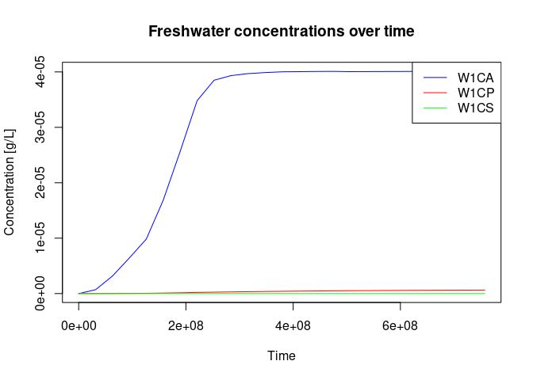
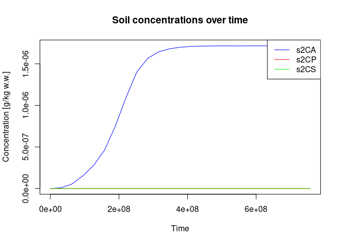

ODE solver set up
================
Valerie de Rijk
2024-06-27

``` r
source("baseScripts/initWorld_onlyParticulate.R")
```

    ## ── Attaching core tidyverse packages ──────────────────────── tidyverse 2.0.0 ──
    ## ✔ dplyr     1.1.4     ✔ readr     2.1.5
    ## ✔ forcats   1.0.0     ✔ stringr   1.5.1
    ## ✔ ggplot2   3.5.0     ✔ tibble    3.2.1
    ## ✔ lubridate 1.9.3     ✔ tidyr     1.3.1
    ## ✔ purrr     1.0.2     
    ## ── Conflicts ────────────────────────────────────────── tidyverse_conflicts() ──
    ## ✖ dplyr::filter() masks stats::filter()
    ## ✖ dplyr::lag()    masks stats::lag()
    ## ℹ Use the conflicted package (<http://conflicted.r-lib.org/>) to force all conflicts to become errors
    ## 
    ## Attaching package: 'ggdag'
    ## 
    ## 
    ## The following object is masked from 'package:stats':
    ## 
    ##     filter
    ## 
    ## 
    ## 
    ## Attaching package: 'rlang'
    ## 
    ## 
    ## The following objects are masked from 'package:purrr':
    ## 
    ##     %@%, flatten, flatten_chr, flatten_dbl, flatten_int, flatten_lgl,
    ##     flatten_raw, invoke, splice
    ## 
    ## 
    ## Joining with `by = join_by(Matrix)`
    ## Joining with `by = join_by(Compartment)`

``` r
World$NewSolver("SB1Solve")
```

What solving means is that using matrix algebra a set of differential
equations is solved:

`K %*% m + e`

Where:

K is the matrix of rate constants for each process describing the mass
transfers to and from and out of a state (e.g. substance in freshwater
(w1U) or small heteroagglomerate in natural soil (s1A)).

m is the mass in each compartment, e.g. 0 at t=0.

e is the emission to each compartment per unit of time, e.g. 1 t/y.

To solve this set of differential equations we thus need an emission,
e.g. 1 ton/year to air. The height of this emission is not

``` r
library(pracma)
```

    ## 
    ## Attaching package: 'pracma'

    ## The following object is masked from 'package:purrr':
    ## 
    ##     cross

``` r
file_paths <- 
  list.files("data/emissions",recursive = TRUE)
Emissions <-
  read_csv(paste0("data/emissions/",file_paths), id="file_name", col_names = c("RUN",0:24),skip = 1)
```

    ## Rows: 120000 Columns: 27

    ## ── Column specification ────────────────────────────────────────────────────────
    ## Delimiter: ","
    ## dbl (26): RUN, 0, 1, 2, 3, 4, 5, 6, 7, 8, 9, 10, 11, 12, 13, 14, 15, 16, 17,...
    ## 
    ## ℹ Use `spec()` to retrieve the full column specification for this data.
    ## ℹ Specify the column types or set `show_col_types = FALSE` to quiet this message.

``` r
Emissions <- 
  Emissions |>
  pivot_longer(
    cols = !c(file_name,RUN),
    names_to = "year",
    values_to = "emission_t" ) |> mutate_at('year',as.numeric) |> 
  ungroup() |> 
  group_by(file_name,year) |> 
  summarise(Emission_p50_kg = quantile(emission_t,probs = 0.5),
            Emission_mean = mean(emission_t)) |> ungroup()
```

    ## `summarise()` has grouped output by 'file_name'. You can override using the
    ## `.groups` argument.

``` r
Emissions <- 
  Emissions |> 
  mutate(compartment = 
           case_when(str_detect(file_name, "(?i)Air") ~ "Air",
                     str_detect(file_name, "(?i)Soil") ~ "SludgeTreatedSoil",
                     str_detect(file_name, "(?i)Water") ~ "SurfaceWater",
                     str_detect(file_name, "(?i)Subsurface") ~ "Subsurface",
                     TRUE ~ "Other"),
         scale = 
           case_when(str_detect(file_name, "(?i)EU") ~ "EU_average",
                     str_detect(file_name, "(?i)Ireland") ~ "EU_STsoil",
                     str_detect(file_name, "(?i)Switzerland") ~ "EU_noSTsoil",
                     TRUE ~ "Other"),
         Substance = "GO-Chitosan",
  )
Emissions <- 
  Emissions |> 
  mutate(compartment = 
           case_when(str_detect(file_name, "(?i)Air") ~ "Air",
                     str_detect(file_name, "(?i)Soil") ~ "SludgeTreatedSoil",
                     str_detect(file_name, "(?i)Water") ~ "SurfaceWater",
                     str_detect(file_name, "(?i)Subsurface") ~ "Subsurface",
                     TRUE ~ "Other"),
         scale = 
           case_when(str_detect(file_name, "(?i)EU") ~ "EU_average",
                     str_detect(file_name, "(?i)Ireland") ~ "EU_STsoil",
                     str_detect(file_name, "(?i)Switzerland") ~ "EU_noSTsoil",
                     TRUE ~ "Other"),
         Substance = "GO-Chitosan",
  )

Emissions <- Emissions |>
  filter(compartment == "SurfaceWater" & scale == "EU_average") |> 
  select(everything())


plot(Emissions$year, Emissions$Emission_mean, 
     type = "l",  # "l" for line plot, or use "p" for points
     xlab = "Time", ylab = "Emission_mean_tonnes",
     main = "Emission Mean over Time")
```

<!-- -->

``` r
Emissions <- Emissions |>
  mutate(Abr = "w1CS")
Emissions_avg <- Emissions[-nrow(Emissions), ]

average_emission <- mean(Emissions_avg$Emission_mean, na.rm = TRUE)
print(average_emission)
```

    ## [1] 28.22046

``` r
emissions <- data.frame(Abbr = "w1CS", 
                        Emis = average_emission)
emissions$Emis<- emissions$Emis * 1000 / (365.25 * 24 * 60 * 60) # convert 1 t/y to si units: kg/s
```

Now we are ready to run the solver, which results in the mass in each
compartment.

``` r
SolutionSteady <- World$Solve(emissions)
SolutionSteady <- SolutionSteady |>
  filter(Species != "Unbound")
```

``` r
SimpleBoxODE = function(t, m, parms) {

  with(as.list(c(parms, m)), {
    e <- c(rep(0, length(SBNames)))
    for (name in names(emis)) {
      e[grep(name, SBNames)] <- emis[[name]] #* (t[2] -t [1])
    }
    dm <- K%*% m + e
    res <- c(dm)
    list(res, signal = e)
  })
}

SBsolve4 <- function( tmax = 1e10, nTIMES = 100, Engine) {

  SB.K = Engine
  SBNames = colnames(Engine)
  SB.m0 <- rep(0, length(SBNames))
  SBtime <- seq(0,tmax,length.out = nTIMES)
  emis <- data.frame(w1CS = (average_emission*1000)/(365.25*24*3600))


  out <- deSolve::ode(
    y = as.numeric(SB.m0),
    times = SBtime ,
    func = SimpleBoxODE,
    parms = list(K = SB.K, SBNames=SBNames, emis= emis),
    rtol = 1e-10, atol = 1e-2)
  #if(as.character(class(deS)[1])!="data.frame") return (list(errorstate="error", deS))
  colnames(out)[1:length(SBNames)+1] <- SBNames
  colnames(out)[grep("signal",colnames(out))] <- paste("emis",SBNames,sep = "2")
  as.data.frame(out) }

SolutionConstantEmissions <- SBsolve4(tmax = 24*(365.25*24*3600),
  nTIMES = 25,
  Engine = World$exportEngineR())
```

``` r
library(dplyr)
TotalMass <- SolutionSteady |>
  summarise(TotalMass = sum(EqMass, na.rm = TRUE)) %>%
  pull(TotalMass)

nTIMES = 24
MassConstantemissions <- SolutionConstantEmissions |>
  mutate(row_number = row_number())
MassConstantemissions <- MassConstantemissions |>
  filter(row_number == (nTIMES - 1)) |>
  select(-row_number)

columns_to_sum <- MassConstantemissions[, !names(MassConstantemissions) %in% c("time")]

# Calculate the row-wise sum of the selected columns
row_sums <- rowSums(columns_to_sum)
print(row_sums)
```

    ## [1] 541719.3

``` r
print(TotalMass)
```

    ## [1] 16908044301

``` r
ggplot(SolutionConstantEmissions, aes(x = time, y = emis2w1CS)) +
  geom_line() +  
  #geom_hline(yintercept = 43*1000, linetype = "dashed", color = "red") +# Add a line for w1Cs2emis over time
  labs(title = "Plot of w1Cs2emis against Time",
       x = "Time",
       y = "w1Cs2emis") +   # Add labels for axes and title
  theme_minimal()      # Use a minimal theme
```

<!-- -->

``` r
library (ggplot2)
w1CS_value <- SolutionSteady$EqMass[SolutionSteady$Abbr == "w1CS"]
ggplot(SolutionConstantEmissions, aes(x = time, y = w1CS)) +
  geom_line() +   
  geom_hline(yintercept = w1CS_value, linetype = "dashed", color = "red")# Add a line for w1CS over time
```

<!-- -->

``` r
  labs(title = "Plot of w1CS against Time",
       x = "Time",
       y = "w1CS") +   # Add labels for axes and title
  theme_minimal()  
```

    ## NULL

``` r
w1CA_value <- SolutionSteady$EqMass[SolutionSteady$Abbr == "w1CA"]
 ggplot(SolutionConstantEmissions, aes(x = time, y = w1CA)) +
  geom_line() +   
  geom_hline(yintercept = w1CA_value, linetype = "dashed", color = "red")# Add a line for w1CS over time
```

<!-- -->

``` r
  labs(title = "Plot of w1CA against Time",
       x = "Time",
       y = "w1CA") +   # Add labels for axes and title
  theme_minimal()   
```

    ## NULL

``` r
tmax <- 25 * (365.25 * 24 * 3600)  # Total number of seconds in 25 years

# Calculate emissions (constant rate)
emissions <- (average_emission * 1000) / ( 365.25 * 24 * 3600)  # Emissions rate in kg/second
times <- seq(0, tmax, length.out = 1000)
# Generate time points (assuming you want to interpolate over some interval)
emis_values <- rep(emissions, length(times))
# Create approxfun
emislist <- list(approxfun(times, emis_values))
emis_fun <- emislist[["w1CS"]]
names(emislist) <- "w1CS"


SimpleBoxODE = function(t, m, parms) {

  with(as.list(c(parms, m)), {
    e <- c(rep(0, length(SBNames)))
    for (name in names(emislist)) {
      e[grep(name, SBNames)] <- emislist[[name]](t) 
    }
    dm <- K%*% m + e
    res <- c(dm)
    list(res, signal = e)
  })
}

SBsolve4 <- function( tmax = 1e10, nTIMES = 100, Engine, emislist) {

  SB.K = Engine
  SBNames = colnames(Engine)
  SB.m0 <- rep(0, length(SBNames))
  SBtime <- seq(0,tmax,length.out = nTIMES)


  out <- deSolve::ode(
    y = as.numeric(SB.m0),
    times = SBtime ,
    func = SimpleBoxODE,
    parms = list(K = SB.K, SBNames=SBNames, emislist= emislist),
    rtol = 1e-10, atol = 1e-2)
  #if(as.character(class(deS)[1])!="data.frame") return (list(errorstate="error", deS))
  colnames(out)[1:length(SBNames)+1] <- SBNames
  colnames(out)[grep("signal",colnames(out))] <- paste("emis",SBNames,sep = "2")
  as.data.frame(out) }

SolutionConstantApproxFun <- SBsolve4(tmax = 24*(365.25*24*3600),
  nTIMES = 25,
  Engine = World$exportEngineR(), 
  emislist = emislist)
```

``` r
w1CA_value <- SolutionSteady$EqMass[SolutionSteady$Abbr == "w1CA"]
w1CS_value <- SolutionSteady$EqMass[SolutionSteady$Abbr == "w1CS"]
w2CA_value <- SolutionSteady$EqMass[SolutionSteady$Abbr == "w2CA"]
s1CA_value <- SolutionSteady$EqMass[SolutionSteady$Abbr == "s1CA"]
print(s1CA_value)
```

    ## [1] 0

``` r
ggplot() +
  geom_line(data = SolutionConstantEmissions, aes(x = time, y = w1CS)) +
  geom_line(data = SolutionConstantApproxFun, aes(x = time, y = w1CS), linetype = "dashed", color = "blue") +
  geom_hline(yintercept = w1CS_value, linetype = "dashed", color = "red")# Add a line for w1CS over time
```

<!-- -->

``` r
  labs(title = "Plot of w1CS against Time",
       x = "Time",
       y = "w1CS") +   # Add labels for axes and title
  theme_minimal() 
```

    ## NULL

``` r
ggplot() +
  geom_line(data = SolutionConstantEmissions, aes(x = time, y = w1CA)) +
  geom_line(data = SolutionConstantApproxFun, aes(x = time, y = w1CA), linetype = "dashed", color = "blue") +
  geom_hline(yintercept = w1CA_value, linetype = "dashed", color = "red") +
  labs(title = "Plot of w1CA against Time",
       x = "Time",
       y = "w1CA") +
  theme_minimal()
```

<!-- -->

``` r
ggplot() +
  geom_line(data = SolutionConstantEmissions, aes(x = time, y = w2CA)) +
  geom_line(data = SolutionConstantApproxFun, aes(x = time, y = w2CA), linetype = "dashed", color = "green") +
  geom_hline(yintercept = w2CA_value, linetype = "dashed", color = "red") +
  labs(title = "Plot of w2CA against Time",
       x = "Time",
       y = "w2CA") +
  theme_minimal()
```

<!-- -->

``` r
Emissions <- Emissions |>
  mutate(time_s = year*(365.25*24*60*60)+(365.25*24*60*60))

Emissions <- Emissions |> 
  mutate(Emission_mean_kg = (Emission_mean* 1000)/(365.25*24*60*60) )

dfapprox<- data.frame(time_s = c(0,Emissions$time_s), emis_kg=c(0,Emissions$Emission_mean_kg))
SBEmissions <- 
  Emissions |> 
  group_by(Abr) |> 
  summarise(n=n(),
            EmisFun = list(
              approxfun(
                data.frame(time_s = c(0,time_s), 
                           emis_kg=c(0,Emission_mean_kg)),
                rule = 1)
            )
  )

funlist <- SBEmissions$EmisFun
names(funlist) <- "w1CS"
w1CS <- funlist[["w1CS"]]


times <- seq(0, 25*365.25*24*3600, by = 1000)


time <- Emissions$year
time_s <-  c(0, time*(365.25*24*60*60)+(365.25*24*60*60))
emis_kg = c(0,(Emissions |> pull(Emission_mean_kg)))

#after 1
timesemisvalue <- seq(31557600, 31557600*2, by = 1000000)
# Calculate the area under the curve using numerical integration
emission_values <- w1CS(timesemisvalue)
area_under_curve <- trapz(timesemisvalue, emission_values)

# Print the area under the curve
print(paste("Area under the curve:", area_under_curve))
```

    ## [1] "Area under the curve: 2520.36485143122"

``` r
emission_year1 <- Emissions %>%
  filter(time_s == 31557600*2) %>%
  pull(Emission_mean_kg)
print(emission_year1)
```

    ## [1] 0.0001311954

``` r
plot(time_s,
     emis_kg)
curve(w1CS,
      add = TRUE)
```

<!-- -->

``` r
##ODE

SimpleBoxODE = function(t, m, parms) {

  with(as.list(c(parms, m)), {
    e <- c(rep(0, length(SBNames)))

    for (name in names(funlist)) {
      e[grep(name, SBNames)] <- funlist[[name]](t)
    }

    dm <- K%*% m + e
    res <- c(dm)
    list(res, signal = e)
  })
}

# print(SBNames)

#Function to Solve
SBsolve4 <- function( tmax = 1e10, nTIMES = 100, Engine, funlist) {

  SB.K = Engine
  SBNames = colnames(Engine)
  SB.m0 <- rep(0, length(SBNames))
  SBtime <- seq(0,tmax,length.out = nTIMES)


  out <- deSolve::ode(
    y = as.numeric(SB.m0),
    times = SBtime ,
    func = SimpleBoxODE,
    parms = list(K = SB.K, SBNames=SBNames, funlist=funlist),
    rtol = 1e-10, atol = 1e-2)
  #if(as.character(class(deS)[1])!="data.frame") return (list(errorstate="error", deS))
  colnames(out)[1:length(SBNames)+1] <- SBNames
  colnames(out)[grep("signal",colnames(out))] <- paste("emis",SBNames,sep = "2")
  as.data.frame(out)

}

# Can also test with xlsx engine
# read in K matrix from xlsx:
# K.Matrix <- readxl::read_xlsx("vignettes/Development/Quality control/SBExcel/SimpleBox4plastics 4.03_GO-Chitosan.xlsx",
#                               sheet = "engine",
#                               range = "D8:FB163") |> as.data.frame()
#
# colnames(K.Matrix) <- readxl::read_xlsx("vignettes/Development/Quality control/SBExcel/SimpleBox4plastics 4.03_GO-Chitosan.xlsx",
#                               sheet = "engine",
#                               range = "D3:FB3",
#                               col_names = FALSE) |> slice(1) |> as.character()
#
# Solving
Solution <- SBsolve4(tmax = 24*(365.25*24*3600),
nTIMES = 25,
Engine = World$exportEngineR(),
funlist = funlist)

# Solution <- SBsolve4(tmax = 25*(365.25*24*3600),
#                      nTIMES = 130,
#                      Engine = as.matrix(K.Matrix),
#                      funlist = funlist)

SolutionEmissionData <- as.data.frame(Solution)

# Same plot of emission as above
plot(Solution$time,Solution$emis2w1CS)
```

<!-- -->

``` r
plot(Solution$time,Solution$w1CS)
```

<!-- -->

``` r
plot(Solution$time,Solution$s2CS)
```

<!-- -->

``` r
plot(Solution$time,Solution$s2CA)
```

<!-- -->

``` r
plot(Solution$time,Solution$s2CP)
```

<!-- -->

``` r
plot(Solution$time,Solution$aCS)
```

<!-- -->

``` r
plot(Solution$time,Solution$sd1CA)
```

<!-- -->

``` r
# Plot for w2CA
plot_w2CA <- ggplot() +
  geom_line(data = SolutionConstantEmissions, aes(x = time, y = w2CA, color = "Constant Emissions")) +
  geom_line(data = SolutionConstantApproxFun, aes(x = time, y = w2CA, color = "Constant ApproxFun")) +
  geom_line(data = SolutionEmissionData, aes(x = time, y = w2CA, color = "SolutionEmissionData")) +
  geom_hline(yintercept = w2CA_value, linetype = "dashed", color = "red", show.legend = TRUE) +
  labs(title = "Plot of w2CA against Time",
       x = "Time (s)",
       y = "w2CA [kg]",
       color = "Data Source") +
  scale_color_manual(values = c("Constant Emissions" = "black", "Constant ApproxFun" = "blue", "SolutionEmissionData" = "green")) +
  theme_minimal()

# Display the plot
print(plot_w2CA)
```

<!-- -->

``` r
# Plot for w1CS
plot_w1CS <- ggplot() +
  geom_line(data = SolutionConstantEmissions, aes(x = time, y = w1CS, color = "Constant Emissions")) +
  geom_line(data = SolutionConstantApproxFun, aes(x = time, y = w1CS,  color = "Constant ApproxFun")) +
  geom_line(data = SolutionEmissionData, aes(x = time, y = w1CS, color = "SolutionEmissionData")) +
  geom_hline(yintercept = w1CS_value, linetype = "dashed", color = "red", show.legend = TRUE) +
  labs(title = "Plot of w1CS against Time",
       x = "Time (s)",
       y = "w2CA [kg]",
       color = "Data Source") +
  scale_color_manual(values = c("Constant Emissions" = "black", "Constant ApproxFun" = "blue", "SolutionEmissionData" = "green")) +
  theme_minimal()

# Display the plot for w1CS
print(plot_w1CS)
```

<!-- -->

``` r
# Plot for w1CA
plot_w1CA <- ggplot() +
  geom_line(data = SolutionConstantEmissions, aes(x = time, y = w1CA, color = "Constant Emissions")) +
  geom_line(data = SolutionConstantApproxFun, aes(x = time, y = w1CA,  color = "Constant ApproxFun")) +
  geom_line(data = SolutionEmissionData, aes(x = time, y = w1CA, color = "SolutionEmissionData")) +
  geom_hline(yintercept = w1CA_value, linetype = "dashed", color = "red", show.legend = TRUE) +
  labs(title = "Plot of w1CA against Time",
       x = "Time (s)",
       y = "w2CA [kg]",
       color = "Data Source") +
  scale_color_manual(values = c("Constant Emissions" = "black", "Constant ApproxFun" = "blue", "SolutionEmissionData" = "green")) +
  theme_minimal()
s1CA_value <- SolutionSteady$EqMass[SolutionSteady$Abbr == "s1CA"]
print(s1CA_value)
```

    ## [1] 0

``` r
plot_s1CA <- ggplot() +
  geom_line(data = SolutionConstantEmissions, aes(x = time, y = s1CA, color = "Constant Emissions")) +
  geom_line(data = SolutionConstantApproxFun, aes(x = time, y = s1CA,  color = "Constant ApproxFun")) +
  geom_line(data = SolutionEmissionData, aes(x = time, y = s1CA, color = "SolutionEmissionData")) +
  geom_hline(yintercept = s1CA_value, linetype = "dashed", color = "red", show.legend = TRUE) +
  labs(title = "Plot of s1CA against Time",
       x = "Time (s)",
       y = "w2CA [kg]",
       color = "Data Source") +
  scale_color_manual(values = c("Constant Emissions" = "black", "Constant ApproxFun" = "blue", "SolutionEmissionData" = "green")) +
  theme_minimal()

print(plot_s1CA)
```

<!-- -->

``` r
kaas <- World$kaas
w1cs <- kaas |> filter (fromScale == "Continental" & fromSubCompart == "river")
print(w1cs)
```

    ##                                                process   fromScale
    ## k_HeteroAgglomeration.wsd.83 k_HeteroAgglomeration.wsd Continental
    ## k_HeteroAgglomeration.wsd.84 k_HeteroAgglomeration.wsd Continental
    ## k_Degradation.21                         k_Degradation Continental
    ## k_Degradation.76                         k_Degradation Continental
    ## k_Degradation.131                        k_Degradation Continental
    ## k_Degradation.186                        k_Degradation Continental
    ## k_Sedimentation.8                      k_Sedimentation Continental
    ## k_Sedimentation.33                     k_Sedimentation Continental
    ## k_Sedimentation.58                     k_Sedimentation Continental
    ## k_Sedimentation.83                     k_Sedimentation Continental
    ## k_Advection.25                             k_Advection Continental
    ## k_Advection.26                             k_Advection Continental
    ## k_Advection.27                             k_Advection Continental
    ## k_Advection.28                             k_Advection Continental
    ## k_Advection.41                             k_Advection Continental
    ## k_Advection.42                             k_Advection Continental
    ## k_Advection.43                             k_Advection Continental
    ## k_Advection.44                             k_Advection Continental
    ##                              fromSubCompart fromSpecies     toScale
    ## k_HeteroAgglomeration.wsd.83          river       Solid Continental
    ## k_HeteroAgglomeration.wsd.84          river       Solid Continental
    ## k_Degradation.21                      river       Large Continental
    ## k_Degradation.76                      river       Small Continental
    ## k_Degradation.131                     river       Solid Continental
    ## k_Degradation.186                     river     Unbound Continental
    ## k_Sedimentation.8                     river       Large Continental
    ## k_Sedimentation.33                    river       Small Continental
    ## k_Sedimentation.58                    river       Solid Continental
    ## k_Sedimentation.83                    river     Unbound Continental
    ## k_Advection.25                        river       Large Continental
    ## k_Advection.26                        river     Unbound Continental
    ## k_Advection.27                        river       Small Continental
    ## k_Advection.28                        river       Solid Continental
    ## k_Advection.41                        river       Solid    Regional
    ## k_Advection.42                        river       Large    Regional
    ## k_Advection.43                        river     Unbound    Regional
    ## k_Advection.44                        river       Small    Regional
    ##                                    toSubCompart toSpecies            k
    ## k_HeteroAgglomeration.wsd.83              river     Large 2.878207e-04
    ## k_HeteroAgglomeration.wsd.84              river     Small 1.133822e-03
    ## k_Degradation.21                          river     Large 1.000000e-20
    ## k_Degradation.76                          river     Small 1.000000e-20
    ## k_Degradation.131                         river     Solid 1.000000e-20
    ## k_Degradation.186                         river   Unbound 1.674746e-21
    ## k_Sedimentation.8            freshwatersediment     Large 9.800125e-06
    ## k_Sedimentation.33           freshwatersediment     Small 1.634995e-08
    ## k_Sedimentation.58           freshwatersediment     Solid 1.722163e-10
    ## k_Sedimentation.83           freshwatersediment   Unbound 5.758839e-06
    ## k_Advection.25                              sea     Large 7.264425e-08
    ## k_Advection.26                              sea   Unbound 7.264425e-08
    ## k_Advection.27                              sea     Small 7.264425e-08
    ## k_Advection.28                              sea     Solid 7.264425e-08
    ## k_Advection.41                            river     Solid 0.000000e+00
    ## k_Advection.42                            river     Large 0.000000e+00
    ## k_Advection.43                            river   Unbound 0.000000e+00
    ## k_Advection.44                            river     Small 0.000000e+00

``` r
library(knitr)
Volume <- World$fetchData("Volume")
Area <- World$fetchData("Area")
FRACw <- World$fetchData("FRACw")
FRACa <- World$fetchData("FRACa")
Fractrial <- FRACa$FRACa[FRACa$SubCompart =="air" & FRACa$Scale =="Arctic" ]
Rho <- World$fetchData("rhoMatrix")
Concentration_eq <- merge(SolutionSteady, Volume, by = c("SubCompart", "Scale"))
Concentration_eq$Concentration <- Concentration_eq$EqMass / Concentration_eq$Volume
RhoWater_value <- Rho$rhoMatrix[Rho$SubCompart == "river"]

f_adjust_concentration <- function(Concentration, FRACw, FRACa, SubCompart, Scale, Rho, RhoWater_value) {
  # Fetch Fracw based on SubCompart and Scale
  Fracw <- FRACw$FRACw[FRACw$SubCompart == SubCompart & FRACw$Scale == Scale]
  
  # Fetch Fraca based on SubCompart and Scale
  Fraca <- FRACa$FRACa[FRACa$SubCompart == SubCompart & FRACa$Scale == Scale]
  
  # Fetch RHOsolid based on SubCompart
  RHOsolid <- Rho$rhoMatrix[Rho$SubCompart == SubCompart]
  
  # Check if any of Fracw, Fraca, or RHOsolid are N
  
  Concentration * 1000 / (Fracw * RhoWater_value + (1 - Fracw - Fraca) * RHOsolid)
}

subcomparts <- c("agriculturalsoil", "naturalsoil", "othersoil", "freshwatersediment", "marinesediment")

filtered_data <- Concentration_eq[Concentration_eq$SubCompart %in% subcomparts, ]

# Apply the adjustment function to the filtered data
adjusted_concentrations <- apply(filtered_data, 1, function(row) {
  f_adjust_concentration(
    Concentration = as.numeric(row["Concentration"]),
    FRACw = subset(FRACw, SubCompart == row["SubCompart"] & Scale == row["Scale"]),
    FRACa = subset(FRACa, SubCompart == row["SubCompart"] & Scale == row["Scale"]),
    Rho = subset(Rho, SubCompart == row["SubCompart"]),
    RhoWater_value = 998,  # Replace with your actual RhoWater_value
    SubCompart = row["SubCompart"],
    Scale = row["Scale"]
  )
})
# Update Concentration_eq with adjusted concentrations
Concentration_eq[Concentration_eq$SubCompart %in% subcomparts, "Concentration"] <- adjusted_concentrations

#Define the units
subcompart <- c("agriculturalsoil", "naturalsoil", "othersoil", "freshwatersediment", "marinesediment",  "lakesediment", "air", "deepocean", "lake" , "river", "sea", "cloudwater")
units <- c("g/kg w", "g/kg w", "g/kg w", "g/kg w", "g/kg w", "g/kg w",
           "kg/kg", "kg/L", "kg/L", "kg/L", "kg/L", "kg/L", "kg/L")

# Combine into a named list
subcompart_units <- setNames(units, subcompart)


Concentration_eq <- Concentration_eq |>
  mutate(Units_per_SubCompart = subcompart_units[SubCompart])

convert_units <- function(concentration, unit) {
  if (unit == "g/kg w") {
    return(concentration * 1e9)
  } else if (unit == "kg/kg") {
    return(concentration * 1e12)
  } else if (unit == "kg/L") {
    return(concentration * 1e12)
  } else {
    return(concentration)
  }
}

# Convert concentrations to ng/kg or ng/L and update units
Concentration_eq <- Concentration_eq |>
  mutate(
         Concentration = mapply(convert_units, Concentration, Units_per_SubCompart),
         Units_per_SubCompart = ifelse(Units_per_SubCompart == "g/kg w", "ng/kg w", 
                                       ifelse(Units_per_SubCompart == "kg/kg", "ng/kg", "ng/L")))
Concentration_eq <- Concentration_eq |>
  mutate(across(where(is.numeric), ~ format(., scientific = TRUE)))

#Concentration_eq <- subset(Concentration_eq, select = -old_EqMass)
Concentration_eq<- Concentration_eq |> rename(Unit = Units_per_SubCompart)
# Create the table with kable and style it with kableExtra
# kable(Concentration_eq, format = "markdown", align = "c", caption = "Concentration per Compartment") |>
#   kable_styling(full_width = T)
# library(DT)
kable(Concentration_eq)
```

| SubCompart         | Scale       | Abbr  | Species | EqMass       | Volume       | Concentration | Unit    |
|:-------------------|:------------|:------|:--------|:-------------|:-------------|:--------------|:--------|
| agriculturalsoil   | Continental | s2CS  | Solid   | 0.000000e+00 | 4.183202e+11 | 0.000000e+00  | ng/kg w |
| agriculturalsoil   | Continental | s2CA  | Small   | 0.000000e+00 | 4.183202e+11 | 0.000000e+00  | ng/kg w |
| agriculturalsoil   | Continental | s2CP  | Large   | 0.000000e+00 | 4.183202e+11 | 0.000000e+00  | ng/kg w |
| agriculturalsoil   | Regional    | s2RS  | Solid   | 0.000000e+00 | 2.747978e+10 | 0.000000e+00  | ng/kg w |
| agriculturalsoil   | Regional    | s2RA  | Small   | 0.000000e+00 | 2.747978e+10 | 0.000000e+00  | ng/kg w |
| agriculturalsoil   | Regional    | s2RP  | Large   | 0.000000e+00 | 2.747978e+10 | 0.000000e+00  | ng/kg w |
| air                | Arctic      | aAS   | Solid   | 0.000000e+00 | 4.249999e+16 | 0.000000e+00  | ng/kg   |
| air                | Arctic      | aAA   | Small   | 0.000000e+00 | 4.249999e+16 | 0.000000e+00  | ng/kg   |
| air                | Arctic      | aAP   | Large   | 0.000000e+00 | 4.249999e+16 | 0.000000e+00  | ng/kg   |
| air                | Continental | aCS   | Solid   | 0.000000e+00 | 7.199998e+15 | 0.000000e+00  | ng/kg   |
| air                | Continental | aCA   | Small   | 0.000000e+00 | 7.199998e+15 | 0.000000e+00  | ng/kg   |
| air                | Continental | aCP   | Large   | 0.000000e+00 | 7.199998e+15 | 0.000000e+00  | ng/kg   |
| air                | Moderate    | aMS   | Solid   | 0.000000e+00 | 7.756998e+16 | 0.000000e+00  | ng/kg   |
| air                | Moderate    | aMA   | Small   | 0.000000e+00 | 7.756998e+16 | 0.000000e+00  | ng/kg   |
| air                | Moderate    | aMP   | Large   | 0.000000e+00 | 7.756998e+16 | 0.000000e+00  | ng/kg   |
| air                | Regional    | aRS   | Solid   | 0.000000e+00 | 2.299999e+14 | 0.000000e+00  | ng/kg   |
| air                | Regional    | aRA   | Small   | 0.000000e+00 | 2.299999e+14 | 0.000000e+00  | ng/kg   |
| air                | Regional    | aRP   | Large   | 0.000000e+00 | 2.299999e+14 | 0.000000e+00  | ng/kg   |
| air                | Tropic      | aTS   | Solid   | 0.000000e+00 | 1.275000e+17 | 0.000000e+00  | ng/kg   |
| air                | Tropic      | aTA   | Small   | 0.000000e+00 | 1.275000e+17 | 0.000000e+00  | ng/kg   |
| air                | Tropic      | aTP   | Large   | 0.000000e+00 | 1.275000e+17 | 0.000000e+00  | ng/kg   |
| cloudwater         | Arctic      | cwAS  | Solid   | 0.000000e+00 | 1.275000e+10 | 0.000000e+00  | ng/L    |
| cloudwater         | Arctic      | cwAA  | Small   | 0.000000e+00 | 1.275000e+10 | 0.000000e+00  | ng/L    |
| cloudwater         | Arctic      | cwAP  | Large   | 0.000000e+00 | 1.275000e+10 | 0.000000e+00  | ng/L    |
| cloudwater         | Continental | cwCS  | Solid   | 0.000000e+00 | 2.160000e+09 | 0.000000e+00  | ng/L    |
| cloudwater         | Continental | cwCA  | Small   | 0.000000e+00 | 2.160000e+09 | 0.000000e+00  | ng/L    |
| cloudwater         | Continental | cwCP  | Large   | 0.000000e+00 | 2.160000e+09 | 0.000000e+00  | ng/L    |
| cloudwater         | Moderate    | cwMS  | Solid   | 0.000000e+00 | 2.327100e+10 | 0.000000e+00  | ng/L    |
| cloudwater         | Moderate    | cwMA  | Small   | 0.000000e+00 | 2.327100e+10 | 0.000000e+00  | ng/L    |
| cloudwater         | Moderate    | cwMP  | Large   | 0.000000e+00 | 2.327100e+10 | 0.000000e+00  | ng/L    |
| cloudwater         | Regional    | cwRS  | Solid   | 0.000000e+00 | 6.900000e+07 | 0.000000e+00  | ng/L    |
| cloudwater         | Regional    | cwRA  | Small   | 0.000000e+00 | 6.900000e+07 | 0.000000e+00  | ng/L    |
| cloudwater         | Regional    | cwRP  | Large   | 0.000000e+00 | 6.900000e+07 | 0.000000e+00  | ng/L    |
| cloudwater         | Tropic      | cwTS  | Solid   | 0.000000e+00 | 3.825000e+10 | 0.000000e+00  | ng/L    |
| cloudwater         | Tropic      | cwTA  | Small   | 0.000000e+00 | 3.825000e+10 | 0.000000e+00  | ng/L    |
| cloudwater         | Tropic      | cwTP  | Large   | 0.000000e+00 | 3.825000e+10 | 0.000000e+00  | ng/L    |
| deepocean          | Arctic      | w3AS  | Solid   | 2.134301e-19 | 7.650000e+16 | 2.789936e-24  | ng/L    |
| deepocean          | Arctic      | w3AA  | Small   | 2.579908e+09 | 7.650000e+16 | 3.372429e+04  | ng/L    |
| deepocean          | Arctic      | w3AP  | Large   | 4.117660e+04 | 7.650000e+16 | 5.382562e-01  | ng/L    |
| deepocean          | Moderate    | w3MS  | Solid   | 1.313524e-14 | 1.163550e+17 | 1.128894e-19  | ng/L    |
| deepocean          | Moderate    | w3MA  | Small   | 3.937375e+09 | 1.163550e+17 | 3.383933e+04  | ng/L    |
| deepocean          | Moderate    | w3MP  | Large   | 1.907831e+05 | 1.163550e+17 | 1.639664e+00  | ng/L    |
| deepocean          | Tropic      | w3TS  | Solid   | 5.369668e-21 | 2.677500e+17 | 2.005478e-26  | ng/L    |
| deepocean          | Tropic      | w3TA  | Small   | 9.769569e+09 | 2.677500e+17 | 3.648765e+04  | ng/L    |
| deepocean          | Tropic      | w3TP  | Large   | 1.579872e+06 | 2.677500e+17 | 5.900548e+00  | ng/L    |
| freshwatersediment | Continental | sd1CS | Solid   | 1.187238e-08 | 2.875952e+09 | 3.179417e-09  | ng/kg w |
| freshwatersediment | Continental | sd1CA | Small   | 5.342287e+03 | 2.875952e+09 | 1.430662e+03  | ng/kg w |
| freshwatersediment | Continental | sd1CP | Large   | 5.869090e+04 | 2.875952e+09 | 1.571740e+04  | ng/kg w |
| freshwatersediment | Regional    | sd1RS | Solid   | 0.000000e+00 | 1.889235e+08 | 0.000000e+00  | ng/kg w |
| freshwatersediment | Regional    | sd1RA | Small   | 0.000000e+00 | 1.889235e+08 | 0.000000e+00  | ng/kg w |
| freshwatersediment | Regional    | sd1RP | Large   | 0.000000e+00 | 1.889235e+08 | 0.000000e+00  | ng/kg w |
| lake               | Continental | w0CS  | Solid   | 0.000000e+00 | 8.715005e+11 | 0.000000e+00  | ng/L    |
| lake               | Continental | w0CA  | Small   | 0.000000e+00 | 8.715005e+11 | 0.000000e+00  | ng/L    |
| lake               | Continental | w0CP  | Large   | 0.000000e+00 | 8.715005e+11 | 0.000000e+00  | ng/L    |
| lake               | Regional    | w0RS  | Solid   | 0.000000e+00 | 5.724953e+10 | 0.000000e+00  | ng/L    |
| lake               | Regional    | w0RA  | Small   | 0.000000e+00 | 5.724953e+10 | 0.000000e+00  | ng/L    |
| lake               | Regional    | w0RP  | Large   | 0.000000e+00 | 5.724953e+10 | 0.000000e+00  | ng/L    |
| lakesediment       | Continental | sd0CS | Solid   | 0.000000e+00 | 2.614501e+08 | 0.000000e+00  | ng/kg w |
| lakesediment       | Continental | sd0CA | Small   | 0.000000e+00 | 2.614501e+08 | 0.000000e+00  | ng/kg w |
| lakesediment       | Continental | sd0CP | Large   | 0.000000e+00 | 2.614501e+08 | 0.000000e+00  | ng/kg w |
| lakesediment       | Regional    | sd0RS | Solid   | 0.000000e+00 | 1.717486e+07 | 0.000000e+00  | ng/kg w |
| lakesediment       | Regional    | sd0RA | Small   | 0.000000e+00 | 1.717486e+07 | 0.000000e+00  | ng/kg w |
| lakesediment       | Regional    | sd0RP | Large   | 0.000000e+00 | 1.717486e+07 | 0.000000e+00  | ng/kg w |
| marinesediment     | Arctic      | sd2AS | Solid   | 8.974529e-25 | 7.650000e+11 | 9.035282e-28  | ng/kg w |
| marinesediment     | Arctic      | sd2AA | Small   | 9.529601e+06 | 7.650000e+11 | 9.594116e+03  | ng/kg w |
| marinesediment     | Arctic      | sd2AP | Large   | 5.693946e+04 | 7.650000e+11 | 5.732491e+01  | ng/kg w |
| marinesediment     | Continental | sd2CS | Solid   | 2.884102e-15 | 1.114199e+11 | 1.993606e-17  | ng/kg w |
| marinesediment     | Continental | sd2CA | Small   | 6.269903e+05 | 1.114199e+11 | 4.334005e+03  | ng/kg w |
| marinesediment     | Continental | sd2CP | Large   | 8.419899e+03 | 1.114199e+11 | 5.820167e+01  | ng/kg w |
| marinesediment     | Moderate    | sd2MS | Solid   | 6.058580e-20 | 1.163550e+12 | 4.010304e-23  | ng/kg w |
| marinesediment     | Moderate    | sd2MA | Small   | 1.311547e+07 | 1.163550e+12 | 8.681408e+03  | ng/kg w |
| marinesediment     | Moderate    | sd2MP | Large   | 2.535046e+05 | 1.163550e+12 | 1.678001e+02  | ng/kg w |
| marinesediment     | Regional    | sd2RS | Solid   | 3.177843e-22 | 3.005619e+07 | 8.143107e-21  | ng/kg w |
| marinesediment     | Regional    | sd2RA | Small   | 1.521709e+02 | 3.005619e+07 | 3.899322e+03  | ng/kg w |
| marinesediment     | Regional    | sd2RP | Large   | 1.707613e+00 | 3.005619e+07 | 4.375695e+01  | ng/kg w |
| marinesediment     | Tropic      | sd2TS | Solid   | 6.575441e-32 | 2.677500e+12 | 1.891416e-35  | ng/kg w |
| marinesediment     | Tropic      | sd2TA | Small   | 3.141476e+07 | 2.677500e+12 | 9.036406e+03  | ng/kg w |
| marinesediment     | Tropic      | sd2TP | Large   | 2.011352e+06 | 2.677500e+12 | 5.785623e+02  | ng/kg w |
| naturalsoil        | Arctic      | s1AS  | Solid   | 0.000000e+00 | 8.500000e+11 | 0.000000e+00  | ng/kg w |
| naturalsoil        | Arctic      | s1AA  | Small   | 0.000000e+00 | 8.500000e+11 | 0.000000e+00  | ng/kg w |
| naturalsoil        | Arctic      | s1AP  | Large   | 0.000000e+00 | 8.500000e+11 | 0.000000e+00  | ng/kg w |
| naturalsoil        | Continental | s1CS  | Solid   | 0.000000e+00 | 4.706103e+10 | 0.000000e+00  | ng/kg w |
| naturalsoil        | Continental | s1CA  | Small   | 0.000000e+00 | 4.706103e+10 | 0.000000e+00  | ng/kg w |
| naturalsoil        | Continental | s1CP  | Large   | 0.000000e+00 | 4.706103e+10 | 0.000000e+00  | ng/kg w |
| naturalsoil        | Moderate    | s1MS  | Solid   | 0.000000e+00 | 1.939250e+12 | 0.000000e+00  | ng/kg w |
| naturalsoil        | Moderate    | s1MA  | Small   | 0.000000e+00 | 1.939250e+12 | 0.000000e+00  | ng/kg w |
| naturalsoil        | Moderate    | s1MP  | Large   | 0.000000e+00 | 1.939250e+12 | 0.000000e+00  | ng/kg w |
| naturalsoil        | Regional    | s1RS  | Solid   | 0.000000e+00 | 3.091475e+09 | 0.000000e+00  | ng/kg w |
| naturalsoil        | Regional    | s1RA  | Small   | 0.000000e+00 | 3.091475e+09 | 0.000000e+00  | ng/kg w |
| naturalsoil        | Regional    | s1RP  | Large   | 0.000000e+00 | 3.091475e+09 | 0.000000e+00  | ng/kg w |
| naturalsoil        | Tropic      | s1TS  | Solid   | 0.000000e+00 | 1.912500e+12 | 0.000000e+00  | ng/kg w |
| naturalsoil        | Tropic      | s1TA  | Small   | 0.000000e+00 | 1.912500e+12 | 0.000000e+00  | ng/kg w |
| naturalsoil        | Tropic      | s1TP  | Large   | 0.000000e+00 | 1.912500e+12 | 0.000000e+00  | ng/kg w |
| othersoil          | Continental | s3CS  | Solid   | 0.000000e+00 | 1.743001e+10 | 0.000000e+00  | ng/kg w |
| othersoil          | Continental | s3CA  | Small   | 0.000000e+00 | 1.743001e+10 | 0.000000e+00  | ng/kg w |
| othersoil          | Continental | s3CP  | Large   | 0.000000e+00 | 1.743001e+10 | 0.000000e+00  | ng/kg w |
| othersoil          | Regional    | s3RS  | Solid   | 0.000000e+00 | 1.144991e+09 | 0.000000e+00  | ng/kg w |
| othersoil          | Regional    | s3RA  | Small   | 0.000000e+00 | 1.144991e+09 | 0.000000e+00  | ng/kg w |
| othersoil          | Regional    | s3RP  | Large   | 0.000000e+00 | 1.144991e+09 | 0.000000e+00  | ng/kg w |
| river              | Continental | w1CS  | Solid   | 6.289952e-01 | 2.875952e+11 | 2.187085e+00  | ng/L    |
| river              | Continental | w1CA  | Small   | 9.606463e+03 | 2.875952e+11 | 3.340273e+04  | ng/L    |
| river              | Continental | w1CP  | Large   | 1.760727e+02 | 2.875952e+11 | 6.122242e+02  | ng/L    |
| river              | Regional    | w1RS  | Solid   | 0.000000e+00 | 1.889235e+10 | 0.000000e+00  | ng/L    |
| river              | Regional    | w1RA  | Small   | 0.000000e+00 | 1.889235e+10 | 0.000000e+00  | ng/L    |
| river              | Regional    | w1RP  | Large   | 0.000000e+00 | 1.889235e+10 | 0.000000e+00  | ng/L    |
| sea                | Arctic      | w2AS  | Solid   | 2.208169e-15 | 2.550000e+15 | 8.659486e-19  | ng/L    |
| sea                | Arctic      | w2AA  | Small   | 1.044038e+08 | 2.550000e+15 | 4.094265e+04  | ng/L    |
| sea                | Arctic      | w2AP  | Large   | 5.254285e+02 | 2.550000e+15 | 2.060504e-01  | ng/L    |
| sea                | Continental | w2CS  | Solid   | 1.514520e-05 | 7.427996e+14 | 2.038935e-08  | ng/L    |
| sea                | Continental | w2CA  | Small   | 2.505444e+07 | 7.427996e+14 | 3.372974e+04  | ng/L    |
| sea                | Continental | w2CP  | Large   | 5.613266e+02 | 7.427996e+14 | 7.556905e-01  | ng/L    |
| sea                | Moderate    | w2MS  | Solid   | 1.590757e-10 | 3.878500e+15 | 4.101476e-14  | ng/L    |
| sea                | Moderate    | w2MA  | Small   | 1.308002e+08 | 3.878500e+15 | 3.372443e+04  | ng/L    |
| sea                | Moderate    | w2MP  | Large   | 2.090719e+03 | 3.878500e+15 | 5.390534e-01  | ng/L    |
| sea                | Regional    | w2RS  | Solid   | 8.343856e-14 | 1.001873e+10 | 8.328256e-12  | ng/L    |
| sea                | Regional    | w2RA  | Small   | 3.040363e+02 | 1.001873e+10 | 3.034679e+04  | ng/L    |
| sea                | Regional    | w2RP  | Large   | 5.692045e-03 | 1.001873e+10 | 5.681403e-01  | ng/L    |
| sea                | Tropic      | w2TS  | Solid   | 1.289704e-26 | 8.925000e+15 | 1.445047e-30  | ng/L    |
| sea                | Tropic      | w2TA  | Small   | 3.020121e+08 | 8.925000e+15 | 3.383889e+04  | ng/L    |
| sea                | Tropic      | w2TP  | Large   | 1.438268e+04 | 8.925000e+15 | 1.611505e+00  | ng/L    |

``` r
library(dplyr)
nTIMES <- 25
#seperate signals and matrix
#compartments
compartments <- SolutionEmissionData[, 1:156]
compartments <- compartments |> select(-matches("U$"))
signals <- SolutionEmissionData[, 157:311]
# Fetch necessary data
Volume <- World$fetchData("Volume")
Area <- World$fetchData("Area")
FRACw <- World$fetchData("FRACw")
print(FRACw)
```

    ##          Scale         SubCompart FRACw
    ## 2       Arctic                air 2e-11
    ## 8       Arctic     marinesediment 8e-01
    ## 9       Arctic        naturalsoil 2e-01
    ## 13 Continental   agriculturalsoil 2e-01
    ## 14 Continental                air 2e-11
    ## 17 Continental freshwatersediment 8e-01
    ## 19 Continental       lakesediment 8e-01
    ## 20 Continental     marinesediment 8e-01
    ## 21 Continental        naturalsoil 2e-01
    ## 22 Continental          othersoil 2e-01
    ## 26    Moderate                air 2e-11
    ## 32    Moderate     marinesediment 8e-01
    ## 33    Moderate        naturalsoil 2e-01
    ## 37    Regional   agriculturalsoil 2e-01
    ## 38    Regional                air 2e-11
    ## 41    Regional freshwatersediment 8e-01
    ## 43    Regional       lakesediment 8e-01
    ## 44    Regional     marinesediment 8e-01
    ## 45    Regional        naturalsoil 2e-01
    ## 46    Regional          othersoil 2e-01
    ## 50      Tropic                air 2e-11
    ## 56      Tropic     marinesediment 8e-01
    ## 57      Tropic        naturalsoil 2e-01

``` r
FRACa <- World$fetchData("FRACa")
print(FRACa)
```

    ##          Scale         SubCompart FRACa
    ## 2       Arctic                air   1.0
    ## 5       Arctic freshwatersediment   0.0
    ## 7       Arctic       lakesediment   0.0
    ## 8       Arctic     marinesediment   0.0
    ## 9       Arctic        naturalsoil   0.2
    ## 13 Continental   agriculturalsoil   0.2
    ## 14 Continental                air   1.0
    ## 17 Continental freshwatersediment   0.0
    ## 19 Continental       lakesediment   0.0
    ## 20 Continental     marinesediment   0.0
    ## 21 Continental        naturalsoil   0.2
    ## 22 Continental          othersoil   0.2
    ## 26    Moderate                air   1.0
    ## 29    Moderate freshwatersediment   0.0
    ## 31    Moderate       lakesediment   0.0
    ## 32    Moderate     marinesediment   0.0
    ## 33    Moderate        naturalsoil   0.2
    ## 37    Regional   agriculturalsoil   0.2
    ## 38    Regional                air   1.0
    ## 41    Regional freshwatersediment   0.0
    ## 43    Regional       lakesediment   0.0
    ## 44    Regional     marinesediment   0.0
    ## 45    Regional        naturalsoil   0.2
    ## 46    Regional          othersoil   0.2
    ## 50      Tropic                air   1.0
    ## 53      Tropic freshwatersediment   0.0
    ## 55      Tropic       lakesediment   0.0
    ## 56      Tropic     marinesediment   0.0
    ## 57      Tropic        naturalsoil   0.2

``` r
Rho <- World$fetchData("rhoMatrix")
print(Rho)
```

    ##            SubCompart rhoMatrix
    ## 1    agriculturalsoil  2500.000
    ## 2                 air     1.225
    ## 3          cloudwater   998.000
    ## 4           deepocean   998.000
    ## 5  freshwatersediment  2500.000
    ## 6                lake   998.000
    ## 7        lakesediment  2500.000
    ## 8      marinesediment  2500.000
    ## 9         naturalsoil  2500.000
    ## 10          othersoil  2500.000
    ## 11              river   998.000
    ## 12                sea   998.000

``` r
# Define acronyms maps
acronym_map <- c(
  "marinesediment" = "sd2", "freshwatersediment" = "sd1", "lakesediment" = "sd0",
  "agriculturalsoil" = "s2", "naturalsoil" = "s1", "othersoil" = "s3",
  "air" = "a", "deepocean" = "w3", "sea" = "w2", "river" = "w1", "lake" = "w0", "cloudwater" = "cw"
)
acronym_map2 <- c("Arctic" = "A", "Moderate" = "M", "Tropic" = "T", "Continental" = "C", "Regional" = "R")
acronym_map3 <- c("Dissolved" = "D", "Gas" = "G", "Large" = "P", "Small" = "A", "Solid" = "S", "Unbound" = "U")

# Add compartment column to data
Volume <- Volume |> mutate(compartment = paste0(acronym_map[SubCompart], acronym_map2[Scale]))
FRACw <- FRACw |> mutate(compartment = paste0(acronym_map[SubCompart], acronym_map2[Scale]))
FRACa <- FRACa |> mutate(compartment = paste0(acronym_map[SubCompart], acronym_map2[Scale]))
Rho <- Rho |> mutate(compartment = paste0(acronym_map[SubCompart]))
print(FRACa)
```

    ##          Scale         SubCompart FRACa compartment
    ## 2       Arctic                air   1.0          aA
    ## 5       Arctic freshwatersediment   0.0        sd1A
    ## 7       Arctic       lakesediment   0.0        sd0A
    ## 8       Arctic     marinesediment   0.0        sd2A
    ## 9       Arctic        naturalsoil   0.2         s1A
    ## 13 Continental   agriculturalsoil   0.2         s2C
    ## 14 Continental                air   1.0          aC
    ## 17 Continental freshwatersediment   0.0        sd1C
    ## 19 Continental       lakesediment   0.0        sd0C
    ## 20 Continental     marinesediment   0.0        sd2C
    ## 21 Continental        naturalsoil   0.2         s1C
    ## 22 Continental          othersoil   0.2         s3C
    ## 26    Moderate                air   1.0          aM
    ## 29    Moderate freshwatersediment   0.0        sd1M
    ## 31    Moderate       lakesediment   0.0        sd0M
    ## 32    Moderate     marinesediment   0.0        sd2M
    ## 33    Moderate        naturalsoil   0.2         s1M
    ## 37    Regional   agriculturalsoil   0.2         s2R
    ## 38    Regional                air   1.0          aR
    ## 41    Regional freshwatersediment   0.0        sd1R
    ## 43    Regional       lakesediment   0.0        sd0R
    ## 44    Regional     marinesediment   0.0        sd2R
    ## 45    Regional        naturalsoil   0.2         s1R
    ## 46    Regional          othersoil   0.2         s3R
    ## 50      Tropic                air   1.0          aT
    ## 53      Tropic freshwatersediment   0.0        sd1T
    ## 55      Tropic       lakesediment   0.0        sd0T
    ## 56      Tropic     marinesediment   0.0        sd2T
    ## 57      Tropic        naturalsoil   0.2         s1T

``` r
print(Rho)
```

    ##            SubCompart rhoMatrix compartment
    ## 1    agriculturalsoil  2500.000          s2
    ## 2                 air     1.225           a
    ## 3          cloudwater   998.000          cw
    ## 4           deepocean   998.000          w3
    ## 5  freshwatersediment  2500.000         sd1
    ## 6                lake   998.000          w0
    ## 7        lakesediment  2500.000         sd0
    ## 8      marinesediment  2500.000         sd2
    ## 9         naturalsoil  2500.000          s1
    ## 10          othersoil  2500.000          s3
    ## 11              river   998.000          w1
    ## 12                sea   998.000          w2

``` r
CompartmentsConc <- compartments
# List of columns in CompartmentsConc that need transformation
columns_to_transform <- setdiff(names(CompartmentsConc), "time")

# Calculate concentrations by dividing by the corresponding volume
for (col in columns_to_transform) {
  compartment <- substr(col, 1, nchar(col) - 1)
  volume <- Volume$Volume[Volume$compartment == compartment]
  if (length(volume) == 1) {
    CompartmentsConc[[col]] <- CompartmentsConc[[col]] / volume
  } else {
    warning(paste("Volume not found for compartment", compartment))
  }
}

## Extract soil and sediment columns
CompartmentsConc_soil_names <- grep("^s[123]", names(CompartmentsConc), value = TRUE)
CompartmentsConc_sediment_names <- grep("^sd[0123]", names(CompartmentsConc), value = TRUE)
print(CompartmentsConc_sediment_names)
```

    ##  [1] "sd1RS" "sd1RA" "sd1RP" "sd0RS" "sd0RA" "sd0RP" "sd2RS" "sd2RA" "sd2RP"
    ## [10] "sd1CS" "sd1CA" "sd1CP" "sd0CS" "sd0CA" "sd0CP" "sd2CS" "sd2CA" "sd2CP"
    ## [19] "sd2AS" "sd2AA" "sd2AP" "sd2MS" "sd2MA" "sd2MP" "sd2TS" "sd2TA" "sd2TP"

``` r
CompartmentsConc_soil <- CompartmentsConc[, CompartmentsConc_soil_names]
CompartmentsConc_sediment <- CompartmentsConc[, CompartmentsConc_sediment_names]


# Combine soil and sediment columns
CompartmentsConc_combined <- cbind(CompartmentsConc_soil, CompartmentsConc_sediment)


# Identify the columns that are not in the excluded list
included_names <- setdiff(names(CompartmentsConc), names(CompartmentsConc_combined))
included_names <- included_names[!grepl("time", included_names, ignore.case = TRUE)]
print(included_names)
```

    ##  [1] "aRS"  "aRA"  "aRP"  "cwRS" "cwRA" "cwRP" "w1RS" "w1RA" "w1RP" "w0RS"
    ## [11] "w0RA" "w0RP" "w2RS" "w2RA" "w2RP" "aCS"  "aCA"  "aCP"  "cwCS" "cwCA"
    ## [21] "cwCP" "w1CS" "w1CA" "w1CP" "w0CS" "w0CA" "w0CP" "w2CS" "w2CA" "w2CP"
    ## [31] "aAS"  "aAA"  "aAP"  "cwAS" "cwAA" "cwAP" "w2AS" "w2AA" "w2AP" "w3AS"
    ## [41] "w3AA" "w3AP" "aMS"  "aMA"  "aMP"  "cwMS" "cwMA" "cwMP" "w2MS" "w2MA"
    ## [51] "w2MP" "w3MS" "w3MA" "w3MP" "aTS"  "aTA"  "aTP"  "cwTS" "cwTA" "cwTP"
    ## [61] "w2TS" "w2TA" "w2TP" "w3TS" "w3TA" "w3TP"

``` r
# Multiply the included columns by 1000
CompartmentsConc[included_names] <- CompartmentsConc[included_names] * 1000

# Get RhoWater value for river compartment
RhoWater_value <- Rho$rhoMatrix[Rho$SubCompart == "river"]

# Define function to adjust concentrations
f_adjust_concentration <- function(CompConc, Fracw, Fraca, RHOsolid) {
  CompConc * 1000 / (Fracw * RhoWater_value + (1 - Fracw - Fraca) * RHOsolid)
}

# Get compartment prefixes for combined soil and sediment
compartment_prefixes_scale_sd <- substr(names(CompartmentsConc_sediment), 1, 4)
compartment_prefixes_scale_s <- substr(names(CompartmentsConc_soil), 1, 3)
compartment_prefixes_combined_scale <- cbind(compartment_prefixes_scale_s, compartment_prefixes_scale_sd)
compartment_prefixes_sd <- substr(names(CompartmentsConc_sediment), 1, 3)
compartment_prefixes_s <- substr(names(CompartmentsConc_soil),1, 2)
compartment_prefixes_combined <- cbind(compartment_prefixes_s, compartment_prefixes_sd)

# Get corresponding FRACw, FRACa, and Rho values for combined soil and sediment
FRACw_values_combined <- FRACw$FRACw[match(compartment_prefixes_combined_scale, FRACw$compartment)]
print(FRACw_values_combined)
```

    ##  [1] 0.2 0.2 0.2 0.2 0.2 0.2 0.2 0.2 0.2 0.2 0.2 0.2 0.2 0.2 0.2 0.2 0.2 0.2 0.2
    ## [20] 0.2 0.2 0.2 0.2 0.2 0.2 0.2 0.2 0.8 0.8 0.8 0.8 0.8 0.8 0.8 0.8 0.8 0.8 0.8
    ## [39] 0.8 0.8 0.8 0.8 0.8 0.8 0.8 0.8 0.8 0.8 0.8 0.8 0.8 0.8 0.8 0.8

``` r
FRACa_values_combined <- FRACa$FRACa[match(compartment_prefixes_combined_scale, FRACa$compartment)]
print(FRACa_values_combined)
```

    ##  [1] 0.2 0.2 0.2 0.2 0.2 0.2 0.2 0.2 0.2 0.2 0.2 0.2 0.2 0.2 0.2 0.2 0.2 0.2 0.2
    ## [20] 0.2 0.2 0.2 0.2 0.2 0.2 0.2 0.2 0.0 0.0 0.0 0.0 0.0 0.0 0.0 0.0 0.0 0.0 0.0
    ## [39] 0.0 0.0 0.0 0.0 0.0 0.0 0.0 0.0 0.0 0.0 0.0 0.0 0.0 0.0 0.0 0.0

``` r
Rho_values_combined <- Rho$rhoMatrix[match(compartment_prefixes_combined, Rho$compartment)]
print(Rho_values_combined)
```

    ##  [1] 2500 2500 2500 2500 2500 2500 2500 2500 2500 2500 2500 2500 2500 2500 2500
    ## [16] 2500 2500 2500 2500 2500 2500 2500 2500 2500 2500 2500 2500 2500 2500 2500
    ## [31] 2500 2500 2500 2500 2500 2500 2500 2500 2500 2500 2500 2500 2500 2500 2500
    ## [46] 2500 2500 2500 2500 2500 2500 2500 2500 2500

``` r
# Apply the function to adjust combined soil and sediment concentrations
CompartmentsConc_combined_adjusted <- mapply(
  f_adjust_concentration,
  CompartmentsConc_combined,
  Fracw = FRACw_values_combined,
  Fraca = FRACa_values_combined,
  RHOsolid = Rho_values_combined,
  SIMPLIFY = FALSE
) |> as.data.frame()

# Assign column names to adjusted data
colnames(CompartmentsConc_combined_adjusted) <- colnames(CompartmentsConc_combined)
print(CompartmentsConc_combined_adjusted)
```

    ##    s1RS s1RA s1RP s2RS s2RA s2RP s3RS s3RA s3RP s1CS s1CA s1CP s2CS s2CA s2CP
    ## 1     0    0    0    0    0    0    0    0    0    0    0    0    0    0    0
    ## 2     0    0    0    0    0    0    0    0    0    0    0    0    0    0    0
    ## 3     0    0    0    0    0    0    0    0    0    0    0    0    0    0    0
    ## 4     0    0    0    0    0    0    0    0    0    0    0    0    0    0    0
    ## 5     0    0    0    0    0    0    0    0    0    0    0    0    0    0    0
    ## 6     0    0    0    0    0    0    0    0    0    0    0    0    0    0    0
    ## 7     0    0    0    0    0    0    0    0    0    0    0    0    0    0    0
    ## 8     0    0    0    0    0    0    0    0    0    0    0    0    0    0    0
    ## 9     0    0    0    0    0    0    0    0    0    0    0    0    0    0    0
    ## 10    0    0    0    0    0    0    0    0    0    0    0    0    0    0    0
    ## 11    0    0    0    0    0    0    0    0    0    0    0    0    0    0    0
    ## 12    0    0    0    0    0    0    0    0    0    0    0    0    0    0    0
    ## 13    0    0    0    0    0    0    0    0    0    0    0    0    0    0    0
    ## 14    0    0    0    0    0    0    0    0    0    0    0    0    0    0    0
    ## 15    0    0    0    0    0    0    0    0    0    0    0    0    0    0    0
    ## 16    0    0    0    0    0    0    0    0    0    0    0    0    0    0    0
    ## 17    0    0    0    0    0    0    0    0    0    0    0    0    0    0    0
    ## 18    0    0    0    0    0    0    0    0    0    0    0    0    0    0    0
    ## 19    0    0    0    0    0    0    0    0    0    0    0    0    0    0    0
    ## 20    0    0    0    0    0    0    0    0    0    0    0    0    0    0    0
    ## 21    0    0    0    0    0    0    0    0    0    0    0    0    0    0    0
    ## 22    0    0    0    0    0    0    0    0    0    0    0    0    0    0    0
    ## 23    0    0    0    0    0    0    0    0    0    0    0    0    0    0    0
    ## 24    0    0    0    0    0    0    0    0    0    0    0    0    0    0    0
    ## 25    0    0    0    0    0    0    0    0    0    0    0    0    0    0    0
    ##    s3CS s3CA s3CP s1AS s1AA s1AP s1MS s1MA s1MP s1TS s1TA s1TP sd1RS sd1RA
    ## 1     0    0    0    0    0    0    0    0    0    0    0    0     0     0
    ## 2     0    0    0    0    0    0    0    0    0    0    0    0     0     0
    ## 3     0    0    0    0    0    0    0    0    0    0    0    0     0     0
    ## 4     0    0    0    0    0    0    0    0    0    0    0    0     0     0
    ## 5     0    0    0    0    0    0    0    0    0    0    0    0     0     0
    ## 6     0    0    0    0    0    0    0    0    0    0    0    0     0     0
    ## 7     0    0    0    0    0    0    0    0    0    0    0    0     0     0
    ## 8     0    0    0    0    0    0    0    0    0    0    0    0     0     0
    ## 9     0    0    0    0    0    0    0    0    0    0    0    0     0     0
    ## 10    0    0    0    0    0    0    0    0    0    0    0    0     0     0
    ## 11    0    0    0    0    0    0    0    0    0    0    0    0     0     0
    ## 12    0    0    0    0    0    0    0    0    0    0    0    0     0     0
    ## 13    0    0    0    0    0    0    0    0    0    0    0    0     0     0
    ## 14    0    0    0    0    0    0    0    0    0    0    0    0     0     0
    ## 15    0    0    0    0    0    0    0    0    0    0    0    0     0     0
    ## 16    0    0    0    0    0    0    0    0    0    0    0    0     0     0
    ## 17    0    0    0    0    0    0    0    0    0    0    0    0     0     0
    ## 18    0    0    0    0    0    0    0    0    0    0    0    0     0     0
    ## 19    0    0    0    0    0    0    0    0    0    0    0    0     0     0
    ## 20    0    0    0    0    0    0    0    0    0    0    0    0     0     0
    ## 21    0    0    0    0    0    0    0    0    0    0    0    0     0     0
    ## 22    0    0    0    0    0    0    0    0    0    0    0    0     0     0
    ## 23    0    0    0    0    0    0    0    0    0    0    0    0     0     0
    ## 24    0    0    0    0    0    0    0    0    0    0    0    0     0     0
    ## 25    0    0    0    0    0    0    0    0    0    0    0    0     0     0
    ##    sd1RP sd0RS sd0RA sd0RP        sd2RS        sd2RA        sd2RP        sd1CS
    ## 1      0     0     0     0 0.000000e+00 0.000000e+00 0.000000e+00 0.000000e+00
    ## 2      0     0     0     0 3.019523e-31 1.709947e-12 1.082365e-12 1.178985e-19
    ## 3      0     0     0     0 1.194400e-30 1.927204e-11 8.509604e-12 4.663517e-19
    ## 4      0     0     0     0 2.061011e-30 8.116855e-11 3.061116e-11 8.047140e-19
    ## 5      0     0     0     0 2.923641e-30 2.013800e-10 7.363823e-11 1.141523e-18
    ## 6      0     0     0     0 5.311665e-30 3.856306e-10 1.488862e-10 2.073920e-18
    ## 7      0     0     0     0 7.588012e-30 6.792559e-10 2.772664e-10 2.962703e-18
    ## 8      0     0     0     0 9.893458e-30 1.107009e-09 4.741531e-10 3.862846e-18
    ## 9      0     0     0     0 9.789689e-30 1.646631e-09 7.454387e-10 3.822314e-18
    ## 10     0     0     0     0 9.779421e-30 2.192970e-09 1.079682e-09 3.818306e-18
    ## 11     0     0     0     0 9.763138e-30 2.668557e-09 1.471774e-09 3.811948e-18
    ## 12     0     0     0     0 9.767925e-30 3.054852e-09 1.916446e-09 3.813817e-18
    ## 13     0     0     0     0 9.785365e-30 3.358517e-09 2.408379e-09 3.820627e-18
    ## 14     0     0     0     0 9.768583e-30 3.593883e-09 2.942071e-09 3.814074e-18
    ## 15     0     0     0     0 9.781024e-30 3.774546e-09 3.511882e-09 3.818931e-18
    ## 16     0     0     0     0 9.778923e-30 3.913058e-09 4.112536e-09 3.818111e-18
    ## 17     0     0     0     0 9.755663e-30 4.019414e-09 4.738704e-09 3.809029e-18
    ## 18     0     0     0     0 9.771426e-30 4.100737e-09 5.385339e-09 3.815184e-18
    ## 19     0     0     0     0 9.769450e-30 4.163775e-09 6.047951e-09 3.814412e-18
    ## 20     0     0     0     0 9.773021e-30 4.213450e-09 6.722159e-09 3.815807e-18
    ## 21     0     0     0     0 9.775908e-30 4.253196e-09 7.403987e-09 3.816934e-18
    ## 22     0     0     0     0 9.773451e-30 4.285571e-09 8.089753e-09 3.815974e-18
    ## 23     0     0     0     0 9.756482e-30 4.312168e-09 8.776025e-09 3.809349e-18
    ## 24     0     0     0     0 9.787571e-30 4.333982e-09 9.459782e-09 3.821488e-18
    ## 25     0     0     0     0 9.779598e-30 4.353183e-09 1.013857e-08 3.818356e-18
    ##           sd1CA        sd1CP sd0CS sd0CA sd0CP        sd2CS        sd2CA
    ## 1  0.000000e+00 0.000000e+00     0     0     0 0.000000e+00 0.000000e+00
    ## 2  8.622936e-09 2.701494e-08     0     0     0 7.392547e-28 2.057566e-12
    ## 3  5.464318e-08 1.579741e-07     0     0     0 2.924168e-27 2.238782e-11
    ## 4  1.522340e-07 4.328641e-07     0     0     0 5.045818e-27 9.278791e-11
    ## 5  2.777435e-07 8.357665e-07     0     0     0 7.157723e-27 2.282176e-10
    ## 6  4.602357e-07 1.491173e-06     0     0     0 1.300415e-26 4.355264e-10
    ## 7  7.497118e-07 2.499853e-06     0     0     0 1.857713e-26 7.658892e-10
    ## 8  1.097041e-06 3.822131e-06     0     0     0 2.422135e-26 1.245643e-09
    ## 9  1.404970e-06 5.216060e-06     0     0     0 2.396724e-26 1.848213e-09
    ## 10 1.566350e-06 6.471885e-06     0     0     0 2.394211e-26 2.455039e-09
    ## 11 1.643933e-06 7.609990e-06     0     0     0 2.390224e-26 2.981749e-09
    ## 12 1.680843e-06 8.642512e-06     0     0     0 2.391396e-26 3.408799e-09
    ## 13 1.699426e-06 9.582160e-06     0     0     0 2.395666e-26 3.744084e-09
    ## 14 1.708964e-06 1.043552e-05     0     0     0 2.391557e-26 4.003696e-09
    ## 15 1.713180e-06 1.121013e-05     0     0     0 2.394603e-26 4.202782e-09
    ## 16 1.715732e-06 1.191449e-05     0     0     0 2.394089e-26 4.355315e-09
    ## 17 1.716271e-06 1.255184e-05     0     0     0 2.388394e-26 4.472348e-09
    ## 18 1.715708e-06 1.313001e-05     0     0     0 2.392253e-26 4.561772e-09
    ## 19 1.716069e-06 1.365627e-05     0     0     0 2.391770e-26 4.631085e-09
    ## 20 1.716343e-06 1.413433e-05     0     0     0 2.392644e-26 4.685699e-09
    ## 21 1.716748e-06 1.456906e-05     0     0     0 2.393351e-26 4.729405e-09
    ## 22 1.717058e-06 1.496388e-05     0     0     0 2.392749e-26 4.765015e-09
    ## 23 1.716611e-06 1.532068e-05     0     0     0 2.388595e-26 4.794270e-09
    ## 24 1.716349e-06 1.564601e-05     0     0     0 2.396206e-26 4.818277e-09
    ## 25 1.717663e-06 1.594381e-05     0     0     0 2.394248e-26 4.839460e-09
    ##           sd2CP        sd2AS        sd2AA        sd2AP        sd2MS
    ## 1  0.000000e+00 0.000000e+00 0.000000e+00 0.000000e+00 0.000000e+00
    ## 2  3.667780e-12 3.350295e-38 4.940125e-15 1.765436e-15 1.487050e-33
    ## 3  2.762250e-11 1.325249e-37 8.600622e-14 1.648220e-14 5.882161e-33
    ## 4  9.526767e-11 2.286810e-37 4.671057e-13 6.777282e-14 1.015004e-32
    ## 5  2.201161e-10 3.243949e-37 1.438006e-12 1.815315e-13 1.439830e-32
    ## 6  4.315062e-10 5.893593e-37 3.270419e-12 3.953988e-13 2.615881e-32
    ## 7  7.844837e-10 8.419343e-37 6.479974e-12 7.791116e-13 3.736933e-32
    ## 8  1.309244e-09 1.097738e-36 1.174492e-11 1.407149e-12 4.872315e-32
    ## 9  2.001481e-09 1.086227e-36 1.960709e-11 2.347149e-12 4.821212e-32
    ## 10 2.806551e-09 1.085088e-36 3.006987e-11 3.625776e-12 4.816155e-32
    ## 11 3.700470e-09 1.083281e-36 4.274218e-11 5.269284e-12 4.808136e-32
    ## 12 4.663200e-09 1.083812e-36 5.727991e-11 7.300173e-12 4.810493e-32
    ## 13 5.678014e-09 1.085747e-36 7.340420e-11 9.737443e-12 4.819082e-32
    ## 14 6.730151e-09 1.083885e-36 9.088441e-11 1.259672e-11 4.810817e-32
    ## 15 7.806436e-09 1.085266e-36 1.095180e-10 1.589012e-11 4.816944e-32
    ## 16 8.896345e-09 1.085033e-36 1.291283e-10 1.962742e-11 4.815910e-32
    ## 17 9.990119e-09 1.082452e-36 1.495621e-10 2.381552e-11 4.804454e-32
    ## 18 1.107966e-08 1.084201e-36 1.706795e-10 2.845882e-11 4.812217e-32
    ## 19 1.215896e-08 1.083981e-36 1.923616e-10 3.356022e-11 4.811244e-32
    ## 20 1.322242e-08 1.084378e-36 2.145072e-10 3.912049e-11 4.813003e-32
    ## 21 1.426565e-08 1.084698e-36 2.370261e-10 4.513878e-11 4.814424e-32
    ## 22 1.528497e-08 1.084425e-36 2.598398e-10 5.161266e-11 4.813214e-32
    ## 23 1.627716e-08 1.082543e-36 2.828783e-10 5.853816e-11 4.804858e-32
    ## 24 1.724002e-08 1.085992e-36 3.060778e-10 6.591004e-11 4.820168e-32
    ## 25 1.817258e-08 1.085110e-36 3.293889e-10 7.372263e-11 4.816242e-32
    ##           sd2MA        sd2MP        sd2TS        sd2TA        sd2TP
    ## 1  0.000000e+00 0.000000e+00 0.000000e+00 0.000000e+00 0.000000e+00
    ## 2  3.277085e-14 2.730823e-14 7.013304e-46 7.058257e-18 1.459073e-17
    ## 3  4.510739e-13 2.374677e-13 2.774214e-45 4.148817e-16 3.653848e-16
    ## 4  2.168565e-12 9.279465e-13 4.787112e-45 4.309758e-15 2.619080e-15
    ## 5  6.063509e-12 2.389252e-12 6.790750e-45 2.189568e-14 1.048964e-14
    ## 6  1.280825e-11 5.060215e-12 1.233740e-44 7.301180e-14 3.007665e-14
    ## 7  2.411803e-11 9.754833e-12 1.762472e-44 1.881500e-13 7.120747e-14
    ## 8  4.179070e-11 1.725368e-11 2.297964e-44 4.142281e-13 1.494755e-13
    ## 9  6.658970e-11 2.814615e-11 2.273871e-44 8.185611e-13 2.864672e-13
    ## 10 9.675548e-11 4.244309e-11 2.271486e-44 1.483682e-12 5.076921e-13
    ## 11 1.297939e-10 6.019380e-11 2.267704e-44 2.490039e-12 8.392548e-13
    ## 12 1.641146e-10 8.140535e-11 2.268816e-44 3.900902e-12 1.307107e-12
    ## 13 1.987567e-10 1.060504e-10 2.272866e-44 5.758735e-12 1.936855e-12
    ## 14 2.331442e-10 1.340692e-10 2.268969e-44 8.087491e-12 2.753606e-12
    ## 15 2.669035e-10 1.653707e-10 2.271858e-44 1.089659e-11 3.781804e-12
    ## 16 2.998173e-10 1.998502e-10 2.271370e-44 1.418467e-11 5.045067e-12
    ## 17 3.317679e-10 2.373810e-10 2.265968e-44 1.794281e-11 6.566100e-12
    ## 18 3.626808e-10 2.778227e-10 2.269629e-44 2.215699e-11 8.366558e-12
    ## 19 3.925540e-10 3.210344e-10 2.269170e-44 2.680992e-11 1.046699e-11
    ## 20 4.214185e-10 3.668640e-10 2.269999e-44 3.188249e-11 1.288680e-11
    ## 21 4.493148e-10 4.151575e-10 2.270670e-44 3.735479e-11 1.564425e-11
    ## 22 4.762944e-10 4.657577e-10 2.270099e-44 4.320689e-11 1.875638e-11
    ## 23 5.024063e-10 5.185048e-10 2.266158e-44 4.941921e-11 2.223905e-11
    ## 24 5.276933e-10 5.732405e-10 2.273379e-44 5.597278e-11 2.610688e-11
    ## 25 5.522337e-10 6.298174e-10 2.271538e-44 6.284943e-11 3.037333e-11

``` r
CompartmentsConc_corrected <- CompartmentsConc

# Overwrite the original soil and sediment columns with the adjusted values
CompartmentsConc_corrected[, names(CompartmentsConc_combined_adjusted)] <- CompartmentsConc_combined_adjusted


plot(CompartmentsConc_corrected$time, CompartmentsConc_corrected$w1CA, type = "l",
     xlab = "Time", ylab = "Concentration [g/L]",
     main = "Freshwater concentrations over time",
     col = "blue") # Set color for w1CA

# Add the line for w1CP to the same plot
lines(CompartmentsConc_corrected$time, CompartmentsConc_corrected$w1CP, col = "red") 
lines(CompartmentsConc_corrected$time, CompartmentsConc_corrected$w1CS, col = "green")

# Add a legend to distinguish the lines
legend("topright", legend = c("W1CA", "W1CP", "W1CS"), col = c("blue", "red", "green"), lty = 1)
```

<!-- -->

``` r
plot(CompartmentsConc_corrected$time, CompartmentsConc_corrected$sd1CA, type = "l",
     xlab = "Time", ylab = "Concentration [g/kg w.w.]",
     main = "Soil concentrations over time",
     col = "blue") # Set color for w1CA

# Add the line for w1CP to the same plot
lines(CompartmentsConc_corrected$time, CompartmentsConc_corrected$s2CP, col = "red") 
lines(CompartmentsConc_corrected$time, CompartmentsConc_corrected$s2CS, col = "green")

# Add a legend to distinguish the lines
legend("topright", legend = c("s2CA", "s2CP", "s2CS"), col = c("blue", "red", "green"), lty = 1)
```

<!-- -->

``` r
CompartmentsConc_corrected[is.na(CompartmentsConc_corrected)] <- 0
CompartmentsConc_corrected[, -which(names(CompartmentsConc_corrected) == "time")] <- 
  CompartmentsConc_corrected[, -which(names(CompartmentsConc_corrected) == "time")] * 1e9

# CompartmentsConc_corrected <- CompartmentsConc_corrected |>
#   mutate(across(where(is.numeric), ~ format(., scientific = TRUE)))
CompartmentsConc_corrected  <- CompartmentsConc_corrected |>
  mutate(row_number = row_number())
FinalConcentration <- CompartmentsConc_corrected |>
  filter(row_number == (nTIMES - 1)) |>
  select(-row_number)
FinalConcentration <- FinalConcentration %>%
  pivot_longer(
    cols = -time,
    names_to = "Compartment",
    values_to = "Concentration"
  )

FinalConcentration <- FinalConcentration |> 
  mutate(Concentration = replace_na(Concentration, 0))
kable(FinalConcentration)
```

|      time | Compartment | Concentration |
|----------:|:------------|--------------:|
| 725824800 | aRS         |  0.000000e+00 |
| 725824800 | aRA         |  0.000000e+00 |
| 725824800 | aRP         |  0.000000e+00 |
| 725824800 | cwRS        |  0.000000e+00 |
| 725824800 | cwRA        |  0.000000e+00 |
| 725824800 | cwRP        |  0.000000e+00 |
| 725824800 | w1RS        |  0.000000e+00 |
| 725824800 | w1RA        |  0.000000e+00 |
| 725824800 | w1RP        |  0.000000e+00 |
| 725824800 | w0RS        |  0.000000e+00 |
| 725824800 | w0RA        |  0.000000e+00 |
| 725824800 | w0RP        |  0.000000e+00 |
| 725824800 | w2RS        |  0.000000e+00 |
| 725824800 | w2RA        |  3.423660e+01 |
| 725824800 | w2RP        |  1.514462e-01 |
| 725824800 | sd1RS       |  0.000000e+00 |
| 725824800 | sd1RA       |  0.000000e+00 |
| 725824800 | sd1RP       |  0.000000e+00 |
| 725824800 | sd0RS       |  0.000000e+00 |
| 725824800 | sd0RA       |  0.000000e+00 |
| 725824800 | sd0RP       |  0.000000e+00 |
| 725824800 | sd2RS       |  0.000000e+00 |
| 725824800 | sd2RA       |  4.333982e+00 |
| 725824800 | sd2RP       |  9.459782e+00 |
| 725824800 | s1RS        |  0.000000e+00 |
| 725824800 | s1RA        |  0.000000e+00 |
| 725824800 | s1RP        |  0.000000e+00 |
| 725824800 | s2RS        |  0.000000e+00 |
| 725824800 | s2RA        |  0.000000e+00 |
| 725824800 | s2RP        |  0.000000e+00 |
| 725824800 | s3RS        |  0.000000e+00 |
| 725824800 | s3RA        |  0.000000e+00 |
| 725824800 | s3RP        |  0.000000e+00 |
| 725824800 | aCS         |  0.000000e+00 |
| 725824800 | aCA         |  0.000000e+00 |
| 725824800 | aCP         |  0.000000e+00 |
| 725824800 | cwCS        |  0.000000e+00 |
| 725824800 | cwCA        |  0.000000e+00 |
| 725824800 | cwCP        |  0.000000e+00 |
| 725824800 | w1CS        |  2.628758e+00 |
| 725824800 | w1CA        |  4.010121e+04 |
| 725824800 | w1CP        |  6.225735e+02 |
| 725824800 | w0CS        |  0.000000e+00 |
| 725824800 | w0CA        |  0.000000e+00 |
| 725824800 | w0CP        |  0.000000e+00 |
| 725824800 | w2CS        |  0.000000e+00 |
| 725824800 | w2CA        |  3.805756e+01 |
| 725824800 | w2CP        |  2.636464e-01 |
| 725824800 | sd1CS       |  0.000000e+00 |
| 725824800 | sd1CA       |  1.716349e+03 |
| 725824800 | sd1CP       |  1.564601e+04 |
| 725824800 | sd0CS       |  0.000000e+00 |
| 725824800 | sd0CA       |  0.000000e+00 |
| 725824800 | sd0CP       |  0.000000e+00 |
| 725824800 | sd2CS       |  0.000000e+00 |
| 725824800 | sd2CA       |  4.818277e+00 |
| 725824800 | sd2CP       |  1.724002e+01 |
| 725824800 | s1CS        |  0.000000e+00 |
| 725824800 | s1CA        |  0.000000e+00 |
| 725824800 | s1CP        |  0.000000e+00 |
| 725824800 | s2CS        |  0.000000e+00 |
| 725824800 | s2CA        |  0.000000e+00 |
| 725824800 | s2CP        |  0.000000e+00 |
| 725824800 | s3CS        |  0.000000e+00 |
| 725824800 | s3CA        |  0.000000e+00 |
| 725824800 | s3CP        |  0.000000e+00 |
| 725824800 | aAS         |  0.000000e+00 |
| 725824800 | aAA         |  0.000000e+00 |
| 725824800 | aAP         |  0.000000e+00 |
| 725824800 | cwAS        |  0.000000e+00 |
| 725824800 | cwAA        |  0.000000e+00 |
| 725824800 | cwAP        |  0.000000e+00 |
| 725824800 | w2AS        |  0.000000e+00 |
| 725824800 | w2AA        |  1.759467e+00 |
| 725824800 | w2AP        |  4.658000e-04 |
| 725824800 | w3AS        |  0.000000e+00 |
| 725824800 | w3AA        |  1.207983e+00 |
| 725824800 | w3AP        |  7.087000e-04 |
| 725824800 | sd2AS       |  0.000000e+00 |
| 725824800 | sd2AA       |  3.060778e-01 |
| 725824800 | sd2AP       |  6.591000e-02 |
| 725824800 | s1AS        |  0.000000e+00 |
| 725824800 | s1AA        |  0.000000e+00 |
| 725824800 | s1AP        |  0.000000e+00 |
| 725824800 | aMS         |  0.000000e+00 |
| 725824800 | aMA         |  0.000000e+00 |
| 725824800 | aMP         |  0.000000e+00 |
| 725824800 | cwMS        |  0.000000e+00 |
| 725824800 | cwMA        |  0.000000e+00 |
| 725824800 | cwMP        |  0.000000e+00 |
| 725824800 | w2MS        |  0.000000e+00 |
| 725824800 | w2MA        |  2.608064e+00 |
| 725824800 | w2MP        |  3.566300e-03 |
| 725824800 | w3MS        |  0.000000e+00 |
| 725824800 | w3MA        |  2.125294e+00 |
| 725824800 | w3MP        |  6.214300e-03 |
| 725824800 | sd2MS       |  0.000000e+00 |
| 725824800 | sd2MA       |  5.276933e-01 |
| 725824800 | sd2MP       |  5.732405e-01 |
| 725824800 | s1MS        |  0.000000e+00 |
| 725824800 | s1MA        |  0.000000e+00 |
| 725824800 | s1MP        |  0.000000e+00 |
| 725824800 | aTS         |  0.000000e+00 |
| 725824800 | aTA         |  0.000000e+00 |
| 725824800 | aTP         |  0.000000e+00 |
| 725824800 | cwTS        |  0.000000e+00 |
| 725824800 | cwTA        |  0.000000e+00 |
| 725824800 | cwTP        |  0.000000e+00 |
| 725824800 | w2TS        |  0.000000e+00 |
| 725824800 | w2TA        |  2.890017e-01 |
| 725824800 | w2TP        |  1.089000e-04 |
| 725824800 | w3TS        |  0.000000e+00 |
| 725824800 | w3TA        |  3.156676e-01 |
| 725824800 | w3TP        |  4.007000e-04 |
| 725824800 | sd2TS       |  0.000000e+00 |
| 725824800 | sd2TA       |  5.597280e-02 |
| 725824800 | sd2TP       |  2.610690e-02 |
| 725824800 | s1TS        |  0.000000e+00 |
| 725824800 | s1TA        |  0.000000e+00 |
| 725824800 | s1TP        |  0.000000e+00 |

\*\*Comparison with Steady State Computation\*

``` r
TotalMass <- SolutionSteady %>%
  summarise(TotalMass = sum(EqMass, na.rm = TRUE)) %>%
  pull(TotalMass)


FinalMass <- Solution |>
  mutate(row_number = row_number())
FinalMass <- FinalMass |>
  filter(row_number == (nTIMES - 1)) |>
  select(-row_number)

columns_to_sum <- FinalMass[, !names(FinalMass) %in% c("time")]

# Calculate the row-wise sum of the selected columns
row_sums <- rowSums(columns_to_sum)
print(row_sums)
```

    ## [1] 552822.5

``` r
print(TotalMass)
```

    ## [1] 16908044301

``` r
# Convert all columns in CompartmentsConc to numeric
CompartmentsConc[] <- lapply(CompartmentsConc, as.numeric)

# Convert the Concentration column to numeric
Concentration_eq$Concentration <- as.numeric(Concentration_eq$Concentration)
w1CS_conc <- Concentration_eq$Concentration[Concentration_eq$Abbr == "w1CS"]
ggplot(CompartmentsConc_corrected, aes(x = time, y = w1CS)) +
  geom_line(color = "blue") +
  geom_hline(yintercept = w1CS_conc, linetype = "dashed", color = "red", show.legend = TRUE)
```

<!-- -->

``` r
  labs(title = "Plot of w1CS against Time",
       x = "Time",
       y = "w1CS [ng/L]") +
  theme_minimal()
```

    ## NULL

``` r
# Extract w1CA concentration
w1CA_conc <- Concentration_eq$Concentration[Concentration_eq$Abbr == "w1CA"]

# Plot w1CA against time
ggplot(CompartmentsConc_corrected, aes(x = time, y = w1CA)) +
  geom_line(color = "blue") +
  geom_hline(yintercept = w1CA_conc, linetype = "dashed", color = "red", show.legend = TRUE) +
  labs(title = "Plot of w1CA against Time",
       x = "Time",
       y = "w1CA [ng/L]") +
  theme_minimal()
```

<!-- -->

``` r
# Extract w2CA concentration
w2CA_conc <- Concentration_eq$Concentration[Concentration_eq$Abbr == "w2CA"]

# Plot w2CA against time
ggplot(CompartmentsConc_corrected, aes(x = time, y = w2CA)) +
  geom_line(color = "blue") +
  geom_hline(yintercept = w2CA_conc, linetype = "dashed", color = "red", show.legend = TRUE) +
  labs(title = "Plot of w2CA against Time",
       x = "Time [s]",
       y = "w2CA[ng/L]") +
  theme_minimal()
```

<!-- -->

``` r
s1CA_conc <- Concentration_eq$Concentration[Concentration_eq$Abbr == "s1CA"]

# Plot w2CA against time
ggplot(CompartmentsConc_corrected, aes(x = time, y = s1CA)) +
  geom_line(color = "blue") +
  geom_hline(yintercept = s1CA_conc, linetype = "dashed", color = "red", show.legend = TRUE) +
  labs(title = "Plot of s1CA against Time",
       x = "Time [s]",
       y = "s1CA[ng/L]") +
  theme_minimal()
```

<!-- -->

``` r
Concentration_eq <- Concentration_eq |>
  mutate(Concentration = as.numeric(format(Concentration, scientific = FALSE)))
FinalConcentration <- FinalConcentration |>
  mutate(Concentration = as.numeric(format(Concentration, scientific = FALSE)))


DiffSteadyDynamic <- FinalConcentration |>
  left_join(Concentration_eq, by = c("Compartment" = "Abbr")) |>
  # Rename concentration.x and concentration.y
  mutate(ConcDynamic = Concentration.x,
         ConcSteady = Concentration.y) |>
  # Calculate concentration difference
  mutate(concentration_difference = ConcDynamic - ConcSteady) |>
  # Select relevant columns
  select(Compartment, ConcDynamic, ConcSteady, concentration_difference)
kable(DiffSteadyDynamic)
```

| Compartment |  ConcDynamic |   ConcSteady | concentration_difference |
|:------------|-------------:|-------------:|-------------------------:|
| aRS         | 0.000000e+00 | 0.000000e+00 |             0.000000e+00 |
| aRA         | 0.000000e+00 | 0.000000e+00 |             0.000000e+00 |
| aRP         | 0.000000e+00 | 0.000000e+00 |             0.000000e+00 |
| cwRS        | 0.000000e+00 | 0.000000e+00 |             0.000000e+00 |
| cwRA        | 0.000000e+00 | 0.000000e+00 |             0.000000e+00 |
| cwRP        | 0.000000e+00 | 0.000000e+00 |             0.000000e+00 |
| w1RS        | 0.000000e+00 | 0.000000e+00 |             0.000000e+00 |
| w1RA        | 0.000000e+00 | 0.000000e+00 |             0.000000e+00 |
| w1RP        | 0.000000e+00 | 0.000000e+00 |             0.000000e+00 |
| w0RS        | 0.000000e+00 | 0.000000e+00 |             0.000000e+00 |
| w0RA        | 0.000000e+00 | 0.000000e+00 |             0.000000e+00 |
| w0RP        | 0.000000e+00 | 0.000000e+00 |             0.000000e+00 |
| w2RS        | 0.000000e+00 | 0.000000e+00 |             0.000000e+00 |
| w2RA        | 3.423660e+01 | 3.034679e+04 |            -3.031255e+04 |
| w2RP        | 1.514462e-01 | 5.681403e-01 |            -4.166941e-01 |
| sd1RS       | 0.000000e+00 | 0.000000e+00 |             0.000000e+00 |
| sd1RA       | 0.000000e+00 | 0.000000e+00 |             0.000000e+00 |
| sd1RP       | 0.000000e+00 | 0.000000e+00 |             0.000000e+00 |
| sd0RS       | 0.000000e+00 | 0.000000e+00 |             0.000000e+00 |
| sd0RA       | 0.000000e+00 | 0.000000e+00 |             0.000000e+00 |
| sd0RP       | 0.000000e+00 | 0.000000e+00 |             0.000000e+00 |
| sd2RS       | 0.000000e+00 | 0.000000e+00 |             0.000000e+00 |
| sd2RA       | 4.333982e+00 | 3.899322e+03 |            -3.894988e+03 |
| sd2RP       | 9.459782e+00 | 4.375695e+01 |            -3.429717e+01 |
| s1RS        | 0.000000e+00 | 0.000000e+00 |             0.000000e+00 |
| s1RA        | 0.000000e+00 | 0.000000e+00 |             0.000000e+00 |
| s1RP        | 0.000000e+00 | 0.000000e+00 |             0.000000e+00 |
| s2RS        | 0.000000e+00 | 0.000000e+00 |             0.000000e+00 |
| s2RA        | 0.000000e+00 | 0.000000e+00 |             0.000000e+00 |
| s2RP        | 0.000000e+00 | 0.000000e+00 |             0.000000e+00 |
| s3RS        | 0.000000e+00 | 0.000000e+00 |             0.000000e+00 |
| s3RA        | 0.000000e+00 | 0.000000e+00 |             0.000000e+00 |
| s3RP        | 0.000000e+00 | 0.000000e+00 |             0.000000e+00 |
| aCS         | 0.000000e+00 | 0.000000e+00 |             0.000000e+00 |
| aCA         | 0.000000e+00 | 0.000000e+00 |             0.000000e+00 |
| aCP         | 0.000000e+00 | 0.000000e+00 |             0.000000e+00 |
| cwCS        | 0.000000e+00 | 0.000000e+00 |             0.000000e+00 |
| cwCA        | 0.000000e+00 | 0.000000e+00 |             0.000000e+00 |
| cwCP        | 0.000000e+00 | 0.000000e+00 |             0.000000e+00 |
| w1CS        | 2.628758e+00 | 2.187085e+00 |             4.416735e-01 |
| w1CA        | 4.010121e+04 | 3.340273e+04 |             6.698482e+03 |
| w1CP        | 6.225735e+02 | 6.122242e+02 |             1.034927e+01 |
| w0CS        | 0.000000e+00 | 0.000000e+00 |             0.000000e+00 |
| w0CA        | 0.000000e+00 | 0.000000e+00 |             0.000000e+00 |
| w0CP        | 0.000000e+00 | 0.000000e+00 |             0.000000e+00 |
| w2CS        | 0.000000e+00 | 0.000000e+00 |             0.000000e+00 |
| w2CA        | 3.805756e+01 | 3.372974e+04 |            -3.369168e+04 |
| w2CP        | 2.636464e-01 | 7.556905e-01 |            -4.920441e-01 |
| sd1CS       | 0.000000e+00 | 0.000000e+00 |             0.000000e+00 |
| sd1CA       | 1.716349e+03 | 1.430662e+03 |             2.856873e+02 |
| sd1CP       | 1.564601e+04 | 1.571740e+04 |            -7.138715e+01 |
| sd0CS       | 0.000000e+00 | 0.000000e+00 |             0.000000e+00 |
| sd0CA       | 0.000000e+00 | 0.000000e+00 |             0.000000e+00 |
| sd0CP       | 0.000000e+00 | 0.000000e+00 |             0.000000e+00 |
| sd2CS       | 0.000000e+00 | 0.000000e+00 |             0.000000e+00 |
| sd2CA       | 4.818277e+00 | 4.334005e+03 |            -4.329187e+03 |
| sd2CP       | 1.724002e+01 | 5.820167e+01 |            -4.096165e+01 |
| s1CS        | 0.000000e+00 | 0.000000e+00 |             0.000000e+00 |
| s1CA        | 0.000000e+00 | 0.000000e+00 |             0.000000e+00 |
| s1CP        | 0.000000e+00 | 0.000000e+00 |             0.000000e+00 |
| s2CS        | 0.000000e+00 | 0.000000e+00 |             0.000000e+00 |
| s2CA        | 0.000000e+00 | 0.000000e+00 |             0.000000e+00 |
| s2CP        | 0.000000e+00 | 0.000000e+00 |             0.000000e+00 |
| s3CS        | 0.000000e+00 | 0.000000e+00 |             0.000000e+00 |
| s3CA        | 0.000000e+00 | 0.000000e+00 |             0.000000e+00 |
| s3CP        | 0.000000e+00 | 0.000000e+00 |             0.000000e+00 |
| aAS         | 0.000000e+00 | 0.000000e+00 |             0.000000e+00 |
| aAA         | 0.000000e+00 | 0.000000e+00 |             0.000000e+00 |
| aAP         | 0.000000e+00 | 0.000000e+00 |             0.000000e+00 |
| cwAS        | 0.000000e+00 | 0.000000e+00 |             0.000000e+00 |
| cwAA        | 0.000000e+00 | 0.000000e+00 |             0.000000e+00 |
| cwAP        | 0.000000e+00 | 0.000000e+00 |             0.000000e+00 |
| w2AS        | 0.000000e+00 | 0.000000e+00 |             0.000000e+00 |
| w2AA        | 1.759467e+00 | 4.094265e+04 |            -4.094089e+04 |
| w2AP        | 4.658000e-04 | 2.060504e-01 |            -2.055846e-01 |
| w3AS        | 0.000000e+00 | 0.000000e+00 |             0.000000e+00 |
| w3AA        | 1.207983e+00 | 3.372429e+04 |            -3.372308e+04 |
| w3AP        | 7.087000e-04 | 5.382562e-01 |            -5.375475e-01 |
| sd2AS       | 0.000000e+00 | 0.000000e+00 |             0.000000e+00 |
| sd2AA       | 3.060778e-01 | 9.594116e+03 |            -9.593810e+03 |
| sd2AP       | 6.591000e-02 | 5.732491e+01 |            -5.725900e+01 |
| s1AS        | 0.000000e+00 | 0.000000e+00 |             0.000000e+00 |
| s1AA        | 0.000000e+00 | 0.000000e+00 |             0.000000e+00 |
| s1AP        | 0.000000e+00 | 0.000000e+00 |             0.000000e+00 |
| aMS         | 0.000000e+00 | 0.000000e+00 |             0.000000e+00 |
| aMA         | 0.000000e+00 | 0.000000e+00 |             0.000000e+00 |
| aMP         | 0.000000e+00 | 0.000000e+00 |             0.000000e+00 |
| cwMS        | 0.000000e+00 | 0.000000e+00 |             0.000000e+00 |
| cwMA        | 0.000000e+00 | 0.000000e+00 |             0.000000e+00 |
| cwMP        | 0.000000e+00 | 0.000000e+00 |             0.000000e+00 |
| w2MS        | 0.000000e+00 | 0.000000e+00 |             0.000000e+00 |
| w2MA        | 2.608064e+00 | 3.372443e+04 |            -3.372182e+04 |
| w2MP        | 3.566300e-03 | 5.390534e-01 |            -5.354871e-01 |
| w3MS        | 0.000000e+00 | 0.000000e+00 |             0.000000e+00 |
| w3MA        | 2.125294e+00 | 3.383933e+04 |            -3.383720e+04 |
| w3MP        | 6.214300e-03 | 1.639664e+00 |            -1.633450e+00 |
| sd2MS       | 0.000000e+00 | 0.000000e+00 |             0.000000e+00 |
| sd2MA       | 5.276933e-01 | 8.681408e+03 |            -8.680880e+03 |
| sd2MP       | 5.732405e-01 | 1.678001e+02 |            -1.672269e+02 |
| s1MS        | 0.000000e+00 | 0.000000e+00 |             0.000000e+00 |
| s1MA        | 0.000000e+00 | 0.000000e+00 |             0.000000e+00 |
| s1MP        | 0.000000e+00 | 0.000000e+00 |             0.000000e+00 |
| aTS         | 0.000000e+00 | 0.000000e+00 |             0.000000e+00 |
| aTA         | 0.000000e+00 | 0.000000e+00 |             0.000000e+00 |
| aTP         | 0.000000e+00 | 0.000000e+00 |             0.000000e+00 |
| cwTS        | 0.000000e+00 | 0.000000e+00 |             0.000000e+00 |
| cwTA        | 0.000000e+00 | 0.000000e+00 |             0.000000e+00 |
| cwTP        | 0.000000e+00 | 0.000000e+00 |             0.000000e+00 |
| w2TS        | 0.000000e+00 | 0.000000e+00 |             0.000000e+00 |
| w2TA        | 2.890017e-01 | 3.383889e+04 |            -3.383860e+04 |
| w2TP        | 1.089000e-04 | 1.611505e+00 |            -1.611396e+00 |
| w3TS        | 0.000000e+00 | 0.000000e+00 |             0.000000e+00 |
| w3TA        | 3.156676e-01 | 3.648765e+04 |            -3.648733e+04 |
| w3TP        | 4.007000e-04 | 5.900548e+00 |            -5.900147e+00 |
| sd2TS       | 0.000000e+00 | 0.000000e+00 |             0.000000e+00 |
| sd2TA       | 5.597280e-02 | 9.036406e+03 |            -9.036350e+03 |
| sd2TP       | 2.610690e-02 | 5.785623e+02 |            -5.785362e+02 |
| s1TS        | 0.000000e+00 | 0.000000e+00 |             0.000000e+00 |
| s1TA        | 0.000000e+00 | 0.000000e+00 |             0.000000e+00 |
| s1TP        | 0.000000e+00 | 0.000000e+00 |             0.000000e+00 |
