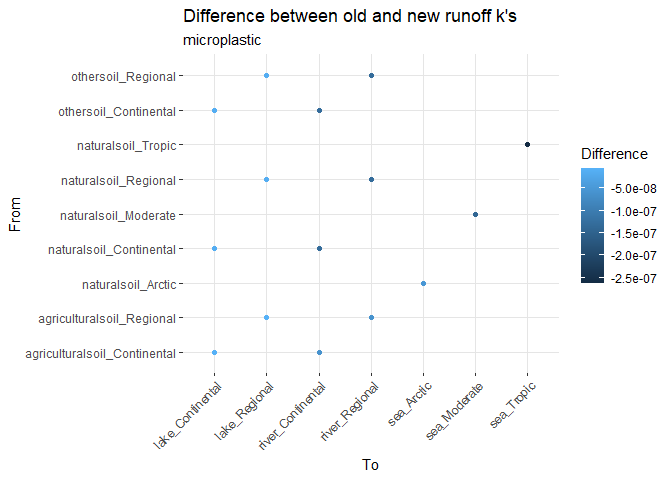
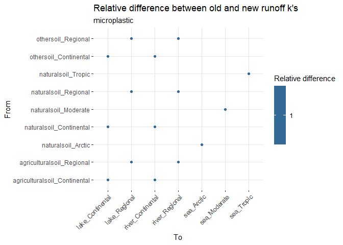
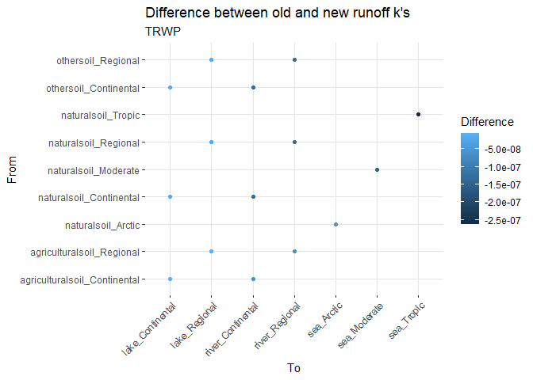
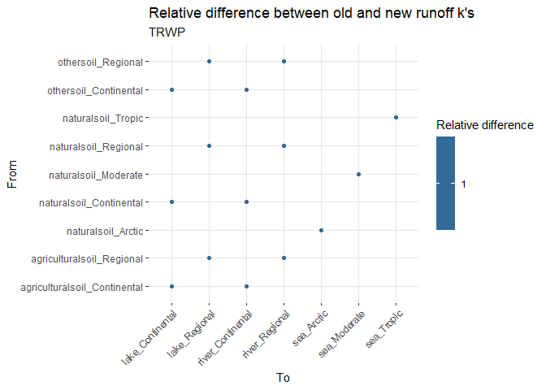

Comparison runoff update
================
Anne Hids, Nadim Saadi, Joris Quik
2025-05-27

# Explanation of update

In the previous itteration Runoff was only reduced for the largest
species of heteroagglomerates (P/attached species). Runoff for the solid
and aggregate species would be calculated using the runoff rate for
microplastics as used in the orignial SimpleBox4Plastics model (Quik
etal. 2024). As microplastics themselves can already be relatively
large, runoff is overestimated for those larger microplastics because
larger particles are likely to be trapped or slowed down by vegetation
present on the soil.

To avoid overestimation of the runoff rate, an interception fractiobn
was added. This fraction represents the fraction of microplastics
intercepted by the vegetation on soil. The default value of interception
fraction for microplastics larger than about 100 micrometers is 0.9715,
which is the average between the interception at high, medium and low
density vegetation as found by Han et al. (2022). The option to use this
interception fraction is now added in SimpleBox based on the previous
implementation by Louvet et al. (in prep).

Old function:

$(Runoff * f_CORRsoil(VertDistance, relevant_depth_s, penetration_depth_s)) / Volume * to.FracROWatComp$

New function:

$(Runoff * f_CORRsoil(VertDistance, relevant_depth_s, penetration_depth_s)) / Volume * to.FracROWatComp * (1-IntrcptFrac)$

Where IntrcptFrac is calculated based on rad_species being larger than
SizeRunoff and being set to VegInterceptFrac. Default VegInterceptFrac =
1, which means no Runoff for those larger particles, but can be adjusted
to 0.9715 using MutateVars, see also general documentation in [7.3
OtherIntermedia.md](/vignettes/7.3-OtherIntermedia.md).

# Change in k values for runoff flows

<!-- TO DO: fetch development at a certain date instead of most recent version. This would ensure consequent outcomes of this comparison, no matter when the script is run. -->

    ## [1] "Directory: SBzips created."

    ## [1] "The SimpleBox model can be found in SimpleBox"

As this update was only implemented for microplastics and tyre road wear
particles, we will test for these substances. To be sure nothing changed
for the other substances, we will also test one other substance.

Do the same for the other implementation.

## Compare the k values for each of the substances

As can be seen in the figures below, the new runoff rates for
microplastics and TRWP are about times lower than in the previous
version. For other substances k_Runoff remains unchanged.

``` r
all_diffs <- kaas_comparison |>
  mutate(fromname = paste0(fromSubCompart, "_", fromScale)) |>
  mutate(toname = paste0(toSubCompart, "_", toScale))

for(i in unique(all_diffs$Substance)){
  diffs_substance <- all_diffs |>
    filter(Substance == i)
  
  absdif_plot <- ggplot(diffs_substance, mapping = aes(x = toname, y = fromname, color = diff)) + 
    geom_point() + 
    labs(
      title = "Difference between old and new runoff k's",
      subtitle = i,
      x = "To",  
      y = "From",  
      color = "Difference"  
    ) +
    theme(
      axis.text.x = element_text(angle = 45, hjust = 1), 
      panel.grid.major = element_line(size = 0.2, color = "gray90"),  
      panel.background = element_blank() 
    )
  
  print(absdif_plot)
  
  reldif_plot <- ggplot(diffs_substance, mapping = aes(x = toname, y = fromname, color = rel_diff)) + 
    geom_point() + 
    labs(
      title = "Relative difference between old and new runoff k's",
      subtitle = i,
      x = "To",  
      y = "From",  
      color = "Relative difference"  
    ) +
    theme(
      axis.text.x = element_text(angle = 45, hjust = 1), 
      panel.grid.major = element_line(size = 0.2, color = "gray90"),
      panel.background = element_blank()  
    )
  print(reldif_plot)
}
```

<!-- --><!-- --><!-- --><!-- --><!-- --><!-- -->

Further analysis

Use of Runoff with 200 micrometer sized microplastics

``` r
rm(list = ls()[sapply(ls(), function(x) is.function(get(x)))])

this_kaas <- data.frame()

for(substanceK in substances$Substance){
  # Get the substance type
  substance <- substanceK
      source("baseScripts/initWorld.R")

  # World$substance
  # World$fetchData("RadS")
  if(World$fetchData("ChemClass") == "particle") {
    attr(World$fetchDataUnits("RadS"),"unit") # unit of input!
    World$SetConst(RadS = 250000)
    World$UpdateDirty("RadS")
    # World$fetchData("SizeRunoff")
    # unique(World$fetchDataUnits("SizeRunoff")$Unit) # unit of input!
    # World$UpdateKaas()
  }
  
  #World$fetchData("IntrcptFrac")
  #World$fetchData("rad_species")
      
  kaas <- World$kaas |>
    # filter(process == "k_Runoff") |>
    mutate(Substance = substance)
  
  this_kaas <- rbind(this_kaas, kaas)
}
```

    ## Joining with `by = join_by(Matrix)`
    ## Joining with `by = join_by(Compartment)`

    ## Warning in private$FetchData(varname): Cannot find property kdis ; but found

    ## Warning in eval(ei, envir): kdis is missing, setting kdis = 0

    ## Warning in eval(ei, envir): ChemClass is needed but missing, setting to neutral

    ## Warning in private$Execute(debugAt): input data ignored; not all VertDistance
    ## in FromAndTo property

    ## Warning in private$Execute(debugAt): input data ignored; not all SubCompartName
    ## in FromAndTo property

    ## Warning in private$Execute(debugAt): input data ignored; not all
    ## to.SubCompartName in FromAndTo property

    ## Warning in private$Execute(debugAt): input data ignored; not all
    ## from.SubCompartName in FromAndTo property

    ## Warning in dplyr::inner_join(AllIn, private$MyCore$states$asDataFrame, join_by(toScale == : Detected an unexpected many-to-many relationship between `x` and `y`.
    ## ℹ Row 1 of `x` matches multiple rows in `y`.
    ## ℹ Row 95 of `y` matches multiple rows in `x`.
    ## ℹ If a many-to-many relationship is expected, set `relationship =
    ##   "many-to-many"` to silence this warning.

    ## Warning in dplyr::inner_join(AllIn, private$MyCore$states$asDataFrame, join_by(toScale == : Detected an unexpected many-to-many relationship between `x` and `y`.
    ## ℹ Row 1 of `x` matches multiple rows in `y`.
    ## ℹ Row 189 of `y` matches multiple rows in `x`.
    ## ℹ If a many-to-many relationship is expected, set `relationship =
    ##   "many-to-many"` to silence this warning.

    ## Warning in private$UpdateDL(CanDo[i]): rad_species ; no rows calculated

    ## Warning in private$UpdateDL(CanDo[i]): rho_species ; no rows calculated

    ## Warning in (function (Kow, pKa, CorgStandard, ChemClass, a, b, all.rhoMatrix, :
    ## pKa is needed but missing, setting pKa=7

    ## Warning in private$Execute(debugAt): input data ignored; not all VertDistance
    ## in FromAndTo property

    ## Warning in private$Execute(debugAt): input data ignored; not all
    ## to.SubCompartName in FromAndTo property

    ## Warning in private$Execute(debugAt): input data ignored; not all Matrix in
    ## FromAndTo property

    ## Warning in private$Execute(debugAt): input data ignored; not all VertDistance
    ## in FromAndTo property

    ## Warning in private$Execute(debugAt): input data ignored; not all to.rhoMatrix
    ## in FromAndTo property

    ## Warning in private$Execute(debugAt): input data ignored; not all to.RadCP in
    ## FromAndTo property

    ## Warning in private$Execute(debugAt): input data ignored; not all to.RhoCP in
    ## FromAndTo property

    ## Warning in private$Execute(debugAt): input data ignored; not all from.RhoCP in
    ## FromAndTo property

    ## Warning in private$Execute(debugAt): input data ignored; not all FRACs in
    ## FromAndTo property

    ## Warning in private$Execute(debugAt): input data ignored; not all
    ## to.SubCompartName in FromAndTo property

    ## Warning in private$Execute(debugAt): input data ignored; not all
    ## from.SubCompartName in FromAndTo property

    ## Warning in private$UpdateDL(CanDo[i]): IntrcptFrac ; no rows calculated

    ## Warning in private$UpdateDL(CanDo[i]): SettlingVelocity ; no rows calculated

    ## Warning in dplyr::inner_join(AllIn, private$MyCore$states$asDataFrame, join_by(toScale == : Detected an unexpected many-to-many relationship between `x` and `y`.
    ## Detected an unexpected many-to-many relationship between `x` and `y`.
    ## ℹ Row 1 of `x` matches multiple rows in `y`.
    ## ℹ Row 1 of `y` matches multiple rows in `x`.
    ## ℹ If a many-to-many relationship is expected, set `relationship =
    ##   "many-to-many"` to silence this warning.

    ## Warning in dplyr::inner_join(AllIn, private$MyCore$states$asDataFrame, join_by(toScale == : Detected an unexpected many-to-many relationship between `x` and `y`.
    ## Detected an unexpected many-to-many relationship between `x` and `y`.
    ## ℹ Row 1 of `x` matches multiple rows in `y`.
    ## ℹ Row 142 of `y` matches multiple rows in `x`.
    ## ℹ If a many-to-many relationship is expected, set `relationship =
    ##   "many-to-many"` to silence this warning.

    ## Warning in private$Execute(debugAt): input data ignored; not all FRinw in
    ## FromAndTo property

    ## Warning in private$Execute(debugAt): input data ignored; not all to.MTC_2w in
    ## FromAndTo property

    ## Warning in private$Execute(debugAt): input data ignored; not all from.MTC_2w in
    ## FromAndTo property

    ## Warning in private$Execute(debugAt): input data ignored; not all to.FRorig in
    ## FromAndTo property

    ## Warning in private$Execute(debugAt): input data ignored; not all to.Matrix in
    ## FromAndTo property

    ## Warning in private$Execute(debugAt): input data ignored; not all VertDistance
    ## in FromAndTo property

    ## Warning in private$Execute(debugAt): input data ignored; not all to.Area in
    ## FromAndTo property

    ## Warning in private$Execute(debugAt): input data ignored; not all
    ## from.SubCompartName in FromAndTo property

    ## Warning in private$Execute(debugAt): input data ignored; not all
    ## to.SubCompartName in FromAndTo property

    ## Warning in private$Execute(debugAt): input data ignored; not all Matrix in
    ## FromAndTo property

    ## Warning in private$Execute(debugAt): input data ignored; not all SubCompartName
    ## in FromAndTo property

    ## Warning in private$Execute(debugAt): input data ignored; not all MTC_2w in
    ## FromAndTo property

    ## Warning in private$Execute(debugAt): input data ignored; not all VertDistance
    ## in FromAndTo property

    ## Warning in private$Execute(debugAt): input data ignored; not all
    ## to.SubCompartName in FromAndTo property

    ## Warning in private$Execute(debugAt): input data ignored; not all VertDistance
    ## in FromAndTo property
    ## Warning in private$Execute(debugAt): input data ignored; not all VertDistance
    ## in FromAndTo property

    ## Warning in private$Execute(debugAt): input data ignored; not all Volume in
    ## FromAndTo property

    ## Warning in private$Execute(debugAt): input data ignored; not all
    ## to.SubCompartName in FromAndTo property

    ## Warning in private$Execute(debugAt): input data ignored; not all Matrix in
    ## FromAndTo property

    ## Warning in private$Execute(debugAt): input data ignored; not all FRinw in
    ## FromAndTo property

    ## Warning in private$Execute(debugAt): input data ignored; not all VertDistance
    ## in FromAndTo property

    ## Warning in private$Execute(debugAt): input data ignored; not all from.RhoCP in
    ## FromAndTo property

    ## Warning in private$Execute(debugAt): input data ignored; not all from.RadCP in
    ## FromAndTo property

    ## Warning in private$Execute(debugAt): input data ignored; not all SubCompartName
    ## in FromAndTo property

    ## Warning in private$Execute(debugAt): input data ignored; not all
    ## to.SubCompartName in FromAndTo property

    ## Warning in private$Execute(debugAt): input data ignored; not all to.MTC_2w in
    ## FromAndTo property

    ## Warning in private$Execute(debugAt): input data ignored; not all from.FRorig in
    ## FromAndTo property

    ## Warning in private$Execute(debugAt): input data ignored; not all FRinw in
    ## FromAndTo property

    ## Warning in private$Execute(debugAt): input data ignored; not all VertDistance
    ## in FromAndTo property

    ## Warning in private$Execute(debugAt): input data ignored; not all Matrix in
    ## FromAndTo property

    ## Warning in private$Execute(debugAt): input data ignored; not all
    ## from.SubCompartName in FromAndTo property

    ## Warning in private$Execute(debugAt): input data ignored; not all
    ## to.SubCompartName in FromAndTo property

    ## Warning in dplyr::inner_join(AllIn, private$MyCore$states$asDataFrame, join_by(fromScale == : Detected an unexpected many-to-many relationship between `x` and `y`.
    ## ℹ Row 1 of `x` matches multiple rows in `y`.
    ## ℹ Row 48 of `y` matches multiple rows in `x`.
    ## ℹ If a many-to-many relationship is expected, set `relationship =
    ##   "many-to-many"` to silence this warning.

    ## Warning in dplyr::inner_join(AllIn, private$MyCore$states$asDataFrame, join_by(toScale == : Detected an unexpected many-to-many relationship between `x` and `y`.
    ## ℹ Row 1 of `x` matches multiple rows in `y`.
    ## ℹ Row 142 of `y` matches multiple rows in `x`.
    ## ℹ If a many-to-many relationship is expected, set `relationship =
    ##   "many-to-many"` to silence this warning.

    ## Warning in dplyr::inner_join(AllIn, private$MyCore$states$asDataFrame, join_by(toScale == : Detected an unexpected many-to-many relationship between `x` and `y`.
    ## Detected an unexpected many-to-many relationship between `x` and `y`.
    ## ℹ Row 1 of `x` matches multiple rows in `y`.
    ## ℹ Row 1 of `y` matches multiple rows in `x`.
    ## ℹ If a many-to-many relationship is expected, set `relationship =
    ##   "many-to-many"` to silence this warning.

    ## Warning in dplyr::inner_join(AllIn, private$MyCore$states$asDataFrame, join_by(toScale == : Detected an unexpected many-to-many relationship between `x` and `y`.
    ## Detected an unexpected many-to-many relationship between `x` and `y`.
    ## ℹ Row 1 of `x` matches multiple rows in `y`.
    ## ℹ Row 48 of `y` matches multiple rows in `x`.
    ## ℹ If a many-to-many relationship is expected, set `relationship =
    ##   "many-to-many"` to silence this warning.

    ## Warning in dplyr::inner_join(AllIn, private$MyCore$states$asDataFrame, join_by(toScale == : Detected an unexpected many-to-many relationship between `x` and `y`.
    ## ℹ Row 1 of `x` matches multiple rows in `y`.
    ## ℹ Row 142 of `y` matches multiple rows in `x`.
    ## ℹ If a many-to-many relationship is expected, set `relationship =
    ##   "many-to-many"` to silence this warning.

    ## Warning in private$Execute(debugAt): input data ignored; not all Volume in
    ## FromAndTo property

    ## Warning in private$Execute(debugAt): input data ignored; not all VertDistance
    ## in FromAndTo property

    ## Warning in private$Execute(debugAt): input data ignored; not all FRorig in
    ## FromAndTo property

    ## Warning in private$Execute(debugAt): input data ignored; not all to.Area in
    ## FromAndTo property

    ## Warning in private$Execute(debugAt): input data ignored; not all from.Area in
    ## FromAndTo property

    ## Joining with `by = join_by(Matrix)`
    ## Joining with `by = join_by(Compartment)`

    ## Warning in private$Execute(debugAt): input data ignored; not all VertDistance
    ## in FromAndTo property

    ## Warning in private$Execute(debugAt): input data ignored; not all SubCompartName
    ## in FromAndTo property

    ## Warning in private$Execute(debugAt): input data ignored; not all
    ## to.SubCompartName in FromAndTo property

    ## Warning in private$Execute(debugAt): input data ignored; not all
    ## from.SubCompartName in FromAndTo property

    ## Warning in private$Execute(debugAt): input data ignored; not all SubCompartName
    ## in FromAndTo property

    ## Warning in dplyr::inner_join(AllIn, private$MyCore$states$asDataFrame, join_by(toScale == : Detected an unexpected many-to-many relationship between `x` and `y`.
    ## ℹ Row 1 of `x` matches multiple rows in `y`.
    ## ℹ Row 95 of `y` matches multiple rows in `x`.
    ## ℹ If a many-to-many relationship is expected, set `relationship =
    ##   "many-to-many"` to silence this warning.

    ## Warning in dplyr::inner_join(AllIn, private$MyCore$states$asDataFrame, join_by(toScale == : Detected an unexpected many-to-many relationship between `x` and `y`.
    ## ℹ Row 1 of `x` matches multiple rows in `y`.
    ## ℹ Row 189 of `y` matches multiple rows in `x`.
    ## ℹ If a many-to-many relationship is expected, set `relationship =
    ##   "many-to-many"` to silence this warning.

    ## Warning in private$UpdateDL(CanDo[i]): Kaers ; no rows calculated

    ## Warning in private$UpdateDL(CanDo[i]): Kacompw ; no rows calculated

    ## Warning in (function (Kow, pKa, CorgStandard, ChemClass, a, b, all.rhoMatrix, :
    ## pKa is needed but missing, setting pKa=7

    ## Warning in private$UpdateDL(CanDo[i]): KswDorC ; no rows calculated

    ## Warning in private$Execute(debugAt): input data ignored; not all VertDistance
    ## in FromAndTo property

    ## Warning in private$Execute(debugAt): input data ignored; not all
    ## to.SubCompartName in FromAndTo property

    ## Warning in private$Execute(debugAt): input data ignored; not all Matrix in
    ## FromAndTo property

    ## Warning in private$Execute(debugAt): input data ignored; not all rad_species in
    ## FromAndTo property

    ## Warning in private$Execute(debugAt): input data ignored; not all RadCOL in
    ## FromAndTo property

    ## Warning in private$Execute(debugAt): input data ignored; not all RadCP in
    ## FromAndTo property

    ## Warning in private$Execute(debugAt): input data ignored; not all rho_species in
    ## FromAndTo property

    ## Warning in private$Execute(debugAt): input data ignored; not all RhoCOL in
    ## FromAndTo property

    ## Warning in private$Execute(debugAt): input data ignored; not all RhoCP in
    ## FromAndTo property

    ## Warning in private$Execute(debugAt): input data ignored; not all Matrix in
    ## FromAndTo property

    ## Warning in private$Execute(debugAt): input data ignored; not all to.SpeciesName
    ## in FromAndTo property

    ## Warning in private$Execute(debugAt): input data ignored; not all RadCOL in
    ## FromAndTo property

    ## Warning in private$Execute(debugAt): input data ignored; not all RadCP in
    ## FromAndTo property

    ## Warning in private$Execute(debugAt): input data ignored; not all RhoCOL in
    ## FromAndTo property

    ## Warning in private$Execute(debugAt): input data ignored; not all RhoCP in
    ## FromAndTo property

    ## Warning in private$Execute(debugAt): input data ignored; not all rhoMatrix in
    ## FromAndTo property

    ## Warning in private$Execute(debugAt): input data ignored; not all to.FRACs in
    ## FromAndTo property

    ## Warning in private$Execute(debugAt): input data ignored; not all Matrix in
    ## FromAndTo property

    ## Warning in private$Execute(debugAt): input data ignored; not all to.SpeciesName
    ## in FromAndTo property

    ## Warning in private$Execute(debugAt): input data ignored; not all SubCompartName
    ## in FromAndTo property

    ## Warning in private$Execute(debugAt): input data ignored; not all VertDistance
    ## in FromAndTo property

    ## Warning in private$Execute(debugAt): input data ignored; not all to.rhoMatrix
    ## in FromAndTo property

    ## Warning in private$Execute(debugAt): input data ignored; not all to.RadCP in
    ## FromAndTo property

    ## Warning in private$Execute(debugAt): input data ignored; not all to.RhoCP in
    ## FromAndTo property

    ## Warning in private$Execute(debugAt): input data ignored; not all from.RhoCP in
    ## FromAndTo property

    ## Warning in private$Execute(debugAt): input data ignored; not all FRACs in
    ## FromAndTo property

    ## Warning in private$Execute(debugAt): input data ignored; not all
    ## to.SubCompartName in FromAndTo property

    ## Warning in private$Execute(debugAt): input data ignored; not all
    ## from.SubCompartName in FromAndTo property

    ## Warning in private$UpdateDL(CanDo[i]): Kaerw ; no rows calculated

    ## Warning in private$UpdateDL(CanDo[i]): Ksw.alt ; no rows calculated

    ## Warning in FUN(X[[i]], ...): Kow is NA, default of 18 used!
    ## Warning in FUN(X[[i]], ...): Kow is NA, default of 18 used!
    ## Warning in FUN(X[[i]], ...): Kow is NA, default of 18 used!
    ## Warning in FUN(X[[i]], ...): Kow is NA, default of 18 used!
    ## Warning in FUN(X[[i]], ...): Kow is NA, default of 18 used!
    ## Warning in FUN(X[[i]], ...): Kow is NA, default of 18 used!
    ## Warning in FUN(X[[i]], ...): Kow is NA, default of 18 used!
    ## Warning in FUN(X[[i]], ...): Kow is NA, default of 18 used!
    ## Warning in FUN(X[[i]], ...): Kow is NA, default of 18 used!
    ## Warning in FUN(X[[i]], ...): Kow is NA, default of 18 used!
    ## Warning in FUN(X[[i]], ...): Kow is NA, default of 18 used!
    ## Warning in FUN(X[[i]], ...): Kow is NA, default of 18 used!

    ## Warning in private$Execute(debugAt): input data ignored; not all rad_species in
    ## FromAndTo property

    ## Warning in private$Execute(debugAt): input data ignored; not all rho_species in
    ## FromAndTo property

    ## Warning in private$Execute(debugAt): input data ignored; not all to.rhoMatrix
    ## in FromAndTo property

    ## Warning in private$Execute(debugAt): input data ignored; not all from.rhoMatrix
    ## in FromAndTo property

    ## Warning in private$Execute(debugAt): input data ignored; not all
    ## SettlingVelocity in FromAndTo property

    ## Warning in private$Execute(debugAt): input data ignored; not all Matrix in
    ## FromAndTo property

    ## Warning in private$Execute(debugAt): input data ignored; not all SpeciesName in
    ## FromAndTo property

    ## Warning in private$Execute(debugAt): input data ignored; not all VertDistance
    ## in FromAndTo property

    ## Warning in private$Execute(debugAt): input data ignored; not all SubCompartName
    ## in FromAndTo property

    ## Warning in private$UpdateDL(CanDo[i]): FRingas ; no rows calculated

    ## Warning in private$UpdateDL(CanDo[i]): Kp ; no rows calculated

    ## Warning in private$Execute(debugAt): input data ignored; not all to.Area in
    ## FromAndTo property

    ## Warning in private$Execute(debugAt): input data ignored; not all from.Volume in
    ## FromAndTo property

    ## Warning in private$Execute(debugAt): input data ignored; not all rhoMatrix in
    ## FromAndTo property

    ## Warning in private$Execute(debugAt): input data ignored; not all rad_species in
    ## FromAndTo property

    ## Warning in private$Execute(debugAt): input data ignored; not all rho_species in
    ## FromAndTo property

    ## Warning in private$Execute(debugAt): input data ignored; not all
    ## SettlingVelocity in FromAndTo property

    ## Warning in private$Execute(debugAt): input data ignored; not all SubCompartName
    ## in FromAndTo property

    ## Warning in private$Execute(debugAt): input data ignored; not all to.Matrix in
    ## FromAndTo property

    ## Warning in private$Execute(debugAt): input data ignored; not all from.Matrix in
    ## FromAndTo property

    ## Warning in private$Execute(debugAt): input data ignored; not all from.rhoMatrix
    ## in FromAndTo property

    ## Warning in private$Execute(debugAt): input data ignored; not all
    ## to.SubCompartName in FromAndTo property

    ## Warning in private$Execute(debugAt): input data ignored; not all to.Area in
    ## FromAndTo property

    ## Warning in private$Execute(debugAt): input data ignored; not all from.Volume in
    ## FromAndTo property

    ## Warning in dplyr::inner_join(AllIn, private$MyCore$states$asDataFrame, join_by(toScale == : Detected an unexpected many-to-many relationship between `x` and `y`.
    ## Detected an unexpected many-to-many relationship between `x` and `y`.
    ## ℹ Row 1 of `x` matches multiple rows in `y`.
    ## ℹ Row 1 of `y` matches multiple rows in `x`.
    ## ℹ If a many-to-many relationship is expected, set `relationship =
    ##   "many-to-many"` to silence this warning.

    ## Warning in dplyr::inner_join(AllIn, private$MyCore$states$asDataFrame, join_by(toScale == : Detected an unexpected many-to-many relationship between `x` and `y`.
    ## Detected an unexpected many-to-many relationship between `x` and `y`.
    ## ℹ Row 1 of `x` matches multiple rows in `y`.
    ## ℹ Row 142 of `y` matches multiple rows in `x`.
    ## ℹ If a many-to-many relationship is expected, set `relationship =
    ##   "many-to-many"` to silence this warning.

    ## Warning in private$UpdateDL(CanDo[i]): FRinw ; no rows calculated

    ## Warning in private$UpdateDL(CanDo[i]): Kscompw ; no rows calculated

    ## Warning in private$Execute(debugAt): input data ignored; not all Tempfactor in
    ## FromAndTo property

    ## Warning in private$Execute(debugAt): input data ignored; not all Matrix in
    ## FromAndTo property

    ## Warning in private$Execute(debugAt): input data ignored; not all SubCompartName
    ## in FromAndTo property

    ## Warning in private$Execute(debugAt): input data ignored; not all VertDistance
    ## in FromAndTo property

    ## Warning in private$Execute(debugAt): input data ignored; not all SpeciesName in
    ## FromAndTo property

    ## Warning in private$Execute(debugAt): input data ignored; not all VertDistance
    ## in FromAndTo property

    ## Warning in private$Execute(debugAt): input data ignored; not all Volume in
    ## FromAndTo property

    ## Warning in private$Execute(debugAt): input data ignored; not all
    ## to.SubCompartName in FromAndTo property

    ## Warning in private$Execute(debugAt): input data ignored; not all Matrix in
    ## FromAndTo property

    ## Warning in private$Execute(debugAt): input data ignored; not all
    ## SettlingVelocity in FromAndTo property

    ## Warning in private$Execute(debugAt): input data ignored; not all VertDistance
    ## in FromAndTo property

    ## Warning in private$Execute(debugAt): input data ignored; not all from.RhoCP in
    ## FromAndTo property

    ## Warning in private$Execute(debugAt): input data ignored; not all from.RadCP in
    ## FromAndTo property

    ## Warning in private$Execute(debugAt): input data ignored; not all SubCompartName
    ## in FromAndTo property

    ## Warning in private$Execute(debugAt): input data ignored; not all
    ## to.SubCompartName in FromAndTo property

    ## Warning in dplyr::inner_join(AllIn, private$MyCore$states$asDataFrame, join_by(fromScale == : Detected an unexpected many-to-many relationship between `x` and `y`.
    ## ℹ Row 1 of `x` matches multiple rows in `y`.
    ## ℹ Row 48 of `y` matches multiple rows in `x`.
    ## ℹ If a many-to-many relationship is expected, set `relationship =
    ##   "many-to-many"` to silence this warning.

    ## Warning in dplyr::inner_join(AllIn, private$MyCore$states$asDataFrame, join_by(toScale == : Detected an unexpected many-to-many relationship between `x` and `y`.
    ## ℹ Row 1 of `x` matches multiple rows in `y`.
    ## ℹ Row 142 of `y` matches multiple rows in `x`.
    ## ℹ If a many-to-many relationship is expected, set `relationship =
    ##   "many-to-many"` to silence this warning.

    ## Warning in dplyr::inner_join(AllIn, private$MyCore$states$asDataFrame, join_by(toScale == : Detected an unexpected many-to-many relationship between `x` and `y`.
    ## Detected an unexpected many-to-many relationship between `x` and `y`.
    ## ℹ Row 1 of `x` matches multiple rows in `y`.
    ## ℹ Row 1 of `y` matches multiple rows in `x`.
    ## ℹ If a many-to-many relationship is expected, set `relationship =
    ##   "many-to-many"` to silence this warning.

    ## Warning in dplyr::inner_join(AllIn, private$MyCore$states$asDataFrame, join_by(toScale == : Detected an unexpected many-to-many relationship between `x` and `y`.
    ## Detected an unexpected many-to-many relationship between `x` and `y`.
    ## ℹ Row 1 of `x` matches multiple rows in `y`.
    ## ℹ Row 48 of `y` matches multiple rows in `x`.
    ## ℹ If a many-to-many relationship is expected, set `relationship =
    ##   "many-to-many"` to silence this warning.

    ## Warning in dplyr::inner_join(AllIn, private$MyCore$states$asDataFrame, join_by(toScale == : Detected an unexpected many-to-many relationship between `x` and `y`.
    ## ℹ Row 1 of `x` matches multiple rows in `y`.
    ## ℹ Row 142 of `y` matches multiple rows in `x`.
    ## ℹ If a many-to-many relationship is expected, set `relationship =
    ##   "many-to-many"` to silence this warning.

    ## Warning in private$Execute(debugAt): input data ignored; not all Volume in
    ## FromAndTo property

    ## Warning in private$Execute(debugAt): input data ignored; not all RadCOL in
    ## FromAndTo property

    ## Warning in private$Execute(debugAt): input data ignored; not all RadCP in
    ## FromAndTo property

    ## Warning in private$Execute(debugAt): input data ignored; not all RhoCOL in
    ## FromAndTo property

    ## Warning in private$Execute(debugAt): input data ignored; not all RhoCP in
    ## FromAndTo property

    ## Warning in private$Execute(debugAt): input data ignored; not all rhoMatrix in
    ## FromAndTo property

    ## Warning in private$Execute(debugAt): input data ignored; not all to.FRACs in
    ## FromAndTo property

    ## Warning in private$Execute(debugAt): input data ignored; not all Matrix in
    ## FromAndTo property

    ## Warning in private$Execute(debugAt): input data ignored; not all to.SpeciesName
    ## in FromAndTo property

    ## Warning in private$Execute(debugAt): input data ignored; not all SubCompartName
    ## in FromAndTo property

    ## Warning in private$Execute(debugAt): input data ignored; not all rad_species in
    ## FromAndTo property

    ## Warning in private$Execute(debugAt): input data ignored; not all RadCOL in
    ## FromAndTo property

    ## Warning in private$Execute(debugAt): input data ignored; not all RadCP in
    ## FromAndTo property

    ## Warning in private$Execute(debugAt): input data ignored; not all rho_species in
    ## FromAndTo property

    ## Warning in private$Execute(debugAt): input data ignored; not all RhoCOL in
    ## FromAndTo property

    ## Warning in private$Execute(debugAt): input data ignored; not all RhoCP in
    ## FromAndTo property

    ## Warning in private$Execute(debugAt): input data ignored; not all Matrix in
    ## FromAndTo property

    ## Warning in private$Execute(debugAt): input data ignored; not all to.SpeciesName
    ## in FromAndTo property

    ## Warning in private$Execute(debugAt): input data ignored; not all rad_species in
    ## FromAndTo property

    ## Warning in private$Execute(debugAt): input data ignored; not all rho_species in
    ## FromAndTo property

    ## Warning in private$Execute(debugAt): input data ignored; not all to.rhoMatrix
    ## in FromAndTo property

    ## Warning in private$Execute(debugAt): input data ignored; not all from.rhoMatrix
    ## in FromAndTo property

    ## Warning in private$Execute(debugAt): input data ignored; not all
    ## SettlingVelocity in FromAndTo property

    ## Warning in private$Execute(debugAt): input data ignored; not all Matrix in
    ## FromAndTo property

    ## Warning in private$Execute(debugAt): input data ignored; not all SpeciesName in
    ## FromAndTo property

    ## Warning in private$Execute(debugAt): input data ignored; not all VertDistance
    ## in FromAndTo property

    ## Warning in private$Execute(debugAt): input data ignored; not all SubCompartName
    ## in FromAndTo property

    ## Warning in private$Execute(debugAt): input data ignored; not all to.Area in
    ## FromAndTo property

    ## Warning in private$Execute(debugAt): input data ignored; not all from.Volume in
    ## FromAndTo property

    ## Warning in private$Execute(debugAt): input data ignored; not all rhoMatrix in
    ## FromAndTo property

    ## Warning in private$Execute(debugAt): input data ignored; not all rad_species in
    ## FromAndTo property

    ## Warning in private$Execute(debugAt): input data ignored; not all rho_species in
    ## FromAndTo property

    ## Warning in private$Execute(debugAt): input data ignored; not all
    ## SettlingVelocity in FromAndTo property

    ## Warning in private$Execute(debugAt): input data ignored; not all SubCompartName
    ## in FromAndTo property

    ## Warning in private$Execute(debugAt): input data ignored; not all to.Matrix in
    ## FromAndTo property

    ## Warning in private$Execute(debugAt): input data ignored; not all from.Matrix in
    ## FromAndTo property

    ## Warning in private$Execute(debugAt): input data ignored; not all from.rhoMatrix
    ## in FromAndTo property

    ## Warning in private$Execute(debugAt): input data ignored; not all
    ## to.SubCompartName in FromAndTo property

    ## Warning in private$Execute(debugAt): input data ignored; not all VertDistance
    ## in FromAndTo property

    ## Warning in private$Execute(debugAt): input data ignored; not all Volume in
    ## FromAndTo property

    ## Warning in private$Execute(debugAt): input data ignored; not all
    ## to.SubCompartName in FromAndTo property

    ## Warning in private$Execute(debugAt): input data ignored; not all Matrix in
    ## FromAndTo property

    ## Warning in private$Execute(debugAt): input data ignored; not all
    ## SettlingVelocity in FromAndTo property

    ## Warning in private$Execute(debugAt): input data ignored; not all VertDistance
    ## in FromAndTo property

    ## Warning in private$Execute(debugAt): input data ignored; not all from.RhoCP in
    ## FromAndTo property

    ## Warning in private$Execute(debugAt): input data ignored; not all from.RadCP in
    ## FromAndTo property

    ## Warning in private$Execute(debugAt): input data ignored; not all SubCompartName
    ## in FromAndTo property

    ## Warning in private$Execute(debugAt): input data ignored; not all
    ## to.SubCompartName in FromAndTo property

    ## Joining with `by = join_by(Matrix)`
    ## Joining with `by = join_by(Compartment)`

    ## Warning in private$Execute(debugAt): input data ignored; not all VertDistance
    ## in FromAndTo property

    ## Warning in private$Execute(debugAt): input data ignored; not all SubCompartName
    ## in FromAndTo property

    ## Warning in private$Execute(debugAt): input data ignored; not all
    ## to.SubCompartName in FromAndTo property

    ## Warning in private$Execute(debugAt): input data ignored; not all
    ## from.SubCompartName in FromAndTo property

    ## Warning in private$Execute(debugAt): input data ignored; not all SubCompartName
    ## in FromAndTo property

    ## Warning in dplyr::inner_join(AllIn, private$MyCore$states$asDataFrame, join_by(toScale == : Detected an unexpected many-to-many relationship between `x` and `y`.
    ## ℹ Row 1 of `x` matches multiple rows in `y`.
    ## ℹ Row 95 of `y` matches multiple rows in `x`.
    ## ℹ If a many-to-many relationship is expected, set `relationship =
    ##   "many-to-many"` to silence this warning.

    ## Warning in dplyr::inner_join(AllIn, private$MyCore$states$asDataFrame, join_by(toScale == : Detected an unexpected many-to-many relationship between `x` and `y`.
    ## ℹ Row 1 of `x` matches multiple rows in `y`.
    ## ℹ Row 189 of `y` matches multiple rows in `x`.
    ## ℹ If a many-to-many relationship is expected, set `relationship =
    ##   "many-to-many"` to silence this warning.

    ## Warning in private$UpdateDL(CanDo[i]): Kaers ; no rows calculated

    ## Warning in private$UpdateDL(CanDo[i]): Kacompw ; no rows calculated

    ## Warning in (function (Kow, pKa, CorgStandard, ChemClass, a, b, all.rhoMatrix, :
    ## pKa is needed but missing, setting pKa=7

    ## Warning in private$UpdateDL(CanDo[i]): KswDorC ; no rows calculated

    ## Warning in private$Execute(debugAt): input data ignored; not all VertDistance
    ## in FromAndTo property

    ## Warning in private$Execute(debugAt): input data ignored; not all
    ## to.SubCompartName in FromAndTo property

    ## Warning in private$Execute(debugAt): input data ignored; not all Matrix in
    ## FromAndTo property

    ## Warning in private$Execute(debugAt): input data ignored; not all rad_species in
    ## FromAndTo property

    ## Warning in private$Execute(debugAt): input data ignored; not all RadCOL in
    ## FromAndTo property

    ## Warning in private$Execute(debugAt): input data ignored; not all RadCP in
    ## FromAndTo property

    ## Warning in private$Execute(debugAt): input data ignored; not all rho_species in
    ## FromAndTo property

    ## Warning in private$Execute(debugAt): input data ignored; not all RhoCOL in
    ## FromAndTo property

    ## Warning in private$Execute(debugAt): input data ignored; not all RhoCP in
    ## FromAndTo property

    ## Warning in private$Execute(debugAt): input data ignored; not all Matrix in
    ## FromAndTo property

    ## Warning in private$Execute(debugAt): input data ignored; not all to.SpeciesName
    ## in FromAndTo property

    ## Warning in private$Execute(debugAt): input data ignored; not all RadCOL in
    ## FromAndTo property

    ## Warning in private$Execute(debugAt): input data ignored; not all RadCP in
    ## FromAndTo property

    ## Warning in private$Execute(debugAt): input data ignored; not all RhoCOL in
    ## FromAndTo property

    ## Warning in private$Execute(debugAt): input data ignored; not all RhoCP in
    ## FromAndTo property

    ## Warning in private$Execute(debugAt): input data ignored; not all rhoMatrix in
    ## FromAndTo property

    ## Warning in private$Execute(debugAt): input data ignored; not all to.FRACs in
    ## FromAndTo property

    ## Warning in private$Execute(debugAt): input data ignored; not all Matrix in
    ## FromAndTo property

    ## Warning in private$Execute(debugAt): input data ignored; not all to.SpeciesName
    ## in FromAndTo property

    ## Warning in private$Execute(debugAt): input data ignored; not all SubCompartName
    ## in FromAndTo property

    ## Warning in private$Execute(debugAt): input data ignored; not all VertDistance
    ## in FromAndTo property

    ## Warning in private$Execute(debugAt): input data ignored; not all to.rhoMatrix
    ## in FromAndTo property

    ## Warning in private$Execute(debugAt): input data ignored; not all to.RadCP in
    ## FromAndTo property

    ## Warning in private$Execute(debugAt): input data ignored; not all to.RhoCP in
    ## FromAndTo property

    ## Warning in private$Execute(debugAt): input data ignored; not all from.RhoCP in
    ## FromAndTo property

    ## Warning in private$Execute(debugAt): input data ignored; not all FRACs in
    ## FromAndTo property

    ## Warning in private$Execute(debugAt): input data ignored; not all
    ## to.SubCompartName in FromAndTo property

    ## Warning in private$Execute(debugAt): input data ignored; not all
    ## from.SubCompartName in FromAndTo property

    ## Warning in private$UpdateDL(CanDo[i]): Kaerw ; no rows calculated

    ## Warning in private$UpdateDL(CanDo[i]): Ksw.alt ; no rows calculated

    ## Warning in FUN(X[[i]], ...): Kow is NA, default of 18 used!
    ## Warning in FUN(X[[i]], ...): Kow is NA, default of 18 used!
    ## Warning in FUN(X[[i]], ...): Kow is NA, default of 18 used!
    ## Warning in FUN(X[[i]], ...): Kow is NA, default of 18 used!
    ## Warning in FUN(X[[i]], ...): Kow is NA, default of 18 used!
    ## Warning in FUN(X[[i]], ...): Kow is NA, default of 18 used!
    ## Warning in FUN(X[[i]], ...): Kow is NA, default of 18 used!
    ## Warning in FUN(X[[i]], ...): Kow is NA, default of 18 used!
    ## Warning in FUN(X[[i]], ...): Kow is NA, default of 18 used!
    ## Warning in FUN(X[[i]], ...): Kow is NA, default of 18 used!
    ## Warning in FUN(X[[i]], ...): Kow is NA, default of 18 used!
    ## Warning in FUN(X[[i]], ...): Kow is NA, default of 18 used!

    ## Warning in private$Execute(debugAt): input data ignored; not all rad_species in
    ## FromAndTo property

    ## Warning in private$Execute(debugAt): input data ignored; not all rho_species in
    ## FromAndTo property

    ## Warning in private$Execute(debugAt): input data ignored; not all to.rhoMatrix
    ## in FromAndTo property

    ## Warning in private$Execute(debugAt): input data ignored; not all from.rhoMatrix
    ## in FromAndTo property

    ## Warning in private$Execute(debugAt): input data ignored; not all
    ## SettlingVelocity in FromAndTo property

    ## Warning in private$Execute(debugAt): input data ignored; not all Matrix in
    ## FromAndTo property

    ## Warning in private$Execute(debugAt): input data ignored; not all SpeciesName in
    ## FromAndTo property

    ## Warning in private$Execute(debugAt): input data ignored; not all VertDistance
    ## in FromAndTo property

    ## Warning in private$Execute(debugAt): input data ignored; not all SubCompartName
    ## in FromAndTo property

    ## Warning in private$UpdateDL(CanDo[i]): FRingas ; no rows calculated

    ## Warning in private$UpdateDL(CanDo[i]): Kp ; no rows calculated

    ## Warning in private$Execute(debugAt): input data ignored; not all to.Area in
    ## FromAndTo property

    ## Warning in private$Execute(debugAt): input data ignored; not all from.Volume in
    ## FromAndTo property

    ## Warning in private$Execute(debugAt): input data ignored; not all rhoMatrix in
    ## FromAndTo property

    ## Warning in private$Execute(debugAt): input data ignored; not all rad_species in
    ## FromAndTo property

    ## Warning in private$Execute(debugAt): input data ignored; not all rho_species in
    ## FromAndTo property

    ## Warning in private$Execute(debugAt): input data ignored; not all
    ## SettlingVelocity in FromAndTo property

    ## Warning in private$Execute(debugAt): input data ignored; not all SubCompartName
    ## in FromAndTo property

    ## Warning in private$Execute(debugAt): input data ignored; not all to.Matrix in
    ## FromAndTo property

    ## Warning in private$Execute(debugAt): input data ignored; not all from.Matrix in
    ## FromAndTo property

    ## Warning in private$Execute(debugAt): input data ignored; not all from.rhoMatrix
    ## in FromAndTo property

    ## Warning in private$Execute(debugAt): input data ignored; not all
    ## to.SubCompartName in FromAndTo property

    ## Warning in private$Execute(debugAt): input data ignored; not all to.Area in
    ## FromAndTo property

    ## Warning in private$Execute(debugAt): input data ignored; not all from.Volume in
    ## FromAndTo property

    ## Warning in dplyr::inner_join(AllIn, private$MyCore$states$asDataFrame, join_by(toScale == : Detected an unexpected many-to-many relationship between `x` and `y`.
    ## Detected an unexpected many-to-many relationship between `x` and `y`.
    ## ℹ Row 1 of `x` matches multiple rows in `y`.
    ## ℹ Row 1 of `y` matches multiple rows in `x`.
    ## ℹ If a many-to-many relationship is expected, set `relationship =
    ##   "many-to-many"` to silence this warning.

    ## Warning in dplyr::inner_join(AllIn, private$MyCore$states$asDataFrame, join_by(toScale == : Detected an unexpected many-to-many relationship between `x` and `y`.
    ## Detected an unexpected many-to-many relationship between `x` and `y`.
    ## ℹ Row 1 of `x` matches multiple rows in `y`.
    ## ℹ Row 142 of `y` matches multiple rows in `x`.
    ## ℹ If a many-to-many relationship is expected, set `relationship =
    ##   "many-to-many"` to silence this warning.

    ## Warning in private$UpdateDL(CanDo[i]): FRinw ; no rows calculated

    ## Warning in private$UpdateDL(CanDo[i]): Kscompw ; no rows calculated

    ## Warning in private$Execute(debugAt): input data ignored; not all Tempfactor in
    ## FromAndTo property

    ## Warning in private$Execute(debugAt): input data ignored; not all Matrix in
    ## FromAndTo property

    ## Warning in private$Execute(debugAt): input data ignored; not all SubCompartName
    ## in FromAndTo property

    ## Warning in private$Execute(debugAt): input data ignored; not all VertDistance
    ## in FromAndTo property

    ## Warning in private$Execute(debugAt): input data ignored; not all SpeciesName in
    ## FromAndTo property

    ## Warning in private$Execute(debugAt): input data ignored; not all VertDistance
    ## in FromAndTo property

    ## Warning in private$Execute(debugAt): input data ignored; not all Volume in
    ## FromAndTo property

    ## Warning in private$Execute(debugAt): input data ignored; not all
    ## to.SubCompartName in FromAndTo property

    ## Warning in private$Execute(debugAt): input data ignored; not all Matrix in
    ## FromAndTo property

    ## Warning in private$Execute(debugAt): input data ignored; not all
    ## SettlingVelocity in FromAndTo property

    ## Warning in private$Execute(debugAt): input data ignored; not all VertDistance
    ## in FromAndTo property

    ## Warning in private$Execute(debugAt): input data ignored; not all from.RhoCP in
    ## FromAndTo property

    ## Warning in private$Execute(debugAt): input data ignored; not all from.RadCP in
    ## FromAndTo property

    ## Warning in private$Execute(debugAt): input data ignored; not all SubCompartName
    ## in FromAndTo property

    ## Warning in private$Execute(debugAt): input data ignored; not all
    ## to.SubCompartName in FromAndTo property

    ## Warning in dplyr::inner_join(AllIn, private$MyCore$states$asDataFrame, join_by(fromScale == : Detected an unexpected many-to-many relationship between `x` and `y`.
    ## ℹ Row 1 of `x` matches multiple rows in `y`.
    ## ℹ Row 48 of `y` matches multiple rows in `x`.
    ## ℹ If a many-to-many relationship is expected, set `relationship =
    ##   "many-to-many"` to silence this warning.

    ## Warning in dplyr::inner_join(AllIn, private$MyCore$states$asDataFrame, join_by(toScale == : Detected an unexpected many-to-many relationship between `x` and `y`.
    ## ℹ Row 1 of `x` matches multiple rows in `y`.
    ## ℹ Row 142 of `y` matches multiple rows in `x`.
    ## ℹ If a many-to-many relationship is expected, set `relationship =
    ##   "many-to-many"` to silence this warning.

    ## Warning in dplyr::inner_join(AllIn, private$MyCore$states$asDataFrame, join_by(toScale == : Detected an unexpected many-to-many relationship between `x` and `y`.
    ## Detected an unexpected many-to-many relationship between `x` and `y`.
    ## ℹ Row 1 of `x` matches multiple rows in `y`.
    ## ℹ Row 1 of `y` matches multiple rows in `x`.
    ## ℹ If a many-to-many relationship is expected, set `relationship =
    ##   "many-to-many"` to silence this warning.

    ## Warning in dplyr::inner_join(AllIn, private$MyCore$states$asDataFrame, join_by(toScale == : Detected an unexpected many-to-many relationship between `x` and `y`.
    ## Detected an unexpected many-to-many relationship between `x` and `y`.
    ## ℹ Row 1 of `x` matches multiple rows in `y`.
    ## ℹ Row 48 of `y` matches multiple rows in `x`.
    ## ℹ If a many-to-many relationship is expected, set `relationship =
    ##   "many-to-many"` to silence this warning.

    ## Warning in dplyr::inner_join(AllIn, private$MyCore$states$asDataFrame, join_by(toScale == : Detected an unexpected many-to-many relationship between `x` and `y`.
    ## ℹ Row 1 of `x` matches multiple rows in `y`.
    ## ℹ Row 142 of `y` matches multiple rows in `x`.
    ## ℹ If a many-to-many relationship is expected, set `relationship =
    ##   "many-to-many"` to silence this warning.

    ## Warning in private$Execute(debugAt): input data ignored; not all Volume in
    ## FromAndTo property

    ## Warning in private$Execute(debugAt): input data ignored; not all RadCOL in
    ## FromAndTo property

    ## Warning in private$Execute(debugAt): input data ignored; not all RadCP in
    ## FromAndTo property

    ## Warning in private$Execute(debugAt): input data ignored; not all RhoCOL in
    ## FromAndTo property

    ## Warning in private$Execute(debugAt): input data ignored; not all RhoCP in
    ## FromAndTo property

    ## Warning in private$Execute(debugAt): input data ignored; not all rhoMatrix in
    ## FromAndTo property

    ## Warning in private$Execute(debugAt): input data ignored; not all to.FRACs in
    ## FromAndTo property

    ## Warning in private$Execute(debugAt): input data ignored; not all Matrix in
    ## FromAndTo property

    ## Warning in private$Execute(debugAt): input data ignored; not all to.SpeciesName
    ## in FromAndTo property

    ## Warning in private$Execute(debugAt): input data ignored; not all SubCompartName
    ## in FromAndTo property

    ## Warning in private$Execute(debugAt): input data ignored; not all rad_species in
    ## FromAndTo property

    ## Warning in private$Execute(debugAt): input data ignored; not all RadCOL in
    ## FromAndTo property

    ## Warning in private$Execute(debugAt): input data ignored; not all RadCP in
    ## FromAndTo property

    ## Warning in private$Execute(debugAt): input data ignored; not all rho_species in
    ## FromAndTo property

    ## Warning in private$Execute(debugAt): input data ignored; not all RhoCOL in
    ## FromAndTo property

    ## Warning in private$Execute(debugAt): input data ignored; not all RhoCP in
    ## FromAndTo property

    ## Warning in private$Execute(debugAt): input data ignored; not all Matrix in
    ## FromAndTo property

    ## Warning in private$Execute(debugAt): input data ignored; not all to.SpeciesName
    ## in FromAndTo property

    ## Warning in private$Execute(debugAt): input data ignored; not all rad_species in
    ## FromAndTo property

    ## Warning in private$Execute(debugAt): input data ignored; not all rho_species in
    ## FromAndTo property

    ## Warning in private$Execute(debugAt): input data ignored; not all to.rhoMatrix
    ## in FromAndTo property

    ## Warning in private$Execute(debugAt): input data ignored; not all from.rhoMatrix
    ## in FromAndTo property

    ## Warning in private$Execute(debugAt): input data ignored; not all
    ## SettlingVelocity in FromAndTo property

    ## Warning in private$Execute(debugAt): input data ignored; not all Matrix in
    ## FromAndTo property

    ## Warning in private$Execute(debugAt): input data ignored; not all SpeciesName in
    ## FromAndTo property

    ## Warning in private$Execute(debugAt): input data ignored; not all VertDistance
    ## in FromAndTo property

    ## Warning in private$Execute(debugAt): input data ignored; not all SubCompartName
    ## in FromAndTo property

    ## Warning in private$Execute(debugAt): input data ignored; not all to.Area in
    ## FromAndTo property

    ## Warning in private$Execute(debugAt): input data ignored; not all from.Volume in
    ## FromAndTo property

    ## Warning in private$Execute(debugAt): input data ignored; not all rhoMatrix in
    ## FromAndTo property

    ## Warning in private$Execute(debugAt): input data ignored; not all rad_species in
    ## FromAndTo property

    ## Warning in private$Execute(debugAt): input data ignored; not all rho_species in
    ## FromAndTo property

    ## Warning in private$Execute(debugAt): input data ignored; not all
    ## SettlingVelocity in FromAndTo property

    ## Warning in private$Execute(debugAt): input data ignored; not all SubCompartName
    ## in FromAndTo property

    ## Warning in private$Execute(debugAt): input data ignored; not all to.Matrix in
    ## FromAndTo property

    ## Warning in private$Execute(debugAt): input data ignored; not all from.Matrix in
    ## FromAndTo property

    ## Warning in private$Execute(debugAt): input data ignored; not all from.rhoMatrix
    ## in FromAndTo property

    ## Warning in private$Execute(debugAt): input data ignored; not all
    ## to.SubCompartName in FromAndTo property

    ## Warning in private$Execute(debugAt): input data ignored; not all VertDistance
    ## in FromAndTo property

    ## Warning in private$Execute(debugAt): input data ignored; not all Volume in
    ## FromAndTo property

    ## Warning in private$Execute(debugAt): input data ignored; not all
    ## to.SubCompartName in FromAndTo property

    ## Warning in private$Execute(debugAt): input data ignored; not all Matrix in
    ## FromAndTo property

    ## Warning in private$Execute(debugAt): input data ignored; not all
    ## SettlingVelocity in FromAndTo property

    ## Warning in private$Execute(debugAt): input data ignored; not all VertDistance
    ## in FromAndTo property

    ## Warning in private$Execute(debugAt): input data ignored; not all from.RhoCP in
    ## FromAndTo property

    ## Warning in private$Execute(debugAt): input data ignored; not all from.RadCP in
    ## FromAndTo property

    ## Warning in private$Execute(debugAt): input data ignored; not all SubCompartName
    ## in FromAndTo property

    ## Warning in private$Execute(debugAt): input data ignored; not all
    ## to.SubCompartName in FromAndTo property

``` r
rm(list = ls()[sapply(ls(), function(x) is.function(get(x)))])

other_kaas <- data.frame()
  
for(substanceK in substances$Substance){
Temp_Folder=NULL
substance = substanceK

source("baseScripts/initWorldOther.R")

  if(World$fetchData("ChemClass") == "particle") {
    attr(World$fetchDataUnits("RadS"),"unit") # unit of input!
    World$SetConst(RadS = 250000)
    # World$fetchData("SizeRunoff")
    # unique(World$fetchDataUnits("SizeRunoff")$Unit) # unit of input!
    World$UpdateDirty("RadS")
  }

  kaas <- World$kaas |>
    # filter(process == "k_Runoff") |>
    mutate(Substance = substance)
  
  other_kaas <- rbind(other_kaas, kaas)
}
```

    ## Joining with `by = join_by(Matrix)`
    ## Joining with `by = join_by(Compartment)`

    ## Warning in private$FetchData(varname): Cannot find property kdis ; but found

    ## Warning in eval(ei, envir): kdis is missing, setting kdis = 0

    ## Warning in eval(ei, envir): ChemClass is needed but missing, setting to neutral

    ## Warning in private$Execute(debugAt): input data ignored; not all VertDistance
    ## in FromAndTo property

    ## Warning in private$Execute(debugAt): input data ignored; not all SubCompartName
    ## in FromAndTo property

    ## Warning in private$Execute(debugAt): input data ignored; not all
    ## to.SubCompartName in FromAndTo property

    ## Warning in private$Execute(debugAt): input data ignored; not all
    ## from.SubCompartName in FromAndTo property

    ## Warning in dplyr::inner_join(AllIn, private$MyCore$states$asDataFrame, join_by(toScale == : Detected an unexpected many-to-many relationship between `x` and `y`.
    ## ℹ Row 1 of `x` matches multiple rows in `y`.
    ## ℹ Row 95 of `y` matches multiple rows in `x`.
    ## ℹ If a many-to-many relationship is expected, set `relationship =
    ##   "many-to-many"` to silence this warning.

    ## Warning in dplyr::inner_join(AllIn, private$MyCore$states$asDataFrame, join_by(toScale == : Detected an unexpected many-to-many relationship between `x` and `y`.
    ## ℹ Row 1 of `x` matches multiple rows in `y`.
    ## ℹ Row 189 of `y` matches multiple rows in `x`.
    ## ℹ If a many-to-many relationship is expected, set `relationship =
    ##   "many-to-many"` to silence this warning.

    ## Warning in private$UpdateDL(CanDo[i]): rad_species ; no rows calculated

    ## Warning in private$UpdateDL(CanDo[i]): rho_species ; no rows calculated

    ## Warning in (function (Kow, pKa, CorgStandard, ChemClass, a, b, all.rhoMatrix, :
    ## pKa is needed but missing, setting pKa=7

    ## Warning in private$Execute(debugAt): input data ignored; not all VertDistance
    ## in FromAndTo property

    ## Warning in private$Execute(debugAt): input data ignored; not all
    ## to.SubCompartName in FromAndTo property

    ## Warning in private$Execute(debugAt): input data ignored; not all Matrix in
    ## FromAndTo property

    ## Warning in private$Execute(debugAt): input data ignored; not all VertDistance
    ## in FromAndTo property

    ## Warning in private$Execute(debugAt): input data ignored; not all to.rhoMatrix
    ## in FromAndTo property

    ## Warning in private$Execute(debugAt): input data ignored; not all to.RadCP in
    ## FromAndTo property

    ## Warning in private$Execute(debugAt): input data ignored; not all to.RhoCP in
    ## FromAndTo property

    ## Warning in private$Execute(debugAt): input data ignored; not all from.RhoCP in
    ## FromAndTo property

    ## Warning in private$Execute(debugAt): input data ignored; not all FRACs in
    ## FromAndTo property

    ## Warning in private$Execute(debugAt): input data ignored; not all
    ## to.SubCompartName in FromAndTo property

    ## Warning in private$Execute(debugAt): input data ignored; not all
    ## from.SubCompartName in FromAndTo property

    ## Warning in private$UpdateDL(CanDo[i]): SettlingVelocity ; no rows calculated

    ## Warning in dplyr::inner_join(AllIn, private$MyCore$states$asDataFrame, join_by(toScale == : Detected an unexpected many-to-many relationship between `x` and `y`.
    ## Detected an unexpected many-to-many relationship between `x` and `y`.
    ## ℹ Row 1 of `x` matches multiple rows in `y`.
    ## ℹ Row 1 of `y` matches multiple rows in `x`.
    ## ℹ If a many-to-many relationship is expected, set `relationship =
    ##   "many-to-many"` to silence this warning.

    ## Warning in dplyr::inner_join(AllIn, private$MyCore$states$asDataFrame, join_by(toScale == : Detected an unexpected many-to-many relationship between `x` and `y`.
    ## Detected an unexpected many-to-many relationship between `x` and `y`.
    ## ℹ Row 1 of `x` matches multiple rows in `y`.
    ## ℹ Row 142 of `y` matches multiple rows in `x`.
    ## ℹ If a many-to-many relationship is expected, set `relationship =
    ##   "many-to-many"` to silence this warning.

    ## Warning in private$Execute(debugAt): input data ignored; not all FRinw in
    ## FromAndTo property

    ## Warning in private$Execute(debugAt): input data ignored; not all to.MTC_2w in
    ## FromAndTo property

    ## Warning in private$Execute(debugAt): input data ignored; not all from.MTC_2w in
    ## FromAndTo property

    ## Warning in private$Execute(debugAt): input data ignored; not all to.FRorig in
    ## FromAndTo property

    ## Warning in private$Execute(debugAt): input data ignored; not all to.Matrix in
    ## FromAndTo property

    ## Warning in private$Execute(debugAt): input data ignored; not all VertDistance
    ## in FromAndTo property

    ## Warning in private$Execute(debugAt): input data ignored; not all to.Area in
    ## FromAndTo property

    ## Warning in private$Execute(debugAt): input data ignored; not all
    ## from.SubCompartName in FromAndTo property

    ## Warning in private$Execute(debugAt): input data ignored; not all
    ## to.SubCompartName in FromAndTo property

    ## Warning in private$Execute(debugAt): input data ignored; not all Matrix in
    ## FromAndTo property

    ## Warning in private$Execute(debugAt): input data ignored; not all SubCompartName
    ## in FromAndTo property

    ## Warning in private$Execute(debugAt): input data ignored; not all MTC_2w in
    ## FromAndTo property

    ## Warning in private$Execute(debugAt): input data ignored; not all VertDistance
    ## in FromAndTo property

    ## Warning in private$Execute(debugAt): input data ignored; not all
    ## to.SubCompartName in FromAndTo property

    ## Warning in private$Execute(debugAt): input data ignored; not all VertDistance
    ## in FromAndTo property
    ## Warning in private$Execute(debugAt): input data ignored; not all VertDistance
    ## in FromAndTo property

    ## Warning in private$Execute(debugAt): input data ignored; not all Volume in
    ## FromAndTo property

    ## Warning in private$Execute(debugAt): input data ignored; not all
    ## to.SubCompartName in FromAndTo property

    ## Warning in private$Execute(debugAt): input data ignored; not all Matrix in
    ## FromAndTo property

    ## Warning in private$Execute(debugAt): input data ignored; not all FRinw in
    ## FromAndTo property

    ## Warning in private$Execute(debugAt): input data ignored; not all VertDistance
    ## in FromAndTo property

    ## Warning in private$Execute(debugAt): input data ignored; not all from.RhoCP in
    ## FromAndTo property

    ## Warning in private$Execute(debugAt): input data ignored; not all from.RadCP in
    ## FromAndTo property

    ## Warning in private$Execute(debugAt): input data ignored; not all SubCompartName
    ## in FromAndTo property

    ## Warning in private$Execute(debugAt): input data ignored; not all
    ## to.SubCompartName in FromAndTo property

    ## Warning in private$Execute(debugAt): input data ignored; not all to.MTC_2w in
    ## FromAndTo property

    ## Warning in private$Execute(debugAt): input data ignored; not all from.FRorig in
    ## FromAndTo property

    ## Warning in private$Execute(debugAt): input data ignored; not all FRinw in
    ## FromAndTo property

    ## Warning in private$Execute(debugAt): input data ignored; not all VertDistance
    ## in FromAndTo property

    ## Warning in private$Execute(debugAt): input data ignored; not all Matrix in
    ## FromAndTo property

    ## Warning in private$Execute(debugAt): input data ignored; not all
    ## from.SubCompartName in FromAndTo property

    ## Warning in private$Execute(debugAt): input data ignored; not all
    ## to.SubCompartName in FromAndTo property

    ## Warning in dplyr::inner_join(AllIn, private$MyCore$states$asDataFrame, join_by(fromScale == : Detected an unexpected many-to-many relationship between `x` and `y`.
    ## ℹ Row 1 of `x` matches multiple rows in `y`.
    ## ℹ Row 48 of `y` matches multiple rows in `x`.
    ## ℹ If a many-to-many relationship is expected, set `relationship =
    ##   "many-to-many"` to silence this warning.

    ## Warning in dplyr::inner_join(AllIn, private$MyCore$states$asDataFrame, join_by(toScale == : Detected an unexpected many-to-many relationship between `x` and `y`.
    ## ℹ Row 1 of `x` matches multiple rows in `y`.
    ## ℹ Row 142 of `y` matches multiple rows in `x`.
    ## ℹ If a many-to-many relationship is expected, set `relationship =
    ##   "many-to-many"` to silence this warning.

    ## Warning in dplyr::inner_join(AllIn, private$MyCore$states$asDataFrame, join_by(toScale == : Detected an unexpected many-to-many relationship between `x` and `y`.
    ## Detected an unexpected many-to-many relationship between `x` and `y`.
    ## ℹ Row 1 of `x` matches multiple rows in `y`.
    ## ℹ Row 1 of `y` matches multiple rows in `x`.
    ## ℹ If a many-to-many relationship is expected, set `relationship =
    ##   "many-to-many"` to silence this warning.

    ## Warning in dplyr::inner_join(AllIn, private$MyCore$states$asDataFrame, join_by(toScale == : Detected an unexpected many-to-many relationship between `x` and `y`.
    ## Detected an unexpected many-to-many relationship between `x` and `y`.
    ## ℹ Row 1 of `x` matches multiple rows in `y`.
    ## ℹ Row 48 of `y` matches multiple rows in `x`.
    ## ℹ If a many-to-many relationship is expected, set `relationship =
    ##   "many-to-many"` to silence this warning.

    ## Warning in dplyr::inner_join(AllIn, private$MyCore$states$asDataFrame, join_by(toScale == : Detected an unexpected many-to-many relationship between `x` and `y`.
    ## ℹ Row 1 of `x` matches multiple rows in `y`.
    ## ℹ Row 142 of `y` matches multiple rows in `x`.
    ## ℹ If a many-to-many relationship is expected, set `relationship =
    ##   "many-to-many"` to silence this warning.

    ## Warning in private$Execute(debugAt): input data ignored; not all Volume in
    ## FromAndTo property

    ## Warning in private$Execute(debugAt): input data ignored; not all VertDistance
    ## in FromAndTo property

    ## Warning in private$Execute(debugAt): input data ignored; not all FRorig in
    ## FromAndTo property

    ## Warning in private$Execute(debugAt): input data ignored; not all to.Area in
    ## FromAndTo property

    ## Warning in private$Execute(debugAt): input data ignored; not all from.Area in
    ## FromAndTo property

    ## Joining with `by = join_by(Matrix)`
    ## Joining with `by = join_by(Compartment)`

    ## Warning in private$Execute(debugAt): input data ignored; not all VertDistance
    ## in FromAndTo property

    ## Warning in private$Execute(debugAt): input data ignored; not all SubCompartName
    ## in FromAndTo property

    ## Warning in private$Execute(debugAt): input data ignored; not all
    ## to.SubCompartName in FromAndTo property

    ## Warning in private$Execute(debugAt): input data ignored; not all
    ## from.SubCompartName in FromAndTo property

    ## Warning in private$Execute(debugAt): input data ignored; not all SubCompartName
    ## in FromAndTo property

    ## Warning in dplyr::inner_join(AllIn, private$MyCore$states$asDataFrame, join_by(toScale == : Detected an unexpected many-to-many relationship between `x` and `y`.
    ## ℹ Row 1 of `x` matches multiple rows in `y`.
    ## ℹ Row 95 of `y` matches multiple rows in `x`.
    ## ℹ If a many-to-many relationship is expected, set `relationship =
    ##   "many-to-many"` to silence this warning.

    ## Warning in dplyr::inner_join(AllIn, private$MyCore$states$asDataFrame, join_by(toScale == : Detected an unexpected many-to-many relationship between `x` and `y`.
    ## ℹ Row 1 of `x` matches multiple rows in `y`.
    ## ℹ Row 189 of `y` matches multiple rows in `x`.
    ## ℹ If a many-to-many relationship is expected, set `relationship =
    ##   "many-to-many"` to silence this warning.

    ## Warning in private$UpdateDL(CanDo[i]): Kaers ; no rows calculated

    ## Warning in private$UpdateDL(CanDo[i]): Kacompw ; no rows calculated

    ## Warning in (function (Kow, pKa, CorgStandard, ChemClass, a, b, all.rhoMatrix, :
    ## pKa is needed but missing, setting pKa=7

    ## Warning in private$UpdateDL(CanDo[i]): KswDorC ; no rows calculated

    ## Warning in private$Execute(debugAt): input data ignored; not all VertDistance
    ## in FromAndTo property

    ## Warning in private$Execute(debugAt): input data ignored; not all
    ## to.SubCompartName in FromAndTo property

    ## Warning in private$Execute(debugAt): input data ignored; not all Matrix in
    ## FromAndTo property

    ## Warning in private$Execute(debugAt): input data ignored; not all rad_species in
    ## FromAndTo property

    ## Warning in private$Execute(debugAt): input data ignored; not all RadCOL in
    ## FromAndTo property

    ## Warning in private$Execute(debugAt): input data ignored; not all RadCP in
    ## FromAndTo property

    ## Warning in private$Execute(debugAt): input data ignored; not all rho_species in
    ## FromAndTo property

    ## Warning in private$Execute(debugAt): input data ignored; not all RhoCOL in
    ## FromAndTo property

    ## Warning in private$Execute(debugAt): input data ignored; not all RhoCP in
    ## FromAndTo property

    ## Warning in private$Execute(debugAt): input data ignored; not all Matrix in
    ## FromAndTo property

    ## Warning in private$Execute(debugAt): input data ignored; not all to.SpeciesName
    ## in FromAndTo property

    ## Warning in private$Execute(debugAt): input data ignored; not all RadCOL in
    ## FromAndTo property

    ## Warning in private$Execute(debugAt): input data ignored; not all RadCP in
    ## FromAndTo property

    ## Warning in private$Execute(debugAt): input data ignored; not all RhoCOL in
    ## FromAndTo property

    ## Warning in private$Execute(debugAt): input data ignored; not all RhoCP in
    ## FromAndTo property

    ## Warning in private$Execute(debugAt): input data ignored; not all rhoMatrix in
    ## FromAndTo property

    ## Warning in private$Execute(debugAt): input data ignored; not all to.FRACs in
    ## FromAndTo property

    ## Warning in private$Execute(debugAt): input data ignored; not all Matrix in
    ## FromAndTo property

    ## Warning in private$Execute(debugAt): input data ignored; not all to.SpeciesName
    ## in FromAndTo property

    ## Warning in private$Execute(debugAt): input data ignored; not all SubCompartName
    ## in FromAndTo property

    ## Warning in private$Execute(debugAt): input data ignored; not all VertDistance
    ## in FromAndTo property

    ## Warning in private$Execute(debugAt): input data ignored; not all to.rhoMatrix
    ## in FromAndTo property

    ## Warning in private$Execute(debugAt): input data ignored; not all to.RadCP in
    ## FromAndTo property

    ## Warning in private$Execute(debugAt): input data ignored; not all to.RhoCP in
    ## FromAndTo property

    ## Warning in private$Execute(debugAt): input data ignored; not all from.RhoCP in
    ## FromAndTo property

    ## Warning in private$Execute(debugAt): input data ignored; not all FRACs in
    ## FromAndTo property

    ## Warning in private$Execute(debugAt): input data ignored; not all
    ## to.SubCompartName in FromAndTo property

    ## Warning in private$Execute(debugAt): input data ignored; not all
    ## from.SubCompartName in FromAndTo property

    ## Warning in private$UpdateDL(CanDo[i]): Kaerw ; no rows calculated

    ## Warning in private$UpdateDL(CanDo[i]): Ksw.alt ; no rows calculated

    ## Warning in FUN(X[[i]], ...): Kow is NA, default of 18 used!
    ## Warning in FUN(X[[i]], ...): Kow is NA, default of 18 used!
    ## Warning in FUN(X[[i]], ...): Kow is NA, default of 18 used!
    ## Warning in FUN(X[[i]], ...): Kow is NA, default of 18 used!
    ## Warning in FUN(X[[i]], ...): Kow is NA, default of 18 used!
    ## Warning in FUN(X[[i]], ...): Kow is NA, default of 18 used!
    ## Warning in FUN(X[[i]], ...): Kow is NA, default of 18 used!
    ## Warning in FUN(X[[i]], ...): Kow is NA, default of 18 used!
    ## Warning in FUN(X[[i]], ...): Kow is NA, default of 18 used!
    ## Warning in FUN(X[[i]], ...): Kow is NA, default of 18 used!
    ## Warning in FUN(X[[i]], ...): Kow is NA, default of 18 used!
    ## Warning in FUN(X[[i]], ...): Kow is NA, default of 18 used!

    ## Warning in private$Execute(debugAt): input data ignored; not all rad_species in
    ## FromAndTo property

    ## Warning in private$Execute(debugAt): input data ignored; not all rho_species in
    ## FromAndTo property

    ## Warning in private$Execute(debugAt): input data ignored; not all to.rhoMatrix
    ## in FromAndTo property

    ## Warning in private$Execute(debugAt): input data ignored; not all from.rhoMatrix
    ## in FromAndTo property

    ## Warning in private$Execute(debugAt): input data ignored; not all
    ## SettlingVelocity in FromAndTo property

    ## Warning in private$Execute(debugAt): input data ignored; not all Matrix in
    ## FromAndTo property

    ## Warning in private$Execute(debugAt): input data ignored; not all SpeciesName in
    ## FromAndTo property

    ## Warning in private$Execute(debugAt): input data ignored; not all VertDistance
    ## in FromAndTo property

    ## Warning in private$Execute(debugAt): input data ignored; not all SubCompartName
    ## in FromAndTo property

    ## Warning in private$UpdateDL(CanDo[i]): FRingas ; no rows calculated

    ## Warning in private$UpdateDL(CanDo[i]): Kp ; no rows calculated

    ## Warning in private$Execute(debugAt): input data ignored; not all to.Area in
    ## FromAndTo property

    ## Warning in private$Execute(debugAt): input data ignored; not all from.Volume in
    ## FromAndTo property

    ## Warning in private$Execute(debugAt): input data ignored; not all rhoMatrix in
    ## FromAndTo property

    ## Warning in private$Execute(debugAt): input data ignored; not all rad_species in
    ## FromAndTo property

    ## Warning in private$Execute(debugAt): input data ignored; not all rho_species in
    ## FromAndTo property

    ## Warning in private$Execute(debugAt): input data ignored; not all
    ## SettlingVelocity in FromAndTo property

    ## Warning in private$Execute(debugAt): input data ignored; not all SubCompartName
    ## in FromAndTo property

    ## Warning in private$Execute(debugAt): input data ignored; not all to.Matrix in
    ## FromAndTo property

    ## Warning in private$Execute(debugAt): input data ignored; not all from.Matrix in
    ## FromAndTo property

    ## Warning in private$Execute(debugAt): input data ignored; not all from.rhoMatrix
    ## in FromAndTo property

    ## Warning in private$Execute(debugAt): input data ignored; not all
    ## to.SubCompartName in FromAndTo property

    ## Warning in private$Execute(debugAt): input data ignored; not all to.Area in
    ## FromAndTo property

    ## Warning in private$Execute(debugAt): input data ignored; not all from.Volume in
    ## FromAndTo property

    ## Warning in dplyr::inner_join(AllIn, private$MyCore$states$asDataFrame, join_by(toScale == : Detected an unexpected many-to-many relationship between `x` and `y`.
    ## Detected an unexpected many-to-many relationship between `x` and `y`.
    ## ℹ Row 1 of `x` matches multiple rows in `y`.
    ## ℹ Row 1 of `y` matches multiple rows in `x`.
    ## ℹ If a many-to-many relationship is expected, set `relationship =
    ##   "many-to-many"` to silence this warning.

    ## Warning in dplyr::inner_join(AllIn, private$MyCore$states$asDataFrame, join_by(toScale == : Detected an unexpected many-to-many relationship between `x` and `y`.
    ## Detected an unexpected many-to-many relationship between `x` and `y`.
    ## ℹ Row 1 of `x` matches multiple rows in `y`.
    ## ℹ Row 142 of `y` matches multiple rows in `x`.
    ## ℹ If a many-to-many relationship is expected, set `relationship =
    ##   "many-to-many"` to silence this warning.

    ## Warning in private$UpdateDL(CanDo[i]): FRinw ; no rows calculated

    ## Warning in private$UpdateDL(CanDo[i]): Kscompw ; no rows calculated

    ## Warning in private$Execute(debugAt): input data ignored; not all Tempfactor in
    ## FromAndTo property

    ## Warning in private$Execute(debugAt): input data ignored; not all Matrix in
    ## FromAndTo property

    ## Warning in private$Execute(debugAt): input data ignored; not all SubCompartName
    ## in FromAndTo property

    ## Warning in private$Execute(debugAt): input data ignored; not all VertDistance
    ## in FromAndTo property

    ## Warning in private$Execute(debugAt): input data ignored; not all SpeciesName in
    ## FromAndTo property

    ## Warning in private$Execute(debugAt): input data ignored; not all VertDistance
    ## in FromAndTo property

    ## Warning in private$Execute(debugAt): input data ignored; not all Volume in
    ## FromAndTo property

    ## Warning in private$Execute(debugAt): input data ignored; not all
    ## to.SubCompartName in FromAndTo property

    ## Warning in private$Execute(debugAt): input data ignored; not all SpeciesName in
    ## FromAndTo property

    ## Warning in private$Execute(debugAt): input data ignored; not all Matrix in
    ## FromAndTo property

    ## Warning in private$Execute(debugAt): input data ignored; not all
    ## SettlingVelocity in FromAndTo property

    ## Warning in private$Execute(debugAt): input data ignored; not all VertDistance
    ## in FromAndTo property

    ## Warning in private$Execute(debugAt): input data ignored; not all from.RhoCP in
    ## FromAndTo property

    ## Warning in private$Execute(debugAt): input data ignored; not all from.RadCP in
    ## FromAndTo property

    ## Warning in private$Execute(debugAt): input data ignored; not all SubCompartName
    ## in FromAndTo property

    ## Warning in private$Execute(debugAt): input data ignored; not all
    ## to.SubCompartName in FromAndTo property

    ## Warning in dplyr::inner_join(AllIn, private$MyCore$states$asDataFrame, join_by(fromScale == : Detected an unexpected many-to-many relationship between `x` and `y`.
    ## ℹ Row 1 of `x` matches multiple rows in `y`.
    ## ℹ Row 48 of `y` matches multiple rows in `x`.
    ## ℹ If a many-to-many relationship is expected, set `relationship =
    ##   "many-to-many"` to silence this warning.

    ## Warning in dplyr::inner_join(AllIn, private$MyCore$states$asDataFrame, join_by(toScale == : Detected an unexpected many-to-many relationship between `x` and `y`.
    ## ℹ Row 1 of `x` matches multiple rows in `y`.
    ## ℹ Row 142 of `y` matches multiple rows in `x`.
    ## ℹ If a many-to-many relationship is expected, set `relationship =
    ##   "many-to-many"` to silence this warning.

    ## Warning in dplyr::inner_join(AllIn, private$MyCore$states$asDataFrame, join_by(toScale == : Detected an unexpected many-to-many relationship between `x` and `y`.
    ## Detected an unexpected many-to-many relationship between `x` and `y`.
    ## ℹ Row 1 of `x` matches multiple rows in `y`.
    ## ℹ Row 1 of `y` matches multiple rows in `x`.
    ## ℹ If a many-to-many relationship is expected, set `relationship =
    ##   "many-to-many"` to silence this warning.

    ## Warning in dplyr::inner_join(AllIn, private$MyCore$states$asDataFrame, join_by(toScale == : Detected an unexpected many-to-many relationship between `x` and `y`.
    ## Detected an unexpected many-to-many relationship between `x` and `y`.
    ## ℹ Row 1 of `x` matches multiple rows in `y`.
    ## ℹ Row 48 of `y` matches multiple rows in `x`.
    ## ℹ If a many-to-many relationship is expected, set `relationship =
    ##   "many-to-many"` to silence this warning.

    ## Warning in dplyr::inner_join(AllIn, private$MyCore$states$asDataFrame, join_by(toScale == : Detected an unexpected many-to-many relationship between `x` and `y`.
    ## ℹ Row 1 of `x` matches multiple rows in `y`.
    ## ℹ Row 142 of `y` matches multiple rows in `x`.
    ## ℹ If a many-to-many relationship is expected, set `relationship =
    ##   "many-to-many"` to silence this warning.

    ## Warning in private$Execute(debugAt): input data ignored; not all Volume in
    ## FromAndTo property

    ## Warning in private$Execute(debugAt): input data ignored; not all RadCOL in
    ## FromAndTo property

    ## Warning in private$Execute(debugAt): input data ignored; not all RadCP in
    ## FromAndTo property

    ## Warning in private$Execute(debugAt): input data ignored; not all RhoCOL in
    ## FromAndTo property

    ## Warning in private$Execute(debugAt): input data ignored; not all RhoCP in
    ## FromAndTo property

    ## Warning in private$Execute(debugAt): input data ignored; not all rhoMatrix in
    ## FromAndTo property

    ## Warning in private$Execute(debugAt): input data ignored; not all to.FRACs in
    ## FromAndTo property

    ## Warning in private$Execute(debugAt): input data ignored; not all Matrix in
    ## FromAndTo property

    ## Warning in private$Execute(debugAt): input data ignored; not all to.SpeciesName
    ## in FromAndTo property

    ## Warning in private$Execute(debugAt): input data ignored; not all SubCompartName
    ## in FromAndTo property

    ## Warning in private$Execute(debugAt): input data ignored; not all rad_species in
    ## FromAndTo property

    ## Warning in private$Execute(debugAt): input data ignored; not all RadCOL in
    ## FromAndTo property

    ## Warning in private$Execute(debugAt): input data ignored; not all RadCP in
    ## FromAndTo property

    ## Warning in private$Execute(debugAt): input data ignored; not all rho_species in
    ## FromAndTo property

    ## Warning in private$Execute(debugAt): input data ignored; not all RhoCOL in
    ## FromAndTo property

    ## Warning in private$Execute(debugAt): input data ignored; not all RhoCP in
    ## FromAndTo property

    ## Warning in private$Execute(debugAt): input data ignored; not all Matrix in
    ## FromAndTo property

    ## Warning in private$Execute(debugAt): input data ignored; not all to.SpeciesName
    ## in FromAndTo property

    ## Warning in private$Execute(debugAt): input data ignored; not all rad_species in
    ## FromAndTo property

    ## Warning in private$Execute(debugAt): input data ignored; not all rho_species in
    ## FromAndTo property

    ## Warning in private$Execute(debugAt): input data ignored; not all to.rhoMatrix
    ## in FromAndTo property

    ## Warning in private$Execute(debugAt): input data ignored; not all from.rhoMatrix
    ## in FromAndTo property

    ## Warning in private$Execute(debugAt): input data ignored; not all
    ## SettlingVelocity in FromAndTo property

    ## Warning in private$Execute(debugAt): input data ignored; not all Matrix in
    ## FromAndTo property

    ## Warning in private$Execute(debugAt): input data ignored; not all SpeciesName in
    ## FromAndTo property

    ## Warning in private$Execute(debugAt): input data ignored; not all VertDistance
    ## in FromAndTo property

    ## Warning in private$Execute(debugAt): input data ignored; not all SubCompartName
    ## in FromAndTo property

    ## Warning in private$Execute(debugAt): input data ignored; not all to.Area in
    ## FromAndTo property

    ## Warning in private$Execute(debugAt): input data ignored; not all from.Volume in
    ## FromAndTo property

    ## Warning in private$Execute(debugAt): input data ignored; not all rhoMatrix in
    ## FromAndTo property

    ## Warning in private$Execute(debugAt): input data ignored; not all rad_species in
    ## FromAndTo property

    ## Warning in private$Execute(debugAt): input data ignored; not all rho_species in
    ## FromAndTo property

    ## Warning in private$Execute(debugAt): input data ignored; not all
    ## SettlingVelocity in FromAndTo property

    ## Warning in private$Execute(debugAt): input data ignored; not all SubCompartName
    ## in FromAndTo property

    ## Warning in private$Execute(debugAt): input data ignored; not all to.Matrix in
    ## FromAndTo property

    ## Warning in private$Execute(debugAt): input data ignored; not all from.Matrix in
    ## FromAndTo property

    ## Warning in private$Execute(debugAt): input data ignored; not all from.rhoMatrix
    ## in FromAndTo property

    ## Warning in private$Execute(debugAt): input data ignored; not all
    ## to.SubCompartName in FromAndTo property

    ## Warning in private$Execute(debugAt): input data ignored; not all
    ## SettlingVelocity in FromAndTo property

    ## Warning in private$Execute(debugAt): input data ignored; not all VertDistance
    ## in FromAndTo property

    ## Warning in private$Execute(debugAt): input data ignored; not all from.RhoCP in
    ## FromAndTo property

    ## Warning in private$Execute(debugAt): input data ignored; not all from.RadCP in
    ## FromAndTo property

    ## Warning in private$Execute(debugAt): input data ignored; not all SubCompartName
    ## in FromAndTo property

    ## Warning in private$Execute(debugAt): input data ignored; not all
    ## to.SubCompartName in FromAndTo property

    ## Joining with `by = join_by(Matrix)`
    ## Joining with `by = join_by(Compartment)`

    ## Warning in private$Execute(debugAt): input data ignored; not all VertDistance
    ## in FromAndTo property

    ## Warning in private$Execute(debugAt): input data ignored; not all SubCompartName
    ## in FromAndTo property

    ## Warning in private$Execute(debugAt): input data ignored; not all
    ## to.SubCompartName in FromAndTo property

    ## Warning in private$Execute(debugAt): input data ignored; not all
    ## from.SubCompartName in FromAndTo property

    ## Warning in private$Execute(debugAt): input data ignored; not all SubCompartName
    ## in FromAndTo property

    ## Warning in dplyr::inner_join(AllIn, private$MyCore$states$asDataFrame, join_by(toScale == : Detected an unexpected many-to-many relationship between `x` and `y`.
    ## ℹ Row 1 of `x` matches multiple rows in `y`.
    ## ℹ Row 95 of `y` matches multiple rows in `x`.
    ## ℹ If a many-to-many relationship is expected, set `relationship =
    ##   "many-to-many"` to silence this warning.

    ## Warning in dplyr::inner_join(AllIn, private$MyCore$states$asDataFrame, join_by(toScale == : Detected an unexpected many-to-many relationship between `x` and `y`.
    ## ℹ Row 1 of `x` matches multiple rows in `y`.
    ## ℹ Row 189 of `y` matches multiple rows in `x`.
    ## ℹ If a many-to-many relationship is expected, set `relationship =
    ##   "many-to-many"` to silence this warning.

    ## Warning in private$UpdateDL(CanDo[i]): Kaers ; no rows calculated

    ## Warning in private$UpdateDL(CanDo[i]): Kacompw ; no rows calculated

    ## Warning in (function (Kow, pKa, CorgStandard, ChemClass, a, b, all.rhoMatrix, :
    ## pKa is needed but missing, setting pKa=7

    ## Warning in private$UpdateDL(CanDo[i]): KswDorC ; no rows calculated

    ## Warning in private$Execute(debugAt): input data ignored; not all VertDistance
    ## in FromAndTo property

    ## Warning in private$Execute(debugAt): input data ignored; not all
    ## to.SubCompartName in FromAndTo property

    ## Warning in private$Execute(debugAt): input data ignored; not all Matrix in
    ## FromAndTo property

    ## Warning in private$Execute(debugAt): input data ignored; not all rad_species in
    ## FromAndTo property

    ## Warning in private$Execute(debugAt): input data ignored; not all RadCOL in
    ## FromAndTo property

    ## Warning in private$Execute(debugAt): input data ignored; not all RadCP in
    ## FromAndTo property

    ## Warning in private$Execute(debugAt): input data ignored; not all rho_species in
    ## FromAndTo property

    ## Warning in private$Execute(debugAt): input data ignored; not all RhoCOL in
    ## FromAndTo property

    ## Warning in private$Execute(debugAt): input data ignored; not all RhoCP in
    ## FromAndTo property

    ## Warning in private$Execute(debugAt): input data ignored; not all Matrix in
    ## FromAndTo property

    ## Warning in private$Execute(debugAt): input data ignored; not all to.SpeciesName
    ## in FromAndTo property

    ## Warning in private$Execute(debugAt): input data ignored; not all RadCOL in
    ## FromAndTo property

    ## Warning in private$Execute(debugAt): input data ignored; not all RadCP in
    ## FromAndTo property

    ## Warning in private$Execute(debugAt): input data ignored; not all RhoCOL in
    ## FromAndTo property

    ## Warning in private$Execute(debugAt): input data ignored; not all RhoCP in
    ## FromAndTo property

    ## Warning in private$Execute(debugAt): input data ignored; not all rhoMatrix in
    ## FromAndTo property

    ## Warning in private$Execute(debugAt): input data ignored; not all to.FRACs in
    ## FromAndTo property

    ## Warning in private$Execute(debugAt): input data ignored; not all Matrix in
    ## FromAndTo property

    ## Warning in private$Execute(debugAt): input data ignored; not all to.SpeciesName
    ## in FromAndTo property

    ## Warning in private$Execute(debugAt): input data ignored; not all SubCompartName
    ## in FromAndTo property

    ## Warning in private$Execute(debugAt): input data ignored; not all VertDistance
    ## in FromAndTo property

    ## Warning in private$Execute(debugAt): input data ignored; not all to.rhoMatrix
    ## in FromAndTo property

    ## Warning in private$Execute(debugAt): input data ignored; not all to.RadCP in
    ## FromAndTo property

    ## Warning in private$Execute(debugAt): input data ignored; not all to.RhoCP in
    ## FromAndTo property

    ## Warning in private$Execute(debugAt): input data ignored; not all from.RhoCP in
    ## FromAndTo property

    ## Warning in private$Execute(debugAt): input data ignored; not all FRACs in
    ## FromAndTo property

    ## Warning in private$Execute(debugAt): input data ignored; not all
    ## to.SubCompartName in FromAndTo property

    ## Warning in private$Execute(debugAt): input data ignored; not all
    ## from.SubCompartName in FromAndTo property

    ## Warning in private$UpdateDL(CanDo[i]): Kaerw ; no rows calculated

    ## Warning in private$UpdateDL(CanDo[i]): Ksw.alt ; no rows calculated

    ## Warning in FUN(X[[i]], ...): Kow is NA, default of 18 used!
    ## Warning in FUN(X[[i]], ...): Kow is NA, default of 18 used!
    ## Warning in FUN(X[[i]], ...): Kow is NA, default of 18 used!
    ## Warning in FUN(X[[i]], ...): Kow is NA, default of 18 used!
    ## Warning in FUN(X[[i]], ...): Kow is NA, default of 18 used!
    ## Warning in FUN(X[[i]], ...): Kow is NA, default of 18 used!
    ## Warning in FUN(X[[i]], ...): Kow is NA, default of 18 used!
    ## Warning in FUN(X[[i]], ...): Kow is NA, default of 18 used!
    ## Warning in FUN(X[[i]], ...): Kow is NA, default of 18 used!
    ## Warning in FUN(X[[i]], ...): Kow is NA, default of 18 used!
    ## Warning in FUN(X[[i]], ...): Kow is NA, default of 18 used!
    ## Warning in FUN(X[[i]], ...): Kow is NA, default of 18 used!

    ## Warning in private$Execute(debugAt): input data ignored; not all rad_species in
    ## FromAndTo property

    ## Warning in private$Execute(debugAt): input data ignored; not all rho_species in
    ## FromAndTo property

    ## Warning in private$Execute(debugAt): input data ignored; not all to.rhoMatrix
    ## in FromAndTo property

    ## Warning in private$Execute(debugAt): input data ignored; not all from.rhoMatrix
    ## in FromAndTo property

    ## Warning in private$Execute(debugAt): input data ignored; not all
    ## SettlingVelocity in FromAndTo property

    ## Warning in private$Execute(debugAt): input data ignored; not all Matrix in
    ## FromAndTo property

    ## Warning in private$Execute(debugAt): input data ignored; not all SpeciesName in
    ## FromAndTo property

    ## Warning in private$Execute(debugAt): input data ignored; not all VertDistance
    ## in FromAndTo property

    ## Warning in private$Execute(debugAt): input data ignored; not all SubCompartName
    ## in FromAndTo property

    ## Warning in private$UpdateDL(CanDo[i]): FRingas ; no rows calculated

    ## Warning in private$UpdateDL(CanDo[i]): Kp ; no rows calculated

    ## Warning in private$Execute(debugAt): input data ignored; not all to.Area in
    ## FromAndTo property

    ## Warning in private$Execute(debugAt): input data ignored; not all from.Volume in
    ## FromAndTo property

    ## Warning in private$Execute(debugAt): input data ignored; not all rhoMatrix in
    ## FromAndTo property

    ## Warning in private$Execute(debugAt): input data ignored; not all rad_species in
    ## FromAndTo property

    ## Warning in private$Execute(debugAt): input data ignored; not all rho_species in
    ## FromAndTo property

    ## Warning in private$Execute(debugAt): input data ignored; not all
    ## SettlingVelocity in FromAndTo property

    ## Warning in private$Execute(debugAt): input data ignored; not all SubCompartName
    ## in FromAndTo property

    ## Warning in private$Execute(debugAt): input data ignored; not all to.Matrix in
    ## FromAndTo property

    ## Warning in private$Execute(debugAt): input data ignored; not all from.Matrix in
    ## FromAndTo property

    ## Warning in private$Execute(debugAt): input data ignored; not all from.rhoMatrix
    ## in FromAndTo property

    ## Warning in private$Execute(debugAt): input data ignored; not all
    ## to.SubCompartName in FromAndTo property

    ## Warning in private$Execute(debugAt): input data ignored; not all to.Area in
    ## FromAndTo property

    ## Warning in private$Execute(debugAt): input data ignored; not all from.Volume in
    ## FromAndTo property

    ## Warning in dplyr::inner_join(AllIn, private$MyCore$states$asDataFrame, join_by(toScale == : Detected an unexpected many-to-many relationship between `x` and `y`.
    ## Detected an unexpected many-to-many relationship between `x` and `y`.
    ## ℹ Row 1 of `x` matches multiple rows in `y`.
    ## ℹ Row 1 of `y` matches multiple rows in `x`.
    ## ℹ If a many-to-many relationship is expected, set `relationship =
    ##   "many-to-many"` to silence this warning.

    ## Warning in dplyr::inner_join(AllIn, private$MyCore$states$asDataFrame, join_by(toScale == : Detected an unexpected many-to-many relationship between `x` and `y`.
    ## Detected an unexpected many-to-many relationship between `x` and `y`.
    ## ℹ Row 1 of `x` matches multiple rows in `y`.
    ## ℹ Row 142 of `y` matches multiple rows in `x`.
    ## ℹ If a many-to-many relationship is expected, set `relationship =
    ##   "many-to-many"` to silence this warning.

    ## Warning in private$UpdateDL(CanDo[i]): FRinw ; no rows calculated

    ## Warning in private$UpdateDL(CanDo[i]): Kscompw ; no rows calculated

    ## Warning in private$Execute(debugAt): input data ignored; not all Tempfactor in
    ## FromAndTo property

    ## Warning in private$Execute(debugAt): input data ignored; not all Matrix in
    ## FromAndTo property

    ## Warning in private$Execute(debugAt): input data ignored; not all SubCompartName
    ## in FromAndTo property

    ## Warning in private$Execute(debugAt): input data ignored; not all VertDistance
    ## in FromAndTo property

    ## Warning in private$Execute(debugAt): input data ignored; not all SpeciesName in
    ## FromAndTo property

    ## Warning in private$Execute(debugAt): input data ignored; not all VertDistance
    ## in FromAndTo property

    ## Warning in private$Execute(debugAt): input data ignored; not all Volume in
    ## FromAndTo property

    ## Warning in private$Execute(debugAt): input data ignored; not all
    ## to.SubCompartName in FromAndTo property

    ## Warning in private$Execute(debugAt): input data ignored; not all SpeciesName in
    ## FromAndTo property

    ## Warning in private$Execute(debugAt): input data ignored; not all Matrix in
    ## FromAndTo property

    ## Warning in private$Execute(debugAt): input data ignored; not all
    ## SettlingVelocity in FromAndTo property

    ## Warning in private$Execute(debugAt): input data ignored; not all VertDistance
    ## in FromAndTo property

    ## Warning in private$Execute(debugAt): input data ignored; not all from.RhoCP in
    ## FromAndTo property

    ## Warning in private$Execute(debugAt): input data ignored; not all from.RadCP in
    ## FromAndTo property

    ## Warning in private$Execute(debugAt): input data ignored; not all SubCompartName
    ## in FromAndTo property

    ## Warning in private$Execute(debugAt): input data ignored; not all
    ## to.SubCompartName in FromAndTo property

    ## Warning in dplyr::inner_join(AllIn, private$MyCore$states$asDataFrame, join_by(fromScale == : Detected an unexpected many-to-many relationship between `x` and `y`.
    ## ℹ Row 1 of `x` matches multiple rows in `y`.
    ## ℹ Row 48 of `y` matches multiple rows in `x`.
    ## ℹ If a many-to-many relationship is expected, set `relationship =
    ##   "many-to-many"` to silence this warning.

    ## Warning in dplyr::inner_join(AllIn, private$MyCore$states$asDataFrame, join_by(toScale == : Detected an unexpected many-to-many relationship between `x` and `y`.
    ## ℹ Row 1 of `x` matches multiple rows in `y`.
    ## ℹ Row 142 of `y` matches multiple rows in `x`.
    ## ℹ If a many-to-many relationship is expected, set `relationship =
    ##   "many-to-many"` to silence this warning.

    ## Warning in dplyr::inner_join(AllIn, private$MyCore$states$asDataFrame, join_by(toScale == : Detected an unexpected many-to-many relationship between `x` and `y`.
    ## Detected an unexpected many-to-many relationship between `x` and `y`.
    ## ℹ Row 1 of `x` matches multiple rows in `y`.
    ## ℹ Row 1 of `y` matches multiple rows in `x`.
    ## ℹ If a many-to-many relationship is expected, set `relationship =
    ##   "many-to-many"` to silence this warning.

    ## Warning in dplyr::inner_join(AllIn, private$MyCore$states$asDataFrame, join_by(toScale == : Detected an unexpected many-to-many relationship between `x` and `y`.
    ## Detected an unexpected many-to-many relationship between `x` and `y`.
    ## ℹ Row 1 of `x` matches multiple rows in `y`.
    ## ℹ Row 48 of `y` matches multiple rows in `x`.
    ## ℹ If a many-to-many relationship is expected, set `relationship =
    ##   "many-to-many"` to silence this warning.

    ## Warning in dplyr::inner_join(AllIn, private$MyCore$states$asDataFrame, join_by(toScale == : Detected an unexpected many-to-many relationship between `x` and `y`.
    ## ℹ Row 1 of `x` matches multiple rows in `y`.
    ## ℹ Row 142 of `y` matches multiple rows in `x`.
    ## ℹ If a many-to-many relationship is expected, set `relationship =
    ##   "many-to-many"` to silence this warning.

    ## Warning in private$Execute(debugAt): input data ignored; not all Volume in
    ## FromAndTo property

    ## Warning in private$Execute(debugAt): input data ignored; not all RadCOL in
    ## FromAndTo property

    ## Warning in private$Execute(debugAt): input data ignored; not all RadCP in
    ## FromAndTo property

    ## Warning in private$Execute(debugAt): input data ignored; not all RhoCOL in
    ## FromAndTo property

    ## Warning in private$Execute(debugAt): input data ignored; not all RhoCP in
    ## FromAndTo property

    ## Warning in private$Execute(debugAt): input data ignored; not all rhoMatrix in
    ## FromAndTo property

    ## Warning in private$Execute(debugAt): input data ignored; not all to.FRACs in
    ## FromAndTo property

    ## Warning in private$Execute(debugAt): input data ignored; not all Matrix in
    ## FromAndTo property

    ## Warning in private$Execute(debugAt): input data ignored; not all to.SpeciesName
    ## in FromAndTo property

    ## Warning in private$Execute(debugAt): input data ignored; not all SubCompartName
    ## in FromAndTo property

    ## Warning in private$Execute(debugAt): input data ignored; not all rad_species in
    ## FromAndTo property

    ## Warning in private$Execute(debugAt): input data ignored; not all RadCOL in
    ## FromAndTo property

    ## Warning in private$Execute(debugAt): input data ignored; not all RadCP in
    ## FromAndTo property

    ## Warning in private$Execute(debugAt): input data ignored; not all rho_species in
    ## FromAndTo property

    ## Warning in private$Execute(debugAt): input data ignored; not all RhoCOL in
    ## FromAndTo property

    ## Warning in private$Execute(debugAt): input data ignored; not all RhoCP in
    ## FromAndTo property

    ## Warning in private$Execute(debugAt): input data ignored; not all Matrix in
    ## FromAndTo property

    ## Warning in private$Execute(debugAt): input data ignored; not all to.SpeciesName
    ## in FromAndTo property

    ## Warning in private$Execute(debugAt): input data ignored; not all rad_species in
    ## FromAndTo property

    ## Warning in private$Execute(debugAt): input data ignored; not all rho_species in
    ## FromAndTo property

    ## Warning in private$Execute(debugAt): input data ignored; not all to.rhoMatrix
    ## in FromAndTo property

    ## Warning in private$Execute(debugAt): input data ignored; not all from.rhoMatrix
    ## in FromAndTo property

    ## Warning in private$Execute(debugAt): input data ignored; not all
    ## SettlingVelocity in FromAndTo property

    ## Warning in private$Execute(debugAt): input data ignored; not all Matrix in
    ## FromAndTo property

    ## Warning in private$Execute(debugAt): input data ignored; not all SpeciesName in
    ## FromAndTo property

    ## Warning in private$Execute(debugAt): input data ignored; not all VertDistance
    ## in FromAndTo property

    ## Warning in private$Execute(debugAt): input data ignored; not all SubCompartName
    ## in FromAndTo property

    ## Warning in private$Execute(debugAt): input data ignored; not all to.Area in
    ## FromAndTo property

    ## Warning in private$Execute(debugAt): input data ignored; not all from.Volume in
    ## FromAndTo property

    ## Warning in private$Execute(debugAt): input data ignored; not all rhoMatrix in
    ## FromAndTo property

    ## Warning in private$Execute(debugAt): input data ignored; not all rad_species in
    ## FromAndTo property

    ## Warning in private$Execute(debugAt): input data ignored; not all rho_species in
    ## FromAndTo property

    ## Warning in private$Execute(debugAt): input data ignored; not all
    ## SettlingVelocity in FromAndTo property

    ## Warning in private$Execute(debugAt): input data ignored; not all SubCompartName
    ## in FromAndTo property

    ## Warning in private$Execute(debugAt): input data ignored; not all to.Matrix in
    ## FromAndTo property

    ## Warning in private$Execute(debugAt): input data ignored; not all from.Matrix in
    ## FromAndTo property

    ## Warning in private$Execute(debugAt): input data ignored; not all from.rhoMatrix
    ## in FromAndTo property

    ## Warning in private$Execute(debugAt): input data ignored; not all
    ## to.SubCompartName in FromAndTo property

    ## Warning in private$Execute(debugAt): input data ignored; not all
    ## SettlingVelocity in FromAndTo property

    ## Warning in private$Execute(debugAt): input data ignored; not all VertDistance
    ## in FromAndTo property

    ## Warning in private$Execute(debugAt): input data ignored; not all from.RhoCP in
    ## FromAndTo property

    ## Warning in private$Execute(debugAt): input data ignored; not all from.RadCP in
    ## FromAndTo property

    ## Warning in private$Execute(debugAt): input data ignored; not all SubCompartName
    ## in FromAndTo property

    ## Warning in private$Execute(debugAt): input data ignored; not all
    ## to.SubCompartName in FromAndTo property

``` r
common_cols <- setdiff(intersect(colnames(this_kaas), colnames(other_kaas)), "k")

kaas_comparison <- merge(this_kaas, other_kaas, by=common_cols, suffixes = c("_New", "_Old"))

kaas_comparison <- kaas_comparison |>
  mutate(diff = k_New-k_Old) |> # If this number is positive, the New_k is higher than the Old_k (higher advection rate with new method)
  mutate(rel_diff = diff/k_Old)

changed_kaas <- kaas_comparison |>
  filter(diff != 0) |>
  mutate(full_name = paste0("From ", fromSubCompart, "_", fromScale, " to ", toSubCompart, "_", toScale))

all_diffs <- changed_kaas |>
  mutate(fromname = paste0(fromSubCompart, "_", fromScale)) |>
  mutate(toname = paste0(toSubCompart, "_", toScale))

for(i in unique(all_diffs$Substance)){
  diffs_substance <- all_diffs |>
    filter(Substance == i)
  
  absdif_plot <- ggplot(diffs_substance, mapping = aes(x = toname, y = fromname, color = diff)) + 
    geom_point() + 
    labs(
      title = "Difference between old and new runoff k's",
      subtitle = i,
      x = "To",  
      y = "From",  
      color = "Difference"  
    ) +
    theme(
      axis.text.x = element_text(angle = 45, hjust = 1), 
      panel.grid.major = element_line(size = 0.2, color = "gray90"),  
      panel.background = element_blank() 
    )
  
  print(absdif_plot)
  
  reldif_plot <- ggplot(diffs_substance, mapping = aes(x = toname, y = fromname, color = abs(rel_diff))) + 
    geom_point() + 
    labs(
      title = "Relative difference between old and new runoff k's",
      subtitle = i,
      x = "To",  
      y = "From",  
      color = "Relative difference"  
    ) +
    # scale_color_gradient(low = "black", high = "blue", limits = c(0, 1)) +
    theme(
      axis.text.x = element_text(angle = 45, hjust = 1), 
      panel.grid.major = element_line(size = 0.2, color = "gray90"),
      panel.background = element_blank()  
    )
  print(reldif_plot)
}
```

<!-- --><!-- --><!-- --><!-- -->

In the above plots for large microplastics and TWRP (250 micrometer),
you can see that now Runoff in the new situation is switched off, due to
the interception being set to 1 (100%). The relative differences between
old and new is thus also 1 ((Old-New)/Old)
