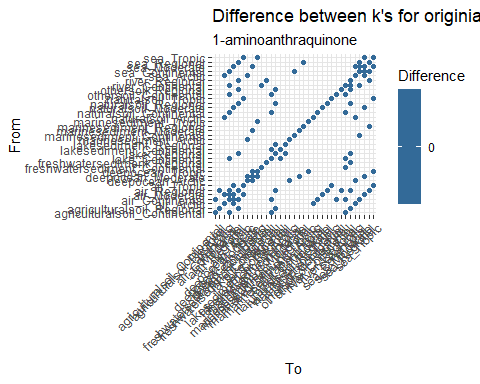
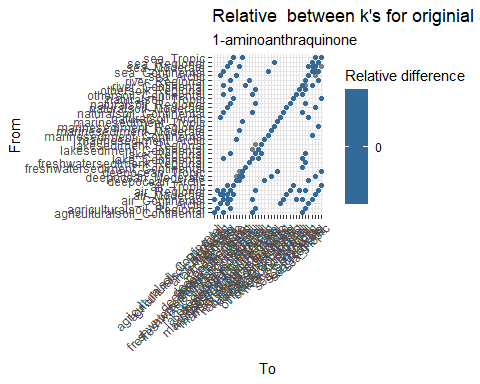
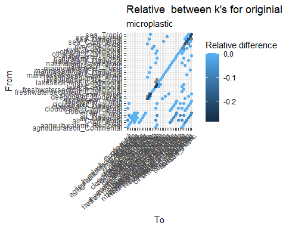
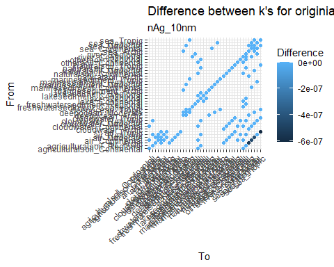
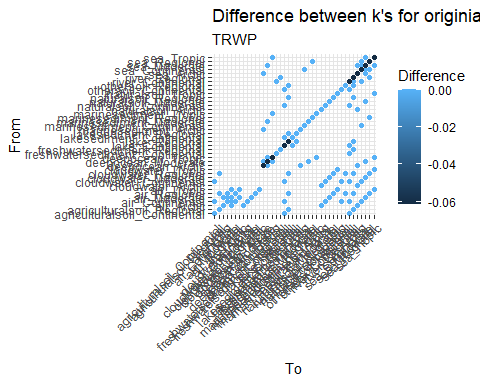
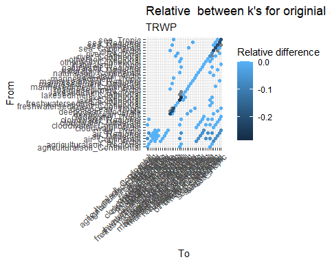

Comparison shape update
================
Nadim Saadi, Valerie de Rijk, Anne Hids, Joris Quik
2025-10-20

# Explanation of update

This explains the way we include drag of particles with shapes different
to a sphere.

Several processes which depend on the settling velocity now are
dependant on the Settling Velocity solver based on a specific Drag
method. The supported particle shapes can be found in section <u>3.2
Particle Properties</u> of the documentation.

The updated functions are:

- f_SetVelWater and v_SettlingVelocity

  - For which several functions are introduced or changed to cope with
    shape:

  - R/f_DragCoefficient.R

  - R/f_SetVelSolver.R

  - R/f_PerimeterParticle.R

  - R/f_SurfaceAreaParticle.R

  - R/f_Vol.R

  - R/v_rad_species.R

  - R/v_rho_species.R

- f_Grav.R and R/k_HeteroAgglomeration.wsd.R

  - In future shape could also be included for SPM, now still sphere
    assumed representative

- k_Resuspension due to the update of f_SetVelWater

- R/k_Sedimentation.R due to the update of f_SetVelWater

<!-- -->

    ## [1] "Directory: SBzips created."

    ## [1] "The SimpleBox model can be found in SimpleBox"

As this update was only implemented for microplastics and tyre road wear
particles, we will test for these substances. To be sure nothing changed
for the other substances, we will also test one other substance.

    ## [1] "kdis is missing, setting kdis = 0"

Do the same for the other implementation.

## Verification of previous and new implementation (Original drag method)

    ## [1] "k_CWscavenging"  "k_DryDeposition" "k_Sedimentation"

As can be seen in the figures below, the new rate constants for the
substances, 1-aminoanthraquinone, microplastic, nAg_10nm, TRWP, have a
negligible difference of max 1.1565065^{-5} % difference to the previous
version, related to processes: k_CWscavenging, k_DryDeposition,
k_Sedimentation. The figures below also show this and therefore this
verification of replicating the previous version with the new code is
complete.

``` r
all_diffs <- kaas_comparison |>
  mutate(fromname = paste0(fromSubCompart, "_", fromScale)) |>
  mutate(toname = paste0(toSubCompart, "_", toScale))

for(i in unique(all_diffs$Substance)){
  diffs_substance <- all_diffs |>
    filter(Substance == i)
  
  absdif_plot <- ggplot(diffs_substance, mapping = aes(x = toname, y = fromname, color = diff)) + 
    geom_point() + 
    labs(
      title = "Difference between old and new k's",
      subtitle = i,
      x = "To",  
      y = "From",  
      color = "Difference"  
    ) +
    theme(
      axis.text.x = element_text(angle = 45, hjust = 1), 
      panel.grid.major = element_line(linewidth = 0.2, color = "gray90"),  
      panel.background = element_blank() 
    )
  
  print(absdif_plot)
  
  reldif_plot <- ggplot(diffs_substance, mapping = aes(x = toname, y = fromname, color = rel_diff)) + 
    geom_point() + 
    labs(
      title = "Relative difference between old and new k's",
      subtitle = i,
      x = "To",  
      y = "From",  
      color = "Relative difference"  
    ) +
    theme(
      axis.text.x = element_text(angle = 45, hjust = 1), 
      panel.grid.major = element_line(linewidth = 0.2, color = "gray90"),
      panel.background = element_blank()  
    )
  print(reldif_plot)
}
```

<!-- --><!-- --><!-- --><!-- --><!-- --><!-- --><!-- --><!-- -->

## Quantify changes for new drag method options

The Original and Bagheri drag method will be compared.

    ## [1] "kdis is missing, setting kdis = 0"

Change drag method and recalculate k values

    ## [1] "kdis is missing, setting kdis = 0"

As can be seen in the figures below, the new rate constants for the
substances, 1-aminoanthraquinone, microplastic, nAg_10nm, TRWP, have a
difference of max 51.3 % between the original and Bagheri drag methods.
This affects the k_DryDeposition, k_HeteroAgglomeration.wsd,
k_Sedimentation processes.

| process | fromScale | fromSubCompart | fromSpecies | toScale | toSubCompart | toSpecies | Substance | k_Old | k_New | diff | rel_diff | full_name |
|:---|:---|:---|:---|:---|:---|:---|:---|---:|---:|---:|---:|:---|
| k_DryDeposition | Arctic | air | Solid | Arctic | sea | Solid | nAg_10nm | 0.0000056 | 0.0000051 | -0.0000005 | -0.1051283 | From air_Arctic to sea_Arctic |
| k_DryDeposition | Continental | air | Solid | Continental | lake | Solid | nAg_10nm | 0.0000000 | 0.0000000 | 0.0000000 | -0.1022113 | From air_Continental to lake_Continental |
| k_DryDeposition | Continental | air | Solid | Continental | river | Solid | nAg_10nm | 0.0000001 | 0.0000001 | 0.0000000 | -0.1022113 | From air_Continental to river_Continental |
| k_DryDeposition | Continental | air | Solid | Continental | sea | Solid | nAg_10nm | 0.0000049 | 0.0000044 | -0.0000005 | -0.1022113 | From air_Continental to sea_Continental |
| k_DryDeposition | Moderate | air | Solid | Moderate | sea | Solid | nAg_10nm | 0.0000047 | 0.0000043 | -0.0000004 | -0.1022113 | From air_Moderate to sea_Moderate |
| k_DryDeposition | Regional | air | Solid | Regional | lake | Solid | nAg_10nm | 0.0000000 | 0.0000000 | 0.0000000 | -0.1022113 | From air_Regional to lake_Regional |
| k_DryDeposition | Regional | air | Solid | Regional | river | Solid | nAg_10nm | 0.0000003 | 0.0000002 | 0.0000000 | -0.1022113 | From air_Regional to river_Regional |
| k_DryDeposition | Regional | air | Solid | Regional | sea | Solid | nAg_10nm | 0.0000000 | 0.0000000 | 0.0000000 | -0.1022113 | From air_Regional to sea_Regional |
| k_DryDeposition | Tropic | air | Solid | Tropic | sea | Solid | nAg_10nm | 0.0000067 | 0.0000061 | -0.0000006 | -0.1006113 | From air_Tropic to sea_Tropic |
| k_HeteroAgglomeration.wsd | Arctic | deepocean | Solid | Arctic | deepocean | Large | microplastic | 0.0002178 | 0.0001798 | -0.0000380 | -0.2112749 | From deepocean_Arctic to deepocean_Arctic |
| k_HeteroAgglomeration.wsd | Arctic | deepocean | Solid | Arctic | deepocean | Large | TRWP | 0.0002178 | 0.0001798 | -0.0000380 | -0.2112749 | From deepocean_Arctic to deepocean_Arctic |
| k_HeteroAgglomeration.wsd | Arctic | deepocean | Solid | Arctic | deepocean | Small | microplastic | 0.3636368 | 0.3023491 | -0.0612877 | -0.2027050 | From deepocean_Arctic to deepocean_Arctic |
| k_HeteroAgglomeration.wsd | Arctic | deepocean | Solid | Arctic | deepocean | Small | TRWP | 0.3636368 | 0.3023491 | -0.0612877 | -0.2027050 | From deepocean_Arctic to deepocean_Arctic |
| k_HeteroAgglomeration.wsd | Arctic | sea | Solid | Arctic | sea | Large | microplastic | 0.0002178 | 0.0001798 | -0.0000380 | -0.2112749 | From sea_Arctic to sea_Arctic |
| k_HeteroAgglomeration.wsd | Arctic | sea | Solid | Arctic | sea | Large | TRWP | 0.0002178 | 0.0001798 | -0.0000380 | -0.2112749 | From sea_Arctic to sea_Arctic |
| k_HeteroAgglomeration.wsd | Arctic | sea | Solid | Arctic | sea | Small | microplastic | 0.3636368 | 0.3023491 | -0.0612877 | -0.2027050 | From sea_Arctic to sea_Arctic |
| k_HeteroAgglomeration.wsd | Arctic | sea | Solid | Arctic | sea | Small | TRWP | 0.3636368 | 0.3023491 | -0.0612877 | -0.2027050 | From sea_Arctic to sea_Arctic |
| k_HeteroAgglomeration.wsd | Continental | lake | Solid | Continental | lake | Large | microplastic | 0.0000171 | 0.0000133 | -0.0000038 | -0.2851660 | From lake_Continental to lake_Continental |
| k_HeteroAgglomeration.wsd | Continental | lake | Solid | Continental | lake | Large | TRWP | 0.0000171 | 0.0000133 | -0.0000038 | -0.2851660 | From lake_Continental to lake_Continental |
| k_HeteroAgglomeration.wsd | Continental | lake | Solid | Continental | lake | Small | microplastic | 0.2961334 | 0.2348458 | -0.0612877 | -0.2609699 | From lake_Continental to lake_Continental |
| k_HeteroAgglomeration.wsd | Continental | lake | Solid | Continental | lake | Small | TRWP | 0.2961334 | 0.2348458 | -0.0612877 | -0.2609699 | From lake_Continental to lake_Continental |
| k_HeteroAgglomeration.wsd | Continental | sea | Solid | Continental | sea | Large | microplastic | 0.0002178 | 0.0001798 | -0.0000380 | -0.2112745 | From sea_Continental to sea_Continental |
| k_HeteroAgglomeration.wsd | Continental | sea | Solid | Continental | sea | Large | TRWP | 0.0002178 | 0.0001798 | -0.0000380 | -0.2112745 | From sea_Continental to sea_Continental |
| k_HeteroAgglomeration.wsd | Continental | sea | Solid | Continental | sea | Small | microplastic | 0.3636488 | 0.3023612 | -0.0612877 | -0.2026969 | From sea_Continental to sea_Continental |
| k_HeteroAgglomeration.wsd | Continental | sea | Solid | Continental | sea | Small | TRWP | 0.3636488 | 0.3023612 | -0.0612877 | -0.2026969 | From sea_Continental to sea_Continental |
| k_HeteroAgglomeration.wsd | Moderate | deepocean | Solid | Moderate | deepocean | Large | microplastic | 0.0002178 | 0.0001798 | -0.0000380 | -0.2112745 | From deepocean_Moderate to deepocean_Moderate |
| k_HeteroAgglomeration.wsd | Moderate | deepocean | Solid | Moderate | deepocean | Large | TRWP | 0.0002178 | 0.0001798 | -0.0000380 | -0.2112745 | From deepocean_Moderate to deepocean_Moderate |
| k_HeteroAgglomeration.wsd | Moderate | deepocean | Solid | Moderate | deepocean | Small | microplastic | 0.3636488 | 0.3023612 | -0.0612877 | -0.2026969 | From deepocean_Moderate to deepocean_Moderate |
| k_HeteroAgglomeration.wsd | Moderate | deepocean | Solid | Moderate | deepocean | Small | TRWP | 0.3636488 | 0.3023612 | -0.0612877 | -0.2026969 | From deepocean_Moderate to deepocean_Moderate |
| k_HeteroAgglomeration.wsd | Moderate | sea | Solid | Moderate | sea | Large | microplastic | 0.0002178 | 0.0001798 | -0.0000380 | -0.2112745 | From sea_Moderate to sea_Moderate |
| k_HeteroAgglomeration.wsd | Moderate | sea | Solid | Moderate | sea | Large | TRWP | 0.0002178 | 0.0001798 | -0.0000380 | -0.2112745 | From sea_Moderate to sea_Moderate |
| k_HeteroAgglomeration.wsd | Moderate | sea | Solid | Moderate | sea | Small | microplastic | 0.3636488 | 0.3023612 | -0.0612877 | -0.2026969 | From sea_Moderate to sea_Moderate |
| k_HeteroAgglomeration.wsd | Moderate | sea | Solid | Moderate | sea | Small | TRWP | 0.3636488 | 0.3023612 | -0.0612877 | -0.2026969 | From sea_Moderate to sea_Moderate |
| k_HeteroAgglomeration.wsd | Regional | lake | Solid | Regional | lake | Large | microplastic | 0.0000171 | 0.0000133 | -0.0000038 | -0.2851660 | From lake_Regional to lake_Regional |
| k_HeteroAgglomeration.wsd | Regional | lake | Solid | Regional | lake | Large | TRWP | 0.0000171 | 0.0000133 | -0.0000038 | -0.2851660 | From lake_Regional to lake_Regional |
| k_HeteroAgglomeration.wsd | Regional | lake | Solid | Regional | lake | Small | microplastic | 0.2961334 | 0.2348458 | -0.0612877 | -0.2609699 | From lake_Regional to lake_Regional |
| k_HeteroAgglomeration.wsd | Regional | lake | Solid | Regional | lake | Small | TRWP | 0.2961334 | 0.2348458 | -0.0612877 | -0.2609699 | From lake_Regional to lake_Regional |
| k_HeteroAgglomeration.wsd | Regional | sea | Solid | Regional | sea | Large | microplastic | 0.0002178 | 0.0001798 | -0.0000380 | -0.2112745 | From sea_Regional to sea_Regional |
| k_HeteroAgglomeration.wsd | Regional | sea | Solid | Regional | sea | Large | TRWP | 0.0002178 | 0.0001798 | -0.0000380 | -0.2112745 | From sea_Regional to sea_Regional |
| k_HeteroAgglomeration.wsd | Regional | sea | Solid | Regional | sea | Small | microplastic | 0.3636488 | 0.3023612 | -0.0612877 | -0.2026969 | From sea_Regional to sea_Regional |
| k_HeteroAgglomeration.wsd | Regional | sea | Solid | Regional | sea | Small | TRWP | 0.3636488 | 0.3023612 | -0.0612877 | -0.2026969 | From sea_Regional to sea_Regional |
| k_HeteroAgglomeration.wsd | Tropic | deepocean | Solid | Tropic | deepocean | Large | microplastic | 0.0002178 | 0.0001798 | -0.0000380 | -0.2112742 | From deepocean_Tropic to deepocean_Tropic |
| k_HeteroAgglomeration.wsd | Tropic | deepocean | Solid | Tropic | deepocean | Large | TRWP | 0.0002178 | 0.0001798 | -0.0000380 | -0.2112742 | From deepocean_Tropic to deepocean_Tropic |
| k_HeteroAgglomeration.wsd | Tropic | deepocean | Solid | Tropic | deepocean | Small | microplastic | 0.3636560 | 0.3023683 | -0.0612877 | -0.2026921 | From deepocean_Tropic to deepocean_Tropic |
| k_HeteroAgglomeration.wsd | Tropic | deepocean | Solid | Tropic | deepocean | Small | TRWP | 0.3636560 | 0.3023683 | -0.0612877 | -0.2026921 | From deepocean_Tropic to deepocean_Tropic |
| k_HeteroAgglomeration.wsd | Tropic | sea | Solid | Tropic | sea | Large | microplastic | 0.0002178 | 0.0001798 | -0.0000380 | -0.2112742 | From sea_Tropic to sea_Tropic |
| k_HeteroAgglomeration.wsd | Tropic | sea | Solid | Tropic | sea | Large | TRWP | 0.0002178 | 0.0001798 | -0.0000380 | -0.2112742 | From sea_Tropic to sea_Tropic |
| k_HeteroAgglomeration.wsd | Tropic | sea | Solid | Tropic | sea | Small | microplastic | 0.3636560 | 0.3023683 | -0.0612877 | -0.2026921 | From sea_Tropic to sea_Tropic |
| k_HeteroAgglomeration.wsd | Tropic | sea | Solid | Tropic | sea | Small | TRWP | 0.3636560 | 0.3023683 | -0.0612877 | -0.2026921 | From sea_Tropic to sea_Tropic |
| k_Sedimentation | Arctic | deepocean | Solid | Arctic | marinesediment | Solid | nAg_10nm | 0.0000000 | 0.0000000 | 0.0000000 | -0.5126512 | From deepocean_Arctic to marinesediment_Arctic |
| k_Sedimentation | Arctic | sea | Solid | Arctic | deepocean | Solid | nAg_10nm | 0.0000000 | 0.0000000 | 0.0000000 | -0.5126512 | From sea_Arctic to deepocean_Arctic |
| k_Sedimentation | Continental | lake | Solid | Continental | lakesediment | Solid | nAg_10nm | 0.0000000 | 0.0000000 | 0.0000000 | -0.5126512 | From lake_Continental to lakesediment_Continental |
| k_Sedimentation | Continental | river | Solid | Continental | freshwatersediment | Solid | nAg_10nm | 0.0000000 | 0.0000000 | 0.0000000 | -0.5126512 | From river_Continental to freshwatersediment_Continental |
| k_Sedimentation | Continental | sea | Solid | Continental | marinesediment | Solid | nAg_10nm | 0.0000000 | 0.0000000 | 0.0000000 | -0.5126512 | From sea_Continental to marinesediment_Continental |
| k_Sedimentation | Moderate | deepocean | Solid | Moderate | marinesediment | Solid | nAg_10nm | 0.0000000 | 0.0000000 | 0.0000000 | -0.5126512 | From deepocean_Moderate to marinesediment_Moderate |
| k_Sedimentation | Moderate | sea | Solid | Moderate | deepocean | Solid | nAg_10nm | 0.0000000 | 0.0000000 | 0.0000000 | -0.5126512 | From sea_Moderate to deepocean_Moderate |
| k_Sedimentation | Regional | lake | Solid | Regional | lakesediment | Solid | nAg_10nm | 0.0000000 | 0.0000000 | 0.0000000 | -0.5126512 | From lake_Regional to lakesediment_Regional |
| k_Sedimentation | Regional | river | Solid | Regional | freshwatersediment | Solid | nAg_10nm | 0.0000000 | 0.0000000 | 0.0000000 | -0.5126512 | From river_Regional to freshwatersediment_Regional |
| k_Sedimentation | Regional | sea | Solid | Regional | marinesediment | Solid | nAg_10nm | 0.0000000 | 0.0000000 | 0.0000000 | -0.5126512 | From sea_Regional to marinesediment_Regional |
| k_Sedimentation | Tropic | deepocean | Solid | Tropic | marinesediment | Solid | nAg_10nm | 0.0000000 | 0.0000000 | 0.0000000 | -0.5126512 | From deepocean_Tropic to marinesediment_Tropic |
| k_Sedimentation | Tropic | sea | Solid | Tropic | deepocean | Solid | nAg_10nm | 0.0000000 | 0.0000000 | 0.0000000 | -0.5126512 | From sea_Tropic to deepocean_Tropic |

From the above table it can be seen, that also the Ag 10 nm nanomaterial
is affected with an
``` r``round(max(abs(unique(changed_kaas$rel_diff)))*100, 1) ```
decrease in k_sedimentation. It is (for now) advised to not use the
Bagheri drag method for nanomaterials.

<!-- --><!-- --><!-- --><!-- --><!-- --><!-- --><!-- --><!-- -->

## Example for differently shaped particles

Change shapes based on substance data

Run SBoo for a sphere Using Bagheri Dragmethod.
<!--# TODO: Compare the new shapes to spheres with same volume to show the implications of using shapes. And doing this for different sizes. -->

``` r
substances <- read.csv("data/Substances.csv")
substances <- substances |>
  filter(str_detect(Substance, "^microplastic"))

this_kaas_shape <- data.frame()

for(substanceK in substances$Substance){
  
  substance <- substanceK
      source("baseScripts/initWorld.R")

  kaas <- World$kaas |>
    mutate(Substance = substance)
  
  this_kaas_shape <- rbind(this_kaas_shape, kaas)
}
```

All are calculated, but let’s check if the new microplastics_sphere (set
as Shortest_side) provides the same k’s as the default microplastic (set
as RadS).

    ## [1] "test passed, no changes in k's found"
