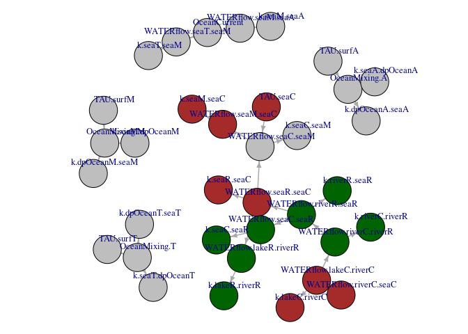

Excel Dependencies
================
Jaap Slootweg, Valerie de Rijk
2024-07-24


## Trace precedents / dependancies

This vignette is not necessarily related to the SBoo implementation in
R, but rather gives insight in dependencies in Excel (on which this is
based). This vignette creates a Directed Graph from formulas in excel.
It demonstrates the further use of the ClassicNanoProcess, especially
the methods Excelgrep, Exceldependencies and Exceltrace, in combination
with igraph. The end result is a plotted graph which gives you inside in
the coherence of the waterflows and the related exchange-rates.

First we initialise a landscape “World”, and grab cells with names
containing “flow” or “Ocean”, and their contents

``` r
#script to initialize test environment faking library(sboo)
source("baseScripts/fakeLib.R", verbose = F) #TODO silence the source
```

    ## ── Attaching core tidyverse packages ──────────────────────── tidyverse 2.0.0 ──
    ## ✔ dplyr     1.1.4     ✔ readr     2.1.5
    ## ✔ forcats   1.0.0     ✔ stringr   1.5.1
    ## ✔ ggplot2   3.5.0     ✔ tibble    3.2.1
    ## ✔ lubridate 1.9.3     ✔ tidyr     1.3.1
    ## ✔ purrr     1.0.2     
    ## ── Conflicts ────────────────────────────────────────── tidyverse_conflicts() ──
    ## ✖ dplyr::filter() masks stats::filter()
    ## ✖ dplyr::lag()    masks stats::lag()
    ## ℹ Use the conflicted package (<http://conflicted.r-lib.org/>) to force all conflicts to become errors
    ## 
    ## Attaching package: 'ggdag'
    ## 
    ## 
    ## The following object is masked from 'package:stats':
    ## 
    ##     filter
    ## 
    ## 
    ## 
    ## Attaching package: 'rlang'
    ## 
    ## 
    ## The following objects are masked from 'package:purrr':
    ## 
    ##     %@%, flatten, flatten_chr, flatten_dbl, flatten_int, flatten_lgl,
    ##     flatten_raw, invoke, splice

``` r
NewstateModule <- ClassicNanoWorld$new("data", "Ag(I)")
```

    ## Joining with `by = join_by(Matrix)`
    ## Joining with `by = join_by(Compartment)`

``` r
#with this data we create an instance of the central "core" object,
World <- SBcore$new(NewstateModule)
#reading data from the excel version(s) resembles the process class 
ClassicClass <- ClassicNanoProcess$new(TheCore = World, filename = "data/SimpleBox4.01_20211028.xlsm")
World$UpdateKaas(ClassicClass)
```

    ## Joining with `by = join_by(sheet, row)`

We use the Excelgrep method to extract the cells with names like flow or
ocean. The Scale and Subcompart columns are based on the naming
convention in the SB excel versions

``` r
flows <- ClassicClass$Excelgrep("flow|Ocean")
flows[,c("Scale","Scale.1","SubCompart","SubCompart.1","varName", "FormValue")]
```

    ##          Scale     Scale.1 SubCompart SubCompart.1           varName
    ## 1     Regional    Regional       lake        river WATERflow.w0R.w1R
    ## 2     Regional    Regional       lake          sea WATERflow.w0R.w2R
    ## 3     Regional    Regional      river         lake WATERflow.w1R.w0R
    ## 4     Regional    Regional      river          sea WATERflow.w1R.w2R
    ## 5     Regional Continental        sea          sea WATERflow.w2R.w2C
    ## 6  Continental Continental       lake        river WATERflow.w0C.w1C
    ## 7  Continental Continental       lake          sea WATERflow.w0C.w2C
    ## 8  Continental Continental      river         lake WATERflow.w1C.w0C
    ## 9  Continental    Regional      river        river WATERflow.w1C.w1R
    ## 10 Continental Continental      river          sea WATERflow.w1C.w2C
    ## 11 Continental    Regional        sea          sea WATERflow.w2C.w2R
    ## 12 Continental    Moderate        sea          sea WATERflow.w2C.w2M
    ## 13    Moderate Continental        sea          sea WATERflow.w2M.w2C
    ## 14    Moderate      Arctic        sea          sea WATERflow.w2M.w2A
    ## 15    Moderate      Tropic        sea          sea WATERflow.w2M.w2T
    ## 16        <NA>        <NA>       <NA>         <NA>      OceanCurrent
    ## 17    Moderate        <NA>       <NA>         <NA>     OceanMixing.M
    ## 18      Arctic    Moderate        sea          sea WATERflow.w2A.w2M
    ## 19      Arctic        <NA>       <NA>         <NA>     OceanMixing.A
    ## 20      Tropic    Moderate        sea          sea WATERflow.w2T.w2M
    ## 21      Tropic        <NA>       <NA>         <NA>     OceanMixing.T
    ##                                                                                                                                                 FormValue
    ## 1                                                                                                                                   0.1*WATERflow.w2R.w2C
    ## 2                                                                                                                                                    <NA>
    ## 3                                                                                                                                                    <NA>
    ## 4  ((AREAFRAC.w1R+AREAFRAC.s1R*FRACrun.s1R+AREAFRAC.s2R*FRACrun.s2R+AREAFRAC.s3R*FRACrun.s3R)*RAINrate.R*SYSTEMAREA.R+WATERflow.w1C.w1R)*(1-FRAC.w1R.w1C)
    ## 5                                                                                                                     WATERflow.w1R.w2R+WATERflow.w2C.w2R
    ## 6                                                                                                                                   0.1*WATERflow.w1C.w2C
    ## 7                                                                                                                                                    <NA>
    ## 8                                                                                                                                                    <NA>
    ## 9      ((AREAFRAC.w1C+AREAFRAC.s1C*FRACrun.s1C+AREAFRAC.s2C*FRACrun.s2C+AREAFRAC.s3C*FRACrun.s3C)*RAINrate.C*SYSTEMAREA.C+WATERflow.w0C.w1C)*FRAC.w1C.w1R
    ## 10                   ((AREAFRAC.w1C+AREAFRAC.s1C*FRACrun.s1C+AREAFRAC.s2C*FRACrun.s2C+AREAFRAC.s3C*FRACrun.s3C)*RAINrate.C*SYSTEMAREA.C)*(1-FRAC.w1C.w1R)
    ## 11                                                                                                                               (10-1)*WATERflow.w1R.w2R
    ## 12                                                                                                                 (VOLUME.w2C/TAU.w2C)-WATERflow.w2R.w2C
    ## 13                                                                                                                                      WATERflow.w2C.w2M
    ## 14                                                                                                                                           OceanCurrent
    ## 15                                                                                                                                                      0
    ## 16                                                                                                                                                   <NA>
    ## 17                                                                                                                                   VOLUME.w2M/TAU.surfM
    ## 18                                                                                                                                                      0
    ## 19                                                                                                                                   VOLUME.w2A/TAU.surfA
    ## 20                                                                                                                                           OceanCurrent
    ## 21                                                                                                                                   VOLUME.w2T/TAU.surfT

## Track and Trace

We back-track the dependencies of these cells, but we limit the
tracking-depth (maxDepth) to avoid cluttering of the graph. To filter
the data to our needs, we convert the graph temporarily to a data.frame.

## Concatenate another selection

To complete the graph we have to add a “layer” to the other side: the
trace of the cell. The unique function makes sure there are no double
edges between the original graph and the novel part. Further information
can be added to graph by colors. In this case I’m focussing on the
scales Continental (trailing C in the name) and Regional (trailing R). I
also substituted the SubCompartment codes to more verbose ones.

    ## [1] "o"
    ## [1] "WATERflow.w0R.w1R"
    ## [1] "k.w0R.w1R"
    ## [1] "WATERflow.w1R.w2R"
    ## [1] "k.w1R.w2R"
    ## [1] "WATERflow.w2R.w2C"
    ## [1] "WATERflow.w2C.w2R"
    ## [1] "WATERflow.w2R.w2C"
    ## [1] "k.w2R.w2C"
    ## [1] "WATERflow.w0R.w1R"
    ## [1] "WATERflow.w2C.w2M"
    ## [1] "WATERflow.w0C.w1C"
    ## [1] "k.w0C.w1C"
    ## [1] "WATERflow.w1C.w1R"
    ## [1] "WATERflow.w1C.w1R"
    ## [1] "WATERflow.w1R.w2R"
    ## [1] "k.w1C.w1R"
    ## [1] "WATERflow.w2C.w2R"
    ## [1] "WATERflow.w2R.w2C"
    ## [1] "k.w2C.w2R"
    ## [1] "WATERflow.w2C.w2M"
    ## [1] "k.w2C.w2M"
    ## [1] "WATERflow.w2M.w2C"
    ## [1] "WATERflow.w2M.w2C"
    ## [1] "k.w2M.w2C"
    ## [1] "WATERflow.w2M.w2A"
    ## [1] "k.w2M.w2A"
    ## [1] "OceanMixing.M"
    ## [1] "k.w2M.w3M"
    ## [1] "k.w3M.w2M"
    ## [1] "OceanMixing.A"
    ## [1] "k.w2A.w3A"
    ## [1] "k.w3A.w2A"
    ## [1] "WATERflow.w2T.w2M"
    ## [1] "k.w2T.w2M"
    ## [1] "OceanMixing.T"
    ## [1] "k.w2T.w3T"
    ## [1] "k.w3T.w2T"

<!-- -->

## The logic of rain-induced regional / continental waterflows.

The next step is to find the formulas with this graph. From the graph we
extract the order of the calculation. We exclude flows between sea and
deepocean. The combination of the ordered list and the formula’s /
values from the flows data.frame is:

``` r
#flows[flows$Scale %in% c("Regional", "Continental") | flows$Scale.1 %in% c("Regional", "Continental"), c("Scale","Scale.1","SubCompart","SubCompart.1","varName")]
corder <- match(c("WATERflow.w1C.w2C", "WATERflow.w0C.w1C", "WATERflow.w1C.w1R", "WATERflow.w1R.w2R", "WATERflow.w2C.w2R", "WATERflow.w2R.w2C", "WATERflow.w0R.w1R", "WATERflow.w0R.w1R"),
                flows$varName)
rownames(flows) <- flows$varName
flows[corder, c("FormValue", "varName")]
```

    ##                                                                                                                                                                  FormValue
    ## WATERflow.w1C.w2C                     ((AREAFRAC.w1C+AREAFRAC.s1C*FRACrun.s1C+AREAFRAC.s2C*FRACrun.s2C+AREAFRAC.s3C*FRACrun.s3C)*RAINrate.C*SYSTEMAREA.C)*(1-FRAC.w1C.w1R)
    ## WATERflow.w0C.w1C                                                                                                                                    0.1*WATERflow.w1C.w2C
    ## WATERflow.w1C.w1R       ((AREAFRAC.w1C+AREAFRAC.s1C*FRACrun.s1C+AREAFRAC.s2C*FRACrun.s2C+AREAFRAC.s3C*FRACrun.s3C)*RAINrate.C*SYSTEMAREA.C+WATERflow.w0C.w1C)*FRAC.w1C.w1R
    ## WATERflow.w1R.w2R   ((AREAFRAC.w1R+AREAFRAC.s1R*FRACrun.s1R+AREAFRAC.s2R*FRACrun.s2R+AREAFRAC.s3R*FRACrun.s3R)*RAINrate.R*SYSTEMAREA.R+WATERflow.w1C.w1R)*(1-FRAC.w1R.w1C)
    ## WATERflow.w2C.w2R                                                                                                                                 (10-1)*WATERflow.w1R.w2R
    ## WATERflow.w2R.w2C                                                                                                                      WATERflow.w1R.w2R+WATERflow.w2C.w2R
    ## WATERflow.w0R.w1R                                                                                                                                    0.1*WATERflow.w2R.w2C
    ## WATERflow.w0R.w1R.1                                                                                                                                  0.1*WATERflow.w2R.w2C
    ##                               varName
    ## WATERflow.w1C.w2C   WATERflow.w1C.w2C
    ## WATERflow.w0C.w1C   WATERflow.w0C.w1C
    ## WATERflow.w1C.w1R   WATERflow.w1C.w1R
    ## WATERflow.w1R.w2R   WATERflow.w1R.w2R
    ## WATERflow.w2C.w2R   WATERflow.w2C.w2R
    ## WATERflow.w2R.w2C   WATERflow.w2R.w2C
    ## WATERflow.w0R.w1R   WATERflow.w0R.w1R
    ## WATERflow.w0R.w1R.1 WATERflow.w0R.w1R

## R implementation

The runoff from soils and the direct rainfall on w1 (rivers =
“freshwater”) are available from the flux x_RunOff and the variable
“RainOnRiver”. There are also two fractions controlling the flux from
Continental rivers to Regional, and vice versa: FRAC.w1C.w1R and
FRAC.w1R.w1C. Use these if you clipping of Regional out of Continental
is not 100% consistent with the catchments. FRAC.w1R.w1C is a landscape
setting, 0.0 for the Default and EUSES scenarios. FRAC.w1C.w1R is also a
landscape scenario set to 0 for Default, but 3.4 % for EUSES. The
outflow of continental river to the sea is the rain-originating input,
excluding the fraction to Regional river. The outflow from the lake to
the river is 10% from the outflow of the river to the sea. (It is
unclear where the lake water comes from. See vignette 5.4 Advection in
the vignettes folder for additional details.
