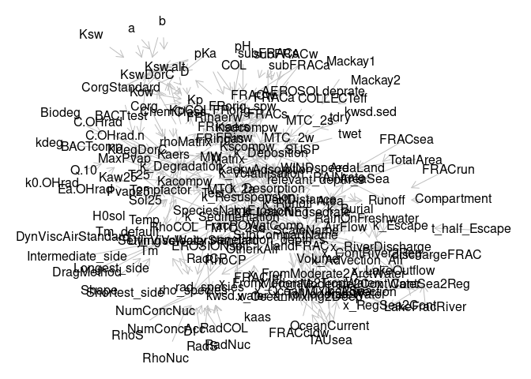

Introduction to variables
================
JS
11/23/2022

## Variables in SimpleBox

are read initially, but you can add variables just by defining the
function how to calculate the variable. This vignette will demonstrate
how the variable “volume” is defined, how it can be retrieved, and how
to verify it against the values in the excel-version. First step is to
initiate testing objects by running a standard script
baseScripts/initTestWorld.R. We will use two objects that are created:
“World” and “ClassicClass”. Note the class properties and the
inheritance of ClassicClass.

``` r
source("baseScripts/initTestWorld.R")
```

    ## ── Attaching packages ─────────────────────────────────────── tidyverse 1.3.2 ──
    ## ✔ ggplot2 3.4.0      ✔ purrr   0.3.5 
    ## ✔ tibble  3.1.8      ✔ dplyr   1.0.10
    ## ✔ tidyr   1.2.1      ✔ stringr 1.5.0 
    ## ✔ readr   2.1.3      ✔ forcats 0.5.2 
    ## ── Conflicts ────────────────────────────────────────── tidyverse_conflicts() ──
    ## ✖ dplyr::filter() masks stats::filter()
    ## ✖ dplyr::lag()    masks stats::lag()
    ## 
    ## Attaching package: 'ggdag'
    ## 
    ## 
    ## The following object is masked from 'package:stats':
    ## 
    ##     filter
    ## 
    ## 
    ## 
    ## Attaching package: 'rlang'
    ## 
    ## 
    ## The following objects are masked from 'package:purrr':
    ## 
    ##     %@%, as_function, flatten, flatten_chr, flatten_dbl, flatten_int,
    ##     flatten_lgl, flatten_raw, invoke, splice
    ## 
    ## 
    ## Joining, by = c("sheet", "row")

``` r
class(World)
```

    ## [1] "SBcore" "R6"

``` r
class(ClassicClass)
```

    ## [1] "ClassicNanoProcess" "ProcessModule"      "CalcGraphModule"   
    ## [4] "R6"

SimpleBox Variables are defined by a function, and many of the defining
functions are present in the package. One of the variable defining
functions is “Volume”. The method NewCalcVariable adds the simpleBox
variable; it needs the name (as character) of the function

``` r
Volume
```

    ## function (VertDistance, Area, FRACcldw, SubCompartName) 
    ## {
    ##     if (SubCompartName == "air") {
    ##         VertDistance * Area * (1 - FRACcldw)
    ##     }
    ##     else if (SubCompartName == "cloudwater") {
    ##         VertDistance * Area * FRACcldw
    ##     }
    ##     else VertDistance * Area
    ## }

``` r
World$NewCalcVariable("Volume")
```

R “knows” the parameters of a function, see the function formals().
These names are also variables, partly already read from data in the
initialisation. You can lookup which variables are known, and their
values by method fetchData of the class SBcore. World is of this class.
An empty varname (the parameter for this method) returns all known
parameters. Note that variable are usually tables, with keyfields
indicating the domain of the variable. \## Variables are tables,
parameters are atomic Note that variables are usually tables, including
the key fields defining their domain (except constants) but the
parameters in the functions are atomic; meaning its not the table, not
even a vector! The variable defining functions are called by SBOO for
each relevant combination of the variables. Results, when not NA, are
stored in the in-memory database of SBOO.

``` r
formals(Volume)
```

    ## $VertDistance
    ## 
    ## 
    ## $Area
    ## 
    ## 
    ## $FRACcldw
    ## 
    ## 
    ## $SubCompartName

``` r
World$fetchData()
```

    ##   [1] "a"                         "a"                        
    ##   [3] "AbbrC"                     "AbbrP"                    
    ##   [5] "AEROresist"                "AEROSOLdeprate"           
    ##   [7] "alpha.surf"                "b"                        
    ##   [9] "b"                         "beta.a."                  
    ##  [11] "C.OHrad"                   "C.Ohrad.n"                
    ##  [13] "ChemClass"                 "ColRad"                   
    ##  [15] "ColRad"                    "Compartment"              
    ##  [17] "ContinentalInModerate"     "Corg"                     
    ##  [19] "DefaultFRACarea"           "Df"                       
    ##  [21] "Dimension"                 "dischargeFRAC"            
    ##  [23] "DynVisc"                   "Ea.OHrad"                 
    ##  [25] "epsilon"                   "Erosion"                  
    ##  [27] "EROSIONsoil"               "FlowName"                 
    ##  [29] "forWhich"                  "FRAC.awS"                 
    ##  [31] "FRAC.aWs"                  "FRAC.Aws"                 
    ##  [33] "FRACa"                     "FRACaers"                 
    ##  [35] "FRACaerw"                  "FRACcldw"                 
    ##  [37] "FRACinf"                   "FRACrun"                  
    ##  [39] "FRACs"                     "FRACsea"                  
    ##  [41] "FRACtwet"                  "FRACw"                    
    ##  [43] "FricVel"                   "fromScale"                
    ##  [45] "fromSubCompart"            "gamma.surf"               
    ##  [47] "H0sol"                     "hamakerSP.w"              
    ##  [49] "k_Advection_Air"           "k_Advection_catchment"    
    ##  [51] "k_AdvectionRiverSeaScales" "k_AdvectionWaters"        
    ##  [53] "k_CWscavenging"            "k_Leaching"               
    ##  [55] "k_Removal"                 "k_Resuspension"           
    ##  [57] "k_Sedimentation.SAP"       "k.HeteroAgglomeration.a"  
    ##  [59] "k.HeteroAgglomeration.sd"  "k0.OHrad"                 
    ##  [61] "Kaw25"                     "kdeg.air"                 
    ##  [63] "kdeg.sed"                  "kdeg.soil"                
    ##  [65] "kdeg.water"                "Kow"                      
    ##  [67] "Kow_default"               "Kp.col"                   
    ##  [69] "Kp.sed"                    "Kp.soil"                  
    ##  [71] "Kp.susp"                   "Ksw"                      
    ##  [73] "LakeFracRiver"             "landFRAC"                 
    ##  [75] "Matrix"                    "MaxPvap"                  
    ##  [77] "mConcCol"                  "mConcSusp"                
    ##  [79] "MOLMASSAIR"                "MW"                       
    ##  [81] "NaturalPart"               "NaturalRad"               
    ##  [83] "NaturalRho"                "NETsedrate"               
    ##  [85] "NumConcAcc"                "NumConcCP"                
    ##  [87] "NumConcNuc"                "OceanCurrent"             
    ##  [89] "outdated"                  "outdated.1"               
    ##  [91] "outdated.2"                "pH"                       
    ##  [93] "pKa"                       "Porosity"                 
    ##  [95] "Pvap25"                    "Pvap25_default"           
    ##  [97] "QSAR.ChemClass"            "QSAR.ChemClass"           
    ##  [99] "RadAcc"                    "RadNuc"                   
    ## [101] "RadS"                      "RAINrate"                 
    ## [103] "RhoAcc"                    "rhoMatrix"                
    ## [105] "RhoNuc"                    "RhoS"                     
    ## [107] "RhoSPM"                    "ScaleName"                
    ## [109] "SettlVelocitywater"        "Shear"                    
    ## [111] "Sol25"                     "SpeciesName"              
    ## [113] "SubCompartName"            "Substance"                
    ## [115] "T25"                       "TAUsea"                   
    ## [117] "Temp"                      "Tm"                       
    ## [119] "Tm_default"                "toScale"                  
    ## [121] "ToSI"                      "toSubCompart"             
    ## [123] "TotalArea"                 "Udarcy"                   
    ## [125] "Unit"                      "VarName"                  
    ## [127] "VarName"                   "VertDistance"             
    ## [129] "Waarde"                    "WATERflow.w0R.w2R"        
    ## [131] "WATERflow.w1R.w0R"         "WINDspeed"

``` r
World$fetchData("VertDistance")
```

    ##          Scale         SubCompart VertDistance
    ## 1       Arctic          othersoil        5e-02
    ## 2  Continental   agriculturalsoil        2e-01
    ## 3  Continental        naturalsoil        5e-02
    ## 4  Continental          othersoil        5e-02
    ## 5     Moderate          othersoil        5e-02
    ## 6     Regional   agriculturalsoil        2e-01
    ## 7     Regional        naturalsoil        5e-02
    ## 8     Regional          othersoil        5e-02
    ## 9       Tropic          othersoil        5e-02
    ## 10      Arctic     marinesediment        3e-02
    ## 11 Continental freshwatersediment        3e-02
    ## 12 Continental     marinesediment        3e-02
    ## 13    Moderate     marinesediment        3e-02
    ## 14    Regional freshwatersediment        3e-02
    ## 15    Regional     marinesediment        3e-02
    ## 16      Tropic     marinesediment        3e-02
    ## 17 Continental               lake        1e+02
    ## 18 Continental              river        3e+00
    ## 19    Regional               lake        1e+02
    ## 20    Regional              river        3e+00
    ## 21      Arctic          deepocean        3e+03
    ## 22      Arctic                sea        1e+02
    ## 23 Continental                sea        2e+02
    ## 24    Moderate          deepocean        3e+03
    ## 25    Moderate                sea        1e+02
    ## 26    Regional                sea        1e+01
    ## 27      Tropic          deepocean        3e+03
    ## 28      Tropic                sea        1e+02
    ## 29 Continental       lakesediment        3e-02
    ## 30    Regional       lakesediment        3e-02
    ## 31      Arctic                air        1e+03
    ## 32      Arctic         cloudwater        1e+03
    ## 33 Continental                air        1e+03
    ## 34 Continental         cloudwater        1e+03
    ## 35    Moderate                air        1e+03
    ## 36    Moderate         cloudwater        1e+03
    ## 37    Regional                air        1e+03
    ## 38    Regional         cloudwater        1e+03
    ## 39      Tropic                air        1e+03
    ## 40      Tropic         cloudwater        1e+03

``` r
World$fetchData("FRACcldw")
```

    ##         Scale FRACcldw
    ## 1      Arctic    3e-07
    ## 2 Continental    3e-07
    ## 3    Moderate    3e-07
    ## 4    Regional    3e-07
    ## 5      Tropic    3e-07

The variable Area is missing. Missing variables can be found by the
method whichUnresolved. Area is also a function, which needs other
variables. To complete the calculation of Volume we have four steps,
three in preparation. Area can (and will) be used by other functions. No
need to recalculate it.

``` r
World$whichUnresolved()
```

    ## [1] "Area"

``` r
lapply(c("AreaSea", "AreaLand", "Area"), function(FuName){
  World$NewCalcVariable(FuName)
  World$CalcVar(FuName)
})
```

    ## [[1]]
    ##         Scale      AreaSea
    ## 1      Arctic 2.550000e+13
    ## 2 Continental 3.713998e+12
    ## 3    Moderate 3.878500e+13
    ## 4    Regional 1.001873e+09
    ## 5      Tropic 8.960000e+13
    ## 
    ## [[2]]
    ##         Scale     AreaLand
    ## 1      Arctic 1.700000e+13
    ## 2 Continental 3.486002e+12
    ## 3    Moderate 3.878500e+13
    ## 4    Regional 2.289981e+11
    ## 5      Tropic 3.840000e+13
    ## 
    ## [[3]]
    ##          Scale       SubCompart         Area
    ## 1       Arctic        othersoil 1.700000e+13
    ## 2       Arctic        deepocean 2.550000e+13
    ## 4       Arctic              sea 2.550000e+13
    ## 5       Arctic              air 4.250000e+13
    ## 6       Arctic       cloudwater 4.250000e+13
    ## 7  Continental agriculturalsoil 2.091601e+12
    ## 8  Continental      naturalsoil 9.412205e+11
    ## 10 Continental              air 7.200000e+12
    ## 11 Continental             lake 8.715005e+09
    ## 14 Continental            river 9.586505e+10
    ## 15 Continental       cloudwater 7.200000e+12
    ## 16 Continental              sea 3.713998e+12
    ## 17 Continental        othersoil 3.486002e+11
    ## 18    Moderate        othersoil 3.878500e+13
    ## 19    Moderate        deepocean 3.878500e+13
    ## 20    Moderate              air 7.757000e+13
    ## 21    Moderate              sea 3.878500e+13
    ## 22    Moderate       cloudwater 7.757000e+13
    ## 24    Regional              air 2.300000e+11
    ## 27    Regional      naturalsoil 6.182949e+10
    ## 28    Regional agriculturalsoil 1.373989e+11
    ## 29    Regional            river 6.297448e+09
    ## 30    Regional        othersoil 2.289981e+10
    ## 31    Regional             lake 5.724953e+08
    ## 32    Regional       cloudwater 2.300000e+11
    ## 34    Regional              sea 1.001873e+09
    ## 35      Tropic              air 1.280000e+14
    ## 36      Tropic        othersoil 3.840000e+13
    ## 37      Tropic        deepocean 8.960000e+13
    ## 38      Tropic              sea 8.960000e+13
    ## 40      Tropic       cloudwater 1.280000e+14

``` r
World$CalcVar("Volume")
```

    ##          SubCompart       Scale       Volume
    ## 1  agriculturalsoil Continental 4.183202e+11
    ## 2  agriculturalsoil    Regional 2.747978e+10
    ## 3               air      Arctic 4.249999e+16
    ## 4               air Continental 7.199998e+15
    ## 5               air    Moderate 7.756998e+16
    ## 6               air    Regional 2.299999e+14
    ## 7               air      Tropic 1.280000e+17
    ## 8        cloudwater      Arctic 1.275000e+10
    ## 9        cloudwater    Moderate 2.327100e+10
    ## 10       cloudwater      Tropic 3.840000e+10
    ## 11       cloudwater    Regional 6.900000e+07
    ## 12       cloudwater Continental 2.160000e+09
    ## 13        deepocean      Arctic 7.650000e+16
    ## 14        deepocean    Moderate 1.163550e+17
    ## 15        deepocean      Tropic 2.688000e+17
    ## 18             lake Continental 8.715005e+11
    ## 19             lake    Regional 5.724953e+10
    ## 27      naturalsoil    Regional 3.091475e+09
    ## 28      naturalsoil Continental 4.706103e+10
    ## 29        othersoil Continental 1.743001e+10
    ## 30        othersoil    Regional 1.144991e+09
    ## 31        othersoil      Arctic 8.500000e+11
    ## 32        othersoil    Moderate 1.939250e+12
    ## 33        othersoil      Tropic 1.920000e+12
    ## 34            river Continental 2.875952e+11
    ## 35            river    Regional 1.889235e+10
    ## 36              sea      Arctic 2.550000e+15
    ## 37              sea      Tropic 8.960000e+15
    ## 38              sea Continental 7.427996e+14
    ## 39              sea    Moderate 3.878500e+15
    ## 40              sea    Regional 1.001873e+10

The calculation differs slightly from the excel version. This is
because - the automation of the calculation demands a much more formal
approach and - a stricter differentiation between data and
calculations. - simplifications like renaming both depth and hight into
VertDistance

The variables as functions/tables and the automated dependencies can be
confusing initially, but the concept is powerfull and helps documenting
the model as a whole. For instance by generating the graph for
calculating.

``` r
library(ggdag)
NodeAsText <- paste(World$nodelist$Params, "->" ,World$nodelist$Calc)
AllNodesAsText <- do.call(paste, c(as.list(NodeAsText), list(sep = ";")))
dag <- dagitty::dagitty(paste("dag{", AllNodesAsText, "}"))
plot(dagitty::graphLayout(dag))
```

<!-- -->

Still the results should be identical to the original excel version of
SimpleBox. To test this the ClassicClass object can help; Even before
testing it can help in scanning and reporting of the excel file,
including the dependencies in excel. We start with looking for cells
that have “area” in their name:

``` r
ClassicClass$Excelgrep("area")
```

    ##            varName
    ## 1       AREAland.R
    ## 2        AREAsea.R
    ## 3       AREAland.C
    ## 4        AREAsea.C
    ## 5    TOTAREAland.C
    ## 6     TOTAREAsea.C
    ## 7     SYSTEMAREA.R
    ## 8     AREAFRAC.w0R
    ## 9     AREAFRAC.w1R
    ## 10    AREAFRAC.s1R
    ## 11    AREAFRAC.s2R
    ## 12    AREAFRAC.s3R
    ## 13    AREAFRAC.w2R
    ## 14 AREAFRACveg.s1R
    ## 15 AREAFRACveg.s2R
    ## 16 AREAFRACveg.s3R
    ## 17    SYSTEMAREA.C
    ## 18    AREAFRAC.w0C
    ## 19    AREAFRAC.w1C
    ## 20    AREAFRAC.s1C
    ## 21    AREAFRAC.s2C
    ## 22    AREAFRAC.s3C
    ## 23    AREAFRAC.w2C
    ## 24 AREAFRACveg.s1C
    ## 25 AREAFRACveg.s2C
    ## 26 AREAFRACveg.s3C
    ## 27    SYSTEMAREA.M
    ## 28     AREAFRAC.wM
    ## 29     AREAFRAC.sM
    ## 30  AREAFRACveg.sM
    ## 31    SYSTEMAREA.A
    ## 32     AREAFRAC.wA
    ## 33     AREAFRAC.sA
    ## 34  AREAFRACveg.sA
    ## 35    SYSTEMAREA.T
    ## 36     AREAFRAC.wT
    ## 37     AREAFRAC.sT
    ## 38  AREAFRACveg.sT
    ##                                                             FormValue
    ## 1                                                                <NA>
    ## 2                                                                <NA>
    ## 3                                   TOTAREAland.C-AREAland.R*0.000001
    ## 4                                     TOTAREAsea.C-AREAsea.R*0.000001
    ## 5                                                                <NA>
    ## 6                                                                <NA>
    ## 7                                      (AREAland.R+AREAsea.R)/1000000
    ## 8                                  AREAland.R*FRAClake.R/SYSTEMAREA.R
    ## 9                                 AREAland.R*FRACfresh.R/SYSTEMAREA.R
    ## 10                              AREAland.R*FRACnatsoil.R/SYSTEMAREA.R
    ## 11                               AREAland.R*FRACagsoil.R/SYSTEMAREA.R
    ## 12                            AREAland.R*FRACothersoil.R/SYSTEMAREA.R
    ## 13 1-AREAFRAC.w0R-AREAFRAC.w1R-AREAFRAC.s1R-AREAFRAC.s2R-AREAFRAC.s3R
    ## 14                                                               <NA>
    ## 15                                                               <NA>
    ## 16                                                               <NA>
    ## 17                                     (AREAland.C+AREAsea.C)/1000000
    ## 18                                 AREAland.C*FRAClake.C/SYSTEMAREA.C
    ## 19                                AREAland.C*FRACfresh.C/SYSTEMAREA.C
    ## 20                              AREAland.C*FRACnatsoil.C/SYSTEMAREA.C
    ## 21                               AREAland.C*FRACagsoil.C/SYSTEMAREA.C
    ## 22                            AREAland.C*FRACothersoil.C/SYSTEMAREA.C
    ## 23 1-AREAFRAC.w0C-AREAFRAC.w1C-AREAFRAC.s1C-AREAFRAC.s2C-AREAFRAC.s3C
    ## 24                                                               <NA>
    ## 25                                                               <NA>
    ## 26                                                               <NA>
    ## 27                     85000000-((SYSTEMAREA.C+SYSTEMAREA.R)/1000000)
    ## 28                                                               <NA>
    ## 29                                                      1-AREAFRAC.wM
    ## 30                                                               <NA>
    ## 31                                                               <NA>
    ## 32                                                               <NA>
    ## 33                                                      1-AREAFRAC.wA
    ## 34                                                               <NA>
    ## 35                                                               <NA>
    ## 36                                                               <NA>
    ## 37                                                      1-AREAFRAC.wT
    ## 38                                                               <NA>
    ##         Numeric       Scale Species       SubCompart
    ## 1  2.285700e+05    Regional    <NA>             <NA>
    ## 2  1.000000e+03    Regional    <NA>             <NA>
    ## 3  3.485840e+06 Continental    <NA>             <NA>
    ## 4  3.713410e+06 Continental    <NA>             <NA>
    ## 5  3.714410e+06 Continental    <NA>             <NA>
    ## 6  3.714410e+06 Continental    <NA>             <NA>
    ## 7  2.295700e+05    Regional    <NA>             <NA>
    ## 8  2.489110e-03    Regional    <NA>             lake
    ## 9  2.738021e-02    Regional    <NA>            river
    ## 10 2.688239e-01    Regional    <NA>      naturalsoil
    ## 11 5.973864e-01    Regional    <NA> agriculturalsoil
    ## 12 9.956440e-02    Regional    <NA>        othersoil
    ## 13 4.355970e-03    Regional    <NA>              sea
    ## 14 1.000000e-02    Regional    <NA>      naturalsoil
    ## 15 1.000000e-02    Regional    <NA> agriculturalsoil
    ## 16 1.000000e-02    Regional    <NA>        othersoil
    ## 17 7.199250e+06 Continental    <NA>             <NA>
    ## 18 1.210487e-03 Continental    <NA>             lake
    ## 19 1.331536e-02 Continental    <NA>            river
    ## 20 1.307326e-01 Continental    <NA>      naturalsoil
    ## 21 2.905169e-01 Continental    <NA> agriculturalsoil
    ## 22 4.841949e-02 Continental    <NA>        othersoil
    ## 23 5.158051e-01 Continental    <NA>              sea
    ## 24 1.000000e-02 Continental    <NA>      naturalsoil
    ## 25 1.000000e-02 Continental    <NA> agriculturalsoil
    ## 26 1.000000e-02 Continental    <NA>        othersoil
    ## 27 7.757118e+07    Moderate    <NA>             <NA>
    ## 28 5.000000e-01    Moderate    <NA>             <NA>
    ## 29 5.000000e-01    Moderate    <NA>             <NA>
    ## 30 1.000000e-02    Moderate    <NA>             <NA>
    ## 31 4.250000e+07      Arctic   Small             <NA>
    ## 32 6.000000e-01      Arctic   Small             <NA>
    ## 33 4.000000e-01      Arctic   Small             <NA>
    ## 34 1.000000e-02      Arctic   Small             <NA>
    ## 35 1.275000e+08      Tropic    <NA>             <NA>
    ## 36 7.000000e-01      Tropic    <NA>             <NA>
    ## 37 3.000000e-01      Tropic    <NA>             <NA>
    ## 38 1.000000e-02      Tropic    <NA>             <NA>

Hopefully you’re not distracted by the “Small” entries for Species. Both
Arctic(Scale) and Aggragated(Species) have “A” in the naming convention
of the excel version of SimpleBox. In this case you should ignore the
Species column. Note that SYSTEMAREA is data for some scales but a
formula for others. This was one of the reasons for changing the the
area calculation in the SBOO version.

The dependencies in excel are for each cell separate, leading to crowded
calculation graphs. The is the graph to calculate AREAFRAC.w2C

``` r
ThisTree <- ClassicClass$Exceldependencies("AREAFRAC.w2C")
```

    ## [1] "AREAFRAC.w2C"
    ## [1] "AREAFRAC.w0C"
    ## [1] "AREAland.C"
    ## [1] "AREAland.R"
    ## [1] "TOTAREAland.C"
    ## [1] "FRAClake.C"
    ## [1] "SYSTEMAREA.C"
    ## [1] "AREAland.C"
    ## [1] "AREAland.R"
    ## [1] "TOTAREAland.C"
    ## [1] "AREAsea.C"
    ## [1] "AREAsea.R"
    ## [1] "TOTAREAsea.C"
    ## [1] "AREAFRAC.w1C"
    ## [1] "AREAland.C"
    ## [1] "AREAland.R"
    ## [1] "TOTAREAland.C"
    ## [1] "FRACfresh.C"
    ## [1] "SYSTEMAREA.C"
    ## [1] "AREAland.C"
    ## [1] "AREAland.R"
    ## [1] "TOTAREAland.C"
    ## [1] "AREAsea.C"
    ## [1] "AREAsea.R"
    ## [1] "TOTAREAsea.C"
    ## [1] "AREAFRAC.s1C"
    ## [1] "AREAland.C"
    ## [1] "AREAland.R"
    ## [1] "TOTAREAland.C"
    ## [1] "FRACnatsoil.C"
    ## [1] "SYSTEMAREA.C"
    ## [1] "AREAland.C"
    ## [1] "AREAland.R"
    ## [1] "TOTAREAland.C"
    ## [1] "AREAsea.C"
    ## [1] "AREAsea.R"
    ## [1] "TOTAREAsea.C"
    ## [1] "AREAFRAC.s2C"
    ## [1] "AREAland.C"
    ## [1] "AREAland.R"
    ## [1] "TOTAREAland.C"
    ## [1] "FRACagsoil.C"
    ## [1] "SYSTEMAREA.C"
    ## [1] "AREAland.C"
    ## [1] "AREAland.R"
    ## [1] "TOTAREAland.C"
    ## [1] "AREAsea.C"
    ## [1] "AREAsea.R"
    ## [1] "TOTAREAsea.C"
    ## [1] "AREAFRAC.s3C"
    ## [1] "AREAland.C"
    ## [1] "AREAland.R"
    ## [1] "TOTAREAland.C"
    ## [1] "FRACothersoil.C"
    ## [1] "SYSTEMAREA.C"
    ## [1] "AREAland.C"
    ## [1] "AREAland.R"
    ## [1] "TOTAREAland.C"
    ## [1] "AREAsea.C"
    ## [1] "AREAsea.R"
    ## [1] "TOTAREAsea.C"

``` r
plot(ThisTree, vertex.size=12, vertex.label.cex=0.8)
```

<!-- -->

Testing if the Volume calculation in the excel versions gives identical
results is easy.

``` r
excelVolume <- ClassicClass$Excelgrep(grepstr = "Volume")
excelVolume$Species <- NULL
testVol <- merge(World$fetchData("Volume"), excelVolume)
testVol$difvol <- testVol$Volume / testVol$Numeric
sd(testVol$difvol)
```

    ## [1] 0.001425366

Small differences are caused by reading from a csv-file with rounded
values, and by calculation(results) in excel that are very inaccurate by
modern standards (16bits versus 64bits in R)

Note that Volume is now known for all relevant Scale/SubCompart
combinations. All variables that are not needed for other calculations
can be discarded. This gives cleaner calculation graphs, but could limit
possibilities for sensitivity analyses for the variables removed..
