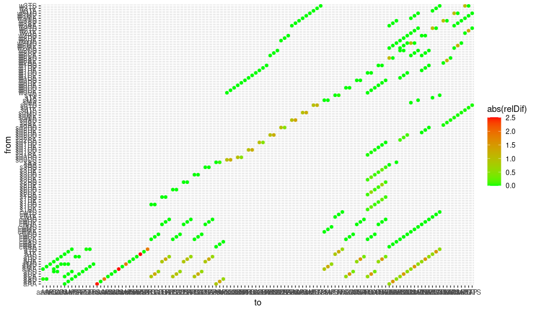

# Development process V de Rijk - logbook

This document will provide details on bug fixes and other adjustments
made to SimpleBox in R and Excel during my internship at the RIVM-DMG
department.

## Updating of documentation

My first task was to update documentation in user vignettes and
Readme.md files. This is an ongoing process, but one that is important
for the publication of the repositories on Github. An example of
adjustments made is for the initial Readme.md file in SbooScripts.

*`Initial version`*

`##Vignettes and their use`

`Getting started and participate: start.md`

`The workflow to use and add data and restructuring the csv file before commit: CSVdata.md`

`Making a variable in the SB context: FirstVars.md`

`Creating and checking flows AirFlow.md`

`The workflow to use when adding a k process relative to a compartment, species or scale: processFlow.md`

`An example for adding and testing a new variable: testRainDropRadius.md`

*New updated version*

`# SimpleBox v4.0`

`This repository and its supporting repository [SBOO](https://github.com/rivm-syso/SBoo) are an implementation of the [SimpleBox model](https://www.rivm.nl/publicaties/simplebox-40-a-multimedia-mass-balance-model-for-evaluating-fate-of-chemical-substances), that was previously in Excel. SimpleBox (SB) is a multimedia mass balance model of the so-called 'Mackay type'. It simulates environmental fate of chemicals as fluxes (mass flows) between a series of well-mixed boxes of air, water, sediment and soil on regional, continental and global spatial scales. The model is capable of handling chemicals, nanomaterials and plastics.`

`## Installation`

`SB is split over two projects. In order to use SBOO you need two projects with the parent folder in common. This repository and the SBOO repository thus need to be stored in the same folder. The working directory of the project should always be set to this folder. More info on the R-servers at RIVM can be found [here](http://wiki.rivm.nl/inwiki/bin/view/StatNMod/RStudio%2BServer).`

`### Dependencies`

`Packages needed for both repositories are defined in [requirements](requirements.txt)`

`## Set-Up`

`This repository includes several vignettes detailing both the set-up of the [project](/vignettes/Development/Readme.md) and theoretical implementation of the [SB Model](/vignettes/Readme.md).`

`-   The Development folder details the technical construction of the project and is most suitable for developers. The vignette [start](/vignettes/Development/start.md) explains the basics of object-oriented modelling and how this is implemented in this repository. Multiple other vignettes are useful if aiming to develop, such as [CSV-reordering](/vignettes/Development/CSVdata.Rmd), [creating variables](vignettes/Development/FirstVars.Rmd), [creating and checking flows](/vignettes/Development/AirFlow.Rmd), [creating processes](vignettes/Development/processFlow.Rmd) and [testing new variables](/vignettes/Development/testRainDropRadius.Rmd).`

`-   The vignette folder outlines the theoretical implementation of the SimpleBox model, following the structure of Chapter 3 in [Schoorl et al. (2015)](https://www.rivm.nl/bibliotheek/rapporten/2015-0161.html)`

`## License`

`\*TODO add license`

## Testing of SimpleBox4Nano - R vs Excel 

The initial test presented large absolute and relative differences.


The largest differences were present between flows in air from Solid to
Particulate species (e.g., aAs_AaP) and Solid to Attached species (e.g.,
aAs_aAA). These relative differences were present on all scales. As
such, debugging was needed. The problems seemed to lie with the
implementation of the HeteroAgglomeration.air flux. This is a
complicated function which is dependent on other functions as well. This
led to two observations:

1.  The Excel Version missed multiplication with the Cunningham factor
    for aerosols and other particles that were not the analyzed
    nanoparticle.

2.  The R-version had a bug in f_diffusivity function leading to the
    function returning solely the first part of the function.

*Excel Version*

*R-Version*

The following code was changed from:

```{r}
f_Diffusivity <- function(Matrix, Temp, DynVisc, rad_species, Cunningham = NULL) {
  if(!is.numeric(Temp)){
    warning("Temp missing in f_Diffusivity")
    return(NA)
  }
  if(!is.numeric(DynVisc)){
    warning("DynVisc missing in f_Diffusivity")
    return(NA)
  }
  if(!is.numeric(rad_species)){
    warning("rad_species missing in f_Diffusivity")
    return(NA)
  }
  kboltz <- constants::syms$k
  if (Matrix == "air") {
    if (is.null(Cunningham))
      Cunningham <- f_Cunningham(rad_species)
    return (kboltz*Temp*Cunningham)/(6*pi*DynVisc*rad_species)
  } else {
    (kboltz*Temp)/(6*pi*DynVisc*rad_species)
  }

}
```

to

```{r}
f_Diffusivity <- function(Matrix, Temp, DynVisc, rad_species, Cunningham = NULL) {
  if(!is.numeric(Temp)){
    warning("Temp missing in f_Diffusivity")
    return(NA)
  }
  if(!is.numeric(DynVisc)){
    warning("DynVisc missing in f_Diffusivity")
    return(NA)
  }
  if(!is.numeric(rad_species)){
    warning("rad_species missing in f_Diffusivity")
    return(NA)
  }
  kboltz <- constants::syms$k
  if (Matrix == "air") {
    if (is.null(Cunningham))
      Cunningham <- f_Cunningham(rad_species)
    return ((kboltz*Temp*Cunningham)/(6*pi*DynVisc*rad_species))
  } else {
    (kboltz*Temp)/(6*pi*DynVisc*rad_species)
  }

}
```

This changed the output from:

```         
 3.631107e-21
```

to

```         
7.095256e-11
```

and the relative differences (for one flow comparison from)

| Flow    | R-old    | Excel-Old | Abs difference | Relative Difference | R-new    | Abs difference | Relative difference  |
|---------|---------|---------|---------|---------|---------|---------|---------|
| aAs_aAP | 2.97e-19 | 1.43e-7   | 1.43e-7        | 4.8e+11             | 1.43e-07 | -8.02e-10      | 5.62e-03             |



