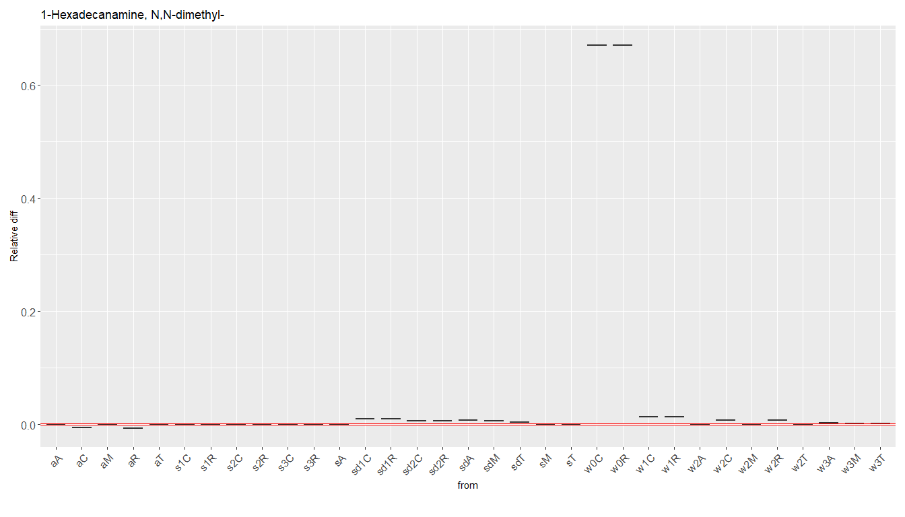
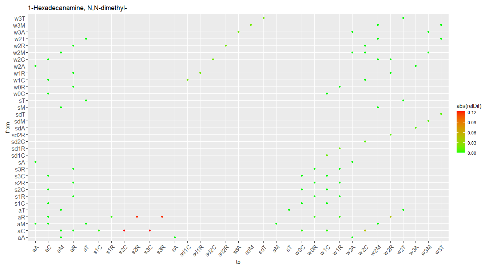
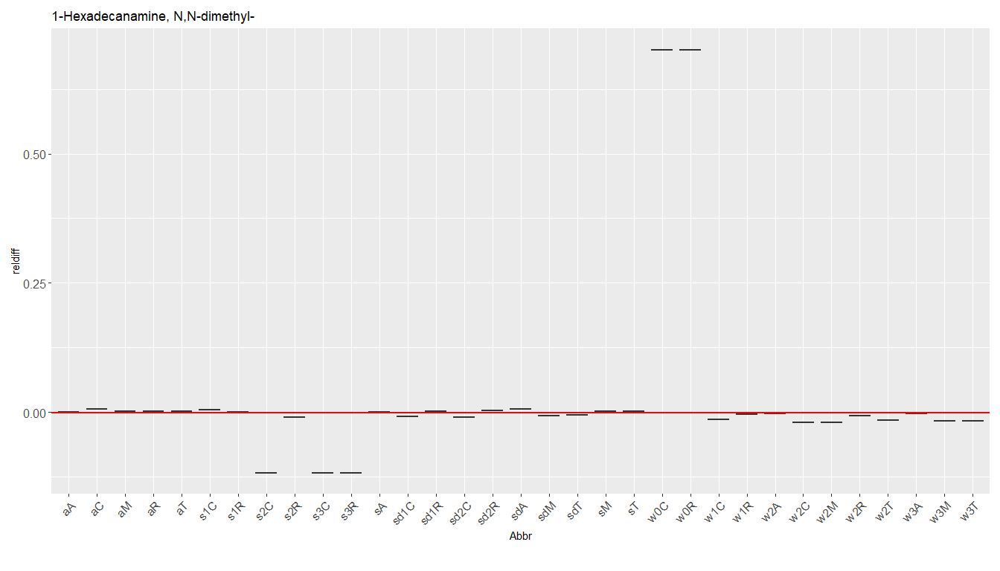
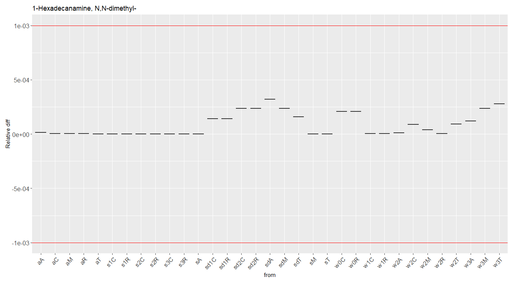
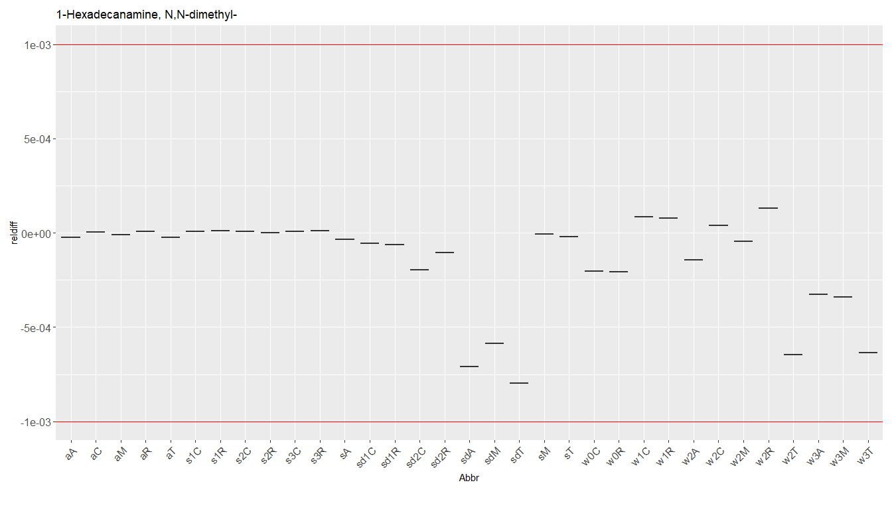
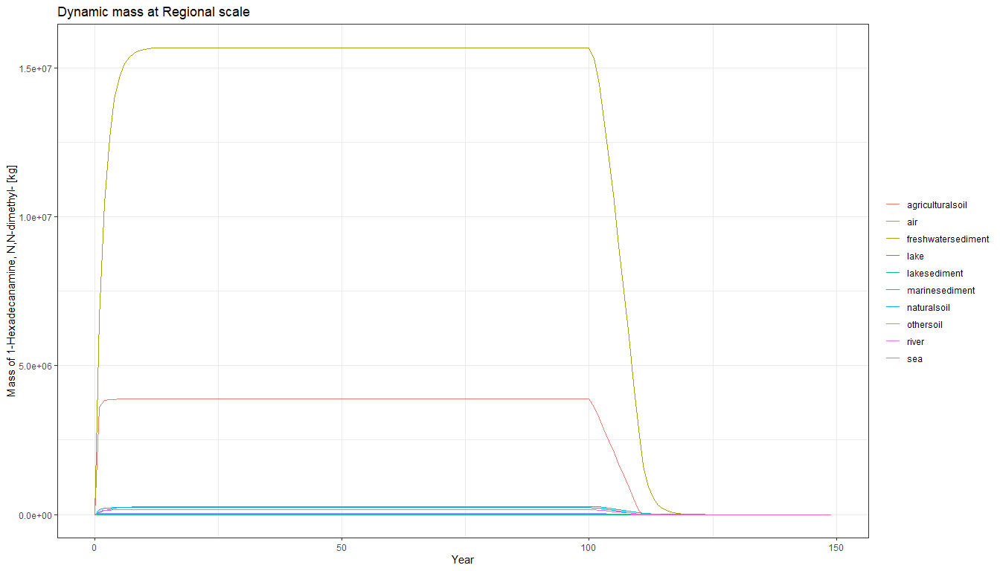
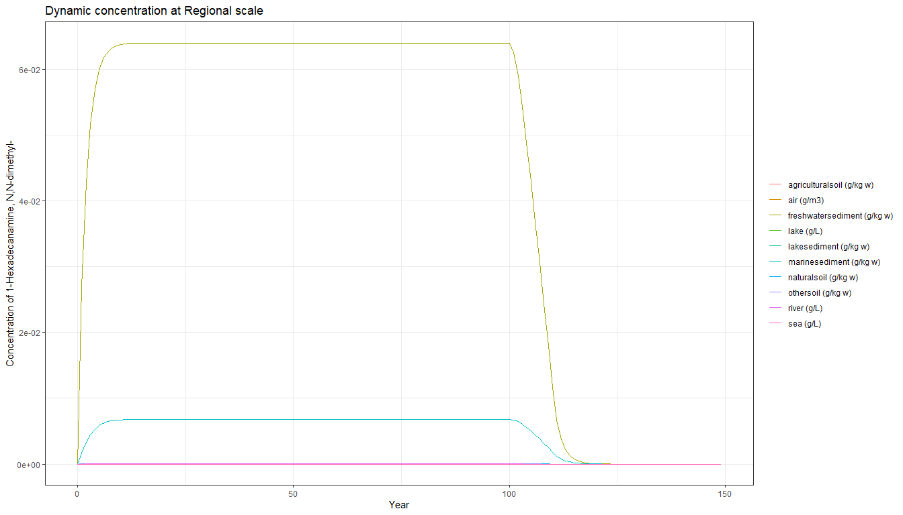
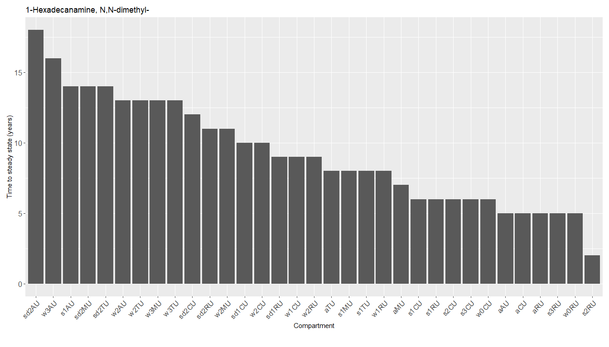

Verification of SimpleBox - spreadsheet versus R implementation for base
organic chemicals
================
Anne Hids, Valerie de Rijk, Matthias Hof and Joris Quik
2025-03-31

This vignette demonstrates the verification process of SimpleBox
implemented in R (version 2024.8.0) and in an Excel<sup>TM</sup>
spreadsheet (xl v4.0.5). To do this the 1<sup>st</sup> order rate
constants (k’s) and steady state masses are compared between the two
model implementations. The differences should be negligible and only
based on rounding errors. In this case we choose a relative difference
of the k’s or masses between the models to not exceed 0.1%.

# Verification method

``` r
# Create a list with the names of substances
Potential_substances <- c(
  "1-aminoanthraquinone", # no class
  "1-HYDROXYANTHRAQUINONE", # acid
  "1-Hexadecanamine, N,N-dimethyl-", # base
  "1-Chloro-2-nitro-propane", # neutral
  "Sb(III)" # metal
)

substance <- Potential_substances[3]

source("baseScripts/initWorld_onlyMolec.R")

World$substance <- substance
```

The SBoo world is initialized for a substance. In this case, that
substance is NA, which is of class: base.

At release already improvements or developments have been implemented in
the R version of SimpleBox (SBoo) which are not implemented in Excel
which will result in differences between the spreadsheet and R
implementation. For this reason a TEST variable has been introduced to
the changed algorithms in R in order to verify the outcome of SimpleBox
in R with the original implementation in the spreadsheet version. So,
TEST variable is a boolean, that can be used to calculate some processes
in R the same way as in excel for the verification without removing the
improvements that are made. For this reason we show the verification in
two steps:

1.  Compare k’s and steady state masses of SBoo with updates to the
    spreadsheet.

2.  Compare k’s and steady state masses of adapted SBoo using TEST
    variable to the spreadsheet.

When comparing k’s and steady state masses between SimpleBox in R and
Excel<sup>TM</sup>, the goal is that the relative difference is less
than 0.1 percent for each k and steady state mass. The reason is that
smaller differences are almost inevitable due to differences in rounding
values between excel and R, and not the result of mistakes in
calculations or input values.

# Step 1. Compare SBoo (incl. updates) to spreadsheet

    ## `summarise()` has grouped output by 'from'. You can override using the
    ## `.groups` argument.

## preliminary matrix check

In the chunk below we check if our matrix is as large as we expect it to
be.

1)  Matrix The SimpleBox model operates over 5 scales, 12
    subcompartments and 4 different speciations. For molecules, this is
    already filtered to only include one species: Unbound. As such, we
    would expect our matrix to have 5 \* 12 \* 1 = 60 rows. However,
    some exceptions exist within our SB world:

- The Regional and Continental scale do now have a deepocean layer (w3),
  reducing the matrix by 2 \* 1 = 2 rows.
- The Global Scales (Arctic, Moderate, Tropic) only have one type of
  soil instead of 3, reducing the matrix by 3 \* 2 = 6 rows.
- The Global Scales (Arctic, Moderate, Tropic) only have one type of
  sediment instead of 3, reducing the matrix by 3 \* 2 = 6 rows.
- The Global Scales (Arctic, Moderate, Tropic) only have one type of
  water instead of 3, reducing the matrix by 3 \* 2 = 6 rows.
- Cloudwater (compartment) does not have any values, reducing our matrix
  by 5 \* 1 \* 1 = 5 rows.

With these exceptions, we expect our matrix to be 60- 25 = 35 rows. This
script will stop running if this is not the case.

2)  We expect all processes to be included in Processes4SpeciesTp.csv to
    also be calculated. Therefore, we compare the calculated unique
    processes with the processes defined in this csv.

<!-- -->

    ## character(0)

## Compare k’s

When comparing k’s between R and excel, the goal is that the relative
difference is less than 1 percentile for each k. The reason is that
smaller differences often are a result of differences in rounding values
between excel and R, and not the result of mistakes in calculations or
different input values. In this vignette two types of k’s are compared:
diagonal k’s and from-to k’s.

At the time of this verification, some improvements were already made in
the R version versus the excel version. This meant that some k’s differ
between R and excel, but not because the calculations or input values
are wrong. In order to still be able to compare the two versions, the
‘Test’ variable was created. This variable is a boolean, that can be
used to calculate some processes in R the same way as in excel for the
verification without removing the improvements that are made. When this
test variable was used and why will be explained below.

### Diagonal k’s

Diagonal k’s are k’s that are on the diagonal of the k matrix. They are
calculated as the sum of all the k’s leaving the subcompartment plus the
sum of the removal process k’s (i.e. degradation or burial).

<figure>

<figcaption aria-hidden="true">Figure 1: Relative differences sum of
from-k’s between R and Spreadsheet implementation of SimpleBox
(Test=FALSE)</figcaption>
</figure>

Figures 1 and 2 above show the absolute and relative differences in
diagonal k’s between R and excel. As can be seen in Figure 2, relative
differences larger than 1 percentile are in the lake, river, sea, air
and sediment subcompartments.

#### Lake difference

The relative difference in lake removal rate is caused by lake
sedimentation being included in R but not in excel. To make an accurate
comparison between R and excel, the Test variable was used to exclude
flows from lake to lakesediment in the processes k_Sedimentation and
k_Adsorption.

#### Settling velocity

The difference in the diagonal k’s for sedimentation comes from a
difference in k’s for the sedimentation and resuspension processes.

This is caused by the use of different formulas to calculate settling
velocity between excel and R. In excel, settling velocity is always
calculated as:

`SetVel <- 2.5/(24*3600)`

While in R, an improved version of this formula is used:

`SetVel <- 2*(radius^2*(rhoParticle-rhoWater)*GN) / (9*DynViscWaterStandard)`

Using the Test variable, the settling velocity formula is temporarily
changed to the formula used in excel for the resuspension ans
sedimentation processes (K_resuspension and k_Sedimentation). This
solves the differences in diagonal k’s related to resuspension or
sedimentation.

#### Degradation

For some substances, the bulk standard degradation rate constant for
air/water/soil/sediment (kdeg) has an input value, while for other
substances this value is calculated. When an input value is available,
this value has 2 decimals in R but more decimals in excel. This can
cause slight differences the k’s where this value is used. Therefore,
these values were rounded in the test files that were used for
comparison to the R output. There is an
[issue](https://github.com/rivm-syso/SBoo/issues/158) to fix this in a
future SBooScript update.

#### Air to soil

The difference in diagonal k’s for air is caused by a different use of
variables to calculate k_Adsorption. This process uses the fraction of
original species in the (pore)water of a subcompartment (FRorig). In
Excel, one FRorig value is used to calculate the adsorption for soil and
one value is used to calculate the adsorption to water. In R however,
the FRorig value for each specific subcompartment (natural soil,
agricultural soil etc.) is used to calculate adsorption. The Test
variable was used to calculate this variable with the same FRorig value
as in excel.

### From-to k’s

<figure>

<figcaption aria-hidden="true">Figure 2: Relative differences from-to
k’s between R and Spreadsheet implementation of SimpleBox
(Test=FALSE)</figcaption>
</figure>

We can filter out the exact k’s that have a relative difference larger
than 0.1%:

| from | to | k_R | fromto_R | k_Excel | fromto_Excel | diff | relDif |
|:---|:---|---:|:---|---:|:---|---:|---:|
| aC | s2C | 1.882858e-06 | aC_s2C | 2.115478e-06 | aC_s2C | -2.326199e-07 | 0.123546170 |
| aC | s3C | 3.138096e-07 | aC_s3C | 3.525796e-07 | aC_s3C | -3.876998e-08 | 0.123546170 |
| aR | s2R | 4.009689e-06 | aR_s2R | 4.490172e-06 | aR_s2R | -4.804829e-07 | 0.119830457 |
| aR | s3R | 6.682815e-07 | aR_s3R | 7.483620e-07 | aR_s3R | -8.008048e-08 | 0.119830457 |
| aC | w2C | 3.482307e-06 | aC_w2C | 3.645614e-06 | aC_w2C | -1.633070e-07 | 0.046896211 |
| aR | w2R | 3.041425e-08 | aR_w2R | 3.180905e-08 | aR_w2R | -1.394798e-09 | 0.045860033 |
| w1C | sd1C | 4.670018e-06 | w1C_sd1C | 4.596199e-06 | w1C_sd1C | 7.381927e-08 | 0.015807062 |
| w1R | sd1R | 4.670018e-06 | w1R_sd1R | 4.596199e-06 | w1R_sd1R | 7.381927e-08 | 0.015807062 |
| w3A | sdA | 4.646497e-09 | w3A_sdA | 4.573050e-09 | w3A_sdA | 7.344677e-11 | 0.015806912 |
| w3M | sdM | 4.646497e-09 | w3M_sdM | 4.573050e-09 | w3M_sdM | 7.344677e-11 | 0.015806912 |
| w3T | sdT | 4.646497e-09 | w3T_sdT | 4.573050e-09 | w3T_sdT | 7.344677e-11 | 0.015806912 |
| w2C | sd2C | 6.969745e-08 | w2C_sd2C | 6.859575e-08 | w2C_sd2C | 1.101702e-09 | 0.015806912 |
| w2R | sd2R | 1.393949e-06 | w2R_sd2R | 1.371915e-06 | w2R_sd2R | 2.203403e-08 | 0.015806912 |
| sd1R | w1R | 3.589714e-08 | sd1R_w1R | 3.542520e-08 | sd1R_w1R | 4.719476e-10 | 0.013147219 |
| sd1C | w1C | 3.591828e-08 | sd1C_w1C | 3.544634e-08 | sd1C_w1C | 4.719460e-10 | 0.013139437 |
| sd2R | w2R | 1.707893e-08 | sd2R_w2R | 1.691711e-08 | sd2R_w2R | 1.618205e-10 | 0.009474862 |
| sd2C | w2C | 1.827893e-08 | sd2C_w2C | 1.811615e-08 | sd2C_w2C | 1.627804e-10 | 0.008905358 |
| sdM | w3M | 1.918928e-08 | sdM_w3M | 1.902746e-08 | sdM_w3M | 1.618205e-10 | 0.008432860 |
| sdA | w3A | 1.919015e-08 | sdA_w3A | 1.902833e-08 | sdA_w3A | 1.618205e-10 | 0.008432477 |
| sdT | w3T | 1.919015e-08 | sdT_w3T | 1.902833e-08 | sdT_w3T | 1.618205e-10 | 0.008432477 |
| aR | w0R | 1.813573e-08 | aR_w0R | 1.817648e-08 | aR_w0R | -4.075162e-11 | 0.002247034 |
| aR | w1R | 1.994931e-07 | aR_w1R | 1.999413e-07 | aR_w1R | -4.482678e-10 | 0.002247034 |
| aR | s1R | 2.016178e-06 | aR_s1R | 2.020577e-06 | aR_s1R | -4.399213e-09 | 0.002181957 |
| aC | w0C | 8.540034e-09 | aC_w0C | 8.555497e-09 | aC_w0C | -1.546263e-11 | 0.001810605 |
| aC | w1C | 9.394038e-08 | aC_w1C | 9.411047e-08 | aC_w1C | -1.700889e-10 | 0.001810605 |
| aC | s1C | 9.502960e-07 | aC_s1C | 9.519650e-07 | aC_s1C | -1.669010e-09 | 0.001756306 |

#### Sedimentation and resuspension

As can be seen in Figure 2 and the table above, the k’s that have a
relative difference larger than 0.1% go from water to sediment or from
sediment to water. Changing the formula for calculating settling
velocity when Test = TRUE for the sedimentation and resuspension
processes (explained above under ‘Settling velocity’) also solves these
differences.

#### Air

This problem was also solved by using the Test variable to use the same
values for FRorig as were used in excel to calculate k_Adsorption

### Steadystate mass

    ## 12 rate constants (k values) equal to 0; removed for solver

    ## `summarise()` has grouped output by 'Scale', 'SubCompart', 'Species'. You can
    ## override using the `.groups` argument.

<figure>

<figcaption aria-hidden="true">Figure 3: Relative differences in steady
state mass per compartment between R (SB1solve) and Spreadsheet
implementation of SimpleBox (Test=FALSE)</figcaption>
</figure>

The differences in k’s drives the model output: the steady state mass.
So a final check is to see how much the steady state masses differ
between both implementations of SimpleBox (Figure 3). From this it is
clear that there are differences up to 70.1%.

# Step 2. Compare SBoo and Spreadsheet excluding updates (Test=TRUE)

Now the value for the Test variable can be changed to TRUE, and the
difference in k’s between excel and R can be tested again:

## Compare first order rate constants

<figure>

<figcaption aria-hidden="true">Figure 4: Relative differences sum of
from-k’s between R and Spreadsheet implementation of SimpleBox
(Test=TRUE)</figcaption>
</figure>

<figure>

<figcaption aria-hidden="true">Figure 5: Relative differences from-to
k’s between R and Spreadsheet implementation of SimpleBox
(Test=TRUE)</figcaption>
</figure>

As can be seen in Figures 4 and 5, the temporary changes made using the
Test variable solved the large differences in k’s between R and excel
for both the diagonal and the from-to k’s. All relative differences are
now smaller than 1 percentile.

## Steadystate mass

    ## 12 rate constants (k values) equal to 0; removed for solver

    ## `summarise()` has grouped output by 'Scale', 'SubCompart', 'Species'. You can
    ## override using the `.groups` argument.

<figure>

<figcaption aria-hidden="true">Figure 6: Relative differences in steady
state mass per compartment between R (SB1solve) and Spreadsheet
implementation of SimpleBox (Test=TRUE)</figcaption>
</figure>

To test if the small differences (\<0.1%) in first order rate constants
is negligible (Figures 4 and 5), the steady state masses should also not
differ by more than 0.1% between the R and Spreadsheet implementations
of SimpleBox. This is indeed the case (Figure 6) as the max difference
in now only 0.08%. This proves that the port of SimpleBox to R is
successful in reproducing the results from the original spreadsheet
implementation for chemicals of class base.

# Step 3. Verify dynamic solver

The dynamic solver can use time explicit emissions and provide masses or
concentrations in time. This shows the increase in mass in each
compartment in time based on a specified emission, see
[here](vignettes/10.0-Solver-use.md "Solver documentation") for more
details. Below we verify that with constant emission in time the steady
state mass is approached as verified with Excel above.

``` r
emissions1 <-
  # create emission scenario in time:
  data.frame(
    Emis = c(10000, 10000, 0, 0), # emission in kg/year
    Time = c(0, 100, 110, 150)
  ) # years from start

# apply emission scenario to intended species and compartments using hte Abbr:
emissions <- 
  merge(emissions1, data.frame(Abbr = c("aRU", "s2RU", "w1RU", "aAU","w2AU" )))
emissions[emissions$Abbr == "aAU","Emis"]  <- emissions[emissions$Abbr == "aAU","Emis"] /100
emissions[emissions$Abbr == "w2AU","Emis"]  <- emissions[emissions$Abbr == "w2AU","Emis"] /100

# convert time to seconds and emission to kg/s
emissions <- emissions |>
  mutate(
    Emis = Emis * 1000 / (365.25 * 24 * 60 * 60),
    Time = Time * (365.25 * 24 * 60 * 60)
  ) |>
  ungroup()


tmax <- max(emissions$Time) # set max solve time to last step in emission scenario
tmin <- min(emissions$Time)
nTIMES <- 1 + max(emissions$Time) / (365.25 * 24 * 60 * 60) # Sets the time step for output, e.g. for 20 year scenario, add t0 is 21 nTimes


# Initialize the dynamic solver
World$NewSolver("DynamicSolver")
World$Solve(emissions = emissions, tmin = tmin, tmax = tmax, nTIMES = nTIMES)
```

    ## 12 rate constants (k values) equal to 0; removed for solver

``` r
masses <- as_tibble(World$Masses())
emission <- World$Emissions()
concentration <- World$Concentration()
```

    ## Joining with `by = join_by(Scale, SubCompart)`

``` r
World$PlotMasses()
```

    ## [1] "No scale was given to function, Regional scale is selected"

<!-- -->

``` r
World$PlotConcentration()
```

    ## Joining with `by = join_by(Scale, SubCompart)`

    ## [1] "No scale was given to function, Regional scale is selected"

    ## Joining with `by = join_by(Scale, SubCompart)`

<!-- -->

``` r
masses |> distinct(Abbr)
```

    ## # A tibble: 35 × 1
    ##    Abbr 
    ##    <chr>
    ##  1 aRU  
    ##  2 w1RU 
    ##  3 w0RU 
    ##  4 w2RU 
    ##  5 sd1RU
    ##  6 sd0RU
    ##  7 sd2RU
    ##  8 s1RU 
    ##  9 s2RU 
    ## 10 s3RU 
    ## # ℹ 25 more rows

``` r
# calculate time to steady state
Time2SteadyState <-
  # SSsolveD.R |>
   masses |> 
  rename(Dynamic_Mass_kg = Mass_kg) |> 
  left_join(SSsolve.R_orig |>
              mutate(
                SS_Mass_kg = Mass_kg,
                .keep = "unused"
              )) |>
  mutate(FractionSS = Dynamic_Mass_kg / SS_Mass_kg) |>
  filter(FractionSS > 0.99) |>
  ungroup() |>
  group_by(Abbr) |>
  summarise(SS_time_y = min(as.numeric(time)) / (365.25 * 24 * 60 * 60)) |>
  arrange(desc(SS_time_y))
```

    ## Joining with `by = join_by(Abbr)`

``` r
ggplot(Time2SteadyState, aes(x = reorder(Abbr, -SS_time_y), y = SS_time_y)) +
  geom_bar(stat = "identity") +
  ggtitle(paste0(substance)) +
  labs(
    x = "Compartment",
    y = "Time to steady state (years)"
  ) +
  custom_theme()
```

<!-- -->

``` r
if (length(unique(Time2SteadyState$Abbr)) != length(unique(SSsolve.R$Abbr))) {
  warning(paste("Compartments",
                unique(SSsolve.R$Abbr)[!(unique(SSsolve.R$Abbr) %in% unique(Time2SteadyState$Abbr))],
                "not reaching steady state within", 
                emissions1$Time[2] , "years"))
}

test_dynamic_2 <-
  as_tibble(masses) |> 
  rename(Dynamic_Mass_kg = Mass_kg) |> 
  left_join(SSsolve.R_orig |>
              mutate(
                SS_Mass_kg = Mass_kg,
                .keep = "unused"
              )) |>
  mutate(FractionSS = Dynamic_Mass_kg / SS_Mass_kg) |>
  filter(FractionSS > 1.001)
```

    ## Joining with `by = join_by(Abbr)`

``` r
if (length(test_dynamic_2$Abbr) > 0) {
  stop(paste0("Compartment ", test_dynamic_2$Abbr, "exceeding steady state"))
}
```
