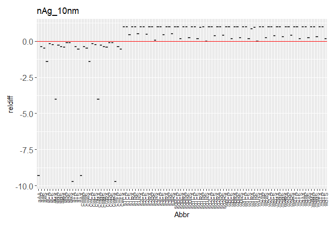

Verification of SimpleBox4Nano - spreadsheet versus R implementation
================
Valerie de Rijk, Anne Hids, Matthias Hof and Joris Quik
2024-08-26

This vignette demonstrates the verification process of SimpleBox
implemented in R (version 2024.8.0) and in an Excel<sup>TM</sup>
spreadsheet (xl4plastic v4.0.5). To do this the 1<sup>st</sup> order
rate constants (k’s) and steady state masses are compared between the
two model implementations. The differences should be negligible and only
based on rounding errors. In this case we choose a relative difference
of the k’s or masses between the models to not exceed 0.1%.

# Verification method

``` r
substance <- "nAg_10nm"

source("baseScripts/initWorld_onlyParticulate.R")

World$substance <- substance
```

The SBoo world is initialized for a substance. In this case, that
substance is NA, which is of class: particle and a default radius of 5
nm.

At release already improvements or developments have been implemented in
the R version of SimpleBox (SBoo) which are not implemented in Excel
which will result in differences between the spreadsheet and R
implementation. For this reason a TEST variable has been introduced to
the changed algorithms in R in order to verify the outcome of SimpleBox
in R with the original implementation in the spreadsheet version. So,
TEST variable is a boolean, that can be used to calculate some processes
in R the same way as in excel for the verification without removing the
improvements that are made. For this reason we show the verification in
two steps:

1.  Compare k’s and steady state masses of SBoo with updates to the
    spreadsheet.

2.  Compare k’s and steady state masses of adapted SBoo using TEST
    variable to the spreadsheet.

When comparing k’s and steady state masses between SimpleBox in R and
Excel<sup>TM</sup>, the goal is that the relative difference is less
than 0.1 percent for each k and steady state mass. The reason is that
smaller differences are almost inevitable due to differences in rounding
values between excel and R, and not the result of mistakes in
calculations or input values.

# Step 1. Compare SBoo (incl. updates) to spreadsheet

## preliminary matrix check

In the chunk below we check if our matrix is as large as we expect it to
be.

1)  Matrix The SimpleBox model operates over 5 scales, 12
    subcompartments and 4 different speciations. As such, we would
    expect our matrix to have 5 \* 12 \* 4 = 240 rows. However, some
    exceptions exist within our SB world:

- The Regional and Continental scale do now have a deepocean layer (w3),
  reducing the matrix by 2 \* 1 \* 4 = 8 rows.
- The Global Scales (Arctic, Moderate, Tropic) only have one type of
  soil instead of 3, reducing the matrix by 3 \* 2 \* 4 = 24 rows.
- The Global Scales (Arctic, Moderate, Tropic) only have one type of
  sediment instead of 3, reducing the matrix by 3 \* 2 \* 4 = 24 rows.
- The Global Scales (Arctic, Moderate, Tropic) only have one type of
  water instead of 3, reducing the matrix by 3 \* 2 \* 4 = 24 rows.
- Cloudwater (compartment) does not have any values, reducing our matrix
  by 5 \* 1 \* 1 = 5 rows.

With these exceptions, we expect our matrix to be 240-85 = 155 rows.
This script will stop running if this is not the case.

2)  We expect all processes to be included in Processes4SpeciesTp.csv to
    also be calculated. Therefore, we compare the calculated unique
    processes with the processes defined in this csv.

<!-- -->

    ## character(0)

## Compare first order rate constants

Two approaches are taken to comparing the ‘engine’ matrix of k’s. First
only the diagonal is taken and compared because this consists of all the
k’s relevant for that ‘from’ compartment including the removal
processes. Second, the separate k’s are compared per ‘from’ and ‘to’
compartment.

In summary k’s are compared using:

1.  The diagonal sum of k’s (from + removal)

2.  The separate from-to k’s

### Diagonal sum of ‘from’ k’s

Diagonal k’s are k’s that are on the diagonal of the k matrix. They are
calculated as the sum of all the k’s leaving the subcompartment plus the
sum of the removal process k’s (i.e. degradation or burial).

<figure>

<figcaption aria-hidden="true">Figure 1: Relative differences sum of
from-k’s between R and Spreadsheet implementation of SimpleBox
(Test=FALSE)</figcaption>
</figure>

#### Dissolution

As can be seen in Figure 2 above, there are large relative differences
between the diagonal k’s in excel and R in the soil compartment. This
difference is caused by dissolution (kdis) not being implemented in R,
whereas it is implemented in excel. When using Test=TRUE, the kdis
values in R are added to the kdeg values to recreate the removal from
soil as it is implemented in excel.

#### Dry deposition

The other relative differences between the diagonal k’s in excel and R
are in the air compartment. This is caused by a difference in the dry
deposition process. In R, dry deposition is implemented in a new manner,
according to the Loteur v2 reference guide. See v.2.2002
<https://www.rivm.nl/lotos-euros>.

When using Test=TRUE, the implementation of dry deposition in R is
temporarily set to the old implementation that was used in excel.

### From-to k’s

<figure>

<figcaption aria-hidden="true">Figure 2: Relative differences from-to
k’s between R and Spreadsheet implementation of SimpleBox
(Test=FALSE)</figcaption>
</figure>

We can filter out the exact k’s that have a relative difference larger
than 0.1%:

| from | to   |          k_R | fromto_R |      k_Excel | fromto_Excel |          diff |      relDif |
|:-----|:-----|-------------:|:---------|-------------:|:-------------|--------------:|------------:|
| aCA  | s2CA | 6.712052e-07 | aCA_s2CA | 7.977049e-08 | aCA_s2CA     |  5.914348e-07 | 0.881153353 |
| aRA  | s2RA | 1.380191e-06 | aRA_s2RA | 1.640311e-07 | aRA_s2RA     |  1.216160e-06 | 0.881153352 |
| aAA  | sAA  | 7.533075e-07 | aAA_sAA  | 1.039227e-07 | aAA_sAA      |  6.493848e-07 | 0.862044781 |
| aCA  | s3CA | 9.488775e-08 | aCA_s3CA | 1.329508e-08 | aCA_s3CA     |  8.159267e-08 | 0.859886210 |
| aRA  | s3RA | 1.951165e-07 | aRA_s3RA | 2.733852e-08 | aRA_s3RA     |  1.677780e-07 | 0.859886210 |
| aCA  | s1CA | 2.558862e-07 | aCA_s1CA | 3.589672e-08 | aCA_s1CA     |  2.199895e-07 | 0.859716092 |
| aMA  | sMA  | 9.786626e-07 | aMA_sMA  | 1.372906e-07 | aMA_sMA      |  8.413720e-07 | 0.859716092 |
| aRA  | s1RA | 5.261758e-07 | aRA_s1RA | 7.381399e-08 | aRA_s1RA     |  4.523618e-07 | 0.859716092 |
| aTA  | sTA  | 5.998438e-07 | aTA_sTA  | 8.506678e-08 | aTA_sTA      |  5.147770e-07 | 0.858185114 |
| aCS  | s2CS | 2.621367e-06 | aCS_s2CS | 9.718135e-07 | aCS_s2CS     |  1.649554e-06 | 0.629272296 |
| aRS  | s2RS | 5.390286e-06 | aRS_s2RS | 1.998328e-06 | aRS_s2RS     |  3.391958e-06 | 0.629272296 |
| aAS  | sAS  | 3.415423e-06 | aAS_sAS  | 1.284810e-06 | aAS_sAS      |  2.130614e-06 | 0.623821244 |
| aCS  | s3CS | 4.203858e-07 | aCS_s3CS | 1.619689e-07 | aCS_s3CS     |  2.584169e-07 | 0.614713637 |
| aRS  | s3RS | 8.644342e-07 | aRS_s3RS | 3.330547e-07 | aRS_s3RS     |  5.313795e-07 | 0.614713637 |
| aCS  | s1CS | 1.134645e-06 | aCS_s1CS | 4.373161e-07 | aCS_s1CS     |  6.973287e-07 | 0.614578869 |
| aMS  | sMS  | 4.339563e-06 | aMS_sMS  | 1.672559e-06 | aMS_sMS      |  2.667004e-06 | 0.614578869 |
| aRS  | s1RS | 2.333156e-06 | aRS_s1RS | 8.992477e-07 | aRS_s1RS     |  1.433909e-06 | 0.614578869 |
| aTS  | sTS  | 2.626922e-06 | aTS_sTS  | 1.026195e-06 | aTS_sTS      |  1.600727e-06 | 0.609354588 |
| aAA  | w2AA | 1.687410e-06 | aAA_w2AA | 6.758685e-07 | aAA_w2AA     |  1.011542e-06 | 0.599463966 |
| aRA  | w2RA | 1.264459e-08 | aRA_w2RA | 5.076051e-09 | aRA_w2RA     |  7.568540e-09 | 0.598559485 |
| aMA  | w2MA | 1.451409e-06 | aMA_w2MA | 5.826545e-07 | aMA_w2MA     |  8.687548e-07 | 0.598559472 |
| aCA  | w2CA | 1.497289e-06 | aCA_w2CA | 6.010724e-07 | aCA_w2CA     |  8.962163e-07 | 0.598559472 |
| aTA  | w2TA | 2.067768e-06 | aTA_w2TA | 8.311476e-07 | aTA_w2TA     |  1.236621e-06 | 0.598046077 |
| aCA  | w1CA | 3.865207e-08 | aCA_w1CA | 1.670066e-08 | aCA_w1CA     |  2.195142e-08 | 0.567923401 |
| aCA  | w0CA | 3.513825e-09 | aCA_w0CA | 1.518241e-09 | aCA_w0CA     |  1.995583e-09 | 0.567923401 |
| aRA  | w1RA | 7.947979e-08 | aRA_w1RA | 3.434136e-08 | aRA_w1RA     |  4.513843e-08 | 0.567923401 |
| aRA  | w0RA | 7.225435e-09 | aRA_w0RA | 3.121941e-09 | aRA_w0RA     |  4.103494e-09 | 0.567923401 |
| aAS  | w2AS | 5.605552e-06 | aAS_w2AS | 2.647952e-06 | aAS_w2AS     |  2.957600e-06 | 0.527619742 |
| aRS  | w2RS | 4.119670e-08 | aRS_w2RS | 1.953491e-08 | aRS_w2RS     |  2.166179e-08 | 0.525813667 |
| aMS  | w2MS | 4.728763e-06 | aMS_w2MS | 2.242315e-06 | aMS_w2MS     |  2.486448e-06 | 0.525813651 |
| aCS  | w2CS | 4.878240e-06 | aCS_w2CS | 2.313195e-06 | aCS_w2CS     |  2.565045e-06 | 0.525813651 |
| aTS  | w2TS | 6.664389e-06 | aTS_w2TS | 3.166802e-06 | aTS_w2TS     |  3.497587e-06 | 0.524817341 |
| aCS  | w0CS | 1.144821e-08 | aCS_w0CS | 7.472103e-09 | aCS_w0CS     |  3.976111e-09 | 0.347312791 |
| aCS  | w1CS | 1.259303e-07 | aCS_w1CS | 8.219313e-08 | aCS_w1CS     |  4.373722e-08 | 0.347312791 |
| aRS  | w0RS | 2.354082e-08 | aRS_w0RS | 1.536479e-08 | aRS_w0RS     |  8.176029e-09 | 0.347312791 |
| aRS  | w1RS | 2.589490e-07 | aRS_w1RS | 1.690127e-07 | aRS_w1RS     |  8.993631e-08 | 0.347312791 |
| aAS  | aAA  | 3.691861e-05 | aAS_aAA  | 3.793379e-05 | aAS_aAA      | -1.015175e-06 | 0.027497635 |
| aTS  | aTA  | 3.996242e-05 | aTS_aTA  | 3.935090e-05 | aTS_aTA      |  6.115157e-07 | 0.015302271 |
| aAS  | aAP  | 1.426617e-07 | aAS_aAP  | 1.434667e-07 | aAS_aAP      | -8.049447e-10 | 0.005642332 |
| aTS  | aTP  | 1.601757e-07 | aTS_aTP  | 1.596345e-07 | aTS_aTP      |  5.411832e-10 | 0.003378685 |

#### Dry deposition

As can be seen in Figure 4, the largest relative differences in k’s
between R and excel are in the k’s from air to soil and water. These
differences can also be attributed to the different implementation of
the dry deposition process between excel and R.

#### Thermal velocity heteroagglomeration

A smaller difference that was found between the k’s in R and excel is
the value for thermal velocity in heteroagglomeration. In excel, a
constant value of 285K was used. In R, this value was updated by
calculating the value specifically for the temperature of the current
scale.

### Steadystate mass

<figure>

<figcaption aria-hidden="true">Figure 3: Relative differences in steady
state mass per compartment between R (SB1solve) and Spreadsheet
implementation of SimpleBox (Test=FALSE)</figcaption>
</figure>

The differences in k’s drives the model output: the steady state mass.
So a final check is to see how much the steady state masses differ
between both implementations of SimpleBox (Figure 3). From this it is
clear that there are differences up to 100%. This is larger than the
level we can consider negligible.

# Step 2. Compare SBoo and Spreadsheet excluding updates (Test=TRUE)

The verification’s goal is to make sure no mistakes are made in porting
SimpleBox from the spreadsheet implementation to R. For this reason the
Test variable was included in algorithms that already implemented
changes for specific variables or processes in SimpleBox. With the Test
variable changed to TRUE the difference in k’s and steady state masses
is shown again in relation to the intended 0.1% verification level.

    ##       x Test
    ## 1 FALSE TRUE

## Compare first order rate constants

<figure>

<figcaption aria-hidden="true">Figure 4: Relative differences sum of
from-k’s between R and Spreadsheet implementation of SimpleBox
(Test=TRUE)</figcaption>
</figure>

<figure>

<figcaption aria-hidden="true">Figure 5: Relative differences from-to
k’s between R and Spreadsheet implementation of SimpleBox
(Test=TRUE)</figcaption>
</figure>

As can be seen in Figures 5 and 6, there are no k’s with a relative
difference large than 0.1% between excel and R when Test=TRUE.

## Steadystate mass

<figure>

<figcaption aria-hidden="true">Figure 6: Relative differences in steady
state mass per compartment between R (SB1solve) and Spreadsheet
implementation of SimpleBox (Test=TRUE)</figcaption>
</figure>

To test if the small differences (\<0.1%) in first order rate constants
is negligible (Figures 4 and 5), the steady state masses should also not
differ by more than 0.1% between the R and Spreadsheet implementations
of SimpleBox. This is indeed the case (Figure 6) as the max difference
in now only 0.03%. This proves that the port of SimpleBox4Plastics to R
is successful in reproducing the results from the original spreadsheet
implementation.
