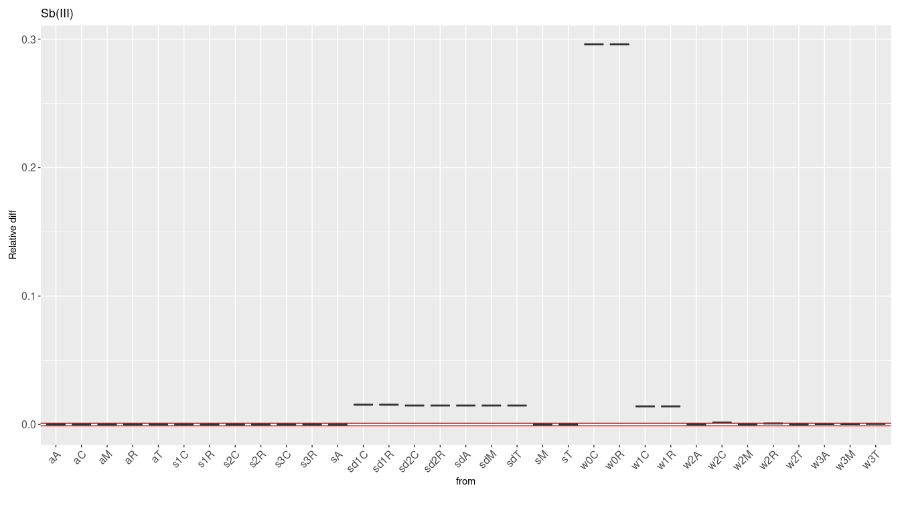
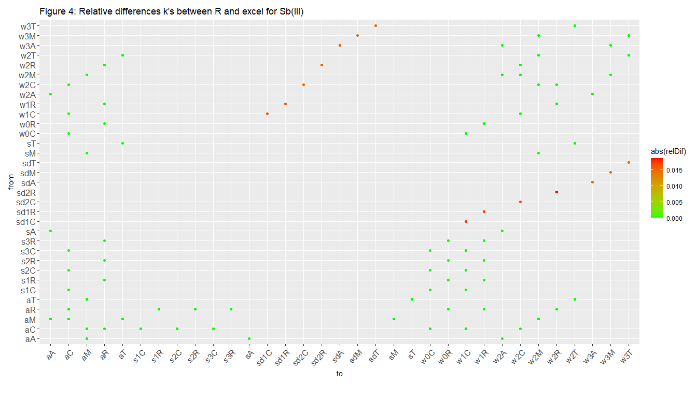
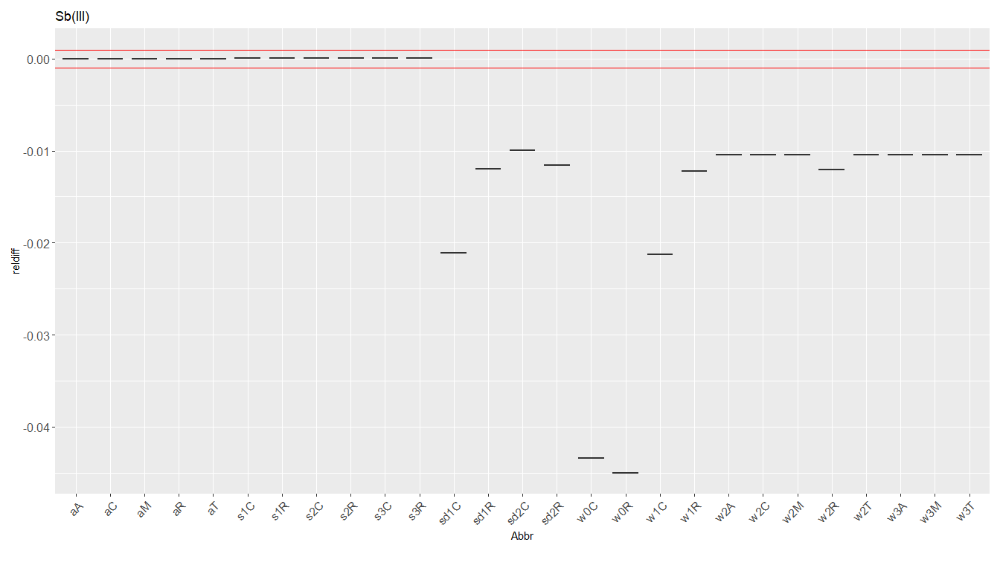
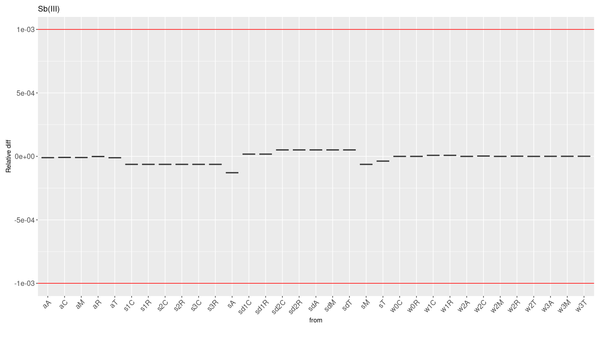
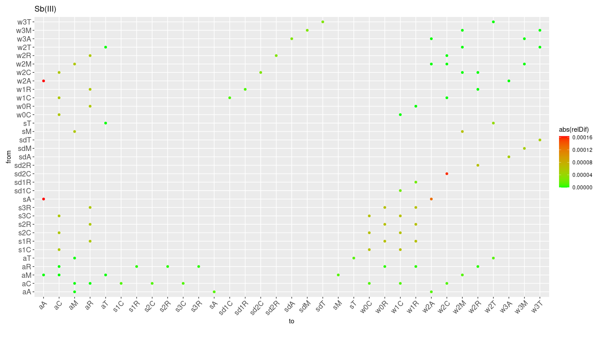
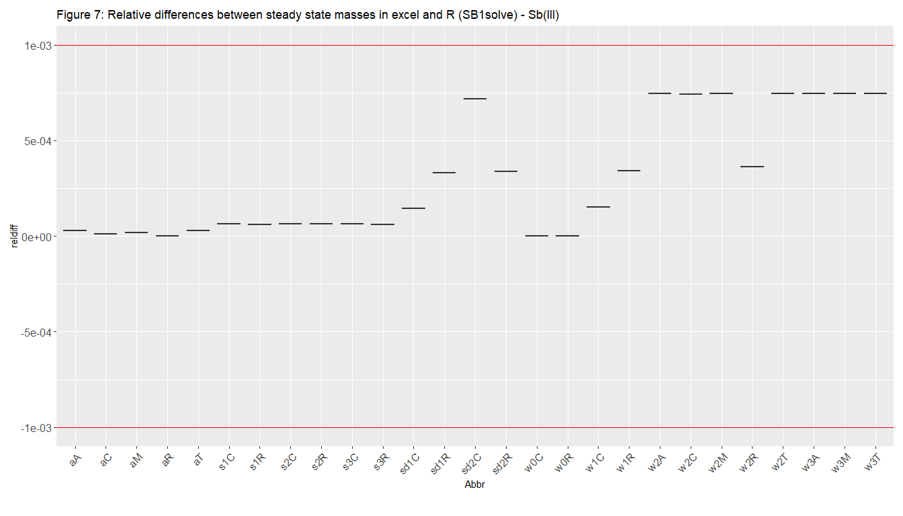

Verification of SimpleBox - spreadsheet versus R implementation for
metals
================
Anne Hids, Valerie de Rijk, Matthis Hof and Joris Quik
2024-08-16

This vignette demonstrates the verification process of SimpleBox
implemented in R (version 2024.8.0) and in an ExcelTM
spreadsheet (xl v4.0.5). To do this the 1st order rate
constants (k’s) and steady state masses are compared between the two
model implementations. The differences should be negligible and only
based on rounding errors. In this case we choose a relative difference
of the k’s or masses between the models to not exceed 0.1%.

# Verification method

The SBoo world is initialized for a substance. In this case, that
substance is Sb(III), which is of class: metal.

At release already improvements or developments have been implemented in
the R version of SimpleBox (SBoo) which are not implemented in Excel
which will result in differences between the spreadsheet and R
implementation. For this reason a TEST variable has been introduced to
the changed algorithms in R in order to verify the outcome of SimpleBox
in R with the original implementation in the spreadsheet version. So,
TEST variable is a boolean, that can be used to calculate some processes
in R the same way as in excel for the verification without removing the
improvements that are made. For this reason we show the verification in
two steps:

1.  Compare k’s and steady state masses of SBoo with updates to the
    spreadsheet.

2.  Compare k’s and steady state masses of adapted SBoo using TEST
    variable to the spreadsheet.

When comparing k’s and steady state masses between SimpleBox in R and
ExcelTM, the goal is that the relative difference is less
than 0.1 percent for each k and steady state mass. The reason is that
smaller differences are almost inevitable due to differences in rounding
values between excel and R, and not the result of mistakes in
calculations or input values.

# Step 1. Compare SBoo (incl. updates) to spreadsheet

## Compare first order rate constants

When comparing k’s between R and excel, the goal is that the relative
difference is less than 1 percentile for each k. The reason is that
smaller differences often are a result of differences in rounding values
between excel and R, and not the result of mistakes in calculations or
different input values. In this vignette two types of k’s are compared:
diagonal k’s and from-to k’s.

At the time of this verification, some improvements were already made in
the R version versus the excel version. This meant that some k’s differ
between R and excel, but not because the calculations or input values
are wrong. In order to still be able to compare the two versions, the
‘Test’ variable was created. This variable is a boolean, that can be
used to calculate some processes in R the same way as in excel for the
verification without removing the improvements that are made. When this
test variable was used and why will be explained below.

### Diagonal sum of ‘from’ k’s

Diagonal k’s are k’s that are on the diagonal of the k matrix. They are
calculated as the sum of all the k’s leaving the subcompartment plus the
sum of the removal process k’s (i.e. degradation or burial).

<figure>

<figcaption aria-hidden="true">Figure 1: Relative differences sum of
from-k’s between R and Spreadsheet implementation of SimpleBox
(Test=FALSE)</figcaption>
</figure>

As can be seen in Figure 1, relative differences larger than 0.1% are in
the lake and sediment subcompartments.

#### Lake difference

The relative difference in lake removal rate is caused by lake
sedimentation being included in R but not in excel. To make an accurate
comparison between R and excel, the Test variable was used to exclude
flows from lake to lakesediment in the processes k_Sedimentation and
k_Adsorption.

#### Settling velocity

The difference in the diagonal k’s for sedimentation comes from a
difference in k’s for the sedimentation and resuspension processes.

This is caused by the use of different formulas to calculate settling
velocity between excel and R. In excel, settling velocity is always
calculated as:

`SetVel <- 2.5/(24*3600)`

While in R, an improved version of this formula is used:

`SetVel <- 2*(radius^2*(rhoParticle-rhoWater)*GN) / (9*DynViscWaterStandard)`

Using the Test variable, the settling velocity formula is temporarily
changed to the formula used in excel for the resuspension and
sedimentation processes (K_resuspension and k_Sedimentation). This
solves the differences in diagonal k’s related to resuspension or
sedimentation.

### From-to k’s

<figure>

<figcaption aria-hidden="true">Figure 2: Relative differences from-to
k’s between R and Spreadsheet implementation of SimpleBox
(Test=FALSE)</figcaption>
</figure>

#### Sedimentation and resuspension

As can be seen in Figure 2 and the table above, the k’s that have a
relative difference larger than 0.1% go from water to sediment or from
sediment to water. Changing the formula for calculating settling
velocity when Test = TRUE for the sedimentation and resuspension
processes (explained above under ‘Settling velocity’) also solves these
differences.

### Steadystate mass

<figure>

<figcaption aria-hidden="true">Figure 3: Relative differences in steady
state mass per compartment between R (SB1solve) and Spreadsheet
implementation of SimpleBox (Test=FALSE)</figcaption>
</figure>

The differences in k’s drives the model output: the steady state mass.
So a final check is to see how much the steady state masses differ
between both implementations of SimpleBox (Figure 3). From this it is
clear that there are differences up to 4.5%.

# Step 2. Compare SBoo and Spreadsheet excluding updates (Test=TRUE)

Now the value for the Test variable can be changed to TRUE, and the
difference in k’s between excel and R can be tested again:

    ##       x Test
    ## 1 FALSE TRUE

## Compare first order rate constants

<figure>

<figcaption aria-hidden="true">Figure 4: Relative differences sum of
from-k’s between R and Spreadsheet implementation of SimpleBox
(Test=TRUE)</figcaption>
</figure>

<figure>

<figcaption aria-hidden="true">Figure 5: Relative differences from-to
k’s between R and Spreadsheet implementation of SimpleBox
(Test=TRUE)</figcaption>
</figure>

As can be seen in Figures 4 and 5, the temporary changes made using the
Test variable solved the large differences in k’s between R and excel
for both the diagonal and the from-to k’s. All relative differences are
now smaller than 1 percentile.

## Steadystate mass

<figure>

<figcaption aria-hidden="true">Figure 6: Relative differences in steady
state mass per compartment between R (SB1solve) and Spreadsheet
implementation of SimpleBox (Test=TRUE)</figcaption>
</figure>

To test if the small differences (\<0.1%) in first order rate constants
is negligible (Figures 4 and 5), the steady state masses should also not
differ by more than 0.1% between the R and Spreadsheet implementations
of SimpleBox. This is indeed the case (Figure 6) as the max difference
in now only 0.1%. This proves that the port of SimpleBox to R is
successful in reproducing the results from the original spreadsheet
implementation for chemicals of class metal.
